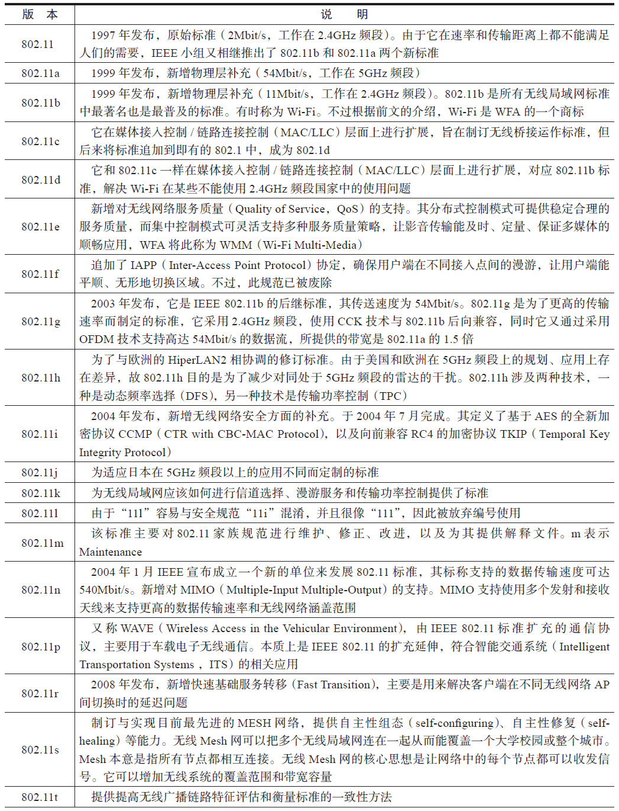
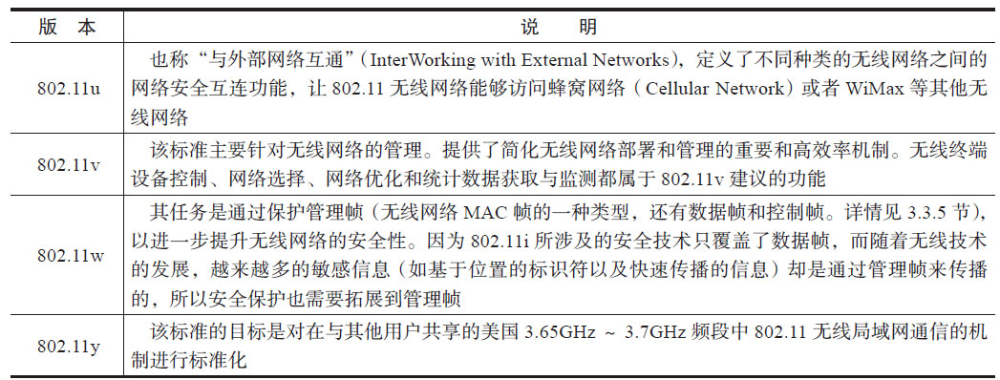

# 3.2.2 IEEE 802.11发展历程

使用过Wi-Fi的读者或多或少都接触过IEEE802.11，它到底代表什么呢？

IEEE（InstituteofElectricalandElectronicsEngineers）是美国电气和电子工程师协会的简称。802是该组织中一个专门负责制定局域网标准的委员会，也称为LMSC（LAN/MANStandardsCommittee，局域网/城域网标准委员会）​。该委员会成立于1980年2月，其任务就是制定局域网和城域网标准。

由于工作量较大，该委员会被细分成多个工作组（WorkingGroup）​，每个工作组负责解决某个特定方面问题的标准。工作组也会被赋予一个编号（位于802编号的后面，中间用点号隔开）​，故802.11代表802项目的第11个[3]工作组，专门负责制订无线局域网（WirelessLAN）的介质访问控制协议（MediumAccessControl，MAC）及物理层（PhysicalLayer，PHY）技术规范。

和工作组划分类似，工作组内部还会细分为多个任务组（TaskGroup，TG）​，任务是修改、更新标准的某个特定方面。TG的编号为英文字母，如a、b、c等。

提示TG编号使用大小写字母，其含义不同，小写字母的编号代表该标准不能单独存在。例如802.11b代表它是在802.11上进行的修订工作，其本身不能独立存在。而大写字母的编号代表这是一种体系完备的独立标准，如802.1X是处理安全方面的一种独立标准。

802.11制定了无线网络技术的规范，其发展历经好几个版本。表3-1是IEEE802.11各版本[4]的简单介绍。

表3-1802.11各版本简单介绍

（续）

提示可从IEEE官方网站下载802.11-2012标准PDF全文（下载地址为hp://standards.ieee.org/about/get/802/802.11.html）​，长达2793页，包含从802.11a到802.11z各个版本（包括a、b、d、e、g、h、i、j、k、n、p、r、s、u、v、w、y、z）所涉及的技术规范。
