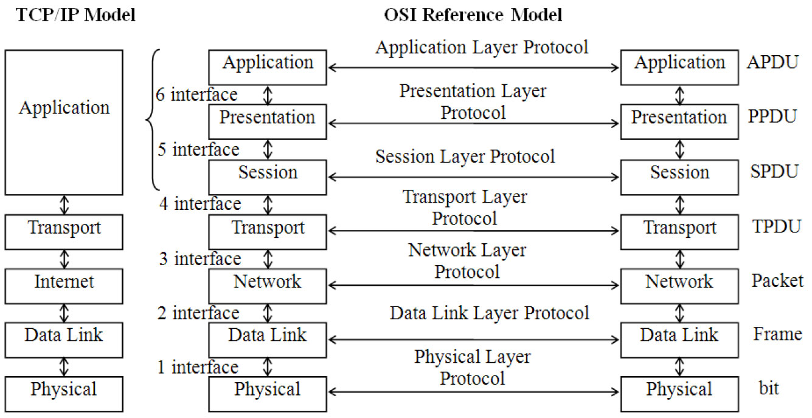
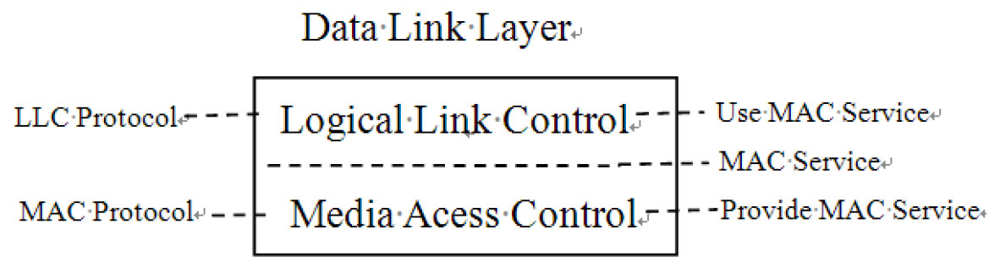
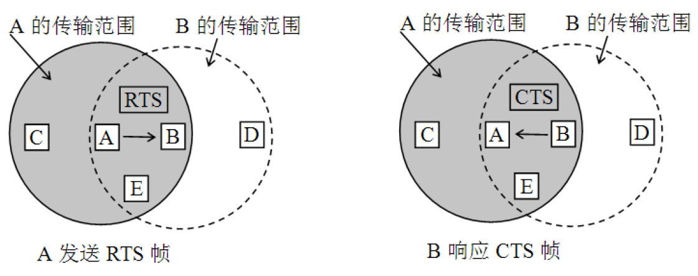
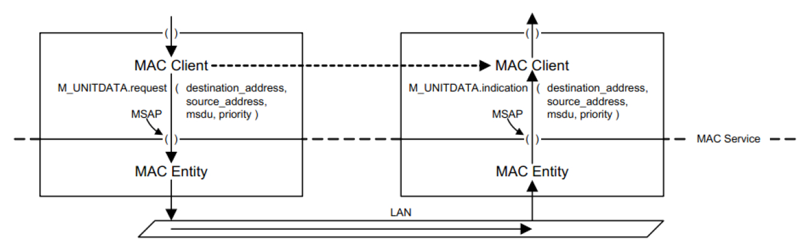
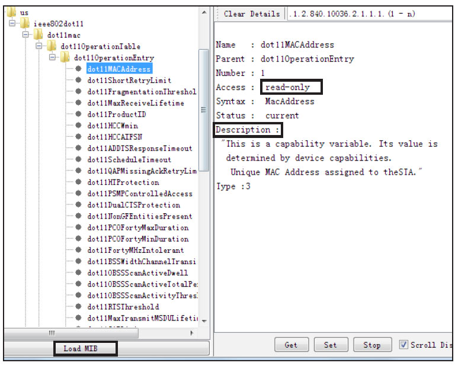
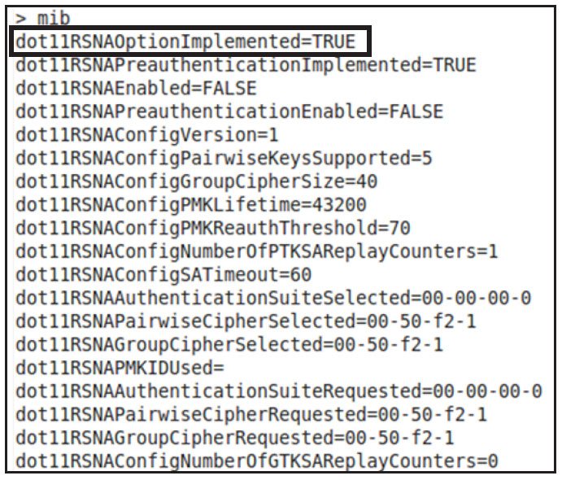
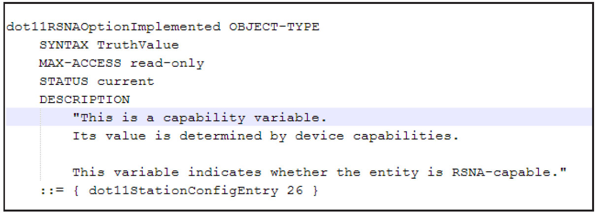

# 3.3.1 OSI基本参考模型及相关基本概念

TCP/IP的结构。先来看OSI/RM，它将网络划[6]分成七层，由上到下分别如下。

❑应用层（ApplicationLayer）：应用层能图3-1OSIRM及TCP/IP结构与应用程序界面沟通以达到向用户展示的目的。常见的协议有HTTP、HTTPS、FTP、❑会话层（SessionLayer）：会话层用于为SMTP等。其数据单位为APDU（Application通信双方制定通信方式，创建和注销会话（双ProtocolDataUNIT）​。

方通信）等。常见的协议有ZIP、AppleTalk、SCP等。其数据单位为SPDU❑表示层（PresentationLayer）：表示层（SessionProtocolDataUNIT）​。

能为不同客户端提供数据和信息的语法转换，使系统能解读成正确的数据，同时它还能提供❑传输层（TransportLayer）：传输层用于压缩解压、加密解密等服务。例如不同格式图控制数据流量，同时能进行调试及错误处理，像（如GIF、JPEG、TIFF等）的显示就是由位以确保通信顺利。发送端的传输层会为数据分于表示层的协议来支持的。其数据单位为组加上序号，以方便接收端把分组重组为有用PPDU（PresentationProtocolData的数据或文件。传输层的常见协议有TCP、UNIT）​。

UDP等。其数据单位为TPDU（TransportProtocolDataUnit）​。

❑网络层（NetworkLayer）：网络层为数据传送的目的地寻址，然后再选择一个传送数据的最佳路线。网络层数据的单位为Packet或Datagram。常见的设备有路由器等。常见协议有IP、IPv6。

❑数据链路层（DataLinkLayer）：在物理层提供比特流服务的基础上，建立相邻节点之间的数据链路。通过差错控制提供数据帧（Frame）在信道上无差错的传输。数据链路层在不可靠的物理介质上提供可靠的传输。该层的作用包括物理地址寻址、数据的成帧、流量控制、数据的检错、重发等。数据链路层数据的单位为Frame（帧）​。常见的设备有二层交换机、网桥等。

❑物理层（PhysicalLayer）：物理层定义了通信设备机械、电气、功能和过程等方面的特性，用以建立、维护和拆除物理链路连接。物理层数据的单位为bit。

图3-1中左边所示为另外一个常用的网络体系，即TCP/IP模型。对比图3-1中的两个模型，我们可简单认为TCP/IPModel是OSI/RM的一个简化版本。

提示关于OSI/RM的详细信息，请读者阅读本章参考资料[5]​。

2.LLC和MAC子层虽然ISO/IEC7498标准所定义的OSI/RM只将网络划分为七层。但实际上每一层还可划分为多个子层（SubLayer）​。所有这些子层中，[7]最为人熟知的就是ISO/IEC8802规范划分DataLinkLayer而得到的LLC（LogicLinkControlSubLayer）和MAC（MediumAccessControlSubLayer）​。它们的信息如图3-2所示。

图3-2MAC和LLC子层ISO/IEC8802将DataLinkLayer划分成了两个子层。

❑媒介访问控制子层（MACSubLayer）：

该子层的目的是解决局域网（LocalAreaNetwork，LAN）中共用信道的使用产生竞争时，如何分配信道的使用权问题。目前LAN中常用的媒介访问控制方法是CSMA/CD（争用型介质访问控制）​。由于无线网络的特殊性，MAC的控制方法略有不同。将在下文介绍相关内容。

❑逻辑链路控制子层（LLCSubLayer）：该子层实现了两个站点之间帧的交换，实现端到端（源到目的）​，无差错的帧传输和应答功能及流量控制功能。

在DataLink层划分的这两个子层中，802.11只涉及MAC层。由于物理介质的不同，无线和有线网络使用的MAC方法有较大差别，主[8]要区别如下。

❑有线网络最常使用的方法（此处仅考虑以太网）是CSMA/CD（CarrierSenseMultipleAccess/CollisionDetect，载波监听多路访问/冲突检测机制）​。其主要工作原理是：工作站发送数据前先监听信道是否空闲，若空闲则立即发送数据。并且工作站在发送数据时，边发送边继续监听。若监听到冲突，则立即停止发送数据并等待一段随机时间，然后再重新尝试发送。

❑无线网络主要采用CSMA/CA（CarrierSenseMultipleAccess/CollisionAvoidance，载波监听多路访问/冲突避免机制）方法。无线网络没有采用冲突检测方法的原因是：如果要支持冲突检测，必须要求无线设备能一边接收数据信号一边传送数据信号，而这种设计对无线网络设备来说性价比太低。

另外，冲突检测要求边发送数据包边监听，一旦有冲突则停止发送。很显然，这些因发送冲突而被中断的数据发送将会浪费不少的传输资源。所以，802.11在CSMA/CD基础上进行了一些调整，从而得到了CSMA/CA方法。其主要工作原理见下节内容。

注意CSMA/CA协议信道利用率低于CSMA/CD协议信道利用率。信道利用率受传输距离和空旷程度的影响，当距离远或者有障碍物影响时会存在隐藏终端问题，降低信道利用率。在802.11bWLAN中，在1Mbps速率时最高信道利用率可达到90%，而在11Mbps时最高信道利用率只有65%。

[8]3.CSMA/CACSMA/CA主要使用两种方法来避免碰撞。

❑设备发送数据前，先监听无线链路状态是否空闲。为了避免发生冲突，当无线链路被其他设备占用时，设备会随机为每一帧选择一段退避（backo）时间，这样就能减少冲突的发生。

❑RTS-CTS握手。设备发送帧前，先发送一个很小的RTS（RequestToSend）帧给目标端，等待目标端回应CTS（ClearToSend）

帧后才开始传送。此方式可以确保接下来传送数据时，其他设备不会使用信道以避免冲突。

由于RTS帧与CTS帧长度很小，使得整体开销也较小。

我们通过图3-3来介绍RTS和CTS的作用。

图3-3RTS/CTS原理如图3-3所示，以站A和站B之间传输数据为例，站B、站C、站E在站A的无线信号覆盖的范围内，而站D不在其内。站A、站E、站D在站B的无线信号覆盖的范围内，但站C不在其内。

如果站A要向站B发送数据，站A在发送数据帧之前，要先向站B发送一个请求发送帧RTS。

在RTS帧中会说明将要发送的数据帧的长度。

站B收到RTS帧后就向站A回应一个允许发送帧CTS。在CTS帧中也附上站A欲发送的数据帧的长度（从RTS帧中将此数据复制到CTS帧中）​。站A收到CTS帧后就可发送其数据帧了。

怎么保证其他站不会干扰站A和站B之间的数据传输呢？

❑对于站C，站C处于站A的无线传输范围内，但不在站B的无线传输范围内。因此站C能够收听到站A发送的RTS帧，但经过一小段时间后，站C收听不到站B发送的CTS帧。这样，在站A向站B发送数据的同时，站C也可以发送自己的数据而不会干扰站B接收数据（注意，站C收听不到站B的信号表明，站B也收不听到站C的信号）​。

❑对于站D，站D收听不到站A发送的RTS帧，但能收听到站B发送的CTS帧。因此，站D在收到站B发送的CTS帧后，应在站B随后接收数据帧的时间内关闭数据发送操作，以避免干扰站B接收自A站发来的数据。

❑对于站E，它能收到RTS帧和CTS帧，因此，站E在站A发送数据帧的整个过程中不能发送数据。

总体而言，使用RTS和CTS帧会使整个网络的效率下降。但由于这两种控制帧都很短（它们的长度分别为20和14字节）​。而802.11数据帧则最长可达2346字节，相比之下的开销并不算大。相反，若不使用这种控制帧，则一旦发生冲突而导致数据帧重发，则浪费的时间就更大。

另外，802.11提供了三种情况供用户选择以处理。

❑使用RTS和CTS帧。

❑当数据帧的长度超过某一数值时才使用RTS和CTS帧。

❑不使用RTS和CTS帧。

尽管协议经过了精心设计，但冲突仍然会发生。例如，站B和站C同时向站A发送RTS帧。

这两个RTS帧发生冲突后，使得站A收不到正确的RTS帧因而站A就不会发送后续的CTS帧。这时，站B和站C像以太网发生冲突那样，各自随机地推迟一段时间后重新发送其RTS帧。

提示根据802.11协议，CSMA/CA具体运作时由协调功能（CoordinationFunction，CF）来控制。协议规定有四种不同的协调功能，分别是DCF（DistributedCF，分布式协调功能）​、基于DCF之上的PCF（PointCF）​、HCF（HybridCF，混合型协调功能）以及用于Mesh网络的MCF（MeshCF）​。由于无线网络是共享介质，所以协调功能的目的就是用于控制各个无线网络设备使用无线媒介的时机以避免冲突发生。形象点说，这就好比在一个会议室里，所有人都可以发言，但如果多个人同时发言又不知道谁和谁在说话。

所以，每个打算发言的人都需要检查当前发言的情况。本章不详细介绍802.11中CF相关的内容。感兴趣的读者可阅读802.11协议第9节"MACsublayerfunctionaldescription"。

另外，规范还定义了基于竞争的服务（contention-basedservice，使用DCF进行数据交换）和基于无竞争的服务（contention-freeservice，使用PCF进行数据交换）​，本章也不讨论它们。

[5]​[9]4.MAC层Service及其他概念ISO/IEC7498及相关的一些标准文档除了对网络体系进行层次划分外，还定义了层和层之间交互方式及其他一些基本组件。它们可用图3-4来表示。

图3-4MACEntity、Service和Clients图3-4绘制了MAC层相关的组件及交互方式。

❑协议规定了每一层所提供的功能，这些功能统一用Service来表示。MAC层为上层提供MACService。从Java编程角度来看，就好比定义了一个名为MACService的JavaPackage。

❑每一层内部有数个Entity。Entity代表封装了一组功能的模块。上面提到的Service就是由Entity提供的。根据OSI/RM的层次关系，第N层为第N+1层提供服务。所以，MACEntity对上一层提供MACService。从Java编程角度来看，MACEntity就好比MACServicePackage中定义的类，不同的Entity代表该Package中实现不同的功能类。一个Package中的Entity可以相互调用以完成某个功能。

❑第N+1层要使用第N层服务时，必须经由ServiceAccessPoint来完成。MAC的Service必须借由MSAP（MACServiceAccessPoint）来访问。

根据上面的介绍，Entity定义了一个类，其中是否定义了相应的功能函数呢？在标准文档中，和功能函数对应的术语是primitives（原语）及它们的parameters（参数）​。图3-4列举了MACService的两个重要函数，分别是如下。

❑M_UNITDATA.request：Client调用该原语发送数据。该原语的参数是destination_address（目标地址）​、source_address（源地址）​、MSDU（MACServiceDataUnit，即数据）​、priority（优先级）​。

❑M_UNITDATA.indication：当位于远端机器的MAC层收到上面发送的数据后，将通过indication原语通知上一层以处理该数据。

提示关于MAC层的服务详细定义，请读者阅读3.3.5节MAC服务定义内容。

值得指出的是，规范只是从逻辑上定义了上述内容，它并没有指定具体的实现。关于MACService的详细定义，读者可阅读本章参考资料[10]​，即ISO/IEC15802-1。

协议还定义了SDU和PDU两个概念。当上一层调用MAC的request原语时，会把要发送的数据传给MAC层。这个数据被称为MSDU。对MAC层来说，MSDU其实就是MAC要发送的数据，即载荷（Payload）​。MAC层处理Payload时还会封装MAC层自己的一些头信息。这些信息和MSDU共同构成了MAC层的ProtocolDataUnit（简写为MPDU）​。从OSI/RM角度来看，经过N+1层封装后的数据是（N+1）-PDU。该数据传递给N层去处理时，对N层来说就是（N）-SDU。N层封装这个SDU后就变成自己的（N）-PDU了。

[11]5.MIB在阅读802.11相关规范时，经常会碰到MIB（ManagementInformationBase，管理信息库）​。MIB是一个虚拟的数据库，里边存储了一些设备信息供查询和修改。MIB常见的使用之处是网管利用SNMP协议管理远程主机、路由器等。

MIB内部采用树形结构来管理其数据。内部的

每一个管理条目（Entry）通过OID（ObjectIDentifier）来访问。MIB定义了Entry的属性和可取的值。由于属性及其可取值的定义采用了与具体编程语言无关的方式，所以一个MIB库可以很轻松地通过编译器（compiler）将其转换成对应的编程语言源码文件。

图3-5802.11MIB内容首提先示点M击I图B的3-定5所义示比左较下烦角琐的，"L可oa阅d读M参IB考"按资钮以料加[11载]中8的02资.11料m列ib表.tx以t文学习件完，整然的后MI查B知看8识02。.11mib定义的一些属性。如图3-5所示，左侧显示当前查看的dot11MACAddress的条从笔者角度来看，对802.11来说，MIB就是目。右侧显示该条目的信息，Access中定义的一组属性。802.11定义的MIB属性在的"read-only"表示只读，Description表示该hp://www.ieee802.org/11/802.11mib.txt条目的意义。

中。下载后将得到一个802.11mib.txt文件。

802.11mib定义了一个较全的属性集合，一般可通过JMIBBrowser工具加载并查看其内而言，设备可能只支持其中一部分属性。图3-容，如图3-5所示。

6所示为Note2上wlan0设备的MIB信息截图（由于篇幅问题只包含部分Note2wlan0设备的MIB属性）​。

以第一条属性dot11RSNAOptionImplemented为例，其在802.11mib.txt的定义如图3-7所示。

相比直接浏览802.11mib.txt文本文件而言，利用JMIBBrowser工具查看属性会更加方便和直观一些。

图3-6Note2wlan0设备的MIB属性

图3-7dot11RSNAOptionImplemented属性内容提示以后分析wpa_supplicant源码时，会碰到802.11mib定义的属性，建议在阅读本节时下载相关文件和工具程序。另外，以上内容涉及的知识点是读者以后阅读802.11协议时必然会碰到的。由于802.11协议引用的参考资料非常多，故本节整理了其中最基础的知识点，请读者务必认真阅读本节内容。
