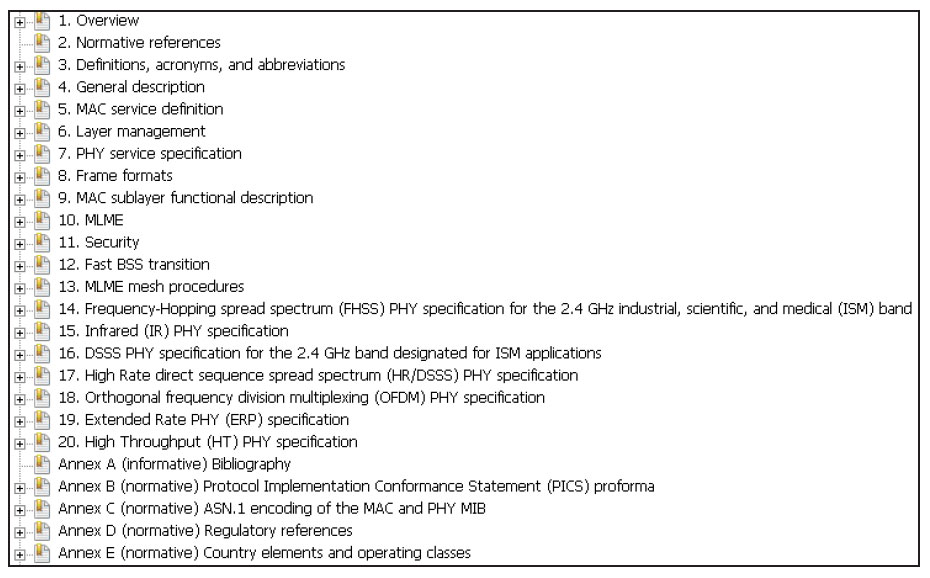

# 3.3.2 802.11知识点导读

802.11规范全称为《Part11：WirelessLANMediumAccessControl（MAC）andPhysicalLayer（PHY）Specifications》​。

从其标题可知，802.11规范定义了无线局域网中MAC层和PHY层的技术标准。

2012年版的802.11协议全文共2793页，包含20小节（clause）​，23个附录（A～W）​。图3-8所示为802.11协议原文目录的一部分。

图3-8802.11协议原文目录由图3-8可知802.11协议内容非常丰富。读者可尝试阅读该文档，但估计很快会发现这将是一件非常枯燥和令人头疼的事情。主要原因是此规范类似于手册，它非常重视细节的精准，但各技术点前后逻辑上的连贯性较差，使得读者极难将散落在协议中各个角落的技术点整理出一个内容有序，难度由浅入深的核心知识框架来。

基于上述原因，本章后续小节将从以下几个方面介绍802.11规范中的一些核心内容。

❑3.3.3节介绍802.11中的物理组件和网络结构。

❑3.3.4节将在物理组件和网络结构基础上，介绍802.11为无线网络所定义的服务。了解这些服务对我们从整体上理解无线网络的功能有重要意义。

❑3.3.5节介绍802.11MAC服务和帧方面的内容。这部分知识比较具体，相信读者理解起来没有问题。

❑3.3.6节介绍MAC层管理实体方面的内容。

清楚这部分内容有助于读者理解后续有关LinuxWi-Fi编程的知识。

❑3.3.7节介绍802.11安全性方面的知识。

提示篇幅原因，本书不可能囊括规范的所有内容。但相信读者在理解本节内容的基础上，能够轻松开展更加深入的研究。另外，为帮助读者理解规范，本章会在重要知识点之处添加“规范阅读提示”​。

由于802.11物理层涉及大量和无线电、信号处理相关的知识。这些知识不仅内容枯燥繁杂，而且对软件工程师来说并无太大意义，故本章不做介绍。愿意深入研究的读者可阅读相关资料。
