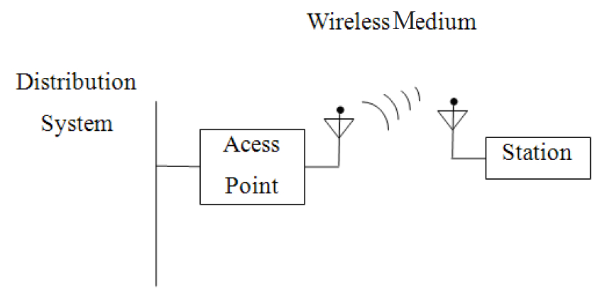
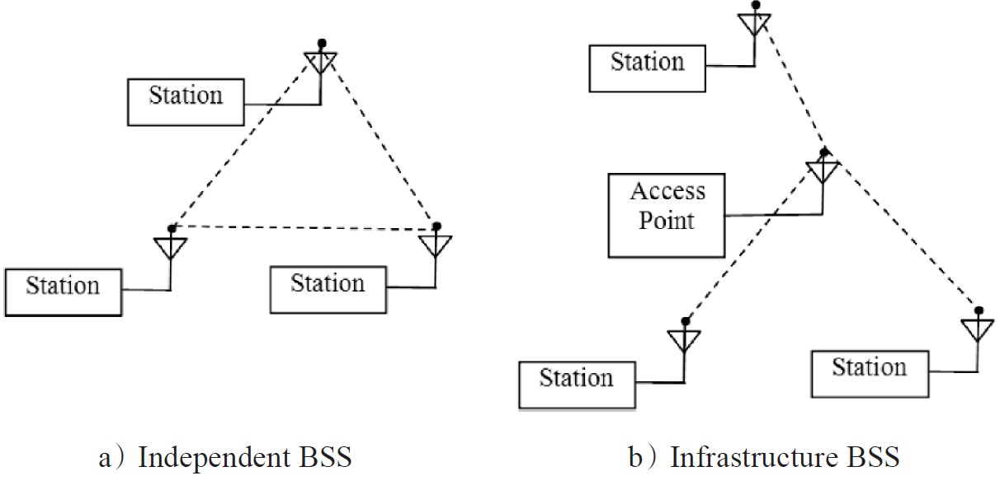
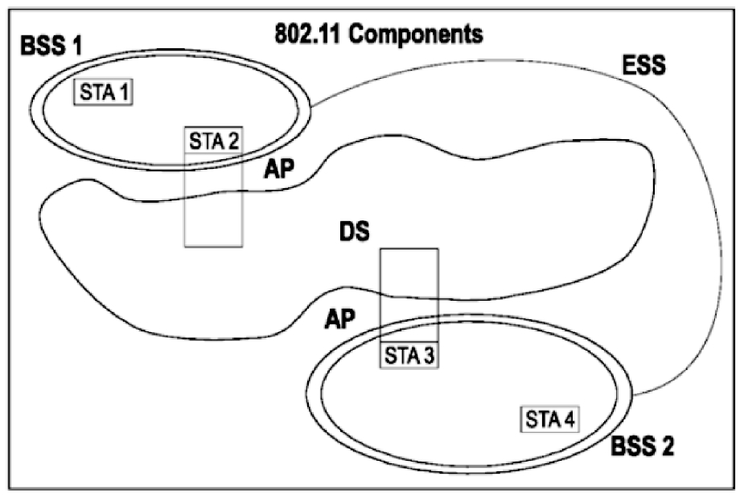
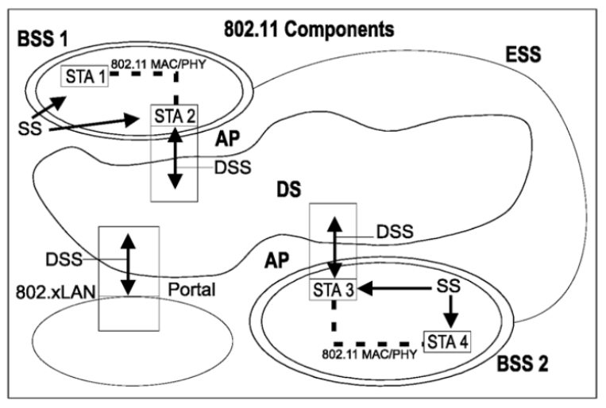

# 3.3.3 802.11组件

本节介绍802.11规范中的物理组件和相关网络结构。首先来看无线网络中的物理组件。

[12]1.物理组件802.11无线网络包含四种主要物理组件，如下所示。

❑WM（WirelessMedium，无线媒介）​：

其本意指能传送无线MAC帧数据的物理层。

规范最早定义了射频和红外两种物理层，但目前使用最多的是射频物理层。

❑STA（Station，工作站）​：其英文定义是"AlogicalentitythatisasinglyaddressableinstanceofaMACandPHYinterfacetotheWM"。通俗点说，STA就是指携带无线网络接口卡（即无线网卡）的设备，例如笔记本、智能手机等。另外，无线网卡和有线网卡的MAC地址均分配自同一个地址池以确保其唯一性。

❑AP（AccessPoint，接入点）​：其原文定义是"AnentitythatcontainsoneSTAandprovidesaccesstothedistributionservices，viatheWMforassociatedSTAs"。由其定义可知，AP本身也是一个STA，只不过它还能为那些已经关联的（associated）STA提供分布式服务（DistributionService，DS）​。什么是DS呢？请读者阅读下文。

❑DS（DistributionSystem，分布式系统）​：其英文定义为"Asystemusedtointerconnectasetofbasicservicesets（BSSs）andintegratedlocalareanetworks（LANs）tocreateanextendedserviceset（ESS）"。DS的定义涉及BSS、ESS等无线网络架构，其解释见下文。

上述四个物理组件如图3-9所示。其中，最难解释清楚的就是DS。笔者在仔细阅读规范后，感觉其对DS的解释并不直观。此处将列举一个常见的应用场景以帮助读者理解。

图3-9802.11四大主要物理组件一般家用无线路由器一端通过有线接入互联网，另一端通过天线提供无线网络。打开Android手机上的Wi-Fi功能，并成功连接到此无线路由器提供的无线网络（假设其网络名为"TP-LINK_1F9C5E"，可在路由器中设置）

时，我们将得到：

❑路由器一端通过有线接入互联网，故可认为它整合（integrate）了LAN。

❑不论路由器是否接入有线网络（即本例中的互联网）​，手机（扮演STA的角色）和路由器（扮演AP的角色）之间建立了一个小的无线网络。该无线网络的覆盖范围由AP即路由器决定。这个小网络就是一个BSS。另外，定义中提及的ESS是对BSS的扩展。一个ESS可包含一或多个BSS。在本例中，ESS对应的ID就是"TP-LINK_1F9C5E"，即我们为路由器设置的网络名。

上述内容中将BSS和LAN结合到一起以构成一个ESS的就是DS。虽然规范中并未明示DS到底是什么，但绝大部分情况下，DS是指有线网络（通过它可以接入互联网）​。后文将介绍DS所提供的分布式服务（即DSS）​。现在对读者来说，更重要的概念是其中和无线网络架构相关的BSS和ESS等。这部分内容将在下节介绍。

规范阅读提示1）上文介绍的AP、STA、DS的定义都来自于802.11的3.1节。该节所列的定义是最精确的。以DS为例，此节所定义的DS涉及和有线网络的结合。但规范中其他关于DS的说明均未明示是否一定要和LAN结合。

2）关于STA，其定义只说明它是一个可"singlyaddressable"的实体，而没有说明其对应的功能。所以，读者会发现AP也是一个STA。另外还有提供QoS（QualityofService）的STA。除此之外，从可移动性的角度来看，还有MobileSTA和PortableSTA之分。PortableSTA虽然可以移动，但只在固定地点使用（例如AP就是一个典型的PortableSTA）​。而MobileSTA表示那些只要在Wi-Fi覆盖范围内，都可以使用的STA（例如手机、平板电脑等设备）​。

[12]2.无线网络的构建有了上节所述的物理组件，现在就可以搭建由它们构成的无线网络了。802.11规范中，基本服务集（BasicServiceSet，BSS）是整个无线网络的基本构建组件（BasicBuildingBlock）​。如图3-10所示，BSS有两种类型。

❑独立型BSS（IndependentBSS）：这种类型的BSS不需要AP参与。各STA之间可直接交互。这种网络也叫ad-hocBSS（一般译为自组网络或对等网络）​。

❑基础结构型BSS（InfrastructureBSS）：

所有STA之间的交互必须经过AP。AP是基础结构型BSS的中控台。这也是家庭或工作中最常见的网络架构。在这种网络中，一个STA必须完成诸如关联、授权等步骤后才能加入某个BSS。注意，一个STA一次只能属于一个BSS。

图3-10BSS的两种方式提示IndependentBSS缩写为IBSS。而InfrastructureBSS没有对应的缩写。不过，一般用BSS代表InfrastructureBSS。

根据前文所述，AP也是一个STA，但此处STA和AP显然是两个不同的设备。

由图3-10中BSS的结构可知，其网络覆盖范围由该BSS中的AP决定。在某些情况下，需要几个BSS联合工作以构建一个覆盖面更大的网络，这就是一个ESS（ExtendedServiceSet，扩展服务集）​，如图3-11所示。

图3-11ESS示意图ESS在规范中的定义是"AsetofoneoroneinterconnectedBSSsthatappearsasasingleBSStotheLLClayeratanySTAassociatedwithoneofthoseBSSs"。此定义包含几个关键点。

一个ESS包含一或多个BSS。如图3-11所示的BSS1和BSS2。

BSS1和BSS2本来各自组成了自己的小网络。

但在ESS结构中，它们在逻辑上又构成了一个更大的BSS。这意味着最初在BSS2中使用的STA4（利用STA3，即BSS2中的AP上网）能跑到BSS1的范围内，利用它的AP（即STA2）

上网而不用做任何无线网络切换之类的操作。

此场景在手机通信领域很常见，例如在移动的汽车上打电话，此时手机就会根据情况在物理位置不同的基站间切换语音数据传输而不影响通话。

注意ESS中的BSS拥有相同的SSID（ServiceSetIdentification，详细内容见下文）​，并且彼此之间协同工作。这和目前随着Wi-Fi技术的推广，家庭和工作环境中存在多个无线网络（即存在多个ESS）的情况有本质不同。在多个ESS情况下，用户必须手动选择才能切换到不同的ESS。由于笔者日常工作和生活中，ESS只包含一个BSS，当某个AP停机时，笔者就得手动切换到其他无线网络中去了。另外，切换相关的知识点属于Roaming（漫游）范畴，读者可阅读SecureRoamingin802.11Networks一书来了解相关细节。

上述网络都有Identification，分别如下。

❑BSSID（BSSIdentification）​：每一个BSS都有自己的唯一编号。在基础结构型网络中，BSSID就是AP的MAC地址，该MAC地址是真实的地址。IBSS中，其BSSID也是一个MAC地址，不过这个MAC地址是随机生成的。

❑SSID（ServiceSetIdentification）​：一般而言，BSSID会和一个SSID关联。BSSID是MAC地址，而SSID就是网络名。网络名往往是一个可读字符串，因为网络名比MAC地址更方便人们记忆。

ESS包括一到多个BSS，而它对外看起来就像一个BSS。所以，对ESS的编号就由SSID来表达。只要设置其内部BSS的SSID为同一个名称即可。一般情况下，ESS的SSID就是其网络名（networkname）​。

规范阅读提示1）上述网络结构中，并未提及如何与有线网络（LAN）的整合。规范中其实还定义了一个名为portal的逻辑模块（logicalcomponent）用于将WLAN（WirelessLAN）和LAN结合起来。由于WLAN和LAN使用的MAC帧格式不同，所以portal的功能类似翻译，它在WLAN和LAN间转换MAC帧数据。目前，portal的功能由AP实现。

2）规范中还定义了QoSBSS。这主要为了在WLAN中支持那些对QoS有要求的程序。由于无线网络本身固有的特性，WLAN中的QoS实现比较复杂，效果也不如LAN中的QoS。初学者可先不接触这部分内容。

[13]3.3.4802.11Service介绍本节对802.11规范定义的和数据传输相关的服务进行介绍。规范在各服务的逻辑联系上往往一句带过，使得很难把它们之间的关系搞清楚。对数据传输来说，其逻辑关系如下。

❑DSS用于完成数据的传输。

❑由于有线和无线网络的差异性，当数据需要传输到有线网络时候，就通过IntegrationService在二者之间进行转换。

❑由于存在transition，为了保证DSS能找到对应的STA，所以就存在association、reassociation服务。

❑当STA不再使用DSS时，就通过disassociation服务离开DS。

802.11规范定义了很多Service。Service就是无线网络中对应模块应该具有的功能。本节内容主要来自802.11规范4.4节到4.8节，集中介绍了802.11无线网络应该提供的Service。

1.802.11Service的分类从模块考虑，802.11中的Service分为两大类别（Category）​，分别如下。

❑SS（StationService）​：它是STA应该具有的功能。

❑DSS（DistributionSystemService）​：它指明DS应具有的功能。

前文也提到过DS，其定义比较模糊。规范中还特别强调说802.11并不指明DS的具体实现，它只是从逻辑上指明DS应该具有的功能，也就是DSS。

提示虽然规范未说明DS到底是什么，但目前普遍认为DS就是指以太网。

SS和DSS包含一些相同的服务。这是因为无线网络中，SS和DSS将协同工作。以数据传输为例，STA和DS都需要支持MAC帧数据的收发。所以二者必然包含类似的服务。另外，802.11中的Service还可从其所代表的功能出发进行划分以得到如下类别。

❑6种Service用于支持802.11MAC层的数据传输（规范定义为MACServiceDataUnitDelivery）​。

❑3种Service用于控制802.11LAN的访问控制（AccessControl）和数据机密性（DataConfidentiality）​。

❑2种Service用于频谱管理（SpectrumManagement）​。

❑1种Service用于支持QoS。

❑1种Service用于支持时间同步。

❑1种Service用于无线电测量（RadioMeasurement）​。

接下来，本章将从功能划分角度出发来介绍其中所涉及的服务。

2.数据传输相关服务毋庸置疑的是，无线网络最重要的一个功能就是传输数据了。对802.11来说，此处的数据就是无线MAC帧数据。规范一共定义了6种Service支持数据传输。其中，QoStrafficScheduling服务和QoS有关，主要目的是满足QoS的要求，本书不对这部分内容进行介绍。

（1）DistributionService和IntegrationService本节介绍数据传输服务中的前两位，DistributionService（DS，分布式服务）和IntegrationService（IS，整合服务）​。前文也提到过DSS，其目的其实非常简单。只要STA传送任何数据都会使用这项服务。当AP接收到数据帧后，就会使用该服务将帧传输到目的地。任何使用接入点的通信都会通过该服务进行传播。包括关联至同一个AP的两个STA之间的相互通信。规范还特别绘制了示意图来展示DS，如图3-12所示。

❑BSS1中的STA1想发送数据给BSS2中的STA4。

❑STA1先要把数据传输给BSS1中的AP，即STA2。

❑STA2通过使用DSS将数据传输给DS。

❑DS根据相关的信息找到位于BSS2的AP，即STA3。

❑STA3把数据传递给STA4。

图3-12DS示意图在上述过程中，DSS的作用就是把来自STA2的数据传递到正确的STA3。规范并未说明DS如何实现DSS，它只要求数据发送端传递足够的参数使得STA3能被正确找到。

整合服务的使用也包含在图3-12中。当DSS发现数据的目的端是LAN时，就需要把数据传给Portal了。这时候，DS就会使用IS将无线数据进行必要的转换，以发送到LAN中去。

同样，规范并未指明IS的具体实现，不过读者可知家用的无线路由器就实现了该功能。

（2）association、reassociation、disassociation服务前文曾提到，规范要求使用DSS时，必须提供足够的信息给它以保证数据能传输成功。这些足够的信息就是由association（关联）​、reassociation（重新关联）和disassociation（取消关联）服务提供的。这些服务是如何帮助DSS的呢？回答这个问题前，先介绍TransitionType。

TransitionType对STA在无线网络中移动的类型进行了分类，分别如下。

❑No-Transition：即没有移动。它包括固定不动的情况以及在某个AP无线覆盖范围内移动。

❑BSS-Transition：即从ESS中的一个BSS切换到另一个BSS。根据前面对ESS的介绍，我们希望这种移动不影响网络的使用。当然，要真正实现无缝切换，需要做一些其他工作。这部分内容由规范中的"FastBSSTransition"一节描述。

❑ESS-Transition：从一个ESS中的BSS切换到位于另外一个ESS的BSS。这种情况极有可能导致网络切换，影响用户使用。

当DS传输数据时，DSS需要知道和哪个AP建立联系。所以，规范要求STA在传输数据前，必须要和一个AP建立关联关系，这就需要使用association服务。关联服务的目的在于为AP和STA建立一种映射关系。例如当图3-12中的DS向BSS1发送数据时，它得知道STA1和STA2通过association服务建立了一种映射，这样数据才能传递给STA1。

在同一时刻，一个STA只能和一个AP建立关联关系。但AP可和多个STA建立关联关系。

关联服务回答了这样一个问题：哪个AP为STAX服务？

当STA进行transition的时候（如BSSTransition）​，它就需要使用reassociation服务了。因为之前它和BSS1建立了关联关系，此后它需要和BSS2建立关联关系。这时就可以使用reassociation服务来完成该功能。

reassociation服务只能由STA发起。

当STA不需要使用DSS，或者AP不再为某个STA服务时，就需要调用disassociation服务。这样STA就不能再使用DSS传输数据了。

相比关联和重新关联，STA和AP都可以调用取消关联服务。

提示随着Wi-Fi安全要求的提高，上述场景在强健安全网络（RobustSecurityNetwork）中将有较大不同。

规范阅读提示1）上述内容在RSN中大有不同。RSN主要为了增强WLAN的数据加密和认证性能，并且针对WEP加密机制的各种缺陷做了多方面的改进。关于安全方面的内容，我们留待后文再介绍。

2）介绍Service的时候，规范中还有一段对MAC帧类型进行了非常简单的介绍，即Service的具体调用是通过发送不同的MAC帧来触发的。规范中MAC帧分为三大类型，分别是data（数据帧）​、management（管理帧）和control（控制帧）​。其中和service直接相关的是management帧，而control帧用于帮助传输data和management帧。关于MAC帧的详细内容在3.3.5节。

3.访问控制和数据机密性相关服务访问控制和数据机密性（AccessControlandDataConfidentiality）包括三个服务。

其主要目的是解决无线网络中安全防护相关的工作。相比有线网络而言，安全性是无线网络中非常重要的一部分。以访问控制为例，在有线网络中，例如你去一家公司参观，只有在经过对方同意的情况下，才能使用有线上网。有线网络控制由网管或相关人员实施。而无线网络中，只要你在该公司内部无线网络的覆盖范围内，都可以接入此网络。很明显，这时就需要对无线网络实施访问控制了。

在访问控制的进一步上，数据机密性用于对数据的内容进行加密保护。因为即使实施了访问控制，由于传输的数据还是通过无线网络，那么理论上无线网络覆盖内的所有人都可以接收到该数据。如果不加密的话，数据内容就能被不相关的人窥窃了。

规范定义了三个服务用于处理安全性，分别如下。

❑Authentication和Deauthentication：这两个服务用于AccessControl，译为身份验证以及解除身份验证。

❑Confidentiality：原本称为私密性（privacy）服务，后来对这部分内容实施了加强。目前规范中提到的数据加密方法有WEP、TKIP、CCMP。

4.频谱管理服务频谱管理服务包括TPC（TransmitPowerControl，传输功率控制）服务和DFS（DynamicFrequencySelection，动态频率选择）服务。这两个服务的目的在于满足不同管制机构对无线电资源使用时的一些特定要求。

对TPC而言，当无线设备工作在5GHz频段时，必须限制其各信道的最大发射功率，以避免干扰卫星服务。其主要特点包括：

❑支持STA根据功率要求选择和不同的AP关联。

❑根据管制机构的要求，设定当前信道的最大传输功率。

❑根据传输过程中的损耗等信息来自动调整传输功率。

和TPC类似，DFS也是针对那些工作在5GHz频段的无线设备，使其能够根据情况动态选择传输信道以避免干扰雷达系统。DFS的主要特点是针对信道（即不同频率）​，包括：

❑根据STA支持的信道情况去选择合适的AP。

❑静默某个信道，以支持雷达的使用该信道。

❑在使用某个信道前，先检查是否有雷达系统已经使用该信道了。如果有，则必须停止在该信道工作以避免干扰雷达。

5.QoS和时间同步服务规范对这两个服务的介绍不多，故本书也不展开详细讨论。简单来说，802.11规范支持使用任何一种合适的QoS机制以预留一些资源，例如RRP（ResourceReservationProtocol）​。

时间同步服务目的是支持一些对同步性要求较高的应用（如视音频播放等）​。这些应用使用的同步方式可基于规范中定义的STA之间时间同步（TimingSynchronizationFunction，TSF）机制之上。

提示QoS来源于802.11e。

6.无线电测量服务无线电测量（RadioMeasurement）服务所提供的功能如下。

❑为上层应用提供查询无线电相关信息的接口。

❑通过无线电测量来获取周围AP的信息。

❑能够在所支持的信道上进行无线电测量。

提示无线电测量服务来源于802.11k。

7.802.11Service相关知识总结本节对802.11提供的服务进行了基本介绍。

服务其实是从无线网络所提供的功能的角度来考察无线网络技术的。所有服务中最关键的三个如下。

❑数据传输服务：这是无线网络的一个主要功能。

❑安全方面的服务：由于无线网络的特殊性，所以安全性是它必须要考虑的问题。

❑无线电测量服务：无线电测量用于无线网络组建。例如STA必须通过该服务去发现周围的AP。

提示笔者认为，上述服务从文字描述上看起来并不复杂。但对软件工程师来说，很难把上述知识和编程/代码等联系起来。不过没有关系，下文的内容将更加具体。尤其是3.3.6节关于MLME（MACLayerManagementEntity）的介绍，其描述方式就很接近编程中的API介绍。
