# 3.3.5 802.11 MAC服务和帧


本节将向读者介绍802.11中MAC服务以及MAC帧方面的内容。首先来看MAC服务。

[14]1.MAC服务定义根据3.3.1节所示，MAC层定义了一些Service用于为上层LLC提供服务。其中，802.11中定义的MAC提供三种服务，分别如下。

❑MA-UNITDATA.request：供LLC层发送数据。

❑MA-UNITDATA.indication：通知LLC层进行数据接收。

❑MA-UNITDATA-STATUS.indication：通知

```
MA-UNITDATA.request(
  source address           // 指定本次数据发送端的MAC地址
  destination address      // 指定接收端的MAC地址。可以是组播或广播地址
  routing information      // 路由信息。对于802.11来说，该值为null（表示该值没有作用）
  data                     // MSDU，即上层需要发送的数据。对802.11来说，其大小不能超过2304字节
  priority                 // priority和service class的解释见下文
  service class
  )
```

LLC层自己（即MAC层）的状态。

规范中这三种服务的定义和编程语言中的函数非常像。根据前文所述，服务在规范中被称为原语（primitive）​，每个服务有特定的参数（parameter）​。另外，规范对每条原语都做了非常详细的解释，例如原语使用场景（从编程角度看就是介绍什么时候用这些API）​，MAC层如何处理这些原语（从编程角度看即描述应该如何实现这些API）​。

（1）MA-UNITDATA.request服务request用于发送数据，其定义如下所示。

request原语中，除priority和serviceclass参数外，其他都很容易理解。而priority和serviceclass参数与QoS有关系。

❑priority的取值为0～15的整数。对于非QoS相关的操作，其取值为Contention和ContentionFree。802.11中，QoS设置了不同的用户优先级（UserPriority，UP）​。显然，UP高的数据将优先得到发送。Priority参数和QoS中的其他参数一起决定发送数据的优先级。

❑serviceclass的取值也针对是否为QoS而有所不同。对于非QoS，取值可为ReorderableGroupAddressed或StrictlyOdered。这两个都和数据发送时是否重排（reorder）发送次序有关。非QoS情况下，STA发送数据时并不会主动去调整发送次序。而QoS情况下，很明显那些UP较高的数据见得到优先处理。但对于组播数据，发送者可以设置serviceclass为ReorderableGroupAddressed进行次序调整。

对request原语来说，当LLC需要发送数据时，就会调用request。MAC层需要检查参数是否正确。如果不正确，将通过其他原语通知LLC层，否则将启动数据发送流程。

（2）MA-UNITDATA.indication服务下面来看MAC层收到数据后用于通知LLC层的原语indication，其定义如下。

```
MA-UNITDATA.indication(
  source address  // 代表数据源MAC地址。其值取值MAC帧中的SA（关于MAC帧格式详情见后文）
  destination address       // 代表目标MAC地址，取自MAC帧中的DA，可以是组播地址
  routing information       // 值为null
  data                      // MAC帧数据
  reception status          // 表示接收状态，例如成功或失败。对802.11来说，该状态永远返回success
                            // MAC层会丢弃那些错误的数据包
  priority                  // 和request的取值略有不同，此处略过
  service class
)
```

802.11中，indication只有在MAC层收到格式完整、安全校验无误及没有其他错误的数据包时才会被调用以通知LLC层。

（3）MA-UNITDATA-STATUS.indication服务STATUS.indication用于向LLC层返回对应request原语的处理情况。其原型如下。

```
MA-UNITDATA-STATUS.indication(
  // source和destination address和对应request的前两个参数一样
  source address
  destination address
  transmission status    // 返回request的处理情况，详情见下文
  provided priority  // 只有status返回成功，该参数才有意义。其值和调用request发送数据时的值一致
  provided service class // 只有status返回成功，该参数才有意义
 )
```

indication最关键的一个参数是transmissionstatus，可以是以下值。

❑Successful：代表对应request发送数据成功。

❑Undeliverable：数据无法发送。其原因有数据超长（excessivedatalength）​、在request时指定了routinginformation（non-nusourcerouting）​、不支持的priority和serviceclass、没有BSS（noBSSavailable）​、没有key进行加密（cannotencryptwithanukey）等。

提示本节对应于规范的第5节"MACservicedefinition"。和前面内容相比，本节内容更贴近于代码实现，当然也就更符合程序员的“审美观”​。

接下来介绍和MAC帧相关的内容。

[15]​[16]​[17]2.MAC帧802.11MAC帧格式如图3-13所示。

图3-13802.11MAC帧格式由图3-13可知，MAC帧由以下三个基本域组成。

❑MACHeader：包括帧控制（FrameControl）​、时长（Duration）​、地址（Address）等。注意，每个方框上面的数字表示该域占据的字节数。例如FrameControl需要2字节。

❑FrameBody：代表数据域。这部分内容的长度可变，其具体存储的内容由帧类型（type）和子类型（subtype）决定。

❑FCS：​（FrameCheckSequence，帧校验序列）用于保障帧数据完整性。

规范阅读提示1）关于MAC帧的格式。规范中还指出，如果是QoS数据帧，还需要附加QoSControl字段。如果是HT（HighThroughput，一种用于提高无线网络传输速率的技术）数据帧，还需要附加HTControl字段。

2）关于Framebody长度。规范中指出其长度是7951字节，它和Aggregate-MPDU（MAC报文聚合功能）以及HT有关。本文不拟讨论相关内容。故此处采用2312字节。

下面分别介绍MAC帧头中几个重要的域，首先是FrameControl域。

（1）FrameControl域FrameControl域共2字节16位，其具体字段划分如图3-14所示。

图3-14FrameControl域的组成❑ProtocolVersion：代表802.11MAC帧的版本号。目前的值是0。

❑Type和Subtype：这两个字段用于指明MAC帧的类型。802.11中MAC帧可划分为三种类型，分别是control、data和management，每种类型的帧用于完成不同功能。详情见下文。

❑ToDS和FromDS：只用在数据类型的帧中。其意义见下文。

❑MoreFragments：表明数据是否分片。只支持data和management帧类型。

❑Retry：如果该值为1，表明是重传包。

❑PowerManagement：表明发送该帧的STA处于活跃模式还是处于省电模式。

❑MoreData：和省电模式有关。AP会为那些处于省电模式下的STA缓冲一些数据帧，而STA会定时查询是否有数据要接收。该参数表示AP中还有缓冲的数据帧。如果该值为0，表明STA已经接收完数据帧了（下节将介绍省电模式相关的内容）​。

❑ProtectedFrame：表明数据是否加密。

❑Order：指明接收端必须按顺序处理该帧。

Type和Subtype的含义如表3-2所示。其中仅列出了部分Type和Subtype的取值。

表3-2MAC帧Type和Subtype9

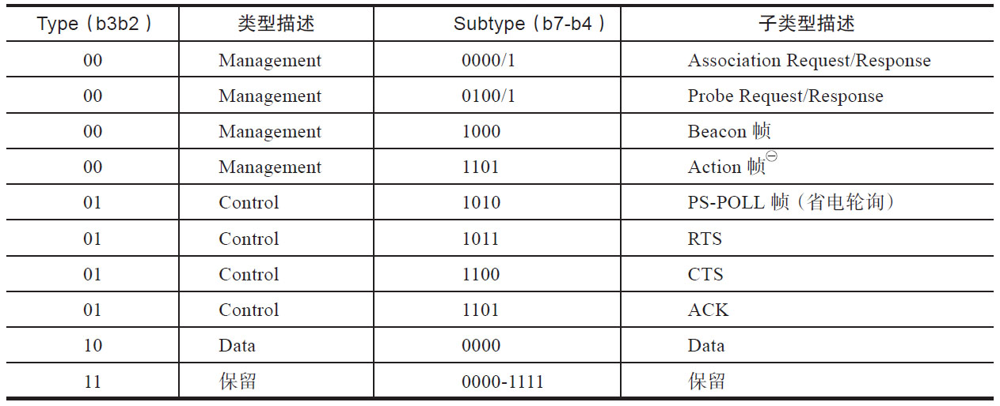

㈠本书将在第7章详细介绍Action帧。

FromDS和ToDS的取值如表3-3所示。

表3-3From/ToDS含义

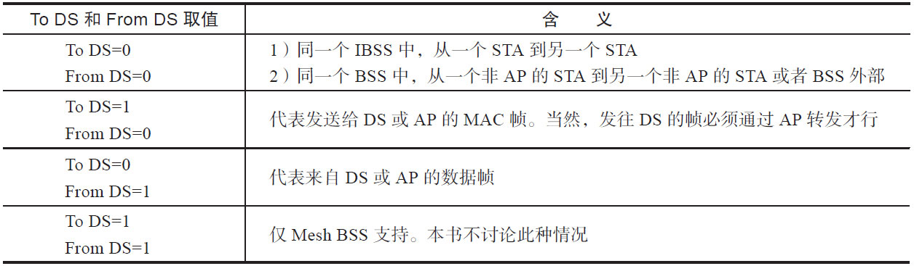

[18]扩展阅读省电模式无线网络的使用者常见于笔记本电脑、智能手机等设备，它们最大的一个特点就是能够移动（无线技术的一个重要目的就是摆脱各种连接线的缠绕）​。无线带来便捷的同时也引入了另外一个突出问题，即电量消耗。在当前电池技术还没有明显进步的现实情况下，802.11规范对电源管理也下了一番苦功。

规范为STA定义了两种和电源相关的状态，分别是Active模式和PS（PowerSave）模式。处于PS模式下，无线设备将关闭收发器（transceiver）以节省电力。

STA为了节电而关闭数据收发无可厚非，怎么保证数据传输的连贯性呢？下面讨论基础结构型网络中省电模式的知识。在这种网络中，规范规定AP为了保证数据传输的连贯性，其有两个重要工作。

1）AP需要了解和它关联的STA的电源管理状态。

当某个STA进入PS状态后，AP就要做好准备以缓存发给该STA的数据帧。一旦STA醒来并进入Active模式，AP就需要将这些缓存的数据发送给该STA。注意，AP无须PS模式，因为绝大多数情况下，AP是由外部电源供电（如无线路由器）​。在AP中，每个和其关联的STA都会被分配一个AID（AssociationID）​。

2）AP需要定时发送自己的数据缓存状态。

因为STA也会定期接收信息（相比发送数据而言，开启接收器所消耗的电力要小）​。一旦STA从AP定时发送的数据缓存状态中了解到它还有未收的数据，STA则会进入Active模式并通过PS-POLL控制帧来接收它们。

现在来看MAC帧中PowerManagement的取值情况。

❑对于AP不缓存的管理帧，PM字段无用。

❑对于AP发送的帧，PM字段无用。

❑STA发送给还未与之关联的AP的帧中，PM字段无用。

❑其他情况下，PM为1表示STA将进入PS状态，否则将进入Active状态。

配合PM使用的字段就是MoreData。根据前文介绍，STA通过PS-POLL来获取AP端为其缓存的数据帧。一次PS-POLL只能获取一个缓存帧。STA怎么知道缓存数据都获取完了呢？原来MoreData值为1表示还有缓存帧，否则为0。虽然MAC帧中没有字段说明AP缓存了多少帧，但通过简单的0/1来标示是否还有剩余缓存帧也不失为一种好方法。

提示规范中的PS处理比较复杂，建议阅读参考资料[18]​。

（2）Duration/ID域Duration/ID域占2字节共16位，其具体含义根据Type和Subtype的不同而变化，不过大体就两种，分别代表ID和Duration。

❑对于PS-POLL帧，该域表示AID的值。其中最后2位必须为1，而前14位取值为1～2007。这就是该域取名ID之意。

❑对于其他帧，代表离下一帧到来还有多长时间，单位是微秒。这就是该域取名Duration之意。

注意Duration的用法和CSMA/CA的具体实现有关。本章不对它进行详细讨论，可阅读参考资料[8]​。

（3）Address域讲解Address域的用法之前，先介绍MAC地[19]址相关的知识。根据IEEE802.3协议，MAC地址有如下特点。

❑MAC地址可用6字节的十六进制来表示，如笔者网卡的MAC地址为1C-6F-65-8C-47-D1。

❑MAC地址的组成包括两个部分。0～23位是厂商向IETF等机构申请用来标识厂商的代码，也称为“组织唯一标识符”​（OrganizationayUniqueIdentifier，OUI）​。后24位是各个厂商制造的所有网卡的一个唯一编号。

❑第48位用于表示这个地址是组播地址还是单播地址。如果这一位是0，表示此MAC地址是单播地址；如果这位是1，表示此MAC地址是组播地址。例如01-XX-XX-XX-XX-XX为组播地址。另外，如果地址全为1，例如FF-FF-FF-FF-FF-FF，则为MAC广播地址。

❑第47位表示该MAC地址是全球唯一的还是本地唯一。故该位也称为G/L位。

[19]​[20]图3-15所示为MAC地址示意图。

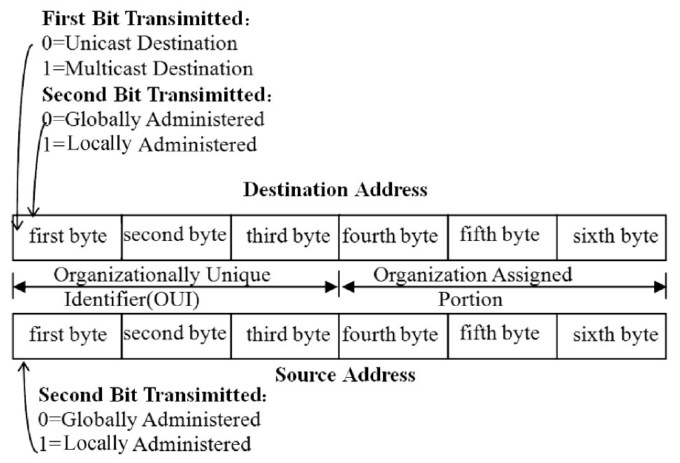

图3-15MAC地址格式注意图3-15中的字节序和比特序。

❑字节序为Big-endian，即最高字节在前。

所以图中的firstbyte实际对应的MAC地址最左边一组。以Note2MAC地址90-18-7C-69-88-E2为例，firstbyte就是“90”​（如果是Little-endian，则firstbyte是"E2"）​，其OUI是SamsungE，代表三星电子。

❑比特序为Little-endian，即最低位在前。这就是01-XX-XX-XX-XX-XX为组播地址的原因了。因为“01”对应的二进制是“0000-0001”​，其第0位是1，应该放在图中firstbyte最左边一格。

提示上面的数值按从左至右为最高位到最低位。一般情况下，字节序和比特序是一致的。但是以太网数据传输时，字节序采用Big-endian，比特序为Little-endian。

参考资料[19]中原文是这样描述的。

Thefirstbit（LSB）shabeusedintheDestinationAddressfieldasanaddresstypedesignationbittoidentifytheDAeitherasanindividualorasagroupaddress.Ifthisbitis0，itshabe…

individualaddress","Eachoctetofeachaddressfiledshabetransmittedleastsignificantbitfirst。

802.11MAC帧头部分共包含四个Address域，但规范中却有五种地址定义，分别如下[15]。

❑BSSID：在基础型BSS中，它为AP的地址。而在IBSS中则是一个本地唯一MAC地址。该地址由一个46位的随机数生成，并且U/M位为0，G/L位为1。另外对MAC广播地址来说，其名称为wildcardBSSID。

❑目标地址（DestinationAddress，DA）：用来描述MAC数据包最终接收者（finalrecipient）​，可以是单播或组播地址。

❑源地址（SourceAddress，SA）：用来描述最初发出MAC数据包的STA地址。一般情况下都是单播地址。

❑发送STA地址（TransmitterAddress，TA）：用于描述将MAC数据包发送到WM中的STA地址。

❑接收STA地址（ReceiverAddress，RA）：用于描述接收MAC帧数据的。如果某个MAC帧数据接收者也是STA，那么RA和DA一样。但如果接收者不是无线工作站，而是比如以太网中的某台PC，那么DA就是该机器的MAC地址，而RA则是AP的MAC地址。这就表明该帧将先发给AP，然后由AP转发给PC。

上述无线地址中，一般只使用Address1～Address3三个字段，故图3-13中它们的位置排在一起。表3-4展示了Address域的用法。

表3-4Address域用法说明由表3-4可知，Address1用作接收端，Address2用作发送端。Address3携带其他信息用于帮助MAC帧的传输，针对不同类型，各个Address域的用法如下。

❑IBSS网络中，由于不存在DS，所以Address1指明接收者，Address2代表发送者。Address3被设置为BSSID，其作用是：

如果Address1被设置为组播地址，那么只有位于同一个BSSID的STA才有必要接收数据。

❑基础结构型网络中，如果STA发送数据，Address1必须是BSSID，代表AP。因为这种网络中，所有数据都必须通过AP。Address3代表最终的接收者，一般是DS上的某个目标地址。

❑基础结构型网络中，如果数据从AP来，那么Address1指明STA的地址，Address2代表AP的地址，Address3则代表DS上的某个源端地址。

❑Address4只在无线网络桥接的时候才使用。本书不讨论这种情况。

图3-16描述了基础型结构网络和无线桥接情况下不同地址的使用场景。

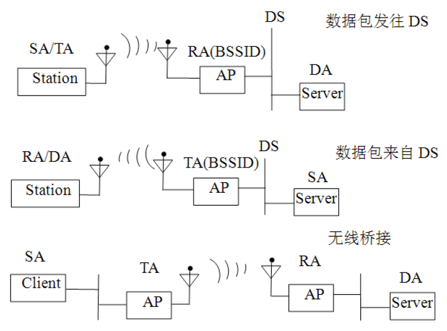

图3-16地址的使用如图3-16所示：

❑数据包发往DS的情况下，SA和TA一致，而RA和BSSID一致。

❑数据包来自DS的情况下，RA和DA一致，而TA和BSSID一致。

❑无线桥接的情况下，SA、TA、RA和DA四种地址都派上了用场。

提示关于Address域的作用请读者务必清楚下面三个关键点。

1）MAC帧头中包含四个Address域，在不同的情况下，每个域中包含不同的地址。原则是Address1代表接收地址，Address2代表发送端地址，Address3辅助用，Address4用于无线桥接或MeshBSS网络中。

2）规范定义了五种类型的地址，即BSSID、RA、SA、DA和TA。每种地址有不同的含义。

3）在某些情况下，有些类型地址的值相同，如图3-16所示。

（4）SequenceControl域SequenceControl域长16位，前4位代表片段编号（FragmentNumber）​，后12位为帧顺序编号（SequenceNumber）​，域格式如图3-17所示。

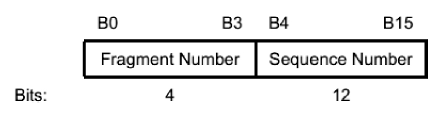

图3-17SequenceControl域格式❑SequenceNumber：STA每次发送数据帧时都会设置一个帧顺序编号。注意，控制帧没有帧顺序编号。另外，重传帧不使用新的帧顺序编号。

❑FragmentNumber：用于控制分片帧。如果数据量太大，则MAC层会将其分片发送。

每个分片帧都有对应的分片编号。

（5）MAC帧相关知识总结本节对MAC帧格式进行介绍。这部分内容难度并不大，但读起来肯定有些枯燥。笔者在阅读参考资料[15]时也有同样的感觉。后来笔者利用公司的AirPcap无线网络分析设备截获无线网络数据并使用wireshark软件进行分析后，感觉MAC帧信息直观多了，如图3-18所示。

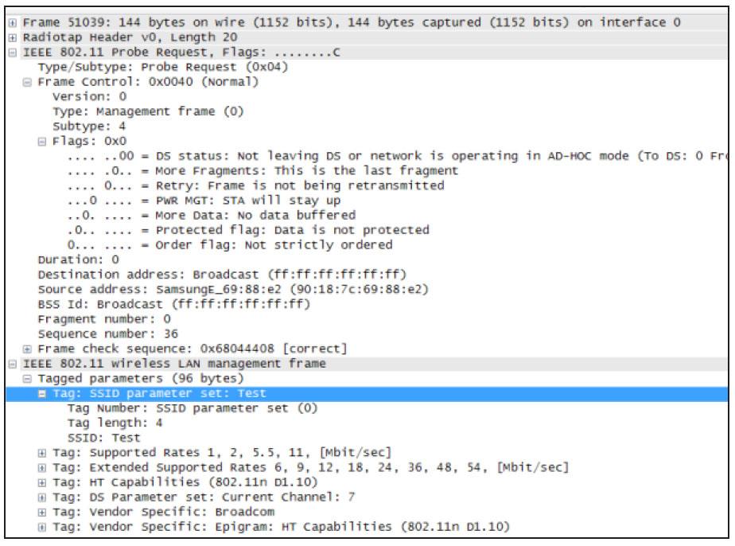

图3-18AirPcap使用AirPcap设备比较贵，但该工具对于将来Wi-Fi知识的学习、工作中的难题解决相当有帮助。

注意本书的资源共享文件中提供几个Wi-Fi数据包捕获文件，读者可直接利用它们进行分析。详情见1.3节。

接下来介绍常见的几种具体的MAC帧。首先从控制帧开始。

[15]​[17]3.控制帧控制帧的作用包括协助数据帧的传递、管理无线媒介的访问等。规范中定义的控制帧有好几种，本节将介绍其中的四种，它们的帧格式如图3-19所示。由图可知，控制帧不包含数据，故其长度都不大。

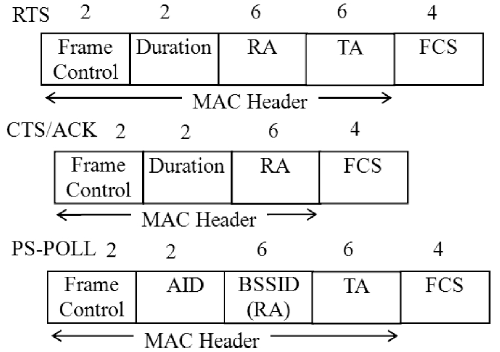

图3-19控制帧格式❑RTS（RequestToSend）​：根据3.3.3节关于CSMA/CA的介绍，RTS用于申请无线媒介的使用时间。值为Duration，单位为微秒。

Duration的计算大致是：要发送的数据帧或管理帧所需时间+CTS帧所需时间+ACK帧所需时间+3SIFS时间。

❑CTS（ClearToSend）​：也和CSMA/CA有关，用于回复RTS帧。另外它被802.11g保护机制用来避免干扰旧的STA。

❑ACK：802.11中，MAC以及任何数据的传输都需要得到肯定确认。这些数据包括普通的数据传输、RTS/CTS交换之前帧以及分片帧。

❑PS-POLL：该控制帧被STA用于从AP中获取因省电模式而缓存的数据。其中AID的值是STA和AP关联时，由AP赋给该STA的。

规范阅读提示1）控制帧还包括CF-End、CF-End+CF-Ack等，这部分内容请读者阅读规范8.3.1节。

2）上述帧中Duration字段的计算也是一个比较重要的知识点，读者同样可阅读规范8.3.1节以了解其细节。

[15]​[17]4.管理帧管理帧是802.11中非常重要的一部分。相比有线网络而言，无线网络管理的难度要大很多。MAC管理帧内容较为丰富，本节将介绍其中重要的几种管理帧，分别是Beacon（信标）帧、AssociationRequest/Response（关联请求/回复）帧、ProbeRequest/Response（探测请求/回复）帧、Authentication/Deauthentication（认证/取消认证）帧。

介绍具体管理帧之前，先来看看管理帧的格式，如图3-20所示。

图3-20管理帧格式所有管理帧都包括MACHeader的6个域。不过，无线网络要管理的内容如此之多，这6个域肯定不能承担如此重任，所以管理帧中的FrameBody将携带具体的管理信息数据。

802.11的管理信息数据大体可分为两种类型。

❑定长字段：指长度固定的信息，规范称为FixedField。

❑信息元素：指长度不固定的信息。显然这类信息中一定会有一个参数用于指示最终的数据长度。

从程序员的角度来看，不同的管理信息数据就好像不同的数据类型或数据结构一样。下面我们来看看802.11为管理帧定义了哪些数据类型和数据结构。

（1）定长字段管理帧中固定长度的字段如下。

1）AuthenticationAlgorithmNumber：

该字段占2字节，代表认证过程中所使用的认证类型。其取值如下。

❑0：代表开放系统身份认证（OpenSystemAuthentication）​。

❑1：代表共享密钥身份认证（SharedKeyAuthentication）​。

❑2：代表快速BSS切换（FastBSSTransition）​。

❑3：代表SAE（SimultaneousAuthenticationofEquals）​。用于两个STA互相认证的方法，常用于MeshBSS网络。

❑65535：代表厂商自定义算法。

提示AuthenticationAlgorithmNumber的定义是不是可以在代码中用枚举类型来表示呢？

2）BeaconIntervalfield：该字段占2字节。每隔一段时间AP就会发出Beacon信号用来宣布无线网络的存在。该信号包含了BSS参数等重要信息。所以STA必须要监听Beacon信号。BeaconIntervalfield字段用来表示Beacon信号之间间隔的时间，其单位为TimeUnits（规范中缩写为TU。注意，一个TU为1024微秒。这里采用2作为基数进行计算）​。

一般该字段会设置为100个TU。

3）CapabilityInformation（性能信息）：

该字段长2字节，一般通过Beacon帧、ProbeRequest和Response帧携带它。该字段用于宣告此网络具备何种功能。2字节中的每一位（共16位）都用来表示网络是否拥有某项功能。该字段的格式如图3-21所示。

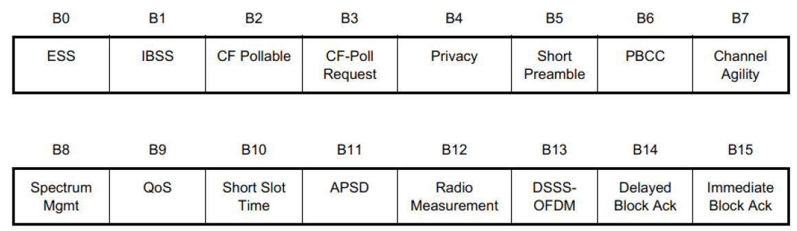

图3-21CapabilityInformation格式图3-21中几个常用的功能位如下。

❑ESS/IBSS：基础结构型网络中，AP将设置ESS位为1，IBSS位为0。相反，IBSS中，STA设置ESS位为0，而IBSS位为1。MeshBSS中，这两个位都为0。

❑Privacy：如果传输过程中需要维护数据机密性（dataconfidentiality）​，则AP设置该位为1，否则为0。

❑SpectrumMgmt：如果某设备对应MIB中dot11SpectrumManagementRequired为真，则该位为1。根据802.11MIB对dot11SpectrumManagementRequired的描述，它和前面介绍的TPC（传输功率控制）

和DFS（动态频率选择）功能有关。

❑RadioMeasurement：如果某设备对应MIB中的dot11RadioMeasurementActivated值为真，则该位置为1，用于表示无线网络支持RadioMeasurementService。

4）CurrentAPAddress：该字段长6字节，表示当前和STA关联的AP的MAC地址。

其作用是便于关联和重新关联操作。

5）ListenInterval：该值长2字节，和省电模式有关。其作用是告知AP，STA进入PS模式后，每隔多长时间它会醒来接收Beacon帧。AP可以根据该值为STA设置对应的缓存大小，该值越长，对应的缓冲也相应较大。该值的单位是前文提到的另外一个定长字段BeaconInterval。

6）AssociationID（AID）：该字段长2字节。STA和AP关联后，AP会为其分配一个AssociationID用于后续的管理和控制（如PS-POLL帧的使用）​。不过为了和帧头中的Duration/ID匹配，其最高2位永远为1，取值范围1～2007。

7）ReasonCode：该字段长2字节。用于通知Diassociaton、Deauthentication等操作（包括DELTS、DELBA、DLSTeardown等）

失败的原因。ReasonCode的详细取值情况可参考规范的8.4.1.7节的Table8-36。此处为读者列出几个常见取值及含义，如表3-5所示。

表3-5ReasonCode取值

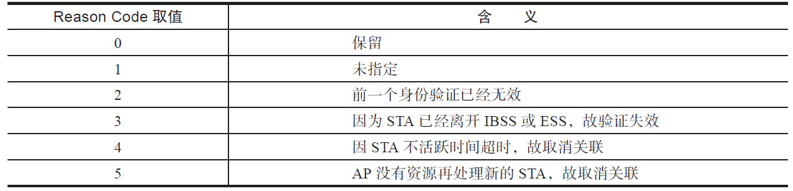

注意规范一共定义了67个不同的ReasonCode值，其详细含义请参考规范的图8-36。

8）StatusCode：该字段长2字节，用于反馈某次操作的处理结果。0代表成功。该字段取值的细节请读者参考规范8.4.1.9节的Table8-37。

管理帧中定长字段还有其他几个，此处就不一一列举了。读者可参考规范8.4.1节以获取详细信息。下面我们介绍管理帧定义的不定长数据结构，即信息元素（InformationElements，IE）​。

（2）信息元素信息元素（IE）包含数据长度不固定的信息，其标准结构如图3-22所示。其中，ElementID表示不同的信息元素类型。Length表示Information字段的长度。根据ElementID的不同，Information中包含不同的信息。

图3-22IE标准结构表3-6列出了几种ElementID及Length的取值情况。完整的取值列表请参考规范中Table8-54。

表3-6ElementID/Length取值

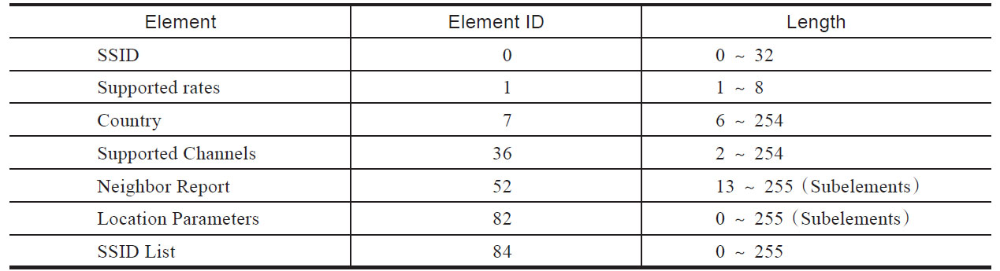

注意，表3-6中最后一列的Subelements表示该项对应的Information采用如图3-23所示的格式来组织其数据。

图3-23Subelement格式很显然，图3-23和图3-22所示格式完全一样，这也就是Subelement的由来。

Subelement的具体内容介绍由SubelementID来决定。

规范阅读提示规范指出IE中的Length字段代表Information的长度。但规范给出的具体IE信息表（如Table8-54）其Length一列却是IE的全长（即ElementID字段长+Length字段+Info字段长度）​。本节所列表3-5中的Length长仅取Info字段长度。故比Table8-54中的Length长度少2字节。

（3）常用管理帧了解了定长字段以及信息元素后，下面介绍管理帧中几种重要类型的帧。

1）Beacon帧：非常重要，AP定时发送Beacon帧用来声明某个网络。这样，STA通过Beacon帧就知道该网络还存在。此外，Beacon帧还携带了网络的一些信息。简单来说，Beacon帧就是某个网络的心跳信息。

Beacon帧能携带的信息非常多，不过并非所有信息都会包含在Beacon帧中。表3-7介绍了Beacon帧中必须包含的信息。

表3-7Beacon帧必须包含的信息

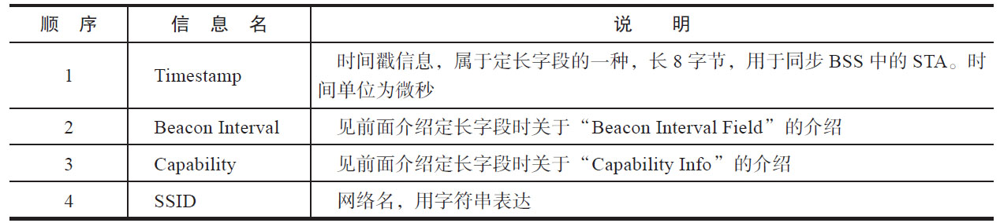

提示如果读者手头有AirPcap工具，不妨尝试截获一下周围的Beacon帧。

2）ProbeRequest/Response帧：STA除了监听Beacon帧以了解网络信息外，还可以发送ProbeRequest帧用于搜索周围的无线网络。规范要求由送出Beacon帧的STA回复ProbeResponse帧，这样，在基础结构型网络中，Beacon帧只能由AP发送，故ProbeResponse也由AP发送。IBSS中，STA轮流发送Beacon帧，故ProbeResponse由最后一次发送Beacon帧的STA发送。

表3-8列出了ProbeRequest帧中必须包含的信息。

表3-8ProbeRequest帧必须包含的信息

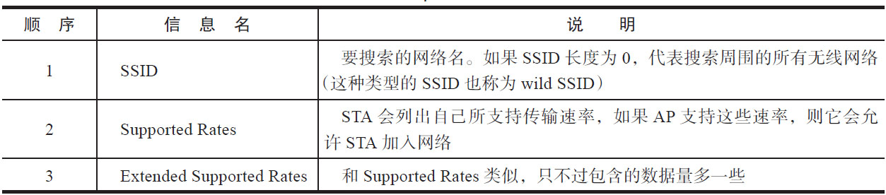

当AP收到ProbeRequest时，会响应以ProbeResponse帧。ProbeResponse帧包含的内容绝大部分和Beacon帧一样，此处就不拟详细讨论了。读者可参考规范Table8-27获取详细信息。

提示图3-18所示为笔者利用AirPcap截获的SSID为"Test"的ProbeRequest帧，读者不妨回头看看此图。

3）AssociationRequest/Response帧：当STA需要关联到某个AP时，将发送此帧。该帧携带的一些信息项如表3-9所示。

表3-9AssociationRequest帧信息请读者参考规范Table8-22获取AssociationRequest帧包含的全部信息项。

针对AssociationRequest帧，AP会回复一个AssociationResponse帧用于通知关联请求处理结果。该帧携带的信息如表3-10所示。

表3-10AssociationResponse帧信息请读者参考规范Table8-23获取AssociationResponse帧包含的全部信息项。

4）Authentication帧：用于身份验证，其包含的信息如表3-11所示。

表3-11Authentication帧信息

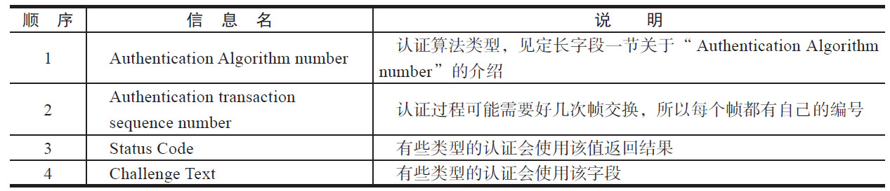

至此，我们对802.11MAC管理帧的相关知识就介绍完毕。规范定义的管理帧类型并不多，一共15种。但管理帧携带的信息却相当复杂，其中定长字段有42种，IE有120种。此处建议读者先了解管理帧中信息的组织方式，然后对最重要的几种管理帧做简单了解。以后碰到不熟悉的情况，可直接查询802.11规范相关小节即可获取最完整的信息。

[15]​[17]5.数据帧图3-24展示了802.11中完整的数据帧格式。

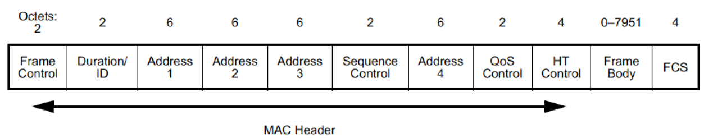

图3-24数据帧格式其中，QoSControl和HT（HighThroughput）Control字段只在QoS和HT的情况下出现。本书不讨论它们的内容。其他情况下，FrameBody最大长度为2312字节。

提示图3-24中4个Address字段的使用请参考表3-3和图3-16。

[21]6.802.11上层协议封装本节介绍802.11中如何对上层协议进行格式封装。和Ethernet不同，802.11使用LLC层来封装上层协议，如图3-25所示。

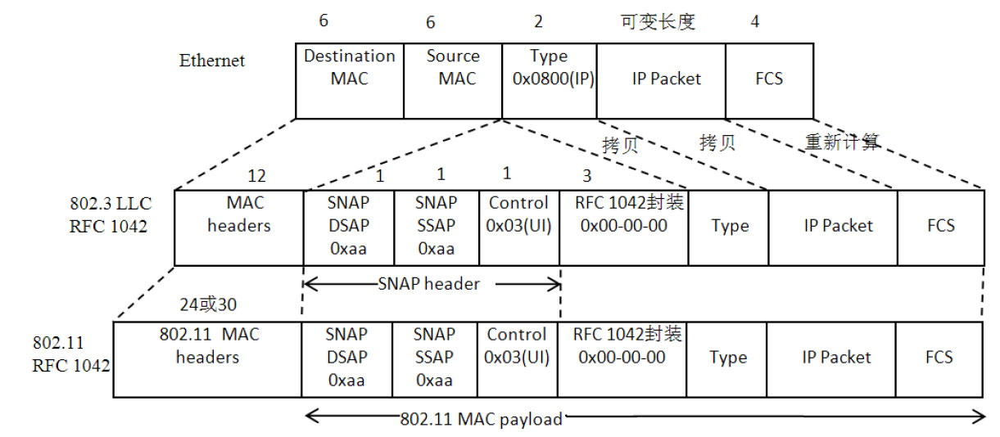

图3-25802.11上层协议封装图3-25中，最上层是Ethernet帧格式。前面12字节分别是目标MAC地址以及源MAC地址。Type字段可以为0x0800，代表后面的数据是IP包。

当Ethernet帧要在无线网络上传输时，必须先将其转换为LLC帧，如中间一层所示。这种转换方法由RFC1042规定。它主要在MACheaders和Type之间增加了4个字段。它们统称为SNAPheader（SubNetworkAccessProtocol，子网访问协议）​，分别如下。

❑DSAP（DestinationServiceAccessPoint，目标服务接入点）​。

❑SSAP（SourceServiceAccessPoint，源服务接入点）​。

❑Control（控制字段，值被设定为0x03，代表UnnumberedInformation，即未编号信息）​。

❑OUI（固定为0x000000）​。

LLC数据最后被封装成802.11MAC帧。主要变化是帧头信息，因为802.11MAC帧最多能携带4个MAC地址。其他信息则作为802.11MAC帧的数据载荷。

注意802.11除了可以用RFC1024来封装Ethernet外，还支持802.1h的封装方法。

详情见参考资料[21]​。

笔者截获的802.11MAC帧以及以太网帧IP包如图3-26所示。

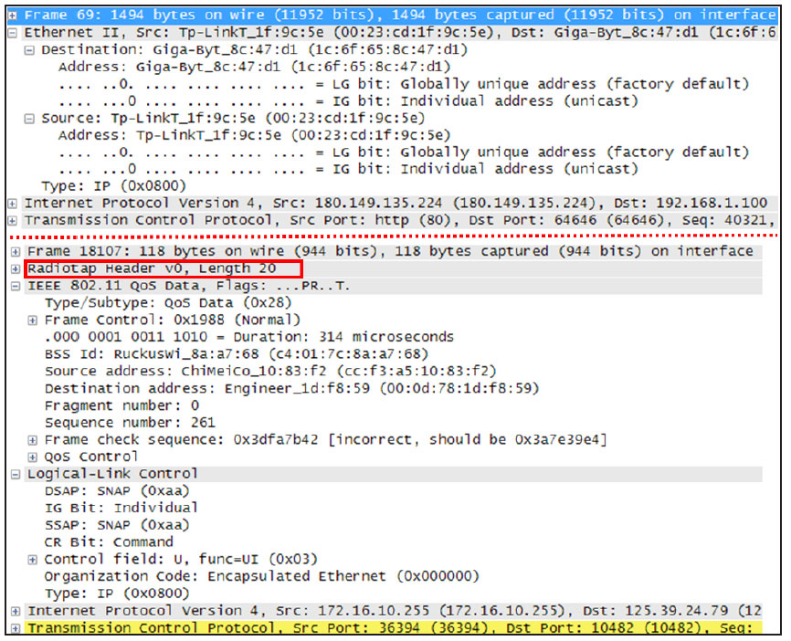

图3-26以太网帧和802.11MAC帧图3-26上半部分为Ethernet的IP帧封装情况，下半部分为IP包在802.11中的封装情况。

注意图3-26中的黑框表示Radiotap头信息。它是网卡添加在802.11MAC头部前的数据，记录了信号强度、噪声强度和传输速率等物理层信息。关于Radiotap更多信息，请读者参考hp://www.radiotap.org/。

通过对MAC提供的服务以及MAC帧相关知识的介绍，读者会发现这部分难度主要集中在802.11MAC帧上，尤其是管理帧包含的信息更是非常丰富。

从程序员角度看，可以认为本节为802.11定义了大量的数据结构和数据类型。从下一节开始，我们将介绍MAC层中的“类和函数”​。

规范阅读提示1）本节内容主要取自规范的第8章"FrameFormats"。

2）由于篇幅问题，本书不介绍802.11MAC层的功能。这部分内容主要集中在规范的第9章"MACsublayerfunctionaldescription"。

[23.3.6802.11MAC管理实体2]​[23]802.11包括了MAC层和PHY层。根据图3-4可知这两层内部都对应有Entity，它们通过SAP（ServiceAccessPoint）为对应的上层提供服务。图3-27展示了802.11中的Entity和SAP。

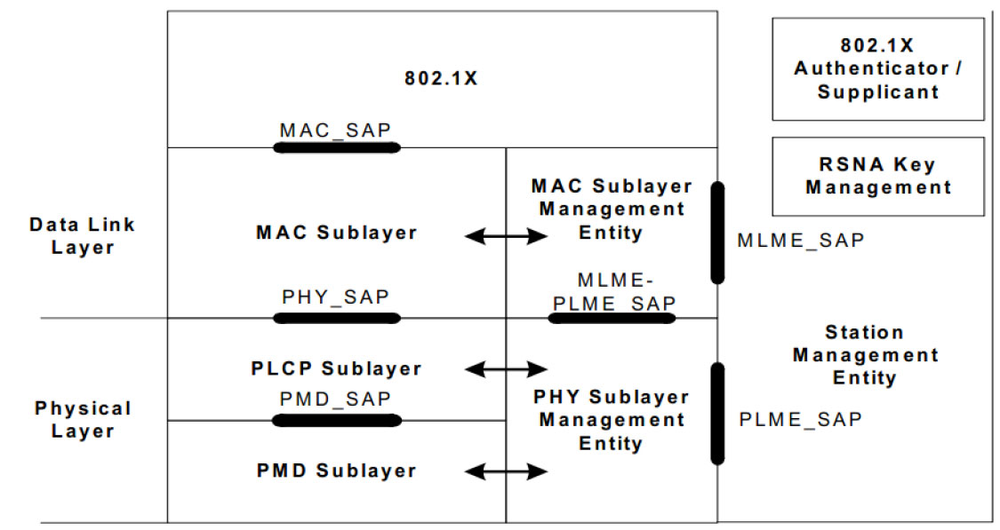

图3-27802.11Entity模型由图3-27可知：

❑MAC_SAP为LLC层提供服务，其具体内容见3.3.5节“MAC服务定义”​。

❑MAC子层中还有专门负责管理的Entity，名为MLME（MACSublayerManagementEntity）​，它对外提供的接口是MLME_SAP。

❑PHY层还可细分为PLCP和PMD两层（本书不讨论）​。

❑物理层对外提供的管理实体是PLME（PHYSublayerManagementEntity）​，对应的SAP缩写为PLME_SAP。

❑为了方便对802.11MAC及PHY层统一操作和管理，规范还定义一个SME（StationManagementEntity）​。该实体独立于MAC和PHY层。使用者可通过SME实体来操作MAC层和PHY层中的SAP。

本节重点关注MAC的管理Entity（即MLME）及其对应的SAP。规范中关于MLME_SAP一共有82个原语，其中一部分如图3-28所示。

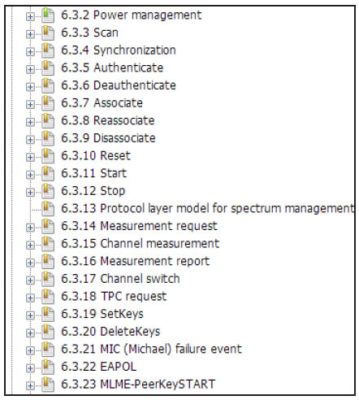

图3-28MLMESAP部分内容原语的定义曾在3.3.5节MAC服务定义中见过，它其实就是通过定义API来表达自己所具有的功能。MLME_SAP非常多，本章不可能全部覆盖，此处仅介绍三个常用的原语。

❑Scan：用于扫描周围的无线网络。

❑Authenticate：关联到某个AP前，用于STA的身份验证。

❑Associate：关联某个AP。关联成功后，STA就正式加入无线网络了。

提醒请读者务必注意一点，理解MLME_SAP原语对掌握Wi-Fi技术非常重要。从编程角度来说，MLME_SAP相当于定义了一套接口函数，而后续章节将介绍的wpa_supplicant只是对它们的实现。

1.Scan介绍原语的参数比较多，但并不是所有参数都需要（由对应的MIB项控制）​，本书仅介绍比较重要的参数（用加粗字体表示）​。

（1）requestScan.request原语用于扫描周围的无线网络，其原型如下。

```
MLME-SCAN.request(
  BSSType,BSSID,SSID,ScanType,ProbeDelay,
  ChannelList,MinChannelTime,MaxChannelTime,
  RequestInformation, SSID List,
  ChannelUsage,AccessNetworkType,HESSID,MeshID,VendorSpecificInfo
 )
```

Scan参数中，比较几个重要的分别如下。

❑BSSType：类型为枚举（Enumeration）​，可取值为INFRASTRUCTURE、INDEPENDENT、MESH、ANY_BSS。

❑BSSID：类型为MAC地址。可以是某个指定的BSSID或者广播BSSID。

❑SSID：类型为字符串。0～32字节长。指定网络名，如果长度为0，则为wildssid。

❑ScanType：类型为枚举，可取值为ACTIVE（主动）​、PASSIVE（被动）​。详情见下文。

❑ProbeDelay：类型为整型，单位为微秒。

用于ACTIVE模式的扫描，详情见下文。

❑ChannelList：类型为有序整数列表（Orderedsetofintegers）​，扫描时使用。

❑MinChannelTime和MaxChannelTime：

类型均为整型。用于指示扫描过程中在每个信道上等待的最小和最长时间。时间单位为TU。

由Scan.request的ScanType参数可知，802.11规定了两种扫描模式。

❑ACTIVE模式：这种模式下，STA在每个Channel（信道）上都会发出ProbeRequest帧用来搜索某个网络。具体工作方式是，STA首先调整到某个信道，然后等待来帧指示（表明该信道有人使用）或超时时间ProbeDelay。两个条件满足任意一个，STA都将发送ProbeRequest帧，然后STA在该信道上等待最少MinChannelTime时间（如果在此时间内信道一直空闲）​，最长MaxChannelTime时间。

❑PASSIVE模式：这种模式下，STA不发送任何信号，只是在ChannelList中各个信道间不断切换并等待Beacon帧。根据前述介绍可知，在基础结构型网络中AP会定时发送Beacon帧以宣告网络的存在。所以，PASSIVE模式下，STA能根据Beacon帧来了解周围所存在的无线网络。

（2）confirmScan.confirm用于通知扫描结果，其原型定义如下。

```
MLME-SCAN.confirm（
  BSSDescriptionSet，BSSDescriptionFromMeasurementPilotSet，
  ResultCode，VendorSpecificInfo
  ）
```

❑BSSDescriptionSet：类型为BSSDescription列表。具体内容见下文。

❑ResultCode：类型为枚举，可取值为SUCCESS和NOT_SUPPORTED。

BSSDescription包含很多内容，常见项如表3-12所示。

表3-12BSSDescription内容

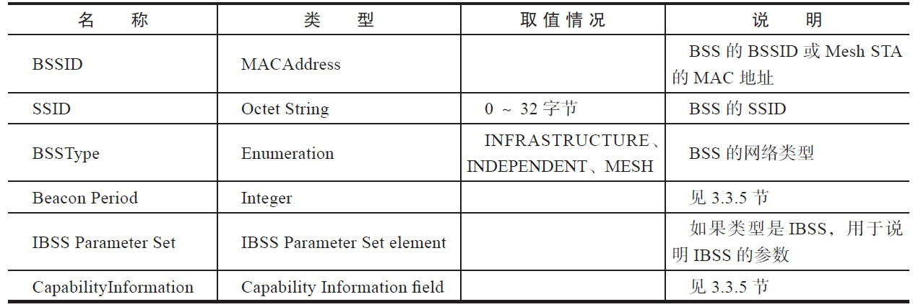

获取周围的无线网络后，STA可以选择加入（join）其中的一个BSS。规范没有定义网络加入的原语，但实际上大部分无线网卡在实现时，都需要join相关的处理。因为如果周围存在多个无线网络时，需要用户参与来选择加入哪一个网络。BSSDescription全部取值列表请参考规范6.3.3.3.2节。

2.Authenticate介绍关联到某个AP前，STA必须通过身份验证。

该处理由Authenticate对应的原语来完成。

由于身份验证涉及两个STA（以基础结构型网络为例，一个是STA，另一个是AP）​，所以Authenticate包含4个原语，分别如下。

```
MLME-AUTHENTICATE.request(
    PeerSTAAddress,AuthenticationType, AuthenticateFailureTimeout,
    Content of FT Authentication elements,
    Content of SAE Authentication Frame,
    VendorSpecificInfo
)
// confirm原型
MLME-AUTHENTICATE.confirm(
    PeerSTAAddress,AuthenticationType, ResultCode,
    Content of FT Authentication elements,
    Content of SAE Authentication Frame,
    VendorSpecificInfo
)
```

❑MLME-Authenticate.request：STAA向APB发起身份验证请求。

❑MLME-Authenticate.confirm：STAA收到来自APB的身份验证处理结果。

❑MLME-Authenticate.indication：APB收到来自STAA的身份验证处理请求。

❑MLME-Authenticate.response：APB向STAA发送身份验证处理结果。

先来看request和confirm原语。

（1）request和confirmrequest和confirm原语原型如下。

上述原语定义说明如下。

❑PeerSTAAddress：类型为MAC地址，代表对端STA的地址。以本例而言，则是APB的MAC地址。

❑AuthenticationType：类型为枚举，可取值有OPEN_SYSTEN、SHARED_KEY、FAST_BSS_TRANSITION和SAE。用于表示认

```
MLME-AUTHENTICATE.indication(
    PeerSTAAddress,AuthenticationType,
    Content of FT Authentication elements,
    Content of SAE Authentication Frame,
    VendorSpecificInfo
)
// response原型
MLME-AUTHENTICATE.response(
    PeerSTAAddress,AuthenticationType, ResultCode,
    Content of FT Authentication elements,
    Content of SAE Authentication Frame,
    VendorSpecificInfo
)
```

证过程中使用的认证类型。这部分内容见3.3.7节无线网络安全相关介绍。

❑AuthenticateFailureTimeout：类型为整型，代表认证超时时间，单位为TU。

❑ResultCode：代表认证处理结果。

MLME-AUTHENTICATE.request将触发STAA发送Authenticate帧。下面来看APB如何处理收到的这个Authenticate帧呢？

（2）indication和response这两个原语定义和request以及confirm基本一样。

indication和对应的response参数与request以及confirm一样，此处不详述。

3.Associate介绍STA通过身份验证后，就需要和AP关联。只有关联成功后，STA才正式成为无线网络的一员。

```
MLME-ASSOCIATE.request(
  PeerSTAAddress, AssociateFailureTimeout,CapabilityInformation,
  ListenInterval,Supported Channels,
  RSN,
  QoSCapability,Content of FT Authentication elements,SupportedOperatingClasses,
  HT Capabilities,Extended Capabilities,20/40 BSS Coexistence, QoSTrafficCapability,
  TIMBroadcastRequest,EmergencyServices,VendorSpecificInfo
)
// confirm原语
MLME-ASSOCIATE.confirm(
  ResultCode,CapabilityInformation,AssociationID,SupportedRates,
  EDCAParameterSet,RCPI.request,RSNI.request,RCPI.response,
  RSNI.response,RMEnabledCapabilities,Content of FT Authentication elements,
  SupportedOperatingClasses,HT Capabilities,Extended Capabilities,
  20/40 BSS Coexistence, TimeoutInterval,BSSMaxIdlePeriod,TIMBroadcastResponse,
  QosMapSet,VendorSpecificInfo
)
```

注意对于RSN，关联成功后还需通过802.1X身份验证。相关内容留待3.3.7节介绍。

Associate包含的原语和Authentication一样，都有request、confirm、indication和response。我们先来看request和confirm。

（1）request和confirmrequest和confirm原语定义如下。

上述原语中包含的参数信息如下。

❑PeerSTAAddress：响应Association请求的STA的MAC地址，即AP的地址。

❑AssociateFailureTimeout：类型为整型，代表关联超时时间，单位为TU。

❑CapabilityInformation：指定AP的性能信息。

❑ListenInterval：用于告知AP，STA进入PS模式后，监听Beacon帧的间隔时间。

❑RSN：类型为RSNE，指示STA选设置的安全方面的信息。详情见3.3.7节。

❑ResultCode：AP返回的处理结果。

❑AssociationID：AP返回的关联ID。

❑SupportedRates：AP返回的所支持的传输速率列表。速率以500kbps为单位。

（2）indication和responseindication和response原语定义如下。

```
MLME-ASSOCIATE.indication(
  PeerSTAAddress,CapabilityInformation,ListenInterval,SSID,SupportedRates,
  RSN,QoSCapability,RCPI,RSNI,RMEnabledCapabilities,
  Content of FT Authentication elements,SupportedOperatingClasses,
  DSERegisteredLocation,
  HT Capabilities,Extended Capabilities,20/40 BSS Coexistence,QoSTrafficCapability,
  TIMBroadcastRequest,EmergencyServices,VendorSpecificInfo
)
// response原语
MLME-ASSOCIATE.response(
PeerSTAAddress,ResultCode,CapabilityInformation,AssociationID,
EDCAParameterSet,RCPI,RSNI,RMEnabledCapabilities,
Content of FT Authentication elements,
SupportedOperatingClasses,DSERegisteredLocation,HTCapabilities,
Extended Capabilities,
20/40 BSS Coexistence, TimeoutInterval,BSSMaxIdlePeriod,TIMBroadcastResponse,
QoSMapSet,VendorSpecificInfo
)
```

上述原语和参数中，只有indication的SSID略有不同，它代表发起关联请求的STA的MAC地址。

[24]4.STA状态转换上面原语操作成功后，STA状态将发生变化。

STA从最初到最终的状态切换如图3-29所示。

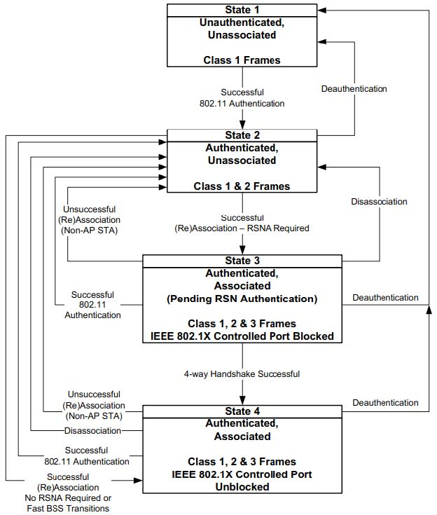

图3-29STA状态切换图3-29中包含很多知识点，下面一一介绍它们。首先是MAC帧Frame的类别（Class）​，规范定义MAC帧一共有三种类别，分别是Class1、Class2和Class3，各自包含不同的MAC帧，如表3-13所示。

表3-13MAC帧分类

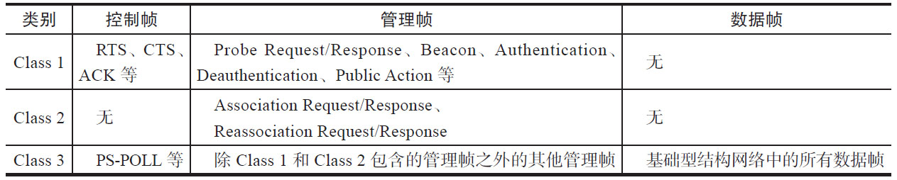

结合图3-29，可知STA在不同状态下发送的MAC帧类别也不同。这主要是和网络安全有关，没有通过身份验证的STA是不允许随意传输数据的。图3-29中，STA的状态转换如下（以基础结构型网络为例）​。

❑STA首先处于State1，即未认证和未关联的情况。为了能加入无线网络，它需要发送Authentication帧给AP。如果认证成功，将转入State2。State1情况下不能发送数据帧。

❑State2是已认证，未关联状态。STA将发送Association帧给AP进行关联。成功后，进入State3。State2情况下也不能发送数据帧。

❑State3属于已认证，已经关联，但还未通过RSN（RobustSecurityNetwork，强健安全网络）认证的状态。RSN采用802.1X进行控制。由于未通过RSN认证，所以只能发送处理认证的数据帧，即4-WayHandshake（四次握手）帧。这部分内容在3.3.7节介绍。

❑4-WayHandshake成功后，STA进入State4。此时它完全加入无线网络，所有数据帧就能正常传输。

MAC管理实体包含的功能很多，不过对程序员来说，其理解难度反而较小，因为它定义的原语类似代码中的API，而且每个参数的作用有详尽的解释。读者以后在分析wpa_supplicant的时候，不妨多回顾本节内容。
