# 3.3.7 无线网络安全技术知识点

安全是无线网络技术中一个很重要的部分，它主要有三个保护点。

❑数据的完整性（Integrity）​：用于检查数据在传输过程中是否被修改。

❑数据的机密性（Confidentiality）​：用于确保数据不会被泄露。

❑身份验证和访问控制（AuthenticationandAccessControl）​：用于检查受访者的身份。

提示身份验证和访问控制的问题在无线网络中尤为明显。因为Wi-Fi以空气作为传播媒介，这意味着任何人通过类似AirPcap这样的工具就能获取其周围的无线通信数据。

而在以太网环境中，虽然网络数据也是通过广播方式发送，但用户需要把网线插到网口中才能监听数据。相信没有哪个公司能随随便便允许一个外人把网线插到其公司内部的网口上。由于无线网络天然就不存在有线网络中这种类似的物理隔离，所以身份验证和访问控制是无线网络中非常重要的一个问题。

无线网络安全技术也是随着技术发展而逐渐在演变，下面介绍其主要发展历程。

❑802.11规则首先提出了WEP（WiredEquivalentPrivacy，有线等效加密）​。如其名所示，它是为了达到和有线网络同样的安全性而设计的一套保护措施。

❑经过大量研究，人们发现WEP很容易破解。在802.11规范提出新解决方案之前，WFA提出了一个中间解决方案，即WPA（Wi-FiProtectedAccess）​。这个方案后来成为802.11i草案的一部分。

❑802.11i专门用于解决无线网络的安全问题。该规范提出的最终解决方案叫RSN（RobustSecurityNetwork，强健安全网络）​，而WFA把RSN称为WPA2。

本节先介绍WEP，然后介绍RSN中的数据加密，最后将介绍EAP、802.1X和RSNA密匙派生等内容。

注意本书仅介绍数据加密及完整性校验的大致工作流程，而算法本身的内容请读者自行研究。

另外，安全知识点中会经常见到Key（密钥）和Password（密码，也叫Passphrase）这两个词。它们本质意思都一样，只不过Password代表可读（humanreadable，如字符串、数字等）的Key，而Key一般指由算法生成的不可读（如二进制、十六进制数据等）的内容。

1.WEP介绍WEP是802.11规范的元老，在1999年规范刚诞生时就存在了。但随着技术的发展，如今WEP已经无力应付复杂险恶网络环境中的安全问题了。先来介绍WEP中的数据加密。

[16]​[25]​[26]（1）WEP中的数据加密保护数据Confidentiality的一个主要方法就是对所传输的数据进行加密，而WEP采用了流密码（StreamCipher）对数据进行加密。这种加密方法的原理如图3-30所示。

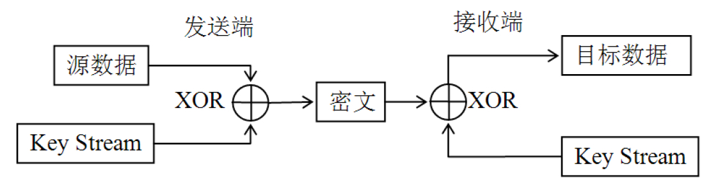

图3-30流密码工作原理流密码的工作原理如下。

❑源数据通过KeyStream（密钥流）进行加密，加密方式就是异或（XOR）​，得到密文。

❑接收端得到密文后，再用相同的KeyStream进行异或操作，这样就能得到目标数据。两次异或操作，KeyStream又一样，所以目标数据就是源数据。

❑整个过程中，只要KeyStream保证随机性，那么不知道KeyStream的人理论上就无法破解密文。

根据上述内容可知，流密码安全性完全依赖于KeyStream的随机性，那么怎么生成它呢？

一般的做法是：用户输入一个SecretKey（即密码）到伪随机数生成器（PseudoRandomNumberGenerator，PRNG）中，而PRNG会根据这个SecretKey生成密钥流。

下面回到WEP，它的加密处理过程如图3-31所示。

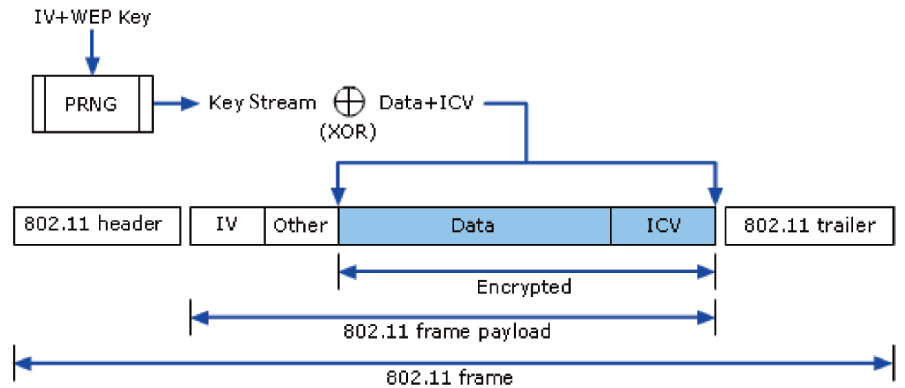

图3-31WEP加密过程WEP加密过程如下。

❑左上角PRNG的输入（即随机数种子）​，包括一个IV（InitializationVector，初始向量，长24位）和WEPKey（Key长度有40、104和128位。位数越多，安全性越高）​。IV的值由设备厂商负责生成。PRNG最终输出KeyStream。

❑XOR（即加密）操作的一方是KeyStream，另一方是数据和ICV（IntegrityCheckValue，完整性校验值）​。ICV长32位，其值由CRC-32方法对Data进行计算后得到。XOR操作后的数据即图3-29所示的Encrypted部分。可知Data和ICV都经过了加密。

❑最终的MAC帧数据（framepayload）包括IV以及加密后的Data以及ICV。

再来看WEP的解密过程，如图3-32所示。

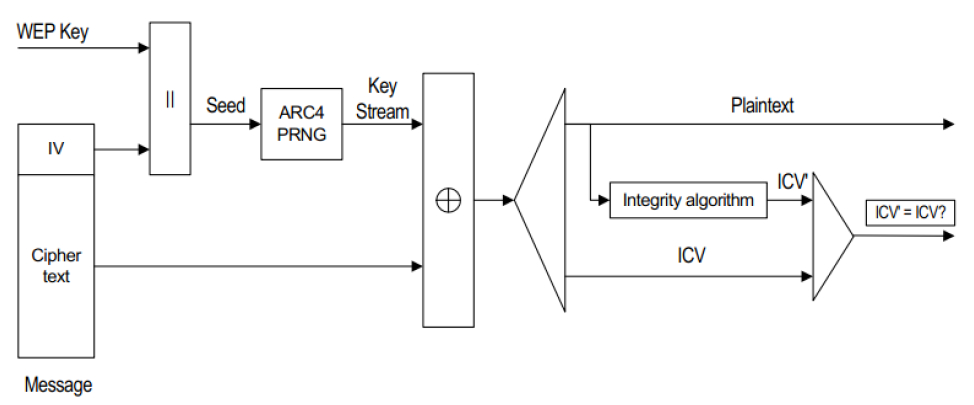

图3-32WEP解密过程WEP解密过程如下。

❑帧数据中的IV和WEPKey共同作为PRNG的输入以得到KeyStream。

❑KeyStream和帧数据中的CipherText执行异或操作，得到明文（Plaintext）以及ICV。

❑接收端同时对自己解密得到的明文进行完整性校验，得到ICV′。如果ICV和ICV′一样，则数据正确。

提醒WEP弱点很多，其最主要的一个问题就是所有数据都使用同一个WEPKey进行加密。至于WEP存在的其他问题，读者可阅读参考资料[25]以获得更详细的信息。

[27]​[28]（2）WEP中的身份验证WEP其实并没有考虑太多关于身份验证方面的事情，根据IEEE802.11-2012规范，本节真正的名字应该叫"Pre-RSNAAuthentication"，即RSNA出现之前的身份验证。不过由于Pre-RSNA的认证方法和WEP有密切关系，所以一般就叫WEP身份验证。

WEP身份验证有以下两种。

❑开放系统身份验证（OpenSystemAuthentication）：这种验证其实等同于没有验证，因为无论谁来验证都会被通过。那它有什么用呢？规范规定，如果想使用更先进的身份验证（如RSNA）​，则STA在发起Authentication请求时，必须使用开放系统身份验证。由于开放系统身份验证总是返回成功，所以STA将接着通过Association请求进入图3-29中的State3然后开展RSNA验证。

❑共享密钥身份认证（SharedKeyAuthentication）：SharedKey这个词以后还会经常碰到，它表示共享的密码。例如在小型办公及家庭网络（SmaOffice/HomeOffice，SOHO）环境中，AP的密码一般很多人（即很多STA）都知道。

提示初看上去，共享密钥身份验证的安全性比开放系统要强，但实际却恰恰相反。因为使用了共享密钥身份验证就不能使用更为安全的RSNA机制。

由于笔者家庭网络就使用了共享密钥身份验证，故这里也简单向读者介绍一下其工作原理，如图3-33所示。

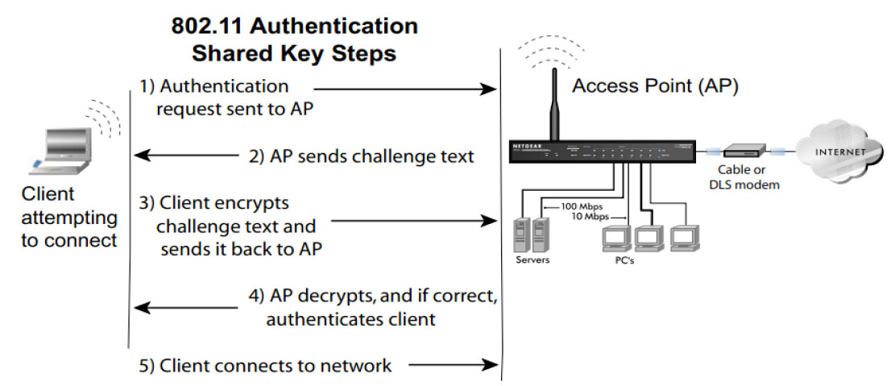

图3-33共享密钥身份验证原理由图3-33可知SharedKey验证的方法包括四次帧交互。

❑STA（即图中的Client）发送Authentication请求给AP。

❑AP收到请求后，通过AuthenticationResponse发送一个质询明文（ChaengeText，长度为128字节）给STA。

❑STA取出ChaengeText，通过图3-31所示的WEP加密方法利用自己设置的密钥对质询文进行加密，然后再次发送AuthenticationRequest给AP。

❑AP收到第二次AuthenticationRequest帧后，会利用AP的密钥进行解密，同时还要验证数据完整性。如果ICV正确，并且解密后的译文等于之前发送的质询文，则可知STA拥有正确的密码，故STA身份验证通过。

❑AP返回验证处理结果给STA。如果成功，STA后续将通过Association请求加入该无线网络。

WEP的介绍就到此为止，下面来介绍RSNA中的数据加密。

[29]​[30]2.RSN数据加密及完整性校验RSN中数据加密及完整性校验算法有两种，分别是TKIP和CCMP。下面分别来介绍它们。

规范阅读提示规范中还有一种广播/组播管理帧完整性校验的方法，叫BIP（Broadcast/MulticastIntegrityProtocol）​。请读者自行阅读规范11.4.4节以了解相关内容。

介绍TKIP前，先介绍WPA。WPA是802.11i规范正式发布前用于替代WEP的一个中间产物。相比WEP，WPA做了如下改动。

❑WPA采用了新的MIC（MessageIntegrityCheck，消息完整性校验）算法用于替代WEP中的CRC算法。新算法名为Michael。

❑采用TKIP（TemporalKeyIntegrityProtocol，临时密钥完整性协议）用于为每一个MAC帧生成不同的Key。这种为每帧都生成单独密钥的过程称为密钥混合（KeyMixing）​。

（1）TKIP加密下面简单介绍TKIP的加密过程，如图3-34所示。

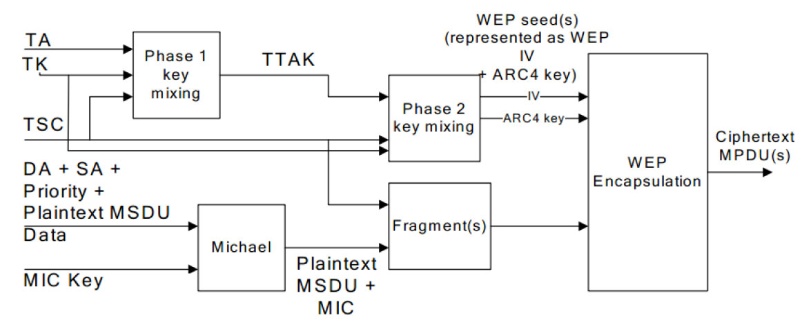

图3-34TKIP加密过程❑左下角：用于数据完整性校验的Michael算法的输入包括两部分，一部分是MICKey（由厂商负责实现）​，另一部分是MAC帧头中的DA、SA、Priority和MAC帧数据。Michael算法的输出为Data和MIC。它们将作为后续加密算法的输入（等同于图3-31中加密前的Data+ICV）​。

❑左上角：TKIP的密钥计算分为两部分。首先是第一阶段的密钥混合，其输入有TA（TransmitterAddress，32位）​、TK（TemporalKey，128位）和TSC（TKIPSequenceCounter，序列号计数器。共48位，此处取其前32位）​。此阶段密钥混合段的产物是TTAK（TKIP-mixedTransmitAddressandKey，长80位）​。注意，TK的来历见后文关于密匙派生的知识。

❑中间部分：Phase2keymixing属于密钥计算的第二部分。本阶段计算的输入有TTAK和TSC（取其后16位）​，其产物可用作后续加密计算的WEP种子（包括一个128位的ARC4密钥以及IV，可参考图3-31）​。

❑最后一步：利用WEP的加密方法进行数据加密，其过程即先利用WEP种子和PRNG生成密钥流（由于每一个待加密的帧都会有不同的TSC，导致在进行PRNG前，每次输入都有不同的WEPKey）​，然后使用XOR操作对Data和MIC进行异或。

由上述内容可知，TKIP将为每一帧数据都使用不同的密钥进行加密，故其安全性比WEP要高。另外，由于生成密钥和计算完整性校验时会把MAC地址（如DA、SA、TA）等信息都考虑进去，所以它可以抵抗几种不同类型的网络攻击[30]​。不过，从加密本身来考虑，TKIP和WEP一样都属于流密码加密。

（2）CCMP加密CCMP出现在WPA2中，它比TKIP更安全，因为它采用了全新的加密方式CCMP（CounterModewithCBC-MACProtocol，计数器模块及密码块链消息认证码协议）​，这是一种基于AES（AdvancedEncryptionStandard，高级加密标准）的块的安全协议。

CCMP加密过程如图3-35所示。

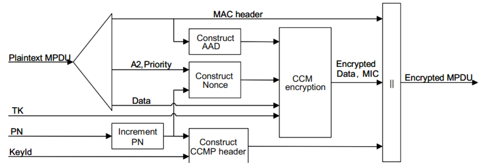

图3-35CCMP加密过程❑左下角：PN（PacketNumber，帧编号，48位）和KeyId（KeyIdentifier，密钥标示符，每帧使用一个密钥）共同构成一个8字节的CCMP头（CCMPHeader）​。另外，每一帧的PN都会累加，所以图中有一个"IncrementPN"处理框（注意，重传包的PN不累加）​。

❑左上角：PlaintextMPDU（注意不是MSDU）意味着整个MAC帧（包括Head）都是输入参数。MPDU被拆分成三个部分，其中A2（Address2字段）​、Priority和PN共同构成Nonce（即临时的随机数，用一次后就丢弃不再使用）​。MPDU中的MAC头信息将构成AAD（AdditionalAuthenticationData，附加认证数据）​。

❑AAD、Nonce、MPDU中的MAC数据（Payload）以及TK（TemporaryKey）共同作为加密算法的输入，最终得到加密后的数据及消息校验码（MessageIntegrityCheck，MIC）​。

❑CCMPHeader、MACHeader、加密后的Data以及MIC共同构成了MPDU包。

关于RSN中的加密算法TKIP及CCMP就介绍到此。由于加解密工作上由硬件来完成，读者仅需了解其中涉及的概念即可。

3.EAP和802.1X介绍从本节开始，我们将重点关注安全主题中最后一个重要部分，即身份验证。首先介绍EAP，然后介绍802.1X。

提示wpa_supplicant很大一部分内容就是在处理身份验证，所以本节也将花费较多的笔墨来介绍相关内容。

[31]​[32]​[33]（1）EAP目前身份验证方面最基础的安全协议就是EAP（ExtensibleAuthenticationProtocol）​，协议文档定义在RFC3748中。EAP是一种协议，更是一种协议框架。基于这个框架，各种认证方法都可得到很好的支持。下面来认识EAP协议。首先介绍其中涉及的几个基本概念。

❑Authenticator（验证者）​：简单点说，Authenticator就是响应认证请求的实体（Entity）​。对无线网络来说，Authenticator往往是AP。

❑Supplicant（验证申请者）发起验证请求的实体。对于无线网络来说，Supplicant就是智能手机。

❑BAS（BackendAuthenticationServer，后端认证服务器）​：某些情况下（例如企业级应用）Authenticator并不真正处理身份验证，它仅仅将验证请求发给后台认证服务器去处理。正是这种架构设计拓展了EAP的适用范围。

❑AAA（Authentication、AuthorizationandAccounting，认证、授权和计费）​：另外一种基于EAP的协议。实现它的实体属于BAS的一种具体形式，AAA包括常用的RADIUS服务器等。在RFC3748中，AAA和BAS的概念可互相替代。

❑EAPServer：表示真正处理身份验证的实体。如果没有BAS，则EAPServer功能就在Authenticator中，否则该功能由BAS实现。

EAP架构如图3-36所示。

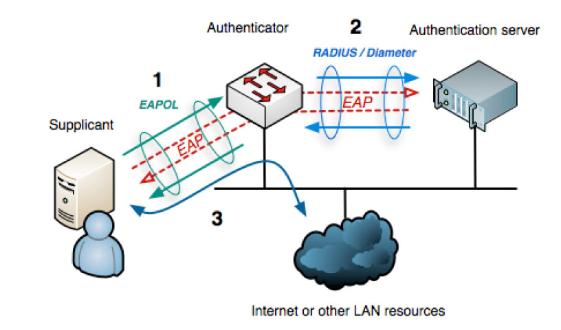

图3-36EAP架构由图3-36所示，Supplicant通过EAPOL（EAPOverLAN，基于LAN的扩展EAP协议）发送身份验证请求给Authenticator。图中的身份验证由后台验证服务器完成。如果验证成功，Supplicant就可正常使用网络了。

下面来认识EAP的协议栈，如图3-37所示。

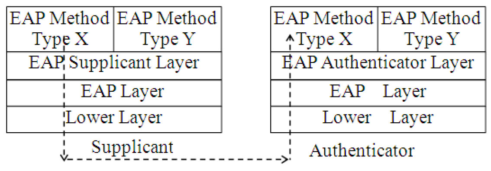

图3-37EAP协议栈由图3-37可知，EAP没有强制定义位于最底层（LowerLayer，LL）的传输层。目前支持EAP协议的网络有PPP、有线网（EAPOL，也就是802.1X协议）​、无线网络（即802.11WLAN）​、TCP、UDP等。另外，LL本身的特性（例如以太网和无线网都支持数据重排及分片的特性）会影响其上一层EAP的具体实现。

❑EAPLayer用于收发数据，同时处理数据重传及重复（Duplicate）包。

❑EAPSupplicant/AuthenticatorLayer根据收到EAP数据包中Type字段（见下文介绍）

的不同，将其转给不同的EAPMethod处理。

❑EAPMethod属于具体的身份验证算法层。

不同的身份验证方法有不同的MethodType。

EAP协议的格式非常简单，如图3-38所示。

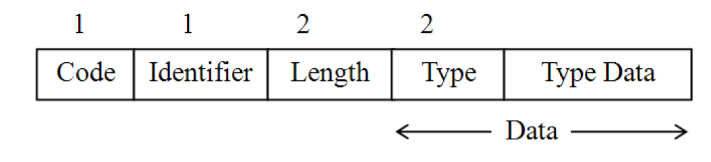

图3-38EAP协议格式❑Code：EAP协议第一字节，目前仅有四种取值，分别为1（Request）​、2（Response）​、3（Success）​、4（Failure）​。

❑Identifier：消息编号（ID）​，用于配对Request和Response。

❑Length：2字节，用于表示EAP消息包长度（包括EAP头和数据的长度）​。

❑Data：EAP中具体的数据（Payload）​。当Code为Request或Response的时候，Data字段还可细分为Type以及TypeData。Type就是图3-37中的EAPMethodType。

EAPMethodType取值如下。

❑1：代表Identity。用于Request消息中。其TypeData字段一般将携带申请者的一些信息。一般简写为EAP-Request/Identity或者Request/Identity。

❑2：代表Notification。Authenticator用它传递一些消息（例如密码已过期、账号被锁等）给Supplicant。一般简写为Request/Notification。

❑3：代表Nak，仅用于Response帧，表示否定确认。例如Authenticator用了Supplicant不支持的验证类型发起请求，Supplicant可利用Response/Nak消息以告知Authenticator其支持的验证类型。

❑4：代表身份验证方法中的MD5质询法。

Authenticator将发送一段随机的明文给Supplicant。Supplicant收到该明文后，将其和密码一起做MD5计算得到结果A，然后将结果A返回给Authenticator。Authenticator再根据正确密码和MD5质询文做MD5计算得到结果B。A和B一比较就知道Supplicant使用的密码是否正确。

❑5：代表身份验证方法为OTP（OneTimePassword，一次性密码）​。这是目前最安全的身份验证机制。相信网购过的读者都用过它，例如网银付费时系统会通过短信发送一个密码，这就是OTP。

❑6：代表身份验证方法为GTC（GenericTokenCard，通用令牌卡）​。GTC和OTP类似，只不过GTC往往对应一个实际的设备，例如许多国内银行都会给申请网银的用户一个动态口令牌。它就是GTC。

❑254：代表扩展验证方法（ExpandedTypes）​。

❑255：代表其他试验性用途（ExperimentalUse）​。

图3-39所示为一个简单的EAP交互。第三和第四步时，Authenticator要求使用MD5质询法进行身份验证，但Supplicant不支持，故其回复NAK消息，并通知Authenticator使用GTC方法进行身份验证。第六步中，如果Supplicant回复了错误的GTC密码时，Authenticator可能会重新发送Request消息以允许Supplicant重新尝试身份验证。一般认证失败超过3次才会回复Failure消息。

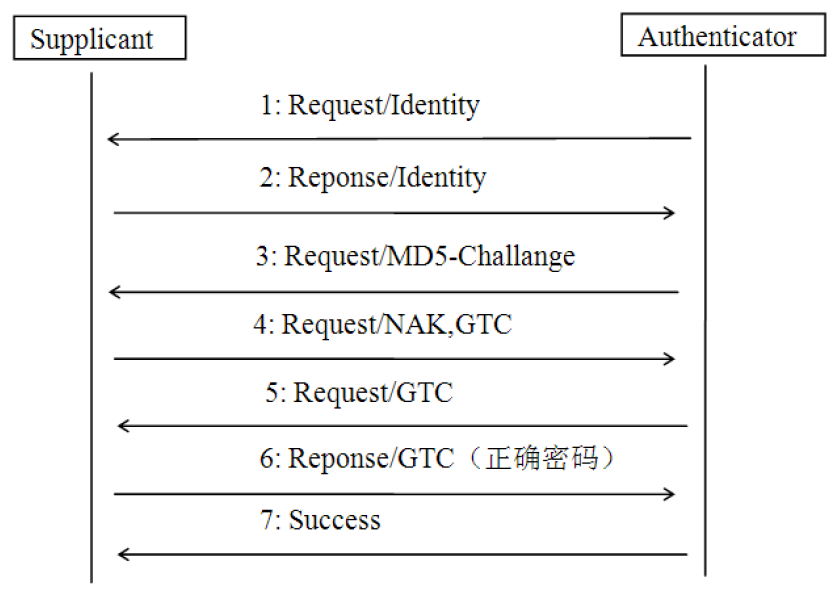

图3-39EAP交互EAP的基本情况就介绍到此，读者可通过RFC3748了解它的详细情况。下面介绍802.1X。

提示可阅读参考资料[32]以了解EAP的其他几种验证方法。

[34]​[35]（2）802.1X802.1X是802.1规范家族中的一员。简单来说，802.1X详细讨论了EAP在WiredLAN上的实现，即EAPOL。先来认识802.1X中的两个重要概念，如图3-40所示。

由图3-40可知，802.1X定义了：ControedPort和UnControedPort（受控和非受控端口）​。

Port是802.1X的核心概念，其形象和我们常见的以太网中网口很类似。Port的定义和图3-4中所述的定义一样。802.1X定义了两种Port，对于UnControedPort来说，只允许少量类型的数据流通（例如用于认证的EAPOL帧）​。ControedPort在端口认证通过前（即Port处于Unauthorized状态）​，不允许传输任何数据。

802.1X身份验证通过后，ControlPort转入PortAuthorized状态。这时，双方就可通过ControedPort传递任何数据了。

提示802.1X-2010文档只有200来页，但难度不小，引用的参考资料也非常多。建议读者看完本节后再结合实际需求去阅读它。

另外802.1X中还定义了一个很重要对象叫PAE（PortAccessEntity）​。Entity的概念在3.3.1节曾介绍过，它代表封装了一组功能的模块。在802.1X中，PAE负责和PACP（PortAccessControlProtocol）协议相关的算法及处理工作。PAE分为SupplicantPAE和AuthenticatorPAE两种。

下面来看EAPOL的数据格式，如图3-41所示。

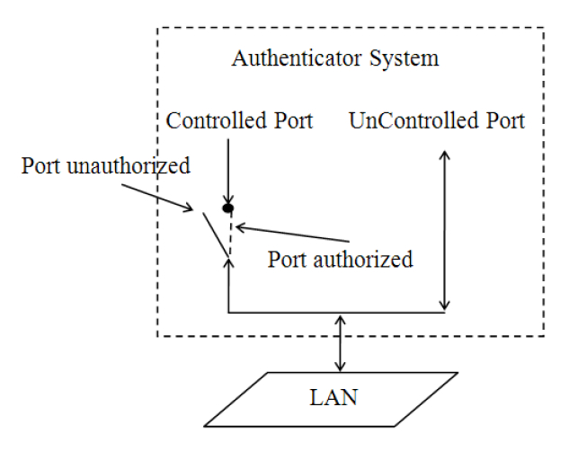

图3-40802.1X中的Port

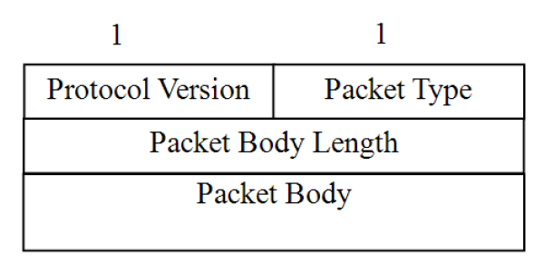

图3-41EAPOL格式由图3-41可知EAPOL消息格式如下。

❑ProtocolVersion：占1字节，代表当前使用的802.1X版本号。值为0x03代表802.1X-2010，值为0x02则表示802.1X-2004，值为0x01表示802.1X-2001。

❑PacketType：EAPOL对EAP进行了扩展，该字段取值详细内容见表3-14。

❑PacketBodyLength：指明PacketBody的长度。

EAPOL消息中最重要的是PacketType，目前规范定义的几种常见取值如表3-14所示。

表3-14EAPOLPacketType常见取值

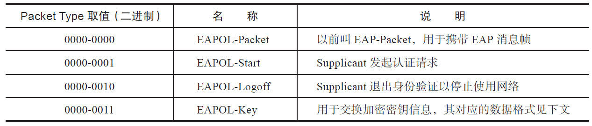

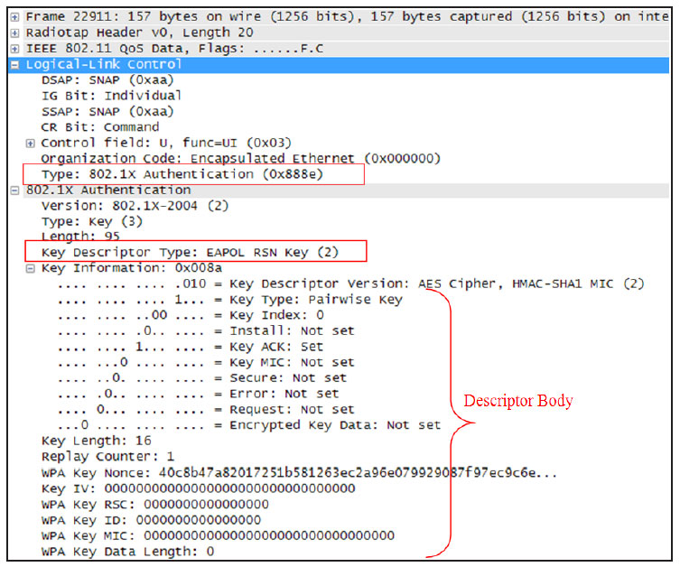

EAPOL-Key用于交换身份验证过程中使用的密钥信息，其对应的PacketBody格式如图3-42所示。DescriptorType表示后面DescriptorBody的类型。802.1X中，图3-43EAPOL-Key帧实例DescriptorType值为2时，DescriptorBody的内容由802.11定义。此处给读者展示一个图3-43中：

实际的例子，如图3-43所示。

❑0x888e代表EAPOL在802.11帧中的类型。

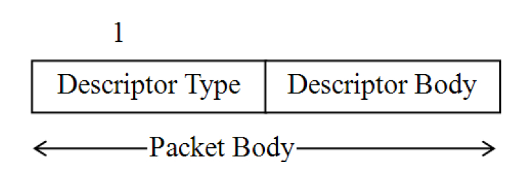

❑KeyDescriptorType值为2，表示EAPOLRSNKey。

图3-42EAPOL-Key帧对应的Body格式❑DescriptorBody的内容就是大括号中所包含的信息。其细节请读者阅读802.11第11.6.2节。

最后，看看用MD5质询算法作为身份验证的EAPOL认证流程，如图3-44所示。

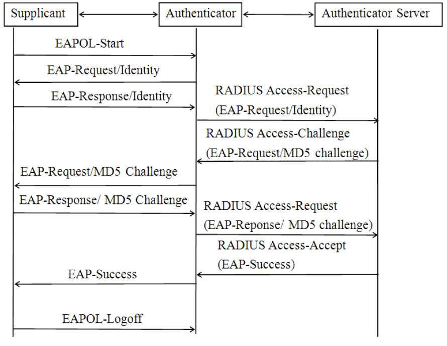

图3-44EAPOL认证流程❑Supplicant主动向Authenticator发送EAPOL-Start消息来触发认证。注意，EAPOL-Start消息不是必需的。

❑Authenticator收到EAPOL-Start消息后，将发出EAP-Request/Identity消息以要求Supplicant输入用户名。由于EAPOL-Start消息不是必需的，所以一个未经验证的Supplicant发送了其他数据包也将触发Authenticator发送EAP-Request/Identity消息。

❑Supplicant将用户名信息通过EAP-Response/Identity消息发送给Authenticator。Authenticator再将它经过封包处理后（转换成RADIUSAccess-Request消息）送给AS（AuthenticatorServer）进行处理。

❑AS收到Authenticator转发的用户名信息后，将其与数据库中的用户名表对比，找到该用户名对应的密码信息。然后随机生成的一个MD5质询文并通过RADIUSAccess-Chaenge消息发送给Authenticator，最后再由Authenticator转发给Supplicant。

❑Supplicant收到EAP-Request/MD5Chaenge消息后，将结合自己的密码对MD5质询文进行处理，处理结果最终通过EAP-Response/MD5Chaenge消息经由Authenticator返回给AS。

❑AS将收到RADIUSAccess-Request消息和本地经过加密运算后的密码信息进行对比，如果相同，则认为该Supplicant为合法用户，然后反馈认证成功消息（RADIUSAccess-Accept和EAP-Success）​。

❑Authenticator收到认证通过消息后将端口改为授权状态，允许Supplicant访问网络。注意，有些Supplicant还会定期向Supplicant发送握手消息以检测Supplicant的在线情况。

如果Supplicant状态异常，Authenticator将禁止其上线。

❑Supplicant也可以发送EAPOL-Logo消息给Authenticator以主动要求下线。

至此，我们对EAP和802.1X进行了简单介绍，EAP和802.1X的目前是为了进行身份验证，二者有自己的数据格式。如果没有特殊需要，掌握上述知识就可以了。

提示后续分析wpa_supplicant时还将对802.1X进行更为详尽的介绍。

下面介绍安全部分最后一个内容，RSNA。

[36]​[37]4.RSNA介绍RSNA（RobustSecureNetworkAssociation，强健安全网络联合）是802.11定义的一组保护无线网络安全的过程，是一套安全组合拳。这套组合拳包含的过程如图3-45所示。RSNA包括如下过程。

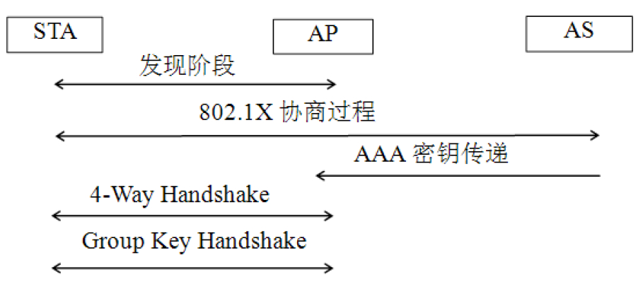

图3-45RSNA过程1）RSNA网络发现阶段。当STA扫描无线网络时，需检查Beacon帧或ProbeResponse帧中是否有RSNE信息元素。如果有，STA根据RSNE处理原则选择合适的AP并完成802.11Authentication（设置认证类型为OpenSystemAuthentication）和Association。

2）上一步建立的安全保护机制非常弱，所以RSNA的第二步工作是开展802.1X认证。目的是利用802.1X认证机制实现有效安全的认证用户身份，同时还需要分配该次会话所需要的一系列密钥用于后续通信的保护。

3）RSNA通过4-WayHandshake和GroupKeyHandshake协议完成RSNA中的密钥管理工作。密钥管理工作主要任务是确认上一阶段分配的密钥是否存在，以及确认所选用的加密套件，并生成单播数据密钥和组播密钥用于保护数据传输。

当上面三个步骤都完成后，RSNA网络就建立成功。由上所述，我们发现RSNA包括两个主要部分。

❑在数据加密和完整性校验方面，RSNA使用了前面章节提到的TKIP和CCMP。TKIP和CCMP中使用的TK（TemporaryKey）则来自于RSNA定义的密钥派生方法。

❑密钥派生和缓存。RSNA基于802.1X提出了4-WayHandshake（四次握手协议，用于派生对单播数据加密的密钥）和GroupKeyHandshake（组密钥握手协议，用于派生对组播数据加密的密钥）两个新协议用于密钥派生。另外，为了加快认证的速度，RSNA还支持密钥缓存。密钥派生和缓存的详情见下文。

RSNA中，我们仅介绍涉及的密钥派生和缓存。

为什么要进行密钥派生呢？它涉及密码安全方面的问题，不过其目的并不难理解。在WEP中，所有STA都使用同一个WEPKey进行数据加密，其安全性较差。而RSNA中要求不同的STA和AP关联后使用不同的Key进行数据加密，这也就是RSNA中Pairwise（成对）概念的来历。

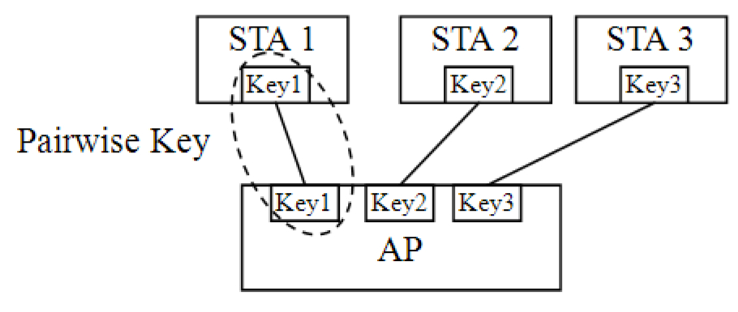

图3-46Pairwise的概念图3-46展示了PairwiseKey的含义，不过该图是否表明AP需要为不同的STA设置不同的密码呢？这显然和现实情况是违背的。因为现实生活中，我们关联多个STA到同一个AP时使用的都是相同的密码。

如何解决不同STA使用不同密码的问题呢？原来，我们在STA中设置的密码叫PMK（PairwiseMasterKey，成对主密钥）​，其来源有两种。

❑在SOHO网络环境中，PMK来源于预共享密钥（Pre-SharedKey，PSK）​。SharedKey概念在3.3.7节介绍WEP身份验证时提到过，即在家用无线路由器里边设置的密码，无须专门的验证服务器，对应的设置项为"WPA/WPA2-PSK"。由于适用家庭环境，所以有些无线路由器设置界面中也叫"WPA/WPA2-个人"（WFA认证名为"WPA/WPA2-Personal"）​。

❑在企业级环境中，PMK和AuthenticatorServer（如RADIUS服务器）有关，需要通过EAPOL消息和后台AS经过多次交互来获取。

这种情况多见于企业级应用。读者可在无线路由器设置界面中见到"WPA/WPA2-企业"（有时叫“WPA或WPA2”​，WFA认证名为"WPA/WPA2-Enterprise"）的安全类型选项，并且会要求设置RADIUS服务器地址。

Personal模式和Enterprise模式中PMK的来源如图3-47所示。

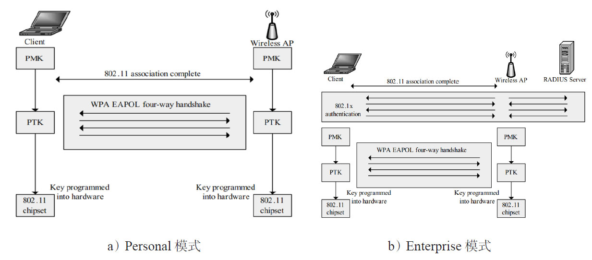

图3-47PMK来源图3-47中：

❑Personal模式不需要RADIUS服务器参与。

AP和STA双方的Key属于PSK，即事先就配置好了。

❑Enterprise模式下，STA、AP和RAIDUS的PMK通过多次EAPOL消息来获取。获取的方法和具体的EAPMethod有关。显然，相比Personal模式，这种方式更加安全，但其耗费的时间也较长。

❑STA和AP得到PMK后，将进行密匙派生以得到PTK。最后，PTK被设置到硬件中，用于数据的加解密。

❑由于AP和STA都需要使用PTK，所以二者需要利用EAPOLKey帧进行信息交换。这就是4-WayHandshake的作用。其详情见下文。

有了PMK后，AP和STA将进行密钥派生，正是在派生的过程中，AP和不同STA将生成独特的密钥。这些密钥用于实际的数据加解密。

由于STA每次关联都需要重新派生这些Key，所以它们称为PTK（PairwiseTransientKey，成对临时Key）​，PTK如图3-47所示。

提示WFA要求目前生产的无线设备必须通过WPA2认证。

RSNA中，针对组播数据和单播数据有不同的派生方法，即单播数据和组播数据使用不同的Key进行加密。本书仅介绍单播数据密钥的派生方法，如图3-48所示。输入PMK长256位（如果用户设置的密钥过短，规范要求STA或AP将其扩展到256位）​，通过PRF（PseudoRandomFunction，伪随机数函数）并结合S/A（Supplicant/Authenticator）生成的Nonce（这两个Nonce将通过4-WayHandshake协议进行交换）以及S/AMAC地址进行扩展，从而派生出TKIP和CCMP用的PTK。

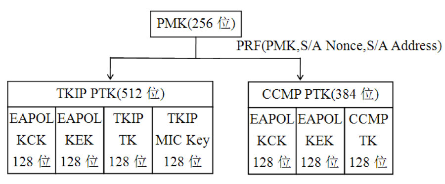

图3-48单播数据密钥派生方法图3-48中分别描述了TKIPPTK和CCMPPTK的组成。

❑EAPOLKCK（KeyConfirmationKey）用于计算密钥生成消息的完整性校验值。

❑EAPOLKEK（KeyEncryptionKey）用来加密密钥生成消息。

这两个EAPOLKey将用于后续EAPOLKey帧中某些信息的加密。TKIPTK和CCMPTK就是TKIP和CCMP算法中用到的密钥。

明白密钥派生的作用了吗？简单来说，WEP中，网络中传输的是用同一个Key加密后的数据，其破解的可能性较大。而TKIP和CCMP则把PMK保存在AP和STA中，实际数据加密解密时只是使用PMK派生出来的Key，即PTK。

提示关于TKIPPTK和CCMPPTK等其他信息，请读者阅读参考资料[30]​。

由于密钥派生时需要STA和AP双方的Nonce等其他一些信息，所以二者还需通过4-WayHandshake以交换双方的信息，其过程如图[24]3-49所示。

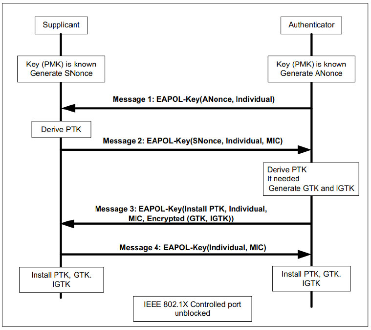

图3-494-WayHandshake流程注意4-WayHandshake除了用于交换STA和AP信息外，还可用于AP和STA之间相互判断对方是否有正确的PMK。

图3-49所示的4-WayHandshake工作过程如下。

1）Authenticator生成一个Nonce（ANonce）​，然后利用EAPOL-Key消息将其发给Supplicant。

2）Supplicant根据ANonce、自己生成的一个Nonce（SNonce）​、自己所设置的PMK和Authenticator的MAC地址等信息进行密钥派生。Supplicant随后将SNonce以及一些信息通过第二个EAPOL-Key发送给Authenticator。Message2还包含一个MIC值，该值会被图3-48中的KCK加密。接收端Authenticator取出Message2中的SNonce后，也将进行和Supplicant中类似的计算来验证Supplicant返回的消息是否正确。如果不正确，这将表明Supplicant的PMK错误，于是整个握手工作就此停止。

3）如果Supplicant密钥正确，则Authenticator也进行密钥派生。此后，Authenticator将发送第三个EAPOL-Key给Supplicant，该消息携带组临时密码（GroupTransientKey，GTK，用于后续更新组密钥，该密钥用图3-48中的KEK加密）​、MIC（用KCK加密）​。Supplicant收到Message3后也将做一些计算，以判断AP的PMK是否正确。注意，图中的IGTK（IntegrityGTK）

用于加解密组播地址收发的管理帧，本书不讨论。

4）Supplicant最后发送一次EAPOL-Key给Authenticator用于确认。

5）此后，双方将安装（Insta）Key。Insta的意思是指使用它们来对数据进行加密。

Supplicant和Authenticator就此完成密钥派生和组对，双方可以正常进行通信了。

提示由于篇幅原因，请读者阅读参考资料[38]以了解GTK的产生和作用。另外，4.5.5节“EAPOL-Key交换流程分析”将结合wpa_supplicant的代码详细介绍4-WayHandshake相关的内容。

另外，802.11还支持“混合加密”​，即单播和组播使用不同的加密方法，例如单播数据使用CCMP而组播数据使用TKIP进行加密。注意，有些加密方法不能混合使用，例如组播数据使用CCMP加密，单播数据就不能使用TKIP。详情见参考资料[39]​。

提示混合加密的主要目的是为了解决新旧设备的兼容性问题。它对应的应用场景如下。

1）AP支持TKIP和CCMP，属于新一代的设备。

2）一些老的STA只支持TKIP，而一些新的STA支持TKIP和CCMP。

对于单播数据来说，AP和STA的密钥是成对的。所以对于老STA，AP和它们协商使用TKIP。对于新STA，AP和它们协商使用CCMP。而对于组播数据来说，所有STA、AP都使用同一个密钥，加解密方法也只能是一样的。在这种情况下，大家只能使用TKIP而不能使用CCMP对组播数据进行加解密了。

下面我们来介绍密钥缓存。

根据前述内容可知，PMK是密钥派生的源，如果认证前，STA没有PMK，它将首先利用图3-47右图所示的802.1X协商步骤以获取PMK（当然，对于SOHO环境中所使用的PSK而言，则不存在这种情况）​。由于802.1X协商步骤涉及多次帧交换，故其所花费时间往往较长。在这种情况下，STA缓存这个得来不易的PMK信息就可消除以后再次进行802.1X协商步骤的必要，从而大大提升整个认证的速度。

根据802.11规范，PMK缓存信息的名称叫PMKSA（PMKSecurityAssociation）​，它包括AP的MAC地址、PMK的生命周期（lifetime）​，以及PMKID（PMKIDentifier，用于标示这个PMKSA，其值由PMK、AP的MAC地址、STA的MAC地址等信息用Hash计算得来）​。

当STA和AP进行关联（或重关联）时：

❑STA首先根据AP的MAC地址判断自己是否有缓存了的PMKSA，如果有则把PMKID放在RSNE中然后通过Association/ReassociationRequest发送给AP。

❑AP根据这个PMKID再判断自己是否也保持了对应的PMKSA。如果是，双方立即进入4-WayHandshake过程，从而避免802.1X协商步骤。

5.无线网络安全相关知识总结本节对无线网络安全技术进行一个总体介绍，其中所涉及的概念、缩略词较多，这里给读者简单总结一下其中的逻辑关系。

无线网络安全要解决的是数据的Confidentiality和Integrity以及使用者的Authentication这三个问题。

❑规范最早定义的WEP本来目的是解决数据完整和机密性的问题，后来WEP中附带完成了Authentication检查。不过整体保护机制非常弱。

❑在802.11i正式出台前，WFA提供了安全机制比WEP强的TKIP。注意，TKIP本身只能解决数据完整和机密性问题。而802.11i出台后，又增加了一个更强健的加密算法CCMP（有时候也叫AES）​。AES和TKIP都用于解决数据完整和机密性问题。

❑为了解决Authentication问题，规范借鉴802.1X，从而引出RSNA，它包括密钥派生、缓存等内容。

提示无线网络安全的内容非常多，读者不妨阅读参考资料[37]​[38]以加深理解。区分WPA/WPA2企业和个人用法的简单公式如下。

WPA-企业=802.1X+EAP+TKIPWPA2-企业=802.1X+EAP+CCMPWPA-个人=PSK+TKIPWPA2-个人=PSK+CCMP
