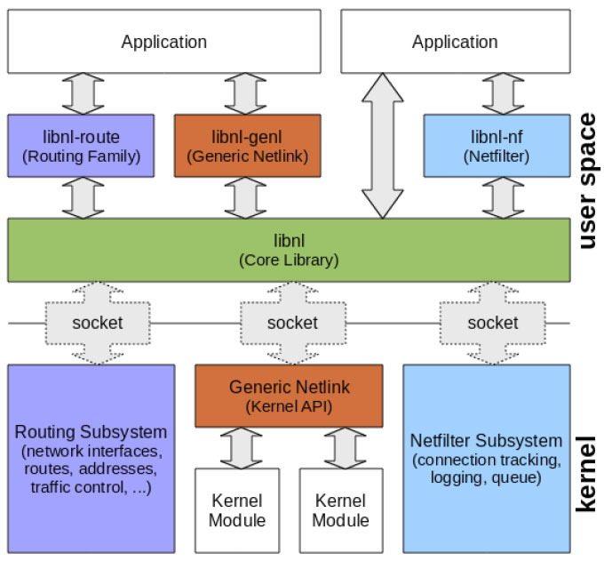
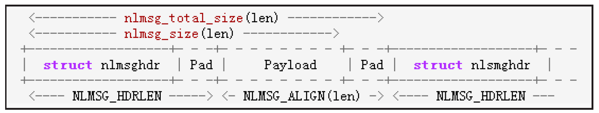
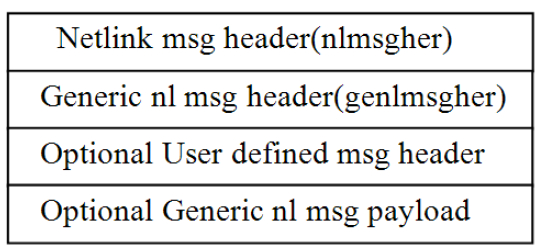

# 3.4.2 nl80211介绍


如上文所述，目前Linux平台中用于替代wext框架的是nl80211和cfg80211。其中cfg80211供Kernel网卡驱动开发使用，而nl80211API则供用户空间进程使用。

相比wext，nl80211的使用难度较大，因为在nl80211框架中，用户进程和Kernel通信的手段没有使用wext中的ioctl，而是采用了netlink机制。所以，虽然nl80211.h仅是定义了一些枚举值和有限的数据结构，但其操作却比较复杂。netlink是Linux平台上一种基于socket的IPC通信机制，它支持：

❑用户空间进程和Kernel通信。

❑用户空间中进程间的通信。

不过，相比其他IPC机制，netlink最常用之处还是用户空间进程和kernel模块间的通信。鉴于netlink的复杂性，开源世界提供了几个较为完备的基于netlink编程的框架，其中最著名的就是libnl。而Android也充分发扬拿来主义，在其system/core/libnl_2目录中移植并精简了libnl项目的代码，得到一个小巧的libnl_2工程。

本节首先介绍netlink基本知识，然后介绍libnl开源库的内容，最后结合实例介绍nl80211的用法。

[41]1.netlink编程netlink是一种基于socket的IPC通信机制，所以它需要解决如下两个问题。

❑寻址：即如何定位通信对象。

❑双方通信的数据格式：socket编程中，通信双方传递的数据格式是由应用程序自己决定的。那么netlink是否有其自定义的数据格式呢？

（1）netlinksocket创建及绑定netlink使用前，需要通过socket调用创建一个socket句柄，而socket函数的原型如下。

```
int socket（int domain，int type，int protocol）；
```

对于netlink编程来说，注意以下事项。

❑domain：必须设置为AF_NETLINK，表示此socket句柄将用于netlink。

❑type：netlink是基于消息的IPC通信，所以该值为SOCK_DGRAM。注意，对netlink编程来说，内核并不区分type的值是SOCK_DGRAM还是SOCK_RAW。

❑protocol：该值可根据需要设为NETLINK_ROUTE、NETLINK_NETFILTER。

不同的协议代表Kernel中不同的子系统。例如NETLINK_ROUTE代表通信对象将是Kernel中负责route的子系统，而NETLINK_NETFILTER代表通信对象将是

```
struct sockaddr_nl {
// nl_family取值必须为AF_NETLINK或PF_NETLINK
  sa_family_t nl_family;
  unsigned short nl_pad;                 // 该值暂时无用，必须设为0
/*
nl_pid看起来是用于存储进程pid的，但实际上它只是用于标示一个netlink socket。所以，用户空间
只要保证进程内该值的唯一性即可。另外，如果该值为0，表示通信的目标是Kernel。
*/
 __u32 nl_pid;
/*
每一个netlink协议都支持最多32个多播组，加入多播组的成员都能接收到对应的多播消息。
例如NETLINK_ROUTE协议就有RTMGRP_LINK和RTMGRP_IPV4_IFADDR等多个多播组。每个多播组对应不同的消息。之所以采用多播的方式，是因为它能减少消息发送/接收的次数。
nl_groups为0，表示只处理单播消息。
*/
 __u32 nl_groups;
};
```

Kernel中负责Netfilter的子系统，而第2章碰到的NETLINK_KOBJECT_UEVENT则代表应用程序希望接收来自Kernel中的uevent消息。

使用netlink通信时，如何保证确保通信双方能正确定位对方呢？原来，在netlink中，通信的另一方地址由一个数据类型为sockaddr_nl的结构体来唯一标示。该结构体的原型如下。

[--＞netlink.h]设置好地址后，通过bind函数将该地址和socket句柄绑定，这样通信的另一方就正式确定了。

关于socket创建以及bind的使用，读者可参考下面的例子。

```c
struct sockaddr_nl sa;
 memset(&sa, 0, sizeof(sa));
 sa.nl_family = AF_NETLINK;
 sa.nl_groups = RTMGRP_LINK | RTMGRP_IPV4_IFADDR;
 // sa.nl_pid已经通过memset函数置为0了，代表此次netlink通信的目标是Kernel
 fd = socket(AF_NETLINK, SOCK_RAW, NETLINK_ROUTE);
 bind(fd, (struct sockaddr *) &sa, sizeof(sa));
```

netlink中关于protocol和多播group的取值比较分散，而且Linux的man手册更新赶不上代码的更新速度。建议读者通过netlink.h寻找protocol的取值。通过protocol对应的头文件去寻找多播group的定义。例如rtnetlink.h就定义了RTMGRP_LINK等多播组。

（2）netlink消息类型和标志netlink的消息及处理是netlink编程中较为复杂的一部分。netlink中，所有消息都有一个消息头，该头由结构体nlmsghdr表达，原型如下。

```
struct nlmsghdr {
    __u32        nlmsg_len;     // 整个消息的长度，包括消息头
    __u16        nlmsg_type;    // 消息类型，详情见后文
    __u16        nlmsg_flags;   // 附加标志
    __u32        nlmsg_seq;     // 消息序列号
    __u32        nlmsg_pid;     // 发送该消息的nl_pid。该值为0,表示数据来自内核
};
```

netlink定义了三种消息类型（type）​，分别如下。

❑NLMSG_NOOP：无操作，程序可直接丢弃这类消息。

❑NLMSG_ERROR：代表错误消息。这类消息携带的信息由结构体structnlmsgerr表达。

❑NLMSG_DONE：如果某个信息的数据量较大，需要分成多个netlink消息发送的话，NLMSG_DONE表示这是此信息最后一个消息分片包。

说实话，笔者觉得单从type值来区分netlink的消息有些不太好理解。如果从C/S角度来看，netlink消息可分为另外三种类型。

❑Request消息：代表客户端向服务端发起的请求。这类消息必须为nlmsg_flags设置NLM_F_REQUEST标志位。同时，客户端最好为nlmsg_seq设置一个独一无二的值，以区

```
struct nlmsgerr {
  int error;                    // 值为负代表错误码，值为0表示请求处理成功
  // 携带对应请求消息的消息头
  // 由于只返回消息头，故客户端必须根据消息头中的nlmsg_seq找到具体的消息
  struct nlmsghdr msg;
};
```

分自己发送的不同请求。

❑Response消息：该类消息作为服务端对客户端请求的回应。对应的消息类型是NLMSG_ERROR。注意，如果服务器处理请下面来看参数nlmsg_flags，它比type复杂，求成功，也返回该值。只不过nlmsgerr的常设的位值有（通过“|”运算符将不同值error变量值为0。

“或”在一起）​。

❑Notification消息：用于服务端向客户端发❑NLM_F_REQUEST：代表请求消息。

送通知。由于它不对应任何请求，故❑NLM_F_MULTI：代表消息分片中的一个。

nlmsg_seq一般取值为0。

理论上说，由于nlmsghdr中的nlmsg_len为基于上述讨论，读者会发现对于Response消32位，其最大消息长度可达4GB，但内核实息，无论服务端处理请求是否成功，都会返回现时，最大消息的长度只有一个页面（一般为NLMSG_ERROR消息，其对应的数据类型是4KB）​。如果有大于4KB的信息要传递，就需nlmsgerr，原型如下。

将其分成多个消息发送。除最后一个分片消息外，其余消息都需置NLM_F_MULTI位。当然，结合上文所述，最后一个分片消息需要设置nlmsg_type为NLMSG_DONE。

❑NLM_F_ACK：该标志将强制服务端接收并处理完请求后回复ACK给客户端。

提示netlink中nlmsg_flags的取值还有很多，感兴趣的读者可利用man7netlink命令阅读相关知识。

（3）netlink消息的处理对于socket编程来说，一般客户端会分配一个buer用于接收数据，而后续解析该buer中的netlink消息其实也是一件比较麻烦的事情。另外，由于netlink对消息的大小有字节对齐的要求，所以应用程序在构造自己的netlink消息时，也比较麻烦。不过好在netlink为我们提供了一些帮助宏，利用这些

```
NLMSG_ALIGN(len)// 获取len按4字节补齐后的长度。例如，如果len为1，则该宏返回的值应是4
// 整个消息包的长度，包括消息头和数据长度len。该值用于填充消息头中的nlmsg_len参数
NLMSG_LENGTH(len)
// 返回按4字节对齐后整个消息包的长度。它和NLMSG_LENGTH最大的不同是该宏将长度按4字节对齐
NLMSG_SPACE(len)                        // 该宏等于NLMSG_ALIGN(NLMSG_LENGTH(len))
NLMSG_DATA(nlh)                  // 获取消息中的数据起始地址
// 用于分片消息的处理。可获取下一条分片消息。其用法见下文例子
NLMSG_NEXT(nlh,len)
NLMSG_OK(nlh,len)                       // 用于判断接收到的数据是否包含一个完整的netlink消息
// 用于返回数据的长度。注意，由于netlink消息在创建时会按4字节补齐
// 所以其数据真正的长度不能通过nlms_len来判断
NLMSG_PAYLOAD(nlh,len)
```

宏，netlink消息就不再麻烦了。以下代码为netlink消息处理时常用的一些宏。

```
// 本例基于linux netlink手册。可通过man 7 netlink查阅
int len;
char buf[4096];
struct iovec iov = { buf, sizeof(buf) };
struct sockaddr_nl sa;
struct msghdr msg;              // 用于recvmsg系统调用，和netlink没关系
struct nlmsghdr *nh;
msg = { (void *)&sa, sizeof(sa), &iov, 1, NULL, 0, 0 };
len = recvmsg(fd, &msg, 0); // recvmsg返回，可能存储了多条netlink消息
// 开始接受接收buffer，注意NLMSG_NEXT宏，其内部会对len长度进行修改，以调整到下一个消息的起始
for (nh = (struct nlmsghdr *) buf; NLMSG_OK(nh, len);
  nh = NLMSG_NEXT (nh, len)) {
   /* The end of multipart message. */
   if (nh-＞nlmsg_type == NLMSG_DONE){
       return;                  // 分片消息处理
   }
   if (nh-＞nlmsg_type == NLMSG_ERROR){
      struct nlmsgerr* pError = （struct nlmsgerr*）NLMSG_DATA(nh);
                                    // 获取nlmsgerr的内容
      ...... /* 错误或ACK处理*/
   }
   void* data = NLMSG_DATA(nh); // 获取数据的起始地址
   ......// 处理数据
}
```

下面来看一个netlink消息解析的例子，读者以后有需要，可以把它作为参考。

netlink的消息收发和普通的socket消息收发一样，这里不赘述。

（4）netlink编程小结netlink强制要求每个netlink消息都包含消息头，其实它还定义了一个名为nlar的结构体，用于规范载荷（Payload）的数据类型。

其目的是希望Payload以属性（aribute）的方式来描述自己。structnlar结构非常简单，如下所示。

```
struct nlattr {
    __u16     nla_len;           // 属性长度
    __u16     nla_type;          // 属性类型
};
```

netlink虽然复用了socket编程以方便应用程序和内核通信，但因为其文档很少，而且不同protocol往往还有自己特定的数据结构，所以实际使用过程中难度较大。

本书不讨论nlar及netlink其他的内容。建议读者考虑下文介绍的文档更加丰富的libnl开源库。

2.libnl开源库根据前文介绍，netlinkAPI用起来相对麻烦，建议读者考虑采用libnl开源库，其官方网站为hp://www.infradead.org/~tgr/libnl/。

libnl的内容也不少，其架构如图3-50所示。



图3-50libnl架构由图3-50可知，以下三个库都基于其核心库libnl。

❑libnl-route：用于和Kernel中的Routing子系统交互。

❑libnl-nf：用于和Kernel中的Netfilter子系统交互。

❑libnl-genl：用于和Kernel中的GenericNetlink模块交互。

提示从图也可看出netlink使用的复杂性。

Android平台移植并精简了libnl和libnl-genl中的部分内容，得到了libnl_2（2表示libnl工程的版本号，最新版为3）​，目录在system/core/libnl_2文件夹下。

本节介绍libnl中的一些常用API。详细内容还请读者参考其官方网站中的文档，地址为hp://www.infradead.org/～tgr/libnl/doc/core.html。

```html
// 为nl_sock对象设置一个回调函数，当该socket上收到消息后，就会回调此函数进行处理
// 回调函数及参数封装在结构体struct nl_cb中
void nl_socket_set_cb(struct nl_sock *sk, struct nl_cb *cb);
// 获取该nl_sock设置的回调函数信息
struct nl_cb *nl_socket_get_cb(const struct nl_sock *sk);
```

（1）nl_sock结构体的使用libnl以面向对象的方式重新封装了netlink原有的API。其使用时必须分配一个nl_sock结构体。下面展示了和它相关的一些API及使用方法。

```java
#include ＜netlink/socket.h＞
// 分配和释放nl_sock结构体
struct nl_sock *nl_socket_alloc(void)
void nl_socket_free(struct nl_sock *sk)
// nl_connet内部将通过bind函数将netlink socket和protocol对应的模块进行绑定
int nl_connect(struct nl_sock *sk, int protocol)
```

linbl还可为每个nl_sock设置消息处理函数，相关API如下。

```
/*
  此API对消息接收及处理的力度更为精细，其中：
  type类型包括NL_CB_ACK、NL_CB_SEQ_CHECK、NL_CB_INVALID等，可用于处理底层不同netlink消息的情况。
  例如，当收到的netlink消息无效时，将调用NL_CB_INVALIDE设置的回调函数进行处理。
  nl_cb_kinds指定消息回调函数的类型，可选值有NL_CB_CUSTOM，代表用户设置的回调函数，NL_CB_DEFAULT
  代表默认的处理函数。
  回调函数的返回值包括以下。
  NL_OK:表示处理正常。
  NL_SKIP：表示停止当前netlink消息分析，转而去分析接收buffer中下一条netlink消息（消息分
  片的情况）。
  NL_STOP：表示停止此次接收buffer中的消息分析。
*/
int nl_socket_modify_cb(struct nl_sock *sk,
                    enum nl_cb_type type, enum nl_cb_kind kind,
                    nl_recvmsg_msg_cb_t func, void *arg);
```

注意，以上两个函数没有文档说明。建议使用另外一个控制力度更为精细的API。

另外，netlink还可设置错误消息（即专门处理nlmsgerr数据）处理回调函数，相关API如下。

```
#include ＜netlink/handlers.h＞           // 必须包含此头文件
// 设置错误消息处理
int nl_cb_err(struct nl_cb *cb, enum nl_cb_kind kind,
                 nl_recvmsg_err_cb_t func, void * arg);
typedef int(* nl_recvmsg_err_cb_t)(struct sockaddr_nl *nla,
                struct nlmsgerr *nlerr, void *arg);
```

```java
struct nlmsghdr *nlmsg_next(struct nlmsghdr *hdr, int *remaining);
int nlmsg_ok(const struct nlmsghdr *hdr, int remaining);
/*定义一个消息处理的for循环宏，其值等于
for (int rem = len, pos = head; nlmsg_ok(pos, rem);\
      pos = nlmsg_next(pos, &rem))
*/
#define nlmsg_for_each(pos,head,en)
```

```java
struct nl_msg *nlmsg_alloc(void);
void nlmsg_free(struct nl_msg *msg);
// nl_msg内部肯定会指向一个netlink消息头实例，下面这个函数用于填充netlink消息头
struct nlmsghdr *nlmsg_put(struct nl_msg *msg,
                           uint32_t port, uint32_t seqnr,
                           int nlmsg_type, int payload, int nlmsg_flags);
```

（2）libnl中的消息处理libnl定义了自己的消息结构体structnl_msg。不过它也提供API直接处理netlink的消息。常用的API如下。

```
#include ＜netlink/msg.h＞                        // 必须包含这个头文件
// 下面这两个函数计算netlink消息体中对应部分的长度
int nlmsg_size(int payloadlen);         // 请参考图来理解这两个函数返回值的意义
int nlmsg_total_size(int payloadlen);
```

开发者也可以通过libnl定义的消息结构体nl_msg进行相关操作，和nl_msg有关的API如下。

关于netlink消息的长度如图3-51所示。



图3-51nlmsg消息长度的计算其他可直接处理netlink消息的API如下。

```
// 核心接收函数。nla参数用于存储发送端的地址信息。creds用于存储权限相关的信息
int nl_recv(struct nl_sock *sk, struct sockaddr_nl *nla,
               unsigned char **buf, struct ucred **creds)
// 内部通过nl_recv接收消息，然后通过cb回调结构体中的回调函数传给接收者
int nl_recvmsgs (struct nl_sock *sk, struct nl_cb *cb)
```

（3）libnl中的消息发送和接收netlink直接利用系统调用（如send、recv、sendmsg、recvmsg等）进行数据收发，而libnl封装了自己特有的数据收发API。其中和发送有关的几个主要API如下。

[41]（4）libnl-genlAPI介绍

```
// 直接发送netlink消息
int nl_sendto (struct nl_sock *sk, void *buf, size_t size)
// 发送nl_msg消息
int nl_send (struct nl_sock *sk, struct nl_msg *msg)
int nl_send_simple(struct nl_sock *sk, int type,
                   int flags,void *buf, size_t size);
```

由图3-50可知，libnl-genl封装了对genericnetlink模块的处理，它基于libnl。Linux中关于genericnetlink的说明几乎没有，建议大家参考libnl中的说明。一条genl消息的结构如图3-52所示。



常用的数据接收API如下。

图3-52genl消息结构其另中外，，ggeennllm还s有gh几d个r的比原较型重如要下的。API，它们和genl机制的内核实现有关，这里仅简单介绍

```
struct genlmsghdr {
 __u8 cmd;              // cmd和version都和具体的案例有关
 __u8 version;
 __u16 reserved;        // 保留
};
```

其中几点内容。为实现genl机制，内核创建了一个虚拟的GenericNetlinkBus。所有genl的使用者（包含内核模块或用户空间进程）都会注册到此Bus上。这些使用者注册时，都需要填充一个名为genl_family的数据genl常用的API如下。

结构，该结构是一种身份标示。所以某一方只

```
// 和libnl的nl_connect类型，只不过协议类型为GENERIC_NETLINK
int genl_connect (struct nl_sock *sk)
// genlmsg_put用于填充图中的nlmsghdr、genlmsghder和用户自定义的消息头。详细内容见下文
void* genlmsg_put (struct nl_msg *msg, uint32_t port,
         uint32_t seq, int family, int hdrlen,
         int flags, uint8_t cmd, uint8_t version)
// 用于获取genl消息中携带的nlattr内容
struct nlattr* genlmsg_attrdata(const struct genlmsghdr *gnlh,int hdrlen)
```

要设置好genlmsg_put中的family参数，数据就能传递到对应的模块。

family是一个整型，可读性较差，所以genl使用者往往会指定一个字符串作为familyname。而familyname和family的对应关系则由genl中另外一个重要模块去处理。这个模块就是genl中的Controer，它也是GenericBus使用者。其familyname为"nlctrl"，只不过它的family是固定的，目

```
// 根据family name字符串去查询family，该函数内部实现将发送查询消息给Controller
int  genl_ctrl_resolve (struct nl_sock *sk, const char *name)
/*
  如果每次都向Controller去查询family编号将严重影响效率，所以libnl-genl会把查询到的信息
  缓存起来。
  下面这个函数将分配一个nl_cache列表，其内容存储了当前注册到Generic Netlink Bus上所有注
  册者的信息。
*/
int genl_ctrl_alloc_cache (struct nl_sock *sk, struct nl_cache **result)
// 根据family name从缓存中获取对应的genl_family信息
struct genl_family * genl_ctrl_search_by_name
                     (struct nl_cache *cache, const char *name)
```

前取值为16（一般为它定义一个NETLINK_GENERIC宏）​。Controer的一个重要作用就是为其他注册者建立familyname和family之间关系，也就是动态为其他注册者分配family编号。另外，Controer也支持查询，即返回当前Kernel中注册的所有genl模块的familyname和family的值。

对用户空间程序来说，只要知道family的值，就可和指定模块进行通信了。libnl-genl封装提示相比直接使用netlinkAPI，libnl对开了发上者述更操加作，友并好提，供即了使几li个bn常l封用的装A得P再I。好，netlink编程依然不是一件轻松的事情。目前为止，笔者还没有找到一篇文档能全面描述netlink中的protocol及对应的多播组、genl中Controer模块所支持的命令等至关重要的知识点。当年在Windows平台做开发时，微软为开发者提供的编程文档中不仅有原理性说明，还有很多编程技巧。这些内

```java
static int wpa_driver_nl80211_scan(void *priv,
           struct wpa_driver_scan_params *params)
{
    struct i802_bss *bss = priv;
    struct wpa_driver_nl80211_data *drv = bss-＞drv;
    int ret = -1, timeout;
    struct nl_msg *msg, *rates = NULL; // 定义两个nl_msg对象，rates和P2P有关，读者可忽略它
    drv-＞scan_for_auth = 0;
    // 创建nl80211消息，其中NL80211_CMD_TRIGGER_SCAN是Nl80211定义的命令，用于触发网络扫描
    msg = nl80211_scan_common(drv, NL80211_CMD_TRIGGER_SCAN, params);
    ......// P2P 处理
    // 发送netlink消息
    ret = send_and_recv_msgs(drv, msg, NULL, NULL);
    msg = NULL;
    if (ret)
        goto nla_put_failure;
    ......// wpa_supplicant其他处理
    ......// 错误处理
    return ret;
}
```

容对开发者而言都是无价之宝。不过，指望Linux重新修订、增补文档无疑是一件异想天开的事情。在此笔者也只能希望读者们在学习过程中注意收集资料并和大家一起分享了。

3.nl80211实例了解netlink和libnl之后，现在来看nl80211。简单来说，nl80211的核心就是通过netlink机制向Kernel中的无线网卡驱动发送特定的消息。只不过这些消息的类型、参数等都由nl80211.h定义。此处通过一个案例，学习如何通过nl80211触发网卡进行无线网络扫描。

[--＞driver_nl80211.c：​：

wpa_driver_nl80211_scan]

```c
static struct nl_msg * nl80211_scan_common
            (struct wpa_driver_nl80211_data *drv, u8 cmd,
            struct wpa_driver_scan_params *params)
{
    struct nl_msg *msg;
    int err;
    size_t i;
    // 分配一个nl_msg对象
    msg = nlmsg_alloc();
    /*
        调用nl80211_cmd函数填充nl_msg中的信息，其内部代码如下。
        static void * nl80211_cmd(struct wpa_driver_nl80211_data *drv,
               struct nl_msg *msg, int flags, uint8_t cmd){
              return genlmsg_put(msg, 0, 0, drv-＞global-＞nl80211_id,0, flags, cmd, 0);
        }
    */
    nl80211_cmd(drv, msg, 0, cmd);
    /*
     nl80211消息的参数通过netlink中的nlattr来存储。NL80211_ATTR_IFINDEX代表
     此次操作所指定的网络设备编号。
    */
    nla_put_u32(msg, NL80211_ATTR_IFINDEX, drv-＞ifindex);
    if (params-＞num_ssids) {
        struct nl_msg *ssids = nlmsg_alloc();
        for (i = 0; i ＜ params-＞num_ssids; i++) {
         nla_put(ssids, i + 1, params-＞ssids[i].ssid_len,params-＞ssids[i].ssid);
         ......
        }
         // netlink支持消息嵌套，即属性中携带的数据可以是另外一个nl_msg消息
         err = nla_put_nested(msg, NL80211_ATTR_SCAN_SSIDS, ssids);
         nlmsg_free(ssids);
         ......
    }
     ......// 其他处理
    return msg;
    ......// 错误处理
}
```

上面代码中构造无线网络扫描nl_msg的重要函数nl80211_scan_common代码如下所示。

[--＞driver_nl80211.c：​：

nl80211_scan_common]由上面的例子可知，nl80211其实就是利用netlink机制将一些802.11相关的命令和参数发送给驱动去执行。这些命令和参数信息可通过nl80211头文件查询。

提示本书后续章节将分析wpa_supplicant8，读者可参考external/wpa_supplicant8/wpa_supplicant/src/drivers/nl80211_copy.h。

```c
enum nl80211_attrs {
    NL80211_ATTR_UNSPEC,
    NL80211_ATTR_WIPHY,
    NL80211_ATTR_WIPHY_NAME,
    NL80211_ATTR_IFINDEX,
    NL80211_ATTR_IFNAME,
    NL80211_ATTR_IFTYPE,
    NL80211_ATTR_MAC,
    ......// 一共定义了155条属性
}
```

首先，nl80211_copy.h定义其支持的命令，如下所示。

[--＞nl80211_copy.h]

```c
enum nl80211_commands {
    NL80211_CMD_UNSPEC,
    NL80211_CMD_GET_WIPHY,
    NL80211_CMD_SET_WIPHY,
    ......
    NL80211_CMD_GET_INTERFACE,
    NL80211_CMD_SET_INTERFACE,
    ......
    NL80211_CMD_SET_BSS,
    NL80211_CMD_SET_REG,
    ......// 一共定义了94条命令
}
```

然后定义属性的取值，如下所示。

头文件中对命令、属性等信息的注释都非常详细。本节不赘述，请读者自行阅读该文件。

提示相比wext而言，nl80211的使用难度明显要复杂，其中重要原因是它是基于netlink编程的。而且，如果没有libnl的支持，相信使用难度会更大。但从Wi-Fi角度来看，nl80211和wext到没有太大区别，二者都是紧紧围绕MAC层service来设计数据结构的。
