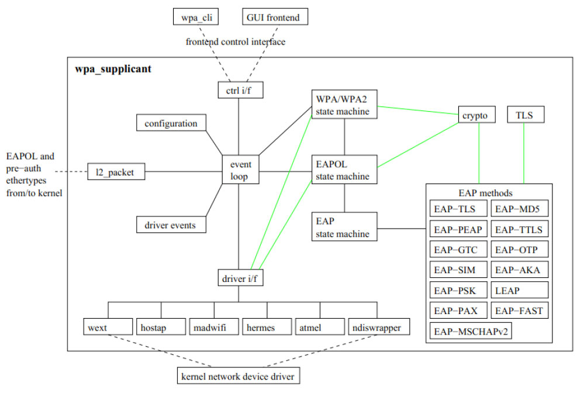

# 4.2.1 wpa_supplicant架构

wpa_supplicant是一个比较庞大的开源软件项目，包含500多个文件，20万行代码，其内[2]部模块构成如图4-1所示。

图4-1wpa_supplicant软件架构图4-1所示的WPAS软件架构包括如下重要模块。

❑WPAS所有工作都围绕事件（eventloop模块）展开。它是基于事件驱动的。事件驱动和消息驱动类似，主线程等待事件的发生并处理它们。WPAS没有使用多线程编程，所有事件处理都在主线程中完成。从这一点看，WPAS的运行机制很简单。

❑位于eventloop模块下方的driveri/f（i/f代表interface）接口模块用于隔离和底层驱动直接交互的那些driver控制模块（如wext、ndiswrapper等，WPAS中称为driverwrapper）​。这些driverwrapper和平台以及芯片所使用的驱动相关。不过，由于driveri/f的隔离作用，WPAS中其他模块将能最大程度保持平台以及驱动无关性。

❑driverwrapper经常要返回一些信息给上层。WPAS中，这些信息将通过driverevents的方式反馈给WPAS其他模块进行处理。

❑上一章曾介绍过EAP以及EAPOL协议。除了定义消息格式外，RFC4137文档定义了EAP状态机，而802.1X文档中还定义了EAPOL状态机。WPAS根据这两个协议分别实现了EAP和EAPOL状态机。本章后续将详细分析这两个状态机以及背后的协议。除此之外，WPAS还定义了自己的状态机（即WPA/WPA2StateMachine）​。

❑WPAS实现了多种EAP方法，如EAPmethod模块。另外它还包含了TLS模块和crypto模块用于支持对应的EAP方法。

❑EAPOL以及EAP消息都属于LLC层数据，所以WPAS的l2_packet模块用于收发EAPOL和EAP消息。

❑WPAS支持较多的配置参数，这些参数的处理由configuration模块完成。

❑WPAS是C/S结构中的Server端，它通过ctrli/f模块向客户端提供通信接口。Linux/UNIX平台中，Client端利用Unix域socket与其通信。目前常用的Client端wpa_cli（无界面的命令行程序）和wpa_gui（UI用Qt实现）​。

WPAS支持众多功能，使用前往往需根据平台或驱动的特性进行编译配置，下面通过一个实例来介绍如何在Android中编译wpa_supplicant。
