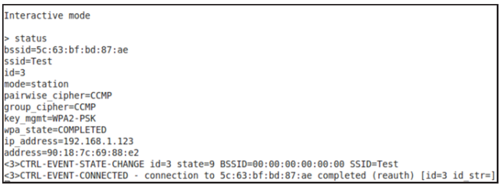

# 4.2.2 wpa_supplicant编译配置


先介绍本实例的背景情况。有一台三星GalaxyNote2手机，其OS为Android4.1.2。现在，编译一个AOSP（AndroidOpenSourceProject）的wpa_supplicant程序以替换Note2中原有的由上述配置可知，笔者将使用generic版本编w译p一a_个suwpppali_csaunpt。plicant以运行在真实的机器上。

提示AOSP即Google公版Android源码。

几乎所有手机厂商都会根据芯片、硬件以及提示通过执行lunch命令可知，不同的设备厂商自定义的特性去修改它。由于Note2应有对应的编译配置项。由于笔者没有源No码te不2公的开源，码所，以所笔以者只只能能尝编试译编A译OgSePn版er的icwpa_supplicant。

版本。

假设读者已经按第1章要求部署Android4.1接下来要为generic平台定制所使用的源wp码a_和su开p发pli环ca境n，t版接下来本要，做的通事情过如下修。改BoardConfig.mk来完成的。

[--＞BoardConfig.mk]

```makefile
#在此文件最后添加如下内容
WPA_SUPPLICANT_VERSION := VER_0_8_X  #表明使用wpa_supplicant_8
BOARD_WPA_SUPPLICANT_DRIVER := NL80211  #表明驱动使用Nl80211
BOARD_WLAN_DEVICE := bcmdhd  #表明Kernel中的Wi-Fi设备为博通公司的bcmdhd
#编译博通公司驱动相关的静态库，该库对应的代码也在AOSP源码中，位置是
#hardware/broadcom/wlan/bcmdhd/wpa_supplicant_8_lib/
BOARD_WPA_SUPPLICANT_PRIVATE_LIB := lib_driver_cmd_bcmdhd
```

巧合的是，Note2使用的wlan芯片刚好为bcmdhd。

除了修改BoardConfig.mk外，WPAS也定义

```
#首先要编译wpa_supplicant依赖的静态库lib_driver_cmd_bcmdhd
mmm hardware/broadcom/wlan/bcmdhd/wpa_supplicant_8_lib/
mmm external/wpa_supplicant_8 #生成wpa_supplicant，同时也会生成wpa_cli
```

了自己的编译配置文件android.config，其内容如下。

```java
......#该文件主要定义了编译时生成的宏，各平台根据自己的硬件情况去设置需要编译的内容
# Driver interface for generic Linux wireless extensions
CONFIG_DRIVER_WEXT=y  #可注释这一条以取消编译WEXT相关代码
# Driver interface for Linux drivers using the nl80211 kernel interface
CONFIG_DRIVER_NL80211=y  #可去掉此行的注释符号以增加对Nl80211的支持
CONFIG_LIBNL20=y
......#其他很多编译配置项都可在此文件中修改
#注意，此文件中对CONFIG_DRIVER_NL80211的修改和BoardConfig.mk中的BOARD_WPA_SUPPLICANT_DRIVER
#相重合。BoardConfig.mk的优先级较高，所以请读者先修改它
```

配置完毕后，开始编译。

将编译后的wpa_supplicant替换Note2的/system/bin/wpa_supplicant并设置其为可运行（通过chmod命令设置其权限位0755）​。同时，把wpa_cli"push"到/system/bin下为后续测试做准备。

经过测试发现，AOSP的wpa_supplicant以及wpa_cli均能正常工作在Note2上。这也间接表明Note2并未对wpa_supplicant以及博通芯片相关的代码做较大改动。

注意严格来说，android.cfg应该是唯一的编译控制文件。但由于底层wlan芯片不同，WPAS可能还依赖其他模块。所以，在具体实施时，BoardConfig.mk（或其他文件，视具体情况而定）也需要做修改。

4.2.3wpa_supplicant命令和控制API由图4-1可知，WPAS对外通过控制接口模块与客户端通信。在Android平台中，WPAS的客户端是位于Framework中的WifiService。

用户在Settings界面进行Wi-Fi相关的操作最终都会经由WifiService通过发送命令的方式转交给wpa_supplicant去执行。

1.命令WPAS定义了许多命令，常见命令如下。

❑PING：心跳检测命令。客户端用它判断WPAS是否工作正常。WPAS收到"PING"命令后需要回复"PONG"。

❑MIB：客户端用该命令获取设备的MIB信息。

❑STATUS：客户端用该命令来获取WPAS的工作状态。

❑ADD_NETWORK：为WPAS添加一个新的无线网络。它将返回此新无线网络的ID（从0开始）​。注意，此networkid非常重要，客户端后续将通过它来指明自己想操作的无线网络。

❑SET_NETWORK＜networkid＞＜variable＞＜value＞：networkid是无线网络的ID。此命令用于设置指定无线网络的信息。其中variable为参数名，value为参数的值。

❑ENABLE_NETWORK＜networkid＞：

使能某个无线网络。此命令最终将促使WPAS发起一系列操作以加入该无线网络。

除了接收来自Client的命令外，WPAS也会主动给Client发送命令。例如，WPAS需用户为某个无线网络输入密码。这类命令称为InteractiveRequest，其格式如下。

WPAS向客户端发送的命令遵循以下格式。

CTRL-REQ-＜fieldname＞-＜networkid＞-＜humanreadabletext＞如以下命令表示需要用户为0号网络输入密码。

CTRL-REQ-PASSWORD-0-PassworkneededforSSIDtest-network客户端处理完后，需回复：

CTRL-RSP-＜fieldname＞-＜networkid＞-＜value＞目前支持的field包括PASSWORD、IDENTITY（EAP中的identity或者用户名）​、PIN等。

最后，WPAS还可通过形如以下命令向客户端通知一些事情。

CTRL-EVENT-＜field＞-＜text＞提示除了"CTRL-EVENT-XXX"之外，WPAS还支持形如"WPA：XXX"和"WPS-XXX"的通知事件。这些事件和WPA和WPS有关。下一章分析WifiService时还能见到它们。

图4-2所示为利用wpa_cli测试status命令得到的结果。图中最后几行显示WPAS向wpa_cli返回了两个CTRL-EVENT信息。



图4-2wpa_cli命令测试2.控制APIAndroid平台中WifiService是WPAS的客户端，它和WPAS交互时必须使用wpa_supplicant提供的API。这些API声明于wpa_ctrl.h中，其用法如下。

```
// 必须包含此头文件，链接时需包含libwpa_client.so动态库
#include "wpa_ctrl.h"
```

客户端使用wpa_ctrl时首先要分配控制对象。

下面两个API用于创建和销毁控制对象wpa_ctrl。

```java
// 创建一个wpa控制端对象wpa_ctrl。Android平台中，参数ctrl_path代表unix域socket的位置
struct wpa_ctrl * wpa_ctrl_open(const char *ctrl_path);
void wpa_ctrl_close(struct wpa_ctrl *ctrl);      // 注销wpa_ctrl控制对象
```

下面这个函数用于发送命令给WPAS。

```
// 客户端发送命令给wpa_supplicant，回复的消息保存在reply中
int wpa_ctrl_request(struct wpa_ctrl *ctrl, const char *cmd, size_t cmd_len,
             char *reply, size_t *reply_len,void (*msg_cb)(char *msg, size_t len));
```

msg_cb是一个回调函数，该参数的设置和WPAS中C/S通信机制的设计有关。

从Client角度来看，它发送给WPAS的命令所对应的回复属于solicitedevent（有请求的事件）​，而前面所提到的CTRL-EVENT事件（用于通知事件）对应为unsolicitedevent（未请求的事件）​。当Client在等待某个命令的回复时，WPAS同时可能有些通知事件要发送给客户端，这些通知事件不是该命令的回复，所以不能通过wpa_ctrl_request的reply参数返回。

为了防止丢失这些通知事件，wpa_cli设计了一个msg_cb回调用于客户端在等待命令回复的时候处理那些unsolicitedevent。

这种一个函数完成两样完全不同的功能的设计实在有些特别，所以wpa_supplicant规定只有打开通知事件监听功能的wpa_ctrl对象，才能在wpa_ctrl_request中通过msg_cb获取通知事件。而打开通知事件监听功能相关的API如下所示。

```
// 打开通知事件监听功能
int wpa_ctrl_attach(struct wpa_ctrl *ctrl);
// 打开通知事件监听功能的wpa_ctrl对象能直接调用下面的函数来接收unsolicited event
int wpa_ctrl_recv(struct wpa_ctrl *ctrl, char *reply, size_t *reply_len);
```

如果客户端并不发送命令，而只是想接收Unsolicitedevent，可通过wpa_ctrl_recv函数来达到此目的。

综上所述，单独使用wpa_ctrl_recv和wpa_ctrl_request都不方便。所以，一种常见的用法是：客户端创建两个wpa_ctrl对象来简化自己的逻辑处理。

❑一个打开了通知事件监听功能的wpa_ctrl对象将只通过wpa_ctrl_recv来接收通知事件。

❑另外一个wpa_ctrl专职用于发送命令和接收回复。由于没有调用wpa_ctrl_aach，故它不会收到通知事件。

提示下一章分析WifiService时将见到这种创建两个wpa_ctrl对象的做法。
