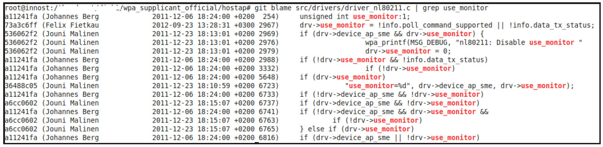
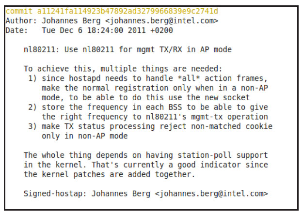

# 4.2.4 git的使用


WPAS难度较大的一个重要原因是其注释较少，很多变量的含义没有任何解释。笔者也为此大伤脑筋。不得以，只能通过查看WPAS代码的历史版本来寻根溯源。经过实践，笔者总结了利用git来查询WPAS历史版本信息的一些步骤，分别如下。

用gitclone命令下载WPAS官方代码。

```
git clone git：//w1.fi/srv/git/hostap.git
```

以下命令的含义是查询use_monitor在driver_nl80211.c中的变化情况。

```
git blame src/drivers/driver_nl80211.c|grep use_monitor
```

因为use_monitor定义于该文件中，所以用gitblame查看。得到的结果如图4-3所示。



图4-3gitblame结果图4-3中的第一行显示了use_monitor最早出现的patch的情况，其对应的commitid是a11241fa。接着，再通过命令"gitloga11241fa"可查看当时的commit信息。



图4-4gitlog结果图4-4展示了a11241fa对应的commit消息。

由于提交者一般会在该消息中添加注释性内容，所以可通过研究这些内容来了解代码中某些变量的含义。

下面正式开始WPAS的代码分析之旅。首先分析WPAS的初始化流程。
