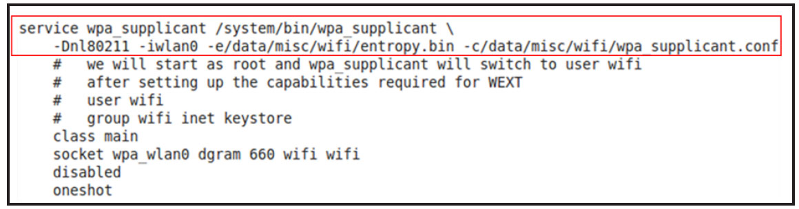
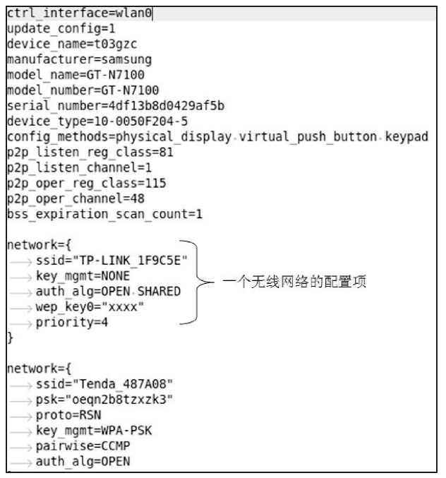

# 4.3 wpa_supplicant初始化流程

4.3wpa_supplicant初始化流程Android系统中，WPAS启动是通过"setpropctrl.startwpa_supplicant"来触发init进程去fork一个子进程来完成的。WPAS在init配置文件中被定义为一个service。图4-5所示为Note2init.smdk4x12.rc文件中关于wpa_supplicant的定义。

图4-5init配置文件中的wpa_supplicant图4-5中的黑框展示了wpa_supplicant的启动参数。其众多参数中，最重要的是通过"-c"参数指定的WPAS启动配置文件（图4-5中，该配置文件全路径名为/data/misc/wifi/wpa_supplicant.conf）​。

提示wpa_supplicant源代码中包含一个启动配置文件的模板，该文件对各项配置参数都有说明。其文件路径为external/wpa_supplicant_8/wpa_supplicant/wpa_supplicant.conf。

Note2中该配置文件的内容如图4-6所示。

图4-6wpa_supplicant.conf文件内容❑ctrl_interface指明控制接口unix域socket的文件名。

❑update_config表示如果WPAS运行过程中修改了配置信息，则需要把它们保存到此wpa_supplicant.conf文件中。

❑从device_name到config_method都和WPS设置有关。后续章节介绍其作用。

❑p2p等选项和Wi-FiP2P有关。后续章介绍它们的作用。

❑WPAS运行过程中得到的无线网络信息都会通过一个"network"配置项保存到此配置文件中。如果该信息完整，一旦WPAS找到该无线网络就会尝试用保存的信息去加入它（这也是为什么用户在settings中打开无线网络后，手机能自动加入周围某个曾经登录过的无线网络的原因）​。

❑network项包括的内容非常多。图中第二个network项展示了该无线网络的ssid、密钥管理方法（keymanagement）​、身份认证方法及密码等信息。network中的priority表示无线网络的优先级。其作用是，如果同时存在多个可用的无线网络，WPAS优先选择priority高的那一个。

下面正式进入WPAS的代码，先来看其入口函数main。
