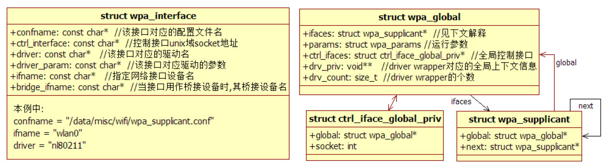

# 4.3.1 main函数分析


Android平台中，main函数定义于main.c中，代码如下所示。

[--＞main.c：​：main]main函数中出现了几个重要的数据结构和两个关键函数。

注意虽然WPAS代码遵循C语法，但笔者也将称结构体实例称为对象。

先来认识这几个重要数据结构，如图4-7所示。



图4-7main函数中重要的数据结构图4-7中：

❑wpa_interface用于描述一个无线网络设备。该参数在初始化时用到。

❑wpa_global是一个全局性质的上下文信息。它通过ifaces变量指向一个wpa_supplicant对象（以后介绍wpa_supplicant时，读者将发现系统内的所有wpa_supplicant对象将通过单向链表连接在一起。所以，严格意义上来说，ifaces变量指向一个wpa_supplicant对象链表）​。

drv_priv包含driverwrapper所需要的全局上下文信息。其drv_count代表当前编译到系统中的driverwrapper个数（详情见下文）​。另外，wpa_global有一个全局控制接口，如果设置该接口，其他wpa_interface设置的控制接口将被替代。

❑wpa_supplicant是WPAS的核心数据结构。一个interface对应有一个wpa_supplicant对象，其内部包含非常多的成员变量（图4-7并未画出，下文详细介绍）​。另外，系统中所有wpa_supplicant对象都通过next变量链接在一起。

❑ctrl_iface_global_priv是全局控制接口的信息，内部包含一个用于通信的socket句柄。

提示由于篇幅原因，笔者将根据情况略去数据结构中部分成员变量的介绍。

下面分析关键函数wpa_supplicant_init。

```
struct wpa_global * wpa_supplicant_init(struct wpa_params *params)
{
    struct wpa_global *global;
    int ret, i;
    ......
#ifdef CONFIG_DRIVER_NDIS
     ......// windows driver支持
#endif
#ifndef CONFIG_NO_WPA_MSG
    // 设置全局回调函数，详情见下文解释
    wpa_msg_register_ifname_cb(wpa_supplicant_msg_ifname_cb);
#endif /* CONFIG_NO_WPA_MSG */
  // 输出日志文件设置，本例未设置该文件
    wpa_debug_open_file(params-＞wpa_debug_file_path);
    ......
    ret = eap_register_methods();// ①注册EAP方法
    ......
    global = os_zalloc(sizeof(*global)); // 创建一个wpa_global对象
    ...... // 初始化global中的其他参数
    wpa_printf(MSG_DEBUG, "wpa_supplicant v" VERSION_STR);
    // ②初始化事件循环机制
    if (eloop_init()) {......}
    // 初始化随机数相关资源，用于提升后续随机数生成的随机性
    // 这部分内容不是本书的重点，感兴趣的读者请自行研究
    random_init(params-＞entropy_file);
    // 初始化全局控制接口对象。由于本例中未设置全局控制接口，故该函数的处理非常简单，请读者自行阅读该函数
    global-＞ctrl_iface = wpa_supplicant_global_ctrl_iface_init(global);
    ......
    // 初始化通知机制相关资源，它和dbus有关。本例没有包括dbus相关内容，略
    if (wpas_notify_supplicant_initialized(global)) {......}
    // ③wpa_driver是一个全局变量，其作用见下文解释
    for (i = 0; wpa_drivers[i]; i++)
        global-＞drv_count++;
     ......
    // 分配全局driver wrapper上下文信息数组
    global-＞drv_priv = os_zalloc(global-＞drv_count * sizeof(void *));
    ......
    return global;
}
```

4.3.2wpa_supplicant_init函数分析wpa_supplicant_init代码如下所示。

[--＞wpa_supplicant.c：​：

wpa_supplicant_init]
