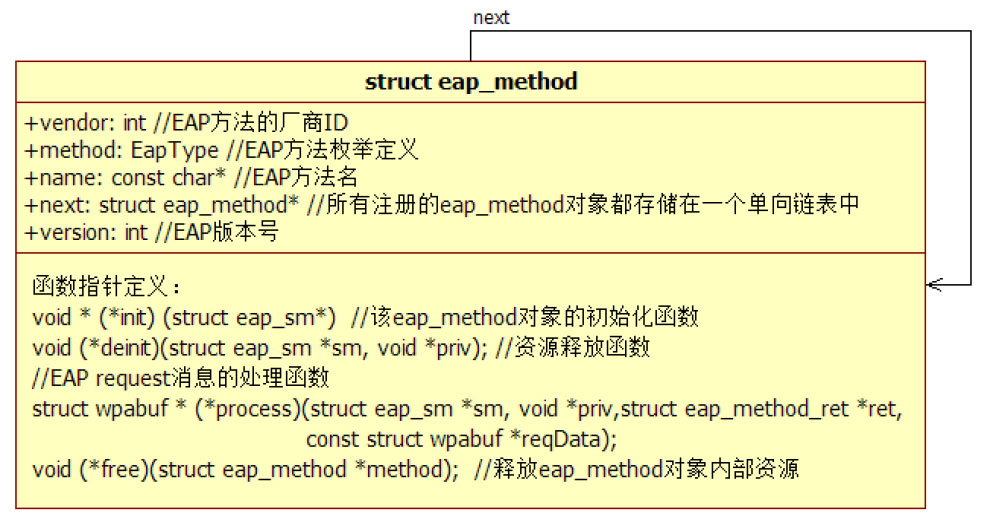
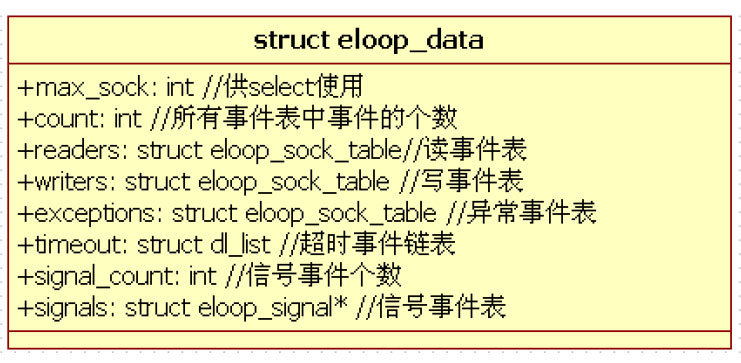

# 4.3.2 wpa_supplicant_init函数分析


wpa_supplicant_init函数的主要功能是初始化wpa_global以及一些与整个程序相关的资源，包括随机数资源、eloop事件循环机制以及设置消息全局回调函数。

此处先简单介绍消息全局回调函数，一共有两

```java
// wpa_msg_ifname_cb用于获取无线网卡接口名
// WPAS为其设置的实现函数为wpa_supplicant_msg_ifname_cb
// 读者可自行阅读此函数
static wpa_msg_get_ifname_func wpa_msg_ifname_cb = NULL;
void wpa_msg_register_ifname_cb(wpa_msg_get_ifname_func func){
    wpa_msg_ifname_cb = func;
}
// WPAS中，wpa_msg_cb的实现函数是wpa_supplicant_ctrl_iface_msg_cb，它将输出信息发送给客户端
// 图4-2最后两行的信息就是由此函数发送给客户端的。而且前面的"＜3＞"也是由它添加的
static wpa_msg_cb_func wpa_msg_cb = NULL;
void wpa_msg_register_cb(wpa_msg_cb_func func){
    wpa_msg_cb = func;
}
```

个。

❑wpa_msg_get_ifname_func：有些输出信息中需要打印出网卡接口名。该回调函数用于获取网卡接口名。

❑wpa_msg_cb_func：除了打印输出信息外，还可通过该回调函数进行一些特殊处理，如把输出信息发送给客户端进行处理。

上述两个回调函数相关的代码如下所示。

现在来看wpa_supplicant_init中列出的三个[--＞wpa_debug.c]关键点，首先是eap_register_method函数。

1.eap_register_methods函数该函数本身非常简单，它主要根据编译时的配置项来初始化不同的eap方法。其代码如下所示。

[如--上＞述ea代p_码reg所is示te，r.ce：​：ap_register_methods函e数ap将_r根eg据iste编r_译me配th置od项s]来注册所需的eapmethod。例如，MD5身份验证方法对应的

```c
int eap_register_methods(void)
{
    int ret = 0;
#ifdef EAP_MD5                  // 作为supplicant端，编译时将定义EAP_MD5
    if (ret == 0)
        ret = eap_peer_md5_register();
#endif /* EAP_MD5 */
......
#ifdef EAP_SERVER_MD5           // 作为Authenticator端，编译时将定义EAP_SERVER_MD5
    if (ret == 0)
        ret = eap_server_md5_register();
#endif /* EAP_SERVER_MD5 */
  ......
  return ret;
}
```

注册函数是eap_peer_md5_register，该函数内部将填充一个名为eap_method的数据结构，其定义如图4-8所示。

图4-8所示的structeap_method结构体声明于eap_i.h中，其内部一些变量及函数指针的定义和RFC4137有较大关系。此处，我们暂时列出其中一些简单的成员变量。4.4节将详细介绍RFC4137相关的知识。

来看第二个关键函数eloop_init，它和图4-1所示WPAS软件架构中的eventloop模块有关。

2.eloop_init函数及eventloop模块eloop_init函数本身特别简单，它仅初始化了WPAS中事件驱动的核心数据结构体eloop_data。WPAS事件驱动机制的实现非常简单，它就是利用epo（如果编译时设置了CONFIG_ELOOP_POLL选项）或select实现了I/O复用。

提醒select（或epo）是I/O复用的重要函数，属于基础知识范畴。请不熟悉的读者自行学习相关内容。

从事件角度来看，WPAS的事件驱动机制支持5种类型的event。

❑readevent：读事件，例如来自socket的可读事件。

❑writeevent：写事件，例如socket的可写事件。

❑exceptionevent：异常事件，如果socket操作发生错误，则由错误事件处理。

❑timeoutevent：定时事件，通过select的等待超时机制来实现定时事件。

❑signal：信号事件，信号事件来源于Kernel。WPAS允许为一些特定信号设置处理函数。

以上这些事件相关的信息都保存在eloop_data结构体中，如图4-9所示。



图4-8eap_method数据结构



```
// 注册socket读事件处理函数，参数sock代表一个socket句柄。一旦该句柄上有读事件发生，则handler函数
// 将被事件处理循环（见下文eloop_run函数）调用
int eloop_register_read_sock(int sock, eloop_sock_handler handler,
            void *eloop_data, void *user_data);
// 注册socket事件处理函数，具体是哪种事件（只能是读、写或异常）由type参数决定
int eloop_register_sock(int sock, eloop_event_type type,
          eloop_sock_handler handler,void *eloop_data, void *user_data);
// 注册超时事件处理函数
int eloop_register_timeout(unsigned int secs, unsigned int usecs,
            eloop_timeout_handler handler, void *eloop_data, void *user_data);
// 注册信号事件处理函数，具体要处理的信号由sig参数指定
int eloop_register_signal(int sig, eloop_signal_handler handler, void *user_data);
```

```java
void eloop_run(void)
{
   fd_set *rfds, *wfds, *efds; // fd_set是select中用到的一种参数类型
    struct timeval _tv;
   int res;
    struct os_time tv, now;
    // 事件驱动循环
    while (!eloop.terminate &&
          (!dl_list_empty(&eloop.timeout) || eloop.readers.count ＞ 0 ||
        eloop.writers.count ＞ 0 || eloop.exceptions.count ＞ 0)) {
        struct eloop_timeout *timeout;
        // 判断是否有超时事件需要等待
        timeout = dl_list_first(&eloop.timeout, struct eloop_timeout,list);
        if (timeout) {
            os_get_time(&now);
            if (os_time_before(&now, &timeout-＞time))
                os_time_sub(&timeout-＞time, &now, &tv);
            else
              tv.sec = tv.usec = 0;
            _tv.tv_sec = tv.sec;
            _tv.tv_usec = tv.usec;
        }
        // 将外界设置的读事件添加到对应的fd_set中
        eloop_sock_table_set_fds(&eloop.readers, rfds);
        ......// 设置写、异常事件到fd_set中
        // 调用select函数
        res = select(eloop.max_sock + 1, rfds, wfds, efds,timeout ? &_tv : NULL);
        if(res < 0) {......// 错误处理}
        // 先处理信号事件
        eloop_process_pending_signals();
        // 判断是否有超时事件发生
        timeout = dl_list_first(&eloop.timeout, struct eloop_timeout,list);
        if (timeout) {
            os_get_time(&now);
            if (!os_time_before(&now, &timeout-＞time)) {
                void *eloop_data = timeout-＞eloop_data;
                void *user_data = timeout-＞user_data;
                eloop_timeout_handler handler = timeout-＞handler;
                eloop_remove_timeout(timeout);          // 注意，超时事件只执行一次
                handler(eloop_data, user_data);         // 处理超时事件
            }
        }
        ......// 处理读/写/异常事件。方法和下面这个函数类似
        eloop_sock_table_dispatch(&eloop.readers, rfds);
        ......// 处理wfds和efds
    }
out:
    return;
}
```

图4-9eloop_data结构体简单介绍一下eloop提供的事件注册API及eloop事件循环核心处理函数eloop_run。首先是事件注册API函数，相关代码如下所示。

[--＞eloop.h]最后，向读者展示一下WPAS事件驱动机制的运行原理，其代码在eloop_run函数中，如下所示。

[--＞eloop.c：​：eloop_run]eloop_run中的while循环是WPAS进程的运行中枢。不过其难度也不大。

下面来看wpa_supplicant_init代码中的第三个关键点，即wpa_drivers变量。

3.wpa_drivers数组和driveri/f模块wpa_drivers是一个全局数组变量，它通过extern方式声明于main.c中，其定义却在drivers.c中，如下所示。

[--＞drivers.c：​：wpa_drivers定义]

```c
struct wpa_driver_ops *wpa_drivers[] =
{
#ifdef CONFIG_DRIVER_WEXT
    &wpa_driver_wext_ops,
#endif /* CONFIG_DRIVER_WEXT */
#ifdef CONFIG_DRIVER_NL80211
    &wpa_driver_nl80211_ops,
#endif /* CONFIG_DRIVER_NL80211 */
   ......// 其他driver接口
}
```

wpa_drivers数组成员指向一个wpa_driver_ops类型的对象。

wpa_driver_ops是driveri/f模块的核心数据结构，其内部定义了很多函数指针。而正是通过定义函数指针的方法，WPAS能够隔离上层使用者和具体的driver。

注意此处的driver并非通常意义所指的那些运行于Kernel层的驱动。读者可认为它们是Kernel层wlan驱动在用户空间的代理模块。上层使用者通过它们来和Kernel层的驱动交互。为了避免混淆，本书后续将用driverwrapper一词来表示WPAS中的driver。而driver一词将专指Kernel里对应的wlan驱动。

另外，wpa_drivers数组包含多少个driverwrapper对象也由编译选项来控制（如代码中所示的CONFIG_DRIVER_WEXT宏，它们可在android.cfg中被修改）​。

此处先列出wpa_driver_nl80211_ops的定

```
const struct wpa_driver_ops wpa_driver_nl80211_ops = {
    .name = "nl80211",                                  // driver wrapper的名称
    .desc = "Linux nl80211/cfg80211",                   // 描述信息
    .get_bssid = wpa_driver_nl80211_get_bssid,          // 用于获取bssid
    ......
    .scan2 = wpa_driver_nl80211_scan,                   // 扫描函数
    ......
    .get_scan_results2 = wpa_driver_nl80211_get_scan_results,
                                                        // 获取扫描结果
    ......
    .disassociate = wpa_driver_nl80211_disassociate,    // 触发disassociation操作
    .authenticate = wpa_driver_nl80211_authenticate,    // 触发authentication操作
    .associate = wpa_driver_nl80211_associate,          // 触发association操作
    // driver wrapper全局初始化函数，该函数的返回值保存在wpa_global成员变量drv_pri数组中
    .global_init = nl80211_global_init,
     ......
    .init2 = wpa_driver_nl80211_init,                   // driver wrapper初始化函数
     ......
#ifdef ANDROID  // Android平台定义了该宏
    .driver_cmd = wpa_driver_nl80211_driver_cmd,// 该函数用于处理和具体驱动相关的命令
#endif
};
```

义。

[--＞driver_nl80211.c：​：

wpa_driver_nl80211_ops]本节介绍了main函数中第一个的关键点wpa_supplicant_init，其中涉及的知识有：

几个重要数据结构，如wpa_global、wpa_interface、eap_method、wpa_driver_ops等；eventloop的工作原理；消息全局回调函数和wpa_drivers等内容。

下面来分析main中第二个关键函数wpa_supplicant_add_iface。
