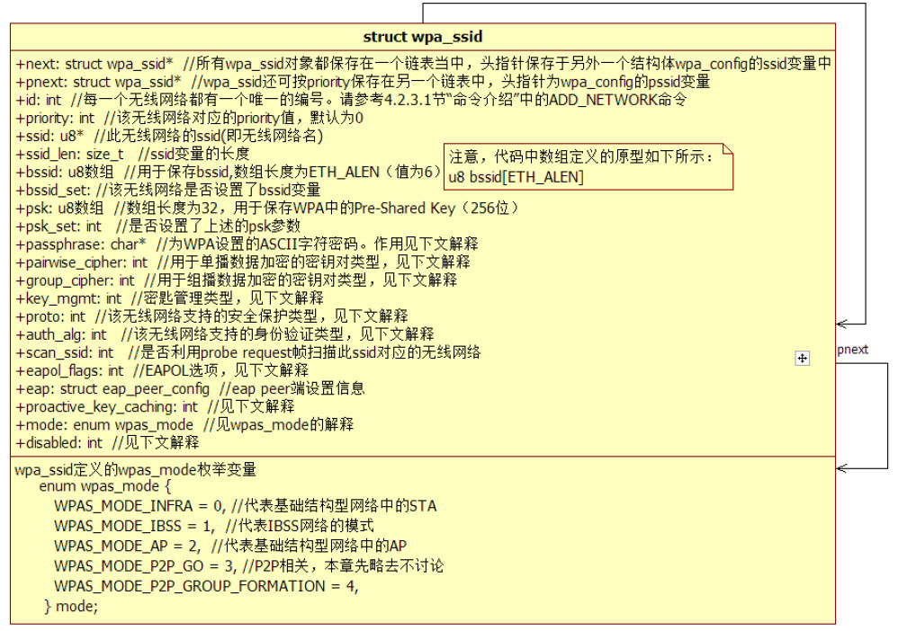
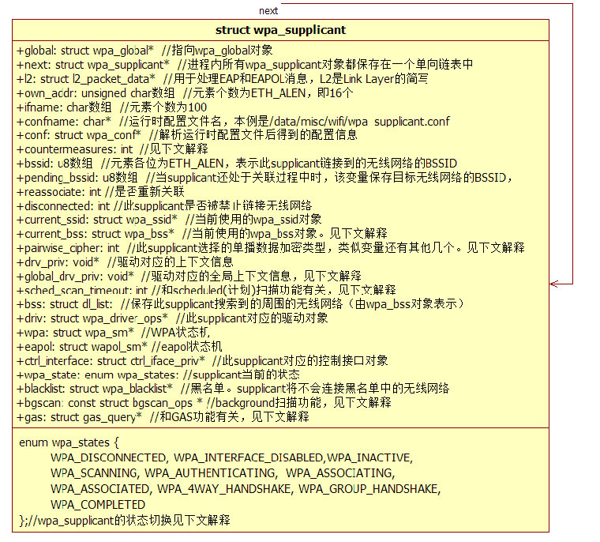

# 4.3.3 wpa_supplicant_add_iface函数分析


```
struct wpa_supplicant * wpa_supplicant_add_iface(struct wpa_global *global,
                         struct wpa_interface *iface)
{
    struct wpa_supplicant *wpa_s;
    struct wpa_interface t_iface;
    struct wpa_ssid *ssid;
    ......
    wpa_s = wpa_supplicant_alloc();
    ......
    wpa_s-＞global = global;
    t_iface = *iface;
    ......// 其他一些处理。本例未涉及它们
    //  wpa_supplicant_init_iface为重要函数，下面单独用一节来分析它
    if (wpa_supplicant_init_iface(wpa_s, &t_iface)) {......}
     ......
     // 通过dbus通知外界有新的iface加入。本例并未使用DBUS
     if (wpas_notify_iface_added(wpa_s)) { ......}
     // 通过dbus通知外界有新的无线网络加入
     for (ssid = wpa_s-＞conf-＞ssid; ssid; ssid = ssid-＞next)
        wpas_notify_network_added(wpa_s, ssid);
    /*
     还记得图4-7中wpa_global数据结构吗？wpa_global的ifaces变量指向一个
     wpa_supplicant对象，而wpa_supplicant又通过next变量将自己链接到一个单向链表中。
    */
    wpa_s-＞next = global-＞ifaces;
    global-＞ifaces = wpa_s;
    return wpa_s;
}
```

4.3.3wpa_supplicant_add_iface函数分析wpa_supplicant_add_iface用于向WPAS添加接口设备。所谓的添加（addiface）​，其实就是初始化这些设备。该函数代码如下所示。

[--＞wpa_supplicant.c：​：

wpa_supplicant_add_iface]wpa_supplicant_add_iface的内容非常丰富，包括两个重要数据结构（wpa_supplicant和wpa_ssid）以及一个关键函数wpa_supplicant_init_iface。由于这些数据结构涉及较多背景知识，故本节先来介绍它们。

提示wpa_supplicant_init_iface内容也比较丰富，本章将在4.3.4节中单独介绍。

1.wpa_ssid结构体wpa_ssid用于存储某个无线网络的配置信息（如所支持的安全类型、优先级等）​。它其实是图4-6所示wpa_supplicant.conf中无线网络配置项在代码中的反映（conf文件中每一个network项都对应一个wpa_ssid对象）​。

它的一些主要数据成员如图4-10所示。



图4-10wpa_ssid数据结构图4-10所示中的一些数据成员非常重要，下面分别介绍它们。

（1）安全相关成员变量及背景知识和安全相关的成员变量如下所示。

1）passphrase：该变量只和WPA/WPA2-PSK模式有关，用于存储我们输入的字符串密

```
// 位于defs.h中
#define WPA_CIPHER_NONE BIT(0)  // 不保护。BIT(N)是一个宏，代表1左移N位后的值
#define WPA_CIPHER_WEP40 BIT(1)                 //  WEP40（即5个ASCII字符密码）
#define WPA_CIPHER_WEP104 BIT(2)                //  WEP104（即13个ASCII字符密码）
#define WPA_CIPHER_TKIP BIT(3)                  //  TKIP
#define WPA_CIPHER_CCMP BIT(4)                  //  CCMP
// 系统还定义了两个宏用于表示默认支持的加密套件类型：（位于config_ssid.h中）
#define DEFAULT_PAIRWISE (WPA_CIPHER_CCMP | WPA_CIPHER_TKIP)
#define DEFAULT_GROUP (WPA_CIPHER_CCMP | WPA_CIPHER_TKIP | \
                       WPA_CIPHER_WEP104 | WPA_CIPHER_WEP40)
```

码。而实际上，规范要求使用的却是图4-10中的psk变量。结合3.3.7节中关于key和password的介绍可知，用户一般只设置字符串形式的password。而WPAS将根据它和ssid进行一定的计算以得到最终使用的PSK。

参考资料[3]中有PSK计算方法。

2）pairwise_cipher和group_cipher：这两个变量和规范中的ciphersuite（加密套件）

定义有关。ciphersuite用于指明数据收发两方使用的数据加密方法。pairwise_cipher和3）key_mgmt：该成员和802.11中的AKMgroup_cipher分别代表为该无线网络设置的suite相关。AKM（AuthenticationandKey单播和组播数据加密方法。标准说明请阅读参Managment，身份验证和密钥管理）suite考资料[4]​。WPAS中的定义如下。

定义了一套算法用于在Supplicant和Authenticator之间交换身份和密匙信息。标准说明见参考资料[5]​，WPAS中定义的key_mgmt可取值如下。

```
// 位于defs.h中
#define WPA_KEY_MGMT_IEEE8021X BIT(0) // 不同的AKM suite有对应的流程与算法。不详细介绍
#define WPA_KEY_MGMT_PSK BIT(1)
#define WPA_KEY_MGMT_NONE BIT(2)
#define WPA_KEY_MGMT_IEEE8021X_NO_WPA BIT(3)
#define WPA_KEY_MGMT_WPA_NONE BIT(4)
#define WPA_KEY_MGMT_FT_IEEE8021X BIT(5)  // FT（Fast Transition）用于ESS中快速切换BSS
#define WPA_KEY_MGMT_FT_PSK BIT(6)
#define WPA_KEY_MGMT_IEEE8021X_SHA256 BIT(7) // SHA256表示key派生时使用SHA256做算法
#define WPA_KEY_MGMT_PSK_SHA256 BIT(8)
#define WPA_KEY_MGMT_WPS BIT(9)
// 位于config_ssid.h中
#define DEFAULT_KEY_MGMT (WPA_KEY_MGMT_PSK | WPA_KEY_MGMT_IEEE8021X)
// 默认的AKM suite
```

```
// 位于defs.h中
#define WPA_PROTO_WPA BIT(0)
#define WPA_PROTO_RSN BIT(1)                            // RSN其实就是WPA2
// 位于config_ssid.h中
#define DEFAULT_PROTO (WPA_PROTO_WPA | WPA_PROTO_RSN)   // 默认支持两种协议
```

5）auth_alg：表示该无线网络所支持的身份验证算法，其可取值如下。

```
// 位于defs.h中
#define WPA_AUTH_ALG_OPEN BIT(0)        // Open System，如果要使用WPA或RSN，必须选择它
#define WPA_AUTH_ALG_SHARED BIT(1)      // Shared Key算法
#define WPA_AUTH_ALG_LEAP BIT(2)        // LEAP算法，LEAP是思科公司提出的身份验证方法
#define WPA_AUTH_ALG_FT BIT(3)          // 和FT有关，此处不详细介绍，读者可阅读参考资料[6]
```

4）proto：代表该无线网络支持的安全协议类型。其可取值如下。

6）eapol_flags：和动态WEPKey有关（本书不讨论，读者可阅读参考资料[7]​）​，其取值包括如下。

```
// 位于config_ssid.h中
#define EAPOL_FLAG_REQUIRE_KEY_UNICAST BIT(0)
#define EAPOL_FLAG_REQUIRE_KEY_BROADCAST BIT(1)
```

上述变量的取值将影响wpa_supplicant的处理逻辑。本章后续代码分析将见识到它们的实际作用。

（2）其他成员变量及背景知识图4-10中其他三个重要成员变量介绍如下。

1）proactive_key_caching：该变量和OPC（OpportunisticPMKCaching）技术有关。该技术虽还未正式被标准所接受，但很多无线设备厂商都支持它。其背景情况是，一组AP和一个中心控制器（centralcontroer）

共同组建一个所谓的mobilityzone（移动区域）​。zone中的所有AP都连接到此控制器上。当STA通过zone中的某一个AP（假设是AP_0）加入到无线网络后，STA和AP0完成802.1X身份验证时所创建的PMKSA（假设是PMKSA_0）将由controer发送到zone中的其他AP。其他AP将根据此PMSKA_0来生成PMKSA_i。当STA切换到zone中的AP_i时，它将根据PMKSA_0计算PMKID_i（不熟悉的读者请阅读3.3.7节RSNA介绍）​，并试图和AP_i重新关联（Reassociation）​。如果此AP_i属于同一个zone，因为之前它已经由controer发送的PMKSA_0计算出了PMKSA_i，所以STA可避过802.1X认证流程而直接进入后续的（如4-WayHandshake）

处理流程。802.1X验证的目的就是得到PMKSA，所以，如果AP_i已经有PMKSA_i，就无须费时费力开展802.1X认证工作了。

proactive_key_caching默认值为0，即不支持此功能。另外，OPC功能需要AP支持。关于OPC的信息请阅读参考资料[8]和[9]​。

2）disable：该变量取值为0（代表该无线网络可用）​、1（代表该无线网络被禁止使用，但可通过命令来启用它）​、2（表示该无线网络和P2P有关）​。

3）mode：wpa_ssid结构体内部还定义了一个枚举型变量，其可取值如图4-10底部所示。此处要特别指出的是，基础结构型网络中，如果STA和某个AP成功连接的话，STA也称为ManagedSTA（对应枚举值为WPAS_MODE_INFRA）​。

2.wpa_supplicant结构体wpa_supplicant结构体定义的成员变量非常多，图4-11列出了其中一部分内容。



图4-11wpa_supplicant结构体此处先解释几个比较简单的成员变量。

❑drv_priv和global_drv_priv：WPAS为driverwrapper一共定义了两个上下文信息。

这是因为driveri/f接口定义了两个初始化函数（以nl80211driver为例，它们分别是global_init和init2）​。其中，global_init返回值为driverwrapper全局上下文信息，它将保存在wpa_global的drv_priv数组中（见图4-7）​。每个wpa_supplicant都对应有一个driverwrapper对象，故它也需要保存对应的全局上下文信息。init2返回值则是driverwrapper上下文信息，它保存在wpa_supplicant的driv_priv中。

❑current_bss：该变量类型为wpa_bss。

wpa_bss是无线网络在wpa_supplicant中的代表。wpa_bss中的成员主要描述了无线网络的bssid、ssid、频率（freq，以MHz为单位）​、Beacon心跳时间（以TU为单位）​、capability信息（网络性能，见3.3.5节定长字段介绍）​、信号强度等。wpa_bss的作用很重要，不过其数据结构相对比较简单，此处不介绍。以后用到它时再来介绍。

现在，来看wpa_supplicant结构体中其他更有“料”的成员变量。

（1）安全相关成员变量及背景知识wpa_supplicant也定义了一些和安全相关的成员变量。

❑pairwise_cipher、group_cipher、key_mgmt、wpa_proto、mgmt_group_cipher：这几个变量表示该wpa_supplicant最终选择的安全策略。其中mgmt_group_cipher和IEEE802.11w（定义了管理帧加密的规范）有关。为节约篇幅，图4-11中仅列出pairwise_cipher一个变量。

❑countermeasures：该变量名可译为“策略”​，和TKIP的MIC（MessageIntegrityCheck，消息完整性校验）有关。因为TKIPMIC所使用的Michael算法在某些情况下容易被攻破，所以规范特别定义了TKIPMICcountermeasures用于处理这类事情。例如，一旦检测到60秒内发生两次以上MIC错误，则停止TKIP通信60秒。这部分内容请阅读参考资料[10]和[11]​。

（2）功能相关成员变量及背景知识wpa_supplicant结构体中有一些成员变量和功能相关。

❑sched_scan_timeout（还有一些相关变量未在图4-11中列出）​：该变量和计划扫描（scheduledscan）功能有关。计划扫描即定时扫描，需要Kernel（版本必须大于3.0）

的Wi-Fi驱动支持。启用该功能时，需要为驱动设置定时扫描的间隔（以毫秒为单位）​。

❑bgscan（还有其他相关成员变量未在图4-11中列出）​：该变量和后台扫描及漫游（backgroundscanandroaming）技术有关。当STA在ESS（假设该ESS由多个AP共同构成）中移动时，有时候因为信号不好（例如STA离之前所关联的AP距离过远等）​，它需要切换到另外一个距离更近（即信号更好）的AP。这个切换AP的工作就是所谓的漫游。为了增强切换AP时的无缝体验（扫描过程中，STA不能收发数据帧。从用户角度来看，相当于网络不能使用）​，STA可采用backgroundscan（定时扫描一小段时间或者当网络空闲时才扫描，这样可减少对用户正常使用的干扰）技术来监视周围AP的信号强度等信息。

一旦之前使用的AP信号强度低于某个阈值，STA则可快速切换到某个信号更强的AP。除了backgroundscan外，还有一种on-roamscan也能提升AP切换时的无缝体验。关于backgroundscan和roaming，请阅读参考资料[12]和[13]​。

❑gas：该变量是GAS（GenericAdvertisementService，通用广告服务）的小写，和802.11u协议有关。该协议规定了不同网络间互操作的标准，其制定的初衷是希望Wi-Fi网络能够像运营商的蜂窝网络一样，方便终端设备接入。例如，人们用智能手机可搜索到数十个、甚至上百个无线网络。在这种情况下如何选择正确的无线网络呢？802.11u协议使用GAS和ANQP（AccessNetworkQueryProtocol，接入网络查询协议）来帮助设备自动选择合适的无线网络。其中，GAS是MLMESAP中的一种（见规范6.3.71节）​，它使得STA在通过认证前（priortoauthentication）就可以向AP发送和接收ANQP数据包。STA则使用ANQP协议向AP查询无线网络运营商的信息，然后STA根据这些信息来判断自己可以加入哪一个运营商的无线网络（例如中国移动手机卡用户可以连接中国移动架设的无线网络）​。802.11u现在还不是特别完善，详细信息可阅读参考资料[14]和[15]​。

❑CONFIG_SME：该变量是一个编译宏，用于设置WPAS是否支持SME。我们在3.3.6节“802.11MAC管理实体”中曾介绍过SME（StationManagementEntity）​。如果该功能支持，则driverwrapper可直接利用SME定义的SAP，而无须使用MLME的SAP了。Android平台中如果定义了CONFIG_DRIVER_NL80211宏，则CONFIG_SME也将被定义（参考drivers.mk文件）​。不过SME的功能是否起作用，还需要看driver是否支持。GalaxyNote2wlandriver不支持SME，故本书不讨论。

（3）wpa_states的取值wpa_states的取值如下。

❑WPA_DISCONNECTED：表示当前未连接到任何无线网络。

❑WPA_INTERFACE_DISABLED：代表当前此wpa_supplicant所使用的网络设备被禁用。

❑WPA_INACTIVE：代表当前此wpa_supplicant没有可连接的无线网络。这种情况包括周围没有无线网络，以及有无线网络，但是因为没有配置信息（如没有设置密码等）而不能发起认证及关联请求的情况。

❑WPA_SCANNING、WPA_AUTHENTICATING、WPA_ASSOCIATING：分别表示当前wpa_supplicant正处于扫描无线网络、身份验证、关联过程中。

❑WPA_ASSOCIATED：表明此wpa_supplicant成功关联到某个AP。

❑WPA_4WAY_HANDSHAKE：表明此wpa_supplicant处于四次握手处理过程中。

当使用PSK（即WPA/WPA2-Personal）策略时，STA收到第一个EAPOL-Key数据包则进入此状态。当使用WPA/WPA2-Enterprise方法时，当STA完成和RAIDUS身份验证后则进入此状态。

❑WPA_GROUP_HANDSHAKE：表明STA处于组密钥握手协议处理过程中。当STA完成四次握手协议并收到组播密钥交换第一帧数据后即进入此状态（或者四次握手协议中携带了GTK信息，也会进入此状态。详情见4.5.5节EAPOL-Key交换流程分析）​。

❑WPA_COMPLETED：所有认证过程完成，wpa_supplicant正式加入某个无线网络。

介绍完上述几个重要数据结构后，下面将分析wpa_supplicant_add_iface中一个关键函数wpa_supplicant_init_iface。

```java
static int wpa_supplicant_init_iface(struct wpa_supplicant *wpa_s,
                                       struct wpa_interface *iface)
{
    const char *ifname, *driver;
    struct wpa_driver_capa capa;
    if (iface-＞confname) {
      ......// CONFIG_BACKEND_FILE处理，此宏指明WPAS使用的配置项信息来源于文件
            // Android定义了它
      wpa_s-＞conf = wpa_config_read(wpa_s-＞confname);
    }
    ......
```

4.3.4wpa_supplicant_init_iface函数分析wpa_supplicant_init_iface内容非常多，我们将通过逐步展示代码段的方法，分五部分介绍。

[--＞wpa_supplicant.c：​：

wpa_supplicant_init_iface代码段一]
