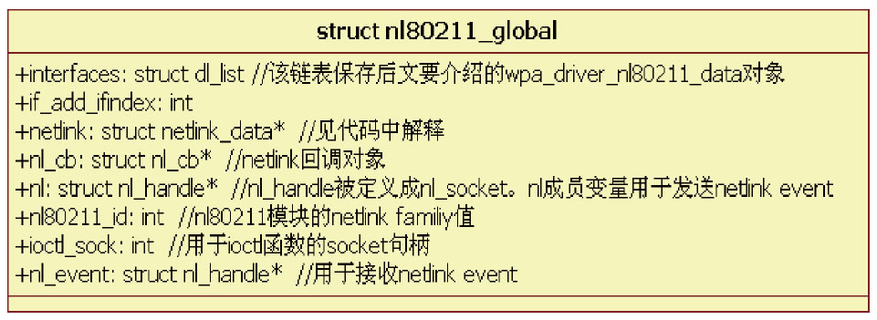
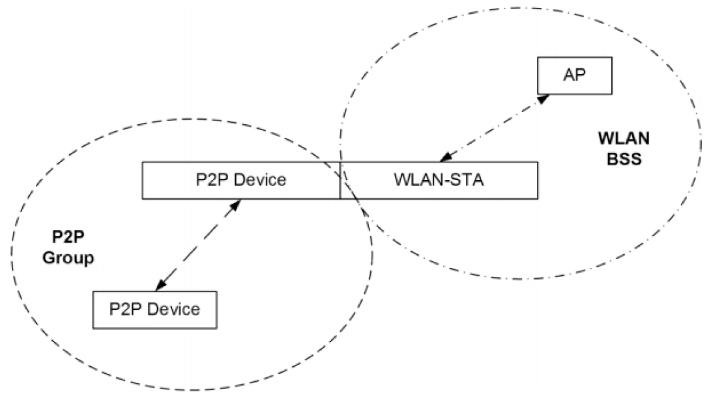
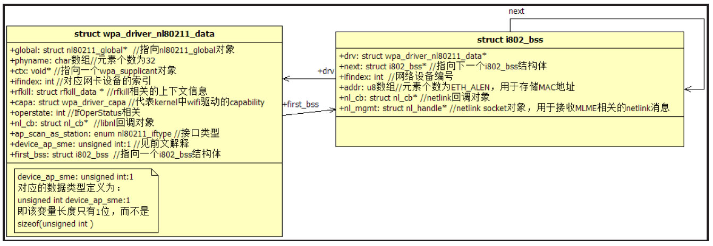
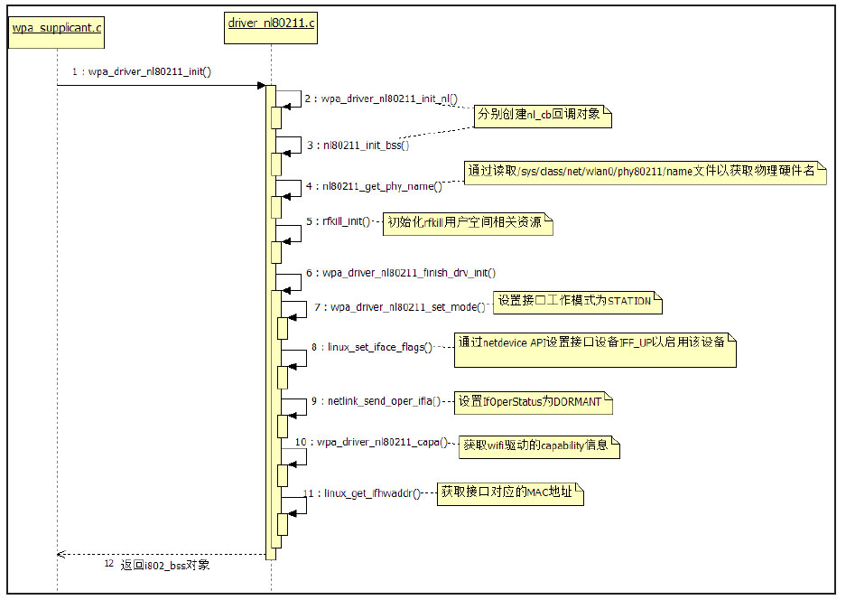
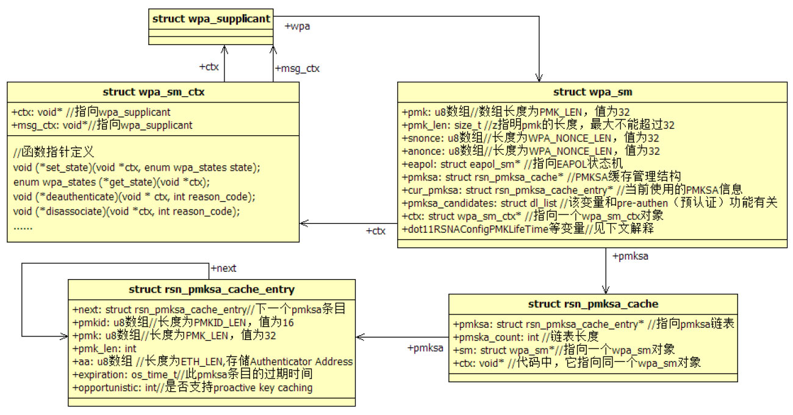
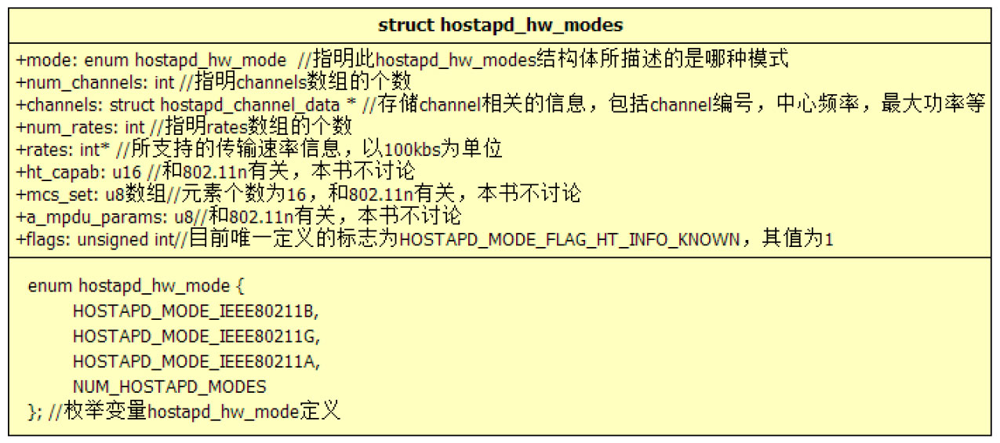
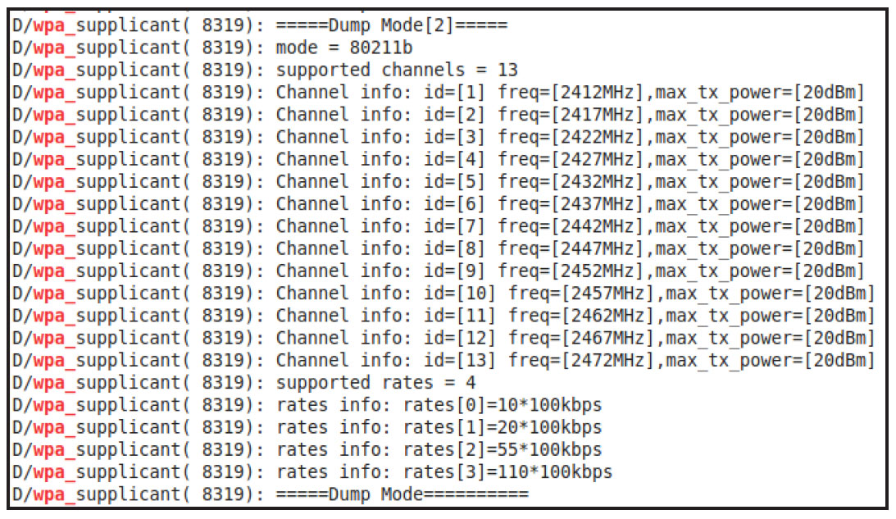
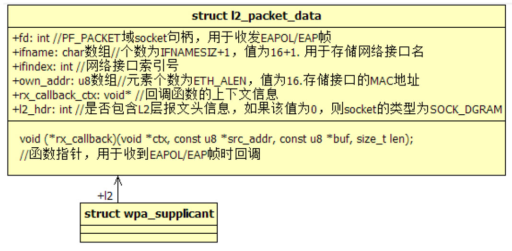
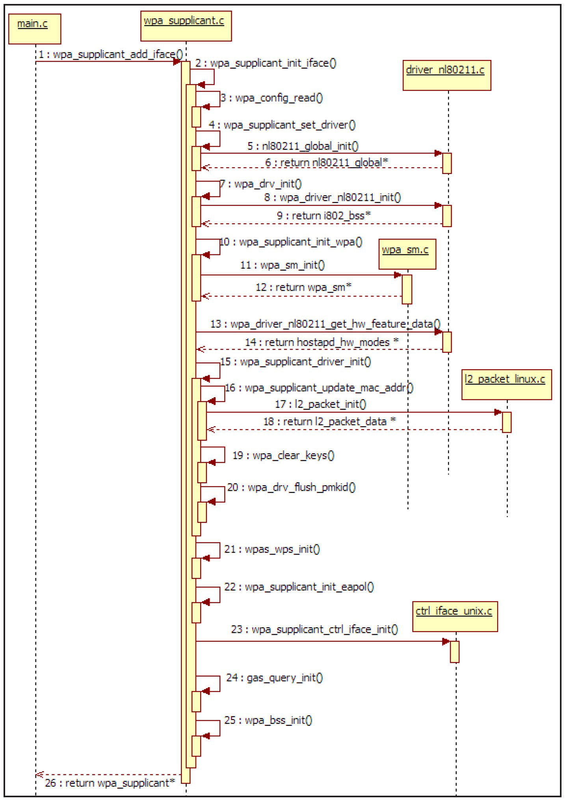

# 4.3.4 wpa_supplicant_init_iface函数分析


```
struct wpa_config * wpa_config_read(const char *name)
{
    FILE *f;
    char buf[256], *pos;
    int errors = 0, line = 0;
    struct wpa_ssid *ssid, *tail = NULL, *head = NULL;
    struct wpa_config *config; // 配置文件在代码中对应的数据结构
    int id = 0;
    config = wpa_config_alloc_empty(NULL, NULL);
    ......
    f = fopen(name, "r");
     ......
    while (wpa_config_get_line(buf, sizeof(buf), f, &line, &pos)) {
        if (os_strcmp(pos, "network={") == 0) {
            // 读取配置文件中的network项，并将其转化成一个wpa_ssid类型的对象
            ssid = wpa_config_read_network(f, &line, id++);
             ......
            // 根据图4-10所示，wpa_ssid通过next成员变量构成了一个单向链表
            if (head == NULL) { head = tail = ssid;}
            else { tail-＞next = ssid; tail = ssid;}
            // network项属于配置文件的一部分，故wpa_ssid对象也包含在wpa_config对象中
            if (wpa_config_add_prio_network(config, ssid)) {......}
            ......// CONFIG_NO_CONFIG_BLOBS，blob是配置文件中的一个字段，用于存储有些身
                  // 份认证算法需要用的证书之类的信息。本例没有使用blob配置项
            // 解析其他项
        } else if (wpa_config_process_global(config, pos, line) ＜ 0) {......}
    }
    fclose(f);
    config-＞ssid = head;
    ......
    return config;
}
```

由上述代码可知，init_iface初始化的第一个工作是解析运行时配置文件。其中，wpa_s-＞confname的值为"/data/misc/wifi/wpa_supplicant.conf"，解析函数是wpa_config_read。

1.wpa_supplicant_init_iface分析之一这个函数本身没有特别之处，仅是把配置文件中的信息转换成对应的数据结构。

[--＞config_file.c：​：wpa_config_read]wpa_config和wpa_ssid这两个数据结构都是配置文件中的信息在代码中的反映。读者可查看wpa_supplicant.conf配置模板文件来了解各个配置项的含义。

```c
   ......// 接wpa_supplicant_init_iface代码段一
   if (os_strlen(iface-＞ifname) ＞= sizeof(wpa_s-＞ifname)) {......}
   // 将wpa_interface中的ifname复制到wpa_supplicant的ifname变量中
   os_strlcpy(wpa_s-＞ifname, iface-＞ifname, sizeof(wpa_s-＞ifname));
   ......
   // 下面这两个函数和EAPOL状态机相关，我们将在4.4节介绍
   eapol_sm_notify_portEnabled(wpa_s-＞eapol, FALSE);
   eapol_sm_notify_portValid(wpa_s-＞eapol, FALSE);
  driver = iface-＞driver;
next_driver:
    if (wpa_supplicant_set_driver(wpa_s, driver) ＜ 0)  return -1;
```

上述代码中，wpa_config_process_global的实现有一些特别，它通过宏的方式来定义解析项及对应的解析函数。由于解析函数最终结果就是设置wpa_config中对应项的值，故本章不讨论其细节，感兴趣的读者不妨自行阅读它们。

2.wpa_supplicant_init_iface分析之二wpa_supplicant_init_iface函数代码段二如下所示。

[--＞wpa_supplicant.c：​：

wpa_supplicant_init_iface代码段二]wpa_supplicant_set_driver将根据driverwrapper名（本例是"nl80211"）找到wpa_driver数组中nl80211指定的driverwrapper对象wpa_driver_nl80211_ops，然后调用其global_init函数。直接来看global_init函数的实现。

提示global_init函数将返回全局driver

```c
static void * nl80211_global_init(void)
{
    struct nl80211_global *global;
    struct netlink_config *cfg;
    global = os_zalloc(sizeof(*global));
    global-＞ioctl_sock = -1;
    dl_list_init(&global-＞interfaces);
    global-＞if_add_ifindex = -1;
    cfg = os_zalloc(sizeof(*cfg));
    ......
    cfg-＞ctx = global;
    /*
     下面这三条语句用于创建netlink socket来接收来自内核的网卡状态变化事件（如UP、DORMANT、
     REMOVED），然后通过eloop_register_read_sock注册一个netlink_recv函数用于处理接收
     到的socket消息。
     netlink_recv函数内部将根据消息的类别来调用newlink_cb和dellink_cb以处理网卡状态变
     化事件。这两个回调函数处理比较简单，读者可在阅读完本章后再自行研究它们。
    */
    cfg-＞newlink_cb = wpa_driver_nl80211_event_rtm_newlink;
    cfg-＞dellink_cb = wpa_driver_nl80211_event_rtm_dellink;
    global-＞netlink = netlink_init(cfg);
    // 将加入netlink中AF_NETLINK协议中的RTMGRP_LINK组播组
    ......
    // nl80211利用netlink机制和wlan driver交互
    if (wpa_driver_nl80211_init_nl_global(global) ＜ 0) ......// 错误处理
    global-＞ioctl_sock = socket(PF_INET, SOCK_DGRAM, 0);
     ......
    return global;
}
```

wrapper上下文信息，它保存在wpa_global的drv_priv数组中。

（1）global_init函数分析global_init是wpa_driver_ops结构体中的一个类型为函数指针的成员变量。nl80211对应的driverwrapper将其设置为nl80211_global_init，代码如下所示。

[--＞driver_nl80211.c：​：

nl80211_global_init]上面代码涉及一个比较重要的数据结构，即代表nl80211driverwrapper全局上下文信息的nl80211_global，其结构如图4-12所示。



图4-12nl80211_global结构体需要注意的是nl80211_global包含两个nl_handle对象。nl_handle的真实类型就是libnl定义的nl_socket。其中，nl用于发送

```java
static int wpa_driver_nl80211_init_nl_global(struct nl80211_global *global)
{
    // 此函数利用了第3章中介绍的API
    int ret;
    // 创建一个netlink回调对象
    global-＞nl_cb = nl_cb_alloc(NL_CB_DEFAULT);
    /*
     nl_create_handle返回值的类型为nl_handle*，而nl_handle在driver_nl802.11c中
     就是nl_socket（代码中的定义：#define nl_handle nl_sock）。
     nl_create_handle内部调用genl_connect连接到内核对应的模块。注意，该函数最后的字符串参数
     （如此处的"nl"）仅用于输出调试信息。
    */
    global-＞nl = nl_create_handle(global-＞nl_cb, "nl");
    /*
        向netenlink中的"nl"模块查询"nl80211"模块的编号。注意，genl_ctrl_resolve函数本
        来由libnl2定义，但driver_nl80211.c通过
        #define genl_ctrl_resolve android_genl_ctrl_resolve
        宏将其指向android_genl_ctrl_resolve。该函数内部通过发送查询消息来获取"nl80211"
        模块的family值。请读者自行阅读android_genl_ctrl_resolve函数。
    */
    global-＞nl80211_id = genl_ctrl_resolve(global-＞nl, "nl80211");
    ......
    // 创建另外一个nl_sock对象，其用途是接收netlink消息
    global-＞nl_event = nl_create_handle (global-＞nl_cb, "event");
    ......
    /*
    下面这几个函数的作用如下。
    nl_get_multicast_id：先从nl80211模块中获得对应的组播组编号，如"scan"、"mlme"以及\n"regulatory"组播组的编号。
    nl_socket_add_membership:加入某个组播组。这样，当某个组播有消息发送时，nl_event就能收到了。
    */
    ret = nl_get_multicast_id(global, "nl80211", "scan");
    ret = nl_socket_add_membership(global-＞nl_event, ret);
    ret = nl_get_multicast_id(global, "nl80211", "mlme");
    ret = nl_socket_add_membership(global-＞nl_event, ret);
    ret = nl_get_multicast_id(global, "nl80211", "regulatory");
    ret = nl_socket_add_membership(global-＞nl_event, ret);
    nl_cb_set(global-＞nl_cb, NL_CB_SEQ_CHECK, NL_CB_CUSTOM,
                  no_seq_check, NULL);// 设置序列号检查函数为no_seq_check
    nl_cb_set(global-＞nl_cb, NL_CB_VALID, NL_CB_CUSTOM,
                 process_global_event, global);// 设置netlink消息回调处理函数
    /*
    将nl_event对应的socket注册到eloop中，回调函数为wpa_driver_nl80211_event_receive，
    该函数内部将调用nl_recv_msg，而nl_recv_msg又会调用process_global_event。所以，我们只
    要关注process_global_event就可以了。
   */
    eloop_register_read_sock(nl_socket_get_fd(global-＞nl_event),
              wpa_driver_nl80211_event_receive, global-＞nl_cb, global-＞nl_event);
    return 0;
    ......
}
```

netlink消息，nl_event用于接收netlink消息。

这两个nl_handle对象的初始化由wpa_driver_nl80211_init_nl_global函数完成，马上来看它。

（2）wpa_driver_nl80211_init_nl_global函数分析wpa_driver_nl80211_init_nl_global是global_init的核心函数，其代码如下所示。

[--＞driver_nl80211.c：​：

wpa_driver_nl80211_init_nl_global]wpa_driver_nl80211_init_nl_global内容比较多，此处总结一下其工作内容。

❑创建了两个nl_handle对象，分别是global-＞nl和gobal-＞event。nl_handle内部定义一个socket句柄。所以，两个nl_handle等同于两个socket句柄。global-＞event用于接收netlink消息。nl80211定义了几个组播组，此处选择加入其中的"scan"、"mlme"和"regulatory"三个组播组，它们分别对应于扫描信息、mlme信息及管制信息。wlandriver内部会往这三个组播发送相关的消息。这样，global-＞event就能收到它们。

❑接着将global-＞event对应的socket注册到eloop读事件队列中。如此，内核发送的netlink消息就能被wpa_driver_nl80211_event_receive处理。

wpa_driver_nl80211_event_receive内部将调用libnlAPI中的nl_recv_msg来接收消息，而它又会触发最重要的process_global_event函数被调用。

❑global-＞nl用来向wlandriver发送netlink消息。根据第3章对genlmsg的介绍，其内部有一个变量用于指明family，而nl80211对应的family编号则保存在global-＞nl80211_id中。

提示根据笔者的心得，读者大可不必对libnl等进行深入细致的源码分析。对WPAS的来说，仅了解libnl2API的用法即可。

3.wpa_supplicant_init_iface分析之三

```c
 ......// 接wpa_supplicant_set_driver代码段
// 又是一个关键函数
wpa_s-＞drv_priv = wpa_drv_init(wpa_s, wpa_s-＞ifname);
 ......
 // 设置driver参数，本例没有使用这一项功能
 if (wpa_drv_set_param(wpa_s, wpa_s-＞conf-＞driver_param) < 0) {...... }
 // 从driver中获取网卡名
 ifname = wpa_drv_get_ifname(wpa_s);
 if (ifname && os_strcmp(ifname, wpa_s-＞ifname) != 0) {
     // 如果不一致则替换配置文件中设置的网卡设备名
     os_strlcpy(wpa_s-＞ifname, ifname, sizeof(wpa_s-＞ifname));
}
```

```c
static void * wpa_driver_nl80211_init(void *ctx, const char *ifname, void *global_priv)
{
    struct wpa_driver_nl80211_data *drv;
    struct rfkill_config *rcfg;  struct i802_bss *bss;
    ......
    drv = os_zalloc(sizeof(*drv));
    ......
    drv-＞global = global_priv;
    drv-＞ctx = ctx;  // ctx的真正类型是wpa_supplicant
    bss = &drv-＞first_bss;  bss-＞drv = drv;
    os_strlcpy(bss-＞ifname, ifname, sizeof(bss-＞ifname));
    drv-＞monitor_ifidx = -1;  drv-＞monitor_sock = -1; drv-＞eapol_tx_sock = -1;
    // ap_scan_as_station变量和hostapd有关
    drv-＞ap_scan_as_station = NL80211_IFTYPE_UNSPECIFIED;
    // ①下面两个关键函数见后文解释
    if (wpa_driver_nl80211_init_nl(drv)) {......}
    if (nl80211_init_bss(bss)) goto failed;
    /*
     下面这个函数将读取/sys/class/net/wlan0/phy80211/name文件的内容，并将其保存到
     wpa_driver_nl80211_data-＞phyname变量中。该文件存储了Wi-Fi物理设备的名称，如phy0等。
     它由wifi wlan注册时动态生成，所以其值有可能变化。
     注意,/sys/class/net/wlan0中的wlan0为无线网络设备名，它由wpa_supplicant -i参数指明。
    */
    nl80211_get_phy_name(drv);
    rcfg = os_zalloc(sizeof(*rcfg));
    rcfg-＞ctx = drv;
    os_strlcpy(rcfg-＞ifname, ifname, sizeof(rcfg-＞ifname));
    // 和rfkill相关，见下文解释
    rcfg-＞blocked_cb = wpa_driver_nl80211_rfkill_blocked;
    rcfg-＞unblocked_cb = wpa_driver_nl80211_rfkill_unblocked;
    drv-＞rfkill = rfkill_init(rcfg);
     ......
    // 关键函数②
    if (wpa_driver_nl80211_finish_drv_init(drv)) goto failed;
    // 见下文关于PF_PACKET的解释
    drv-＞eapol_tx_sock = socket(PF_PACKET, SOCK_DGRAM, 0);
    if (drv-＞data_tx_status) { ......}
    if (drv-＞global) {
        // 把自己加到nl80211_global中的interfaces链表中去
        dl_list_add(&drv-＞global-＞interfaces, &drv-＞list);
        drv-＞in_interface_list = 1;
    }
    return bss; // wpa_driver_nl80211_init返回的是一个i802_bss结构体对象
   ......
}
```

介绍完wpa_supplicant_set_driver后，现在回到wpa_supplicant_init_iface，继续看第三段代码。

上一节初始化driverwrapper的全局上下文信[--＞wpa_supplicant.c：​：

息后（通过调用global_init来完成）​，接着要wpa_supplicant_init_iface代码段三]处理的就是单个driverwrapper了。该工作由wpa_drv_init函数完成。其内部将调用driverwrapper的init2函数（注意，如果driverwrapper定义了init2函数，init2将唯一被调用，否则将调用其定义的init函数）​。

直接来看driver_nl80211实现的init2函数，其代码如下所示。

[--＞driver_nl80211.c：​：

wpa_driver_nl80211_init]上述代码包含的知识点较多，涉及rfkill以及PF_PACKET背景知识，以及三个关键函数，wpa_driver_nl80211_init_nl、nl80211_init_bss和wpa_driver_nl80211_finish_drv_init。

（1）rfkill背景知识rfkill代表radiofrequency（RF）connectorkillswitchsupport，它是Kernel中的一个子系统（subsystem）​。其功能是控制系统中射频设备的电源（包括Wi-Fi、GPS、BlueTooth、FM等设备。注意，这些设备驱动只有把自己注册到rfkill子系统中后，rfkill才能对它们起作用）的工作以避免浪费电力。

rfkill有软硬两种方式来禁止（block）RF设备。

❑hardblock：不能通过软件来重新启用RF设备。据观察，Android手机还没有hardblock功能。不过笔者猜测某些笔记本有这个功能。例如，笔者的De笔记本上有一个特殊的开关，一旦把它关上，Wi-Fi模块就不能工作。

❑softblock：可以用软件来重新启用RF设

```c
struct rfkill_data * rfkill_init(struct rfkill_config *cfg)
{
    /*
     rfkill_data 是WPAS自定义的一个数据结构，主要用于设置两个回调函数用于处理block
     和unblock的情况。
     由上面一段代码可知，这两个回调函数分别是wpa_driver_nl80211_rfkill_blocked和
     wpa_driver_nl80211_rfkill_unblocked。
    */
    struct rfkill_data *rfkill;
    struct rfkill_event event;                  // rfkill_event代表rfkill事件
    ssize_t len;
    rfkill = os_zalloc(sizeof(*rfkill));
    rfkill-＞cfg = cfg;
    // O_RDONLY标志表示driver_nl80211只读取rfkill事件，而不会去操作rfkill模块
    rfkill-＞fd = open("/dev/rfkill", O_RDONLY);
    ......
     // 设置I/O操作为非阻塞式
    if (fcntl(rfkill-＞fd, F_SETFL, O_NONBLOCK) ＜ 0) {......}
    for (;;) {// 读者知道为什么这里是一个for无限循环吗？
        // 读取/dev/rfkill中已有的事件信息。rfkill事件信息保存在rfkill_event结构体中
        len = read(rfkill-＞fd, &event, sizeof(event));
        if (len < 0) {
            if (errno == EAGAIN)  break;        // 无数据可读，则跳出循环
            break; // 其他错误也跳出循环
        }
        ......
        /*
        rfkill_event的op变量代表rfkill事件的类型，目前可取值有RFKILL_OP_ADD（代表一
        个设备添加到了rfkill子系统）、RFKILL_OP_DEL等。
        rfkill_event的type变量代表该rfkill事件所对应设备的类型。目前可取值有RFKILL_
        TYPE_WLAN（无线网卡设备）、RFKILL_TYPE_BLUETOOTH（蓝牙设备）等。
        */
        if (event.op != RFKILL_OP_ADD || event.type != RFKILL_TYPE_WLAN)
            continue;
        if (event.hard) { // 表示是否为hard block
            rfkill-＞blocked = 1;
        } else if (event.soft) {                        // 表示是否为soft block
            rfkill-＞blocked = 1;
        } // 如果hard和soft均未被设置，则表示该设备属于unblock状态，即设备允许被使用
    }
    // 为eloop注册一个读事件，一旦rfkill有新的事件到来，则eloop会触发rfkill_receive函数被调用
    eloop_register_read_sock(rfkill-＞fd, rfkill_receive, rfkill, NULL);
    return rfkill;
    ......// 错误处理
}
```

备。

rfkill对用户空间提供了相应的控制接口，主要是通过/dev/rfkill设备文件来完成相关操作。我们通过wpa_driver_nl80211_init中调用的一个名为rfkill_init的函数来认识如何使用rfkill。该函数代码如下所示。

[--＞rfkill.c：​：rfkill_init]从上述代码可知，WPAS只是监控rfkill设备以获取发生在其上的rfkill_event，而它并不操作rfkill以关闭或启用无线设备。

提示关于rfkill更多的信息请阅读参考资料[16]​[17]​。

（2）PF_PACKET背景知识PF_PACKET有时也被称为AF_PACKET，是socket域（domain）中的一种，用于直接在OSI/RM的数据链路层（DataLinkLayer）

```c
/*
 socket函数的第二个参数叫socket_type。AP_PACKET中可以使用SOCK_DGRAM和SOCK_RAW，二者
 略有区别，主要体现在如何处理物理层地址信息上。使用AP_PACKET时，需要为数据包设置物理层地址，
 它由结构体struct sockaddr_ll来表达。当socket_type设置为：
 SOCK_RAM：用户接收到的数据包也将包含物理层地址，并且发送数据时，驱动将使用用户指定的物理层
 地址来填充数据包。
 SOCK_DGRAM：它比SOCK_RAW要高级一点。用户接收的数据包将不包括物理层地址信息，而用户发送时
 指定的物理层地址也仅是一个参考，kernel会根据实际情况来填充一个更为合适的物理层地址。
 另外，程序可以通过bind函数指定接收某个网卡设备上的数据包。
*/
int fd = socket(PF_PACKET, SOCK_DGRAM,htons(ETH_P_EAPOL));
                                               // 最后一个参数代表EAPOL协议类型
 struct sockaddr_ll ll;                         // sockaddr_ll结构体代表地址信息
 memset(&ll, 0, sizeof(ll));
 ll.sll_family = PF_PACKET;                     // 该变量必须被设置成AF_PACKET
 ll.sll_ifindex = ifindex;                              // 网络设备的索引号
 ll.sll_protocol = htons(ETH_P_EAPOL);
 bind(fd, (struct sockaddr *) &ll, sizeof(ll));// 绑定到指定的网络设备
 ......// 其他处理
  // 发送数据
  struct sockaddr_ll ll2;// 目标地址
  memset(&ll2, 0, sizeof(ll2));
  ll.sll_family = AF_PACKET;
  ll.sll_ifindex = ifindex
  ll.sll_protocol = htons(ETH_P_EAPOL);         // 帧类型，此处代表EAPOL帧
  ll.sll_halen = ETH_ALEN;                      // 目标MAC地址长度
  memcpy(ll.sll_addr, dst_addr, ETH_ALEN);// sll_addr用于表示目标物理层地址（即MAC地址）
 // 发送EAPOL帧
  ret = sendto(fd, buf, len, 0, (struct sockaddr *) &ll2,sizeof(ll2));
  ......
// 接收数据
struct sockaddr_ll ll3;
socklen_t fromlen;
memset(&ll3, 0, sizeof(ll3));
fromlen = sizeof(ll3);
int res = recvfrom(fd, buf, sizeof(buf), 0, (struct sockaddr *) &ll3, &fromlen);
```

上收发数据。所以，通过AF_PACKET，用户空间可直接实现在物理层之上的协议，如EAP和EAPOL等。

提醒由3.3.1节可知，DLL层还可细分为LLC子层和MAC子层。

下面将通过一些具体代码段来展示PF_PAKCET的使用。

[AF_PACKET用法示例]关于PF_PACKET更为详细的信息，请读者通过man7packet查询Linux手册。接着来看

```java
static int wpa_driver_nl80211_init_nl(struct wpa_driver_nl80211_data *drv)
{
    drv-＞nl_cb = nl_cb_alloc(NL_CB_DEFAULT);
    ......
    nl_cb_set(drv-＞nl_cb, NL_CB_SEQ_CHECK, NL_CB_CUSTOM,no_seq_check, NULL);
    nl_cb_set(drv-＞nl_cb, NL_CB_VALID, NL_CB_CUSTOM, process_drv_event, drv);
    return 0;
}
static int nl80211_init_bss(struct i802_bss *bss)
{
    bss-＞nl_cb = nl_cb_alloc(NL_CB_DEFAULT);
    ......
    nl_cb_set(bss-＞nl_cb, NL_CB_SEQ_CHECK, NL_CB_CUSTOM,no_seq_check, NULL);
    nl_cb_set(bss-＞nl_cb, NL_CB_VALID, NL_CB_CUSTOM, process_bss_event, bss);
    return 0;
}
```

wpa_driver_nl80211_init中的三个重要函数，首先是wpa_driver_nl80211_init_nl和nl80211_init_bss。

（3）wpa_driver_nl80211_init_nl与nl80211_init_bss函数分析这两个函数都使用了libnl创建了回调对象，代码如下所示。

[--＞driver_nl80211.c：​：

wpa_driver_nl80211_init_nl]不过，它们仅创建了nl_cb对象，却并未创建nl_handle（即没有创建nlsocket）​。没有和socket绑定，这些回调对象就不可能真正被用上。它们什么时候用呢？此处先提前介绍一下使用它们的代码。

```c
static int nl80211_alloc_mgmt_handle(struct i802_bss *bss)
{
    struct wpa_driver_nl80211_data *drv = bss-＞drv;
    if (bss-＞nl_mgmt) {....../*重复注册*/return -1; }
    bss-＞nl_mgmt = nl_create_handle(drv-＞nl_cb, "mgmt");  // 注意该函数的第一个参数
    eloop_register_read_sock(nl_socket_get_fd(bss-＞nl_mgmt),
                 wpa_driver_nl80211_event_receive, bss-＞nl_cb,  bss-＞nl_mgmt);
    return 0;
}
static void wpa_driver_nl80211_event_receive(int sock, void *eloop_ctx, void *handle)
{
    struct nl_cb *cb = eloop_ctx;
    nl_recvmsgs(handle, cb);                            // cb是bss-＞nl_cb
}
```

[--＞driver_nl80211.c：​：

nl80211_aoc_mgmt_handle]注意，上述代码有一个非常奇怪的地方。bss-＞nl_mgmt创建时使用了drv-＞nl_cb对象，该回调对象由wpa_driver_nl80211_init_nl创建，其对应的回调函数是process_drv_event。nl_create_handle返回的实际上是一个nl_socket对象，其内部有一个s_cb变量指向nl_create_handle的第一个参数（本例中即是drv-＞nl_cb）​。注册到eloop模块中的wpa_driver_nl80211_event_receive函数，在处理回调的时候却使用了bss-＞nl_cb，该回调对象对应的是process_bss_event函数。

也就是说，上述函数一共使用了两个回调对象，一个是drv-＞nl_cb，另外一个是bss-＞nl_cb。什么时候调用drv-＞nl_cb，什么时候调用bss-＞nl_cb呢？

根据笔者对比Android中libnl2和libnl2官方代码的结果，nl_recvmsgs将使用指定的nl_cb对象进行回调（即它的第二个参数，本例中的bss-＞nl_cb）​，而nl_recvmsgs_default将使用nl_socket中s_cb指定的回调对象（即本例中的drv-＞nl_cb）​。不过，Android的libnl2并没有nl_recvmsgs_default函数。所以，drv-＞nl_cb实际上永远不会被用到。

注意综合4.3.4节对wpa_driver_nl80211_init_nl_global的分析，WPAS中实际上真正使用到的回调对象就是两个：一个是bss-＞nl_cb，对应的回调函数是process_bss_event，另一个是global-＞nl_cb，对应的回调函数是process_global_event。

另外，作为练习，请通过以下命令查看上一节提到的与drv-＞nl_cb和bss-＞nl_cb使用有关的信息。

gitblamesrc/drivers/driver_nl80211.c|grepprocess_drv_eventgitshowd6c9aab8（4）wpa_driver_nl80211_finish_drv_init函数分析wpa_driver_nl80211_init中的最后一个关键函数代码如下所示。

[--＞driver_nl80211.c：​：

```c
static int
wpa_driver_nl80211_finish_drv_init(struct wpa_driver_nl80211_data *drv)
{
    struct i802_bss *bss = &drv-＞first_bss;
    int send_rfkill_event = 0;
    drv-＞ifindex = if_nametoindex(bss-＞ifname);// 获取网卡设备的索引，属于netdevice编程范畴
    drv-＞first_bss.ifindex = drv-＞ifindex;
#ifndef HOSTAPD                         // hostapd是另外一个程序，本书不讨论
    if (drv-＞ifindex != drv-＞global-＞if_add_ifindex &&
        /*
         ①设置接口类型为NL80211_IFTYPE_STATION，见下文解释。注意，这个函数内容非常丰富，
         其中包含很多和P2P相关的信息。本章暂时不考虑它。另外，此函数内部会调用到上一节提到的
         nl80211_alloc_mgmt_handle。
         */
        wpa_driver_nl80211_set_mode(bss, NL80211_IFTYPE_STATION) ＜ 0) {......}
        /*
        linux_set_iface_flags通过ioctl方式启动ifname对应的网卡设备。
         该函数使用了netdevice API，请读者回顾表2-2。
         其使用的参数为SIOCSIFFLAGS和IFF_UP。
        */
       if (linux_set_iface_flags(drv-＞global-＞ioctl_sock, bss-＞ifname, 1)) {
            // 注意，如果linux_set_iface_flags返回非0值（即启动设备失败）
            // 要判断是不是rfkill禁止了该设备
            if (rfkill_is_blocked(drv-＞rfkill)) {
                 ......// 如果是因为rfkill原因导致设备被禁止，则需要通知wpa_supplicant
                drv-＞if_disabled = 1;// 设置if_disabled为1，表示该设备被rfkill禁止了
                send_rfkill_event = 1;      // 该值表示需要设置WPAS的状态
            } else {......}
        }
       // ②设置Wi-Fi设备工作状态为,IF_OPER_DORMANT，见下文解释
        netlink_send_oper_ifla(drv-＞global-＞netlink, drv-＞ifindex,1, IF_OPER_DORMANT);
    #endif /* HOSTAPD */
           // ③获取Wi-Fi设备的capability，见下文解释
        if (wpa_driver_nl80211_capa(drv))  return -1;
          // 通过ioctl方式获取指定网卡的MAC地址，也属于netdeivce编程范畴，回顾表2-2
        if (linux_get_ifhwaddr(drv-＞global-＞ioctl_sock, bss-＞ifname,bss-＞addr)) return -1;
        if (send_rfkill_event) {
          /*
          添加一个超时任务，超时时间为0秒。超时处理函数为wpa_driver_nl80211_send_rfkill，该
          函数内部将设置wpa_states为WPA_INTERFACE_DISABLED。
          可参考4.3.3节了解WPA_INTER FACE_DISABLED状态。
          */
          eloop_register_timeout(0, 0, wpa_driver_nl80211_send_rfkill,drv, drv-＞ctx);
        }
        return 0;
}
```

wpa_driver_nl80211_finish_drv_init]wpa_driver_nl80211_finish_drv_init代码不长，但内容却比较丰富，先简单总结一下其工作流程。

1）调用wpa_driver_nl80211_set_mode函数设置Wi-Fi设备类型为NL80211_IFTYPE_STATION。下文将详细介绍Wi-Fi设备类型的知识。

2）调用linux_set_iface_flags通过netdeviceAPI启用该Wi-Fi设备。如果失败，则需要判断该设备是否被rfkillblock。

3）调用netlink_send_oper_ifla函数设置网卡的工作状态（InterfaceOperationalStatus，IfOperStatus）为IF_OPER_DORMANT。关于IfOperStatus详情见下文解释。

4）调用wpa_driver_nl80211_capa获取Wi-Fi设备的处理能力（capability）​。详情见下文解释。

5）最后，调用linux_get_ifhwaddr获取Wi-Fi设备的MAC地址，并判断是否需要设置超时函数wpa_driver_nl80211_send_rfkill。

上述内容中有两个背景知识（设备类型以及工作状态）和一个重要函数wpa_driver_nl80211_capa。此处先来认识设备类型。

一般而言，一块网络接口设备只有一个MAC地址，但现在许多设备都支持多个所谓的虚拟设备（VirtualInterface）​，每一个虚拟设备都对应有一个虚拟MAC地址。例如，图4-13所示为Wi-FiP2P中一种名为并发设备（ConcurrentDevice）的示意图。



图4-13P2PConcurrent设备图4-13中，位于中间的Wi-Fi设备一方面以P2PDevice的身份和左下角的另一个P2PDevice相连，另一方面又以STA的身份和右边的AP相连。P2PDevice和STA的工作方式不尽相同，怎么实现这种并发设备呢？解决方法就是通过这种虚拟设备的方式，使P2P

```
enum nl80211_iftype {
    NL80211_IFTYPE_UNSPECIFIED,
    NL80211_IFTYPE_ADHOC,       // IBSS类型
    NL80211_IFTYPE_STATION,     // 基础结构型网络中的STA
    NL80211_IFTYPE_AP,          // 基础结构型网络中的AP
    NL80211_IFTYPE_AP_VLAN,     // 和VLAN有关，本书不讨论
    NL80211_IFTYPE_WDS,         // 无线桥接。本书不讨论
    NL80211_IFTYPE_MONITOR,     // 可接收无线网络所有的数据包，它提供类似AirPcap这样的功能
    NL80211_IFTYPE_MESH_POINT,  // Mesh网络节点，本书不讨论
    NL80211_IFTYPE_P2P_CLIENT,  // P2P相关，见后续章节
    NL80211_IFTYPE_P2P_GO,      // P2P相关，见后续章节
    NUM_NL80211_IFTYPES,
    NL80211_IFTYPE_MAX = NUM_NL80211_IFTYPES - 1
};
```

Device和STA分别使用不同的VirtualInterface和VirtualMAC。

提示目前，市面上许多Android手机打开Wi-FiP2P功能后就必须关闭STA功能，而笔者的Note2就能做到P2P和STA同时工作。

NL80211定义了多种VirtualInterface类型，如下所示。

```
enum {
    IF_OPER_UNKNOWN,            // 未知状态
    // 下面这个状态表示因为系统缺乏该接口设备所依赖的模块（一般是硬件模块）而导致接口设备不能工作
    IF_OPER_NOTPRESENT, //
    IF_OPER_DOWN,               // 接口不能工作
    /*
     相比DOWN状态，LOWERLAEYDOWN指出了接口设备不能工作的原因是其所依赖的更低一层的设备不
     能正常工作。
    */
    IF_OPER_LOWERLAYERDOWN,
    IF_OPER_TESTING,            // 接口处于测试状态中
     /*
     接口处于休眠或暂停（pending）状态中。这种状态表示接口设备在等待某个事情的发生（例如上层
     有数据要发送，则会将DORMANT状态设置为UP状态）。
     */
    IF_OPER_DORMANT,
    IF_OPER_UP,                 // 接口可工作
};
```

下面来看接口设备的工作状态IfOperStatus，其定义来自RFC2863。

[--＞if.h]关于IfOperStatus，请读者阅读参考资料[18]​。

最后，看关键函数

```c
static int wpa_driver_nl80211_capa(struct wpa_driver_nl80211_data *drv)
{
    struct wiphy_info_data info;
    // 发送netlink命令NL80211_CMD_GET_WIPHY来获取Wi-Fi设备的信息。下文将单独用一节来介绍此函数
    if (wpa_driver_nl80211_get_info(drv, &info)) return -1;
    drv-＞has_capability = 1;
    /*
       drv-＞capa变量的类型是struct wpa_driver_capa，用于表示设备的capability，这些capa如下。
       key_mgmt：该设备支持的密钥管理类型。默认支持WPA、WPA-PSK、WPA2和WPA2-PSK。
       enc：支持的加密算法类型。默认支持WEP40、WEP104、TKIP和CCMP。
       auth：支持的身份验证类型：默认支持Open System、Shared和LEAP。
    */
    drv-＞capa.key_mgmt = WPA_DRIVER_CAPA_KEY_MGMT_WPA | WPA_DRIVER_CAPA_KEY_MGMT_WPA_PSK |
             WPA_DRIVER_CAPA_KEY_MGMT_WPA2 | WPA_DRIVER_CAPA_KEY_MGMT_WPA2_PSK;
    drv-＞capa.enc = WPA_DRIVER_CAPA_ENC_WEP40 | WPA_DRIVER_CAPA_ENC_WEP104 |
            WPA_DRIVER_CAPA_ENC_TKIP | WPA_DRIVER_CAPA_ENC_CCMP;
    drv-＞capa.auth = WPA_DRIVER_AUTH_OPEN | WPA_DRIVER_AUTH_SHARED | WPA_DRIVER_AUTH_LEAP;
   /*
    WPA_DRIVER_FLAGS_SANE_ERROR_CODES选项主要针对associate操作。当关联操作失败后，
    如果driver支持该选项，则表明driver能处理失败之后的各种收尾工作（key、timeout等工作）。
    否则，WPAS需要自己处理这些事情。
   */
   drv-＞capa.flags |= WPA_DRIVER_FLAGS_SANE_ERROR_CODES;
    /*
    WPA_DRIVER_FLAGS_SET_KEYS_AFTER_ASSOC_DONE标志标明association成功后，Kernel
    driver需要设置WEP key。这个标志出现的原因是由于Kernel API发生了变动，使得只能在关联
    成功后才能设置key。
    */
    drv-＞capa.flags |= WPA_DRIVER_FLAGS_SET_KEYS_AFTER_ASSOC_DONE;
    /*
    下面这两个标志表示Kernel中的driver是否能反馈EAPOL数据帧发送情况以及Deauthentication/
    Disassociation帧发送情况（TX Report）。
    */
    drv-＞capa.flags |= WPA_DRIVER_FLAGS_EAPOL_TX_STATUS;
    drv-＞capa.flags |= WPA_DRIVER_FLAGS_DEAUTH_TX_STATUS;
    /*
    以下几个选项都和设备做AP使用有关，也就是和hostapd相关。此处简单介绍一下它们。
    device_ap_sme表示AP集成了SME。读者还记得SME吗？3.3.6节曾介绍过。
    */
    drv-＞device_ap_sme = info.device_ap_sme;
    /*
    poll_command_supported：hostapd需要判断STA是否还活跃，即心跳检测。检测方法是发送
    null数据帧（即不带任何数据的无线MAC数据帧），如果STA还活跃的话，一定会回复ACK给AP（读
    者还记得CSMA/CA机制吗？）。发送null数据帧的工作可以由Kernel driver完成，也可以由
    hostapd来完成。如果Kernel driver支持poll_command_supported，hostapd只要发送
    netlink命令NL80211_CMD_PROBE_CLIENT给Kernel驱动，所有工作就由Kernel驱动完成。
    否则，hostapd需要自己构造一个null数据帧，然后再发送出去。
    */
    drv-＞poll_command_supported = info.poll_command_supported;
    /*
    和WPA_DRIVER_FLAGS_EAPOL_TX_STATUS有关。如果wlan驱动支持的话，EAPOL帧TX
    Report将通知给用户空间的driver wrapper，即此处的driver_nl80211。
    */
    drv-＞data_tx_status = info.data_tx_status;
    /*
    use_monitor也和AP心跳检测STA有关。如果Kernel driver不支持poll_command_
    supported的话，hostapd可通过创建一个NL80211_IFTYPE_MONITOR类型的接口设备用于监控
    STA的活跃情况。
    */
    drv-＞use_monitor = !info.poll_command_supported;
    if (drv-＞device_ap_sme && drv-＞use_monitor) {
        // monitor_supported表示kernel driver是否支持创建NL80211_IFTYPE_MONITOR类
        // 型的接口设备
        if (!info.monitor_supported) drv-＞use_monitor = 0;
    }
    /*
    经过测试，Galaxy Note 2机器中上述变量取值情况如下。
    device_ap_sme为1，poll_command_supported为0，data_tx_status为0，use_monitor为1，
    capa.flags取值情况见下文。
    */
    if (!drv-＞use_monitor && !info.data_tx_status)
        drv-＞capa.flags &= ~WPA_DRIVER_FLAGS_EAPOL_TX_STATUS;
    return 0;
}
```

wpa_driver_nl80211_capa，其功能是用于获取无线网络设备的capability。代码如下所示。

[--＞driver_nl80211.c：​：

wpa_driver_nl80211_capa]GalaxyNote2手机中得到的flags为0x2c0c0，它是如下几个选项的组合。

```c
#define WPA_DRIVER_FLAGS_AP                            0x00000040
#define WPA_DRIVER_FLAGS_SET_KEYS_AFTER_ASSOC_DONE     0x00000080
#define WPA_DRIVER_FLAGS_SANE_ERROR_CODES              0x00004000
#define WPA_DRIVER_FLAGS_OFFCHANNEL_TX                 0x00008000
#define WPA_DRIVER_FLAGS_DEAUTH_TX_STATUS              0x00020000
```

上述wpa_driver_nl80211_capa函数中，先调用wpa_driver_nl80211_get_info函数，从wlandriver获取设备信息，然后

```java
static int wpa_driver_nl80211_get_info(struct wpa_driver_nl80211_data *drv,
                   struct wiphy_info_data *info)
{
    struct nl_msg *msg;
    os_memset(info, 0, sizeof(*info));
    info-＞capa = &drv-＞capa;
    msg = nlmsg_alloc();
    ......
    // 构造一个NL80211_CMD_GET_WIPHY命令以获取设备信息
    nl80211_cmd(drv, msg, 0, NL80211_CMD_GET_WIPHY);
    // NL80211_CMD_GET_WIPHY命令需要携带ifindex参数以指明要查询哪个设备
    NLA_PUT_U32(msg, NL80211_ATTR_IFINDEX, drv-＞first_bss.ifindex);
    // 发送命令并等待回复，回复消息将由wiphy_info_handler函数处理
    if (send_and_recv_msgs(drv, msg, wiphy_info_handler, info) == 0)  return 0;
    ......
}
```

wpa_driver_nl80211_capa再做一些处理。

此处向读者展示一下wpa_driver_nl80211_get_info的内容，请读者关注其中和nl80211用法有关的部分。

提醒WPAS中类似wpa_driver_nl80211_get_info的函数还有很多，仅以wpa_driver_nl80211_get_info为代表进行介绍。

（5）wpa_driver_nl80211_get_info函数分析wpa_driver_nl80211_get_info代码如下所示。

[--＞driver_nl80211.c：​：

wpa_driver_nl80211_get_info]

```c
static int wiphy_info_handler(struct nl_msg *msg, void *arg)
{
    struct nlattr *tb[NL80211_ATTR_MAX + 1];
    struct genlmsghdr *gnlh = nlmsg_data(nlmsg_hdr(msg));
    struct wiphy_info_data *info = arg;
    ......
    struct wpa_driver_capa *capa = info-＞capa;
    static struct nla_policy
     ......// 其他信息解析
    if (tb[NL80211_ATTR_SUPPORTED_IFTYPES]) {
        struct nlattr *nl_mode;
        int i;
        nla_for_each_nested(nl_mode,                    // 遍历netlink attribute信息
                     tb[NL80211_ATTR_SUPPORTED_IFTYPES], i) {
            switch (nla_type(nl_mode)) {
            case NL80211_IFTYPE_AP:// wlan driver支持设置接口类型为AP
                capa-＞flags |= WPA_DRIVER_FLAGS_AP;     // Galaxy Note 2支持此项
                break;
            ......
            case NL80211_IFTYPE_MONITOR:
                info-＞monitor_supported = 1;
                break;
            }
        }
    }
    ......// 其他信息解析
    return NL_SKIP;
}
```

在driver_nl80211.c中，wpa_driver_nl80211_get_info函数非常具有典型性。当driverwrapper和wlandriver通信时，需要构造一个nl_msg消息，然后往其中填写对应的参数。发送该消息时，如果需要等待driver的回复，还可以设置一个回复消息处理函数用于解析接收到的回复消息。

上述代码中，wiphy_info_handler就是这个回调函数。其内容非常长。不过，绝大部分代码都是在解析netlink消息。因此，我们仅看其中与接口类型解析相关的代码片段即可窥斑见豹。

[--＞driver_nl80211.c：​：

wiphy_info_handler]关于driver_nl80211.c中nl80211使用最典型的wpa_driver_nl80211_get_info即介绍到此，读者可阅读nl80211头文件来了解NL80211_CMD_GET_WIPHY和NL80211_ATTR_SUPPORTED_IFTYPES相关的信息，其注释非常详尽。另外，读者可阅读参考资料[19]以了解更多和nl80211命令相关的知识。

通过上面内容可知，wpa_supplicant_init_iface代码段三中最主要的函数是wpa_drv_init，下面总结它的相关知识。

（6）wpa_drv_init相关知识总结本节对wpa_drv_init函数进行了详细分析，其中涉及的两个重要数据结构如图4-14所示。



图4-14wpa_driver_nl80211_data和i802_bss结构体图4-14中：

❑wpa_driver_nl80211_data通过first_bss成



```
  ......// 接wpa_drv_init
// ①初始化wpa上下文信息。见下文解释
if (wpa_supplicant_init_wpa(wpa_s) ＜ 0) return -1;
  // 设置wpa_s-＞wpa指向一个wpa_sm对象，下面这两个函数用于设置wpa_sm中的一些成员变量
  wpa_sm_set_ifname(wpa_s-＞wpa, wpa_s-＞ifname,
              wpa_s-＞bridge_ifname[0] ? wpa_s-＞bridge_ifname : NULL);
  wpa_sm_set_fast_reauth(wpa_s-＞wpa, wpa_s-＞conf-＞fast_reauth);
  /*
   如果运行时配置文件(即wpa_supplicant.conf)设置了dot11RSNAConfigPMKLifetime、
   dot11RSNAConfigPMKReauthThreshold和dot11RSNAConfigSATimeout，则使用配置文件中的值
   来替换wpa_sm中的默认值。下文将详细介绍这个三个变量的含义。
  */
  if (wpa_s-＞conf-＞dot11RSNAConfigPMKLifetime &&
       wpa_sm_set_param(wpa_s-＞wpa, RSNA_PMK_LIFETIME,
               wpa_s-＞conf-＞dot11RSNAConfigPMKLifetime)) {......}
  ......// 处理dot11RSNAConfigPMKReauthThreshold和dot11RSNAConfigSATimeout
  // ②获取Wi-Fi设备的hardware特性
  wpa_s-＞hw.modes = wpa_drv_get_hw_feature_data(wpa_s,&wpa_s-＞hw.num_modes,
                             &wpa_s-＞hw.flags);
  // wpa_drv_get_capa函数已经见识过了，但这里出现了上一节没有介绍的新成员
  if (wpa_drv_get_capa(wpa_s, &capa) == 0) {
     // ③capability信息，见下文解释
      wpa_s-＞drv_capa_known = 1;
      // 笔者的Note 2中，capa.flags的值为0x2c0c0
      wpa_s-＞drv_flags = capa.flags;
      wpa_s-＞probe_resp_offloads = capa.probe_resp_offloads;
      wpa_s-＞max_scan_ssids = capa.max_scan_ssids;
      wpa_s-＞max_sched_scan_ssids = capa.max_sched_scan_ssids;
      wpa_s-＞sched_scan_supported = capa.sched_scan_supported;
      wpa_s-＞max_match_sets = capa.max_match_sets;
      wpa_s-＞max_remain_on_chan = capa.max_remain_on_chan;
      wpa_s-＞max_stations = capa.max_stations;
  }
  if (wpa_s-＞max_remain_on_chan == 0)
      wpa_s-＞max_remain_on_chan = 1000;
```

员包含一个i802_bss结构体对象，而i802_bss内部通过next指针构成一个单向链表。

❑wpa_driver_nl80211_init最后返回的是一个i802_bss对象，它就是driverwrapper上下图4-15wpa_drv_init流程文信息。i802_bss通过drv变量指向一个图4-15所示函数较多，内容也比较丰富，请wpa_driver_nl80211_data对象。

读者注意其中涉及的背景知识。

提醒根据前文的分析，global_init函数返4.wpa_supplicant_init_iface分析之四回的是全局driverwrapper上下文信息。对继于续n来l8看02w11pad_rsiuvpeprliwcraanptp_ienrit来_if说ac，e函这数个，全这次要分析的代码片段如下所示。

局上下文信息就是一个nl80211_global对象。

[--＞wpa_supplicant.c：​：

wpa_supplicant_init_iface代码段四]图4-15所示为wpa_drv_init中一些重要函数的调用流程。

上述代码片段共有三个关键点，分别如下。

❑wpa_supplicant_init_wpa函数用于初始化wpa_sm相关的资源。

❑wpa_drv_get_hw_feature_data函数用于获取hw特性。其中一些变量涉及较深的背景知识。

❑wpa_drv_get_capa是获取driver的capability。这个函数在上一节已经介绍过了，但本节出现了一些新的capability信息。

```c
int wpa_supplicant_init_wpa(struct wpa_supplicant *wpa_s)
{
#ifndef CONFIG_NO_WPA
    struct wpa_sm_ctx *ctx;
    ctx = os_zalloc(sizeof(*ctx));
     ......
    ctx-＞ctx = wpa_s;
    ctx-＞msg_ctx = wpa_s;
    ctx-＞set_state = _wpa_supplicant_set_state;
    ......// 其他成员变量设置
    wpa_s-＞wpa = wpa_sm_init(ctx);
#endif /* CONFIG_NO_WPA */
    return 0;
}
```

（1）wpa_supplicant_init_wpa函数分析wpa_supplicant_init_wpa函数代码并不复杂，主要完成以下两件事情。

❑创建一个wpa_sm_ctx对象并填充其中的函数指针成员。

❑初始化wpa_sm状态机。

代码如下所示。

[--＞wpas_glue.c：​：

wpa_supplicant_init_wpa]

```c
struct wpa_sm * wpa_sm_init(struct wpa_sm_ctx *ctx)
{
    struct wpa_sm *sm;
    sm = os_zalloc(sizeof(*sm));
    dl_list_init(&sm-＞pmksa_candidates);
    sm-＞renew_snonce = 1;
    sm-＞ctx = ctx;
    // 下面这三个MIB相关成员变量的解释见下文
    sm-＞dot11RSNAConfigPMKLifetime = 43200;
    sm-＞dot11RSNAConfigPMKReauthThreshold = 70;
    sm-＞dot11RSNAConfigSATimeout = 60;
    // 创建PMKSA缓存，用于存储PMKSA
    sm-＞pmksa = pmksa_cache_init(wpa_sm_pmksa_free_cb, sm, sm);
    ......
   return sm;
}
```

wpa_sm_init的代码如下所示。

上述两段代码中涉及的函数指针暂且先略过，[--＞wpa.c：​：wpa_sm_init]先介绍其中的几个重要数据结构，它们如图4-16所示。



图4-16wpa_sm_ctx和wpa_sm等结构体图4-16显示了四个重要数据结构的内容。

❑structwpa_sm_ctx定义一些函数指针。这些函数的作用留待后续用到时再介绍。

❑structwpa_sm结构体名为状态机（SM代表StateMachine）​，但和WPAS中其他状态机比起来，它更像是一个存储状态的上下文信息。该结构体内部通过eapol变量指向一个structeapol_sm对象。4.4节将详细分析eapol_sm。

❑structrsn_pmksa_cache、structrsn_pmksa_cache_entry与PMKSA缓存有关。每一个rsn_pmksa_cache_entry代表一个PMKSA条目。注意，rsn_pmksa_cache_entry中有一个名为aa的数组，其存储的是Authenticator的Address。一般情况下它和AP的bssid相同。

PMKSA还和几个MIB选项有关，它们被定义成wpa_sm中的同名成员变量（数据类型都是unsignedin）​，分别如下。

❑dot11RSNAConfigPMKLifetime：表示每一个PMKSA条目的有效时间（单位为秒）​，默认是43200秒。过了有效时间后，需要重新计算PMKSA。

❑dot11RSNAConfigPMKReauthThreshold：用于指明PMKSA条目有效时间过去百分之多少后，需要重新进行身份认证。默认是70%。

❑dot11RSNAConfigSATimeout：指明supplicant和Authenticator双方进行身份验证的最长时间。默认是60秒。在此时间内没有完成身份验证，则认为验证失败。

❑dot11RSNA4WayHandshakeFailures：



用于保存4-WayHandshake失败的次数。

下面来看代码中的第二个关键函数wpa_drv_get_hw_feature_data及相关的背图4-17hostapd_hw_modes数据结构景知识。

wpa_drv_get_hw_feature_data返回的是一（2）wpa_drv_get_hw_feature_data函数分个hostapd_hw_modes数组，其内容已经在析图4-17中标记出来。这里展示一个实例，图该4-1函8数所内示部为修将改通W过PwApSa后_d打ri印ve的r_Nopost结e2构h体w中特的get_hw_feature_data指针调用性的一部分。

driver_nl80211实现的



wpa_driver_nl80211_get_hw_feature_data函数以获取wifihw特性。此处不讨论其函数实现，而是看看hw特性都有哪些内容。hw特性由数据结构hostapd_hw_modes来表达，图4-18Note2dump信息如图4-17所示。

图4-18所示为hostapd_hw_modes数组中第三个元素的信息，它展示了硬件中和802.11b相关的特性。共13个信道，以及每个信道的中心频率以及最大功率，支持四种传输速率。

现在来看最后一个关键点。

（3）capability信息及含义wpa_supplicant_init_wpa代码片段最后还显示了一些capability信息，它们的含义如下。

❑probe_resp_offloads：当设备做AP使用时（即运行hostapd）​，它需要发送ProbeResponse帧以回复其他STA的ProbeRequest帧。ProbeResponse帧（或者AP发送的Beacon帧）的内容需要hostapd来填充。这个变量用于指明哪些vendorspecific的内容将由Wi-Fi驱动或者硬件去填充。目前NL80211.h通过枚举类型nl80211_probe_resp_offload_support_ar来定义所能支持的协议，包括WPSv1、WPSv2、P2P和802.11u。

❑max_scan_ssids：一个ProbeRequest要么指定wildcardssid以扫描周围所有的无线网络，要么指定某个ssid以扫描特定无线网络。为了方便wpa_supplicant的使用，driver新增了一个功能，使得上层可通过一次scan请求来扫描多个不同ssid的无线网络。注意，此功能只是方便了WPAS内部的使用。由于规范定义的ProbeRequest帧只能携带一个ssid参数。所以，上层即使想一次scan多个ssid，硬件实际上还是要为每一个ssid发送一个ProbeRequest帧。

❑max_sched_scan_ssids和sched_scan_supported：与计划扫描有关。max_sched_scan_ssids和max_scan_ssids作用类似，是方便wpa_supplicant同时扫描多个ssid而设置的。

❑max_match_sets：使用计划扫描时，可以给驱动指定一个ssid过滤列表。只有扫描结果符合ssid过滤列表的那些无线网络才会通知wpa_supplicant以开展后续处理。由于该过滤功能可由Wi-Fi硬件来完成，所以它可以节省一部分电力（即无须软件去执行过滤功能）​。

❑max_remain_on_chan：该变量和o-channeltransmition功能有关。该功能使得Wi-Fi硬件能在某个特定信道（channel）上保持awake状态一定时间用于传输某些MAC帧（例如管理帧中的一种名为Action的帧）​。该功能叫o-channel的原因是，STA实际上在另一个信道（此channel叫on-channel）上和AP保持连接。举一个简单的例子，假设STA和所关联的AP工作在2.4GHz第6频段。在某些时候，STA会转移到2.4GHz其他频段以接收或处理其他STA（P2P的情况）

或AP发送的MAC帧。上述例子中，6频段就是on-channel，而其他频段则是o-channel。max_remain_on_chan变量用于指明STA在o-channel中工作的最长时间，以毫秒为单位。为什么要限制o-channel时间呢？还是以上述例子为例，STA和AP工作在第6频段，二者数据传输也是在第6频段。当STA转移到其他频段时，它将无法接收第6频段所发送的数据。如果max_remain_on_chan时间过长，用户将发现数据传输率大幅降低。

❑max_stations：当手机做AP使用时（即无

```
// ①初始化driver wrapper模块最后一部分内容
if (wpa_supplicant_driver_init(wpa_s) ＜ 0) return -1;
    ......// TDLS相关，本书不讨论
    ......// 设置country
    // 初始化WPS相关模块，本章不讨论
if (wpas_wps_init(wpa_s))  return -1;
     // ②初始化EAPOL模块。这部分内容4.4节介绍
if (wpa_supplicant_init_eapol(wpa_s) ＜ 0) return -1;
    wpa_sm_set_eapol(wpa_s-＞wpa, wpa_s-＞eapol);
    // ③初始化ctrl i/f模块
    wpa_s-＞ctrl_iface = wpa_supplicant_ctrl_iface_init(wpa_s);
    ......
    wpa_s-＞gas = gas_query_init(wpa_s);                      // GAS相关，本书不讨论
#ifdef CONFIG_P2P
    if (wpas_p2p_init(wpa_s-＞global, wpa_s) ＜ 0) {......// P2P模块初始化，见第7章分析}
#endif /* CONFIG_P2P */
    // ④bss相关，详情见下文
    if (wpa_bss_init(wpa_s) ＜ 0)   return -1;
    return 0;// wpa_supplicant_init_iface终于成功返回
```

线网络接口设备的类型为NL80211_IFTYPE_AP）​，该变量表示最多支持多少个STA与之关联。

下面接着分析wpa_supplicant_init_iface如下所示最后一部分代码。

5.wpa_supplicant_init_iface分析之五wpa_supplicant_init_iface最后一段代码如下所示。

[--＞wpa_supplicant.c：​：

wpa_supplicant_init_iface代码段五]上述代码包括四个关键函数，其中第二个关键

```c
int wpa_supplicant_driver_init(struct wpa_supplicant *wpa_s)
{
    static int interface_count = 0;
    // 关键函数,见下文代码分析
    if (wpa_supplicant_update_mac_addr(wpa_s) ＜ 0) return -1;
    if (wpa_s-＞bridge_ifname[0]) {......// 桥接相关内容，本书不讨论}
    // 清除driver中保存的key相关的信息
    wpa_clear_keys(wpa_s, NULL);
    // 设置TKIP countermeasure值为0
    wpa_drv_set_countermeasures(wpa_s, 0);
    // 清空drive wrapper及driver中保存的pmkid信息。
    wpa_drv_flush_pmkid(wpa_s);
    // 设置wpa_supplicant结构体中的一些变量的初值
    wpa_s-＞prev_scan_ssid = WILDCARD_SSID_SCAN;
    wpa_s-＞prev_scan_wildcard = 0;
    // 判断wpa_conf中是否有使能的网络
    if (wpa_supplicant_enabled_networks(wpa_s-＞conf)) {
        ......// 当前配置文件中没有使能任何一个网络，故此段代码略去
    } else // 设置状态为WPA_INACTIVE。该函数比较简单，请读者自行阅读
        wpa_supplicant_set_state(wpa_s, WPA_INACTIVE);
    return 0;
}
```

点和EAPOL模块相关，其内容4.4节再介绍。

（1）wpa_supplicant_driver_init函数分析先来看第一个关键函数wpa_supplicant_driver_init，代码如下所示。

[--＞wpa_supplicant.c：​：

wpa_supplicant_driver_init]上述代码中唯一需要介绍的就是wpa_supplicant_update_mac_addr，因为它和图4-1中的l2_packet模块初始化有关，其

```c
int wpa_supplicant_update_mac_addr(struct wpa_supplicant *wpa_s)
{
    if (wpa_s-＞driver-＞send_eapol) { ......// nl80211 driver wrapper没有定义该函数
    } else if (!(wpa_s-＞drv_flags &
           WPA_DRIVER_FLAGS_P2P_DEDICATED_INTERFACE)) {
        //  WPA_DRIVER_FLAGS_P2P_DEDICATED_INTERFACE和P2P有关，本例不支持该参数
        l2_packet_deinit(wpa_s-＞l2);         // 先释放之前创建的l2_packet模块
        // 初始化l2_packet
        wpa_s-＞l2 = l2_packet_init(wpa_s-＞ifname,
                        wpa_drv_get_mac_addr(wpa_s),     // 获取接口的MAC地址
                        ETH_P_EAPOL,
                        // 收到的EAPOL及EAP帧将由此函数负责处理
                        wpa_supplicant_rx_eapol, wpa_s, 0);
        ......
    } else { ......}
    // 将l2_packet_data中的own_addr内容复制到wpa_supplicant的own_addr成员变量
    if (wpa_s-＞l2 && l2_packet_get_own_addr(wpa_s-＞l2, wpa_s-＞own_addr)) {......}
    // 再把wpa_supplicant的own_addr复制到wpa_sm中的own_addr中
      wpa_sm_set_own_addr(wpa_s-＞wpa, wpa_s-＞own_addr);
      ......
      return 0;
}
```

代码如下所示。

[--＞wpa_supplicant.c：​：

wpa_supplicant_update_mac_addr]l2_packet_init内部就是创建一个PF_PACKET域的socket。注意，l2_packet_init最后一个参数为0，这样，socket的类型将是SOCK_DGRAM。l2_packet_init返回值类型为l2_packet_data，其成员如图4-19所示。



图4-19l2_packet_data成员l2_packet_init通过eloop_register_read_sock函数为图4-19中的socket句柄fd注册一个读事件回调函数l2_packet_receive，而该函数将接收socket数据，然后回调rx_caback。该函数对于4-WayHandshake非常重要，后文将详细介绍此处设置的回调函数（wpa_supplicant_rx_eapol）​。

下面来看第三个关键函数wpa_supplicant_ctrl_iface_init。

（2）wpa_supplicant_ctrl_iface_init函数分析该函数内部将创建一个unix域socket，然后向eloop注册一个读事件处理函数。Android平台对此函数进行了定制，主要是利用图4-3中init配置文件中wpa_supplicant的socket选项。init在fork出一个wpa_supplicant子进程时将创建一个socket，并通过环境变量传给wpa_supplicant子进程。

提示对socket选项感兴趣的读者可阅读《深入理解Android：卷Ⅰ》3.2.3节“启动Zygote”​。

[--＞ctrl_iface_unix.c：​：

```c
wpa_supplicant_ctrl_iface_init(struct wpa_supplicant *wpa_s)
{
    struct ctrl_iface_priv *priv;
    struct sockaddr_un addr;
    ......
    priv = os_zalloc(sizeof(*priv));
   dl_list_init(&priv-＞ctrl_dst);
    priv-＞wpa_s = wpa_s;
    priv-＞sock = -1;
    buf = os_strdup(wpa_s-＞conf-＞ctrl_interface);
    ......
#ifdef ANDROID                  // Android平台定义了此编译宏
    // addr.sun_patch的值为wpa_wlan0。该值和图4-5中socket选项指定的值一样
    os_snprintf(addr.sun_path, sizeof(addr.sun_path), "wpa_%s",
                                   wpa_s-＞conf-＞ctrl_interface);
    priv-＞sock = android_get_control_socket(addr.sun_path);// 获取socket句柄
    if (priv-＞sock ＞= 0)
        goto havesock;          // 直接跳转
#endif /* ANDROID */
   ......
havesock:
#endif /* ANDROID */
    // 客户端发送命令都由wpa_supplicant_ctrl_iface_receive处理
    eloop_register_read_sock(priv-＞sock, wpa_supplicant_ctrl_iface_receive,
                 wpa_s, priv);
    // 读者还记得4.3.2节wpa_supplicant_init分析中提到的消息全局回调函数吗
    wpa_msg_register_cb(wpa_supplicant_ctrl_iface_msg_cb);
    os_free(buf);
    return priv;
```

wpa_supplicant_ctrl_iface_init]上述代码中，客户端发送的命令将由wpa_supplicant_ctrl_iface_receive函数处理。

提示后文分析线路二中用户发送的WPASw命pa令_s时u，pp就lic将an直t注接册分析了此一函个数定。时任务用于定时更新其保存的wpa_bss信息，一旦某个无线（3）wpa_bss_init函数分析网络在一定时间内没有更新或使用，则需要从链表中把它去掉。

最后来看wpa_bss_init函数。

超时任务的函数代码如下。

[--＞bss.c：​：wpa_bss_init][--＞bss.c：​：wpa_bss_timeout]

```c
int wpa_bss_init(struct wpa_supplicant *wpa_s)
{
    // bss和bss_id是wpa_supplicant结构体中的成员变量，它们通过链表的方式来保存wpa_bss信息
    dl_list_init(&wpa_s-＞bss);
    dl_list_init(&wpa_s-＞bss_id);
    // 注册一个超时任务，超时时间为WPA_BSS_EXPIRATION_PERIOD，值为10秒
    eloop_register_timeout(WPA_BSS_EXPIRATION_PERIOD, 0,wpa_bss_timeout, wpa_s, NULL);
    return 0;
}
```

```c
static void wpa_bss_timeout(void *eloop_ctx, void *timeout_ctx)
{
    struct wpa_supplicant *wpa_s = eloop_ctx;
    // bss_expiration_age默认是1800秒
    // 下面这个函数将更新wpa_bss链表以删除一些无用的wpa_bss对象
    wpa_bss_flush_by_age(wpa_s, wpa_s-＞conf-＞bss_expiration_age);
    eloop_register_timeout(WPA_BSS_EXPIRATION_PERIOD, 0,wpa_bss_timeout, wpa_s, NULL);
}
```



6.wpa_supplicant_add_iface流程总结看到这里，读者一定会感慨，线路一走下来比较艰难。其中所调用函数之多、每个变量背后含义之丰富都是初学者要面临的挑战。在此，通过图4-20展示wpa_supplicant_add_iface中所涉及的几个重要函数的调用流程。

图4-20wpa_supplicant_add_iface重要流程图4-20中的第8个函数调用wpa_driver_nl80211_init的内容在图4-15中。请读者结合这两个图来学习调用流程。

即使用了如此之多的笔墨，wpa_supplicant_init初始化所涉及的内容依然不能全部覆盖到。下一节介绍非常重要的两个模块：EAP和EAPOL。
