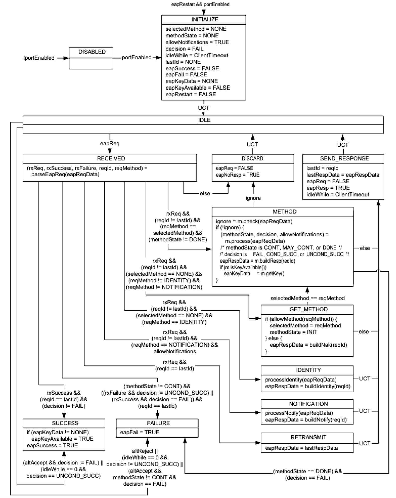
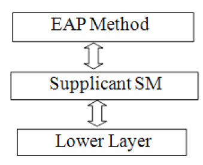
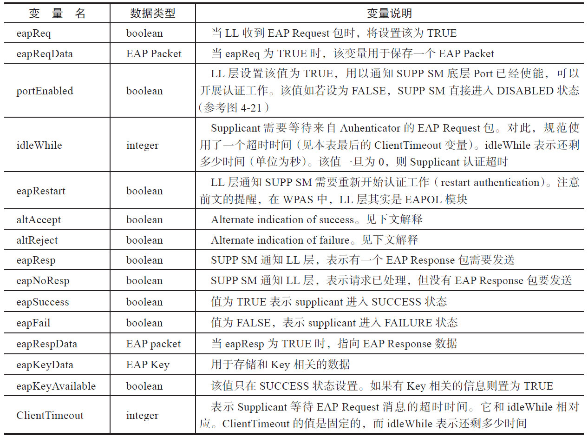
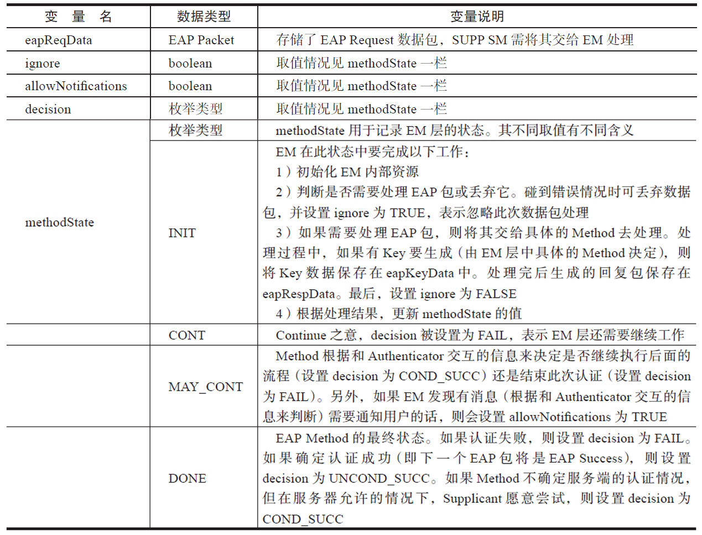
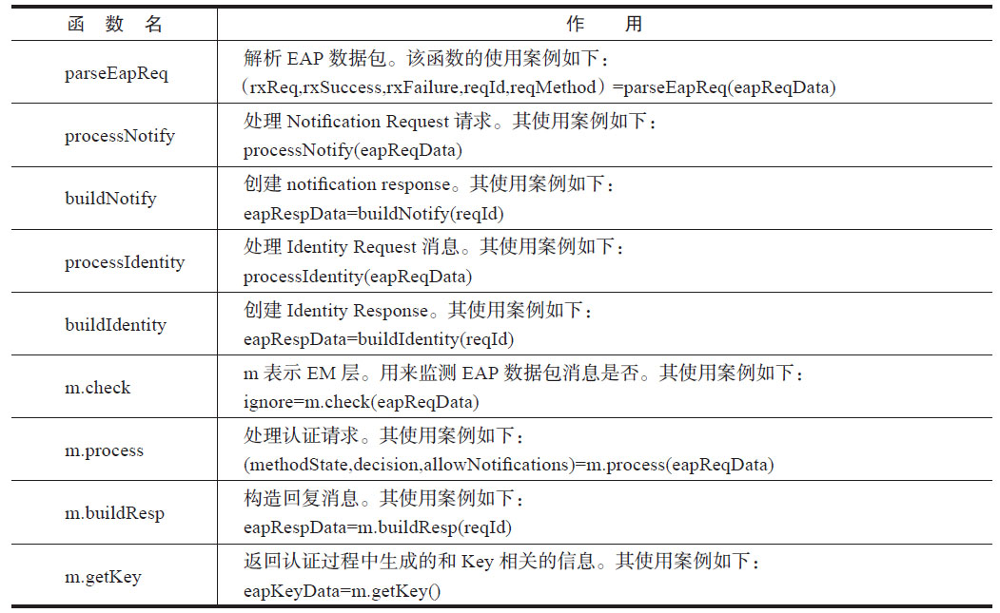
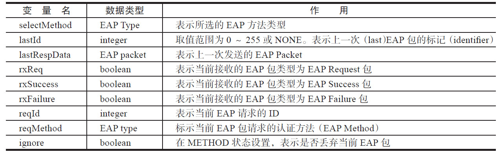
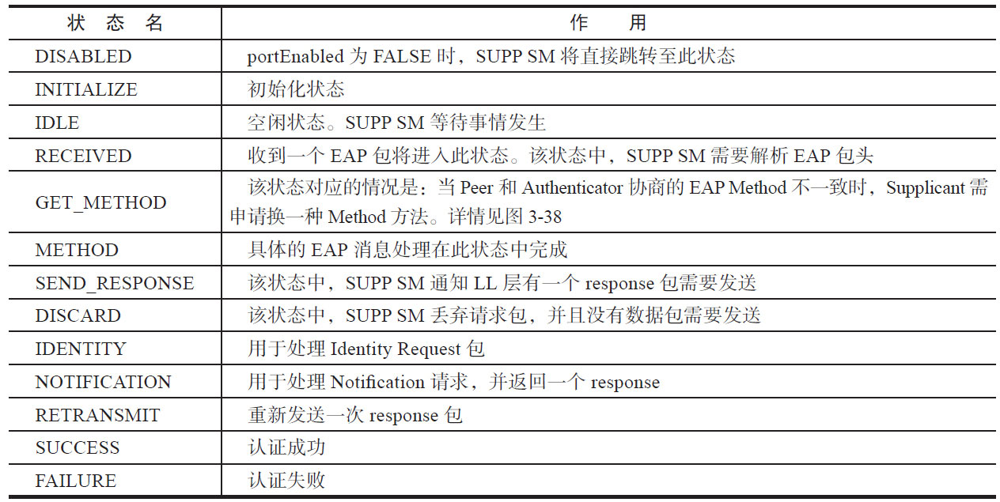
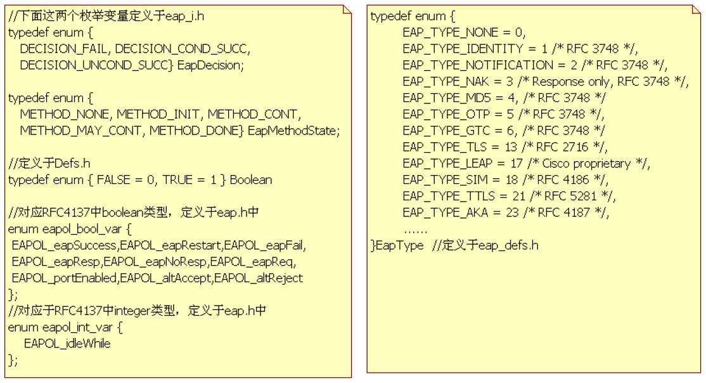
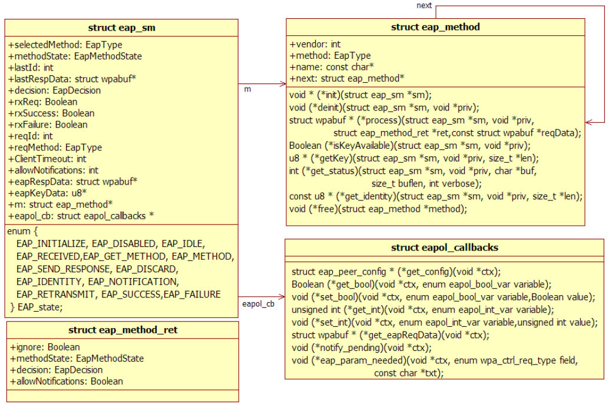

# 4.4.1 EAP模块分析[20]




存在，当SUPPSM在DISCARD状态中执行完其EA后，将直接转换到IDLE状态。

对一个状态机而言，其状态的转换是因为外界条件发生变化导致。在规范中，这些外界条件由变量来表达。图4-21中出现了很多变量和EA所包括的一些函数，它们都由RFC4137文档定义。了解它们的作用对真正理解SUPPSM有直接和重要帮助。接下来的章节就将介图4-21SUPPSM状态切换绍这些变量和函数。



图4-22RFC4137SUPPSM模块划分RFC4137将和SUPPSM相关的模块分为三层，如图4-22所示。图中最底层是LowerLayer（LL）​，这一层的作用是接收和发送EAP包。位于中间的SUPPSM层实现了Supplican状态机。最上层是EAPMethod（EM）层，它实现了具体的EAP方法。

SUPPSM将与EM层和LL层交互。一个最典型的交互例子就是LL收到EAP数据包后，将该数据包交给SUPPSM层去处理。如果该EAP包需要EM层处理（例如具体的验证算法需要EM完成）​，则SUPPSM层将该包交给EM。EM处理完的结果将由SUPPSM转交给LL去发送。

提示RFC4137中，三层之间交互的手段可以是设置变量，或者是调用函数。

先来看SUPPSM与LL交互时所使用的变量。

（1）LL层和SUPPSM层交互变量LL层和SUPPSM层的交互比较简单，主要包括三个步骤。

1）LL层收到EAP数据包后，将其保存在eapReqData变量中，然后设置eapReq变量为TRUE。这个变量的改变对SUPPSM层来说是一个触发信号（signal）​。SUPPSM可能会发生状态转换。

2）SUPPSM层从eapReqData中取出数据后进行处理。如果有需要回复的数据，则设置eapResp值为TRUE，否则设置eapNoResp值为TRUE。回复数据存储在eapRespData中。LL层将发送此回复包。

3）如果SUPPSM完成身份验证后，它将设置eapSuccess或eapFailure变量以告知LL层其验证结果。eapSuccess为TRUE，表明验证成功。eapFailure为TRUE，则验证失败。

上述描述中所涉及的变量及其类型如表4-1所示。注意，此处的数据类型属于伪代码。

提示在WPAS中，LL层并非那些直接利用socket进行数据收发的模块，而是EAPOL模块。EAP和EAPOL模块的关系将留待下一节再介绍。

表4-1LL层和SUPPSM层交互变量



表4-1中altAccept和altReject两个变量的命名非常晦涩难懂。RFC4137指出这两个变量的定义在RFC3748中。实际上，RFC3748从头至尾都没有出现过这两个变量。经过仔细研究，笔者发现hp://lists.frascone.com/pipermail/eap/msg02578.html对此有一个说法，内容如下。

这两个变量取名为lowerLayerSuccess和lowerLayerFailure更合适，它们用于通知LL层Success或Failure信息。结合上述资料，笔者查阅了RFC37487.12节，在802.11网络中，Indicatioin（通知）Success和Failure的可能场景如下。

❑当supplicant收到Disassociate帧或者Deauthenticate帧时，表示lowerLayerFailure。

❑当收到4-WayHandshake第一个Message时，表示lowerLayerSuccess。

规范阅读提示RFC4137中，上述变量还可分为两种类型。

1）由LL层暴露给SUPPSM层的变量（VariablesfromLowerLayertoPeer）​。它们从表4-1中的eapReq开始，到altReject结束。原则上，LL层和SUPPSM层都可以修改这些变量。

2）由SUPPSM层暴露给LL层的变量（VariablesfromPeertoLowerLayer）​。它们从表4-1中的eapResp开始，到eapKeyAvailable结束。原则上，LL层和SUPPSM层都可以修改这些变量。另外，这些变量也可由SUPPSM层暴露给EM层来使用。

接着来看SUPPSM层和EM层交互变量。

（2）SUPPSM层和EM层交互变量SUPPSM层和EM层的交互也是通过变量来完成的。这些变量如表4-2所示。

表4-2SUPPSM和EM层交互变量



注意，methodState和decision的值由具体的认证方法（即Method）来确定。



提示本书不讨论所有EAP方法的具体实现。感兴趣的读者可以深入研究EAP模块。

不过对EAPSUPPSM来说，methodState和decision的取值情况才是最重要的，因为注它意们，会表直4接-4影中响用S伪UP代P码S展M的示状了态这切些换函。数的使用案例，它们并不遵守C++语法。例如：

（3）SUPPSM其他变量和处理函数

```
（rxReq，rxSuccess，rxFailure，reqId，reqMethod）=parseEapReq（eapReqData）
```

RFC4137还为SUPPSM还定义了其他一些变量（PeerStateMachineLocalVariables）

及函数。变量定义见表4-3。

等号左边为parseEapReq函数的返回值，等号右边括号中的"eapReqData"为表4-3SUPPSM内部变量定义parseEapReq的输入参数。如果使用案例中



没有等号，则表示该函数无返回值（具体实现时，可设置该函数的返回值为void）​。

表4-4所示为SUPPSM处理函数的定义。

注意图4-21中还包含一些其他函数，奇怪的是规范表中4并-4没S有U列PP举S它M们函。数不定过义，相信读者很容易理解这些数作用，此处不详述。现在，读者能看懂图4-21所示的状态图了吗？

（4）SUPPSM定义的状态SUPPSM定义的13个状态如表4-5所示。

表4-5SUPPSM状态



前面展示了RFC4137中和SUPPSM相关的内容。笔者觉得这个状态机定义太过烦琐。不过，本着简单、明了并且没有歧义的原则，这种做法似乎又无可厚非。从笔者经验来看，读者只要能看懂图4-21所示SUPPSM状态切换图即算掌握了EAP模块的精髓了。WPAS中EAPSUPPSM该如何实现呢？请看下节。

2.EAPSUPPSM代码分析上文中曾提到过，RFC4137定义的状态机非常烦琐，而具体实现可以根据情况进行裁剪。

不过，WPAS中的EAPSUPPSM却较为严格得遵循了RFC4137。先来看其定义的数据类型和数据结构。

（1）相关数据结构与数据类型图4-23所示为EAPSUPPSM定义的枚举变量类型。



图4-23EAPSUPPSM枚举类型定义图4-23中，左图定义了EapDecision、EapMethodState、Boolean、eapol_bool_var和eapol_int_var枚举类型，它们都和上节介绍的变量及类型有关。右图定义了EapType枚举变量，代表不同的EAPMethod。

图4-24所示为WPAS中和SUPPSM相关的数据结构。



图4-24EAPSUPPSM相关数据结构定义图4-24中，eap_sm是RFC4137EAPSUPPSM的代表。从其成员变量的命名可知，它几乎完全是按照RFC4137来实现的。eap_sm定义了一个名为EAP_state的枚举类型成员变量。

eap_sm通过m成员变量指向一个eap_method链表。eap_method是一个由next指针链接起来的单向链表，每一个eap_method对象代表一种具体的EAPMethod（EAPMethod的注册请回顾4.3.2节“eap_register_methods函数分析”​）​。

eap_method最重要的是其处理函数，WPAS对其略有修改。例如，process函数实际上完成了表4-4中m.check、m.process和m.buildResp的功能。

eap_method中，process函数第三个参数的类型是eap_method_ret*，代表一个

```
static struct eapol_callbacks eapol_cb = {
  eapol_sm_get_config,eapol_sm_get_bool,eapol_sm_set_bool,eapol_sm_get_int,
  eapol_sm_set_int,eapol_sm_get_eapReqData,eapol_sm_set_config_blob,
  eapol_sm_get_config_blob,eapol_sm_notify_pending,eapol_sm_eap_param_needed,
  eapol_sm_notify_cert
};
```

eap_method_ret对象。由图4-24可知，它包括了ignore、methodState、decision以及aowNotifications变量。

eap_sm的eapol_cb对象指向一个eapol_cabacks对象，它是LL层的代表。不过，eapol_cabacks的定义看起来和RFC4137关系不大。

注意图4-24中eap_sm第一个成员变量上述函数相关代码我们留待碰到它们时再介EAP_State是一个枚举类型，其枚举值就是绍。

图4-21中SUPPSM的各个状态。

（2）WPAS状态机通用宏EAPSUPPSM初始化时，eap_sm的eapol_cabacks被设置为eapol_cb对象。代WPAS中有许多状态机，所以它定义了一些通码如下所示。

用宏来帮助实现状态机相关的代码。这些宏的定义如下所示。

[--＞eapol_supp_sm.c：​：eapol_cb定义]

```c
/*
  定义一个状态的EA，它是一个函数声明。
  而STATE_MACHINE_DATA也是一个宏。对于EAP SSM来说，其类型是struct eap_sm。
  global代表触发该状态的原因是否为UCT。
*/
#define SM_STATE(machine, state) \
   static void sm_ ## machine ## _ ## state ## _Enter(STATE_MACHINE_DATA *sm,int global)
// 每个状态进入后执行的一段代码。一般是打印一些信息，并设置新的状态
#define SM_ENTRY(machine, state) \
if (!global || sm-＞machine ## _state != machine ## _ ## state) { \
    sm-＞changed = TRUE; \  // changed变量用于记录状态机的状态是否发生变化
    wpa_printf(MSG_DEBUG, STATE_MACHINE_DEBUG_PREFIX ": " #machine \\n" entering state " #state); \
}\
sm-＞machine ## _state = machine ## _ ## state; // 设置状态机的状态
// SM_ENTER宏对应一次函数调用，调用的是SM_STATE宏定义的函数
#define SM_ENTER(machine, state) \
sm_ ## machine ## _ ## state ## _Enter(sm, 0)
// 对应一次函数调用，表示因UCT而直接进入某个状态
#define SM_ENTER_GLOBAL(machine, state) \
sm_ ## machine ## _ ## state ## _Enter(sm, 1) // 这个函数由SM_STATE宏声明
// 运行状态机。该宏定义一个函数
#define SM_STEP(machine) \
static void sm_ ## machine ## _Step(STATE_MACHINE_DATA *sm)
// 该宏对应一次函数调用，即sm_##machine_Step(sm)，sm参数由调用函数内声明
#define SM_STEP_RUN(machine) sm_ ## machine ## _Step(sm)
```

[--＞state_machine.h]下面通过SUPPSM的实现代码来认识下上述通用宏的用法。

（3）EAPSUPPSM的实现

```c
/*
  该宏对应的代码是
  static void sm_EAP_DISABLED_Enter(STATE_MACHINE_DATA *sm,int global)
*/
SM_STATE(EAP, DISABLED)
{
    SM_ENTRY(EAP, DISABLED);            // 每个状态的EA都会执行SM_ENTRY代码段
    /*
    SM_ENTRY宏对应的代码是：
    if (!global || sm-＞EAP_state != EAP_DISABLED) {
        sm-＞changed = TRUE;
         wpa_printf(MSG_DEBUG, STATE_MACHINE_DEBUG_PREFIX ": " "EAP" \\n" entering state " "DISABLED");       // 这段日志对了解SUPP SM当前处于哪个状态非常重要
    }
    // EAP_state是eap_sm中成员变量。读者可参考图4-24
     sm-＞EAP_state = EAP_DISABLED;
    */
    sm-＞num_rounds = 0;
}
```

SUPPSM的状态比较多，此处仅列举DISABLED状态的实现代码以帮助读者理解通用宏的作用。对状态机来说，其状态对应的EA非常重要。如下代码所示为DISABLED状态对应的EA。根据上节对通用宏的介绍，EA由SM_STATE宏来定义。

[--＞eap.c：​：SM_STATE（EAP，DISABLED）​]SM_STATE只是定义了状态机某个状态的EA，那么状态机是如何运作的呢？根据图4-21以及前文所述，状态机的状态切换主要是通过判断条件是否满足来完成。SM_STEP定义的函数就是用于检查状态机的这些条件变量，然后根据情况进行状态转换的。SUPPSM的SM_STEP宏对应的代码如下所示。

```c
/*
  SM_STEP宏对应的函数定义为：
  static void sm_EAP_Step(STATE_MACHINE_DATA *sm)
*/
SM_STEP(EAP)
{
    /*
    对应UCT的处理。eapol_get_bool函数将调用eapol_callbacks对象中的eapol_sm_get_
    bool函数其内部返回eap_sm中eapRestart成员变量的值。
    */
    if (eapol_get_bool(sm, EAPOL_eapRestart) &&
        eapol_get_bool(sm, EAPOL_portEnabled))
    /*
    调用由SM_STATE(EAP,INITIALZE)定义的函数，以进入EAP_INITIALIZE状态。
    GLOBAL的意思是UCT。请读者注意此处的判断条件：如果eap_sm的eapRestart和
    portEnabled成员变量都为true，则直接进入INITIALIZE状态。它完全和图4-21
    SUPP SM状态图一样。
    */
    SM_ENTER_GLOBAL(EAP, INITIALIZE);
    else if (!eapol_get_bool(sm, EAPOL_portEnabled) || sm-＞force_disabled)
        SM_ENTER_GLOBAL(EAP, DISABLED);
    else if (sm-＞num_rounds ＞ EAP_MAX_AUTH_ROUNDS) {
        if (sm-＞num_rounds == EAP_MAX_AUTH_ROUNDS + 1) {
            ......// 有一些EAP方法在认证错误时会有很多消息往来，WPAS对此做了一个限制
            // 一旦这些错误消息往来超过50次（由EAP_MAX_AUTH_ROUDS），则直接进入FAILURE状态
            sm-＞num_rounds++;
            SM_ENTER_GLOBAL(EAP, FAILURE);      // GLOBAL代表UCT的情况
        }
    }else   eap_peer_sm_step_local(sm);        // 对应其他非UCT的情况
}
```

[--＞eap.c：​：SM_STEP（EAP）​]

```c
static void eap_peer_sm_step_local(struct eap_sm *sm)
{
    switch (sm-＞EAP_state) {
     ......
    case EAP_IDLE:
        // 图4-21中,idle状态可依据条件不同而跳转到其他多个状态
        // 下面这个函数用于选择目标状态及跳转到它
          eap_peer_sm_step_idle(sm);// 根据图4-21的idle状态跳转，读者能想象出该函数的代码实现吗
          break;
    case EAP_RECEIVED:
        eap_peer_sm_step_received(sm);
        break;
    case EAP_GET_METHOD:
        if (sm-＞selectedMethod == sm-＞reqMethod)
            SM_ENTER(EAP, METHOD);              // 直接进入METHOD状态
        else
            SM_ENTER(EAP, SEND_RESPONSE);       // 直接进入SEND_RESPONSE状态
        break;
    ......
}
```

此处简单看一下eap_peer_sm_step_local的代码。

[--＞eap.c：​：eap_peer_sm_step_local]eap_peer_sm_step_local用于处理那些非UCT导致的状态切换。

提示EAPSUPPSM的代码虽不复杂，但由于SUPPSM状态和触发条件（即定义的那些变量）太多，想通过看代码去跟踪SUPPSM间的状态跳转是一件非常困难的事情。

相比而言，图4-21比代码要直观，更加容易把注意力集中在目标状态以及它对应的EA上。另外，SM_STATE代码段中包含的那段wpa_printf输出将告知EAP模块当前的状态。读者以后在分析WPAS日志时千万要注意。

3.EAPSUPPSM总结EAPSUPPSM基于RFC4137而实现，其内部变量的定义以及状态切换逻辑都来源于规范。

以笔者的经验来看，掌握RFC4137是理解WPAS中EAPSUPPSM实现的基石。另外，对具体的处理逻辑而言，SUPPSM最重要的内容还是各个状态对应的EA。正如前文所述，图4-21对SUPPSM的运行极为重要，希望读者认真学习。

另外，对WPAS中状态机的实现来说，SM_STATE用于定义某个状态的EA（即一个函数）​。每个EA都会执行SM_ENTRY宏定义的一段代码。SM_ENTER和SM_ENTER_GLOBAL宏用于调用SM_STATE定义的函数。GLOBAL代表UCT的情况。

SM_STEP宏用于运行整个状态机。请读者注意它和SM_ENTER的区别。SM_ENTER宏将直接调用某个指定状态（由SM_ENTER宏的参数决定）的EA，而SM_STEP则将根据SM中的变量情况来决定下一个要跳转的状态，然后调用它的SM_ENTER。

下面来看EAPOL模块的实现。
