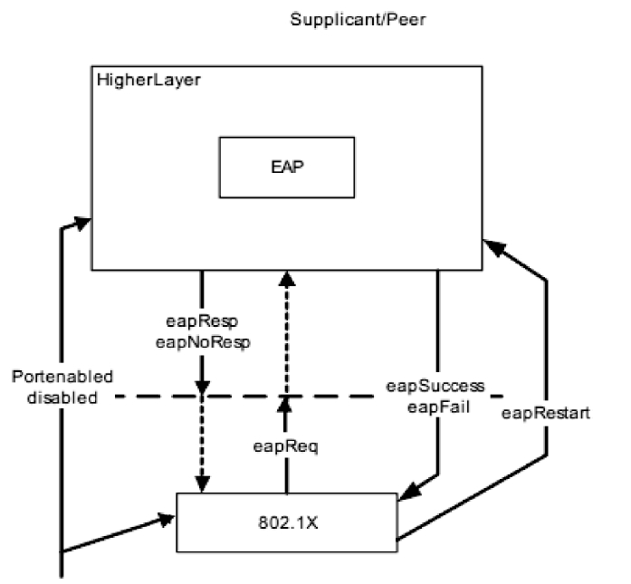
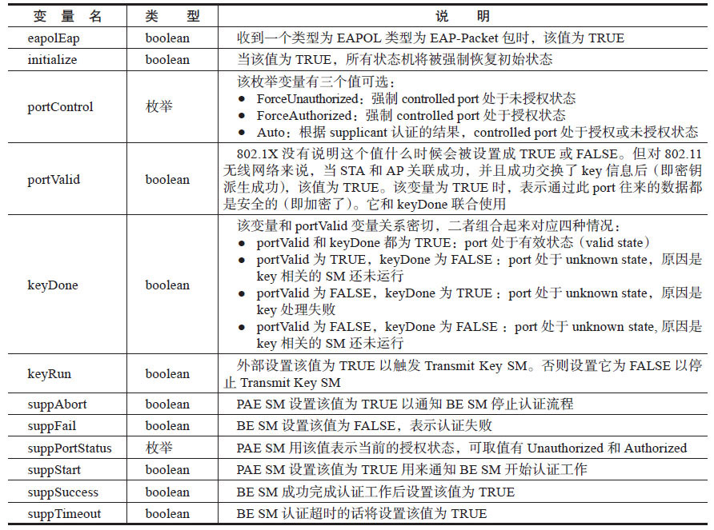
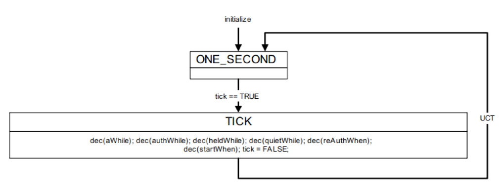
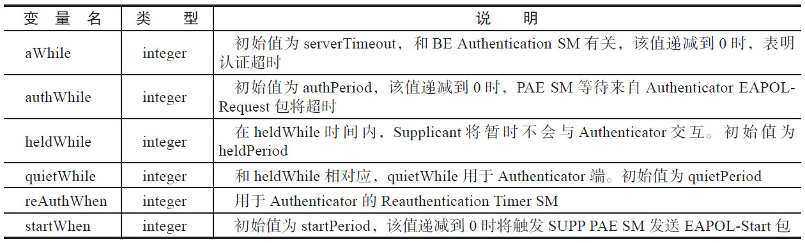
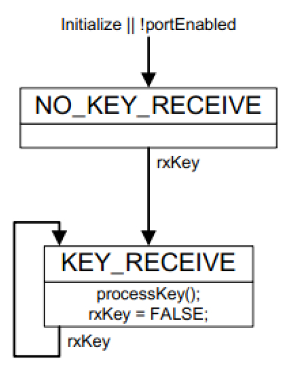
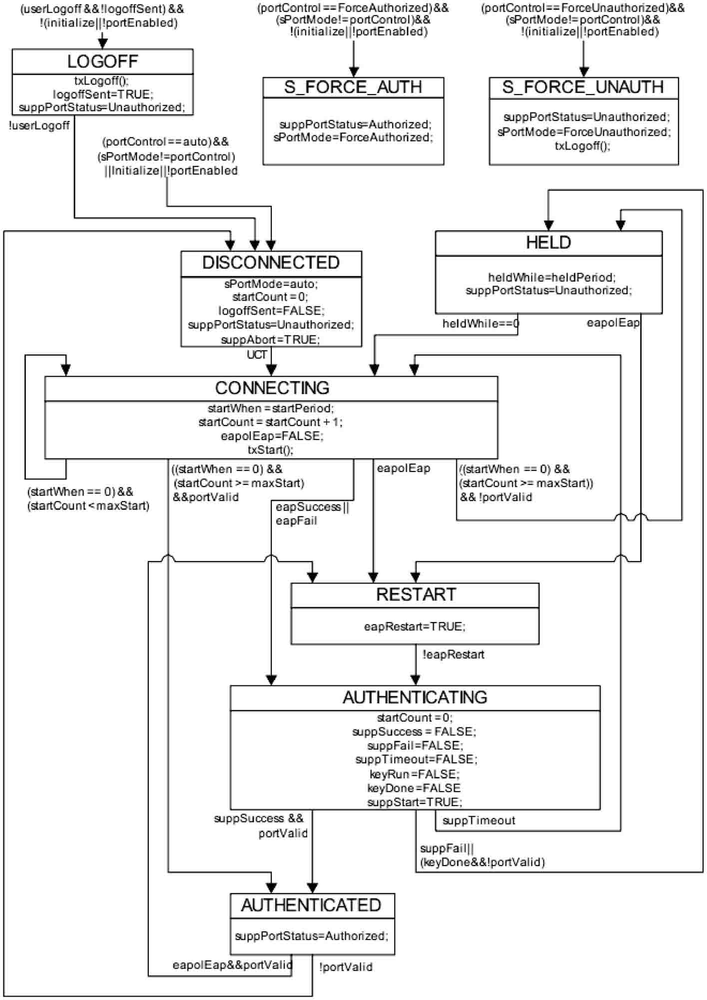
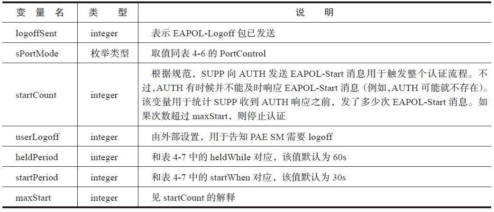
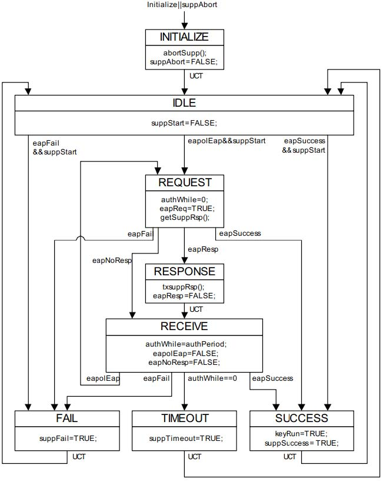
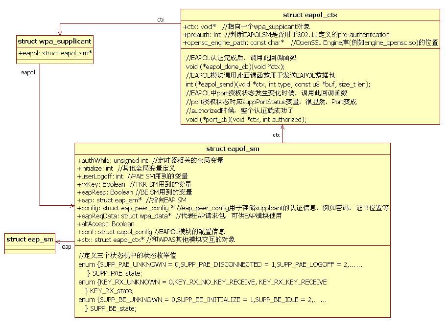

# 4.4.2 EAPOL模块分析[21]




[21]4.4.2EAPOL模块分析同EAP模块类似，EAPOL模块的实现参考了另外一个规范，即IEEE802.1X。

注意参考IEEE802.1X2004版规范的主要图4-25EAP和EAPOL的关系原因是，WPAS中EAPOL模块也基于该版本的规范。另外，笔者比较了2004版和2010根据上一节对EAPSUPPSM的介绍，读者会版的802.1X，发现2004版的内容组织相对发现图4-25中所示的eapResp、eapSuccess清晰易读。

等变量就是RFC4137中定义的用于LL层和EAPSUPPSM层交互的变量。很明显，在介绍802.1X前，先来看其描述的EAP和802.1X模块（在WPAS中，它就是EAPOL模EAPOL之间的关系，如图4-25所示。

块）是EAPSUPP的LL层（参考图4-22）​。

另外一个可能会让读者感到惊奇的是，802.1X规范为EAPOLSupplicant定义了5个不同的状态机，分别如下。

❑PortTimersSM：Port超时控制状态机。

Port的概念请参考3.3.7节802.1X介绍。

❑SupplicantPAESM：PAE是PortAccessEntitiy的缩写。该状态机用于维护Port的状态。

❑SupplicantBackendSM：规范并没有明示该状态机的作用。但笔者觉得它主要用于给Authenticator发送EAPOL回复消息。

❑TheKeyReceiverSM：用于处理Key（指EAPOL-Key帧）相关流程的状态机。

❑TheSupplicantKeyTransmitSM：该状态机非必选项，所以WPAS未实现它。

说实话，EAPOLSupplicant定义5个状态机确实有些复杂。主要原因是这5个状态机相互之间都有关联，这些关联体现在它们可能都受同一个变量的影响，从而导致各自的状态发生变化。例如PortTimersSM修改了一些变量后，就有可能使得其他状态机的状态发生变化。规范中把这些变量成为全局变量（GlobalVaraibles）​。

规范阅读提示1）除了SUPP包含的这五个状态机外，规范还为Authenticator定义了四个状态机。

Authenticator也需要实现PortTimersSM和TheKeyReceiverSM。

2）规范中将这些状态机统称为PACP（PortAccessControlProtocol）StateMachine。

下面，先来认识这些全局变量。

1.EAPOLSUPP全局变量802.1X定义了一些全局变量，它们被多个状态机使用。这些全局变量的定义如表4-6所示。

表4-6SUPP全局变量定义



注意，表4-6省略了部分和Authenticator相关的全局变量。另外，规范还定义了一些全局超时变量，它们将在PortTimersSM中介绍。

2.SUPPPACP状态机（1）PortTimersSMPortTimersSM（PTSM）对应的状态切换如图4-26所示。

PTSM的功能比较简单，就是每一秒触发一次以从ONE_SECOND状态进入TICK状态。

TICK状态的EA中，它将递减（图4-26中的dec函数）某些变量的值。



图4-26PTSM状态切换注意，PTSM在SUPP和AUTH两端都有。所以，图4-26中的一些变量只用于AUTH端。这些变量的含义如表4-7所示。

表4-7PTSM变量



```java
static void eapol_port_timers_tick(void *eloop_ctx, void *timeout_ctx)
{
    struct eapol_sm *sm = timeout_ctx;
    if (sm-＞authWhile ＞ 0) {// 处理authWhile
        sm-＞authWhile--;
        if (sm-＞authWhile == 0)
            wpa_printf(MSG_DEBUG, "EAPOL: authWhile --＞ 0");
    }
    // 处理heldWhile，startWhen,idleWhile（idleWhile见表4-1）
    ......
    if (sm-＞authWhile | sm-＞heldWhile | sm-＞startWhen | sm-＞idleWhile) {
        // 重新注册超时处理函数，相当于切换到图4-26中的ONE_SECOND状态
        eloop_register_timeout(1, 0, eapol_port_timers_tick, eloop_ctx, sm);
    } else {
        sm-＞timer_tick_enabled = 0;
    }
    eapol_sm_step(sm);// 处理其他状态机的状态切换，此函数内容下文会介绍
}
```

虽然规范定义了PTSM，但WPAS中，PTSM的功能并不是通过状态机宏来实现的，而仅仅是向eloop模块注册了一个超时时间为1秒的函数eapol_port_timers_tick，其代码如下所示。

[--＞eapol_supp_sm.c：​：

eapol_port_timers_tick]上述代码中，eapol_port_timers_tick除了递减相关变量外，最后还需要调用eapol_sm_step函数以判断其他状态机是否需



要切换状态。这是PTSM和其他状态机联动的关键纽带，而这个纽带在规范中并不能直接体现出来（规范中，PTSM只是修改某些变量，至于其他状态机到底怎么被触发，则没有说明。而eapol_port_timers_tick函数修改完变量后，直接调用eapol_sm_step函数完成了对其他状态机的检查）​。

下面来看第二个状态机TheKeyReceiver图4-27TKRSM状态切换SM。

❑TKRSM包含两个状态。第一个是（2）TheKeyReceiverSMNO_KEY_RECEIVE状态。当rxKey（boolean图4-27所示为TheKeyReceiverSM（以后型变量，当Supplicant收到EAPOLKey帧简称TKRSM）状态切换图。主要有两点值得后，该值为TRUE）变为TRUE时，TKR进入关注。

KEY_RECEIVE状态。

❑TKR在KEY_RECEIVE状态时需要调用processKey函数处理EAPOLKey消息。

```
SM_STATE(KEY_RX, NO_KEY_RECEIVE)
{
    SM_ENTRY(KEY_RX, NO_KEY_RECEIVE);
}
SM_STATE(KEY_RX, KEY_RECEIVE)
{
    SM_ENTRY(KEY_RX, KEY_RECEIVE);
    eapol_sm_processKey(sm);                    // 对应图4-27所示的processKey函数
    sm-＞rxKey = FALSE;
}
SM_STEP(KEY_RX)  // TKR状态机状态切换函数
{
    if (sm-＞initialize || !sm-＞portEnabled)
        SM_ENTER_GLOBAL(KEY_RX, NO_KEY_RECEIVE);        // 直接进入NO_KEY_RECEIVE状态
    switch (sm-＞KEY_RX_state) {
    case KEY_RX_UNKNOWN:
        break;
    case KEY_RX_NO_KEY_RECEIVE:
        if (sm-＞rxKey)
            SM_ENTER(KEY_RX, KEY_RECEIVE);
        break;
    case KEY_RX_KEY_RECEIVE:
        if (sm-＞rxKey)
            SM_ENTER(KEY_RX, KEY_RECEIVE);
        break;
    }
}
```

WPAS中，TKR的代码也非常简单，如下所示。

[--＞eapol_supp_sm.c：​：TRKSM相关函数]TKRSM的代码非常简单，此处不详述。下面来看PAESM。

（3）PAESMPAESM比较复杂，其状态切换如图4-28所示。



图4-28PAESM状态切换图4-28中涉及的变量定义见表4-8。

表4-8PAESM变量定义



图4-28还包括两个函数。

❑txStart：用于发送EAPOL-Start消息给Authenticator。

❑txLogo：用于发送EAPOL-Logo消息给Authenticator。

提示PAESM中的状态虽然较多，但笔者觉得它们的划分似乎并无泾渭分明的根据。另外，规范对它们的描述也仅是说明满足什么条件将进入什么状态。至于为什么划分这么多状态也没有太多可参考的依据。所以，读者也不必拘泥于求根究底了，只要把握图4-28即可。

WPAS中，PAESM相关的代码也比较简单，此处仅看LOGOFF状态的EA，如下所示。

[--＞eapol_supp_sm.c：​：SM_STATE（SUPP_PAE，LOGOFF）​]

```c
SM_STATE(SUPP_PAE, LOGOFF)         // 状态机名为SUPP_PAE，状态名为LOGOFF
{
    SM_ENTRY(SUPP_PAE, LOGOFF);
    eapol_sm_txLogoff(sm);              // 对应图4-28中的txLogoff函数
    sm-＞logoffSent = TRUE;
    sm-＞suppPortStatus = Unauthorized;
    // 这个函数内部将通过Nl80211 API设置WLAN Driver的状态
    // 属于EAPOL模块和WPAS中其他模块的交互处理
    eapol_sm_set_port_unauthorized(sm);
}
```

（4）BackendSMBackendSM（BESM）的状态转换如图4-29所示。

需要介绍和BESM相关的变量authPeriod，它和authWhile（见表4-7）有关，默认值为30秒。



图4-29BESM状态切换BESM包含如下几个重要函数。

❑abortSupp：停止认证工作，释放相关的资

```
SM_STATE(SUPP_BE, REQUEST) // REQUEST状态对应的EA
{
    SM_ENTRY(SUPP_BE, REQUEST);
    sm-＞authWhile = 0;
    sm-＞eapReq = TRUE;
    eapol_sm_getSuppRsp(sm);    // 此函数内部并无任何有实质意义的内容，读者不妨自行阅读它
}
```

源。

❑getSuppResp：这个函数本意是用来获取EAPResponse信息的，然后用txSuppResp函数发送出去。但WPAS中，该函数没有包括提示前面几节介绍了802.1X中SUPPPACP任何有实质意义的内容。

几个状态机相关的知识。相比EAPSUPPSM而言，虽然PACP状态机的个数增加了不❑txSuppResp：发送EAPOL-Packet包给少，但每个状态机包含的状态却少了许多，Authenticator。

所以PACP状态机反而容易理解。

BESM的部分代码如下所示。

有了理论知识后，马上来看EAPOLSUPP模块[--＞eapol_supp_sm.c：​：SM_STATE中的几个重要数据结构和函数。

（SUPP_BE，REQUEST）​]3.EAPOLSUPP代码分析图4-23和图4-24介绍了EAPOL和EAP模块的关系，那么EAPOL和WPAS其他模块是什么关系呢？相关数据结构如图4-30所示。



图4-30WPAS中EAPOL/EAP模块数据结构由图4-30可知，WPAS定义了一个数据结构eapol_sm来存储和PACP状态机相关的内容。

其内部定义了三个状态机（TKRSM、PAESM和BESM）各自的状态信息（由三个状态枚举值表达）​、相关变量等。EAPOL模块和WPAS中重要模块wpa_supplicant的交互接口是通过结构体eapol_ctx来定义的。EAPOL模块通过eap变量指向EAP模块的代表eap_sm结构体。

提示eapol_sm和eapol_ctx实际包含的成

```
int wpa_supplicant_init_eapol(struct wpa_supplicant *wpa_s)
{
#ifdef IEEE8021X_EAPOL
    struct eapol_ctx *ctx;
    ctx = os_zalloc(sizeof(*ctx));
    ......
    ctx-＞ctx = wpa_s;
    ctx-＞msg_ctx = wpa_s;
    ctx-＞eapol_send_ctx = wpa_s;
    ctx-＞preauth = 0;
    ctx-＞eapol_done_cb = wpa_supplicant_notify_eapol_done;
    ctx-＞eapol_send = wpa_supplicant_eapol_send;
    ......// 其他eapol_ctx成员变量的初始化
    ctx-＞wps = wpa_s-＞wps;
    ctx-＞eap_param_needed = wpa_supplicant_eap_param_needed;
    ctx-＞port_cb = wpa_supplicant_port_cb;
    ctx-＞cb = wpa_supplicant_eapol_cb;
    ctx-＞cert_cb = wpa_supplicant_cert_cb;
    ctx-＞cb_ctx = wpa_s;
    wpa_s-＞eapol = eapol_sm_init(ctx);          // 初始化EAPOL模块
    ......
#endif /* IEEE8021X_EAPOL */
    return 0;
}
```

员变量非常多，此处仅列举其中一部分。

虽然WPAS包括EAPOL和EAP两个模块，但WPAS其他模块一般只和EAPOL模块交互。至于EAP模块，它的操作（例如EAP的初始化以及EAPSUPPSM的运作）则由EAPOL模块来触发。

（1）EAPOL模块的初始化先来看EAPOL和EAP模块的初始化函数，由wpa_supplicant_init_eapol函数完成，代码如下所示。

[--＞wpas_glue.c：​：

wpa_supplicant_init_eapol]

```c
struct eapol_sm *eapol_sm_init(struct eapol_ctx *ctx)
{
    struct eapol_sm *sm;
    struct eap_config conf;
    sm = os_zalloc(sizeof(*sm));                        // EAPOL对应的状态机信息
    ......
    sm-＞ctx = ctx;// eapol_ctx是WPAS中EAPOL模块和其他模块交互的接口
    sm-＞portControl = Auto;
    sm-＞heldPeriod = 60;
    sm-＞startPeriod = 30;
    sm-＞maxStart = 3;
    sm-＞authPeriod = 30;
    os_memset(&conf, 0, sizeof(conf));
    conf.opensc_engine_path = ctx-＞opensc_engine_path;
    ......
    conf.wps = ctx-＞wps;
    // 初始化EAP Supplicant SM相关资源
    sm-＞eap = eap_peer_sm_init(sm, &eapol_cb, sm-＞ctx-＞msg_ctx, &conf);
    ......
    // 先设置initialize变量为TRUE，然后初始化相关状态
    sm-＞initialize = TRUE;
    eapol_sm_step(sm);
    sm-＞initialize = FALSE; // 设置为FALSE，再初始化相关状态
    eapol_sm_step(sm);
    sm-＞timer_tick_enabled = 1;
    eloop_register_timeout(1, 0, eapol_port_timers_tick, NULL, sm);
    return sm;
}
```

wpa_supplicant_init_eapol首先设置eapol_ctx对象，然后调用eapol_sm_init来完成EAPOL模块的初始化。eapol_sm_init的代码如下所示。

[--＞eapol_supp_sm.c：​：eapol_sm_init]在eapol_sm_init代码中：

1）先通过调用eap_peer_sm_init初始化EAPSUPPSM相关资源。

2）然后完成EAPOLPACP三个状态机的初始化工作。初始化的方法很简单，即先设置initialize为TRUE，然后执行eapol_sm_step函数（该函数代码见下文，其主要目的是根据条件以跳转到下一个状态。initialize为TRUE时，将触发一些状态的EA被调用，从而某些变量的初值将被设定）​。然后设置initialize为FALSE后，再度执行eapol_sm_step函数（这样，对应状态的EA也将被执行，从而剩余变量的初值将被设定）​。

3）最后通过注册一个eloop超时任务实现了PTSM。

（2）状态机的联动根据前面的介绍，EAPOL和EAP一共有四个

```c
void eapol_sm_step(struct eapol_sm *sm)
{
    int i;
    /*
      笔者一直很好奇EAPOL和EAP中的四个状态机是怎么联动的。通过下面的代码可知，
      根据EAPOL和EAP的关系，首先要运行EAPOL中的三个状态机（Port Timers SM由eloop定时任务
      来实现），分别是SUPP_PAE、KEY_RX和SUPP_BE。然后执行EAP SUPP SM。如果changed变量
      为TRUE，表示状态发生了切换。由于每个状态对应的EA又有可能改变其中一些变量从而引起其他状
      态机状态发生变化，所以，这里有一个for语句来循环处理状态切换，直到四个状态机都没有状态切
      换为止。一般情况下，for循环应该是一个无限循环，但此次通过100来控制循环次数，是为了防止
      某些情况下状态机陷入死循环而不能退出（这也说明规范中定义的SM在联动时可能有逻辑错误）。
    */
    for (i = 0; i ＜ 100; i++) {
        sm-＞changed = FALSE;
        SM_STEP_RUN(SUPP_PAE);
        SM_STEP_RUN(KEY_RX);
        SM_STEP_RUN(SUPP_BE);
        if (eap_peer_sm_step(sm-＞eap))  // eap_peer_sm_step返回非零，表示状态有变化
            sm-＞changed = TRUE;
        if (!sm-＞changed) break;                // 如果没有状态变化，则跳出循环
    }
    /*
      运行超过100次，需要重新启动EAPOL模块状态机运行，eapol_sm_step_timeout将重新调用
      eapol_sm_step函数。
    */
    if (sm-＞changed) {
        eloop_cancel_timeout(eapol_sm_step_timeout, NULL, sm);
        eloop_register_timeout(0, 0, eapol_sm_step_timeout, NULL, sm);
    }
    /*
      cb_status是一个枚举类型的变量，可取值有EAPOL_CB_IN_PROGRESS, EAPOL_CB_SUCCESS和
      EAPOL_CB_FAILURE。
    */
    if (sm-＞ctx-＞cb && sm-＞cb_status != EAPOL_CB_IN_PROGRESS) {
        int success = sm-＞cb_status == EAPOL_CB_SUCCESS ? 1 : 0;
        /*
        该值在PAE AUTHENTICATED状态中被置为EAPOL_CB_SUCCESS，表示认证成功。在PAE
        HELD状态被置为EAPOL_CB_FAILURE，表示认证还未成功。
        */
        sm-＞cb_status = EAPOL_CB_IN_PROGRESS;
        // 回调通知WPAS，真实的函数是wpa_supplicant_eapol_cb，这个函数以后介绍
        sm-＞ctx-＞cb(sm, success, sm-＞ctx-＞cb_ctx);
    }
}
```

状态机，它们到底是怎么联动的呢？答案就在eapol_sm_step中。eapol_sm_step的代码如下所示。

[--＞eapol_supp_sm.c：​：eapol_sm_step]WPAS中状态机联动代码的实现非常巧妙，它通过循环来处理各个状态机的状态变换，直到四个状态机都稳定为止。

注意初始化结束后，各个状态机的状态为：SUPP_PAE为DISCONNECTED状态、KEY_RX为NO_KEY_RECEIVE状态、SUPP_BE为IDLE状态、EAP_SM为DISABLED状态。

至此，对FRC4137和IEEE802.1X-2004协议中EAPSupplicant和EAPOLSupplicant涉及的状态机进行了详细介绍。

在具体实现中，WPAS实现的EAPOL和EAP状态机较为严格得遵循了这两个文档。所以，读者只要理解了协议中的状态切换和相关变量，则能轻松理解WPAS的实现。反之，如果仅单纯从代码入手，EAPOL/EAP状态机的代码将会非常难以理解。

关于EAPOL/EAP状态机相关的知识就介绍到这，以后碰到具体代码时，读者根据状态切换图直接进入某个状态中去看其处理函数（即EA）​。

提示本章第二条分析路线使用的目标AP采用WPA2-PSK作为认证算法，故后续章节不会涉及太多和EAPOL及EAP相关的代码分析。感兴趣的读者可在本节基础上，自行搭建RAIDUS服务器来研究WPAS中EAPOL/EAP的工作过程。

```c
adb root # 获取手机root用户权限。只有root被破解的手机才能成功
adb shell # 登录手机shell
#笔者事先已编译wpa_cli并将其放到/system/bin目录中。这个命令用于启动wpa_cli，-i参数指明unix域控制
#socket文件名，它应该和wpa_supplicant启动时设置的控制接口文件名一致
wpa_cli -iwlan0 # 该命令执行后，将进入wpa_cli进程，后续操作都在此进程中开展
# 发送ADD_NETWORK命令给wpa_supplicant，它将返回一个新网络配置项的编号
# 请参考4.3.3节wpas_ssid结构体介绍
ADD_NETWORK # 假设wpa_supplicant返回的新网络配置项编号为0
SET_NETWORK 0 ssid "Test" # 设置0号网络的ssid为"Test"
SET_NETWORK 0 key_mgmt WPA-PSK # 设置0号网络的key_mgmt为"WPA-PSK"
SET_NETWORK 0 psk "12345Test" #设置0号网络的psk为"12345Test"
ENABLE_NETWORK 0 #使能0号网络，它将触发wpa_supplicant扫描、关联等一系列操作直到加入无线网络"Test"
CTRL+C # 退出wpa_cli
dhcpcd wlan0 # 启动dhcpd，wlan0为无线接口设备名。dhcpcd可为手机从AP那获取一个IP地址
```

4.5wpa_supplicant连接无线网络分析本节将介绍第二条分析路线，即通过命令行发送命令的方式触发wpa_supplicant进行相关工作，使手机加入一个利用WPA-PSK进行认证的无线网络。以笔者的Note2为例，整个过程用到的命令如下所示。

[命令示例]
