# 4.5.3 ENABLE_NETWORK命令处理


```java
static int wpa_supplicant_ctrl_iface_enable_network(struct wpa_supplicant *wpa_s,
                                                char *cmd)
{
    int id;
    struct wpa_ssid *ssid;
    if (os_strcmp(cmd, "all") == 0) {                   // 使能所有无线网络
      ssid = NULL;
    } else {
        id = atoi(cmd);  // 本例中的id为0
        ssid = wpa_config_get_network(wpa_s-＞conf, id); // 找到id为0的无线网络配置对象
        ......
        // 在前面ADD_NETWORK中，disabled为1，表示还没有使能它。disable为2的情况和P2P有关
        if (ssid-＞disabled == 2) {......}
    }
    wpa_supplicant_enable_network(wpa_s, ssid);
    return 0;
}
```

4.5.3ENABLE_NETWORK命令处理ENABLE_NETWORK命令由wpa_supplicant_ctrl_iface_enable_network进行处理，其代码如下所示。

[--＞ctrl_iface.c：​：

wpa_supplicant_ctrl_iface_enable_network]来看wpa_supplicant_enable_network，其代码如下所示。

[--＞wpa_supplicant.c：​：

wpa_supplicant_enable_network]

```c
void wpa_supplicant_enable_network(struct wpa_supplicant *wpa_s, struct wpa_ssid *ssid)
{
    struct wpa_ssid *other_ssid;
    int was_disabled;
    if (ssid == NULL) {
       ......// 处理ENABLE_NETWORK all的情况
    } else if (ssid-＞disabled && ssid-＞disabled != 2) {
        if (wpa_s-＞current_ssid == NULL) {// WPAS当前没有活跃的无线网络，所以current_ssid为空
            wpa_s-＞reassociate = 1; // 注意这个变量的值
        // ADD_NETWORK只是添加了一个无线网络配置项
        // 接下来要发起扫描工作以和对应的无线网络进行交互
        // 下面这个函数将发起scan操作。后面两个0代表时间。详情见下节分析
            wpa_supplicant_req_scan(wpa_s, 0, 0);
        }
        was_disabled = ssid-＞disabled;
        ssid-＞disabled = 0; // 设置disabled为0
        if (was_disabled != ssid-＞disabled)
            wpas_notify_network_enabled_changed(wpa_s, ssid);
    }
}
```

正如代码中注释所说，ADD_NETWORK不过是为WPAS添加了一个无线网络配置项罢了。

该无线网络是否存在？通过SET_NETWORK配置的信息是否正确？这些问题的解答首先从无线网络扫描开始。

1.无线网络扫描流程分析ENABLE_NETWORK将发起无线网络扫描请求，这是由wpa_supplicant_req_scan完成的，其代码如下所示。

[--＞scan.c：​：wpa_supplicant_req_scan]

```c
void wpa_supplicant_req_scan(struct wpa_supplicant *wpa_s, int sec, int usec)
{
#ifndef ANDROID                                 // Android平台上，该宏被定义
 ......// 不讨论非Android平台上的代码
#endif
    eloop_cancel_timeout(wpa_supplicant_scan, wpa_s, NULL);
    // 在本例中，sec和usec都是0，所以wpa_supplicant_scan将很快得到执行。该函数是扫描的核心代码
    eloop_register_timeout(sec, usec, wpa_supplicant_scan, wpa_s, NULL);
}
```

wpa_supplicant_scan是无线网络扫描的核心函数，其代码比较复杂，我们分段来看。

（1）wpa_supplicant_scan分析之一这一段代码主要和scan请求的参数准备有

```java
static void wpa_supplicant_scan(void *eloop_ctx, void *timeout_ctx)
{
    struct wpa_supplicant *wpa_s = eloop_ctx;
    struct wpa_ssid *ssid;  int scan_req = 0, ret;
    struct wpabuf *extra_ie;                    // 用于存储Information Element信息
    struct wpa_driver_scan_params params;       // 发给驱动的scan请求命令
    // 用于记录一个scan请求能包含多少个ssid。请参考4.3.4节关于capability的介绍
    size_t max_ssids;
    enum wpa_states prev_state;
    // wpa_state取值为WPA_INACTIVE，由4.3.4节wpa_supplicant_driver_init函数中的代码设置
    if (wpa_s-＞wpa_state == WPA_INTERFACE_DISABLED) { return;}
    // disconnected为0，scan_req为1，都是wpa_supplicant构造时的默认值
    if (wpa_s-＞disconnected && !wpa_s-＞scan_req) { ......}
    /*
      搜索wpa_config中所有的无线网络配置项，看其中是否有使能的无线网络。本例中，在扫描之前，
      已经将目标wpa_ssid的disabled变量置为0，这样，下面这个函数调用将返回非0值，使得整
      个if判断为假。
    */
    if (!wpa_supplicant_enabled_networks(wpa_s-＞conf) &&  !wpa_s-＞scan_req) {......}
    /*
    ap_scan是一个很有意思的参数，它和AP扫描和选择有关，默认值为1。值为1：表示WPAS来完成
    AP扫描和选择的绝大部分工作（包括关联、EAPOL认证等工作）。值为0：表示驱动完成AP扫描和选
    择的工作。这种驱动比较少见，笔者未能找到关于WPA_DRIVER_FLAGS_WIRED标志的合理解释，有
    知晓的读者不妨和大家分享一下相关知识。值为2：和0类似，不过在NDIS（Windows上的网络设备
    驱动）中用得较多。
    */
    if (wpa_s-＞conf-＞ap_scan != 0 && (wpa_s-＞drv_flags & WPA_DRIVER_FLAGS_WIRED)){......}
    if (wpa_s-＞conf-＞ap_scan == 0) {// 如果驱动能完成大部分工作的话，WPAS的工作量将大大减少
        wpa_supplicant_gen_assoc_event(wpa_s);
        return;                                 // 无须后面的流程
    }
    ......//  CONFIG_P2P：P2P相关，本章不讨论
    if (wpa_s-＞conf-＞ap_scan == 2)
        max_ssids = 1;
    else {
        max_ssids = wpa_s-＞max_scan_ssids;   // 一个scan请求能包含多少个ssid
        if (max_ssids ＞ WPAS_MAX_SCAN_SSIDS)
            max_ssids = WPAS_MAX_SCAN_SSIDS;
    }
    scan_req = wpa_s-＞scan_req;                      // scan_req为1
    wpa_s-＞scan_req = 0;                             // scan_req被置为0
    os_memset(&params, 0, sizeof(params));
    // 初始化scan请求的参数，其类型为wpa_driver_scan_params
```

关。

[--＞scan.c：​：wpa_supplicant_scan代码段一]根据第3章关于无线网络扫描的介绍，一个ProbeRequest要么指定wildcardssid以扫描周围所有的无线网络，要么指定某个ssid以扫描特定无线网络。为了方便WPAS的使用，wlandriver新增了一个功能，使得上层可通过一次scan请求来扫描多个不同ssid的无线网络。一个scan请求在代码中对应的数据结构就是wpa_driver_scan_params。而wpa_supplicant_scan最重要的工作就是准备好这个请求。

（2）wpa_supplicant_scan分析之二接着来看代码段二。

```c
    ......// 接上段代码
    prev_state = wpa_s-＞wpa_state; // 此时的wpa_state是WPA_INACTIVE
    if (wpa_s-＞wpa_state == WPA_DISCONNECTED ||  wpa_s-＞wpa_state == WPA_INACTIVE)
        wpa_supplicant_set_state(wpa_s, WPA_SCANNING);// 设置WPAS状态为WPA_SCANNING
    /*
    connect_without_scan指向一个wpa_ssid对象。它对应的应用场景是：WPAS事先通过某种方
    式（例如后续章节将要介绍的WPS）已经知道要连接的无线网络了，所以此处就无须扫描，仅关联它即可。
    */
    if (scan_req != 2 && wpa_s-＞connect_without_scan) {
        for (ssid = wpa_s-＞conf-＞ssid; ssid; ssid = ssid-＞next) {
            if (ssid == wpa_s-＞connect_without_scan) break;
        }
        wpa_s-＞connect_without_scan = NULL;
        if (ssid) {
            wpa_supplicant_associate(wpa_s, NULL, ssid); // 关联到目标网络
            return;
        }
    }
    // 搜索wpa_config中的所有无线网络配置项，看看哪些需要包含到这次scan请求中
    ssid = wpa_s-＞conf-＞ssid;
    /*
     prev_scan_ssid用于记录上一次scan请求的最后一个ssid。它对应了如下的应用场景。
     假设scan请求一次只能携带2个ssid，如果要扫描wpa_config中配置的全部网络项（假设是4个），
     则需要发起两次scan请求。所以，当prev_scan_ssid上一次扫描的并非全部无线网络的话（由
     wildcardssid来判断），则此处要接着扫描之前没有扫描的那些无线网络。
     以本例而言，prev_scan_ssid初始值是WILDCARD_SSID_SCAN（其值为1）。
    */
    if (wpa_s-＞prev_scan_ssid != WILDCARD_SSID_SCAN) {
        while (ssid) {
            if (ssid == wpa_s-＞prev_scan_ssid) {
                ssid = ssid-＞next;
                break;
            }
            ssid = ssid-＞next;
        }
    }
    if (scan_req != 2 && wpa_s-＞conf-＞ap_scan == 2) {
     ......// 不考虑这种情况
#ifndef ANDROID
      ......
#endif
    } else {
        struct wpa_ssid *start = ssid, *tssid;
        int freqs_set = 0;
        if (ssid == NULL && max_ssids ＞ 1)
            ssid = wpa_s-＞conf-＞ssid;
        while (ssid) {
            /*
            有一些AP被设置为hidden ssid。即它不响应wildcard ssid扫描的Probe Request，
            同时，自己发送的Beacon帧也不携带ssid信息。这样，只有知道ssid的STA才能和这
            些AP连接上，其安全性略有提高。scan_ssid就是用来判断此无线网络是否需要指明ssid。
            本例中的"Test"无线网络没有隐藏 ssid，所以scan_ssid值为0。否则需要通过SET_
            NETWORK 0 scan_ssid 1来设置它。
            */
            if (!ssid-＞disabled && ssid-＞scan_ssid) {
                // 把ssid信息加到params的ssids数组中
                params.ssids[params.num_ssids].ssid = ssid-＞ssid;
                params.ssids[params.num_ssids].ssid_len = ssid-＞ssid_len;
                params.num_ssids++;
                // 如果本次scan请求的ssid个数已经达到driver能支持的最大数，则跳出循环
                if (params.num_ssids + 1 ＞= max_ssids) break;
            }
            ssid = ssid-＞next;
            if (ssid == start)
                break;
            if (ssid == NULL && max_ssids ＞ 1 && start != wpa_s-＞conf-＞ssid)
                ssid = wpa_s-＞conf-＞ssid;
        }
         /*
         处理扫描时的频率选择。如果已经知道目标无线网络的工作信道，可以直接设定频率参数以
         优化扫描过程。否则，无线网卡将尝试在各个信道上搜索目标无线网络。本例没有使用频率参数。
         */
        for (tssid = wpa_s-＞conf-＞ssid; tssid; tssid = tssid-＞next) {
            if (tssid-＞disabled) continue;
            if ((params.freqs || !freqs_set) && tssid-＞scan_freq) {
                int_array_concat(&params.freqs,tssid-＞scan_freq);
            } else {
                os_free(params.freqs);
                params.freqs = NULL;
            }
            freqs_set = 1;
        }
        int_array_sort_unique(params.freqs);    // 对所有频率参数进行升序排序
    }
    if (ssid && max_ssids == 1) {               // 如果scan请求最多只能包含一个ssid
        if (!wpa_s-＞prev_scan_wildcard) {
            params.ssids[0].ssid = NULL; // 扫描wildcast ssid
            params.ssids[0].ssid_len = 0;
            wpa_s-＞prev_scan_wildcard = 1;
        } else {
            wpa_s-＞prev_scan_ssid = ssid;
            wpa_s-＞prev_scan_wildcard = 0;
        }
    } else if (ssid) {
        wpa_s-＞prev_scan_ssid = ssid;
        params.num_ssids++;
    } else {
        wpa_s-＞prev_scan_ssid = WILDCARD_SSID_SCAN;
        params.num_ssids++;
    }
    // 对频率参数进行修改，和P2P以及WPS有关，本章略过它们
    wpa_supplicant_optimize_freqs(wpa_s, &params);
    // 是否需要携带附件的IE信息。主要用在WPS等情况，本章略过它们
    extra_ie = wpa_supplicant_extra_ies(wpa_s, &params);
    if (params.freqs == NULL && wpa_s-＞next_scan_freqs) {
        params.freqs = wpa_s-＞next_scan_freqs;
    } else os_free(wpa_s-＞next_scan_freqs);
    wpa_s-＞next_scan_freqs = NULL;
    /*
     scan请求可以设置一个过滤条件，扫描完毕后，driver wrapper会过滤掉那些不符合条件的无线
     网络。注意，filter_ssids用来保存那些不能被过滤的无线网络ssid。即，扫描到的无线网络不在
     filter_ssids中时，它将被过滤掉。过滤的代码在driver_nl80211.c nl80211_scan_filtered
     函数中，其调用之处在同一文件里的bss_info_handler函数中。
    */
    params.filter_ssids = wpa_supplicant_build_filter_ssids(wpa_s-＞conf,
                                   &params.num_filter_ssids);
    if (extra_ie) {
        params.extra_ies = wpabuf_head(extra_ie);
        params.extra_ies_len = wpabuf_len(extra_ie);
    }
#ifdef CONFIG_P2P
......
#endif /* CONFIG_P2P */
```

[--＞scan.c：​：wpa_supplicant_scan代码段二]上述wpa_supplicant_scan代码段主要展示了如何填写扫描请求参数，复杂之处在于其对细节的处理。下面来看最后一个代码段。

（3）wpa_supplicant_scan分析之三当scan请求的参数准备好后，wpa_supplicant_scan将直接向driverwrapper发起scan请求。

[--＞scan.c：​：wpa_supplicant_scan代码段

```c
static int wpa_driver_nl80211_scan(void *priv, struct wpa_driver_scan_params *params)
{
    struct i802_bss *bss = priv;                // i802_bss是driver wrapper的上下文信息
    struct wpa_driver_nl80211_data *drv = bss-＞drv;
                                                // 获取wpa_driver_nl80211_data对象
    int ret = 0, timeout;
    struct nl_msg *msg, *ssids, *freqs, *rates;
    size_t i;
    drv-＞scan_for_auth = 0;
    msg = nlmsg_alloc();ssids = nlmsg_alloc();freqs = nlmsg_alloc();
    rates = nlmsg_alloc();
    // 这个函数的主要功能是将wpa_driver_scan_params参数转换成对应的netlink command
    os_free(drv-＞filter_ssids);
    drv-＞filter_ssids = params-＞filter_ssids;
    params-＞filter_ssids = NULL;
    drv-＞num_filter_ssids = params-＞num_filter_ssids;
    nl80211_cmd(drv, msg, 0, NL80211_CMD_TRIGGER_SCAN);
    NLA_PUT_U32(msg, NL80211_ATTR_IFINDEX, drv-＞ifindex);    // 指定网卡设备编号
    for (i = 0; i ＜ params-＞num_ssids; i++)                       // 填充ssid信息
        NLA_PUT(ssids, i + 1, params-＞ssids[i].ssid_len,params-＞ssids[i].ssid);
    if (params-＞num_ssids)   nla_put_nested(msg, NL80211_ATTR_SCAN_SSIDS, ssids);
    if (params-＞extra_ies)                                   // 填充附加IE信息
      NLA_PUT(msg, NL80211_ATTR_IE, params-＞extra_ies_len,params-＞extra_ies);
    if (params-＞freqs) {                                             // 填充频率信息
        for (i = 0; params-＞freqs[i]; i++) NLA_PUT_U32(freqs, i + 1, params-＞freqs[i]);
        nla_put_nested(msg, NL80211_ATTR_SCAN_FREQUENCIES, freqs);
    }
    if (params-＞p2p_probe) {......// P2P相关}
    /*
    发送请求给wlan驱动。返回值只是表示该命令是否正确发送给了驱动。扫描结束事件将通过
    driver event返回给WPAS。下文将分析如何处理扫描结束事件。
    */
    ret = send_and_recv_msgs(drv, msg, NULL, NULL);
    msg = NULL;
    if (ret) { ......// 错误处理}
    timeout = 10;
    /*
    一般情况下，driver完成扫描后需要通知WPAS一个scan complete事件。如果驱动不通知的话，
    WPAS就会自己去查询driver以获取扫描到的无线网络信息。如何知晓driver是否会通知该事件呢？
    WPAS中是通过scan_complete_events变量来判断的。值得指出的是，该变量的取值是测试出来的。
    即scan_complete_events初始值为0。如果扫描后收到了scan complete事件，该值将被
    修改为1。由于本例中，该变量是第一次碰到，所以其值为0。
    */
    if (drv-＞scan_complete_events)  timeout = 30;
    eloop_cancel_timeout(wpa_driver_nl80211_scan_timeout, drv, drv-＞ctx);
    // 本例中，timeout为10秒
    eloop_register_timeout(timeout, 0, wpa_driver_nl80211_scan_timeout, drv, drv-＞ctx);
    ......
    return ret;
}
```

三]

```
// 调用driver wrapper的scan2函数。下文将直接分析driver_nl80211的scan2函数
  ret = wpa_supplicant_trigger_scan(wpa_s, &params);
  // 释放分配的资源
    wpabuf_free(extra_ie);
    os_free(params.freqs);
    os_free(params.filter_ssids);
    if (ret) {......// 错误处理}
}
```

对于driver_nl80211来说，对应的函数是wpa_driver_nl80211_scan，马上来看其代码。

[--＞driver_nl80211.c：​：

wpa_driver_nl80211_scan]就本例而言，ENABLE_WORK命令处理的第一步就是要扫描周围的无线网络。至于目标无线网络是否存在，则属于扫描结果处理流程的工作了。

（4）无线网络扫描流程总结图4-31所示为触发扫描功能的流程图。

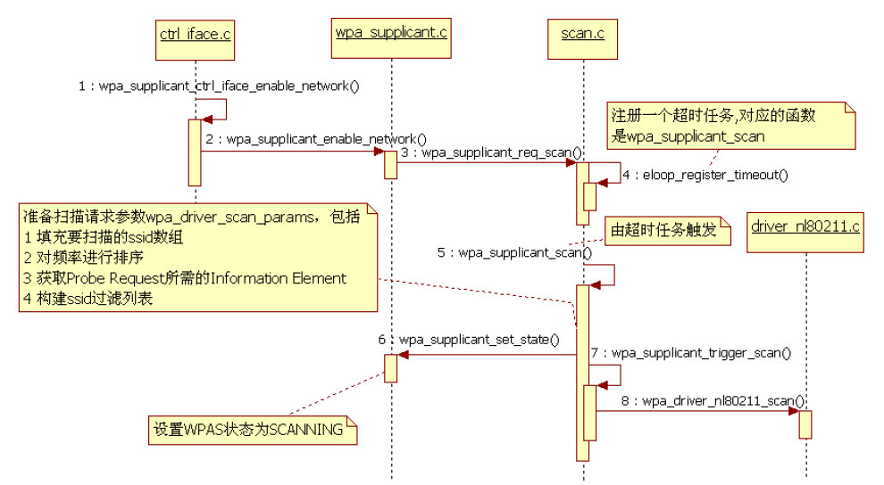

图4-31触发扫描的流程图图4-31所示函数中，wpa_supplicant_scan的内容较为丰富，其中有很多细节内容。读者初次学习时，可以先不考虑这些细节，只要把握图4-31中的函数调用流程即可。

马上来看扫描结果的处理流程。

2.扫描结果处理流程分析在上一节的扫描请求中，driver_nl80211发送了NL80211_CMD_TRIGGER_SCAN命令给wlandriver以通知它开始扫描周围的无线网络。当wlandriver完成此任务后，它将向4.3.4节中wpa_driver_nl80211_init_nl_global函数中注册的三个netlink组播之一的"scan"组播地址发送结果。而driver_nl80211对应处理来自wlandrivernetlink消息处理回调函数为process_global_event，而它最终又会调用

```java
static void do_process_drv_event(struct wpa_driver_nl80211_data *drv,
              int cmd, struct nlattr **tb)
{
    /*
     ap_scan_as_station和hostapd有关，该值默认等于NL80211_IFTYPE_UNSPECIFIED。读
     者可参考4.3.4节"wpa_supplicant_init_iface分析之三"中对wpa_driver_nl80211_init
     的分析。
    */
    if (drv-＞ap_scan_as_station != NL80211_IFTYPE_UNSPECIFIED &&
        (cmd == NL80211_CMD_NEW_SCAN_RESULTS ||cmd == NL80211_CMD_SCAN_ABORTED)) {......}
    switch (cmd) {
    // driver wrapper发送NL80211_CMD_TRIGGER_SCAN命令后，wlan driver也会回复同名的一个消息
    case NL80211_CMD_TRIGGER_SCAN:
        wpa_printf(MSG_DEBUG, "nl80211: Scan trigger");
        break;
     ......// 其他消息处理
    case NL80211_CMD_NEW_SCAN_RESULTS:
        // 收到来自driver的scan回复，所以设置scan_complete_events变量为1
        drv-＞scan_complete_events = 1;
        // 取消超时任务
        eloop_cancel_timeout(wpa_driver_nl80211_scan_timeout, drv,  drv-＞ctx);
        /*
        图4-1所示的WPAS软件结构中曾提到driver wrapper将通过发送driver event的方式
        触发WPAS其他模块进行对应处理。下面这个函数即是用来处理和发送与scan相关的driver
        event的。其详情见下文。
        */
        send_scan_event(drv, 0, tb);
        break;
      ......
    }
    return
}
```

do_process_drv_event进行处理。所有，直接来看do_process_drv_event中和扫描结果相关的代码即可。

[--＞driver_nl80211.c：​：

do_process_drv_event]

```c
static void send_scan_event(struct wpa_driver_nl80211_data *drv, int aborted,
         struct nlattr *tb[])
{
    // 代表driver event的数据结构
    // 它是一个联合体，包含了assoc_info、auth_info、scan_info等较多内容
    union wpa_event_data event;
    struct nlattr *nl;
    int rem;
    // 扫描信息，包含频率数组（int类型的数组）以及wpa_driver_scan_ssid数组
    // 请读者特别注意scan_info不是扫描结果
    struct scan_info *info;
#define MAX_REPORT_FREQS 50
    int freqs[MAX_REPORT_FREQS];
    int num_freqs = 0;
    /*
      scan_for_auth变量和wlan driver有关，它描述了如下的应用场景。
      当WPAS发起认证（authentication）操作时，它将向driver发送NL80211_CMD_
      AUTHENTICATE命令。driver可能因为某种原因（超时等），其内部存储的目标BSS（代表目标无
      线网络）信息失效。这时，它将返回ENOENT给WPAS。正常情况下，WPAS应该重新扫描。但为了加
      快这个流程，WPAS可以单独扫描目标无线网络（因为WPAS还是保存了目标无线网络的信息，例如
      频道等），然后再发起认证操作。从笔者角度来看，该场景对应的问题是wlan driver没有目标
      BSS信息，而WPAS有目标BSS信息。WPAS和wlan driver是两个不同模块，二者的信息并不能
      总是保持一致。既然WPAS有目标BSS信息，那么可以通过更加快捷的方法让wlan driver也得
      到这个信息（通过在指定频道到扫描目标BSS），从而加快整个流程（从WPAS角度来看，用户加入无
      线网络的流程已经进行到Authentication阶段，此时再退回到重新扫描的阶段实在有些麻烦）。
      关于scan_for_auth的官方解释，请通过前面介绍的git blame命令获取commit message，
      方法是先通过"git blame ./src/drivers/driver_nl80211.c | grep scan_for_auth"
      获得和scan_for_auth相关的commit号，然后再用git log commit号查看。
      git blame的用法请参考4.2.4节。
    */
    if (drv-＞scan_for_auth) {......}
    os_memset(&event, 0, sizeof(event));
    info = &event.scan_info;
    info-＞aborted = aborted;
    if (tb[NL80211_ATTR_SCAN_SSIDS]) {// 遍历NL80211_ATTR_SCAN_SSIDS属性
        nla_for_each_nested(nl, tb[NL80211_ATTR_SCAN_SSIDS], rem) {
            struct wpa_driver_scan_ssid *s =   &info-＞ssids[info-＞num_ssids];
            s-＞ssid = nla_data(nl);  s-＞ssid_len = nla_len(nl);
            info-＞num_ssids++;
            if (info-＞num_ssids == WPAS_MAX_SCAN_SSIDS) break;
        }
    }
    if (tb[NL80211_ATTR_SCAN_FREQUENCIES]) {// 获取netlink消息中的频率信息
        nla_for_each_nested(nl, tb[NL80211_ATTR_SCAN_FREQUENCIES], rem) {
            freqs[num_freqs] = nla_get_u32(nl);
            num_freqs++;
            if (num_freqs == MAX_REPORT_FREQS - 1)   break;
        }
        info-＞freqs = freqs;
        info-＞num_freqs = num_freqs;
    }
    // wpa_supplicant_event被driver event模块用来发送driver事件给WPAS
    wpa_supplicant_event(drv-＞ctx, EVENT_SCAN_RESULTS, &event);
}
```

上述代码中的send_scan_event将解析来自wlandriver的扫描完毕事件，然后再向WPAS发送driverevent，其代码如下所示。

[--＞driver_nl80211.c：​：

send_scan_event]上述代码中请注意structscan_info的作用，它定义于联合体wpa_event_data中，包含了本次扫描请求扫描了哪些SSID、对应的频率等。

提示scan_info不是scan后得到的结果信息，而是代表驱动处理scan请求时的一些处理信息。对于那些不支持通知scancomplete事件的driver而言，scan_info就没法获得。例如，超时扫描处理wpa_driver_nl80211_scan_timeout中调用wpa_supplicant_event时就没有scan_info。scan_info到底有什么作用呢？

```c
void wpa_supplicant_event(void *ctx, enum wpa_event_type event,
            union wpa_event_data *data)
{
    struct wpa_supplicant *wpa_s = ctx;
    u16 reason_code = 0;
    int locally_generated = 0;
    ......
    switch (event) {
    ......// driver event总类非常多，现在只分析EVENT_SCAN_RESULT即可
    case EVENT_SCAN_RESULTS:
        wpa_supplicant_event_scan_results(wpa_s, data);
        break;
    ......
    }
}
```

```java
static void wpa_supplicant_event_scan_results(struct wpa_supplicant *wpa_s,
                     union wpa_event_data *data)
{
    const char *rn, *rn2;
    struct wpa_supplicant *ifs;
// 笔者编译的WPAS实际上打开了ANDROID_P2P宏，但本章不讨论P2P相关内容
#ifdef ANDROID_P2P
    if (_wpa_supplicant_event_scan_results(wpa_s, data, 0) ＜ 0)
#else
    if (_wpa_supplicant_event_scan_results(wpa_s, data) ＜ 0)
#endif
        return;
    /*
    get_radio_name函数和4.3.4节"wpa_supplicant_init_iface分析之三"中提到的
    /sys/class/net/wlan0/phy80211/name文件内容有关。driver_nl80211实现了这个函数，
    它将返回上面这个文件的内容。
    */
    if (!wpa_s-＞driver-＞get_radio_name)  return;
    /*
      下面这段代码的作用主要是看虚拟接口设备（参考4.3.4节中对Virtual Interface的介绍）
      是不是使用了同一个物理设备。如果使用了同一个物理设备，则这个虚拟设备获得的扫描结果可以
      和其他虚拟设备共享（避免重复扫描）。本章不对其中细节进行介绍。
    */
    rn = wpa_s-＞driver-＞get_radio_name(wpa_s-＞drv_priv);
    /*
     global指向wpa_global对象，ifaces是wpa_global的成员变量，指向一个wpa_supplicant
     对象的队列，可参考图4-7和图4-11。在WPAS中，每一个wpa_supplicant对象会和一个虚拟接口
     设备关联。
    */
    for (if s = wpa_s-＞global-＞ifaces; ifs; ifs = ifs-＞next) {
        if (ifs == wpa_s || !ifs-＞driver-＞get_radio_name)
            continue;
        rn2 = ifs-＞driver-＞get_radio_name(ifs-＞drv_priv);
        if (rn2 && os_strcmp(rn, rn2) == 0) {// 比较两个虚拟设备对应的物理设备是否为同一个
#ifdef ANDROID_P2P
           ......
#else      // 和其他虚拟设备分享扫描结果
            _wpa_supplicant_event_scan_results(ifs, data);
#endif
        }
    }
}
```

后文将详细介绍它。

wpa_supplicant_event是driverwrapper向WPAS通知driverevent的接口函数，其代码代码很简单，下面直接来分析此处的目标函数如下所示。

wpa_supplicant_event_scan_results。

[--＞events.c：​：wpa_supplicant_event]（1）wpa_supplicant_event_scan_results函数分析函数代码如下。

[--＞events.c：​：

wpa_supplicant_event_scan_results]

```c
#ifdef ANDROID_P2P
static int _wpa_supplicant_event_scan_results(struct wpa_supplicant *wpa_s,
                          union wpa_event_data *data, int suppress_event)
#else
static int _wpa_supplicant_event_scan_results(struct wpa_supplicant *wpa_s,
                          union wpa_event_data *data)
#endif
{
    struct wpa_bss *selected;  struct wpa_ssid *ssid = NULL;
    struct wpa_scan_results *scan_res;// 这才是真正的扫描结果
    int ap = 0;
    ......
    wpa_supplicant_notify_scanning(wpa_s, 0);
    ......// 和P2P相关，本章不讨论
    // 获得无线网络扫描结果。就本例而言，前面得到的scan_info信息将传递到下面这个函数
    scan_res = wpa_supplicant_get_scan_results(wpa_s,data ? &data-＞scan_info : NULL, 1);
    if (scan_res == NULL) {......// 扫描结果为空，重新发起扫描}
#ifndef CONFIG_NO_RANDOM_POOL
    /*
    把扫描结果中得到的无线网络频率、信号强度等信息取出来，然后写到图4-1中的crpto模块。
    这样，能增加随机数生成的随机性。WPAS中nonce的生成都会利用随机数生成器。感兴趣的读者
    不妨自行研究相关内容。
    */
    ......
#endif /* CONFIG_NO_RANDOM_POOL */
```

上述代码中，_wpa_supplicant_event_scan_results是核心处理函数并且内容较多，所以下面将分段研究它。

（2）_wpa_supplicant_event_scan_results分析之一先来看第一个代码段，代码如下所示。

[--＞events.c：​：

_wpa_supplicant_event_scan_results代码段一]

```c
struct wpa_scan_results * wpa_supplicant_get_scan_results(struct wpa_supplicant *wpa_s,
                 struct scan_info *info, int new_scan)
{
    struct wpa_scan_results *scan_res;
    size_t i;
    int (*compar)(const void *, const void *) = wpa_scan_result_compar;
    /*
    调用driver interface的get_scan_results2函数，对nl80211来说，其真实函数是wpa_driver_
    nl80211_get_scan_results，它将向wlan driver发送NL80211_CMD_GET_SCAN命令以获取
    扫描结果。另外，wpa_driver_nl80211_get_scan_results中还涉及一个比较有意思的函数
    wpa_driver_nl80211_check_bss_status。其作用请读者利用前面介绍的git blame方法来查询。
    */
    scan_res = wpa_drv_get_scan_results2(wpa_s);
    if (scan_res == NULL) {return NULL;}//
#ifdef CONFIG_WPS
    ......// WPS相关
#endif /* CONFIG_WPS */
    /*
    对扫描结果进行排序，排序函数是wpa_scan_result_compar,它将根据无线网络的信噪比（SNR）
    进行排序信噪比越高，无线网络信号越强。注意，除了SNR外，wpa_scan_result_compar还有别
    的比较条件，感兴趣的读者可行阅读该函数。
    */
    qsort(scan_res-＞res, scan_res-＞num, sizeof(struct wpa_scan_res *),compar);
    ......
    /*
    更新WPAS中保存的那些bss信息（即无线网络信息，每一个无线网络由wpa_bss表示）。我们在4.3.4节中
    曾经介绍过和wpa_bss相关的知识。WPAS维护了一个wpa_bss链表，每次扫描时都可能更新这个链表
    （添加新扫描得到的wpa_bss、删除某些老旧的wpa_bss）。
    */
    wpa_bss_update_start(wpa_s);
    for (i = 0; i ＜ scan_res-＞num; i++)
        wpa_bss_update_scan_res(wpa_s, scan_res-＞res[i]);
    /*
    这里用上了scan_info。那些没有包含在本次scan_info中的wpa_bss不用更新。结合4.5.3节
    “wpa_supplicant_scan分析之二”中提到的prev_scan_ssid的作用，能想到为什么不更新那些
    没有包含在scan_info中的wpa_bss吗？
    */
    wpa_bss_update_end(wpa_s, info, new_scan);
    return scan_res;
}
```

wpa_supplicant_get_scan_results比较重要，我们通过代码来介绍它。

[--＞scan.c：​：

wpa_supplicant_get_scan_results]图4-32所示为扫描结果对应的数据结构。

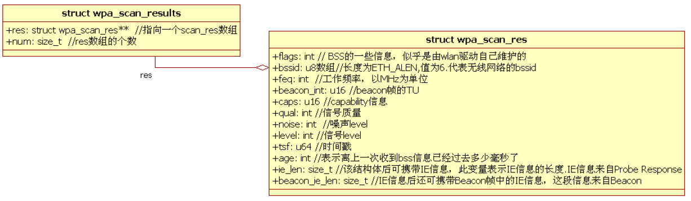

图4-32wpa_scan_res相关数据结构（3）_wpa_supplicant_event_scan_results分析之二接着来看_wpa_supplicant_event_scan_results下一个

```
    ......// 接_wpa_supplicant_event_scan_results代码片段一
    /*
    如果wpa_supplicant对扫描结果有特殊处理，则调用scan_res_handler对应的函数处理。
    目前只有P2P情况下scan_res_handler才起作用。
    */
    if (wpa_s-＞scan_res_handler) { ......return 0;}
    ......// hostapd的情况，本书不讨论
#ifdef ANDROID_P2P
    if(!suppress_event)
#endif
    {   ......// 通知客户端，扫描结束   }
    wpas_notify_scan_done(wpa_s, 1);
    if ((wpa_s-＞conf-＞ap_scan == 2 && !wpas_wps_searching(wpa_s))) {}
    if (wpa_s-＞disconnected) {......}
     /*
     还记得4.5.3节“wpa_supplicant_scan分析之一”中的ap_scan变量吗？下面这个
     wpas_driver_bss_selection函数判断是否由driver来控制无线网络的选择。显然，
     本例中它将返回0值。不过，由于本例不支持bgscan（由CONFIG_BGSCAN宏控制），
     bgscan_notify_scan返回0。
     这样，下面这个if判断失败。
     */
    if (!wpas_driver_bss_selection(wpa_s)&&bgscan_notify_scan(wpa_s, scan_res) == 1) {
        wpa_scan_results_free(scan_res);
        return 0;
    }
    // 从扫描结果中选择一个合适的无线网络
    // 注意，在本例中，下面这个函数将返回目标无线网络对应的wpa_bss对象
    selected = wpa_supplicant_pick_network(wpa_s, scan_res, &ssid);
```

代码片段。

[--＞events.c：​：

_wpa_supplicant_event_scan_results代码段二]上面这段代码相对简单。注意最后一句代码中调用的wpa_supplicant_pick_network函数。它将根据scan_res（扫描结果）​、wpa_bss（代表一个真实BSS的信息）和wpa_ssid（代表用户设置的某个无线网络配置项）的匹配情况来选择合适的无线网络。匹配检查包含很多内容，例如ssid是否匹配、安全设置是否匹配、速率是否匹配等。最终，该函数返回一个被选中的目标无线网络的wpa_bss对象。

提示wpa_supplicant_pick_network函数实际上检查的项非常多。由于篇幅问题，本章不能一一道来，感兴趣的读者请仔细研究。

```c
......// 接代码段二
  if (selected) {  // 本例中返回的selected无线网络wpa_bss对象代表目标"Test"无线网络
      int skip;
      /*
      判断是否需要漫游。简单来说，漫游表示需要切换无线网络。对本例而言，由于之前没有和AP关联，
      所以此处是需要漫游的（即需要切换无线网络）。
      wpa_supplicant_need_to_roam中还包括对同一个ESS中如何选择更合适的BSS有一些
      简单的判断，主要是根据信号强度来选择。
      */
      skip = !wpa_supplicant_need_to_roam(wpa_s, selected, ssid,scan_res);
      wpa_scan_results_free(scan_res);
      if (skip) {// 无须切换网络，所以没有太多要做的工作
          wpa_supplicant_rsn_preauth_scan_results(wpa_s);
          return 0;
      }
      // 关联至目标无线网络。我们下一节再分析它
      if (wpa_supplicant_connect(wpa_s, selected, ssid) ＜ 0) {......}
      // 预认证（Pre-Authentication）处理，和802.11中的Fast Transition有关，本书不讨论
      wpa_supplicant_rsn_preauth_scan_results(wpa_s);
  } else { ......// 没有匹配的无线网络情况的处理 }
  return 0;
}
```

（4）_wpa_supplicant_event_scan_results分析之三接着来看_wpa_supplicant_event_scan_results的第三段代码。

[--＞events.c：​：

_wpa_supplicant_event_scan_results代码段三]到此为止，扫描结果的处理基本完毕，剩下的工作就是通过wpa_supplicant_connect向目标AP发起关联等请求以加入"Test"无线网络。

在介绍wpa_supplicant_connect之前，先总结一下扫描结果处理流程。

（5）扫描结果处理流程总结扫描结果的处理流程相对比较复杂，如图4-33所示。其中有几个函数包含一些非常重要的细节，读者在研究过程中要特别注意。

❑wpa_supplicant_pick_nework：在扫描结果中找到一个最佳的无线网络。

❑wpa_supplicant_need_to_roam：判断是否需要切换网络。

❑wpa_supplicant_rsn_preauth_scan_result

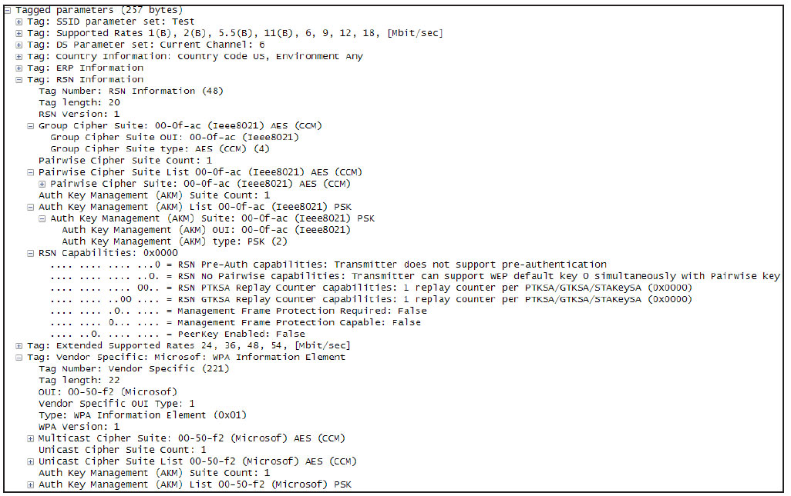

```
int wpa_supplicant_connect(struct wpa_supplicant *wpa_s,struct wpa_bss *selected,
                          struct wpa_ssid *ssid)
{
    // WPS相关，本章不讨论
    if (wpas_wps_scan_pbc_overlap(wpa_s, selected, ssid)) {......}
    /*
    4.5.3节介绍的wpa_supplicant_enable_network函数中，reassociate值被设置为1。
    当WPAS处于ASSOCIATING状态时，wpa_s-＞pending_bssid用于存储目标网络的BSSID。
    */
    if (wpa_s-＞reassociate || (os_memcmp(selected-＞bssid, wpa_s-＞bssid, ETH_ALEN) != 0 &&
        ((wpa_s-＞wpa_state != WPA_ASSOCIATING && wpa_s-＞wpa_state != WPA_AUTHENTICATING) ||
        os_memcmp(selected-＞bssid, wpa_s-＞pending_bssid, ETH_ALEN) != 0))) {
        // 和EAP-SIM/AKA认证方法有关。在此处初始化相关资源。本章不讨论
        if (wpa_supplicant_scard_init(wpa_s, ssid)) {
            wpa_supplicant_req_new_scan(wpa_s, 10, 0);
            return 0;
        }
        wpa_supplicant_associate(wpa_s, selected, ssid);// 发起关联操作
    }else {......}
    return 0;
}
```

s：更新PMKSA缓存信息。其工作和Pre-Authentication有关。不过Pre-Authenticaton真正的实现也需要AP的支持。

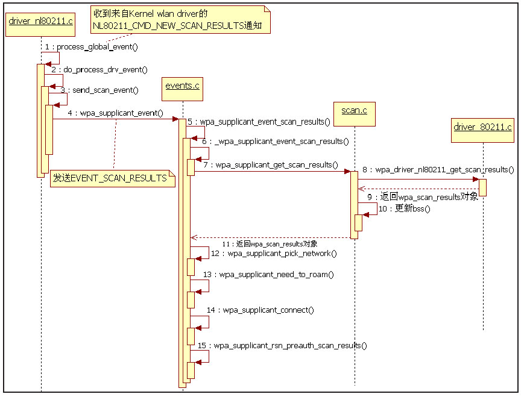

图4-34ProbeResponse帧内容请读者注意图4-34中所示的RSN信息，它描述了AP所支持的RSN功能。下节介绍WPAS如何关联到目标无线网络时将用到它。

3.关联无线网络处理流程分析图4-33扫描处理流程关联无线网络处理的流程从图4-34所示为笔者通过AirPcap截获的目标wpa_supplicant_connect开始，其代码如下AP发送的ProbeResponse帧。

所示。

[--＞events.c：​：wpa_supplicant_connect]就本例而言，wpa_supplicant_connect最重要的工作就是触发STA发起关联操作。关联操作通过wpa_supplicant_associate函数来完成。这部分代码比较复杂，我们分段来看。

（1）wpa_supplicant_associate分析之一和发起无线扫描请求一样，wpa_supplicant_associate函数主要目的就是填充一个用于向wlandriver发起关联请求的structwpa_driver_associate_params类型

```c
void wpa_supplicant_associate(struct wpa_supplicant *wpa_s,
                  struct wpa_bss *bss, struct wpa_ssid *ssid)
{
    u8 wpa_ie[200]; size_t wpa_ie_len;
    int use_crypt, ret, i, bssid_changed;
    int algs = WPA_AUTH_ALG_OPEN; // 认证方法
    enum wpa_cipher cipher_pairwise, cipher_group;// 单播数据和组播数据加密方法
    struct wpa_driver_associate_params params;  // 此函数主要目的是正确填充params的内容
    int wep_keys_set = 0;  struct wpa_driver_capa capa;
    int assoc_failed = 0; struct wpa_ssid *old_ssid;
#ifdef CONFIG_HT_OVERRIDES
       ......// 802.11n相关的内容
#endif /* CONFIG_HT_OVERRIDES */
#ifdef CONFIG_IBSS_RSN
      ......// IBSS相关内容
#endif /* CONFIG_IBSS_RSN */
#ifdef ANDROID_P2P
    int freq = 0;
#endif
    if (ssid-＞mode == WPAS_MODE_AP || ssid-＞mode == WPAS_MODE_P2P_GO ||
        ssid-＞mode == WPAS_MODE_P2P_GROUP_FORMATION) { ...... return;  }
#ifdef CONFIG_TDLS
    ......// TDLS是WFA定义的另外一项规范。本书不讨论
#endif /* CONFIG_TDLS */
    /*
    我们曾在4.3.3节功能相关成员变量及背景知识中曾介绍过CONFIG_SME相关的信息。
    Galaxy Note 2不支持WPA_DRIVER_FLAGS_SME参数。
    */
    if ((wpa_s-＞drv_flags & WPA_DRIVER_FLAGS_SME) &&  ssid-＞mode == IEEE80211_MODE_INFRA) {
        sme_authenticate(wpa_s, bss, ssid);
        return;
    }
    os_memset(&params, 0, sizeof(params));
    wpa_s-＞reassociate = 0;
    // wpas_driver_bss_selection于判断是否由wlan driver来完成无线网络选择，本例它返回FALSE
    if (bss && !wpas_driver_bss_selection(wpa_s)) {
#ifdef CONFIG_IEEE80211R
        ......// 802.11R相关
#endif /* CONFIG_IEEE80211R */
        bssid_changed = !is_zero_ether_addr(wpa_s-＞bssid);
        os_memset(wpa_s-＞bssid, 0, ETH_ALEN);// 设置wpa_supplicant bssid数组成员值为全0
        // 将BSSID复制到wpas-＞pending_bssid中
        os_memcpy(wpa_s-＞pending_bssid, bss-＞bssid, ETH_ALEN);
        if (bssid_changed)
            wpas_notify_bssid_changed(wpa_s);
#ifdef CONFIG_IEEE80211R
         ......// 和802.11R有关
#endif /* CONFIG_IEEE80211R */
#ifdef CONFIG_WPS
    } else if (......// WPS相关) {
    ......
#endif /* CONFIG_WPS */
    } else  os_memset(wpa_s-＞pending_bssid, 0, ETH_ALEN);
    // 取消计划扫描和普通扫描任务
    wpa_supplicant_cancel_sched_scan(wpa_s);
    wpa_supplicant_cancel_scan(wpa_s);
    /*
     清空上一次association时使用的WPA/RSN IE信息，这些信息保存在wpa_supplicant
     对象的assoc_wpa_ie（类型为u8*）对应的buffer中。
    */
    wpa_sm_set_assoc_wpa_ie(wpa_s-＞wpa, NULL, 0);
```

的对象，然后调用driverinterface对应的接口函数。由于关联时考虑的因素非常多，所以对应的处理也比较烦琐。本节先介绍第一段内容。

[--＞wpa_supplicant.c：​：

wpa_supplicant_associate代码段一]如果不考虑各种编译宏选项（对WPS、802.11R支持）​，上述代码段还算比较简单。

```c
  ......// 接代码段一
#ifdef IEEE8021X_EAPOL
    // 本例中，为目标无线网络配置的key_mgmt为SET_NETWORK 0 key_mgmt WPA-PSK
    // 通过"SET_NETWORK 0 key_mgmt WPA-PSK"命令来完成
    if (ssid-＞key_mgmt & WPA_KEY_MGMT_IEEE8021X_NO_WPA) {
    ......// 处理key_mgmt为非WPA的情况}
#endif /* IEEE8021X_EAPOL */
    /*
    auth_alg为认证方法，可取值有WPA_AUTH_ALG_OPEN、WPA_AUTH_ALG_SHARED等。根据第3章
    对WPA的介绍，如果要使用WPA的话，在和AP关联时必须使用Open System（即WPA_AUTH_ALG_OPEN）。
    如果没有设置该值，其值默认为0。
    */
    if (ssid-＞auth_alg) {......}
     /*
       下面这个if判断很重要，请读者注意。
       wpa_bss_get_vendor_ie函数用于获取wpa_bss中的和vendor相关的IE，此处IE对应的标志是
       WPA_IE_VENDOR_TYPE（该值被定义为：#define WPA_IE_VENDOR_TYPE 0x0050f201）。
       读者可参考图4-34中Probe Response帧中最后一个IE项（Microsoft：WPA IE,
       因为MS的OUI是00-50-f2）。注意：该OUI也供WFA定义的几种规范使用。
       wpa_bss_get_ie(bss, WLAN_EID_RSN)) 用于获取RSN IE。图4-34中也包含RSN IE。
       wpa_key_mgmt_wpa(ssid-＞key_mgmt)用于判断无线网络配置时设置的key_mgmt是否
       和WPA相关（本例中，key_mgmt被设为WPA-PSK，它属于WPA的一种）。
       简而言之，下面这个if条件就是判断目标无线网络是否支持WPA/RSN功能，并且无线网络配置项
       是否也设置key_mgmt与WPA相关。很显然，本例满足下面这个if条件。
     */
    if (bss && (wpa_bss_get_vendor_ie(bss, WPA_IE_VENDOR_TYPE) ||
            wpa_bss_get_ie(bss, WLAN_EID_RSN)) && wpa_key_mgmt_wpa(ssid-＞key_mgmt)) {
        int try_opportunistic;
        /*
        ssid-＞proto默认值为DEFAULT_PROTO，它由4.5.1节中ADD_NETWORK命令处理的
        wpa_config_set_network_defaults函数完成。proactive_key_caching默认值为0。
        */
        try_opportunistic = ssid-＞proactive_key_caching && (ssid-＞proto & WPA_PROTO_RSN);
        /*
         下面这个函数用于从pmksa缓存中取出current_ssid对应的pmkid cache项（类型为rsn_
         pmksa_cache）,然后将其赋值给wpa_sm中的cur_pmksa变量中。此时我们还没有pmksa
         缓存信息，故if条件失败。
        */
        if (pmksa_cache_set_current(wpa_s-＞wpa, NULL, bss-＞bssid,wpa_s-＞current_ssid,
                          try_opportunistic) == 0){
              // 设置eapol_sm的cached_pmk为1（由该函数第二个参数决定），表示要使用pmksa
              eapol_sm_notify_pmkid_attempt(wpa_s-＞eapol, 1);
        }
        wpa_ie_len = sizeof(wpa_ie);
        /*
          wpa_supplicant_set_suites函数比较繁琐，其目的是生成一个用于关联请求的IE信息。
          这些信息包括：group_cipher、pairwise_cipher、key_mgmt。信息的选择需要考虑AP的情况，
          即图4-34中AP包含的RSN和WPA IE。最终的选择如下：
          proto=WPA_PROTO_RSN、group_cipher=pairwise_cipher=WPA_CIPHER_CCMP
          key_mgmt=WPA_KEY_MGMT_PSK
          感兴趣的读者不妨自行阅读wpa_supplicant_set_suites。
        */
        if (wpa_supplicant_set_suites(wpa_s, bss, ssid,wpa_ie, &wpa_ie_len)) {......}
    } else if (wpa_key_mgmt_wpa_any(ssid-＞key_mgmt)) {
        ......
#ifdef CONFIG_WPS
    .......// WPS处理
#endif /* CONFIG_WPS */
    } else {......}
  ......// P2P和interworking相关的处理
    // 清除wlan driver中的key设置
    wpa_clear_keys(wpa_s, bss ? bss-＞bssid : NULL);
    use_crypt = 1;
    /*
    将WPAS中定义的数据类型转换成driver wrapper使用的数据类型。例如，WPAS使用WPA_CIPHER_CCMP，
    而driver wrapper对应的值为CIPHER_CCMP。
    */
    cipher_pairwise = cipher_suite2driver(wpa_s-＞pairwise_cipher);
    cipher_group = cipher_suite2driver(wpa_s-＞group_cipher);
    if (wpa_s-＞key_mgmt == WPA_KEY_MGMT_NONE ||
        wpa_s-＞key_mgmt == WPA_KEY_MGMT_IEEE8021X_NO_WPA) {......}
    if (wpa_s-＞key_mgmt == WPA_KEY_MGMT_WPS) use_crypt = 0;
#ifdef IEEE8021X_EAPOL
    if (wpa_s-＞key_mgmt == WPA_KEY_MGMT_IEEE8021X_NO_WPA) {
    ......// 选择单播和组播数据加密方法}
#endif /* IEEE8021X_EAPOL */
    if (wpa_s-＞key_mgmt == WPA_KEY_MGMT_WPA_NONE) {......}
    // 设置wpa_sm的状态为WPA_ASSOCIATING
    wpa_supplicant_set_state(wpa_s, WPA_ASSOCIATING);
```

（2）wpa_supplicant_associate分析之二接着来看代码段二。

[--＞wpa_supplicant.c：​：

wpa_supplicant_associate代码段二]这段代码主要是根据AP的情况选择合适的加密方法及认证方法。虽然目的很简单，但判断条件以及相关函数却比较烦琐，而且还有相当一部分代码是针对P2P、WPS等不同情况的处理。建议读者先了解其目的，以后根据工作需要再来研读其中的细节。

（3）wpa_supplicant_associate分析之三下面来看wpa_supplicant_associate最后一

```c
    ......// 接代码段二
    if (bss) {  // 填充struct wpa_driver_associate_params中的信息
        params.ssid = bss-＞ssid;
        params.ssid_len = bss-＞ssid_len;
        if (!wpas_driver_bss_selection(wpa_s)) {
            params.bssid = bss-＞bssid;
            params.freq = bss-＞freq;
        }
    }......// 其他处理
    // 填充参数
    params.wpa_ie = wpa_ie;   params.wpa_ie_len = wpa_ie_len;
    params.pairwise_suite = cipher_pairwise; params.group_suite = cipher_group;
    params.key_mgmt_suite = key_mgmt2driver(wpa_s-＞key_mgmt);
    params.wpa_proto = wpa_s-＞wpa_proto;params.auth_alg = algs;
    params.mode = ssid-＞mode;
    for (i = 0; i ＜ NUM_WEP_KEYS; i++) {......// 设置wep key相关信息}
    params.wep_tx_keyidx = ssid-＞wep_tx_keyidx;
    ......
    /*
    设置wlan driver是否丢弃未加密数据包。注意，在通过RSN身份验证前，EAPOL 4-Way Handshake等
    EAPOL数据是没有加密的，所以这个变量只针对非EAPOL/EAP数据包。本例中use_crpyt为1。
    */
    params.drop_unencrypted = use_crypt;
#ifdef CONFIG_IEEE80211W
     ......// 802.11w相关
#endif /* CONFIG_IEEE80211W */
    params.p2p = ssid-＞p2p_group;
    /*
    uapsd为Unscheduled Automatic Power Save Delivery的缩写，也称为WMM power save,
    属于WFA定义的一种标准，和节电有关。
    */
    if (wpa_s-＞parent-＞set_sta_uapsd)
        params.uapsd = wpa_s-＞parent-＞sta_uapsd;
    else
        params.uapsd = -1;
#ifdef ANDROID_P2P
    ......// P2P相关
#endif
    // 调用driver interface的associate函数以发起关联请求。该函数非常重要，下一节介绍
    ret = wpa_drv_associate(wpa_s, &params);
    if (ret ＜ 0) {......// 错误处理}
    if (wpa_s-＞key_mgmt == WPA_KEY_MGMT_WPA_NONE) {......// 其他处理
#ifdef CONFIG_IBSS_RSN
    } else if (......) {......// IBSS相关
#endif /* CONFIG_IBSS_RSN */
    } else {
        int timeout = 60;// 设置一个超时时间，身份认证必须在60秒内完成
        if (assoc_failed)  timeout = ssid-＞mode == WPAS_MODE_IBSS ? 10 : 5;
        else if (wpa_s-＞conf-＞ap_scan == 1) // 对本例而言，timeout最终取值为10秒
        timeout = ssid-＞mode == WPAS_MODE_IBSS ? 20 : 10;
        // 设置一个超时任务：对应函数为wpa_supplicant_timeout，用于处理身份认证超时的情况
        wpa_supplicant_req_auth_timeout(wpa_s, timeout, 0);
    }
      ......
    if (wpa_s-＞current_ssid && wpa_s-＞current_ssid != ssid)
        eapol_sm_invalidate_cached_session(wpa_s-＞eapol);// 设置上一次eapol session无效
    old_ssid = wpa_s-＞current_ssid;
    wpa_s-＞current_ssid = ssid;// 设置wpa_supplicant对象的current_ssid和current_bss变量
    wpa_s-＞current_bss = bss;
    // 下面这个函数实际上是将加密/身份验证信息设置到wpa_sm对应的变量中去
    wpa_supplicant_rsn_supp_set_config(wpa_s, wpa_s-＞current_ssid);
    // 配置eapol sm和eap sm。其中：portControl被置为AUTO
    // eapSuccess=altAccept=eapFail=altReject=FALSE。这个过程没有状态发生变化
    wpa_supplicant_initiate_eapol(wpa_s);
    if (old_ssid != wpa_s-＞current_ssid)
        wpas_notify_network_changed(wpa_s);
}
```

段代码。

[--＞wpa_supplicant.c：​：

wpa_supplicant_associate代码段三]至此，wpa_supplicant_associate函数就分析完毕。读者如果还记得第3章关于STA加入AP的步骤的话，可能会有一些疑惑。STA加入AP的顺序是先发送Authentication请求，然后再发送Association请求。但此处仅调用了wpa_drv_associate函数，似乎忽略了Authentication这一步。该问题的回答将放在下一节，直接来看drivernl80211对应的wpa_driver_nl80211_associate函数。

（4）wpa_driver_nl80211_associate函数分

```c
static int wpa_driver_nl80211_associate(void *priv,
                              struct wpa_driver_associate_params *params)
{
    struct i802_bss *bss = priv;
    struct wpa_driver_nl80211_data *drv = bss-＞drv;
    int ret = -1; struct nl_msg *msg;
    // 处理AP和IBSS的情况
    if (params-＞mode == IEEE80211_MODE_AP) return wpa_driver_nl80211_ap(drv, params);
    if (params-＞mode == IEEE80211_MODE_IBSS)
                         return wpa_driver_nl80211_ibss(drv, params);
    // 目前大部分手机不支持WPA_DRIVER_FLAGS_SME
    if (!(drv-＞capa.flags & WPA_DRIVER_FLAGS_SME)) {
        enum nl80211_iftype nlmode = params-＞p2p ? // 本例对应的是非p2p情况
            NL80211_IFTYPE_P2P_CLIENT : NL80211_IFTYPE_STATION;
        // 设置设备类型，可参考4.3.4节wpa_driver_nl80211_finish_drv_init函数分析
        if (wpa_driver_nl80211_set_mode(priv, nlmode) ＜ 0)  return -1;
        return wpa_driver_nl80211_connect(drv, params);
    }
    /*
      注意：根据第3章对STA加入AP操作的描述，STA需要首先发送authentication请求，然后再发送
      association请求。在“wpa_supplicant_associate分析之一”中，有一个sme_authenticate
      函数，它将发起authentication请求。对于不支持SME的wlan driver来说，WPAS只要向wlan driver
      发送connect命令即可完成association和authentication这两步。这种实现方式和wlan driver
      以及cfg80211有关。本书不拟对此展开详细讨论。读者可在wpa_supplicant官方源码中利用\n"git log a8c5b43a"命令查看相关信息。
    */
    ......// 对于支持SME的wlan driver，则需要发送NL80211_CMD_ASSOCIATE命令
}
```

析代码如下所示。

[--＞driver_nl80211.c：​：

wpa_driver_nl80211_associate]

```c
static int wpa_driver_nl80211_connect(struct wpa_driver_nl80211_data *drv,
    struct wpa_driver_associate_params *params)
{
    struct nl_msg *msg;   enum nl80211_auth_type type;
    int ret = 0;   int algs;
    msg = nlmsg_alloc();
    nl80211_cmd(drv, msg, 0, NL80211_CMD_CONNECT);// 构造一个NL80211_CMD_CONNECT命令
    NLA_PUT_U32(msg, NL80211_ATTR_IFINDEX, drv-＞ifindex);// 设置本次命令对应的网络接口
    // 设备索引号填充bssid信息
    if (params-＞bssid) NLA_PUT(msg, NL80211_ATTR_MAC, ETH_ALEN, params-＞bssid);
    if (params-＞freq) {......// 填充频率信息}
    if (params-＞ssid) {// 填充ssid信息
        NLA_PUT(msg, NL80211_ATTR_SSID, params-＞ssid_len,params-＞ssid);
        os_memcpy(drv-＞ssid, params-＞ssid, params-＞ssid_len);// 将ssid信息保存起来
        drv-＞ssid_len = params-＞ssid_len;
    }
    ......
    if (params-＞pairwise_suite != CIPHER_NONE) {
        ......// 处理pairwise_cipher取值情况
        NLA_PUT_U32(msg, NL80211_ATTR_CIPHER_SUITES_PAIRWISE, cipher);
    }
    ......// 其他各项参数处理
    // 向wlan driver发送NL80211_CMD_CONNECT命令
    ret = send_and_recv_msgs(drv, msg, NULL, NULL);
    msg = NULL;
    if (ret) {......// 错误处理}
    ret = 0;
    ......
    return ret;
}
```

来看wpa_driver_nl80211_connect函数，其代码如下所示。

[--＞driver_nl80211.c：​：

wpa_driver_nl80211_connect]至此，WPAS就把CONNECT请求发给了驱动，驱动将完成Authentication帧和AssociationRequest帧的处理。

和scan请求类似，关联无线网络处理流程主要是为了填充一个wpa_driver_associate_params类型的对象。

不过该对象中各个参数的设置颇有来头，需要对802.11规范有相当了解才可以做到正确无误。

（5）关联无线网络处理流程总结来看一下关联无线网络处理流程所涉及的几个重要函数调用，如图4-35所示。

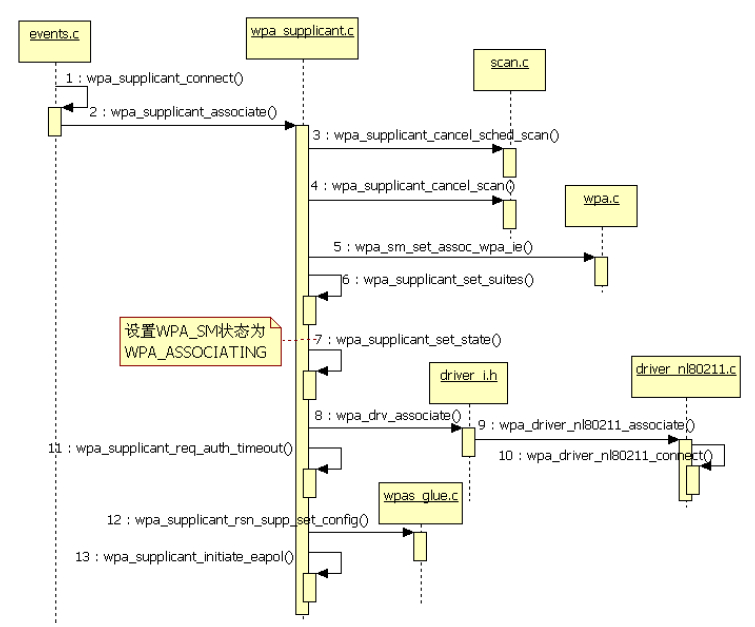

图4-35wpa_supplicant_connect流程图4-35中最复杂的就是wpa_supplicant_associate函数，希望读者能结合代码进行阅读。

WPAS成功调用wpa_supplicant_associate

```java
static void do_process_drv_event(struct wpa_driver_nl80211_data *drv, int cmd,
                            struct nlattr **tb)
{
    // 曾在4.5.3节“扫描结果处理流程分析”中见过该函数处理NL80211_CMD_NEW_SCAN_RESULTS
    ......
    switch (cmd) {
    ......
    case NL80211_CMD_CONNECT:// wlan driver返回该命令的处理结果
    case NL80211_CMD_ROAM:
        /*
        调用mlme_event_connect进行处理，其中NL80211_ATTR_STATUS_CODE属性保存了AP的处理结果
        （即Association请求的处理结果）、NL80211_ATTR_MAC属性保存了AP的MAC地址（就是bssid）、
        NL80211_ATTR_REQ_IE属性保存了Association Request请求时包含的IE（STA发送的IE）、
        NL80211_ATTR_RESP_IE属性保存了Association Response帧包含的IE信息（AP发送的IE）。
        */
          mlme_event_connect(drv, cmd, tb[NL80211_ATTR_STATUS_CODE],
            tb[NL80211_ATTR_MAC], tb[NL80211_ATTR_REQ_IE], tb[NL80211_ATTR_RESP_IE]);
    ......
}
```

后，将等待NL80211_CMD_CONNECT命令的处理结果。该结果由wlandriver通过NL80211_CMD_CONNECT类型的消息返回给driverwrapper。下面一节将分析WPAS如何处理该消息。

4.关联事件处理流程分析结合上节所述内容，WPAS中的driverwrapper将收到来自wlandriver的NL80211_CMD_CONNECT命令，其对应的处理代码如下所示。

[--＞driver_nl80211.c：​：

do_process_drv_event]

```c
static void mlme_event_connect(struct wpa_driver_nl80211_data *drv,
                   enum nl80211_commands cmd, struct nlattr *status, struct nlattr *addr,
                   struct nlattr *req_ie,struct nlattr *resp_ie)
{
    /*
    driver wrapper通知WPAS其他模块时候使用的事件类型。我们曾在4.5.3节“扫描结果处理流程分析”
    中对send_scan_event函数分析时见过。
    */
    union wpa_event_data event;
    if (drv-＞capa.flags & WPA_DRIVER_FLAGS_SME) {......// wlan driver支持SME时的处理}
    os_memset(&event, 0, sizeof(event));
    if (cmd == NL80211_CMD_CONNECT && nla_get_u16(status) != WLAN_STATUS_SUCCESS) {
        ......// 关联AP失败的处理
        wpa_supplicant_event(drv-＞ctx, EVENT_ASSOC_REJECT, &event);
        return;
    }
    drv-＞associated = 1;
    if (addr)// 保存bssid
        os_memcpy(drv-＞bssid, nla_data(addr), ETH_ALEN);// 保存bssid信息
    if (req_ie) {// 保存Association Request ie信息
        event.assoc_info.req_ies = nla_data(req_ie);
        event.assoc_info.req_ies_len = nla_len(req_ie);
    }
    if (resp_ie) {// 保存Association Response ie信息
        event.assoc_info.resp_ies = nla_data(resp_ie);
        event.assoc_info.resp_ies_len = nla_len(resp_ie);
    }
  // 通过发送NL80211_GET_SCAN命令获取STA的工作频率
    event.assoc_info.freq = nl80211_get_assoc_freq(drv);
    // 重要函数，见下文分析
    wpa_supplicant_event(drv-＞ctx, EVENT_ASSOC, &event);
}
```

当wlandriver返回NL80211_CMD_CONNECT命令时，其真正的处理函数实际上是mlme_event_connect，此函数代码如下所示。

[--＞driver_nl80211.c：​：

mlme_event_connect]wpa_supplicant_event中处理EVENT_ASSOC消息的是wpa_supplicant_event_assoc，下面将分段介绍它。

（1）wpa_supplicant_event_assoc分析之一

```c
static void wpa_supplicant_event_assoc(struct wpa_supplicant *wpa_s,
                       union wpa_event_data *data)
{
    u8 bssid[ETH_ALEN];  int ft_completed;
    int bssid_changed; struct wpa_driver_capa capa;
    ......// CONFIG_AP处理
    // 判断Fast Transition是否完成，由于本例没有设置CONFIG_80211R宏，所以下面这个函数返回0
    ft_completed = wpa_ft_is_completed(wpa_s-＞wpa);
    /*
    在4.5.3节“wpa_supplicant_associate分析之一”中，wpa_supplicant对象的assoc_wpa_ie
    被清空。此处需要保存这些IE信息。wpa_supplicant_event_associnfo比较烦琐，主要是更新RSN/WPA
    IE信息，请感兴趣的读者自行阅读。
    */
    if (data && wpa_supplicant_event_associnfo(wpa_s, data) ＜ 0)   return;
    wpa_supplicant_set_state(wpa_s, WPA_ASSOCIATED);// 设置wpa_sm装为WPA_ASSOCIATED
    // 从driver wrapper中获得bssid信息
    if (wpa_drv_get_bssid(wpa_s,bssid)＞=0&&os_memcmp(bssid,wpa_s-＞bssid,ETH_ALEN)!=0){
        random_add_randomness(bssid, ETH_ALEN); // 和随机数相关
        bssid_changed = os_memcmp(wpa_s-＞bssid, bssid, ETH_ALEN);
        os_memcpy(wpa_s-＞bssid, bssid, ETH_ALEN);     // 设置bssid
        os_memset(wpa_s-＞pending_bssid, 0, ETH_ALEN); // 清空pending_bssid
        if (bssid_changed)
            wpas_notify_bssid_changed(wpa_s);
        // 和动态WEP Key有关，本书不讨论
        if (wpa_supplicant_dynamic_keys(wpa_s)&&!ft_completed)wpa_clear_keys(wpa_s, bssid);
        /*
        就本例而言（ap_scan为1，并且current_ssid不为空），下面这个函数作用不大。对其他情况而言，
        该函数负责的工作我们在前面都见识过了。
        */
        if (wpa_supplicant_select_config(wpa_s) ＜ 0) {......// 错误处理}
         /*
         这个if条件对应的代码段让笔者非常困惑，因为在4.5.3节“wpa_supplicant_associate
         分析之三”的最后已经为wpa_s-＞current_bss赋值了。此处为何又再赋值？通过笔者实测，bss
         和current_bss的值是相同的。添加这段代码的人也没有说明为什么（读者不妨参考“git show
         8f770587”命令的结果）。有知晓其来龙去脉的读者不妨和大家分享相关知识。
         */
        if (wpa_s-＞current_ssid) {
            struct wpa_bss *bss = NULL;
            bss = wpa_supplicant_get_new_bss(wpa_s, bssid);
            if (!bss) {
                wpa_supplicant_update_scan_results(wpa_s);
                bss = wpa_supplicant_get_new_bss(wpa_s, bssid);
            }
            if (bss)
                wpa_s-＞current_bss = bss;
        }
        if (wpa_s-＞conf-＞ap_scan==1&&wpa_s-＞drv_flags&WPA_DRIVER_FLAGS_BSS_SELECTION){
            ......// wlan driver支持BSS SELECTION功能时对应的处理
        }
}
```

代码如下所示。

[--＞events.c：​：

wpa_supplicant_event_assoc代码段一]wpa_supplicant_event_assoc函数的历史比较悠久（根据gitcommit信息，它从0.6.3版本开始就存在。而实际历史可能还要更久，因为WPAS从0.6.3版本后才开始使用git来管理代码）​。在笔者研究的WPAS相关代码中，wpa_supplicant_event_assoc函数算是相当

```c
 ......// 接代码段一
#ifdef CONFIG_SME
     ......// 支持SME的情况
#endif /* CONFIG_SME */
    if (wpa_s-＞current_ssid) {
    /*
    初始化SIM/USIM卡。根据代码中的注释：在ap_scan为1的情况下，该函数在此之前就被调用过。
    而其他情况下，需要在此处调用它。在4.5.3节关联无线网络处理流程分析中见过此函数。
    */
        wpa_supplicant_scard_init(wpa_s, wpa_s-＞current_ssid);
    }
    wpa_sm_notify_assoc(wpa_s-＞wpa, bssid);
    // 初始化wpa_sm中和后续EAPOL-Key交换相关联的变量
    /*
      wpa_s-＞l2在4.3.4节wpa_supplicant_driver_init函数分析中通过l2_packet_init函数调用被赋值。
      所以下面这个if条件为真。对Linux平台来说，l2_packet_notify_auth_start
      实际上是一个空函数。
    */
    if (wpa_s-＞l2)  l2_packet_notify_auth_start(wpa_s-＞l2);
    if (!ft_completed) {// 设置EAPOL相关外部变量
        eapol_sm_notify_portEnabled(wpa_s-＞eapol, FALSE);
        eapol_sm_notify_portValid(wpa_s-＞eapol, FALSE);
    }
    // 本例采用的就是WPA-PSK认证算法
    if (wpa_key_mgmt_wpa_psk(wpa_s-＞key_mgmt) || ft_completed)
        eapol_sm_notify_eap_success(wpa_s-＞eapol, FALSE);
    // 设置EAPOL模块中的portEnabled为TRUE，将状态机一系列动作。详情见下文
    eapol_sm_notify_portEnabled(wpa_s-＞eapol, TRUE);
    wpa_s-＞eapol_received = 0;
    if (......){......}
    } else if (!ft_completed) {
        wpa_supplicant_req_auth_timeout(wpa_s, 10, 0);// 重新注册一个认证超时任务
    }
    wpa_supplicant_cancel_scan(wpa_s);// 取消scan任务
    ......// 处理wlan driver支持WPA_DRIVER_FLAGS_4WAY_HANDSHAKE功能以及ft_complete
    为1时的情况
    if (wpa_s-＞pending_eapol_rx) {
        /*
        pending_eapol_rx变量对应如下的应用场景。
        有时候在WPAS收到来自wlan driver的EVENT_ASSOC事件之前（即wpa_supplicant_event_
        assoc被调用之前），AP就发送EAPOL消息过来（后文会分析相关代码）以触发认证流程。而由于
        WPAS还未处理EVENT_ASSOC事件。所以，EAPOL消息会先保存到pending_eapol_rx中，直到
        wpa_supplicant_event_assoc函数中再来处理（即收到了EVENT_ASSOC事件）。笔者测试过
        程中发现有些AP会出现这种情况。
        */
        }
    ......// WEP的情况
    ......// IBSS的情况
}
```

复杂的了。其中一个主要原因是该函数内部有很多细节需要考虑，有些细节甚至是为了解决某个bug。对于初学者而言，笔者建议可只关注该函数涉及的主要流程。

（2）wpa_supplicant_event_assoc分析之二接下来分析该函数最后一段代码。

[--＞events.c：​：

wpa_supplicant_event_assoc代码段二]wpa_supplicant_event_assoc函数终于分析完毕。正如上一节最后所提到的那样，该函数实际上非常复杂，细节内容很难在本章篇幅内一一覆盖。同时，对初学者来说，流程比细节更重要，所以可先略过这些细节。

上述代码中，

```c
void eapol_sm_notify_portEnabled struct eapol_sm *sm, Boolean enabled)
{
    ......
    sm-＞portEnabled= enabled;// 设置portEnabled变量为TRUE
    eapol_sm_step(sm); // 状态机联动。这部分代码在4.4.2节介绍“状态机联动”时出现过
}
```

eapol_sm_notify_portEnabled被调用以设置portEnable为TRUE。EAPOL模块包含众多SM，它们是否会因为这个变量的变化而随之发生状态改变呢？来看下节。

（3）eapol_sm_notify_portEnabled函数eapol_sm_notify_portEnabled的代码如下所示。

[--＞eapol_supp_sm.c：​：

eapol_sm_notify_portEnabled]eapol_sm_step将依次更新SUPP_PAE、KEY_RX、SUPP_BE和EAP_SM状态信息。在该函数执行之前，这四个状态机的状态依次如下。

❑SUPP_PAE为DISCONNECTED状态；

❑KEY_RX为NO_KEY_RECEIVE状态；

❑SUPP_BE为IDLE状态；

❑EAP_SM为DISABLED状态。

根据代码（eapol_supp_sm.c中SM_STEP（SUPP_PAE）​）以及图4-28可知，SUPP_PAE下一个要进入的状态是CONNECTING，其EA（EntryAciton）代码

```c
SM_STATE(SUPP_PAE, CONNECTING)
{
    // SUPP_PAE_state此时的值为SUPP_PAE_DISCONNECTED，故send_start为0
    int send_start = sm-＞SUPP_PAE_state == SUPP_PAE_CONNECTING;
    SM_ENTRY(SUPP_PAE, CONNECTING);
    if (send_start) {
        sm-＞startWhen = sm-＞startPeriod;
        sm-＞startCount++;
    } else {
#ifdef CONFIG_WPS
        sm-＞startWhen = 1;
#else /* CONFIG_WPS */
        sm-＞startWhen = 3; // 设置startWhen值为3
#endif /* CONFIG_WPS */
    }
    eapol_enable_timer_tick(sm); // 使能Port Timers SM
    sm-＞eapolEap = FALSE;
    if (send_start)  eapol_sm_txStart(sm); // 发送EAPOL Start包。此时该函数不会被调用
}
```

如下。

[--＞eapol_supp_sm.c：​：SM_STATE（SUPP_PAE，CONNECTING）​]读者可参考代码以及状态机示意图以了解其他状态机的切换。该函数执行完毕后，各个状态机的变化如下。

❑SUPP_PAE进入CONNECTING状态；

❑KEY_RX不变（NO_KEY_RECEIVE）​；

❑SUPP_BE进入IDLE状态；

❑EAP_SM不变（DISABLED状态）​。

注意根据图4-21关于EAPSUPP_SM的描述，当portEnabled值为TRUE时，应该从DISABLED状态切换至INITIALIZE状态。不过，在4.5.3节“wpa_supplicant_associate分析之三”中曾调用过wpa_supplicant_initiate_eapol函数。在该函数中，由于本例使用的认证算法是WPA-PSK，所以force_disabled变量为TRUE，导致EAPSUPPSM不能转换至INITIALIZE状态。​（参考eap.c：​：

SM_STEP（EAP）函数中第一个elseif判断。​）

（4）关联事件处理流程总结关联事件处理流程中涉及的重要函数调用如图4-36所示。注意，wpa_supplicant_event_assoc中略去了部分细节代码。请读者清楚图中的几个重要函数后，再根据本节所述内容研究这些细节。

至此，WPAS已经和目标AP完成了Association操作，接来下将进入802.1X身份认证流程。根据图3-44所示，接下来的工作将是4-WayHandshake和GroupKeyHandshake的处理。

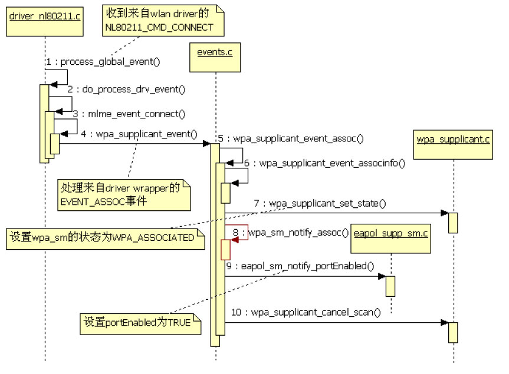

图4-36NL80211_CMD_CONNECT处理流程5.EAPOL-Key交换流程分析对本例而言，本节所说的EAPOL-Key交换包括4-WayHandshake和GroupKeyHandshake过程（注意，由于采用的是PSK认证方式，故本节分析的交互流程将不涉及STA和AuthenticatorServer开展的身份认证的流程）​。

首先发起的是4-WayHandshakeKey交换。

对于WPA-PSK认证方法来说，STA不会发送EAPOL-Start消息给AP。根据笔者的测试，完成关联操作后，GalaxyNote2会发送一个Nufunction（没有实际数据）的数据包给AP（如图4-37所示）​，而AP接收到该消息后发现STA还未通过认证，所以它就会被触发以开始4-WayHandshake流程（参考图3-46的左图）​。

图4-37Nufunction数据包由图4-37可知，GalaxyNote2向AP发送一个Nufunction数据包后，AP就开始了4-

```java
void wpa_supplicant_rx_eapol(void *ctx, const u8 *src_addr,
                             const u8 *buf, size_t len)
{
    struct wpa_supplicant *wpa_s = ctx;
    /*
    读者还记得4.5.3节“wpa_supplicant_event_assoc分析之二”最后关于pending_eapol_rx
    的解释吗？当wpa_state状态不为WPA_ASSOCIATED的时候，如果收到AP发来的数据包，则先保存
    起来，然后留待wpa_supplicant_event_assoc中去处理。
    */
    if (wpa_s-＞wpa_state ＜ WPA_ASSOCIATED) {
        wpabuf_free(wpa_s-＞pending_eapol_rx);
        wpa_s-＞pending_eapol_rx = wpabuf_alloc_copy(buf, len);// 复制数据
        if (wpa_s-＞pending_eapol_rx) {
            os_get_time(&wpa_s-＞pending_eapol_rx_time);
            os_memcpy(wpa_s-＞pending_eapol_rx_src, src_addr,ETH_ALEN);
        }
        return;
    }
    ......// CONFIG_AP处理
    if (wpa_s-＞key_mgmt == WPA_KEY_MGMT_NONE) {  return; }
    /*
    eapol_received用于记录收到的EAPOL/EAP包个数。初次进来，需要设置认证超时任务（这个
    任务已经设置过多次了，不过wpa_supplicant_req_auth_timeout会先取消上一次设置的认证超时
    任务，然后再设置新的）。
    */
    if (wpa_s-＞eapol_received == 0 &&
        (!(wpa_s-＞drv_flags & WPA_DRIVER_FLAGS_4WAY_HANDSHAKE) ||
        !wpa_key_mgmt_wpa_psk(wpa_s-＞key_mgmt) || wpa_s-＞wpa_state != WPA_COMPLETED) &&
        (wpa_s-＞current_ssid == NULL || wpa_s-＞current_ssid-＞mode != IEEE80211_MODE_IBSS)
        ) {
        wpa_supplicant_req_auth_timeout(wpa_s,
            (wpa_key_mgmt_wpa_ieee8021x(wpa_s-＞key_mgmt) ||
            wpa_s-＞key_mgmt == WPA_KEY_MGMT_IEEE8021X_NO_WPA ||
            wpa_s-＞key_mgmt == WPA_KEY_MGMT_WPS) ? 70 : 10, 0);
    }
    wpa_s-＞eapol_received++;
    if (wpa_s-＞countermeasures) {  return; }
    ......// CONFIG_IBSS_RSN处理
    os_memcpy(wpa_s-＞last_eapol_src, src_addr, ETH_ALEN);
    /*
    对于非PSK认证方法（如802.1X认证），EAPOL/EAP帧由eapol_sm_rx_eapol进行处理。
    另外，与四次握手和组播密钥交换相关的EAPOL-Key帧也不在eapol_sm_rx_eapol中处理。
    */
    if (!wpa_key_mgmt_wpa_psk(wpa_s-＞key_mgmt) &&
        eapol_sm_rx_eapol(wpa_s-＞eapol, src_addr, buf, len) ＞ 0)  return;
    /*
    driver_nl80211没有实现poll函数。该函数的目的是为了从驱动中获取Association过程中涉及
    的IE信息对于nl80211来说，关联完成后，我们就已经收到了这些信息，所以不需要再次获取它们了。
    */
    wpa_drv_poll(wpa_s);
    if (!(wpa_s-＞drv_flags & WPA_DRIVER_FLAGS_4WAY_HANDSHAKE))
        wpa_sm_rx_eapol(wpa_s-＞wpa, src_addr, buf, len);// 关键函数。见下文分析
    else if (wpa_key_mgmt_wpa_ieee8021x(wpa_s-＞key_mgmt)) {
        eapol_sm_notify_portValid(wpa_s-＞eapol, TRUE);
    }
}
```

WayHandshake流程。它首先发送一个EAPOL帧给STA（图4-37中"Message1of4"这一项）​。我们在4.3.4节的最后曾提到l2_packet模块（参考图4-1）用来接收PACKET类型socket数据的函数是wpa_supplicant_rx_eapol。实际上，该函数就是WPAS中用来接收EAP/EAPOL数据包的。所以，wpa_supplicant_rx_eapol将处理AP发送过来的EAPOL帧。马上来看此函数，代码如下所示。

[--＞wpa_supplicant.c：​：

wpa_supplicant_rx_eapol]wpa_sm_rx_eapol是本节的重点。在介绍之前，先来介绍EAPOL-Key交换的背景知识。

一方面对3.3.7节RSNA介绍的补充，另一方面该背景知识对我们理解wpa_sm_rx_eapol函数也有重要帮助。

[22]​[23]（1）背景知识介绍由3.3.7节可知，RSNA过程中有两组Key需要交换和派生。

❑PTK（PairwiseTransientKey，成对临时密钥）用于加解密单播数据。它从PMK（PairwiseMasterKey）派生（derive）而来。对于SOHO网络环境来说，PMK就是PSK。它由用户设置的passphrase扩展而来（请读者参考4.5.2节中的wpa_config_update_psk）​。AP和STA需要通过4-WayHandshake协议交换和派生PTK。

❑GTK（GroupTransientKey，组临时密钥）用于加解密组播数据。它由GMK（GroupMasterKey，其来源由AP或AuthenticatorServer决定）派生而来。AP和STA通过GroupKeyHandshake协议交换和派生GTK。GroupKeyHandshake必须在完成4-WayHandshake之后才能开展。

提示GroupKeyHandshake对应的场景比较特殊。对组播数据而言，AP和所有和它关联的STA使用同一个GTK。不过，如果中途有STA离开（取消和AP的关联）的话，从安全角度考虑，AP和剩下的STA之间最好更换一个新的GTK。AP将根据情况来触发GroupKeyHandshake流程。另外，AP可通过4-WayHandshake告知STA其当前使用的GTK。这种情况下，AP和STA之间无须开展GroupKeyHandshake流程。

下面，通过实例来介绍4-WayHandshake涉及的四次帧交换以及其中包含的数据信息。

第一个EAPOL-Key帧（以后简称MessageA）由AP发送给STA，其内容如图4-38所示。

KeyDescriptorType及以下的内容属于KeyDescriptor。KeyDescriptor用来描述EAPOL-Key帧的Key信息，由多个字段组成。

❑第一个字段是KeyDescriptorType，目前取值有三个，分别是RC4、WPA和RSN（即WPA2）​，802.11中可使用后两个。

❑KeyInformation字段（2字节）包含多个标志位。下文将一一介绍它们。

❑KeyLength字段（2字节）表示PTK密钥的长度。对CCMP来说，它是16字节（128位）​，而对TKIP来说，其长度是32字节（256位）​。读者可参考图3-47中的CCMP-TK、TKIP-TK和TKIP-MICKey。CCMP和TKIP长度不一致的原因是CCMP可用一个Key完成数据加解密和MIC校验，而TKIP使用不同的Key来完成加解密以及MIC校验。

❑ReplayCounter字段（8字节）和防止重放攻击有关。一个简单的应用场景为STA之前收到过ReplayCounter为1的包。假如它又收到一个ReplayCounter为0的包，则认为发生了重放攻击，STA将丢弃ReplayCounter为0的包。对MessageA来说，该值必须为0。

❑KeyNonce字段（32字节）用于存储Nonce值。对MessageA来说，此Nonce值由AP生成，所以也叫ANonce。

❑KeyIV字段（16字节）表示初始向量，用于Key生成。MessageA中该字段为全0。

❑KeyRSC字段（8字节）是KeyReceiveSequenceCounter的缩写，也和重放攻击有关。该字段用于四次握手的第三帧以及组播Key握手的第一帧中。

❑KeyID字段（8字节）对WPA/RSN来说，该字段未使用。

❑KeyMIC字段（可变字节长度）表示存储MIC数据，其长度和具体的算法有关。笔者查[22]询了802.11文档，规范中列出的几种算法对应的MIC长度都是16字节。

❑KeyDataLength字段（2字节）表示KeyData长度。图4-38没有携带KeyData，所以该项为0。如果该项不为0，KeyDescriptor还将在KeyDataLength后添加一个"KeyData"项。

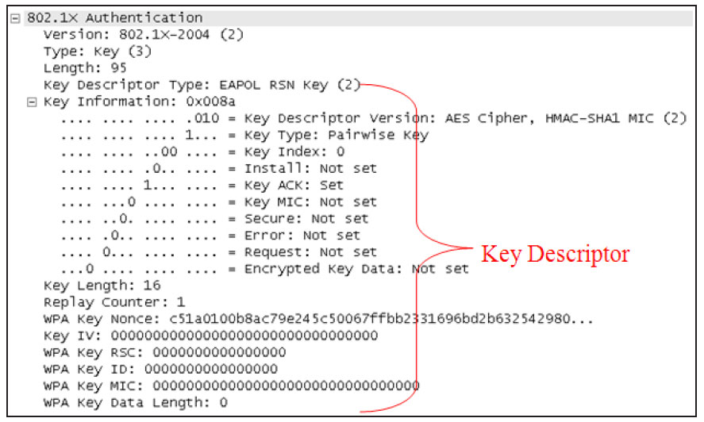

图4-38MessageA的内容图4-38中，KeyInformation字段的内容如图4-39所示。

图4-39KeyInformation字段如图4-39所示：

❑KeyDescriptorVersion：用于指示KeyDescriptor的版本号。当值为2时，表示KeyDescriptor的KeyData用AES加密，而KeyMIC由HMAC-SHA1算法计算而来。

❑KeyType：值为1，表示该帧用于PTK派生，值为0表示该帧用于GTK派生。

❑Reserved：该字段必须为0（图4-38中，该字段也被称为KeyIndex）​。

❑Insta：当KeyType为1时，Insta值为1表示STA需要安装PTK（将PTK传给驱动，下文源码分析时将看到相关函数）​。KeyType为0时，Insta必须为0。

❑KeyACK：AP发送EAPOL-Key帧给STA时，如果需要STA发送回复数据，则设置其为1。

❑KeyMIC：如果EAPOL-Key帧包含MIC信息，其值被设为1，否则为0。

❑Secure：当STA或AP派生出了PTK或GTK后，STA或AP发出的EAPOL-Key帧将该值设为1。

❑Error：使用TKIP时，如果STA检查到MIC错误，则设置该值为1。对于其他情况下的MIC错误，该值和Request都必须被设为1。

❑Request：STA请求AP发起4-WayHandshake（KeyType同时被设为1）或者GroupKeyHandshake（KeyType同时被设为0）流程时，其值被设为1。或者和Error都被设为1以报告MIC错误。

❑EncryptedKeyData：表示KeyData是否加密。

❑SMK：Station-to-stationlinkMasterKey的缩写，是另外一种Key交换协议。本书不讨论。

同上述介绍，相信读者对KeyDescriptor有了一定的了解。现在马上来介绍四次握手协议中每个EAPOL-Key帧所包含的内容以及接收方的处理逻辑。

MessageA由AP发送给STA，其内容如下。

❑KeyInfo：Error位为0，因为这是第一帧数据。Secure位为0表示该帧没有加密的数据。

KeyMIC为0表示该帧不包含MIC数据。KeyACK位为1表示AP要求STA回复此帧。KeyInsta为0表示现在还无法安装PTK。KeyType设为1表示当前是Pairwise密钥派生。本例中，KeyDescriptionVersion值为2。

❑ReplayCounter：本例中它被设为1。STA需要保存这个值以检测重放攻击。

❑KeyNonce：AP生成的随机数，也叫ANonce。

❑由于本帧不包含Key信息，所以其他字段都设为0。

提醒802.11规范中指出，MessageA的KeyData可以携带PMKID信息（包含在RSNIE或其他厂商自定义的IE中）​。不过本例中，MessageA没有携带它。

STA收到MessageA的处理逻辑如下。

1）生成一个Nonce，也叫SNonce。

2）派生PTK。

3）构造第二个EAPOL-Key帧，称为MessageB。

图4-40为MessageB的截图。

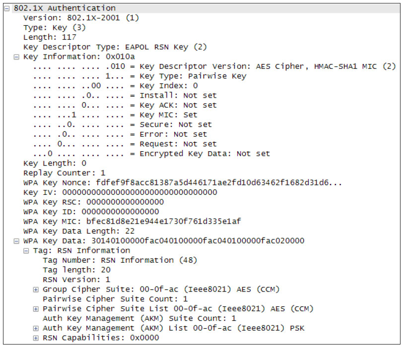

图4-40MessageB的内容如图4-40所示：

❑由KeyInfo的设置可知该帧包括MIC数据（KeyMIC位为1）​。

❑ReplayCounter的值必须等于MessageA中的ReplayCounter。

❑KeyMIC是对整个EAPOL-Key帧进行计算而来，计算方法由KeyDescriptorVersion指定（图4-40中的HMAC-SHA1MIC方法）​。

❑KeyData包含一个RSNInformationElement。该RSNIE来自STA之前和AP在关联操作时获得的RSNIE。规范没有说明为何此处要包含RSNIE。不过[23]倒是有一句简单的说法。即为了防止STA中途更改安全参数。

AP收到MessageB的处理如下。

1）派生PTK。

2）检查MessageB的MIC值是否正确。如果发现MIC错误，则丢弃（而且是silently）

MessageB。

这种情况下，4-WayHandshake流程已经被中断。如果MIC正确，AP将构造第三个EAPOL-Key帧，此处称为MessageC，其内容如图4-41所示。

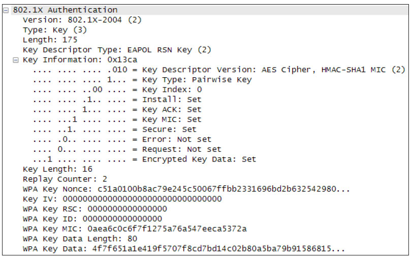

图4-41MessageC的内容由图4-41可知：

❑Insta为1，表示STA收到该帧后就可以安装PTK了。Secure为1表示AP已经派生了PTK。EncrptedKeyData为1，表示KeyData被加密了。

❑ReplayCounter为2，比前面的值增加1。

❑KeyNonce值和MessageA的一样。

❑MIC对EAPOL-Key整个进行计算得来。

❑KeyIV为0。注意，如果KeyDescriptorVersion为2时，该字段必须为0。否则可以是其他随机数。

❑KeyData由PTK加密后而来。其解密后的内容包括AP在ProbeResponse或Beacon帧包含RSNIE信息，另外还有可能包括GTK信息。如果有GTK的话，4-WayHandshake完毕后就无须开展GroupKeyHandshake流程。

STA收到MessageC的处理如下。

1）检查ReplayCounter，计算MIC以及利用自己的PTK解密KeyData以获取RSNIE。

2）如果MessageC包含GTK信息，则取出GTK。注意，GTK以及和Key相关的信息存储在KDE（KeyDataElement）的IE中。关于KDE和GTK的格式，请读者继续阅读下文。

3）构造并发送最后一个EAPOL-Key帧，称为MessageD。

4）为Driver安装PTK。

MessageD的内容如图4-42所示。由图可知，ReplayCounter和MessageC一样。

MIC通过对EAPOL-Key整个进行计算得来。

AP收到MessageD的处理如下。

1）再次计算MIC，如果正确则为driver安装PTK。

2）更新ReplayCounter，如果以后需要更新Key，则使用一个不同的ReplayCounter。

至此，4-WayHandshake成功完成，而AP和STA以后的单播数据将全部通过PTK进行加密。这就使得我们无法通过AirPcap解析GroupKeyHandshake数据包。关于GroupKeyHandshake的流程请看参考资料[22]​[23]​。

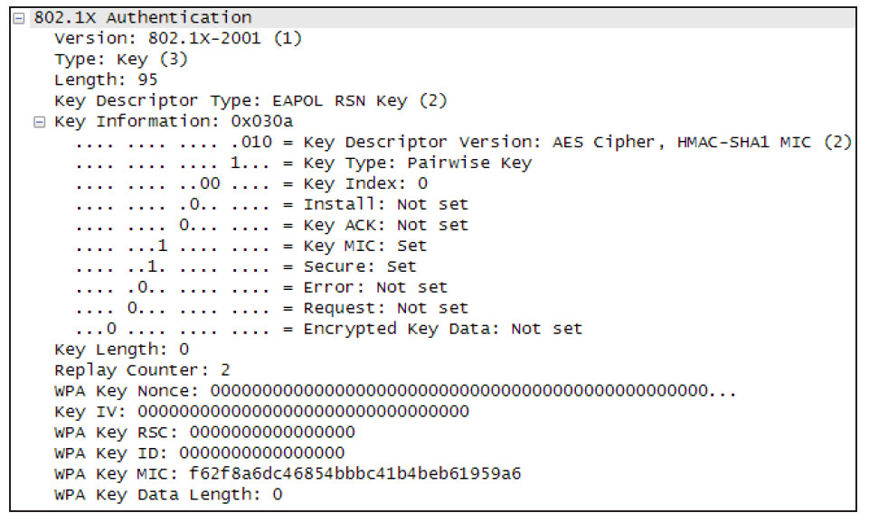

图4-42MessageD的内容根据前文所述，AP在MessageC中可以携带GTK信息。这样4-WayHandshake完毕后，STA无须开展GroupKeyHandshake。

注意经过测试，有些AP每次在4-WayHandshake完毕后就发起GroupKeyHandshake，而有些AP在MessageC中直接包含了GTK，这样就避免了GroupKeyHandshake。接下来的代码分析以后一种情况为目标。

另外，请注意图3-47，该图展示了PTK的组成。以CCMP为例，PTK包含三个部分，分别是KCK、KEK和TK。其中KCK用来处理MIC字段，KEK用来处理KeyData字段，而TK则用于握手协议完毕后的数据加密。

介绍完背景知识后，马上来研究wpa_sm_rx_eapol函数，它是不是遵守了规范所描述的流程呢？

（2）wpa_sm_rx_eapol函数在分析代码之前，先介绍两个重要的数据结构，如图4-43所示。

❑structieee802_1x_hdr为EAPOL帧头信息。

❑structwpa_eapol_key为EAPOL-Key帧的数据信息。

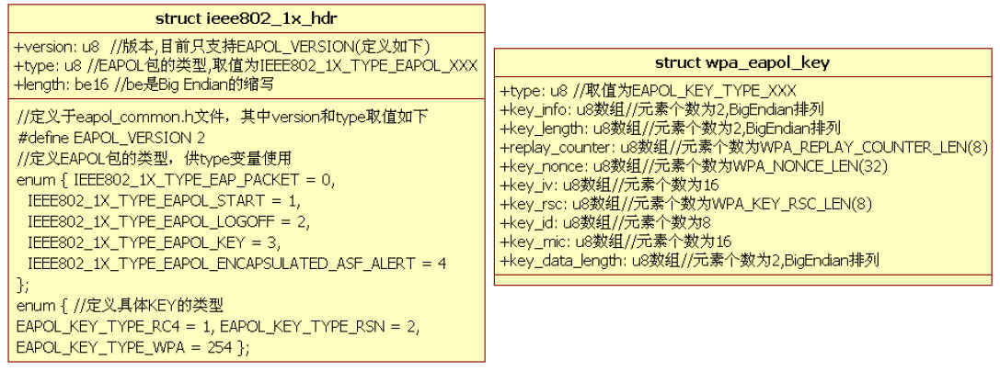

图4-43EAPOL-Key帧对应的数据结构

```
int wpa_sm_rx_eapol(struct wpa_sm *sm, const u8 *src_addr,
                   const u8 *buf, size_t len)
{
    size_t plen, data_len, extra_len;
    struct ieee802_1x_hdr *hdr;  struct wpa_eapol_key *key;
    u16 key_info, ver;  u8 *tmp;  int ret = -1;
    struct wpa_peerkey *peerkey = NULL;
    ......// 参数检查
    tmp = os_malloc(len);  os_memcpy(tmp, buf, len);
    hdr = (struct ieee802_1x_hdr *) tmp;
    key = (struct wpa_eapol_key *) (hdr + 1);
    plen = be_to_host16(hdr-＞length);
    data_len = plen + sizeof(*hdr);
    // 检查EAPOL-Key帧的类型
    if (hdr-＞version ＜ EAPOL_VERSION) { }
    if (hdr-＞type != IEEE802_1X_TYPE_EAPOL_KEY)// 本函数只处理EAPOL-Key帧
    {  ret = 0; goto out;}
    if (key-＞type != EAPOL_KEY_TYPE_WPA && key-＞type != EAPOL_KEY_TYPE_RSN) {
        ret = 0; goto out;  // 只处理key类型为WPA和RSN的情况
    }
    /*
    通知lowerLayerSuccess。该函数最后一个参数表示此次调用是否来自EAPOL模块内部，
    由于wpa_sm_rx_eapol并非EAPOL模块内部，所以该参数为0。
    */
    eapol_sm_notify_lower_layer_success(sm-＞eapol, 0);
    // 取出Key Information字段，并保存到key_info变量中
    key_info = WPA_GET_BE16(key-＞key_info);
    ver = key_info & WPA_KEY_INFO_TYPE_MASK; // 获取key descriptor version
    if (ver != WPA_KEY_INFO_TYPE_HMAC_MD5_RC4 &&  ver !=
               WPA_KEY_INFO_TYPE_HMAC_SHA1_AES)
        goto out; // 根据规范的要求做相应处理
     ......// CONFIG_IEEE80211R和CONFIG_IEEE80211W的处理
    // 加密算法兼容性检查
    if (sm-＞pairwise_cipher==WPA_CIPHER_CCMP&&ver!=
                              WPA_KEY_INFO_TYPE_HMAC_SHA1_AES){
        // 下面这个if判断用于检查组播数据加密设置是否正确
        if(sm-＞group_cipher!=WPA_CIPHER_CCMP&&!(key_info&WPA_KEY_INFO_KEY_TYPE)){
        ......// 打印一句兼容性警告
        } else    goto out;
    }
    ......// CONFIG_PEERKEY处理。PeerKey对应peerkey handshake流程，它和IEEE802.11e DLS有关
    // 检查Replay Counter，如果收到的Replay Counter比之前接收的值小，则丢弃该帧
    if (!peerkey && sm-＞rx_replay_counter_set && os_memcmp(key-＞replay_counter,
               sm-＞rx_replay_counter, WPA_REPLAY_COUNTER_LEN) ＜= 0)  goto out;
    // STA收到的EAPOL-Key帧必须设置ACK位或SMK位为1
    if (!(key_info & (WPA_KEY_INFO_ACK | WPA_KEY_INFO_SMK_MESSAGE)) )  goto out;
    // 只有STA向AP发送的EAPOL-Key帧才能设置Request位
    if (key_info & WPA_KEY_INFO_REQUEST)   goto out;
      /*
      MIC位不为0，则需要解析MIC数据。对STA来说，只有Message C会携带MIC信息。
      wpa_supplicant_verify_eapol_key_mic比较简单，请读者自行阅读它。其功能是：STA
      根据KCK计算MIC，然后将其和接收到的MIC进行比较。如果MIC值检查正常，则PTK正确。
      */
    if ((key_info & WPA_KEY_INFO_MIC) && !peerkey &&
        wpa_supplicant_verify_eapol_key_mic(sm, key, ver, tmp, data_len))  goto out;
    extra_len = data_len - sizeof(*hdr) - sizeof(*key);
    if (WPA_GET_BE16(key-＞key_data_length) ＞ extra_len)  goto out;// 参数检查
    extra_len = WPA_GET_BE16(key-＞key_data_length);
      // Encrpted Key Data位为1，表示该帧包含加密数据，需要利用KEK进行解密
      // 该函数也比较简单，请读者自行阅读
      if (sm-＞proto == WPA_PROTO_RSN &&  (key_info & WPA_KEY_INFO_ENCR_KEY_DATA)) {
        if (wpa_supplicant_decrypt_key_data(sm, key, ver))  goto out;
        extra_len = WPA_GET_BE16(key-＞key_data_length);
    }
    // Key Info Type值为1，表示为Pairwise Key。值为0表示Group Key
    if (key_info & WPA_KEY_INFO_KEY_TYPE) {
        if (key_info & WPA_KEY_INFO_KEY_INDEX_MASK)     goto out;
        if (peerkey) {   peerkey_rx_eapol_4way(sm, peerkey, key, key_info, ver);
        } else if (key_info & WPA_KEY_INFO_MIC) {// 对STA而言，只有Message C包含MIC信息
            wpa_supplicant_process_3_of_4(sm, key, ver);// 处理Message C
        } else {// 处理Message A
            wpa_supplicant_process_1_of_4(sm, src_addr, key, ver);
        }
    }else if (key_info & WPA_KEY_INFO_SMK_MESSAGE) {// SMK的情况
        peerkey_rx_eapol_smk(sm, src_addr, key, extra_len, key_info, ver);
    }else {// Group Key Handshake处理
        if (key_info & WPA_KEY_INFO_MIC) {// 组播密钥交换。本章不讨论此函数
            wpa_supplicant_process_1_of_2(sm, src_addr, key,extra_len, ver);
        } else  ......// 打印一句警告
    }
    ret = 1;
out:
    os_free(tmp);
    return ret;
}
```

wpa_sm_rx_eapol代码如下所示。

[--＞wpa.c：​：wpa_sm_rx_eapol]wpa_sm_rx_eapol的流程比较简单，就是先

```c
static void wpa_supplicant_process_1_of_4(struct wpa_sm *sm,
                      const unsigned char *src_addr,
                      const struct wpa_eapol_key *key, u16 ver)
{
    struct wpa_eapol_ie_parse ie;   struct wpa_ptk *ptk;
    u8 buf[8];      int res;
    if (wpa_sm_get_network_ctx(sm) == NULL) {......// 错误处理}
    wpa_sm_set_state(sm, WPA_4WAY_HANDSHAKE); // 设置状态为WPA_4WAY_HANDSHAKE
    os_memset(&ie, 0, sizeof(ie));
#ifndef CONFIG_NO_WPA2
    if (sm-＞proto == WPA_PROTO_RSN) {
        const u8 *_buf = (const u8 *) (key + 1);// buf中是已经解密的Key Data数据
        size_t len = WPA_GET_BE16(key-＞key_data_length);
        // 解析Message A中包含的RSN信息。对本例而言，Message A中没有RSN信息
        if (wpa_supplicant_parse_ies(_buf, len, &ie) < 0)    goto failed;
    }
#endif /* CONFIG_NO_WPA2 */
    // 如果根据RSN IE中的pmkid判断是否有PMKSA缓存项。本例没有RSN IE，所以不存在ie.pmkid
    res = wpa_supplicant_get_pmk(sm, src_addr, ie.pmkid);
    if (res == -2) return;
    if (res)
        goto failed;
    // 结合前面对背景知识的描述，STA需要创建自己的Nonce
    if (sm-＞renew_snonce) {
        if (random_get_bytes(sm-＞snonce, WPA_NONCE_LEN)) goto failed;
        sm-＞renew_snonce = 0;
    }
    /*
    tptk变量存储的是临时PTK，因为现在还不确定PTK是否正确。注意，当收到Message C时，
    wpa_sm_rx_eapol的wpa_supplicant_verify_eapol_key_mic函数将把sm-＞tptk的内容复制到
    sm-＞ptk变量中作为正式的ptk存储。
    */
    ptk = &sm-＞tptk;
    wpa_derive_ptk(sm, src_addr, key, ptk);// 派生PTK并将结果保存到tptk变量中
    os_memcpy(buf, ptk-＞u.auth.tx_mic_key, 8);
    os_memcpy(ptk-＞u.auth.tx_mic_key, ptk-＞u.auth.rx_mic_key, 8);
    os_memcpy(ptk-＞u.auth.rx_mic_key, buf, 8);
    sm-＞tptk_set = 1; // tptk_set为1表示临时PTK存在
    // 构造并发送Message B。请读者结合参考资料[23]来研究此函数
    if (wpa_supplicant_send_2_of_4(sm, sm-＞bssid, key, ver, sm-＞snonce,
                  sm-＞assoc_wpa_ie, sm-＞assoc_wpa_ie_len, ptk))  goto failed;
    // 包括AP的Nonce信息
    os_memcpy(sm-＞anonce, key-＞key_nonce, WPA_NONCE_LEN);
    return;
failed:
    wpa_sm_deauthenticate(sm, WLAN_REASON_UNSPECIFIED);
}
```

处理EAPOL-Key的基本信息（如计算MIC、解密KeyData）​，然后根据情况处理MessageA、MessageC或者GroupKeyHandshake的Message1。

由于本例不涉及GroupKeyHandshake流程，所以下面将介绍MessageA及MessageC的处理过程。

（3）wpa_supplicant_process_1_of_4函数wpa_supplicant_process_1_of_4用于处理MessageA，其代码如下所示。

[--＞wpa.c：​：

wpa_supplicant_process_1_of_4]STA将MessageB发送出去后，AP将接收到它并根据AP的处理逻辑进行处理。假设一切顺利，AP将构造并发送MessageC给STA。

STA依然在wpa_sm_rx_eapol中处理MessageC，其过程如下。

1）由于MessageC包含MIC以及KeyData数据，故它们将在wpa_sm_rx_eapol中的wpa_supplicant_verify_eapol_key_mic及wpa_supplicant_decrypt_key_data被处理。这两个函数的代码请感兴趣的读者自行阅读。

2）接下来调用wpa_supplicant_process_3_of_4。这是我们分析的重点。

（4）wpa_supplicant_process_3_of_4函数wpa_supplicant_process_3_of_4的代码如下所示。

[--＞wpa.c：​：

```c
static void wpa_supplicant_process_3_of_4(struct wpa_sm *sm,
                      const struct wpa_eapol_key *key, u16 ver)
{
    u16 key_info, keylen, len;
    const u8 *pos;    struct wpa_eapol_ie_parse ie;
    wpa_sm_set_state(sm, WPA_4WAY_HANDSHAKE);// 还是处于WPA_4WAY_HANDSHAKE状态
    key_info = WPA_GET_BE16(key-＞key_info);
    pos = (const u8 *) (key + 1);
    len = WPA_GET_BE16(key-＞key_data_length);
    /*
    解析Message C中包含的IE信息。注意，key data中的数据已经由wpa_supplicant_decrypt_key_data
    解密过了。
    */
    if (wpa_supplicant_parse_ies(pos, len, &ie) < 0) goto failed;
    if (ie.gtk && !(key_info & WPA_KEY_INFO_ENCR_KEY_DATA))   goto failed;
    ......// CONFIG_IEEE80211W
    // 校验RSN信息。该校验似乎也是为了防止安全设置项中途发生改变
    if (wpa_supplicant_validate_ie(sm, sm-＞bssid, &ie) < 0)   goto failed;
    // 比较Message A和Message C中的Nonce值
    if (os_memcmp(sm-＞anonce, key-＞key_nonce, WPA_NONCE_LEN) != 0)
        goto failed;
    keylen = WPA_GET_BE16(key-＞key_length);
    ......// 参数检查
    // 构造并发送Message D，请读者自行阅读该函数
    if (wpa_supplicant_send_4_of_4(sm, sm-＞bssid, key, ver, key_info,
                      NULL, 0, &sm-＞ptk)) goto failed;
    sm-＞renew_snonce = 1;
    /*
     调用driver_nl80211的wpa_driver_nl80211_set_key函数将key发给驱动。以后，所有
     无线网络数据都将被加密。另外，如果wpa_supplicant.conf文件配置wpa_ptk_rekey
     （用来控制PTK的生命周期，时间为秒）时，该函数内部还将注册一个超时函数wpa_sm_rekey_ptk。一旦
     wpa_ptk_rekey到期，STA将重新和AP开展4-Way Handshake以重新派生新的PTK。
     请读者自行阅读wpa_supplicant_install_ptk函数。
    */
    if (key_info & WPA_KEY_INFO_INSTALL) // 安装Key
        if (wpa_supplicant_install_ptk(sm, key))   goto failed;
    // Message C必须设置Secure位
    if (key_info & WPA_KEY_INFO_SECURE) {
        // 下面这个函数和管理帧加密有关系
        wpa_sm_mlme_setprotection(sm, sm-＞bssid, MLME_SETPROTECTION_PROTECT_TYPE_RX,
            MLME_SETPROTECTION_KEY_TYPE_PAIRWISE);
        eapol_sm_notify_portValid(sm-＞eapol, TRUE);// 设置EAPOL SM portValid为TRUE
    }
    wpa_sm_set_state(sm, WPA_GROUP_HANDSHAKE); // 设置状态为WPA_GROUP_HANDSHAKE
    // 对本例而言，Message C中包含了GTK信息
    if (ie.gtk && wpa_supplicant_pairwise_gtk(sm, key,
                           ie.gtk, ie.gtk_len, key_info) < 0) goto failed;
    // 和IEEE80211W有关。本书不讨论它
    if (ieee80211w_set_keys(sm, &ie) < 0) goto failed;
    /*
     下面这个函数将调用driver wrapper的set_rekey_info函数。该函数和GTK的更新有关。
     它对应以下应用场景。
     当某STA因为省电或别的什么原因进入休眠状态时，如果AP在STA休眠过程中更新了GTK。当该STA
     醒来时，其组播消息密钥肯定失效了。这种情况该如何处理呢？通过set_rekey_info函数，我们可
     将该工作交给wlan芯片来完成。即由wlan芯片来负责处理EAPOL-Key帧交换以更新GTK。注意，
     如果wlan driver不支持该功能，它将唤醒STA，并将该工作交给WPAS来完成。
     这部分功能属于WoWLAN（无线局域网唤醒）机制的一部分，目前只有很少的系统支持它。读者可阅读
     参考资料[24][25]以加深对WoWLAN的认识。
    */
    wpa_sm_set_rekey_offload(sm);
    return;
failed:
    wpa_sm_deauthenticate(sm, WLAN_REASON_UNSPECIFIED);
}
```

wpa_supplicant_process_3_of_4]wpa_supplicant_process_3_of_4代码逻辑和背景知识介绍中关于MessageC的处理逻辑大体一致。对于包含GTK信息的MessageC来说，wpa_supplicant_pairwise_gtk将被调用以处理GTK对应的KDE信息。马上来看此函数。

（5）wpa_supplicant_pairwise_gtk函数介绍wpa_supplicant_pairwise_gtk之前，先来看看KDE和GTK的格式，如图4-44所示。

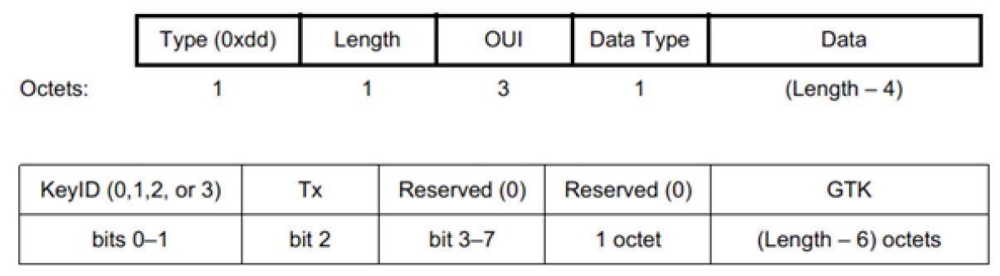

```java
static int wpa_supplicant_pairwise_gtk(struct wpa_sm *sm,
                       const struct wpa_eapol_key *key,
                       const u8 *gtk, size_t gtk_len,  int key_info)
{
#ifndef CONFIG_NO_WPA2
    struct wpa_gtk_data gd;
    os_memset(&gd, 0, sizeof(gd));
    if (gtk_len < 2 || gtk_len - 2 ＞ sizeof(gd.gtk))    return -1; // 参数检查
    gd.keyidx = gtk[0] & 0x3;
    // 下面这个函数对图4-44中的Tx位进行一些处理
    // 它对某些AP错误设置Tx位的情况采取了“绕过去”的策略
    gd.tx = wpa_supplicant_gtk_tx_bit_workaround(sm,!!(gtk[0] & BIT(2)));
    gtk += 2; gtk_len -= 2;
    os_memcpy(gd.gtk, gtk, gtk_len);
    gd.gtk_len = gtk_len;
    // 检查组播数据加密设置是否合适，然后调用wpa_supplicant_install_gtk函数安装GTK
    if (wpa_supplicant_check_group_cipher(sm, sm-＞group_cipher, gtk_len, gtk_len,
                          &gd.key_rsc_len, &gd.alg) ||
        wpa_supplicant_install_gtk(sm, &gd, key-＞key_rsc))   return -1;
    // 最后一个关键函数
    wpa_supplicant_key_neg_complete(sm, sm-＞bssid,key_info & WPA_KEY_INFO_SECURE);
    return 0;
#else
    return -1;
#endif
}
```

图4-44KDE和GTK格式图4-44中，上图为KDE的格式，其中Type取值为0xdd。Data包含具体的信息。当Data中的信息为GTK时，OUT取值为00-0F-AC，DataType取值为1。下图为GTK的格式。

KeyID字段可取值有0～3共4个，它和动态Key有关。Tx字段为1，表示发送和接收组播数据都需要使用该GTK。值为0表示仅接收组播数据需要使用该GTK。

[--＞wpa.c：​：

wpa_supplicant_pairwise_gtk]

```c
static void wpa_supplicant_key_neg_complete(struct wpa_sm *sm,const u8 *addr, int secure)
{
    wpa_sm_cancel_auth_timeout(sm);// 取消超时任务
    // 该函数内部将调用wpa_supplicant.c中的wpa_supplicant_set_state。请读者自行阅读
    // 不光是一个简单的设置状态，它还需要调用driver的set_supp_port函数
    wpa_sm_set_state(sm, WPA_COMPLETED);// 设置WPAS的状态为WPA_COMPLETED
    if (secure) {// secure为1
        wpa_sm_mlme_setprotection( sm, addr, MLME_SETPROTECTION_PROTECT_TYPE_RX_TX,
            MLME_SETPROTECTION_KEY_TYPE_PAIRWISE);
        eapol_sm_notify_portValid(sm-＞eapol, TRUE);
        if (wpa_key_mgmt_wpa_psk(sm-＞key_mgmt))// 本例采用了PSK认证，故可以通知eapSuccess
            eapol_sm_notify_eap_success(sm-＞eapol, TRUE);
        eloop_register_timeout(1, 0, wpa_sm_start_preauth, sm, NULL);
    }
    if (sm-＞cur_pmksa && sm-＞cur_pmksa-＞opportunistic)
        sm-＞cur_pmksa-＞opportunistic = 0;
    ......// CONFIG_IEEE80211R
}
```

上述代码中，请读者自行阅读除wpa_supplicant_key_neg_complete外的其他几个函数。下面来看最后一个关键函数。

[--＞wpa.c：​：

wpa_supplicant_key_neg_complete]至此，4-WayHandshake的处理就全部完成。而802.1X中Port的状态以及WPAS的状态则由此过程中相关的函数触发以发生转换。下一节将简单介绍这部分的内容。

（6）WPAS状态机变化上述4-WayHandshake处理流程节中，EAPOL模块、EAP模块以及WPAS的状态都会发生对应的转换。在上述wpa_supplicant_key_neg_complete中，wpa_sm_set_state将设置WPAS的状态为WPA_COMPLETED。马上来看wpa_sm_set_state的代码，如下所示。

[--＞wpa_i.h：​：wpa_sm_set_state]

```c
static inline void wpa_sm_set_state(struct wpa_sm *sm, enum wpa_states state)
{
    /*
    调用回调函数。由4.3.4节的wpa_supplicant_init_wpa函数中设置，其真实函数为
    _wpa_supplicant_set_state，而该函数又会调用wpa_supplicant_set_state。
    */
    sm-＞ctx-＞set_state(sm-＞ctx-＞ctx, state);
}
```

wpa_sm_set_state将调用前面设置的回调函数进行处理。

最终的处理函数wpa_supplicant_set_state如下所示。

[--＞wpa_supplicant.c：​：

```c
void wpa_supplicant_set_state(struct wpa_supplicant *wpa_s,
                  enum wpa_states state)
{
    enum wpa_states old_state = wpa_s-＞wpa_state;
    ......
    if (state == WPA_COMPLETED && wpa_s-＞new_connection) {
#if defined(CONFIG_CTRL_IFACE) || !defined(CONFIG_NO_STDOUT_DEBUG)
         struct wpa_ssid *ssid = wpa_s-＞current_ssid;
#endif
         wpa_s-＞new_connection = 0;
         wpa_s-＞reassociated_connection = 1;
         /*
         设置driver的IfOperStatus为IF_OPER_UP，driver nl80211中对应的函数是
         wpa_driver_nl80211_set_operstate。
         */
         wpa_drv_set_operstate(wpa_s, 1);
#ifndef IEEE8021X_EAPOL
         /*
         以driver nl80211来说，下面这个函数将调用wpa_driver_nl80211_set_supp_port
         以设置驱动中STA的标志为NL80211_STA_FLAG_AUTHENTICATED。
         */
         wpa_drv_set_supp_port(wpa_s, 1);
#endif /* IEEE8021X_EAPOL */
        wpa_s-＞after_wps = 0;
   } else if (state == WPA_DISCONNECTED || state == WPA_ASSOCIATING ||
           state == WPA_ASSOCIATED) {
       wpa_s-＞new_connection = 1;// ASSOCIATING或ASSOCIATED状态下，new_connection被置为1
       wpa_drv_set_operstate(wpa_s, 0);// 设置driver的IfOperStatus为IF_OPER_DORMANT
#ifndef IEEE8021X_EAPOL
        wpa_drv_set_supp_port(wpa_s, 0);// 取消STA的NL80211_STA_FLAG_AUTHENTICATED标志
#endif /* IEEE8021X_EAPOL */
    }
    wpa_s-＞wpa_state = state;
    .......
}
```

wpa_supplicant_set_state]当WPAS的状态变成WPA_COMPLETED后，还需要设置driver的IfOperStatus以及NL80211_STA_FLAG_AUTHENTICATED标志位。如此这般，WPAS才算和Driver上下同心。

（7）EAPOL/EAP状态机变化在4-WayHandshake过程中，EAPOL/EAP状态机也会发生变化。在4.5.3节eapol_sm_notify_portEnabled函数分析的最后，已知EAPOL/EAP状态机的状态分别如下。

❑SUPP_PAE进入CONNECTING状态；

```java
void eapol_sm_notify_eap_success(struct eapol_sm *sm, Boolean success)
{
    if (sm == NULL) return;
    sm-＞eapSuccess = success;
    sm-＞altAccept = success;
    if (success)   eap_notify_success(sm-＞eap);
    eapol_sm_step(sm);// 状态机联动
}
// 直接来看eap_notify_success函数
void eap_notify_success(struct eap_sm *sm)
{
    if (sm) {
        sm-＞decision = DECISION_COND_SUCC;
        sm-＞EAP_state = EAP_SUCCESS;// EAP_SM状态直接被设置为EAP_SUCCESS
    }
}
```

❑KEY_RX不变（NO_KEY_RECEIVE）​；

❑SUPP_BE进入IDLE状态；

❑EAP_SM不变（DISABLED状态）​。

在4-WayHandshake过程中，一共有两个和EAPOL相关的函数被调用：

eapol_sm_notify_portValid函数portValid被设为TRUE。eapol_sm_notify_eap_success函数代码如下所示。

[--＞eapol_supp_sm.c：​：

根据4.4.2节状态机联动中对eapol_sm_stepeapol_sm_notify_eap_success]的分析，四个状态机更新的顺序分别是SUPP_PAE、KER_RX、SUPP_BE和EAP_SM。分别结合四个状态机的切换图，我们可知第一轮循环中：

❑eapSuccess将先触发SUPP_PAE进入AUTHENTICATING状态，该状态对应的EA将设置suppStart为TRUE。

❑eapSuccess和suppStart将触发SUPP_BE进入SUCCESS状态，该状态对应的EA将设置keyRun和suppSuccess为TRUE。

❑EAP_SM状态在eap_notify_success中直接被置为EAP_SUCCESS。但在状态切换中，由于force_disabled变量为TRUE，导致EAPSUPPSM将直接转回DISABLED状态（和4.4.2节介绍的状态机联动的情况类似）​。

❑KER_RX状态不变。

由于上述状态机均有状态变化，下面进入第二轮循环：

❑suppSuccess和portValid为TRUE将触发SUPP_PAE进入AUTHENTICATED状态（由于

```c
SM_STATE(SUPP_PAE, AUTHENTICATED)
{
    SM_ENTRY(SUPP_PAE, AUTHENTICATED);
    sm-＞suppPortStatus = Authorized;
    // 也会调用wpa_drv_set_supp_port函数
    eapol_sm_set_port_authorized(sm);
    /*
    设置cb_status为EAPOL_CB_SUCCESS，将触发eapol_sm_step在退出前调用
    wpa_supplicant_eapol_cb，此函数对于WPA/RSN企业认证法有重要作用。请读者自行阅读。
    */
    sm-＞cb_status = EAPOL_CB_SUCCESS;
}
```

条件变量不会再改变，故SUPP_PAE将不再发生状态变化）​。该状态的EA见下文代码。

❑由于UCT的存在，SUPP_BE将跳转到IDLE状态。

❑KEY_RX和EAP_SM状态保持不变。

以下是SUPP_PAE的EA代码。

[--＞eapol_supp_sm.c：​：SM_STATE（SUPP_PAE，AUTHENTICATED）​]

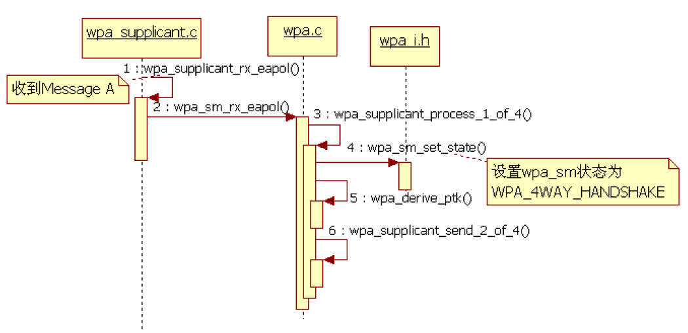

图4-45MessageA处理流程

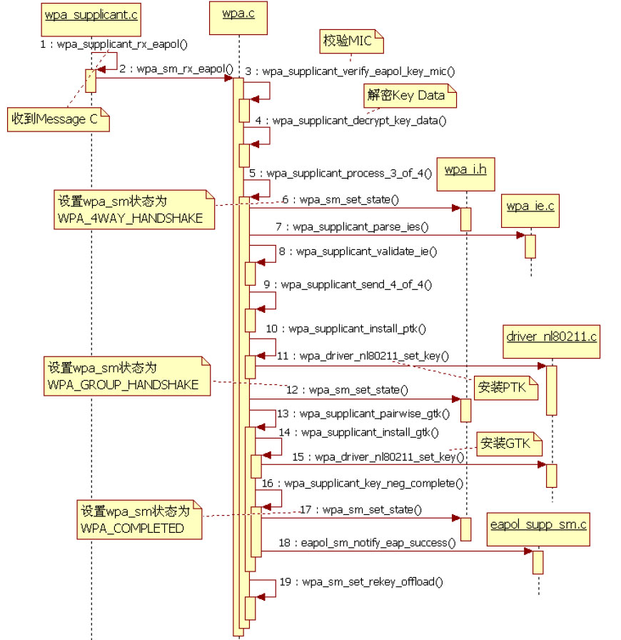

请读者结合SUPP_PAE和SUPP_BE的状态切换图来理解上述的状态变化过程。

至此，STA就通过了AP的身份验证。下一步的工作就是dhcpcd从AP那获取一个IP，然后手机就可以上网了。

图4-46MessageC处理流程（8）EAPOL-Key交换流程总结图中分别为4-WayHandshake中MessageA与MessageC的处理流程。其中，Message下面总结4-WayHandshake的流程，如图4-C还携带了GTK信息，这样就无须GroupKey45和图4-46所示。

Handshake了。
