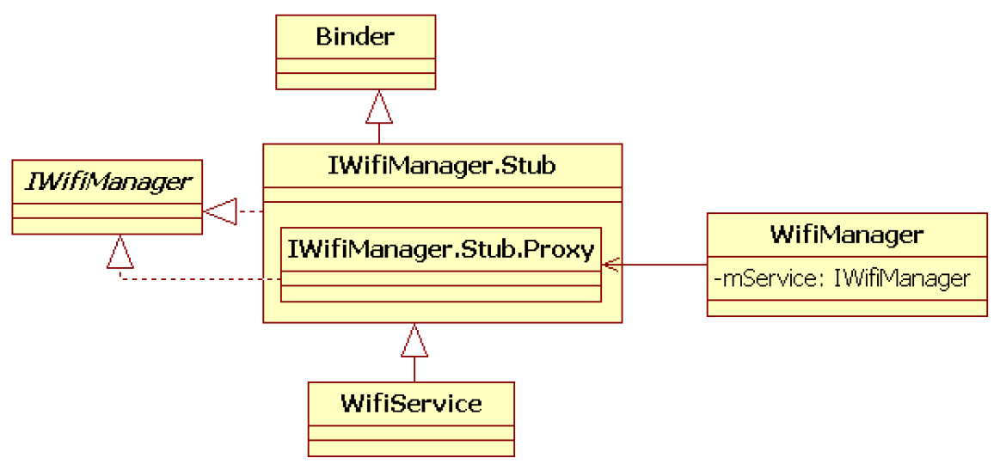

# 5.1 概述

WifiService是AndroidJavaFramework中负责Wi-Fi功能的核心服务。它主要借助wpa_supplicant（以后简称WPAS）来管理和控制Android平台中的Wi-Fi功能。虽然WPAS才是Android平台中整个Wi-Fi模块的真正核心，但WifiService作为JavaFramework中Wi-Fi功能的总入口，其重要性也不言而喻。

同WPAS的分析类似，本节也将通过两条路线来研究WifiService。

线路一：WifiService的创建及初始化。

线路二：在Settings中打开Wi-Fi功能、扫描无线网络及加入目标无线网络。

最后，我们还将介绍WifiWatchdogStateMachine和CaptivePortalCheck这两个颇有意思的知识点。

图5-1所示为WifiService及WifiManager的类图结构。

图5-1WifiService和WifiManager类图结构图5-1中：

❑IWifiManager、IWifiManager.Stub和IWifiManager.Stub.Proxy类均由IWifiManager.aidl文件在编译时通过aidl工具转换而来。

❑WifiService派生自IWifiManager.Stub类，它是Binder服务端。

❑WifiManager是WifiService的客户端。它通过成员变量mService和WifiService进行Binder交互。

注意建议对Binder不熟悉的读者阅读《深入理解Android：卷Ⅰ》第6章和《深入理解Android：卷Ⅱ》第2章。

下面来分析路线一，即WifiService的创建及初始化分析。
