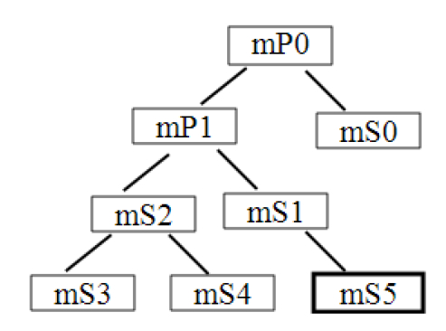

# 5.2.1 HSM和AsyncChannel介绍


象。而Java中子类则从其父类派生，实际使用时创建一个子类对象即可，该子类对象就能完成父类的工作。

❑AsyncChannel用于两个Handler之间的通信。具体的通信方式为源Handler通过sendMessage向目标Handler发送消息，而目标Handler通过replyToMessage回复源Handler处理结果。注意，这两个Handler可位于同一个进程，也可分属两个不同的进程。

本节先来介绍HSM。

注意由于HSM和AsyncChannel并非本书的主题，故本章仅介绍它们的用法。对实现原理感兴趣的读者不妨在了解它们用法的基础上，自行研究相关代码。

```
// 此例来源于StateMachine.java文件中的注释
// StateMachineTest是StateMachine的子类
  class StateMachineTest extends StateMachine {
    StateMachineTest(String name) {
    super(name);
    // 为状态机添加一个状态。代码中一般用缩进的方式表达层级关系
    addState(mP0);
      // 添加一个状态mS0，其父状态为mP0
      addState(mS0, mP0);
      addState(mP1, mP0);
          addState(mS1,mP1); // 添加一个状态mS1，其父状态为mP1
              addState(mS5,mS1)
          addState(mS2, mP1);
              addState(mS3, mS2);
              addState(mS4, mS2);
      // setInitialState函数用于设置状态机的初始状态，本例中该状态是mS5
      setInitialState(mS5);
      }// StateMachineTest构造函数结束
```

1.HSM使用HSM对应的类叫StateMachine，下面通过一个例子来介绍其用法。

[HSM示例]上述代码中StateMachineTest所涉及的状态及层级关系如图5-2所示。



图5-2HSM示例中状态关系图5-2中，mS5是初始状态，由代码中的setInitialState函数设置。接着来看

```java
// 接上面的代码。P0从State类派生。在HSM中，状态由类State来表达
class P0 extends State {
    /*
      enter代表一个状态的Entry Action，SM进入此状态时将调用其EA。
      exit代表一个状态的Exit Action，SM退出某状态时将调用其EXA。
    */
    public void enter() {......// do sth here}
    public void exit() {......// do sth here}
    /*
      除了EA和EXA外，每个State中最重要的函数就是processMessage了。
      在HSM中，外界和HSM交互的方式就是向其sendMessage。Message由当前State的processMessage
      函数来处理。如果当前State成功处理此message，则返回HANDLED。否则返回NOT_HANDLED。
      在Message处理中，如果子状态返回NOT_HANDLED，则其父状态的processMessage将被调用。
      如果当前状态及祖先状态都不能处理，则HSM的unhandledMessage将被调用。而HSM的派生类
      可重载unhandledMessage函数以处理这个不能被当前状态及祖先状态处理的消息。
    */
      public boolean processMessage(Message message) {
          return HANDLED; // P0能处理任何Message
      }
    }
    class P1 extends State {......// 实现P1的enter,exit和processMessage函数}
    class S0 extends State {......// 实现S0的enter,exit和processMessage函数}
    ......// S1到S4的定义
    class S5 extends State {
        public void enter() {......// 实现S5的enter函数}
        public void exit() { ......// 实现S5的exit函数}
        public boolean processMessage(Message message) {
            switch(message.what){
            case: TRANSITION_CMD:
              transitionTo(mS4);// 切换状态时，需要调用此函数
              break;
            case: TRANSITON_CMD_DEFER_MSG:
              // deferMessage用于保留某个消息。而被保留的消息将留待到下一个状态中去处理
              deferMessage(message);
              transitionTo(mS1);
              break;
            default:
              break;
            }
            return HANDLED;
        }
    }
    ......// StateMachine其他一些可重载函数。以后碰到它们时再介绍
    // 定义各个状态对应的对象
    private P0 mP0 = new P0();  private P1 mP1 = new P1();
    private S0 mS0 = new S0();  private S1 mS1 = new S1();
    private S2 mS2 = new S2();  private S3 mS3 = new S3();
    private S4 mS4 = new S4();  private S5 mS5 = new S5();
  // 定义消息
  final static int TRANSITION_CMD = 0;
  final static int TRANSITON_CMD_DEFER_MSG = 1;
}
// 主函数
public void main() throws Exception {
    StateMachineTest smTest = new StateMachineTest("StateMachineTest");
    smTest.start(); // 启动状态机
    synchronized (sm5) {
       // 外界只能通过obtainMessage以及sendMessage发送消息给SM去执行
        smTest.sendMessage(obtainMessage(TRANSITION_CMD));
        smTest.sendMessage(obtainMessage(TRANSITON_CMD_DEFER_MSG));
        ......
      }
    ......
    }
}
```

StateMachineTest的代码。

[HSM示例]上面代码介绍了HSM中一些重要的API。

❑addState：添加一个状态。同时还可指定父状态。

❑transitionTo：将状态机切换到某个状态。

❑obtainMessage：由于HSM内部是围绕一个Handler来工作的，所以外界只能调用HSM的obtainMessage以获取一个Message。

❑sendMessage：发送消息给HSM。HSM中的Handler会处理它。

❑deferMessage：保留某个消息。该消息将留待下一个新状态中去处理。其内部实现就是把这些被deferred的message保存到一个队列中。当HSM切换到新状态后，这些deferred消息将被移到HSM内部Handler所对应消息队列的头部，从而新状态能首先处理这些deferred消息。

❑start：启动状态机。

❑停止状态机可使用quit或quitNow函数。这两个函数均会发送SM_QUIT_CMD消息给HSM内部的Handler，不过效果略有区别。

当使用quit时，SM_QUIT_CMD添加在消息队列尾；而使用quitNow时，SM_QUIT_CMD被添加到消息队列头。

HSM中状态和状态之间的层级关系体现在哪些方面呢？以上述代码为例：

❑SM启动后，初始状态的EA将按派生顺序执行。即其祖先状态的EA先执行，子状态的EA后执行。以示例代码中的初始状态mS5为例。当HSM的start调用完毕后，EA调用顺序为mP0、mP1、mS1、mS5。

❑当State发生切换时，旧State的exit先执行，新State的enter后执行，并且新旧State派生树上对应的State也需要执行exit或enter函数。以mS5切换到mS4为例，在此切换过程中，首先执行的是EXA，其顺序是mS5，mS1。注意，EXA执行的终点是离mS4和mS5最近的一个公共（即同时是mS4和mS5的祖先）祖先State（此处是mP1）​，但公共祖先状态的EXA不会执行。然后执行的是EA，其顺序是mS2、mS4。同理，公共祖先的EA也不会执行。细心的读者可以发现，HSM中EA和EXA执行顺序和C++类构造/析构函数执行顺序类似。EA执行顺序由祖先类开始直至子孙类，而析构函数的执行先从子孙类开始，直到祖先类。

❑State处理Message时，如果子状态不能处理（返回NOT_HANDLED）​，则交给父状态去处理。这一点也和C++中类的派生函数类似。

HSM的介绍就到此为止，感兴趣的读者可自行研究HSM的实现。

2.AsyncChannel使用AsyncChannel用于两个Handler之间的通信，其用法包含两种不同的应用模式（usagemodel）​。

❑简单的request/response模式下，Server端无须维护Client的信息，它只要处理来自Client的请求即可。连接时，Client调用connectSync（同步连接）或connect（异步连接，连接成功后Client会收到CMD_CHANNEL_HALF_CONNECTED消息）即可连接到Server。

❑与request/response模式相反，AsyncChannel中另外一种应用模式就是Server端维护Client的信息。这样，Server可以向Client发送自己的状态或者其他一些有意义的信息。与这种模式类似的应用场景就是第4章介绍的wpa_cli和wpa_supplicant。

wpa_cli可以发送命令给WPAS去执行。同时，WPAS也会将自己的状态及其他一些消息通知给wpa_cli。

在WifiService相关模块中，第二种应用模式使用得较多。另外，AsyncChannel中Client和Server端在最开始建立连接关系时，可以采用同步或异步的方式。以异步方式为例介绍第二种应用模式中AsyncChannel的使用步骤。

1）Client调用AsyncChannel的connect函数。Client的Handler会收到一个名为CMD_CHANNEL_HALF_CONNECTED消息。

2）Client在处理CMD_CHANNEL_HALF_CONNECTED消息时，需通过sendMessage函数向Server端发送一个名为CMD_CHANNEL_FULL_CONNECTION的消息。

3）Server端的Handler将收到此CMD_CHANNEL_FULL_CONNECTION消息。成功处理它后，Server端先调用AsyncChannel的connected函数，然后通过sendMessage函数向Client端发送CMD_CHANNEL_FULLY_CONNECTED消息（特别注意，详情见下文）​。

4）Client端收到CMD_CHANNEL_FULLY_CONNECTED消息。至此，Client和server端成功建立连接。

5）Client和Server端的两个Handler可借助sendMessage和replyToMessge来完成请求消息及回复消息的传递。注意，只有针对那些需要回复的情况，Server端才需调用replyToMessage。

6）最后，Client和Server的任意一端都可以调用disconnect函数以结束连接。该函数将导致Client和Server端都会收到CMD_CHANNEL_DISCONNECTED消息。

特别说明上述步骤的描述来自AsyncChannel.java文件中的注释。但实际上Server端代码在处理CMD_CHANNEL_FULL_CONNECTION消息时并不能按照上面的描述开展工作。因为AsyncChannel对象一般由客户端创建，而CMD_CHANNEL_FULL_CONNECTION消息无法携带AsyncChannel对象（AsyncChannel对象无法通过Binder进行跨进程传递）​。所以，Server端并不能获取客户端创建的这个AsyncChannel对象，它也就没办法调用AsyncChannel的connected函数。

那么，Server端的正确处理应该是什么样子呢？接下来将通过代码向读者展示正确的做法。

下面结合WifiManager中的相关代码来介绍AsyncChannel中第二种模式涉及的一些重要函数。

```java
private void init() {
  /*
  该函数内部通过Binder机制调用WifiService的getWifiServiceMessgener函数，返回值
  是一个类型为Messagener的对象。Messgener从Parcelable派生，其内部有一个IMessenger
  对象用于支持跨进程的Binder通信（关于Java Binder的实现机制，读者可参考《深入理解Android：卷Ⅱ》第2章。）。
  WifiService中，getWifiServiceMessgener的代码如下。
    public Messenger getWifiServiceMessenger() {
      ......// 权限检查
      return new Messenger(mAsyncServiceHandler);// 通过Messenger封装了目标Handler
  }
  */
  mWifiServiceMessenger = getWifiServiceMessenger();
  ......
  // 创建一个HandlerThread。对HandlerThread不熟悉的读者请参考脚注
  sHandlerThread = new HandlerThread("WifiManager");
  sHandlerThread.start();
  // Client中的Handler，它将运行在sHandlerThread线程中
  // AsyncChannel对Client Handler运行在什么线程没有要求
  mHandler = new ServiceHandler(sHandlerThread.getLooper());
  /*
      connect是AsyncChannel的重要函数。此处使用的connect函数原型如下：
      connect(Context srcContext, Handler srcHandler, Messenger dstMessenger)
      srcContext：为Client端的Context对象，AsyncChannel内部将使用它。
      srcHandler：为Client端的Handler。
      dstMessgener：是Server端Handler在Client端的代表。
  */
  mAsyncChannel.connect(mContext, mHandler, mWifiServiceMessenger);
  ......
}
```

WifiManager的init函数中会创建一个AsyncChannel以和WifiService中的某个Handler建立连接关系，代码如下所示。

[--＞WifiManager.java：​：init]

```java
private class ServiceHandler extends Handler {
    ......// 此处只关注和AsyncChannel相关的内容
    public void handleMessage(Message message) {
        ......
        switch (message.what) {
            case AsyncChannel.CMD_CHANNEL_HALF_CONNECTED:// 半连接成功
                 if (message.arg1 == AsyncChannel.STATUS_SUCCESSFUL) {
                     // 向Server端发送CMD_CHANNEL_FULL_CONNECTION消息
                     mAsyncChannel.sendMessage(AsyncChannel
                                  .CMD_CHANNEL_FULL_CONNECTION);
                 }......
                 break;
            case AsyncChannel.CMD_CHANNEL_FULLY_CONNECTED: // 连接成功
                 break;
            case AsyncChannel.CMD_CHANNEL_DISCONNECTED:// 连接关闭
                 mAsyncChannel = null;
                 getLooper().quit();// 连接关闭，退出线程
                 break;
            ......
            }
        ......
}
```

connect函数将触发Client端Handler收到一个CMD_CHANNEL_HALF_CONNECTED消息。马上来看WIfiManager中ServiceHandler。

[--＞WifiManager.java：​：ServiceHandler]

```java
private class AsyncServiceHandler extends Handler {
      ......
      // 请读者先看它是如何处理CMD_CHANNEL_FULL_CONNECTION消息的
      public void handleMessage(Message msg) {
         switch (msg.what) {
            case AsyncChannel.CMD_CHANNEL_HALF_CONNECTED: {
                // 处理因ac.connect调用而收到的CMD_CHANNEL_HALF_CONNECTED消息
                // 该消息携带了一个AsyncChannel对象，即ac
                if (msg.arg1 == AsyncChannel.STATUS_SUCCESSFUL) {
                    // 保存这个AsyncChannel对象，用于向Client发送消息
                    mClients.add((AsyncChannel) msg.obj);
                /*
                 注意，Server端可在此处向Client端发送CMD_CHANNEL_FULLY_CONNECTED消息。
                 例如：
                  AsyncChannel sample = (AsyncChannel) msg.obj;
                  sample.sendMessage(AsyncChannel.CMD_CHANNEL_FULLY_CONNECTED);
                */
                }
                break;
            }
             case AsyncChannel.CMD_CHANNEL_DISCONNECTED: {
                mClients.remove((AsyncChannel) msg.obj);
                break;
            }
           case AsyncChannel.CMD_CHANNEL_FULL_CONNECTION: {// Server端先收到此消息
            /*
             新创建一个AsyncChannel对象ac，然后调用它的connect函数。其中：
             msg.replyTo代表Client端的Handler，也就是WifiManager中ServiceHandler。
             connect函数将触发CMD_CHANNEL_HALF_CONNECTED消息被发送，而且该消息
             会携带对应的AsyncChannel对象，即此处的ac。
             请读者回到handleMessage的前面去看CMD_CHANNEL_HALF_CONNECTED的处理。
            */
            AsyncChannel ac = new AsyncChannel();// 创建一个新的AsyncChannel对象
            ac.connect(mContext, this, msg.replyTo);
            break;
           }
      ......
      }
}
```

WifiService中的目标Handler是AsyncServiceHandler，其代码如下所示。

[--＞WifiService：​：AsyncServiceHandler]根据WifiService的代码并结合上文“特别说明”​，由于Server端无法得到Client端的AsyncChannel对象，所以它干脆自己又新创建了一个AsyncChannel，并connect到客户端。这样，Server和Client端实际上有两个不同的AsyncChannel对象，并且都需要调用connect函数。

提示如果AsyncChannel支持跨进程传递，那么Server端只要获取Client端传递过来的AsyncChannel对象，并调用其connected（注意，不是connect）函数即可。

介绍完HSM和AsyncChannel后，马上来看WifiService的创建和相关的初始化工作。

```
WifiService(Context context) {
         mContext = context;
         // 从系统属性“wifi.interface”中取出无线网络设备接口名。默认值为“wlan0”
         mInterfaceName =  SystemProperties.get("wifi.interface", "wlan0");
         // 创建一个WifiStateMachine对象，它是WifiService相关模块中的核心
         mWifiStateMachine = new WifiStateMachine(mContext, mInterfaceName);
         /*
         RSSI轮询机制。RSSI为Receive Signal Strength Indication（接收信号强度指示）
         的缩写，它反映了无线网络质量的好坏。WPAS支持的RSSI信息包括：接收信号强度、连接速度
         （link speed）噪声强度（noise）和频率。在WPAS中，RSSI信息由wpa_signal_info
         结构体来表达。
         */
         mWifiStateMachine.enableRssiPolling(true);
         // 和BatteryStatsService交互。感兴趣的读者可阅读《深入理解Android：卷Ⅱ》5.5.2节
         mBatteryStats = BatteryStatsService.getService();
         ......// 广播事件注册等处理。由于篇幅问题，本章将略去一些重要程度较低的代码
         HandlerThread wifiThread = new HandlerThread("WifiService");
         wifiThread.start();
         // mAsyncServiceHandler用于AsyncChannel，其交互对象来自WifiManager
         mAsyncServiceHandler = new AsyncServiceHandler(wifiThread.getLooper());
         // mWifiStateMachineHandler也用于AsyncChannel,其交互对象来自WifiStateMachine
         mWifiStateMachineHandler = new WifiStateMachineHandler(wifiThread.getLooper());
         ......// 其他一些工作
}
```
