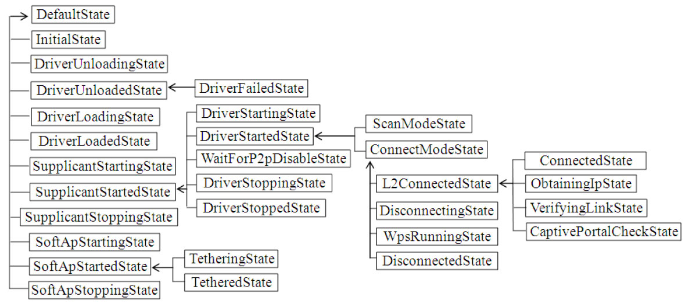

# 5.2.3 WifiStateMachine介绍


首先来看WifiStateMachine的构造函数，其内容较多，我们分两段来介绍。

1.WifiStateMachine构造函数分析之一[--＞WifiStateMachine.java：​：

WifiStateMachine构造函数代码段一]重点介绍其中的三个对象，分别是WifiNative、WifiMonitor以及SupplicantStateTracker。

（1）WifiNative根据上文描述，WifiNative用于和WPAS通信，其内部定义了较多的native方法（对应的JNI模块是android_net_wifi_Wifi）​。本节介绍其中最重要的两个方法。

第一个方法是startSupplicant，用于启动WPAS。startSupplicant是一个native函数，其JNI（可参考《深入理解Android：卷Ⅰ》

第2章JNI相关的重要知识。​）函数为android_net_wifi_startSupplicant，代码如下所示。

[--＞android_net_wifi_Wifi.c：​：

```java
int wifi_start_supplicant(int p2p_supported)
{
    char supp_status[PROPERTY_VALUE_MAX] = {'\0'};
    int count = 200;
// 该宏在build/core/combo/include/arch/linux-arm/AndroidConfig.h中被定义为1
#ifdef HAVE_LIBC_SYSTEM_PROPERTIES
    const prop_info *pi;
    unsigned serial = 0, i;
#endif
    // 和P2P有关
    if (p2p_supported) {// P2P_SUPPLICANT_NAME值为“p2p_supplicant”
        strcpy(supplicant_name, P2P_SUPPLICANT_NAME);
        // P2P _PROP_NAME值为“init.svc.p2p_supplicant”
        strcpy(supplicant_prop_name, P2P_PROP_NAME);
        /*
         P2P_CONFIG_FILE的值为“/data/misc/wifi/p2p_supplicant.conf”。下面这个函数将把
         /system/etc/wifi/wpa_supplicant.conf的内容复制到P2P_CONFIG_FILE中。
        */
        if (ensure_config_file_exists(P2P_CONFIG_FILE) ＜ 0) return -1;
    } else {
        strcpy(supplicant_name, SUPPLICANT_NAME);// SUPPLICANT_NAME值为“wpa_supplicant”
        // SUPP_PROP_NAME值为“init.svc.wpa_supplicant”
        strcpy(supplicant_prop_name, SUPP_PROP_NAME);
    }
     // 如果WPAS已经启动，则直接返回
     if (property_get(supplicant_name, supp_status, NULL)
                       && strcmp(supp_status, "running") == 0)   return 0;
    // SUPP_CONFIG_FILE的值为“/data/misc/wifi/wpa_supplicant.conf”
    if (ensure_config_file_exists(SUPP_CONFIG_FILE) ＜ 0)   return -1;
    // entropy文件，用于增加随机数生成的随机性
    if (ensure_entropy_file_exists() ＜ 0)
        ALOGE("Wi-Fi entropy file was not created");
    // 关闭之前创建的wpa_ctrl对象
    wifi_wpa_ctrl_cleanup();
    for (i=0; i<MAX_CONNS; i++)
        exit_sockets[i][0] = exit_sockets[i][1] = -1;
#ifdef HAVE_LIBC_SYSTEM_PROPERTIES
    // supplicant_prop_name值为“init.svc.wpa_supplicant”
    pi = __system_property_find(supplicant_prop_name);
    ......
#endif
    property_get("wifi.interface", primary_iface, WIFI_TEST_INTERFACE);
    /*
    通过设置“ctrl.start”属性来启动wpa_supplicant服务。该属性将触发init fork一个子
    进程用于运行wpa_supplicant。同时，init还会添加一个新的属性
    “init.svc.wpa_supplicant”用于跟踪wpa_supplicant的状态。
    */
    property_set("ctl.start", supplicant_name);
    sched_yield();
    // 下面这个循环用于查询“init.svc.wpa_supplicant”的属性值
    // 如果其值变成“running”，表示wpa_supplicant成功运行
    while (count-- ＞ 0) {// count初值为200。while循环最多等待20秒
#ifdef HAVE_LIBC_SYSTEM_PROPERTIES
        if (pi == NULL) {
            pi = __system_property_find(supplicant_prop_name);
        }
        if (pi != NULL) {
            __system_property_read(pi, NULL, supp_status);
            if (strcmp(supp_status, "running") == 0)    return 0;
            else if (pi-＞serial != serial &&// 如果WPAS已经停止，则直接返回-1
                    strcmp(supp_status, "stopped") == 0)  return -1;
        }
#else
    ......
#endif
usleep(100000);// 等待wpa_supplicant的状态
}
return -1;
}
```

android_net_wifi_startSupplicant]

```java
static jboolean android_net_wifi_startSupplicant(JNIEnv* env, jobject,
                                                 jboolean p2pSupported)
{
    return (jboolean)(::wifi_start_supplicant(p2pSupported) == 0);
}
```

wifi_start_supplicant代码如下所示。

[--＞wifi.c::wifi_start_supplicant]图5-3显示了wpa_supplicant运行过程中及退出后"init.svc.wpa_supplicant"属性值的变化。

图5-3init.svc.wpa_supplicant属性提示对Android属性机制和init工作原理感兴趣的读者不妨阅读《深入理解Android：

卷Ⅰ》第3章。

第二个要介绍的函数是connectToSupplicant，它将通过WPAS控制API和WPAS建立交互关系。

[--＞WifiNative.java：​：

connectToSupplicant]

```c
public boolean connectToSupplicant() {
     // mInterface的值为”wlan0”，由属性“wifi.interface”决定
     return connectToSupplicant(mInterface);// 调用native函数
 }
private native boolean connectToSupplicant(String iface);
```

与connectToSupplicant对应的JNI函数是android_net_wifi_connectToSupplicant，其代码如下所示。

[--＞android_net_wifi_Wifi.cpp：​：

android_net_wifi_connectToSupplicant]

```cpp
static jboolean android_net_wifi_connectToSupplicant(JNIEnv* env, jobject, jstring jIface)
{
    ScopedUtfChars ifname(env, jIface);
    return (jboolean)(::wifi_connect_to_supplicant(ifname.c_str()) == 0);
}
```

wifi_connect_to_supplicant的代码如下所示。

[--＞wifi.c：​：wifi_connect_to_supplicant]

```c
int wifi_connect_to_supplicant(const char *ifname)
{
    char path[256];
    /*
    Android 4.2支持STA和P2P设备并发（concurrent）工作，STA用PRIMARY（值为0）来标示，
    而P2P设备用SECONDARY（值为1）代表。is_primary_interface用于判断ifname是否代表STA。
    */
    if (is_primary_interface(ifname)) {
        // IFACE_DIR的值为“/data/system/wpa_supplicant”。笔者测试的几个手机中都没有该文件夹
        if (access(IFACE_DIR, F_OK) == 0) {
            snprintf(path, sizeof(path), "%s/%s", IFACE_DIR, primary_iface);
        } else {
            strlcpy(path, primary_iface, sizeof(path));
        }
        return wifi_connect_on_socket_path(PRIMARY, path);// PRIMARY值为0
    } else {
        sprintf(path, "%s/%s", CONTROL_IFACE_PATH, ifname);
        return wifi_connect_on_socket_path(SECONDARY, path);// SECONDARY值为1
    }
}
```

```c
int wifi_connect_on_socket_path(int index, const char *path)
{
    char supp_status[PROPERTY_VALUE_MAX] = {'\0'};
    // 判断wpa_supplicant进程是否已经启动
    if (!property_get(supplicant_prop_name, supp_status, NULL)
                           || strcmp(supp_status, "running") != 0)   return -1;
    // 创建第一个wpa_ctrl对象，用于发送命令
    ctrl_conn[index] = wpa_ctrl_open(path);
     ......
    // 创建第二个wpa_ctrl对象，用于接收unsolicited event
    monitor_conn[index] = wpa_ctrl_open(path);
     ......
    // 必须调用wpa_ctrl_attach函数以启用unsolicited event接收功能
    if (wpa_ctrl_attach(monitor_conn[index]) != 0) {......}
    // 创建一个socketpair，它用于触发WifiNative关闭和WPAS的连接
    if (socketpair(AF_UNIX, SOCK_STREAM, 0, exit_sockets[index]) == -1) {......}
    return 0;
}
```

来看wifi_connect_on_socket_path，其代码如下所示。

[--＞wifi.c：​：

wifi_connect_on_socket_path]由于Android4.2支持两个并发设备，所以每个并发设备各有两个wpa_ctrl对象。

❑ctrl_conn[PRIMARY]​、monitor_conn[PRIMARY]​：用于STA设备。

ctrl_conn用于向WPAS发送命令并接收对应命令的回复，而monitor_conn用于接收来自WPAS的unsolicitedevent。

❑ctrl_conn[SECONDARY]​、monitor_conn[SECONDARY]​：这两个wpa_ctrl对象用于P2P设备。

另外，exit_sockets保存了socketpair创建的socket句柄，这些句柄用于WifiService通知WifiNative去关闭它和WPAS的连接。

提示wifi.c中，wifi_send_command会使用ctrl_conn中的wpa_ctrl对象向WPAS发送命令并接收回复，而wifi_recv函数将使用monitor_conn中的wpa_ctrl对象接收来

```c
class MonitorThread extends Thread {
        public MonitorThread() {
            super("WifiMonitor");
        }
        public void run() {
            if (connectToSupplicant()) {// 连接WPAS, mStateMachine指向WifiStateMachine
                // 连接成功后，将向WifiStateMachine发送SUP_CONNECTION_EVENT消息
                mStateMachine.sendMessage(SUP_CONNECTION_EVENT);
            } else {
                mStateMachine.sendMessage(SUP_DISCONNECTION_EVENT);
                return;
            }
            for (;;) {
                // waitForEvent内部会调用wifi.c中的wifi_wait_on_socket函数
                String eventStr = mWifiNative.waitForEvent();
                // 解析WPAS的消息格式。EVENT_PREFIX_STR的值为“CTRL-EVENT-”
                if (!eventStr.startsWith(EVENT_PREFIX_STR)) {
                    ......// 非“CTRL-EVENT-”消息
                    continue;
                }
                // 处理“CTRL-EVENT-”消息
                String eventName = eventStr.substring(EVENT_PREFIX_LEN_STR);
                int nameEnd = eventName.indexOf(' ');
                if (nameEnd != -1)
                    eventName = eventName.substring(0, nameEnd);
                ......
                int event;
                if (eventName.equals(CONNECTED_STR))// 对应为“CONNECTED”消息
                    event = CONNECTED;
                ......
                else if (eventName.equals(STATE_CHANGE_STR))// 对应为“STATE-CHANGED”
                    event = STATE_CHANGE;
                else if (eventName.equals(SCAN_RESULTS_STR))// 对应为“SCAN-RESULTS”
                    event = SCAN_RESULTS;
                ......
                else if (eventName.equals(DRIVER_STATE_STR))// 对应为“DRIVER-STATE”
                    event = DRIVER_STATE;
                else if (eventName.equals(EAP_FAILURE_STR))// 对应为“EAP-FAILURE”
                    event = EAP_FAILURE;
                else
                    event = UNKNOWN;
                /*
                 提取消息中的其他信息，以CONNECTED消息为例，其消息全内容为：
                 CTRL-EVENT-CONNECTED - Connection to xx:xx:xx:xx:xx:xx completed
                 其中，xx:xx:xx:xx:xx:xx代表目标AP的BSSID。
                */
                String eventData = eventStr;
                if (event == DRIVER_STATE || event == LINK_SPEED)
                    eventData = eventData.split(" ")[1];
                else if (event == STATE_CHANGE || event == EAP_FAILURE) {
                       ......
                }......
                if (event == STATE_CHANGE) {// WPAS状态发生变化
                    handleSupplicantStateChange(eventData);
                } else if (event == DRIVER_STATE) {
                    handleDriverEvent(eventData);
                }......
                else {// 其他事件处理
                    handleEvent(event, eventData);
                }
                mRecvErrors = 0;
            }
        }
    ......
}
```

自WPAS的消息。这两个函数比较简单，请读者可自行阅读它。

下面来看WifiMonitor，它将使用monitor_conn中的wpa_ctrl对象。

（2）WifiMonitorWifiMonitor最重要的内容是其内部的WifiMonitor线程，该线程专门用于接收来自WPAS的消息。代码如下所示。

[--＞WifiMonitor.java：​：MonitorThread]上述代码中：

❑handleSupplicantStateChange用于处理WPAS的状态变化（见下文解释）​，它将先把这些变化信息交给WifiStateMachine去处理。而WifiStateMachine将根据处理情况再决定是否需要由下一节介绍的SupplicantStateTracker来处理。

handleSupplicantStateChange代码比较简单，读者可自行阅读它。

❑handleDriverEvent用于处理来Driver的信息。

❑handleEvent用于处理其他消息事件。详情见下文。

注意WPAS的状态指的是wpa_sm状态机中的状态，包括WPA_DISCONNECTED、WPA_INTERFACE_DISABLED、WPA_INACTIVE、WPA_SCANNING、WPA_AUTHENTICATING、WPA_ASSOCIATING、WPA_ASSOCIATED、WPA_4WAY_HANDSHAKE、WPA_GROUP_HANDSHAKE、WPA_COMPLETED共10个状态。

WifiService定义了SupplicantState类来描述WPAS的状态，包括DISCONNECTED、INTERFACE_DISABLED、INACTIVE、SCANNING、AUTHENTICATING、ASSOCIATING、ASSOCIATED、FOUR_WAY_HANDSHAKE、GROUP_HANDSHAKE、COMPLETED、DORMANT、UNINITIALIZED、INVALID共13个状态。其中最后三个状态是WifiService定义的，但笔者在代码中没有找到使用它们的地方。

下面简单介绍handleEvent，其代码如下所示。

[--＞WifiMonitor.java：​：handleEvent]

```java
void handleEvent(int event, String remainder) {
     switch (event) {
         case DISCONNECTED:
             handleNetworkStateChange(NetworkInfo.DetailedState
                                      .DISCONNECTED, remainder);
             break;
         case CONNECTED:// 该事件表示WPAS成功加入一个无线网络
             handleNetworkStateChange(NetworkInfo.DetailedState.CONNECTED, remainder);
             break;
         case SCAN_RESULTS:// 该事件表示WPAS已经完成扫描，客户端可以来查询扫描结果
             mStateMachine.sendMessage(SCAN_RESULTS_EVENT);// 处理扫描结果消息
             break;
         case UNKNOWN:
             break;
         }
}
```

先介绍SupplicantStateTracker。后文再分析CONNECTED和SCAN_RESULTS消息的处理流程。

（3）SupplicantStateTrackerSupplicantStateTracker用于跟踪和处理WPAS的状态变化。根据前面对WPAS中的状态以及WifiService中的状态介绍可知。在WifiService中，WPAS的状态由SupplicantState来表示，而和它相关的状态管理模块就是此处的SupplicantStateTracker。

SupplicantStateTracker也从StateMachine派生，并且它还定义了8个状态对象。相关代码如下所示。

```java
public SupplicantStateTracker(Context c, WifiStateMachine wsm,
                             WifiConfigStore wcs, Handler t) {
       super(TAG, t.getLooper());
       mContext = c;
       mWifiStateMachine = wsm;
       mWifiConfigStore = wcs;
       addState(mDefaultState);
       addState(mUninitializedState, mDefaultState);
       addState(mInactiveState, mDefaultState);
       addState(mDisconnectState, mDefaultState);
       addState(mScanState, mDefaultState);
       addState(mHandshakeState, mDefaultState);
       addState(mCompletedState, mDefaultState);
       addState(mDormantState, mDefaultState);
       setInitialState(mUninitializedState);// 初始状态为mUninitializedState
       start();// 启动状态机
}
```

[--＞SupplicantStateTracker.java：​：

SupplicantStateTracker]❑SupplicantState中的AUTHENTICATING、ASSOCIATING、ASSOCIATED、FOUR_WAY_HANDSHAKE和GROUP_HANDSHAKE均对应于此处的mHandshakeState。

❑SupplicantState中的UNINITIALIZED和INVALID对应于此处的mUnitializedState。

SupplicantStateTracker比较简单，而且它也不影响本章的分析流程。读者可在阅读完本章的基础上，自行对其开展研究。

下面来看WifiStateMachine构造函数的最后一部分。

2.WifiStateMachine构造函数分析之二[--＞WifiStateMachine.java：​：

WifiStateMachine构造函数代码段二]

```java
    ......// WifiStateMachine中的状态。说实话，笔者还没见过如此复杂的状态机
    addState(mDefaultState);
        addState(mInitialState, mDefaultState);
        addState(mDriverUnloadingState, mDefaultState);
        addState(mDriverUnloadedState, mDefaultState);
            addState(mDriverFailedState, mDriverUnloadedState);
        ......// WifiStateMachine一共定义了30个状态
        addState(mSoftApStoppingState, mDefaultState);
    setInitialState(mInitialState);// 设置初始状态为mInitialState
    ......// 和StateMachine日志记录相关设置
    start();// 启动状态机
}
```

WifiStateMachine共定义30个状态，其种类和层级关系如图5-4所示。



图5-4WifiStateMachine中的状态及层级关系图5-4中，箭头所指的状态为父状态。本节先介绍和初始状态的相关代码，其他状态的功能等碰到它们时再来分析。

提示如果算上SupplicantStateTracker中的8个状态以及后续章节将要介绍的P2pStateMachine中的15个状态，Java层中Wi-Fi相关的状态机竟然多达63个状态（还没有计算Wi-Fi模块其他代码中定义的好些个状态机所包含的状态）​。笔者很难理解为什么WifiService相关模块会定义如此多的状态。这些状态使得WifiService的分析难度陡增。而且，在整个Wi-Fi模块中，wpa_supplicant作为核心已经完成了绝大部分的工作，为什么WifiService还会如此复杂呢？欢迎读者对此问题和笔者展开讨论。

WifiStateMachine的初始状态是mInitialState，其类型是InitialState。根据前文对HSM的介绍，其enter函数将被调用（由于InitialState的父状态DefaultState并未实现enter函数，故此处略去）​。

[--＞WifiStateMachine.java：​：

```java
class InitialState extends State {
  public void enter() {
     // 判断Wlan Driver是否已经加载，其内部实现通过"wlan.driver.status"属性的值来判断
     if (mWifiNative.isDriverLoaded())
          transitionTo(mDriverLoadedState);
     else transitionTo(mDriverUnloadedState);// 假设此时驱动还没有加载，故我们将转入此状态
     // 获取和WifiP2pService交互的对象
     mWifiP2pManager = (WifiP2pManager) mContext.getSystemService(
                                             Context.WIFI_P2P_SERVICE);
     // mWifiP2pChannel用于和WifiP2pService中的某个Handler交互
     mWifiP2pChannel.connect(mContext, getHandler(),
                             mWifiP2pManager.getMessenger());
     try {
           mNwService.disableIpv6(mInterfaceName);
           // 禁止Ipv6，NWService将和Netd交互
     }......
  }
}
```

InitialState：enter]结合上述代码，当WifiStateMachine开始运行后，其最终将进入DriverUnloadedState。

由于DriverUnloadedState的enter函数没有做什么有意义的工作，所以此处不再讨论它。

至此，WifiService第一条分析路线就算结束。虽然WifiService创建工作涉及的流程并不长，但相信读者也会感觉WifiService的代码难度其实并不算小。从下一节开始，读者还将进一步体会到这一点。
