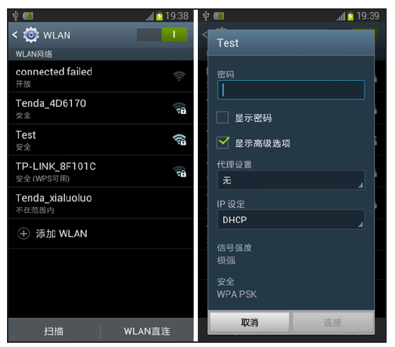
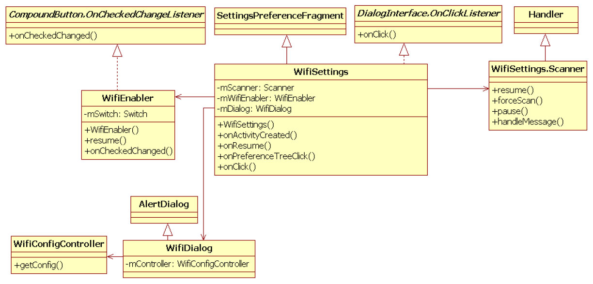

# 5.3.1 Settings操作Wi-Fi分析


Settings中设置Wi-Fi的页面如图5-5所示。



图5-5Wi-Fi设置页面左图所示为当前搜索到的无线网络信息。当选择图中"Test"无线网络时，进入右图。

右图所示为"Test"无线网络设置对话框。用户在“密码”一栏中输入密码后，点击“连接”按钮即可加入目标无线网络"Test"。

在Settings的代码中，和图5-5所示UI相关的类如图5-6所示。



图5-6Settings中Wi-Fi设置相关类图5-6中，WifiSettings对应于图5-5的左图。

另外，WifiEnabler类中有一个mSwitch对象，该对象就是图5-5左图中右上角对应的Wi-Fi开关按钮。

WifiDialog类对应于图5-5中的右图。

WifiDialog显示的无线网络配置信息由WifiConfigControer来控制和管理。

WifiSettings的内部类Scanner用于处理和无线网络扫描相关的工作。

```java
public WifiSettings() {
    mFilter = new IntentFilter();
    mFilter.addAction(WifiManager.WIFI_STATE_CHANGED_ACTION);
    mFilter.addAction(WifiManager.SCAN_RESULTS_AVAILABLE_ACTION);
    mFilter.addAction(WifiManager.NETWORK_IDS_CHANGED_ACTION);
    mFilter.addAction(WifiManager.SUPPLICANT_STATE_CHANGED_ACTION);
    mFilter.addAction(WifiManager.CONFIGURED_NETWORKS_CHANGED_ACTION);
    mFilter.addAction(WifiManager.LINK_CONFIGURATION_CHANGED_ACTION);
    mFilter.addAction(WifiManager.NETWORK_STATE_CHANGED_ACTION);
    mFilter.addAction(WifiManager.RSSI_CHANGED_ACTION);
    mReceiver = new BroadcastReceiver() {
        public void onReceive(Context context, Intent intent) {
                handleEvent(context, intent);   // 处理广播事件
            }
        };
    mScanner = new Scanner();                   // 创建一个Scanner对象
}
```

下面将按调用顺序来分析这些类的功能。首先是WifiSettings相关类的创建。

1.WifiSettings相关类初始化分析先来看WifiSetting的构造函数，代码如下所示。

[--＞WifiSettings.java]WifiSettings创建了一个广播接收对象，该对象关注的广播事件较多，其中四个重要的广播事件如下。

❑WIFI_STATE_CHANGED_ACTION：该广播事件反映了Wi-Fi功能所对应的状态，这些状态是WIFI_STATE_DISABLED（Wi-Fi功能已被关闭）​、WIFI_STATE_DISABLING（Wi-Fi功能正在关闭中）​、WIFI_STATE_ENABLED（Wi-Fi功能已被打开）​、WIFI_STATE_ENABLING（Wi-fi功能正在打开中）和WIFI_STATE_UNKNOWN（Wi-Fi功能状态未知）​。

❑SCAN_RESULTS_AVAILABLE_ACTION：该广播事件表示无线网络扫描完毕，可以从WPAS中获取扫描结果。

❑SUPPLICANT_STATE_CHANGED_ACTION：该广播事件用于表示WPAS的状态发生了变化。它和5.2.3节中SupplicantStateTracker介绍的SupplicantState相关。

❑NETWORK_STATE_CHANGED_ACTION：该广播事件用于表示Wi-Fi连接状态发生变化。其携带的信息一般是一个NetworkInfo对

```java
public void onActivityCreated(Bundle savedInstanceState) {
     super.onActivityCreated(savedInstanceState);
     mP2pSupported =
              getPackageManager().hasSystemFeature(PackageManager.FEATURE_WIFI_DIRECT);
     mWifiManager = (WifiManager) getSystemService(Context.WIFI_SERVICE);
       ......
     Switch actionBarSwitch = new Switch(activity);// 创建Wi-Fi开关按钮对应的Switch对象
     mWifiEnabler = new WifiEnabler(activity, actionBarSwitch);// 创建WifiEnabler对象
     ......
}
```

```java
public WifiEnabler(Context context, Switch switch_) {
   mContext = context;    mSwitch = switch_;
   mWifiManager = (WifiManager) context.getSystemService(Context.WIFI_SERVICE);
   // WifiEnabler关注如下三个广播事件
   mIntentFilter = new IntentFilter(WifiManager.WIFI_STATE_CHANGED_ACTION);
   mIntentFilter.addAction(WifiManager.SUPPLICANT_STATE_CHANGED_ACTION);
   mIntentFilter.addAction(WifiManager.NETWORK_STATE_CHANGED_ACTION);
}
```

象。NetworkInfo类在前文代码注释中曾介绍过，它用于表达一个网络接口的状态（Describesthestatusofanetworkinterface）​。

提示以后碰到实际代码时再来分析上述广播事件的具体处理方法。

在图5-5中左图所示的UI初始化过程中，WifiSettings的onActivityCreated函数将被调用，代码如下所示。

在onActivityCreated函数中，Switch和[--＞WifiSettings.java：​：

WifiEnabler对象被创建。马上来看onActivityCreated]WifiEnabler的构造函数，代码如下所示。

[--＞WifiEnabler.java：​：WifiEnabler]

```java
public void onResume() {
    super.onResume();
    if (mWifiEnabler != null)   mWifiEnabler.resume();// 先调用WifiEnabler的resume函数
    getActivity().registerReceiver(mReceiver, mFilter);// 注册广播接收对象
    ......
}
```

[--＞WifiEnabler.java：​：resume]

```java
public void resume() {
  mContext.registerReceiver(mReceiver, mIntentFilter);
  mSwitch.setOnCheckedChangeListener(this);
}
```

WifiEnabler和WifiSettings设置的广播接收对象在WifiSettings中的onResume函数中被注册，相关代码如下所示。

由于WifiEnabler先注册广播接收对象，所以[--＞WifiSettings.java：​：onResume]对于WIFI_STATE_CHANGED_ACTION、SUPPLICANT_STATE_CHANGED_ACTION和NETWORK_STATE_CHANGED_ACTION广播来说，WifiEnabler的广播接收对象将先被触发以处理这些消息，然后才是WifiSettings的广播接收对象。

提示研究WifiEnabler广播接收对象的代码后，会发现实际上它真正处理的只有WIFI_STATE_CHANGED_ACTION广播。

WifiEnabler将根据该广播的信息以更新Switch的界面。

广播虽然是Android平台中特有的信息发布机制，但广播派发的过程却并不轻松。从运行效率角度考虑，一个进程中，同样的广播最好用一个广播接收对象来处理。所以，笔者觉得WifiEnabler中的这个广播接收对象有些浪费。

假设用户通过图5-5左图右上角的按钮打开了

```java
public void onCheckedChanged(CompoundButton buttonView, boolean isChecked) {
    ......
    // 调用WifiManager的setWifiEnabled函数
    if (mWifiManager.setWifiEnabled(isChecked))  mSwitch.setEnabled(false);
    ......
}
```

Wi-Fi功能，这个点击事件会触发什么动作呢？来看下文。

2.启用Wi-Fi功能由图5-6可知，WifiEnabler实现了CompoundBuon的onChechedChangeListener接口，故用户点击事件将触发WifiEnabler的onCheckedChanged函数。

[--＞WifiEnabler.java：​：

onCheckedChanged]

```java
private void handleEvent(Context context, Intent intent) {
    String action = intent.getAction();
    if (WifiManager.WIFI_STATE_CHANGED_ACTION.equals(action)) {
        updateWifiState(intent.getIntExtra(WifiManager.EXTRA_WIFI_STATE,
                WifiManager.WIFI_STATE_UNKNOWN));
    } else if (WifiManager.SCAN_RESULTS_AVAILABLE_ACTION.equals(action) ||
           WifiManager.CONFIGURED_NETWORKS_CHANGED_ACTION.equals(action) ||
           WifiManager.LINK_CONFIGURATION_CHANGED_ACTION.equals(action)) {
           updateAccessPoints();// 更新图5-5左图中的无线网络列表
    } else if (WifiManager.SUPPLICANT_STATE_CHANGED_ACTION.equals(action)) {
        SupplicantState state = (SupplicantState) intent.getParcelableExtra(
                WifiManager.EXTRA_NEW_STATE);
        // 只在SupplicantState处于握手阶段才调用updateConnectionState
        if (!mConnected.get() && SupplicantState.isHandshakeState(state))
        updateConnectionState(WifiInfo.getDetailedStateOf(state));
    } else if (WifiManager.NETWORK_STATE_CHANGED_ACTION.equals(action)) {
        NetworkInfo info = (NetworkInfo) intent.getParcelableExtra(
                WifiManager.EXTRA_NETWORK_INFO);
        mConnected.set(info.isConnected());
        changeNextButtonState(info.isConnected());
        updateAccessPoints();
        updateConnectionState(info.getDetailedState());
        ......
    } else if (WifiManager.RSSI_CHANGED_ACTION.equals(action)) {
        updateConnectionState(null);
    }
}
```

WifiManager的setWifiEnabled函数将触发WifiService开展一系列的动作。这些动作的细节内容我们留待下文分析。在WifiService开展这一系列的动作的过程中，它会通过发送广播的方式向外界发布一些信息。所以，只要关注WifiSettings和WifiEnabler如何处理这些广播事件即可。

根据前文所述，WifiEnabler注册的广播事件对象没有做什么有意义的事情，所以下面直接来看WifiSettings的广播接收对象。

[--＞WifiSettings.java：​：handleEvent]

```java
private void updateWifiState(int state) {
    ......
    switch (state) {
        case WifiManager.WIFI_STATE_ENABLED:
            mScanner.resume();// 启动扫描
            return;
    ......
    }
    ......
}
```

（1）触发扫描根据前面对几个广播信息的描述，当Wi-Fi功能被启用时，将收到WIFI_STATE_CHANGED_ACTION广播，而该广播的处理函数是updateWifiState。代码如下所示。

[--＞WifiSettings.java：​：

updateWifiState]

```java
private void updateAccessPoints() {
    if (getActivity() == null) return;
    final int wifiState = mWifiManager.getWifiState();// 获取Wi-Fi的状态
    switch (wifiState) {
        case WifiManager.WIFI_STATE_ENABLED:
              // 创建AP列表
              final Collection＜AccessPoint＞ accessPoints = constructAccessPoints();
              getPreferenceScreen().removeAll();
              if(accessPoints.size() == 0)
                      addMessagePreference(R.string.wifi_empty_list_wifi_on);
              for (AccessPoint accessPoint : accessPoints) {// 添加到UI中显示
                      getPreferenceScreen().addPreference(accessPoint);
            }
            break;
            .......
        }
}
```

请读者暂时记住WifiManager的startScanActive函数，下文再详细分析。

[--＞WifiSettings.java::Scanner]（2）更新AP列表

```java
private class Scanner extends Handler {
    private int mRetry = 0;
        void resume() {
            if (!hasMessages(0))    sendEmptyMessage(0);
        }
    ......
    public void handleMessage(Message message) {
     if (mWifiManager.startScanActive()) mRetry = 0;// 发起扫描
     else if (++mRetry ＞= 3) ......// 扫描失败
      sendEmptyMessageDelayed(0, WIFI_RESCAN_INTERVAL_MS);// 每1秒发起一次扫描
    }
}
```

假设WPAS扫描完毕，则WifiSettings将收到SCAN_RESULTS_AVAILABLE_ACTION广播，该广播的处理函数为updateAccessPoints。

[--＞WifiSettings.java：​：

updateAccessPoints]来看上述代码中的constructAccessPoints函数，代码如下所示。

[--＞WifiSettings.java：​：

```java
private List＜AccessPoint＞ constructAccessPoints() {
    ArrayList＜AccessPoint＞ accessPoints = new ArrayList＜AccessPoint＞();
    Multimap＜String, AccessPoint＞ apMap = new Multimap＜String, AccessPoint＞();
    // getConfiguredNetworks将从WPAS中读取wpa_supplicant.conf中保存的那些无线网络信息
    final List＜WifiConfiguration＞ configs = mWifiManager.getConfiguredNetworks();
        if (configs != null) {
            for (WifiConfiguration config : configs) {
                // 为每一个已经保存的无线网络创建一个新AccessPoint对象
                AccessPoint accessPoint = new AccessPoint(getActivity(), config);
                accessPoint.update(mLastInfo, mLastState);
                accessPoints.add(accessPoint);
                apMap.put(accessPoint.ssid, accessPoint);
            }
        }
        // 获取扫描结果。本章不讨论getScanResult函数
        final List＜ScanResult＞ results = mWifiManager.getScanResults();
        if (results != null) {
            for (ScanResult result : results) {// 略过那些没有SSID的AP或者IBSS网络
                if (result.SSID == null || result.SSID.length() == 0 ||
                        result.capabilities.contains("[IBSS]")) continue;
                boolean found = false;
                // 如果之前保存的无线网络包含在此次扫描结果中，则更新该无线网络的一些信息
                for (AccessPoint accessPoint : apMap.getAll(result.SSID))
                    if (accessPoint.update(result))  found = true;
                if (!found) {
                    // 比较扫描结果和之前保存的无线网络信息，如果是新发现的AP，则创建一个AP对象
                    AccessPoint accessPoint = new AccessPoint(getActivity(), result);
                    accessPoints.add(accessPoint);
                    apMap.put(accessPoint.ssid, accessPoint);
                }
            }
        }
        Collections.sort(accessPoints);
        return accessPoints;
    }
```

constructAccessPoints]（3）加入目标无线网络当WifiSettings界面显示出周围的无线网络后，用户下一步要做的就是从列表中选择加入某个无线网络。其中，处理用户选择AP事件的函数为onPreferenceTreeClick，代码如下所示。

```java
public boolean onPreferenceTreeClick(PreferenceScreen screen, Preference preference) {
    if (preference instanceof AccessPoint) {
        mSelectedAccessPoint = (AccessPoint) preference;
        if (......// 对于没有安全设置的无线网络，直接连接它即可) {
            mSelectedAccessPoint.generateOpenNetworkConfig();
            mWifiManager.connect(mSelectedAccessPoint.getConfig(), mConnectListener);
        } else
            showDialog(mSelectedAccessPoint, false);// 弹出图5-5右图所示的对话框
    }......
    return true;
 }
// showDialog代码
private void showDialog(AccessPoint accessPoint, boolean edit) {
    ......
    mDlgAccessPoint = accessPoint;
    mDlgEdit = edit;
    showDialog(WIFI_DIALOG_ID);// showDilaog将创建一个WifiDialog对象
}
```

```java
void submit(WifiConfigController configController) {
    final WifiConfiguration config = configController.getConfig();
    if (config == null) {
          ......
    }......// 其他处理
    } else {
        if (configController.isEdit() || requireKeyStore(config))
            mWifiManager.save(config, mSaveListener);
        else   mWifiManager.connect(config, mConnectListener);// 连接目标无线网络
    }
    ......
}
```

[--＞WifiSettings.java：​：

onPreferenceTreeClick]由于WifiDialog及配置控制类WifiConfigControer比较简单，故此处不讨论它们。

当用户设置完目标无线网络的信息（例如输入密码）后，点击图5-5右图所示对话框的“连接”按钮。此动作将触发WifiSettings的submit函数被调用，代码如下所示。

[--＞WifiSettings.java：​：submit]至此，WifiSettings的工作就告一段落，它的后续工作就是等待并处理广播事件。如果一切顺利，它将接收一个NETWORK_STATE_CHANGED_ACTION广播事件以告知手机成功已经加入目标无线网络。

3.Settings操作Wi-Fi知识总结从本质上来说，WifiSettings的内容其实并不复杂。但根据笔者的经验，初学者并不能很快把握WifiSettings的工作流程。原因有如下几点。

自从SettingsUI中引入Fragment以来，整个Settings的代码比之前要复杂得多。对UI不熟悉的读者可先阅读SDK文档中关于Fragment的介绍。

WifiSettings和WifiEnabler中的广播接收对象互相干扰。这两个广播接收对象会处理一些相同的广播。并且这些广播将先由WifiEnabler处理，然后再由WifiSettings处理。不论是调试还是分析源码，初学者需要在两个类之间来回切换以研究它们是如何处理广播消息的，使得精力很容易被分散。不过，结合前文的介绍，读者完全可以忽略WifiEnabler中的广播接收对象。

在本节所述的工作流程中，WifiSettings会接收到很多次广播。这些广播由WifiService及相关模块发送。虽然发送广播以及时反馈信息是一种正确的做法，但也应该控制广播发送的次数。以WifiSettings中处理SUPPLICANT_STATE_CHANGED_ACTION广播为例，只有在网络未连接及SupplicantState处于握手阶段时它才做一些有意义的事情。结合前文对SupplicantState状态的介绍，它一共有13个状态，减去其中没有地方使用的3个状态（DORMANT、UNINITIALIZED、INVALID，参考5.2.3节关于WifiMonitor的介绍）​，WifiSetting将接收到最多10次（实际过程中还要减去一些没有被触发的状态）

SUPPLICANT_STATE_CHANGED_ACTION广播。这10次广播中，又有多少需要真正被处理呢（即处于未连接状态并且SupplicantState处于握手阶段）​？

另外，笔者提炼了上述代码中WifiSettings和WifiManager交互的几个重要函数以作为下一节的分析重点，这些函数如下。

❑setWifiEnabled：启用Wi-Fi功能。

❑startScanActive：启动AP扫描。

❑connect：连接至目标AP。
