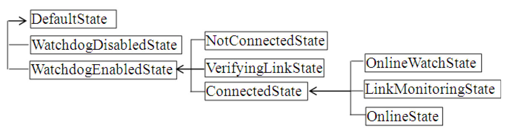

# 5.4 WifiWatchdogStateMachine介绍


1.WifiWatchdogStateMachine构造函数分析先来看WifiWatchdogStateMachine的初始化流程。

```java
private WifiWatchdogStateMachine(Context context) {
   super(TAG);
   mContext = context;  mContentResolver = context.getContentResolver();
   mWifiManager = (WifiManager) context.getSystemService(Context.WIFI_SERVICE);
   // mWsmChannel用于和WifiStateMachine交互
   mWsmChannel.connectSync(mContext, getHandler(),
                           mWifiManager.getWifiStateMachineMessenger());
   /*
   关键函数：setupNetworkReceiver将创建一个广播接收对象，用于接收NETWORK_STATE_CHANGED_ACTION、
   WIFI_STATE_CHANGED_ACTION、RSSI_CHANGED_ACTION、SUPPLICANT_STATE_CHANGED_
   ACTION等广播。
   */
   setupNetworkReceiver();
   // 监控Wifi Watchdog设置的变化情况
   registerForSettingsChanges();
   registerForWatchdogToggle();
   addState(mDefaultState);
   ......// 添加状态，一共有9个状态。如图5-7所示
   // Wifi Watchdog默认是开启的，故状态机转入NotConnectedState状态
   if (isWatchdogEnabled())   setInitialState(mNotConnectedState);
   else   setInitialState(mWatchdogDisabledState);
   updateSettings();
}
```

[--＞WifiWatchdogStateMachine.java：​：

WifiWatchdogStateMachine]上面代码中，WifiWatchdogStateMachine的初始状态是NotConnectedState。不过这个状态仅实现了enter函数，而且该函数中仅实现了一句打印输出的代码，所以NotConnectedState是一个象征意义远大于实际作用的类。

```java
private void setupNetworkReceiver() {
    mBroadcastReceiver = new BroadcastReceiver() {
         public void onReceive(Context context, Intent intent) {
         String action = intent.getAction();
         if (action.equals(WifiManager.RSSI_CHANGED_ACTION)) {
             obtainMessage(EVENT_RSSI_CHANGE,
                intent.getIntExtra(WifiManager.EXTRA_NEW_RSSI, -200), 0).sendToTarget();
         } else if (action.equals(WifiManager.SUPPLICANT_STATE_CHANGED_ACTION)) {
                sendMessage(EVENT_SUPPLICANT_STATE_CHANGE, intent);
         } else if (action.equals(WifiManager.NETWORK_STATE_CHANGED_ACTION)) {
                sendMessage(EVENT_NETWORK_STATE_CHANGE, intent);
         } ......
         else if (action.equals(WifiManager.WIFI_STATE_CHANGED_ACTION))
              sendMessage(EVENT_WIFI_RADIO_STATE_CHANGE,intent.getIntExtra(
                          WifiManager.EXTRA_WIFI_STATE, WifiManager.WIFI_STATE_UNKNOWN));
      }
    };
    mIntentFilter = new IntentFilter();
    mIntentFilter.addAction(WifiManager.NETWORK_STATE_CHANGED_ACTION);
    ......// 添加感兴趣的广播事件类型
    mContext.registerReceiver(mBroadcastReceiver, mIntentFilter);
}
```

图5-7所示为WifiWatchdogStateMachine中的各个状态及层级关系。



图5-7WifiWatchdogStateMachine状态及层级关系WifiWatchdogStateMachine完全靠广播事件来驱动，相关代码在setupNetworkReceiver函数中。

[--＞WifiWatchdogStateMachine.java：​：

setupNetworkReceiver]在前面介绍的WifiService工作流程中，SUPPLICANT_STATE_CHANGED_ACTION和NETWORK_STATE_CHANGED_ACTION广播发送的次数非常频繁。所以，WifiWatchdogStateMachine也不会太清闲。

下面，我们直接从WifiStateMachine在VerifyingLinkState的enter函数中发送的NETWORK_STATE_CHANGED_ACTION广

```java
public boolean processMessage(Message msg) {
   Intent intent;
   switch (msg.what) {
      ......
      case EVENT_NETWORK_STATE_CHANGE:
            intent = (Intent) msg.obj;
            NetworkInfo networkInfo = (NetworkInfo) intent.getParcelableExtra(
                                 WifiManager.EXTRA_NETWORK_INFO);
            mWifiInfo = (WifiInfo) intent.getParcelableExtra(WifiManager.EXTRA_WIFI_INFO);
            // 更新bssid信息
            updateCurrentBssid(mWifiInfo != null ? mWifiInfo.getBSSID() : null);
            switch (networkInfo.getDetailedState()) {
                case VERIFYING_POOR_LINK:
                // WifiStateMachine在VerifyingLinkState中设置的状态
                        mLinkProperties = (LinkProperties) intent.getParcelableExtra(
                                       WifiManager.EXTRA_LINK_PROPERTIES);
                        // mPoorNetworkDetectionEnabled用于判断是否需要监控AP的信号质量
                       if (mPoorNetworkDetectionEnabled) {
                             if (mWifiInfo == null || mCurrentBssid == null) {
                                  // 下面这个函数将通过mWsmChannel向WifiStateMachine发送
                                  // GOOD_LINK_DETECTED消息
                                  sendLinkStatusNotification(true);
                            }
                            else  transitionTo(mVerifyingLinkState);
                            // 进入VerifyingLinkState
                        }else  sendLinkStatusNotification(true);
                  break;
                case CONNECTED:// WifiStateMachine在ConnectedState中设置的状态
                // 请读者自行分析OnlineWatchState的处理流程
                         transitionTo(mOnlineWatchState);
            }
           ......
      }
    return HANDLED;
}
```

播开始分析WifiWatchdogStateMachine的处理流程。

2.EVENT_NETWORK_STATE_CHANGE处理流程该消息被NotConnectedState的父状态WatchdogEnabledState处理，相关代码如下所示。

[--＞WifiWatchdogStateMachine.java：​：

WatchdogEnabledState：

processMessage]如果WifiWatchdogStateMachine开启无线网络信号质量监控，将转入VerifyingLinkState，其enter函数如下所示。

[--＞WifiWatchdogStateMachine.java：​：

VerifyingLinkState：enter]

```java
public void enter() {
    mSampleCount = 0;
    mCurrentBssid.newLinkDetected();
    // 向自己发送CMD_RSSI_FETCH消息
    sendMessage(obtainMessage(CMD_RSSI_FETCH, ++mRssiFetchToken, 0));
}
```

3.CMD_RSSI_FETCH处理流程来看CMD_RSSI_FETCH消息的处理。

```java
public boolean processMessage(Message msg) {
    switch (msg.what) {
        ......
        case CMD_RSSI_FETCH:
            if (msg.arg1 == mRssiFetchToken) {
                  /*
                  向WifiStateMachine发送RSSI_PKTCNT_FETCH消息，WifiStateMachine
                  的处理过程就是调用WifiNative的signalPoll和pktcntPoll以获取RSSI、
                  LinkSpeed、发送Packet的总个数、发送失败的Packet总个数。注意，4.2中
                  的WPAS才支持pktcntPoll。
                  WifiStateMachine处理完RSSI_PKTCNT_FETCH后将回复RSSI_PKTCNT_FETCH_
                  SUCCEEDED消息给WifiWatchdogStateMachine。
                  */
                  mWsmChannel.sendMessage(WifiManager.RSSI_PKTCNT_FETCH);
                  // LINK_SAMPLING_INTERVAL_MS值为1000ms
                  sendMessageDelayed(obtainMessage(CMD_RSSI_FETCH,
                                 ++mRssiFetchToken, 0), LINK_SAMPLING_INTERVAL_MS);
              }
            break;
        case WifiManager.RSSI_PKTCNT_FETCH_SUCCEEDED:
            // WifiStateMachine回复的消息中携带一个RssiPacketCountInfo对象
            RssiPacketCountInfo info = (RssiPacketCountInfo) msg.obj;
            int rssi = info.rssi;
            /*
             WifiWatchdog用了一个名为指数加权移动平均算法（Volume-weighted Exponential
             Moving Average）的方法来辨别网络信号质量的好坏。本书不对它进行讨论，感兴趣的
             读者不妨自行研究。
            */
            long time = mCurrentBssid.mBssidAvoidTimeMax -
                        SystemClock.elapsedRealtime();
              // 假设网络质量很好，则调用sendLinkStateNotification
              // 以发送GOOD_LINK_DETECT消息给WifiStateMachine
             if (time ＜= 0) sendLinkStatusNotification(true);
             else {
                  // 此时的rssi等某个阈值。mGoodLinkTargetRssi由算法计算得来
                  if (rssi ＞= mCurrentBssid.mGoodLinkTargetRssi) {
                      // 当采样次数大于一定值时，才认为网络状态变好
                      // mGoodLinkTargetCount也是通过相关方法计算得来
                      if (++mSampleCount ＞= mCurrentBssid.mGoodLinkTargetCount) {
                            mCurrentBssid.mBssidAvoidTimeMax = 0;
                            sendLinkStatusNotification(true);
                      }
                  } else  mSampleCount = 0;
            }
            break;
        ......
        }
    return HANDLED;
}
```

[--＞WifiWatchdogStateMachine.java：​：

VerifyingLinkState：processMessage]当WifiWatchdogStateMachine检测到Poollink时，它将发送POOL_LINK_DETECT消息给WifiStateMachine去处理。相关流程请感兴趣的读者自行研究。

WifiWatchdogStateMachine是一个比较有趣的模块。其目的很简单，就是监测无线网络的信号质量，然后做相应动作。另外，WifiWatchdogStateMachine还使用了一些比较高级的算法来判断网络信号质量的好坏，感兴趣的读者不妨进行深入研究。
