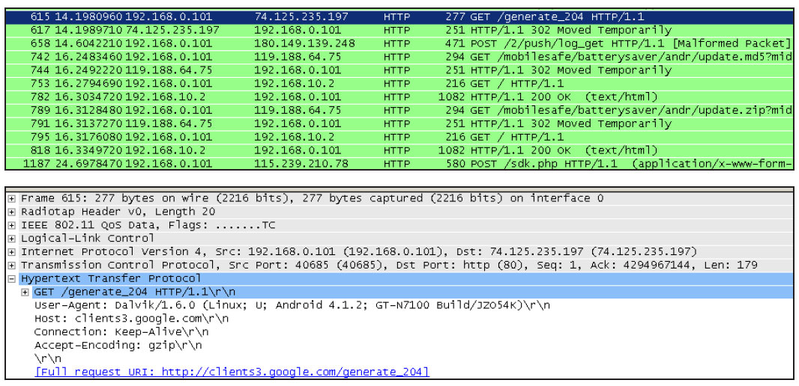

# 5.5 Captive Portal Check介绍


```java
public static CaptivePortalTracker makeCaptivePortalTracker(Context context,
            IConnectivityManager cs) {
  CaptivePortalTracker captivePortal = new CaptivePortalTracker(context, cs);
  captivePortal.start();// 启动HSM
  return captivePortal;
}
```

```java
private CaptivePortalTracker(Context context, IConnectivityManager cs) {
    super(TAG);
  mContext = context;mConnService = cs;
  mTelephonyManager = (TelephonyManager) context.getSystemService(
                                      Context.TELEPHONY_SERVICE);
  // 注册一个广播接收对象，用于处理CONNECTIVITY_ACTION消息
  IntentFilter filter = new IntentFilter();
  filter.addAction(ConnectivityManager.CONNECTIVITY_ACTION);
  mContext.registerReceiver(mReceiver, filter);
  // CAPTIVE_PORTAL_SERVER用于设置进行Captive Portal Check测试的服务器地址
  mServer = Settings.Global.getString(mContext.getContentResolver(),
                              Settings.Global.CAPTIVE_PORTAL_SERVER);
  // 如果没有指明服务器地址的，则采用DEFAULT_SERVER，其地址是“clients3.google.com”
  if (mServer == null) mServer = DEFAULT_SERVER;
  // 是否开启Captive Portal Check功能，默认是开始
  mIsCaptivePortalCheckEnabled = Settings.Global.getInt
              (mContext.getContentResolver(),
              Settings.Global.CAPTIVE_PORTAL_DETECTION_ENABLED, 1) == 1;
  addState(mDefaultState);// CaptivePortalTracker只有4个状态
          addState(mNoActiveNetworkState, mDefaultState);
          addState(mActiveNetworkState, mDefaultState);
          addState(mDelayedCaptiveCheckState, mActiveNetworkState);
  setInitialState(mNoActiveNetworkState);
}
```

5.5CaptivePortalCheck介绍Android4.2中，CaptivePortalCheck功能1.CaptivePortalTracker构造函数分析集中在CaptivePortalTracker类中，而且它也CaptivePortalTracker的构造函数如下所示。

是一个HSM。CaptivePortalTracker的创建位于ConnectivityService构造函数中。在那[--＞CaptivePortalTracker.java：​：

里，它的makeCaptivePortalTracker函数被CaptivePortalTracker]调用。相关代码如下所示。

[--＞CaptivePortalTracker.java：​：

makeCaptivePortalTracker]CaptivePortalTracker只监听CONNECTIVITY_ACTION广播，而WifiService相关模块并不会发送这个广播。

那么，在前面介绍的流程中，哪一步会触发CaptivePortalTracker进行工作呢？来看下节。

2.CMD_CONNECTIVITY_CHANGE处理流程当Wi-Fi网络连接成功时，ConnectivityService的handleConnect将被触发，该函数内部将发送一个

```java
private final BroadcastReceiver mReceiver = new BroadcastReceiver() {
        public void onReceive(Context context, Intent intent) {
            String action = intent.getAction();
            if (action.equals(ConnectivityManager.CONNECTIVITY_ACTION)) {
                NetworkInfo info = intent.getParcelableExtra(
                        ConnectivityManager.EXTRA_NETWORK_INFO);
                // 向状态机发送CMD_CONNECTIVITY_CHANGE消息
                sendMessage(obtainMessage(CMD_CONNECTIVITY_CHANGE, info));
            }
        }
};
```

```java
public boolean processMessage(Message message) {
     InetAddress server;     NetworkInfo info;
     switch (message.what) {
         case CMD_CONNECTIVITY_CHANGE:
               info = (NetworkInfo) message.obj;
               // 无线网络已经连接成功，并且手机当前使用的就是Wi-Fi
               // isActiveNetwork将查询ConnectivityService以获取当前活跃的数据链接类型
               if (info.isConnected() && isActiveNetwork(info)) {
                     mNetworkInfo = info;
                     transitionTo(mDelayedCaptiveCheckState);
                     // 转移到DelayedCaptiveCheckState
               }
         ......
         }
     return HANDLED;
}
```

CONNECTIVITY_ACTION消息，这个消息将被CaptivePortalTracker注册的广播接收对象处理。相关代码如下所示。

CaptivePortalTracker的[--＞CaptivePortalTracker.java：​：

NoActiveNetworkState将处理该消息。相关onReceive]代码如下所示。

[--＞CaptivePortalTracker.java：​：

NoActiveNetworkState：

processMessage]

```java
private class DelayedCaptiveCheckState extends State {
      public void enter() {
           // 发送一个延迟消息，延迟时间为10秒
           sendMessageDelayed(obtainMessage(CMD_DELAYED_CAPTIVE_CHECK,
                       ++mDelayedCheckToken, 0), DELAYED_CHECK_INTERVAL_MS);
      }
      public boolean processMessage(Message message) {
         switch (message.what) {
              case CMD_DELAYED_CAPTIVE_CHECK:
                  if (message.arg1 == mDelayedCheckToken) {
                      InetAddress server = lookupHost(mServer);// 获取Server的IP地址
                      if (server != null) {
                          // AP是否需要Captive Portal Check。如果需要
                          // setNotificiationVisible将在状态栏中添加一个提醒信息
                          if (isCaptivePortal(server))  setNotificationVisible(true);
                      }
                      transitionTo(mActiveNetworkState);
                      // 转到ActiveNetworkState
                  }
                  break;
              default:
                  return NOT_HANDLED;
         }
         return HANDLED;
      }
}
```

3.CMD_DELAYED_CAPTIVE_CHECK处理流程DelayedCaptiveCheckState代码如下所示。

[--＞CaptivePortalTracker.java：​：

DelayedCaptiveCheckState]

```java
private boolean isCaptivePortal(InetAddress server) {
    HttpURLConnection urlConnection = null;
    if (!mIsCaptivePortalCheckEnabled) return false;
    // mUrl实际访问的地址是：http:// clients3.google.com/generate_204
    mUrl = "http:// " + server.getHostAddress() + "/generate_204";
    /*
    Captive Portal的测试非常简单，就是向mUrl发送一个HTTP GET请求。如果无线网络提供商没
    有设置PortalCheck，则HTTP GET请求将返回204。204表示请求处理成功，但没有数据返回。
    如果无线网络提供商设置了Portal Check，则它一定会重定向到某个特定网页。这样，HTTP GET的
    返回值就不是204。
    */
    try {
            URL url = new URL(mUrl);
            urlConnection = (HttpURLConnection) url.openConnection();
            urlConnection.setInstanceFollowRedirects(false);
            urlConnection.setConnectTimeout(SOCKET_TIMEOUT_MS);
            urlConnection.setReadTimeout(SOCKET_TIMEOUT_MS);
            urlConnection.setUseCaches(false);
            urlConnection.getInputStream();
            return urlConnection.getResponseCode() != 204;
    }......
}
```

上述代码中，isCaptivePortal用于判断server是否需要CaptivePortalCheck。其代码如下所示。

[--＞CaptivePortalTracker.java：​：

isCaptivePortal]



图5-8CaptivePortalCheck示意图测试时禁用了无线网络安全，所以AirPcap可以解析这些没有加密的数据包。由图5-8可知，当Note2发起HTTPGET请求后，小区宽带服务器回复了HTTP302，所以笔者手机状态栏才会显然如图5-9所示的提示项以提醒该处理完毕后，CaptivePortalTracker将转入无线网络需要登录。

ActiveNetworkState状态。该状态的内容非


常简单，读者可自行阅读它。由于笔者家中所在小区宽带提供商使用了CapivePortalCheck，所以笔者利用AirPcap截获了相关网图5-9CaptivePortalCheck提示络交换数据，如图5-8所示。

4.CaptivePortalTracker总结和WifiWatchdogStateMachine一样，CaptivePortalTracker也比较有意思。

CaptivePortalTracker类出现于4.2版本中，而4.1版本中的CaptivePortaclCheck功能则是由WifiWatchdogStateMachin来完成的。

在4.1版本中，WifiWatchdogStateMachine定义了一个WaedGardenCheckState类用于处理CaptivePortalCheck。

不过，笔者在研究4.1版本和4.2版本相关模块的代码后，发现4.2版本中的处理似乎有一些问题。此处先记下此问题，希望有兴趣的读者参与讨论。问题如下。

4.2版本中，WifiStateMachine在ConnectedState前增加了一个CaptivePortalCheckState。很明显，CaptivePortalCheckState的目的是在WifiStateMachine转入ConnectedState之前完成CaptivePortalCheck。但根据本节对CaptivePortalTracker的介绍，只有WifiStateMachine进入ConnectedState后，ConnectivityService才会发送CONNECTIVITY_ACTION广播。而在4.1版本中，WifiWatchdogStateMachine也是在WifiStateMachine转入ConnectedState后进入WaedGardenCheckState的。

提示WifiStateMachine如何从CaptivePortalCheckState转为ConnectedState呢？

答案在ConnectivityService的handleCaptivePortalTrackerCheck函数中。在那里，WifiStateMachine的captivePortalCheckComplete函数最终会被调用。在该函数中，CMD_CAPTIVE_CHECK_COMPLETE将被发送，CaptivePortalCheckState才会转入ConnectedState状态。但是，在这个流程中，CaptivePortalTracker并未被真正触发以进行CaptivePortalCheck。
