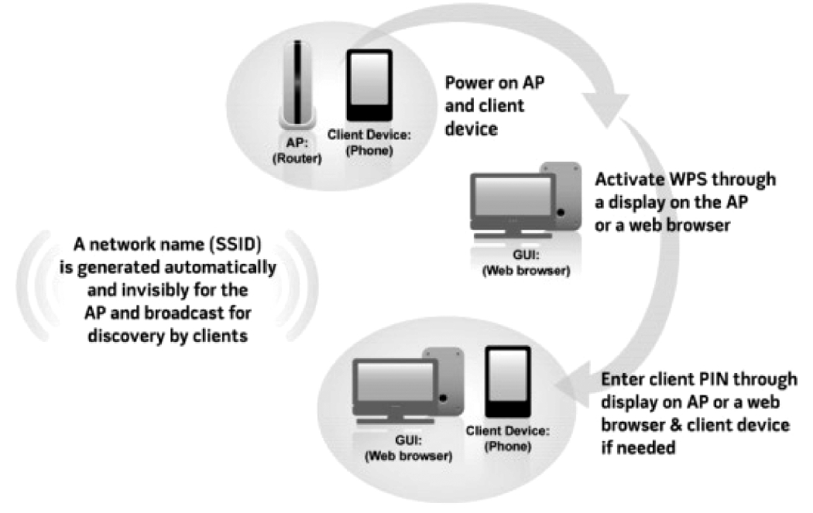
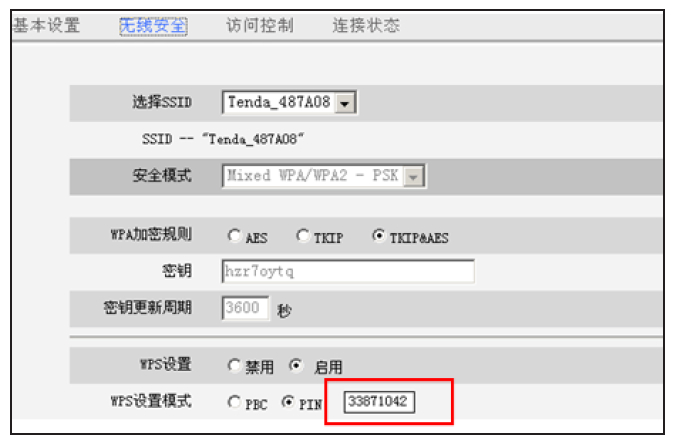
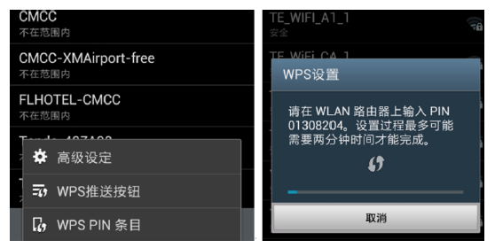
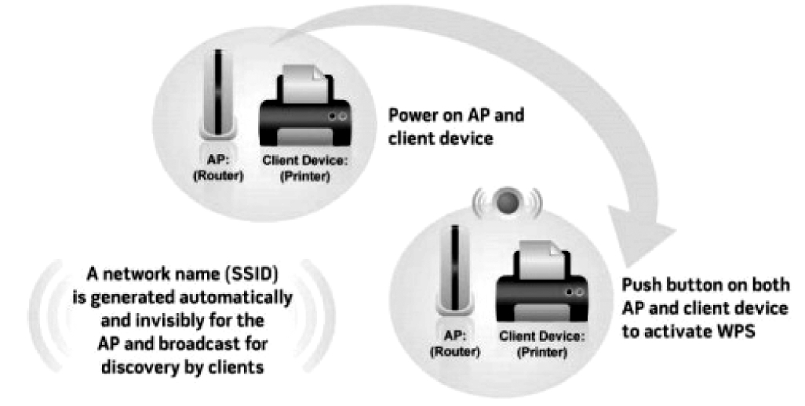

# 6.2 WSC基础知识

WSC规范早期的名字叫WPS（Wi-FiProtectedSetup）​。WFA推出WPA后不久，WPS规范便被推出。随着WPA2的出现，WFA又制订了WPS的升级版，即WSC。WSC的规范（以2.0.2版为例）全文只有150页。

WSC的目的很简单，就是简化无线网络配置（这也是其英文名为SimpleConfiguration的原因）​。本节将以WSC的技术规范为主，向读者介绍相关的理论知识。

提示WSC规范中，安全设置信息可以借助Wi-Fi作为传输手段，也可以借助其他传输方式，如NFC传输等。如果这些信息使用Wi-Fi作为传输手段，称为In-Band交换，否则称为Out-of-Band交换。

[1]6.2.1WSC应用场景WSC定义两个应用场景（usagemodel）​，分别是PrimaryUM和SecondaryUM。

❑PrimayUM图包6-1括W设SC置PI一N案个例新的安全的WLAN，并为该WLAN添加无线设备。该场图6-1所示为WSC定义的PIN码配置方法，其景和前文介绍的WSC应用场景一样。日常生工作流程如下。

活中，PrimaryUM对应的情况更为普遍。

1）打开AP和STA。用户首先从STA相关的设❑SecondaryUM包括从WLAN中移除某个无置选项中获取一个PIN码。

线设备、通过添加新的AP或路由器来扩充WLAN的覆盖范围、密钥信息更换（Re-2）用户将STA的PIN码通过AP的设置页面传keyingcredentials）等。

递给AP。

PrimaryUM常见的两种案例包括PIN和3）AP和STA将基于这个PIN码完成安全设置PBC。其中，PIN的使用案例如图6-1所示。

协商。然后STA将完成扫描、关联、四次握手等工作以加入目标AP。

PIN码是长度为8的字符串，图6-2所示为笔者用GalaxyNote2测试WSCPIN方法时获取的PIN信息。左图所示的页面位于Settings的无线网络设置选项中，有条件的读者不妨一试。

图6-3AP设置页面提示图6-2和图6-3所示的PIN码并不一致。目的是表示系统每次生成的PIN码不是图6-2GalaxyNote2WSCPIN设置固定的。

STA中的PIN码需要输入AP中，图6-3所示为相比PIN而言，PB配置方法（PushBuon笔者家中无线路由器WSCPIN设置页面，注Configuration，PBC）的使用更加简单。

意右下角的黑框中是手机的PIN码，笔者测试PBC案例如图6-4所示。

时从GalaxyNote2中获取的PIN码是

33871042。

图6-4PBC案例PBC的工作流程如下。

1）用户打开AP和打印机（支持Wi-Fi）​。打印机和AP上都有一个小按钮（注意，规范要求该按钮必须标记上WPS以表示它对WSC的支持）​。

2）用户只要在AP和打印机上单击该按钮，将触发打印机和AP完成安全设置协商。如此，打印机获取AP的安全设置信息后将顺利加入目标AP。

图6-5所示为笔者家中无线路由器上的WSC按钮。对于Android智能手机，可通过软件中的按钮来模拟真实的PushBuon（参考图6-2中左图的“WPS推送按钮”项）​。
