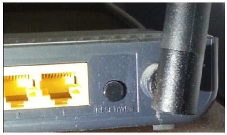
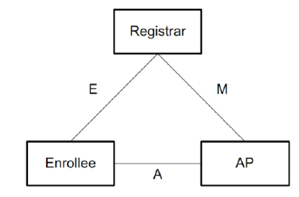

# 6.2.2 WSC核心组件及接口[2]

图6-5PBC实物

图6-6WSC核心组件注意这三个组件只是逻辑上的概念。在具体实现时，AP和Registrar可以由同一个实体实现，也可分别由不同实体来实现。日常生活中，支持WSC的无线路由器兼具AP和Registrar的功能。这种AP在规范中称为StandaloneAP。Android智能手机扮演Enroee的角色。如果AP和Registrar分别由不同实体来实现，这种Registrar也称为ExternalRegistrar。

除了三大组件之外，规范还定义了组件之间的交互接口。例如图6-6中的E、M、A代表三个核心组件之间交互的接口，这些接口定义了交互双方需要实现的一些功能。

规范中关于E、M、A的介绍非常复杂，笔者不拟照搬规范的内容，而是试图通过一种普适的case来介绍E、M、A的功能。这个case就是AP和Registrar组件实现于一个无线路由器中，即StandaloneAP，而Enroee由STA实现。STA和StandaloneAP通过Wi-Fi传输数据，即它们将采用In-Band交互手段。

在上述情况下，STA中的InterfaceE包括的功能如下。

❑STA首先要寻找周围支持WSC功能的StandaloneAP。此步骤将通过发送携带WSCIE的ProbeRequest帧来实现。另外，STA必须能生成动态PIN码，该PIN码将用于检验后续安全配置信息的正确性。

❑STA关联到StandaloneAP后（注意，仅仅是关联成功。由于缺乏安全配置信息，STA无法和AP开展RSNA流程，即四次握手等工作）​，双方需要借助RegistrationProtocol（以后简称RP协议）来协商安全配置信息。

所以，STA必须实现RP协议的Enroee的功能。

StandaloneAP中InterfaceE包括的功能如下。

❑回复携带WSCIE的ProbeResponse帧以表明自己支持WSC功能。

❑实现RP协议定义的Registrar的功能。

提示STA和AP可选择实现某种Out-of-Band交互手段，规范中提到的两种手段包括NFC和USB。

对于InterfaceA来说，STA必须实现802.1Xsupplicant功能，并支持EAP-WSC算法。

StandaloneAP需发送携带WSCIE的Beacon帧来表示自己支持WSC功能。同时，AP还必须支持802.1Xauthenticator功能，并实现EAP-WSC算法。

由于StandaloneAP已经集成了三大组件中的AP和Registrar，所以InterfaceM的功能几乎简化为0。由于本书不讨论AP的实现，所以此处不介绍和它相关的内容。

提示WSC规范关于E、M、A的介绍比较复杂，其中还涉及UPnP的使用。本书不讨论UPnP方面的内容，感兴趣的读者不妨参考笔者的一篇博文（hp://blog.csdn.net/innost/article/details/7078539）​。

由上文所述内容可知，WSC的核心知识集中在WSCIE以及RP中，下一节详细介绍。

6.3RegistrationProtocol详[3]解以前面提到的普适case为例，当STA和StandaloneAP采用In-Band交互方法时，RP协议的完整交互流程如图6-7所示。包括两部分，由"EnterpasswordofEnroee"行隔开，其中，上部分所对应的交互部分被称为DiscoveryPhase。在此阶段中，STA借助Beacon帧或ProbeRequest帧搜索周围的AP。对开启了WSC功能的STA来说，这些帧中都必须携带WSCIE。而没有携带WSCIE的帧则表明发送者不支持或者未开启WSC功能。DiscoveryPhase结束后，STA将确定一个目标AP。

此时用户需要将STA显示的PIN码（如图6-2
