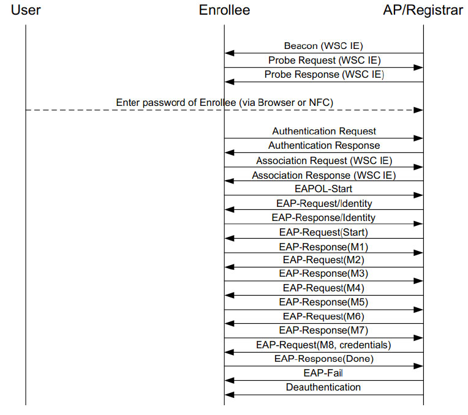

# 6.3 Registration Protocol详解[3]

所示）输入到目标AP的设置页面（如图6-3所示）​。接着，STA将关联到目标AP。和非WSC流程不一样的是，STA和AP不会开展四次握手协议，而是先开展EAP-WSC流程。

EAP-WSC流程从EAPOL-Start开始，结束于EAP-Fail帧，一共涉及14次EAPOL/EAP帧交图6-7完整RP协议交互换。在这14次帧交互过程中，STA和AP双方虽然EAP-WSC最终以EAP-Fail帧结束，但将协商安全配置信息（例如采用何种身份验证STA已经和AP借助M1到M8成功完成了安全方法、何种加密方法，以及PSK等）​。另外，信息协商，所以STA已经获得了AP的安全配这14次帧中，M1～M8属于EAP-WSC算法的置情况。另外，由于STA收到的是EAP-Fail内容，它们用于STA和AP双方确认身份以及帧，所以它会断开和AP的连接（AP会发送传输安全配置信息。

Deauthentication帧给STA）​。

STA将利用协商好的安全配置信息重新和AP进行关联，后续流程和非WSC的无线网络关联一样，即STA关联到AP后，将开展RSNA工作（如四次握手协议、GroupHandshake流程）​。

关于图6-7所涉及的流程需要注意。

❑如果不使用WSC，用户需要为AP设置安全配置信息，然后STA搜索并关联到目标AP。

接着，STA和AP将利用四次握手协议和GroupHandshake协议完成RSNA工作。

RSNA工作属于WPA和WPA2规范所指定的，STA和AP必须完成RSNA流程。

❑如果使用WSC，STA和AP共享的只有PIN码（或者用户单击双方的按钮）​，为了完成RSNA流程，STA需要从AP那获取安全配置信息。而这个安全配置信息的传递则由图6-7所示的EAPOL/EAP帧交互来完成。有了安全配置信息后，STA后续流程和没有使用WSC的情况一样。

根据上面的描述可知，WSC的核心工作就是帮助STA和AP完成安全配置信息协商。由于在这个流程中，用户只需输入PIN码或单击按钮，所以用户的工作量极小。WSC工作完成后，STA和AP的工作和第4章介绍的一样（STA首先关联到AP，然后完成四次握手协议和GroupHandshake协议）​。

下面分别介绍WSCIE以及EAP-WSC相关知识。首先登场的是WSCIE。
