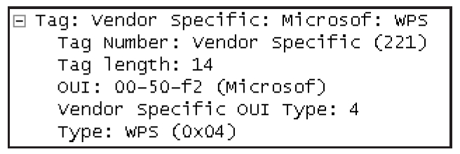
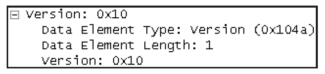
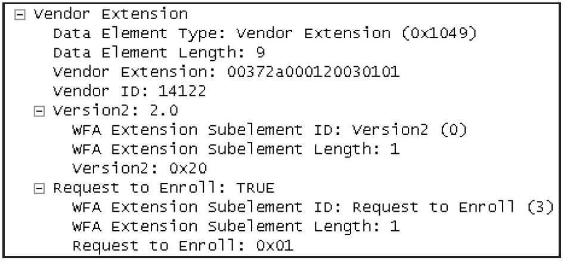
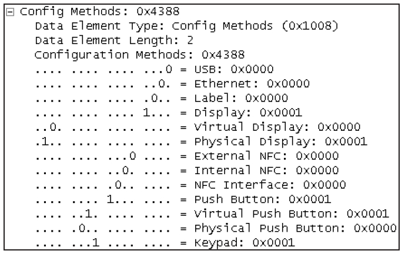
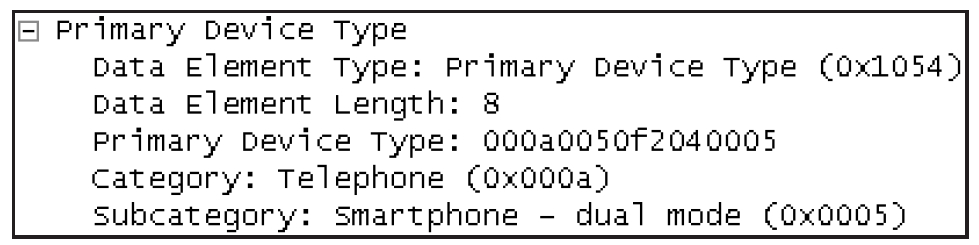
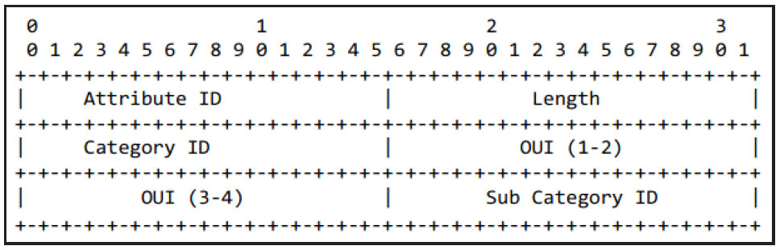
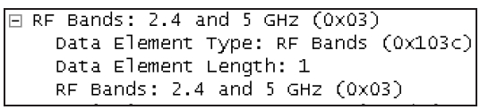

# 6.3.1 WSC IE和Attribute介绍[4]

6.3.1WSCIE和Aribute介绍[4]WSCIE并不属于802.11规范所定义的IE，而是属于Vendor定义的IE。根据802.11规范，Vendor定义的IE组成结构如图6-8所示。

图6-8VendorIE的结构根据图6-8所示的结构，WSCIE对应的设置如下。

❑ElementID取值为221。802.11规范中，该值意为"VendorSpecific"。

❑Length为OUI及Data的长度。

❑OUI取值为0x00-50-F2-04。其中00-50-F2代表Microsoft公司的OUI，04代表WPS。

❑WSCIE中，Data域的组织结构为一个或多个Aribute（属性）​。Aribute的格式为TLV，即Type（长度为2字节）​、Length（长度为2字节，代表后面Value的长度）​，Value（最大长度为0xFFFF字节）​。

图6-9所示为笔者截获的WSCIE。由上文可知，WSCIE的核心是其携带的Aribute。

WSC规范定义了多个Aribute，而了解这些Aribute的内容及作用是学习WSC的必经之路。下面将介绍WSC中一些重要的Aribute。

提示Aribute不仅被WSCIE使用，还被后文介绍的EAP-WSC包使用。

1.Version和VendorExtension属性Version属性表达了发送端使用的WSC版本信息。Version属性对应的内容如图6-10所示。

图6-9WSCIE实例

图6-10Version属性的内容由图6-10可知，Version属性的Type字段取值为0x104a，Length字段长度为1字节。

Version属性已经作废（Deprecated）​，但为了保持兼容性，规范要求WSCIE必须包含该属性，并且其Value字段需设为0x10。

取代Version属性的是Version2属性，Version2属性并不能单独存在，而是作为VendorExtension的子属性被包含在WSCIE中。VendorExtension的示例如图6-11所示。

图6-11VendorExtension属性VendorExtension头部包含三个部分，分别是Type（值为0x1049）​、Length（此处的值为9）​、VendorID（十进制值为14122，十六进制值为0x00372a）​。

VendorExtension可包含多个子属性，图6-11的VendorExtension包含了Version2和RequesttoEnro两个子属性。\n"VendorExtension：00372a000120030101"一行代表的是VendorExtension的Value。它是后面VendorID、Version2和RequesttoEnro的所有内容。

RequesttoEnro子属性代表Enroee希望开展后续的EAP-WSC流程。

2.RequestType和ResponseType属性图6-12所示为RequestType和ResponseType两个属性的内容。

图6-12RequestType和ResponseType属性图6-12左图所示为RequestType，右图所示为ResponseType。

❑RequestType属性必须包含于Probe/AssociationRequest帧中，代表STA作为Enroee想要发起的动作。该属性一般取值0x01（含义为Enroee，open802.1X）​，代表该设备是Enroee，并且想要开展WSC后续流程。它还有一个取值为0x00（含义为Enroee，Infoonly）​，代表STA只是想搜索周围支持WSC的AP，而暂时还不想加入某个网络。

❑ResponseType属性代表发送者扮演的角色。对于AP来说，其取值为0x03（含义为AP）​，对于Registrar来说，其取值为0x02，对于Enroee来说，其取值可为0x00（Enroee，Infoonly）和0x01（Enroee，open802.1X）​。StandaloneAP也属于AP，故图6-12右图的ResponseType取值为0x03。

3.ConfigurationMethods和PrimaryDeviceType属性ConfigurationMethods属性用于表达Enroee或Registrar支持的WSC配置方法。

前文提到的PIN和PBC就属于WSC配置方法。

考虑到支持Wi-Fi的设备类型很多，例如打印机、相机等，故WSC规范定义的WSC配置方法较多。图6-13所示为ConfigurationMethods属性。

图6-13ConfigMethods属性❑Type字段取值为0x1008，Length字段取值为2，代表Value的内容长度为2字节。

❑ConfigurationMethod的Value长度为2字节，共16位。每一位都代表Enroee或Registrar支持的WSC配置方法。

图6-13所示为GalaxyNote2所支持的Method，它支持动态PIN码（即STA能动态生成随机PIN码，由Display位表达。静态PIN码由Label位表示）​。

注意Display还需细分为PhysicalDisplay或VirtualDisplay。二者区别是PhysicalDisplay表示PIN码能直接显示在设备自带的屏幕上，而VirtualDisplay只能通过其他方式来查看（由于绝大多数无线路由器都没有屏幕，所以用一般情况下，用户只能在浏览器中通过设备页面来查看）PIN码。

Keypad表示可在设备中输入PIN码。另外，是否支持PushBuon由PushBuon位表达。同PIN码一样，它也分PhysicalPushBuon和VirtualPushBuon。由于GalaxyNote2硬件上并没有专门的按钮（它只不过是在软件中实现了一个按钮用来触发PushBuon，读者可参考图6-2中左图的“WPS推送按钮”项）​，所以这里的设置为支持VirtualPushBuon。

PrimaryDeviceType属性代表设备的主类型。在DiscoveryPhase阶段，交互的一方可指定要搜索的设备类型（需设置RequestedDeviceType属性，该属性的结构和取值与PrimaryDeviceType一样）​。这样，只有那些PrimaryDeviceType和目标设备类型匹配的一方才会进行响应。图6-14为GalaxyNote2的PrimaryDeviceType属性。

WSC规范中，PrimaryDeviceType的结构如图6-15所示属性。

图6-14PrimaryDeviceType属性

图6-15PrimaryDeviceType的组成结合图6-14和图6-15可知。

❑Type（即图6-15中的AributeID）字段的值为0x1054，Length字段的值为4字节。

❑CategoryID为WSC规范中定义的设备类型。GalaxyNote2属于Telephone设备，取值为0x000a。

❑OUI默认为WFA的OUI编号，取值为0x00-50-f2-04。注意，图6-14并未单独列举出OUI字段的取值。

❑WSC还划分了SubCategory，GalaxyNote2取值为0x0005，代表Smartphone-dualmode类设备。dualmode表示设备支持两个Wi-Fi频段（注意，规范并未说明dualmode的具体含义。此处的解释为笔者根据规范内容推断而来）​。

提示对AP来说，其Category取值为"NetworkInfrastructure"，SubCategory取值为"AP"。规范还定义了一个名为SecondaryDeviceTypeList的属性，该属性包含了设备支持的除主设备类型外的设备类型。具体的设备类型取值和PrimaryDeviceType一样。DiscoveryPhase阶段中，SecondaryDeviceTypeList也可作为搜索匹配条件。

4.DevicePasswordID和RFBands属性DevicePasswordID属性用于标示设备Password的类型，默认值是PIN（值为0x0000）​，代表Enroee使用PIN码（静态或动态PIN码都可以）​。如图6-16所示。

提示DevicePasswordID其他可取值包括0x0001（User-Specified）​、0x0002（Machine-Specified）​、0x0003（Rekey）​、0x0004（PushBuon）等。

另一个比较重要的属性是RFBands，如图6-17所示。

图6-16DevicePasswordID属性

图6-17RFBands属性RFBands代表设备所支持的无线频率。图6-17所示为GalaxyNote2的RFBands取值，其Wi-Fi芯片支持2.4GHz和5GHz两个频率。

提示WSC规范定义的Aribute非常多，由于篇幅原因，本书不一一介绍。如有需要，可根据参考资料[4]来了解相关Aribute的信息。

根据前文所述，支持WSC的设备必须在一些802.11管理帧中设置WSCIE，而不同的管理帧中WSCIE的内容也不尽相同。
