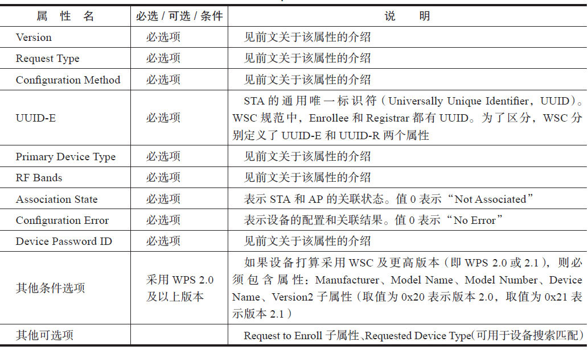
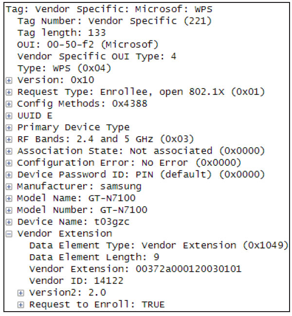
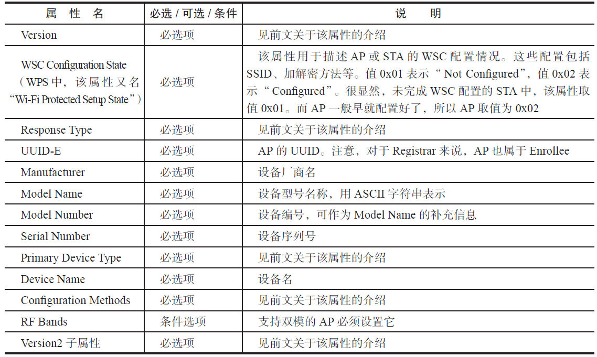
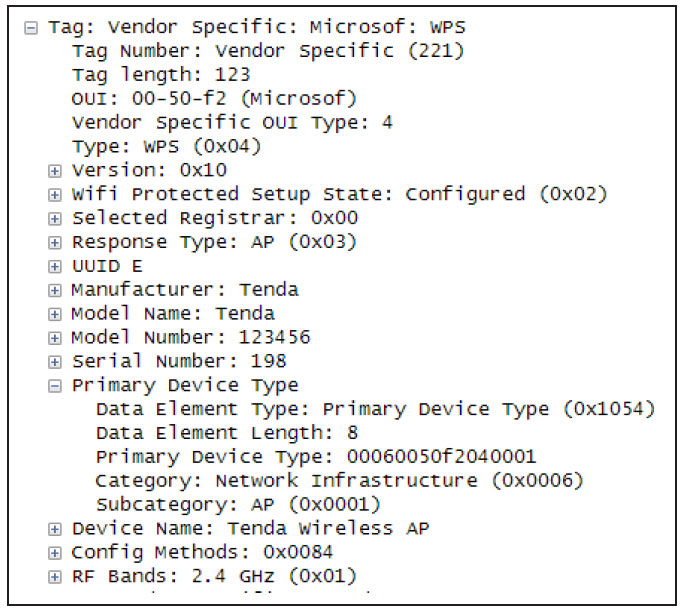
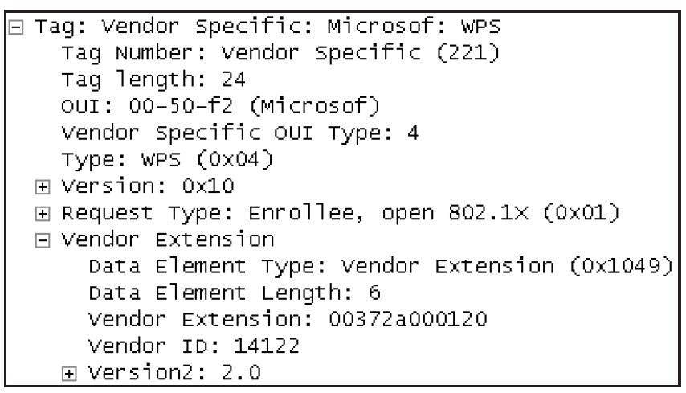
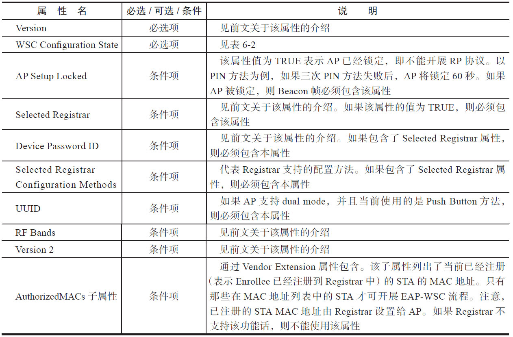
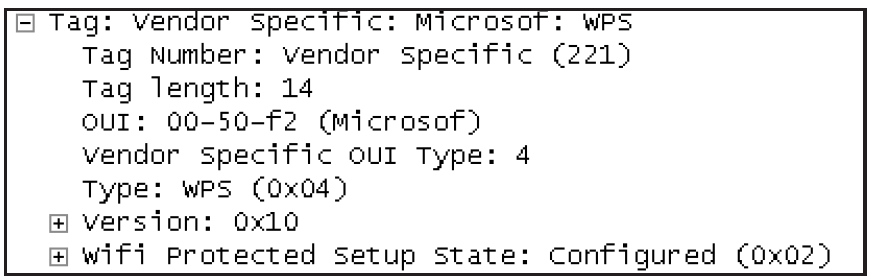

# 6.3.2 802.11管理帧WSC IE设置[4]

6.3.2802.11管理帧WSCIE设置[4]WSC规范规定，不同的管理帧中WSCIE必须包含一些特定属性，下面将简单介绍这些管理帧中WSCIE包含的属性及它们的作用。

1.ProbeRequest和Response帧设置ProbeRequest帧中WSCIE包含的属性如表6-1所示。

表6-1ProbeRequestWSCIE属性设置

图6-18所示为GalaxyNote2的ProbeRequestWSCIE的内容。

图6-18ProbeRequestWSCIE示例表6-2为ProbeResponse帧WSCIE属性设置说明。

表6-2ProbeResponseWSCIE属性设置

图6-19所示为笔者家中无线路由器开启WSC功能后发送的ProbeResponse帧WSCIE信息内容。

图6-19ProbeResponseWSCIE示例图6-19中还包含了一个名为SelectedRegistrar的属性，该属性的作用是，当AP已选择合适的Registrar后，该属性值为0x01，否则为0x00。对于StandaloneAP来说，如果其内部的Registrar组件启动，则设置该值为0x01。

提示由图6-19的示例可知，笔者使用的AP仅支持WPS，而不支持WSC。

2.AssociationRequest/Response和Beacon帧设置AssociationRequest/Response帧的WSCIE设置比较简单，如表6-3所示。

表6-3AssociationRequest/ResponseWSCIE属性设置AssociationRequest帧示例如图6-20所示。

图6-20AssociationRequestWSCIE属性Beacon帧WSCIE属性比较多，如表6-4所示。

表6-4BeaconWSCIE属性设置

笔者家中的无线路由器功能比较简单，其Beacon帧WSCIE仅包含了必选项属性，如图6-21所示。

图6-21BeaconWSCIE属性介绍完WSCIE，接着来看EAP-WSC流程。
