# 6.3.3 EAP-WSC介绍[4][5]

[4]​[5]6.3.3EAP-WSC介绍由图6-7所示的RP协议交互流程可知，DiscoveryPhase阶段之后，STA和AP将通过EAP包交换来完成安全信息协商。WSC规范利用EAP的扩展功能新定义了一种EAP算法，即EAP-WSC。EAP-WSC的包格式如图6-22所示。

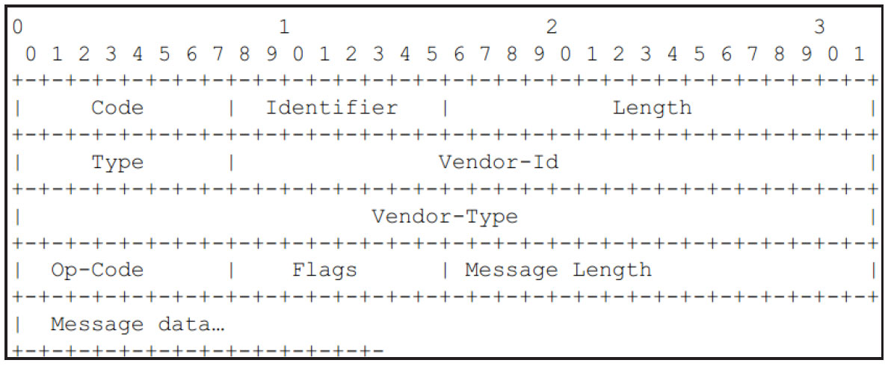

图6-22EAP-WSC包格式对于EAP-WSC来说，图6-22中各字段取值情况如下。

❑Type取值为254，代表EAP包中的内容由Vendor定义。

❑对于WSC来说，Vendor-Id取值为0x00372a，VendorType取值为0x0000-0001（WFA中，该值表示Simple-Config）​。

❑Op-Code及以后的内容由EAP-WSC定义，其取值有六种情况（见表6-5）​。

❑Flags包含两个标志位，一个是MF标志位（MoreFragments，取值为0x01，代表EAP分片包）​，另一个是LF标志位（LengthField，值为0x02）​。

❑如果LF标志位被设置，则MessageLength字段存在。该字段表示Messagedata的长度。

❑Messagedata为WSC定义的Aribute。

和WSCIE类似，WSC规范对不同EAP-WSC包携带的Aribute有严格要求。

表6-5所示为EAP-WSCOp-Code的取值。

表6-5EAP-WSCOp-Code取值说明

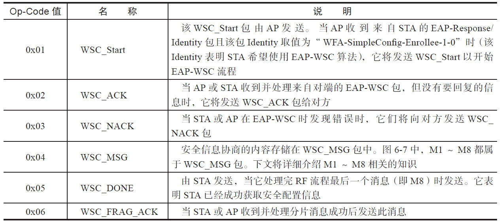

EAP-WSC和第4章介绍的4-WayHandshake类似，STA和AP双方要派生一些Key用于加密所传输的信息。

在STA和AP双方开展EAP-WSC流程前，AP需要确定STA的Identity以及使用的身份验证算法。该过程涉及三次EAP包交换（参考图3-38）​。这三次包交换的内容分别如下。

❑AP发送EAP-Request/Identity以确定STA的ID。

❑对于打算使用WSC认证方法的STA来说，它需要在回复的EAP-Response/Identity包中设置Identity为"WFA-SimpleConfig-Enroee-1-0"。

❑AP确定STA的Identity为"WFA-SimpleConfig-Enroee-1-0"后，将发送EAP-Request/WSC_Start包以启动EAP-WSC认证流程。这个流程讲涉及M1～M8相关的知识。下面我们将结合实例来介绍。

注意这些知识也是后续分析代码时的理论依据，请读者务必认真体会。

1.M1和M2M1消息由STA发送给AP。图6-23所示为GalaxyNote2发送的M1消息。

如前文所述，EAP-WSC消息的组成结构也是一个一个Aribute。图6-23所示的大部分Aribute在前文都已见过了，此处仅介绍黑框中所列的几个Aribute。

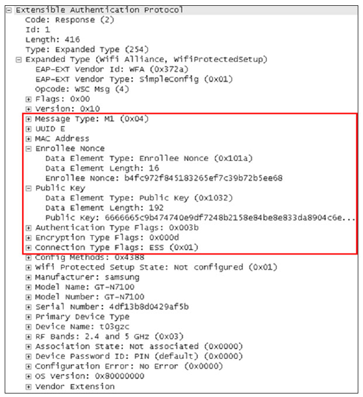

图6-23M1消息示例❑MessageType：代表Enroee和Registrar发送的消息类型，其可取值从0x01（代表Beacon帧）到0x0F（代表WSC_DONE）​。

该属性一般只在EAP-WSC帧中用到。对于M1消息而言，其MessageType取值为0x04。

❑UUID-E：代表STA的UUID。MACAddress代表STA的MAC地址。

❑EnroeeNonce：代表STA产生的一串随机数，它用于后续的密钥派生等工作。

❑PublicKey：STA和AP的密钥派生源头也是PMK。不过和第4章介绍的PSK不同的是，在WSCPIN法中并没有使用PSK（PIN码的作用[6]不是PSK）​。双方采用了Diffie-Heman（D-H）密钥交换算法。该算法使得通信的双方可以用这个方法确定对称密钥。注意，D-H算法只能用于密钥的交换，而不能进行消息的加密和解密。通信双方确定要用的密钥后，要使用其他对称密钥操作加密算法以加密和解密消息。PublicKey属性包含了Enroee的D-HKey值。

❑AuthenticationTypeFlags和EncryptionTypeFlags：表示Enroee支持的身份验证算法以及加密算法类型。

❑ConnectionTypeFlags：代表设备支持的802.11网络类型，值0x01代表ESS，值0x02代表IBSS。

图6-24所示为GalaxyNote2中AuthenticationTypeFlags和EncryptionTypeFlags两个属性的取值情况。

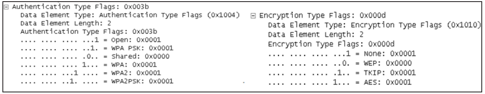

图6-24Authentication/EncryptionTypeFlags取值示例图6-24左图所示为AuthenticationTypeFlags的取值情况。其中，"WPA"和"WPA2"标志位是"WPA-Enterprise"以及"WPA2-Enterprise"之意。

AP收到并处理M1后，将回复M2。M2的内容如图6-25所示。

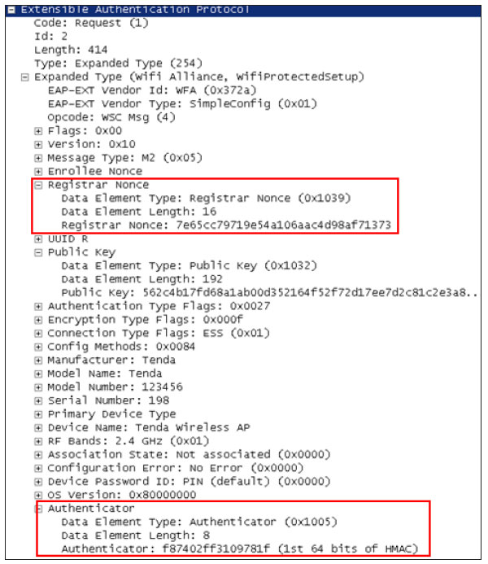

图6-25M2消息示例图6-25中，AP的M2将携带以下信息。

❑RegistrarNonce：Registrar生成的随机数。

❑PublicKey：D-H算法中，Registrar一方的D-HKey值。

❑Authenticator：由HMAC-SHA-256及AuthKey（详情见下文）算法得来一个256位的二进制串。注意，Authenticator属性只包含其中的前64位二进制内容。

提示AP发送M2之前，会根据EnroeeNonce、EnroeeMAC以及RegistrarNonce并通过D-H算法计算一个KDK（KeyDerivationKey）​，KDK密钥用于其他三种Key派生，这三种Key分别用于加密RP协议中的一些属性的AuthKey（256位）​、加密Nonce和ConfigData（即一些安全配置信息）的KeyWrapKey（128位）以及派生其他用途Key的EMSK（ExtendedMasterSessionKey）​。

2.M3和M4STA处理完M2消息后，将回复M3消息，其内容如图6-26所示。

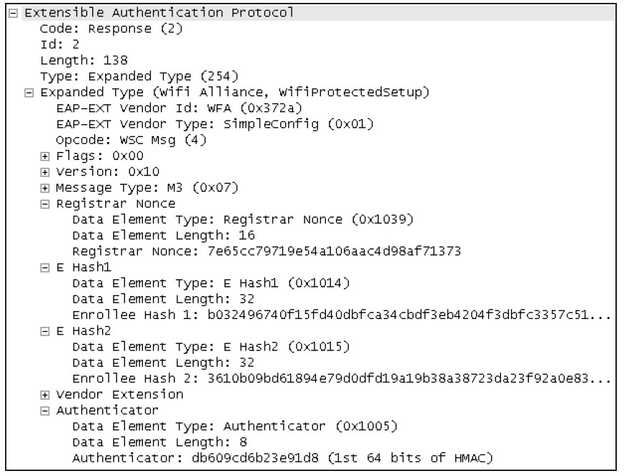

图6-26M3消息示例图6-26中：

❑RegistrarNonce值来源于M2的RegistrarNonce属性。

❑EHash1和EHash2属性的计算比较复杂，详情见下文。

❑Authenticator是STA利用AuthKey（STA收到M2的RegistrarNonce后也将计算一个AuthKey）计算出来的一串二进制位。

根据WSC规范，EHash1和EHash2的计算过程如下。

1）利用AuthKey和PIN码利用HMAC算法分别生成两个PSK。其中，PSK1由PIN码前半部分生成，PSK2由PIN码后半部分生成。

2）利用AuthKey对两个新随机数128Nonce进行加密，以得到E-S1和E-S2。

3）利用HMAC算法及AuthenKey分别对（E-S1、PSK1、STA的D-HKey和AP的D-HKey）计算得到EHash1。EHash2则由E-S2、PSK2、STA的D-HKey和AP的D-HKey计算而来。

AP收到并处理完M3后将回复M4，其内容如图6-27所示。

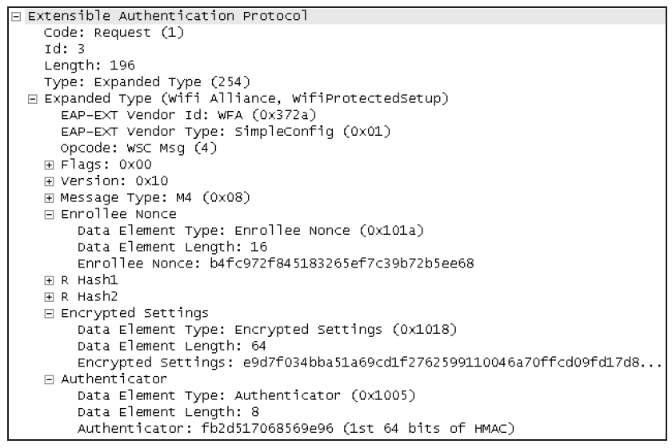

图6-27M4消息示例由图6-27可知：

❑AP将计算RHash1和RHash2。其使用的PIN码为用户通过AP设置界面输入的PIN码。

很显然，如果AP设置了错误PIN码的话，STA在比较RHash1/2和EHash1/2时就会发现二者不一致，从而可终止EAP-WSC流程。

❑EncryptedSettings为AP利用KeyWrapKey加密R-S1得到的数据。

3.M5和M6M5消息和M4消息类似，如图6-28所示。

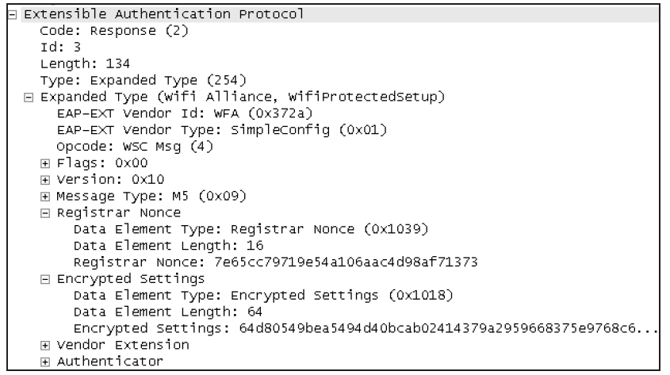

图6-28M5消息示例图6-28所示的EncryptedSettings为STA利用KeyWrapKey加密E-S1得来。

M6消息如图6-29所示。

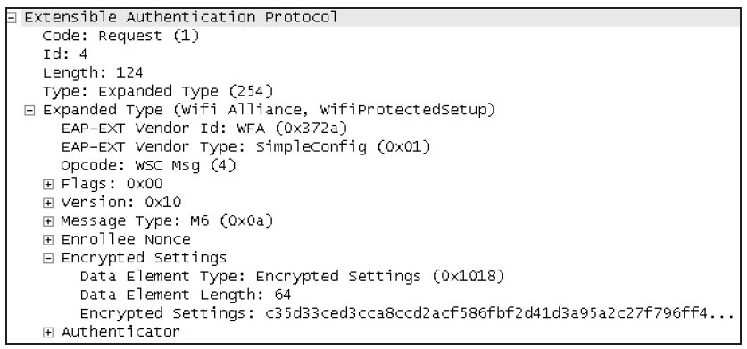

图6-29M6消息示例图6-29所示的M6消息中，EncrypedSettings为AP利用KeyWrapKey加密R-S2而来。

4.M7和M8由M5、M6的内容可知，STA的M7将发送利用KeyWrapKey加密E-S2的信息给AP以进行验证，如图6-30所示。

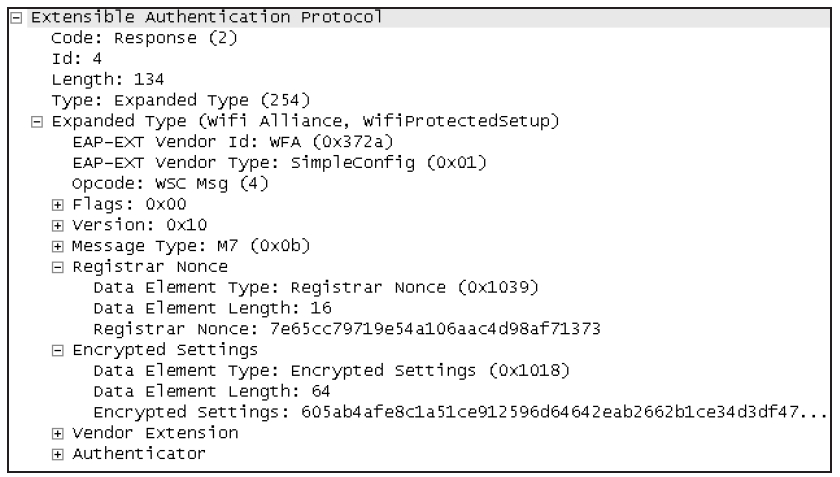

图6-30M7消息示例当AP确定M7消息正确无误后，它将发送M8消息，而M8将携带至关重要的安全配置信息，如图6-31所示。

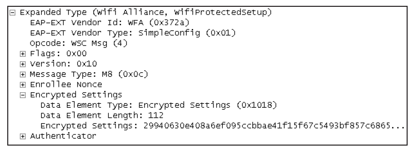

图6-31M8消息示例图6-31中，安全配置信息保存在EncryptedSettings中，它由KeyWrapKey加密。WSC规范规定，当Enroee为STA时（对Registrar来说，AP也是Enroee）​，EncryptedSettings将包含若干属性，其中最重要的就是Credential属性集合，该属性集的内容如表6-6所示。

表6-6Credential属性集合的内容

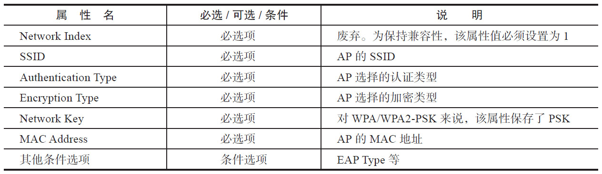

由表6-6可知，当STA收到M8并解密其中的Credential属性集合后，将得到AP的安全设置信息。很显然，如果不使用WSC，用户需要手动设置这些信息。使用了WSC后，这些信息将在M8中由AP发送给STA。

接下来，STA就可以利用这些信息加入AP对应的目标无线网络了。

5.EAP-WSC总结EAP-WSCM1～M8一共涉及8次EAP包交换，每次帧交换的内容如图6-32所示。

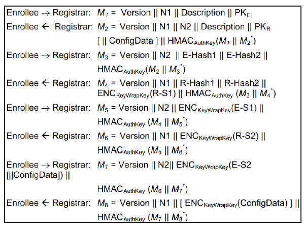

图6-32EAP-WSC帧交换内容图6-32对前面几小节所提到的EAP-WSC帧内容进行了简化，其中：

❑Description代表UUID、Manufacturer、MAC地址等信息。

❑PK和PK代表D-H算法的Enroee方的ERKey以及Registrar方的Key。

❑M*代表没有包含HMAC-SHA-256结果的x第X次消息内容。

❑HMAC代表利用AuthenKey和AuthenKeyHMAC-SHA-256算法进行计算。

❑ENC代表利用KeyWrapKey进KeyWrapKey行加密。

❑“​[…]​”中的内容为可选信息。

❑N1和N2分别代表Enroee和Registrar的Nonce。

STA处理完M8消息后，将回复WSC_DONE消息给AP，表示自己已经成功处理M8消息。接下来的工作就如图6-7所示一样。

❑AP发送EAP-FAIL以及Deauthentication帧给STA。STA收到该帧后将取消和AP的关联。

❑STA将重新扫描周围的无线网络。由于STA以及获取了AP的配置信息，所以它可以利用这些信息加入AP所在的无线网络。

以上对WSC理论知识进行了一番介绍。其中有一些知识点请读者注意。

❑WSC的组成结构。规范中定义了AP、Enroee和Registrar三大组件。日常生活中比较常见的实体是作为Enroee的智能手机，以及集成了AP和Registrar功能的无线路由器（StandaloneAP）​。

❑WSC拓展了802.11IE的内容，而WSCIE包含了由WSC定义的不同Aribute。了解这些Aribute的作用对于理解WSC非常重要。另外，规范还对管理帧包含什么样的Aribute有严格规定。

❑STA和StandaloneAP使用RP协议交互的流程如图6-7所示。另外，请读者掌握EAP-WSCM1到M8帧包含的属性及作用。

注意完整的WSC规范所包含的知识点比本节阐述得要多。在此，建议读者先学完本章内容后再去研读WSC规范。

下面来看Android中WSC相关的实现代码。

如果读者真正掌握本节所示知识点的话，下面一节的学习过程将非常轻松。
