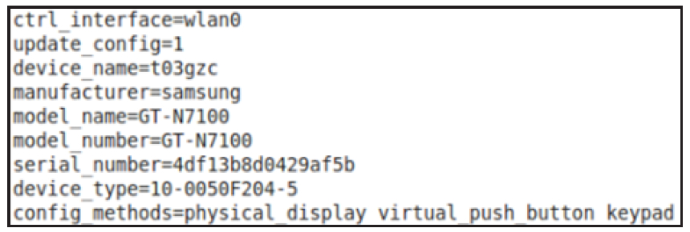

# 6.4.3 wpa_supplicant中的WSC处理


```
int wpas_wps_init(struct wpa_supplicant *wpa_s)
{
    struct wps_context *wps;    // wps_context是WPS模块的核心数据结构
    // wps_registrar_config代表Registrar的配置信息
    struct wps_registrar_config rcfg;
    struct hostapd_hw_modes *modes;
    u16 m;
    wps = os_zalloc(sizeof(*wps));
    ......
    /*
    设置两个重要的回调函数。其中，cred_cb在EAP-WSC模块解析credential属性集时使用。后面将见到其用法。
    event_cb用于通知WSC模块发生的一些事件。例如“WSC-SUCCESS”就在wpa_supplicant_wps_event
    中处理。
    */
    wps-＞cred_cb = wpa_supplicant_wps_cred;
    wps-＞event_cb = wpa_supplicant_wps_event;
    wps-＞cb_ctx = wpa_s;
    // 初始化设备信息，这些信息来自图6-33中的配置
    wps-＞dev.device_name = wpa_s-＞conf-＞device_name;
    wps-＞dev.manufacturer = wpa_s-＞conf-＞manufacturer;
    wps-＞dev.model_name = wpa_s-＞conf-＞model_name;
    wps-＞dev.model_number = wpa_s-＞conf-＞model_number;
    wps-＞dev.serial_number = wpa_s-＞conf-＞serial_number;
    wps-＞config_methods = // 将字符串描述的WSC方法转换成对应的标志位
        wps_config_methods_str2bin(wpa_s-＞conf-＞config_methods);
    ......// 配置参数检查，Label和Display不能同时配置。即设备不能同时使用静态PIN码和动态PIN码
    /*
    WSC规范新增了Virtual Push Button和Virtual Display两种方法，wps_fix_config_methods
    函数将判断设备是否支持Push Button或者Display。如果二者支持，需要为WSC添加对应的Virtual
    方法。下面这个函数仅在CONFIG_WPS2宏被定义的情况下有实际作用。
    */
    wps-＞config_methods = wps_fix_config_methods(wps-＞config_methods);
    wps-＞dev.config_methods = wps-＞config_methods;
    os_memcpy(wps-＞dev.pri_dev_type, wpa_s-＞conf-＞device_type, WPS_DEV_TYPE_LEN);
    wps-＞dev.num_sec_dev_types = wpa_s-＞conf-＞num_sec_device_types;
    os_memcpy(wps-＞dev.sec_dev_type, wpa_s-＞conf-＞sec_device_type,
          WPS_DEV_TYPE_LEN * wps-＞dev.num_sec_dev_types);
    wps-＞dev.os_version = WPA_GET_BE32(wpa_s-＞conf-＞os_version);
    modes = wpa_s-＞hw.modes;
    // 设置RF Bands相关信息
    if (modes) {
        for (m = 0; m ＜ wpa_s-＞hw.num_modes; m++) {
            if (modes[m].mode == HOSTAPD_MODE_IEEE80211B ||
                modes[m].mode == HOSTAPD_MODE_IEEE80211G)
                wps-＞dev.rf_bands |= WPS_RF_24GHZ;
            else if (modes[m].mode == HOSTAPD_MODE_IEEE80211A)
                wps-＞dev.rf_bands |= WPS_RF_50GHZ;
        }
    }
    if (wps-＞dev.rf_bands == 0)  wps-＞dev.rf_bands = WPS_RF_24GHZ | WPS_RF_50GHZ;
    os_memcpy(wps-＞dev.mac_addr, wpa_s-＞own_addr, ETH_ALEN);
    wpas_wps_set_uuid(wpa_s, wps); // 设置uuid，如果没有配置的话，则利用MAC地址生成UUID
    // STA默认支持的认证算法和加密算法
    // 结合前面介绍的理论知识，读者能想起来对应的Attribute是什么吗
    wps-＞auth_types = WPS_AUTH_WPA2PSK | WPS_AUTH_WPAPSK;
    wps-＞encr_types = WPS_ENCR_AES | WPS_ENCR_TKIP;
    os_memset(&rcfg, 0, sizeof(rcfg));
    rcfg.new_psk_cb = wpas_wps_new_psk_cb;
    rcfg.pin_needed_cb = wpas_wps_pin_needed_cb;
    rcfg.set_sel_reg_cb = wpas_wps_set_sel_reg_cb;
    rcfg.cb_ctx = wpa_s;
    /*
    创建一个wps_registrar对象，该对象代表Registrar。不过Enrollee中用不到它，故此处不开展
    分析。感兴趣的读者请在学完本章后再自行研究相关内容。
    */
    wps-＞registrar = wps_registrar_init(wps, &rcfg);
    ......
    wpa_s-＞wps = wps;
    return 0;
}
```

```java
static int wpa_supplicant_init_iface(struct wpa_supplicant *wpa_s,
                     struct wpa_interface *iface)
{
 ......// 其他代码。可参考4.3.4节“wpa_supplicant_init_iface分析之五”
  // 调用wpas_wps_init函数初始化WSC相关模块
  if (wpas_wps_init(wpa_s))  return -1;
   if (wpa_supplicant_init_eapol(wpa_s) ＜ 0)  return -1;
   wpa_sm_set_eapol(wpa_s-＞wpa, wpa_s-＞eapol);
   ......
}
```

注意，在WPAS代码中WSC称为WPS2。为了行文方便，以后将不再区分WPS和WSC。

wpas_wps_init的代码如下所示。

[--＞wps_supplicant.c：​：wpas_wps_init]图6-33为GalaxyNote2中wpa_supplicant.conf的配置文件。



图6-33wpa_supplicant.conf示例下面来看WPS_PIN命令的处理流程。

2.WPS_PIN命令处理根据前文介绍，WifiStateMachine将发

```java
static int wpa_supplicant_ctrl_iface_wps_pin
                             (struct wpa_supplicant *wpa_s, char *cmd,
                             char *buf,  size_t buflen)
{
    u8 bssid[ETH_ALEN], *_bssid = bssid;
    char *pin; int ret;
    /*
    cmd传入此函数时已经将“WPS_PIN any”中的“WPS_PIN ”（注意右边引号前的空格）子串忽略了，
    所以cmd的取值是“any”。
    */
    pin = os_strchr(cmd, ' ');
    if (pin)  *pin++ = '\0';
    if (os_strcmp(cmd, "any") == 0)
        _bssid = NULL;
    ......
    if (pin) {
        // 上层没有传入PIN码，故略去此段代码
    }
    // 启动WPS流程。详情见下文
    ret = wpas_wps_start_pin(wpa_s, _bssid, NULL, 0, DEV_PW_DEFAULT);
    ......
done:
    ret = os_snprintf(buf, buflen, "%08d", ret); // 将PIN码转成字符串返回给WifiStateMachine
  return ret;
}
```

送"WPS_PINany"命令给WPAS以触发WSC的工作流程。该命令的处理代码如下所示。

[--＞ctrl_iface.c：​：

wpa_supplicant_ctrl_iface_wps_pin]上述代码中，wpas_wps_start_pin函数将被调用以开始WPS流程。调用该函数时，相关的参数取值情况是：_bssid为NULL，DEV_PW_DEFAULT值为0。

来看wpas_wps_start_pin的代码，如下所示。

```c
int wpas_wps_start_pin(struct wpa_supplicant *wpa_s, const u8 *bssid,
               const char *pin, int p2p_group, u16 dev_pw_id)
{
    struct wpa_ssid *ssid;
    char val[128];
    unsigned int rpin = 0;
    wpas_clear_wps(wpa_s); // 清空之前的WPS信息
    /*
    wpas_wps_add_network将创建一个wpa_ssid对象，它用于保存一个无线网络的配置信息。
    在wpas_wps_add_network中，该网络的key_mgmt将被为WPA_KEY_MGMT_WPS。另外，每一个wpa_ssid对象
    都有一个类型为eap_peer_config的成员，该成员用于保存EAP Supplicant的配置信息。对于WPS来说，
    该配置信息的Method被设置为EAP-WSC，identity被设为“WFA-SimpleConfig-Enrollee-1-0”。
    wpas_wps_add_network函数比较简单，请读者自行研究。
    */
    ssid = wpas_wps_add_network(wpa_s, 0, bssid);
    ......
    ssid-＞temporary = 1;
    ssid-＞p2p_group = p2p_group;
    ......// CONFIG_P2P的处理
    if (pin)
        os_snprintf(val, sizeof(val), "\"pin=%s dev_pw_id=%u\"",pin, dev_pw_id);
    else {
        /*
        生成一个随机PIN码。WSC对PIN码格式有所规定。PIN码一共包含8个数字，最后一个数字（即最右边的
        一个数字是前7个数字的校验和）。
        */
        rpin = wps_generate_pin();
        // 以图6-2为例，PIN码为“01308204”，所以下面val的值为“pin=01308204 dev_pw_id=0”
        os_snprintf(val, sizeof(val), "\"pin=%08d dev_pw_id=%u\"",rpin, dev_pw_id);
    }
    // 将value值保存到wpa_ssid中eap成员变量的phase1中
    wpa_config_set(ssid, "phase1", val, 0);
    if (wpa_s-＞wps_fragment_size)
        ssid-＞eap.fragment_size = wpa_s-＞wps_fragment_size;
    // 注册一个WSC超时任务，超时时间是120秒。该时间也是由WSC规范规定的
    eloop_register_timeout(WPS_PBC_WALK_TIME, 0, wpas_wps_timeout, wpa_s, NULL);
    // 重新关联并发起扫描。该函数比较简单，请读者自行研究。该函数内部将发起扫描请求
    wpas_wps_reassoc(wpa_s, ssid, bssid);
    return rpin;
}
```

[--＞wps_supplicant.c：​：

wpas_wps_start_pin]由上述代码可知，wpas_wps_start_pin添加了一个潜在的和WPS相关的无线网络配置项。接下来的工作自然是需要扫描周围的无线网络以搜索那些支持WSC功能的AP。这一工作正是属于前文介绍的WSCDiscoveryPhase。

3.发起扫描请求根据前文对WSC基础知识的介绍，STA发起扫描请求时需要在ProbeRequest帧中添加WSCIE。WPAS中，扫描工作的代码在wpa_supplicant_scan函数中，我们重点关注其中和WSC相关的部分，如下所示。

[--＞scan.c：​：wpa_supplicant_scan]

```c
static void wpa_supplicant_scan(void *eloop_ctx, void *timeout_ctx)
{
    ......// 该函数的详情请参考4.5.3节“无线网络扫描流程分析”
    wpa_supplicant_optimize_freqs(wpa_s, &params);
    // 下面这个函数将处理WSC IE
    extra_ie = wpa_supplicant_extra_ies(wpa_s, &params);
}
```

```c
static struct wpabuf *
wpa_supplicant_extra_ies(struct wpa_supplicant *wpa_s, struct wpa_driver_scan_params *params)
{
    struct wpabuf *extra_ie = NULL;
#ifdef CONFIG_WPS   // 处理WPS
    int wps = 0;
    enum wps_request_type req_type = WPS_REQ_ENROLLEE_INFO;
#endif /* CONFIG_WPS */
#ifdef CONFIG_WPS
    /*
    wpas_wps_in_use判断是否需要在Probe Request中添加WSC IE。WPAS的判断标准比较简单，
    就是查询所有的wpa_ssid对象，判断它们的key_mgmt是否设置了WPA_KEY_MGMT_WPS。如果有，
    表明搜索的时候需要支持WSC IE。我们在介绍“WPS_PIN命令处理”时曾说过，WPAS将添加一个
    wpa_ssid对象，并设置key_mgmt为WPA_KEY_MGMT_WPS。
    wpas_wps_in_use的返回值也有含义，返回1表明使用PIN方法，返回2表明使用PBC方法。
    wpas_wps_in_use函数比较简单，请读者自行阅读。
    */
    wps = wpas_wps_in_use(wpa_s, &req_type);
    if (wps) {
        struct wpabuf *wps_ie;
        // 构造Probe Request中的WSC IE
        wps_ie = wps_build_probe_req_ie(wps == 2, &wpa_s-＞wps-＞dev,
                                       wpa_s-＞wps-＞uuid, req_type, 0, NULL);
        if (wps_ie) {
            if (wpabuf_resize(&extra_ie, wpabuf_len(wps_ie)) == 0)
                wpabuf_put_buf(extra_ie, wps_ie);
            wpabuf_free(wps_ie);
        }
    }
  ......// CONFIG_P2P处理
#endif /* CONFIG_WPS */
    return extra_ie;
}
```

[--＞scan.c：​：wpa_supplicant_extra_ies]wps_build_probe_req_ie用于构造WSCIE，

```c
struct wpabuf * wps_build_probe_req_ie(int pbc, struct wps_device_data *dev,
          const u8 *uuid, enum wps_request_type req_type,unsigned int num_req_dev_types,
                        const u8 *req_dev_types)
{
    struct wpabuf *ie;
    ie = wpabuf_alloc(500);
    ......
    if (wps_build_version(ie) ||wps_build_req_type(ie, req_type) ||
        wps_build_config_methods(ie, dev-＞config_methods) ||wps_build_uuid_e(ie, uuid) ||
        wps_build_primary_dev_type(dev, ie) || wps_build_rf_bands(dev, ie) ||
        wps_build_assoc_state(NULL, ie) || wps_build_config_error(ie, WPS_CFG_NO_ERROR) ||
        wps_build_dev_password_id(ie, pbc ? DEV_PW_PUSHBUTTON : DEV_PW_DEFAULT) ||
#ifdef CONFIG_WPS2 // WPS2即WSC
        wps_build_manufacturer(dev, ie) || wps_build_model_name(dev, ie) ||
        wps_build_model_number(dev, ie) || wps_build_dev_name(dev, ie) ||
        wps_build_wfa_ext(ie, req_type == WPS_REQ_ENROLLEE, NULL, 0) ||
#endif /* CONFIG_WPS2 */
        wps_build_req_dev_type(dev, ie, num_req_dev_types, req_dev_types)
        ||wps_build_secondary_dev_type(dev, ie)) {......// 错误处理}
      ......
    return wps_ie_encapsulate(ie);
}
```

读者可简单了解一下该函数，相关代码如下所示。

[--＞wps.c：​：wps_build_probe_req_ie]最后，WPAS将发送携带了WSCIE的ProbeRequest帧。对于GalaxyNote2来说，其发送的WSCIE信息可参考图6-18。

4.处理扫描结果发送扫描请求后，WPAS下一步的工作就是处理搜索到的扫描结果。这部分的流程在4.5.3节扫描结果处理流程中有详细分析。在该流程中，和WSC相关的工作如下。

❑wpa_supplicant_get_scan_results：获取扫描结果。该函数内部将对搜索到的AP进行排序，它对WSC有特殊处理。

❑wpa_supplicant_pick_network：选择合适的AP作为目标AP。如果使用WSC的话，该函数将优先选择支持WSC的AP。

下面将分别介绍上述两个函数中和WSC处理相关的流程。

```c
struct wpa_scan_results * wpa_supplicant_get_scan_results(struct wpa_supplicant *wpa_s,
                  struct scan_info *info, int new_scan)
{
    ......
    // 获取扫描结果
    scan_res = wpa_drv_get_scan_results2(wpa_s);
#ifdef CONFIG_WPS
    // WPAS当前处于WPS处理过程中，设置排序函数为wpa_scan_result_wps_compar
    if (wpas_wps_in_progress(wpa_s)) compar = wpa_scan_result_wps_compar;
#endif /* CONFIG_WPS */
    // 利用qsort函数对扫描结果进行升序排序。排序时将使用compar函数将较两个元素A、B的大小
    //  compar返回负数，表示A ＜ B，compar返回0，表示A=B，compar返回正数，表示A ＞ B
    qsort(scan_res-＞res, scan_res-＞num, sizeof(struct wpa_scan_res *),compar);
    ......// 更新BSS
    return scan_res;
}
```

（1）wpa_supplicant_get_scan_results处理代码如下。

[--＞scan.c：​：

wpa_supplicant_get_scan_results]

```c
static int wpa_scan_result_wps_compar(const void *a, const void *b)
{
    struct wpa_scan_res **_wa = (void *) a;
    struct wpa_scan_res **_wb = (void *) b;
    struct wpa_scan_res *wa = *_wa;
    struct wpa_scan_res *wb = *_wb;
    int uses_wps_a, uses_wps_b;
    struct wpabuf *wps_a, *wps_b;
    int res;
    /*
    wpa_scan_get_vendor_ie返回值的类型为u8*，它指向wpa_scan_res中指定IE（此处是
    WSC IE）所在的内存位置。如果wpa_scan_res中没有WSC IE，则返回为空。
    */
    uses_wps_a = wpa_scan_get_vendor_ie(wa, WPS_IE_VENDOR_TYPE) != NULL;
    uses_wps_b = wpa_scan_get_vendor_ie(wb, WPS_IE_VENDOR_TYPE) != NULL;
    // 无线网络A支持WPS，而B不支持，则返回-1。这样，在“排座位”的时候，A将排在前面（A ＜ B）
    if (uses_wps_a && !uses_wps_b)      return -1;
    // 无线网络A不支持WPS，而B支持，则B排在前面（B ＜ A）
    if (!uses_wps_a && uses_wps_b)      return 1;
    // 如果无线网络A和B均支持WPS，则还需要进一步判断
    if (uses_wps_a && uses_wps_b) {
        /*
        wpa_scan_get_vendor_ie_multi将从拷贝指定IE的内容复制到一块新的内存中，该内存地址即
        wpa_scan_get_vendor_ie_multi的返回值。
        */
        wps_a = wpa_scan_get_vendor_ie_multi(wa, WPS_IE_VENDOR_TYPE);
        wps_b = wpa_scan_get_vendor_ie_multi(wb, WPS_IE_VENDOR_TYPE);
        /*
        如果周围有多个支持WPS的无线网络，则设置Selected Registrar属性(而且值为1)的AP
        将位于前排。
        */
        res = wps_ap_priority_compar(wps_a, wps_b);
        wpabuf_free(wps_a); // 释放wpa_scan_get_vendor_ie_multi创建的新内存
        wpabuf_free(wps_b);
        if (res) return res;
    }
        // 对于没有WSC支持的AP，其排座顺序仅考虑它们的信号强度和质量
        if (wb-＞level == wa-＞level)
            return wb-＞qual - wa-＞qual;
        return wb-＞level - wa-＞level;
}
```

由上述代码可知，当WPAS正处于WPS处理流程中，搜索到的AP将通过qsort以及wpa_scan_result_wps_compar进行排序比较。wpa_scan_result_wps_compar的代码如下所示。

[--＞scan.c：​：

wpa_scan_result_wps_compar]根据上面的代码可知，WSC的AP扫描结果“排座”规则如下。

❑支持WSC功能的AP排在不支持WSC的AP之前。

❑对于两个同时支持WSC功能的AP来说，SelectedRegsitrar值为1的AP排在前面。

❑对于不支持WSC的AP来说，信号强度和质

```c
static struct wpa_bss * wpa_supplicant_pick_network(struct wpa_supplicant *wpa_s,
                          struct wpa_scan_results *scan_res, struct wpa_ssid **selected_ssid)
{
    struct wpa_bss *selected = NULL;  int prio;
    while (selected == NULL) { // 按照优先级搜索扫描结果
        for (prio = 0; prio ＜ wpa_s-＞conf-＞num_prio; prio++) {
            selected = wpa_supplicant_select_bss(wpa_s, scan_res, wpa_s-＞conf-＞pssid[prio],
                selected_ssid);
            if (selected)  break;
        }
     ......// 其他处理
    }
     return selected;
}
```

```c
static struct wpa_ssid * wpa_scan_res_match(struct wpa_supplicant *wpa_s,
                       int i, struct wpa_scan_res *bss,struct wpa_ssid *group)
{
    const u8 *ssid_;  u8 wpa_ie_len, rsn_ie_len, ssid_len;
    int wpa;  struct wpa_blacklist *e;
    const u8 *ie;  struct wpa_ssid *ssid;
    ie = wpa_scan_get_ie(bss, WLAN_EID_SSID);
    ssid_ = ie ? ie + 2 : (u8 *) "";
    ssid_len = ie ? ie[1] : 0;
    ......
    for (ssid = group; ssid; ssid = ssid-＞pnext) {
        int check_ssid = wpa ? 1 : (ssid-＞ssid_len != 0);
        ......
#ifdef CONFIG_WPS
        if ((ssid-＞key_mgmt & WPA_KEY_MGMT_WPS) && e && e-＞count ＞ 0) continue;
        /*
        通过“WPS_PIN any”命令创建的wpa_ssid还没有设置ssid。wpas_wps_ssid_wildcard_ok
        用于判断是否需要进行ssid检查。该函数内部将利用下文代码中提到的wps_is_addr_authorized函数。
        由于笔者测试用的AP仅支持WPS，所以wpas_wps_ssid_wildcard_ok返回非零值。这样，if条件生效，
        check_ssid被设置为0。
        */
        if (wpa && ssid-＞ssid_len == 0 &&
            wpas_wps_ssid_wildcard_ok(wpa_s, ssid, bss)) check_ssid = 0;
        ......
#endif /* CONFIG_WPS */
        ......// 其他判断
        // 该函数内部先调用wpas_wps_ssid_bss_match函数以判断是否有合适的AP，如果有则选中它
        if (!wpa_supplicant_ssid_bss_match(wpa_s, ssid, bss))  continue;
        ......// 其他判断。例如检查wpa_ssid中的ssid是否匹配搜索结果中的ssid。如果不匹配，则不能选择该AP
        return ssid;
    }
    return NULL;
}
```

量好的AP排在前面。

当扫描结果排完序后，WPAS的下一步工作就是从众多搜索到的AP中挑选一个作为目标AP以发起关联请求。该工作由wpa_supplicant_pick_network完成。

（2）wpa_supplicant_pick_network处理wpa_supplicant_pick_nework的代码比较简单，如下所示。

[--＞events.c：​：

wpa_supplicant_select_bss内部将通过调用wpa_supplicant_pick_nework]wpa_scan_res_match的函数来选取一个合适的无线网络。该函数的代码如下所示。

[--＞events.c：​：wpa_scan_res_match]

```c
int wpas_wps_ssid_bss_match(struct wpa_supplicant *wpa_s,struct wpa_ssid *ssid,
                                   struct wpa_scan_res *bss)
{
    struct wpabuf *wps_ie;
    if (!(ssid-＞key_mgmt & WPA_KEY_MGMT_WPS))  return -1;
   // 获取该WSC IE信息
    wps_ie = wpa_scan_get_vendor_ie_multi(bss, WPS_IE_VENDOR_TYPE);
    if (eap_is_wps_pbc_enrollee(&ssid-＞eap)) { ......// PBC处理}
    // 判断eap_peer_config设置的identity是否为“WFA-SimpleConfig-Enrollee-1-0”
    if (eap_is_wps_pin_enrollee(&ssid-＞eap)) {
        .......
        /*
        笔者使用的AP没有包含AuthorizedMACs子属性，并且该AP也不支持WSC。所以下面这个函数将返回1，
        如此，if判断失败。读者可参考图6-19。
        */
        // AP返回的Probe Response帧信息
        if (!wps_is_addr_authorized(wps_ie, wpa_s-＞own_addr, 1)) ......
        else {
            wpa_printf(MSG_DEBUG, "   selected based on WPS IE "
                   "(Authorized MAC or Active PIN)");
        }
        wpabuf_free(wps_ie);
        return 1;                        // 选中
    }
     ......
     return -1;
}
```

直接来看wpas_wps_ssid_bss_match函数，代码如下所示。

[--＞wpa_supplicant.c：​：

wpas_wps_ssid_bss_match]总之，在周围空间有很多无线网络的情况下，笔者测试WSC时使用的AP将会被选中作为目标AP。接下来的流程就和4.5.3节关联无线网络处理流程分析的内容一样，STA将关联到目标AP。对于非WSC来说，AP和STA将开展4-WayHandshake流程，而对于WSC来说，AP和STA将开展EAP-WSC流程。

马上来看EAP-WSC处理流程，它也是整个WSC流程的核心内容。
