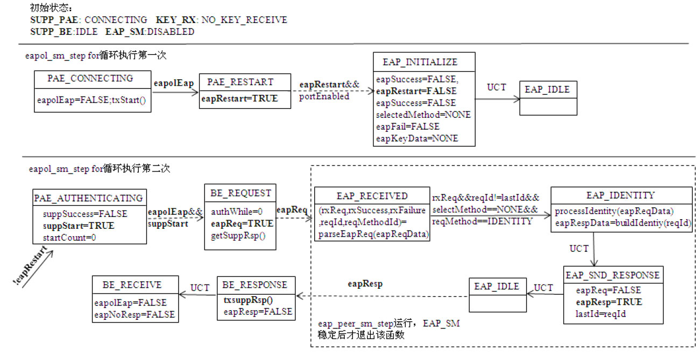
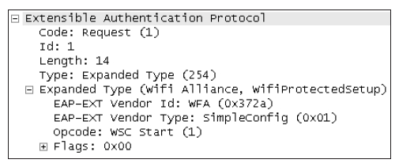
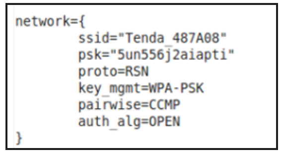

# 6.4.4 EAP-WSC处理流程分析


```
SM_STATE(SUPP_PAE, CONNECTING)
{
    // SUPP_PAE_state此时的值为SUPP_PAE_DISCONNECTED，故send_start为0
    // 注意下面这个判断很重要，待会还会回到此处
    int send_start = sm-＞SUPP_PAE_state == SUPP_PAE_CONNECTING;
    SM_ENTRY(SUPP_PAE, CONNECTING);
    if (send_start) {
        sm-＞startWhen = sm-＞startPeriod;
        sm-＞startCount++;
    }else {
#ifdef CONFIG_WPS  //
        sm-＞startWhen = 1;              // 注意，如果WPAS支持WPS，则startWhen值为1
#else /* CONFIG_WPS */
        sm-＞startWhen = 3;
#endif /* CONFIG_WPS */
    }
    // 启动Port Timers SM，Port Timers SM将递减startWhen，并调用eapol_sm_step以重新遍历状态机
    eapol_enable_timer_tick(sm);
    sm-＞eapolEap = FALSE; ..
    // 由于send_start为0，所以此时还不会发送EAPOL-Start包
    if (send_start)  eapol_sm_txStart(sm);
}
```

致STA发送EAPOL-Start帧呢？来看下文。

1.发送EAPOL-Start在STA关联到AP流程的最后，eapol_sm_notify_portEnabled将设置portEnabled为1，根据代码（eapol_supp_sm.c中的SM_STEP（SUPP_PAE）​）以及图4-28可知，SUPP_PAE要进入的下一个状态是CONNECTING，其EA（EntryAciton）代码如下。

[--＞eapol_supp_sm.c：​：SM_STATE（SUPP_PAE，CONNECTING）​]

```c
SM_STEP(SUPP_PAE)
{
    ......// 略去不相关的内容
    else switch (sm-＞SUPP_PAE_state) {       // SUPP_PAE_state还处于CONNECTING状态
      ......
        case SUPP_PAE_CONNECTING:
        if (sm-＞startWhen == 0 && sm-＞startCount ＜ sm-＞maxStart)
            SM_ENTER(SUPP_PAE, CONNECTING);
            // 由于startWhen为0，PAE将重新进入CONNECTING状态
        ......
        break;
    case SUPP_PAE_AUTHENTICATING:
    ......
    }
}
```

```c
static void eapol_sm_txStart(struct eapol_sm *sm)
{
    // eapol_send函数指针指向wpa_supplicant_eapol_send
    // 相关代码在wpas_glue.c中，请读者自行阅读
    sm-＞ctx-＞eapol_send(sm-＞ctx-＞eapol_send_ctx,
    IEEE802_1X_TYPE_EAPOL_START, (u8 *) "", 0);
    sm-＞dot1xSuppEapolStartFramesTx++;
    sm-＞dot1xSuppEapolFramesTx++;
}
```

根据代码中的注释，当PortTimersSM运行时，它将递减startWhen变量（结果是startWhen的值变为0）​，然后通过eapol_sm_step重新遍历状态机。在该函数中，PAE的SM_STEP将被调用以检查是否需要进行状态切换，相关代码如下所示。

根据上面代码可知，PAE将再次从[--＞eapol_supp_sm.c：​：SM_STEPCONNECTING状态进入CONNECTING状（SUPP_PAE）​]态。请读者回顾SM_STATE（SUPP_PAE，CONNECTING）函数。这一次sendStart将取值1，所以eapol_sm_txStart会被调用，该函数的代码如下所示。

[--＞eapol_supp_sm.c：​：

eapol_sm_txStart]由上述代码可知，eapol_send的实例wpa_supplicant_eapol_send将最终发送EAPOL-Start帧。

2.状态机切换处理STA发出EAPOL-Start后，AP将发送EAP-Request/Identity包。STA处理EAP-Request/Identity后将回复EAP-Response/Identity包。上述流程将触发EAPOL中的PAE、BE和EAP状态机联动。此联动过程相当复杂。故本节将以EAP-Request/Identity为入口，分析WPAS中状态机的切换处理。

注意此处的状态机联动实际上反映的是WPAS中EAP包处理的通用流程。学习过程中，请读者务必结合4.4节EAP和EAPOL模块的理论知识。

先来看EAP-Request的处理。WPAS中，EAP包接收的函数是wpa_supplicant_rx_eapol（相关分析请参考4.5.3节分析EAPOL-Key交换流程时对wpa_supplicant_rx_eapol的介绍）​，我们说过非PSK认证方法将由eapol_sm_rx_eapol处理，故直接来看eapol_sm_rx_eapol函数，代码如下所示。

```c
int eapol_sm_rx_eapol(struct eapol_sm *sm, const u8 *src, const u8 *buf, size_t len)
{
    const struct ieee802_1x_hdr *hdr;  const struct ieee802_1x_eapol_key *key;
    int data_len;  int res = 1; size_t plen;
    sm-＞dot1xSuppEapolFramesRx++;
    hdr = (const struct ieee802_1x_hdr *) buf;
    sm-＞dot1xSuppLastEapolFrameVersion = hdr-＞version;
    os_memcpy(sm-＞dot1xSuppLastEapolFrameSource, src, ETH_ALEN);
    plen = be_to_host16(hdr-＞length);
    ......
#ifdef CONFIG_WPS
    /*
    workaround意思为“变通方案”。在WPAS中，它表示为了兼容某些AP的错误行为（例如发送的EAP包
    格式不符合要求），而采用绕过去的方法来处理。
    */
    if (sm-＞conf.workaround && plen ＜ len - sizeof(*hdr) &&
        hdr-＞type == IEEE802_1X_TYPE_EAP_PACKET &&
        len - sizeof(*hdr) ＞ sizeof(struct eap_hdr)) {
        ......
    }
#endif
    data_len = plen + sizeof(*hdr);
    switch (hdr-＞type) {
    case IEEE802_1X_TYPE_EAP_PACKET:    // 本例中收到的是EAP-Request包，满足此case条件
        ......
        wpabuf_free(sm-＞eapReqData);
        sm-＞eapReqData = wpabuf_alloc_copy(hdr + 1, plen);
        if (sm-＞eapReqData) {
            sm-＞eapolEap = TRUE;     // 设置条件变量
            eapol_sm_step(sm);          // 触发状态机运行
        }
        break;
        ......
    }
    return res;
}
```

[--＞eapol_supp_sm.c：​：

eapol_sm_rx_eapol]

```c
{
    int i;
    for (i = 0; i ＜ 100; i++) {
        sm-＞changed = FALSE;
        SM_STEP_RUN(SUPP_PAE);          // 先执行SUPP_PAE状态机
        SM_STEP_RUN(KEY_RX);            // 再运转KEY_RX状态机
        SM_STEP_RUN(SUPP_BE);           // 最后运转SUPP_BE状态机
        if (eap_peer_sm_step(sm-＞eap))       // 执行EAP_SM状态机
            sm-＞changed = TRUE;
        if (!sm-＞changed)
            break;
    }
  ......
}
```

W其P中A，S每ea收p_到pe一e个r_sEmAP_s包te都p的会代触码发如上下述所代示码。中的流程。回顾eapol_sm_step中和状态机运转[--＞eap.c：​：eap_peer_sm_step]相关的代码。

```c
int eap_peer_sm_step(struct eap_sm *sm)
{
    int res = 0;
    do {                                                // 无限循环，直到EAP SM稳定后才退出
        sm-＞changed = FALSE;
        SM_STEP_RUN(EAP);
        if (sm-＞changed)
            res = 1;
    } while (sm-＞changed);
    return res;
}
```

[--＞eapol_supp_sm.c：​：eapol_sm_step]通过上述代码可知，EAPOL和EAP的状态机联动过程如下。

EAPOL先按顺序遍历PAE、KEY_RX、BE状态机，然后执行EAP状态机。只有EAPSM稳定后（即eap_peer_sm_step函数中的sm-＞changed为FALSE时）才退出eap_peer_sm_step。

如果上述四个状态机有任何一个状态机的状态不稳定（即sm-＞changed为TRUE）​，则继续遍历所有状态机。

特别需要指出的是，状态机A运行时可能会修改一些条件变量从而导致状态机B发生状态切换。虽然第4章对每个状态机的状态切换图都有详细介绍，但读者很难理清楚状态机之间是如何互相影响的。在此，笔者整理了WPAS从发送EAPOL-Start包到接收EAP-Request/Identity以及回复EAP-Response/Identity这一过程中四个状态机的切换过程，如图6-34所示。



图6-34EAP-Request/ResponseIdentity流程中的状态机联动图6-34中第一行显示了PAE、KEY_RX、BE和EAP_SM的初始状态。由于EAP-WSC不会收发EAPOL-Key帧，所以KEY_RX将不参与联动过程。

图中的方框上部所示为状态机以及当前的状态，格式为“状态机名_状态名”​，如PAE_CONNECTING等。方框下部所示为该状态机对应状态的EA处理（由于篇幅原因，图中EA仅列出了一些重要的处理逻辑）​。

当状态机A从一个状态切换到另一个状态时，切换过程用实箭头表示（例如第二行中，PAE_CONNECTING切换到PAE_RESTART，切换条件是“eapolEap为TRUE”​。当WPAS收到一个EAP帧时，该变量将在上文介绍的eapol_sm_rx_eapol函数中被设置为TRUE）​。

当状态机A在其EA处理中修改了某些条件变量（或者外界设置了某个条件变量）导致状态机B发生状态切换时，其切换过程用虚箭头表示。例如第二行中的PAE_RESTART状态，其EA将设置eapRestart为TRUE，而该条件和portEnabled将共同促使EAP_SM进入INITILIAZE状态。

第二行表示eapol_sm_step第一次循环过程中的状态机切换以处理接收到的EAP-Request/Identity包。但这一轮还不会真正处理EAP包。

第三行表示eapol_sm_step的第二次循环。在这次循环过程中，EAP状态机将处理EAP-Request/Identity包。在解析该包时，发现它包含了Identity信息，所以EAPSM将进入IDENTITY状态去处理它。处理完毕后，EAPSM将构造一个EAP-Response/Identity包，并设置eapResp变量为TRUE。

第三行中，eapResp变量将使得BE进入RESPONSE状态，该状态的EA将调用txsuppResp发送这个EAP-Response/Identity包。

当图6-34执行完毕后，EAPOL和EAP状态机将进入稳定状态，这样，eapol_sm_step得以返回。根据EAP-WSC的流程，WPAS下一步将继续接收并处理EAP包。在这以后的过程中（M1～M8）​，PAE保持Authenticating状态不变。

当EAPOL收到一个EAP包后，BE将从RECEIVE状态切换至REQUEST状态。EAP将根据EAP包的信息从IDLE状态转移到其他状态（首先是RECEIVED状态，在该状态中将解析EAP包的内容，根据内容以进入GET_METHOD或METHOD状态以处理EAP包）​。

EAP状态机处理完EAP包，BE将进入RESPONSE状态并发送EAP回复包。整个流程将反复执行，直到EAP-WSC流程终结。

所以，对EAP-WSC流程来说，EAPOL状态机的执行过程比较固定。而对EAPSM来说，它将根据EAP包内容的不同而转移到不同的状态。下面我们将直接进入EAP对应的状态以分析不同EAP包的处理过程。

注意根据图4-21关于EAPSM的描述，当portEnabled值为TRUE时，应该从DISABLED状态切换至INITIALIZE状态。不过，4.5.3节“wpa_supplicant_associate分析之三”中曾提到，由于force_disabled变量为TRUE，EAP_SM是无法转入INITIALIZED状态的。为什么此处它却可以呢？原来。由于本例使用的key_mgmt是WPA_KEY_MGMT_WPS，所以force_disabled变量将被设置为FALSE，这样EAPSM就可以转换至INITIALIZE状态了。其间的细节内容请读者参考wpa_supplicant_initiate_eapol及内部所调用的eapol_sm_notify_config函数。

3.EAP-Request/Identity处理EAP状态机的RECEIVED状态将对收到的EAP包进行解析，相关代码如下所示。

[--＞eap.c：​：SM_STATE（EAP，RECEIVED）​]

```c
SM_STATE(EAP, RECEIVED)
{
    const struct wpabuf *eapReqData;
    SM_ENTRY(EAP, RECEIVED);
    eapReqData = eapol_get_eapReqData(sm);
    eap_sm_parseEapReq(sm, eapReqData);// 解析收到的EAP包
    sm-＞num_rounds++;
}
```

eap_sm_parseEapReq的代码如下所示。

```java
static void eap_sm_parseEapReq(struct eap_sm *sm, const struct wpabuf *req)
{
    const struct eap_hdr *hdr;  size_t plen;  const u8 *pos;
    ......
    hdr = wpabuf_head(req);
    plen = be_to_host16(hdr-＞length);
    ......
    sm-＞reqId = hdr-＞identifier;
    if (sm-＞workaround) {...... }
    switch (hdr-＞code) {
    case EAP_CODE_REQUEST:
        ......
        sm-＞rxReq = TRUE;
        pos = (const u8 *) (hdr + 1);
        sm-＞reqMethod = *pos++;      // 对于EAP-Request Identity包而言，reqMethod=1
        // 处理EAP-Request/WSC_Start,WSC_Start属于扩展EAP协议
        // 此处收到的是Identity包，所以下面这个if条件并不满足
        if (sm-＞reqMethod == EAP_TYPE_EXPANDED) {
            ......//
            // 对于EAP-Request/WSC_Start而言，reqVendor取值为0x0372a
            sm-＞reqVendor = WPA_GET_BE24(pos);
            pos += 3;
            // 获取Vendor Type，值为0x1，表示SimpleConfig。请参考图6-22
            sm-＞reqVendorMethod = WPA_GET_BE32(pos);
        }
        break;
    case EAP_CODE_RESPONSE:
        ......
        break;
    case EAP_CODE_SUCCESS:
        sm-＞rxSuccess = TRUE;
        break;
    case EAP_CODE_FAILURE:
        sm-＞rxFailure = TRUE;        // 在EAP-WSC流程的最后，AP将发送EAP-Failure包
        break;
    ......
    }
}
```

[--＞eap.c：​：eap_sm_parseEapReq]根据图6-34所示，EAPSM接着将进入IDENTITY状态（读者可参考eap.c中的eap_peer_sm_step_local函数）​，代码如下所示。

[--＞eap.c：​：SM_STATE（EAP，IDENTITY）​]

```c
SM_STATE(EAP, IDENTITY)
{
    const struct wpabuf *eapReqData;
    SM_ENTRY(EAP, IDENTITY);
    eapReqData = eapol_get_eapReqData(sm);// 获取EAP-Request包内容
    eap_sm_processIdentity(sm, eapReqData);// 处理Identity，请读者自行阅读此函数
    wpabuf_free(sm-＞eapRespData);
    sm-＞eapRespData = NULL;
    // 构造EAP-Response Identity包
    sm-＞eapRespData = eap_sm_buildIdentity(sm, sm-＞reqId, 0);
}
```

```c
struct wpabuf * eap_sm_buildIdentity(struct eap_sm *sm, int id, int encrypted)
{
    /*
    获取wpa_ssid中的eap_peer_config对象，它代表EAP配置信息。该eap_peer_config的来历请
    读者自行阅读wpa_supplicant_initiate_eapol及内部所调用的eapol_sm_notify_config函数。
    总之，下面这个config对象将指向“WPS_PIN any”命令处理时创建的wpa_ssid中eap变量，它指向
    一个eap_peer_config实例。
    eap_get_config内部将通过函数指针调用eap_supp_sm.c中的eapol_sm_get_config函数。
    */
    struct eap_peer_config *config = eap_get_config(sm);
    struct wpabuf *resp;    const u8 *identity;  size_t identity_len;
    if (config == NULL) { ......}
    if (sm-＞m && sm-＞m-＞get_identity &&  .......) .......
    else if (!encrypted && config-＞anonymous_identity)......
    else {
        // 对WSC来说，identity的值为“WFA-SimpleConfig-Enrollee-1-0”
        identity = config-＞identity;
        identity_len = config-＞identity_len;
    }
    if (identity == NULL) {
        ......// 没有配置identity
    } else if (config-＞pcsc) { ......}
    // 构造EAP-Response/Identity回复包
    resp = eap_msg_alloc(EAP_VENDOR_IETF, EAP_TYPE_IDENTITY, identity_len,
                             EAP_CODE_RESPONSE, id);
    ......
    wpabuf_put_data(resp, identity, identity_len);
    return resp;
}
```

来看看eap_sm_buildIdentity函数，代码如下所示。

[--＞eap.c：​：eap_sm_buildIdentity]EAP-Request/Identity的处理流程比较简单，此处就不再详述。当AP收到来自STA的EAP-Response/Identity后，它将发送EAP-Request/WSC_Start帧。该帧将导致EAPSM进入GET_METHOD状态，马上来看相关代码。

4.EAP-Request/WSC_Start处理图6-35所示为EAP-Request/WSC_Start帧的内容。



```
SM_STATE(EAP, GET_METHOD)
{
    int reinit;
    EapType method;
    SM_ENTRY(EAP, GET_METHOD);
    if (sm-＞reqMethod == EAP_TYPE_EXPANDED)  method = sm-＞reqVendorMethod;
    else  method = sm-＞reqMethod;
     /*
     判断WPAS是否支持此vendor对应的方法。reqVendor的值为0x372a。在4.3.2节
     “eap_register_methods分析”中，WPAS支持的各种EAP方法将通过在eap_register_methods
     函数中被注册，其中就有EAP-WSC方法。
     */
    if (!eap_sm_allowMethod(sm, sm-＞reqVendor, method)) goto nak;
    ......
    sm-＞selectedMethod = sm-＞reqMethod;   // selectedMethod值为EAP_TYPE_EXPANDED（值为254）
    if (sm-＞m == NULL)// sm-＞m指向一个eap_method对象，它代表一种特定的EAP算法
        sm-＞m = eap_peer_get_eap_method(sm-＞reqVendor, method);
        // 获取EAP-WSC算法模块对应的对象
    if (!sm-＞m)  goto nak;
    sm-＞ClientTimeout = EAP_CLIENT_TIMEOUT_DEFAULT;
    if (reinit) ......
    else
        sm-＞eap_method_priv = sm-＞m-＞init(sm); // 初始化EAP-WSC算法
    if (sm-＞eap_method_priv == NULL) {...... // 错误处理}
    sm-＞methodState = METHOD_INIT;
   return;
   ......
}
```

图6-35EAP-Request/WSC_Start示例首先处理该帧的是EAP_SMGET_METHOD状态，相关代码如下所示。

[--＞eap.c：​：SM_STATE（EAP，GET_METHOD）​]EAP-WSC算法的注册代码位于eap_peer_wsc_register函数（位于eap_wsc.c，请读者自行阅读）中，它为EAP-WSC模块定制了三个函数。

❑eap_wsc_init和eap_wsc_deinit：用于EAP-WSC算法模块资源的初始化和释放。

❑eap_wsc_process：处理EAP-WSC包（即类型为WSC_MSG的包）​。

提示EAP-WSC的初始化函数比较简单，请读者自行研读eap_wsc_init函数。

GET_METHOD之后，EAPSM下一个进入的状态是METHOD，其代码如下所示。

[--＞eap.c：​：SM_STATE（EAP，METHOD）​]

```c
SM_STATE(EAP, METHOD)
{
    struct wpabuf *eapReqData; struct eap_method_ret ret;
    SM_ENTRY(EAP, METHOD);
    ......
    eapReqData = eapol_get_eapReqData(sm);      // 先获得请求信息
    os_memset(&ret, 0, sizeof(ret));
    ret.ignore = sm-＞ignore;  ret.methodState = sm-＞methodState;
    ret.decision = sm-＞decision;  ret.allowNotifications = sm-＞allowNotifications;
    wpabuf_free(sm-＞eapRespData);
    sm-＞eapRespData = NULL;
    // 对WSC来说，process函数为eap_wsc_process
    sm-＞eapRespData = sm-＞m-＞process(sm, sm-＞eap_method_priv, &ret, eapReqData);
    ......// 其他处理
    }
}
```

由上面的代码可知，对于EAP-WSC算法来

```
static struct wpabuf * eap_wsc_process(struct eap_sm *sm, void *priv,
                       struct eap_method_ret *ret,const struct wpabuf *reqData)
{
    struct eap_wsc_data *data = priv;  const u8 *start, *pos, *end;
    size_t len; u8 op_code, flags, id; u16 message_length = 0;
    enum wps_process_res res; struct wpabuf tmpbuf;
    struct wpabuf *r;
    // 校验EAP-WSC包的头部信息
    pos = eap_hdr_validate(EAP_VENDOR_WFA, EAP_VENDOR_TYPE_WSC, reqData, &len);
    ......
    op_code = *pos++;                           // 获取OpCode
    flags = *pos++;                             // 获取标志位
    if (flags & WSC_FLAGS_LF) {......// LF标志位处理}
    if (data-＞state == WAIT_FRAG_ACK) { ......// MF标志位处理}
    // 消息类型检查。当前EAP-WSC模块的状态是WAIT_START
    if (data-＞state == WAIT_START) {
        ......// 检查类型
        eap_wsc_state(data, MESG);              // 设置EAP-WSC的状态
        goto send_msg;                          // 直接跳转到send_msg
    } else if (op_code == WSC_Start) {
        ret-＞ignore = TRUE;
        return NULL;
    }
    ......
    if (flags & WSC_FLAGS_MF) {......// 分片处理}
    ......
    // 关键函数①wps_process_msg
    res = wps_process_msg(data-＞wps, op_code, data-＞in_buf);
    switch (res) {
    case WPS_DONE:
        eap_wsc_state(data, FAIL);
        break;
    ......//  WPS_CONTINUE，WPS_FAILURE和WPS_PENDING的处理
    }
    ......
  send_msg:
    if (data-＞out_buf == NULL) {
        data-＞out_buf = wps_get_msg(data-＞wps, &data-＞out_op_code);// 关键函数②
        ......
    }
    eap_wsc_state(data, MESG); //
    r = eap_wsc_build_msg(data, ret, id);// 构造用于回复的EAP-WSC消息包
    ......
    return r;
}
```

说，process真正的实现是eap_wsc_process，下面将详细介绍。

5.eap_wsc_process介绍eap_wsc_process的代码如下所示。

[--＞eap_wsc.c：​：eap_wsc_process]eap_wsc_process中有两个关键函数。

❑wps_process_msg：对于Enroee来说，其内部将调用wps_enroee_process_msg以处理接收到的EAP-WSC_MSG消息，例如M2、M4、M6、M8等消息。

❑wps_get_msg：对于Enroee来说，其内部将调用wps_enroee_get_msg以构造M1、M3、M5、M7、WSC_Done等消息。

我们在前面已经介绍过M1～M8的内容。在WAPS的代码中，这部分内容也比较简单，所以本节不展开详细讨论。下面将介绍WPAS如何处理M8消息中的Credentials属性集。毕竟，EAP-WSC算法的目的就是为了得到这个Credentials属性集。

6.M8消息处理M8消息的处理函数是wps_process_m8，相关代码如下所示。

```c
static enum wps_process_res wps_process_m8(struct wps_data *wps, const struct wpabuf *msg,
                          struct wps_parse_attr *attr)
{
    struct wpabuf *decrypted;
    struct wps_parse_attr eattr;
    ......
    // 比较接收到的Enrollee Nonce和Authenticator的内容，防止被中间人篡改
    if (wps_process_enrollee_nonce(wps, attr-＞enrollee_nonce) ||
        wps_process_authenticator(wps, attr-＞authenticator, msg)) {
        wps-＞state = SEND_WSC_NACK;
        return WPS_CONTINUE;
    }
    ......
    // 解密Encrypted Settings属性集合
    decrypted = wps_decrypt_encr_settings(wps, attr-＞encr_settings, attr-＞encr_settings_len);
    // 校验
    if (wps_validate_m8_encr(decrypted, wps-＞wps-＞ap,attr-＞version2 != NULL) ＜ 0) {
        ......// 错误处理
    }
    // 解析Encrypted Settings属性集合中携带的属性信息
    if (wps_parse_msg(decrypted, &eattr) ＜ 0 ||
        wps_process_key_wrap_auth(wps, decrypted, eattr.key_wrap_auth) ||
        wps_process_creds(wps, eattr.cred, eattr.cred_len,eattr.num_cred,
        attr-＞version2 != NULL) || wps_process_ap_settings_e(wps, &eattr, decrypted,
                        attr-＞version2 != NULL)) {......// 错误处理}
    wpabuf_free(decrypted);
    wps-＞state = WPS_MSG_DONE;
    return WPS_CONTINUE;
}
```

[--＞wps_enroee.c：​：wps_process_m8]上面代码中：

```c
static int wps_process_creds(struct wps_data *wps, const u8 *cred[],
                 size_t cred_len[], size_t num_cred, int wps2)
{
    size_t i;
    int ok = 0;
  .......
    for (i = 0; i ＜ num_cred; i++) {
        int res;
        res = wps_process_cred_e(wps, cred[i], cred_len[i], wps2);
        // 处理属性集中的每一项属性
        if (res == 0)  ok++;
        .......
    }
    ......
    return 0;
}
```

❑wps_decrypt_encr_settings先解密EncrpytedSettings属性，解密后的内容保存在decrypted变量中，decrypted是一块内存缓冲。

❑然后调用wps_parse_msg来解析decrypted缓冲。根据6.2.3节对M7和M8的介绍，EncryptedSettings包含一系列属性。

❑调用wps_process_creds处理EncyrptedSettings中的Credentials属性集。该属性集的内容可参考表6-6。

wps_process_creds的代码如下所示。

[--＞wps_enroee.c：​：

wps_process_creds]wps_process_cred_e函数的最后将通过cred_cb回调函数将属性传递给wpa_supplicant。该回调函数在6.4.3节WSC模块初始化分析时介绍的wpas_wps_init函数中被设置为wpa_supplicant_wps_cred，而

```c
static int wpa_supplicant_wps_cred(void *ctx,const struct wps_credential *cred)
{
    struct wpa_supplicant *wpa_s = ctx;
    struct wpa_ssid *ssid = wpa_s-＞current_ssid;
    u8 key_idx = 0;  u16 auth_type;
    ......
    /*
    wps_cred_processing默认为0，表示WPAS内部处理credentials信息。值为1表示将credentials
    等信息将通过ctrl_iface发送给客户端去处理。值为2表示credentials信息由WPAS内部处理，但也会发送
    给客户端。
    */
    if (wpa_s-＞conf-＞wps_cred_processing == 1)  return 0;
    auth_type = cred-＞auth_type;  // 获取AP的认证算法
    if (auth_type == (WPS_AUTH_WPAPSK | WPS_AUTH_WPA2PSK))  auth_type = WPS_AUTH_WPA2PSK;
    // 检查认证算法设置是否正确
    if (auth_type != WPS_AUTH_OPEN && auth_type != WPS_AUTH_SHARED &&
        auth_type != WPS_AUTH_WPAPSK && auth_type != WPS_AUTH_WPA2PSK) return 0;
    // EAP-WSC工作基本完成，此时需要更新wpa_ssid对象的信息
    if (ssid && (ssid-＞key_mgmt & WPA_KEY_MGMT_WPS)) {
        os_free(ssid-＞eap.identity);
        ssid-＞eap.identity = NULL  ssid-＞eap.identity_len = 0;
        os_free(ssid-＞eap.phase1); ssid-＞eap.phase1 = NULL;
        os_free(ssid-＞eap.eap_methods); ssid-＞eap.eap_methods = NULL;
        if (!ssid-＞p2p_group)
            ssid-＞temporary = 0;
    }
    ......
    // 先恢复wpa_ssid的默认设置
    wpa_config_set_network_defaults(ssid);
    os_free(ssid-＞ssid);
    ssid-＞ssid = os_malloc(cred-＞ssid_len);
    if (ssid-＞ssid) {
        os_memcpy(ssid-＞ssid, cred-＞ssid, cred-＞ssid_len);
        ssid-＞ssid_len = cred-＞ssid_len;
    }
    // 结合属性信息，更新wpa_ssid中的各个项。首先更新加密算法设置
    switch (cred-＞encr_type) {
     ......
    case WPS_ENCR_TKIP:
        ssid-＞pairwise_cipher = WPA_CIPHER_TKIP;
        break;
    case WPS_ENCR_AES:
        ssid-＞pairwise_cipher = WPA_CIPHER_CCMP;
        break;
    }
  ......// 更新认证算法设置
    switch (auth_type) {
    case WPS_AUTH_OPEN:
        ssid-＞auth_alg = WPA_AUTH_ALG_OPEN;
        ssid-＞key_mgmt = WPA_KEY_MGMT_NONE;
        ssid-＞proto = 0;
       break;
      ......
    case WPS_AUTH_WPA2PSK:
        ssid-＞auth_alg = WPA_AUTH_ALG_OPEN;
        ssid-＞key_mgmt = WPA_KEY_MGMT_PSK;
        ssid-＞proto = WPA_PROTO_RSN;
        break;
    }
    if (ssid-＞key_mgmt == WPA_KEY_MGMT_PSK) {
        // 更新PSK
        if (cred-＞key_len == 2 * PMK_LEN) {
            if (hexstr2bin((const char *) cred-＞key, ssid-＞psk,PMK_LEN)) return -1;
            ssid-＞psk_set = 1;
            ssid-＞export_keys = 1;
        }......
    }
    // 处理某些使用混合加密模式的AP对WPS支持不够完善的情况
    wpas_wps_security_workaround(wpa_s, ssid, cred);
#ifndef CONFIG_NO_CONFIG_WRITE
    if (wpa_s-＞conf-＞update_config && // 将配置信息写到配置文件中对应的无线网络项中
        wpa_config_write(wpa_s-＞confname, wpa_s-＞conf)) { ......}
#endif /* CONFIG_NO_CONFIG_WRITE */
    return 0;
}
```

此函数的代码如下所示。

[--＞wps_supplicant.c：​：

wpa_supplicant_wps_cred]图6-36所示为GalaxyNote2最终所设置的无线网络配置信息。有了网络信息，当STA和AP断开后，它将使用新的网络信息向AP发起关联请求。这部分内容我们已经在第4章中重点介绍过了。



图6-36WSC最终获取的无线网络配置信息提示请读者自行研究MSG_Done消息的构造，在那里WPAS将发送WPS-SUCCESS信息给上层的WifiMonitor。这样，WifiStateMachine才能收到WPS_SUCCESS_EVENT消息。

回顾整个EAP-WSC流程，从代码角度来说，该流程较难的部分不在EAP-WSC本身，而是在于状态机联动。读者不妨仔细阅读关于状态机切换处理部分，然后研究EAP-WSC的内容。

提示建议读者自行研究WPAS代码中M1～M7的处理流程以加深对EAP-WSC的理解。
