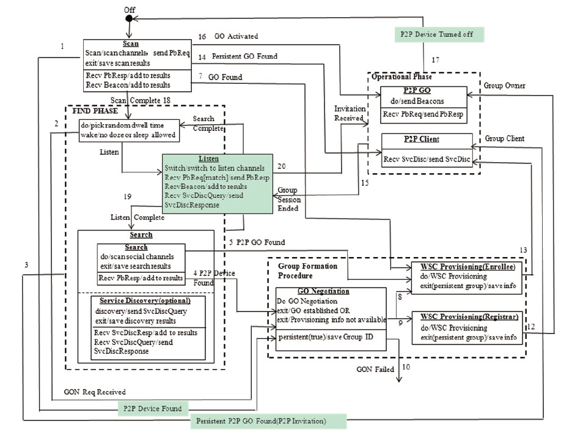
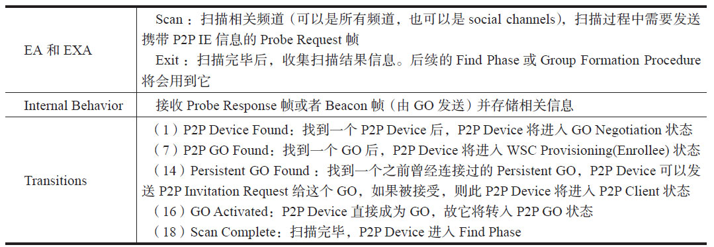
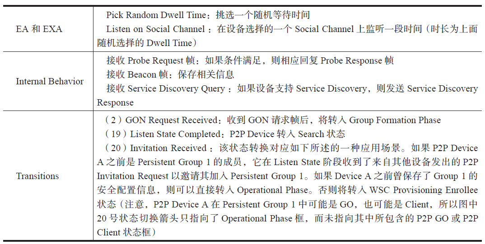
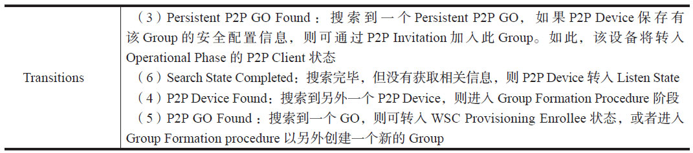
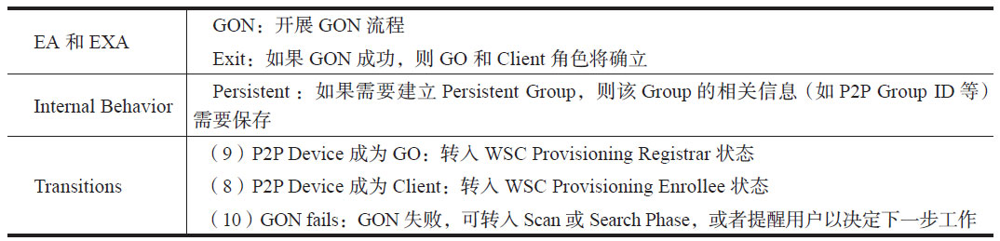

# 7.2.3 P2P工作流程

[9]P2P规范中附录A通过定义一个状态机介绍了P2P的整体工作流程，笔者觉得以此作为本章P2P理论知识的总结是最好不过了。该状态机的状态定义及切换如图7-22所示。

图7-22P2P状态机图7-22中，三个黑虚线框分别是FindPhase、GroupFormationProcedure和OperationalPhase，这三个Phase描述的是P2P工作流程中的一个阶段，每个阶段可包含一个或多个状态。例如GroupFormationProcedure阶段包含GON、WSCProvisioningRegistrar和WSCProvisioningEnroee三个状态。

每个状态对应的状态名位于状态框顶部，其字体格式为加粗并带下划线。注意，图中Search状态包含两个子状态，分别是Search子状态以及ServiceDiscovery子状态。由于P2PDevice并不都支持ServiceDiscovery功能，所以ServiceDiscovery子状态为可选（operational）状态。

每个状态都有对应的EntryAction、ExitAction和InternalBehavior。其中，EA和EXA位于状态框图的上半部分，而InternalBehavior位于状态框图的下半部分。状态之间的切换及切换条件由数字序号及箭头线表示。

下面介绍图7-22中P2P状态机的各个状态以及状态转换条件。对此，我们重点考察每个状态的EA（EntryAction）​、EXA（ExitAction）​、InternalBehavior以及Transition。

一个P2PDevice最初的状态是O，然后将进入Scan状态（括号中的数字对应图7-22中的数字）​。

接着来看FindPhase，它包括Listen和Search两个状态。其中，Listen状态如下。

FindPhase中另外一个状态是Search状态。

它包含Search子状态和ServiceDiscovery子状态。先来看Search子状态。

再来看ServiceDiscovery子状态。

Search状态（包括Search子状态和ServiceDiscovery子状态）的Transition情况如下。

接着来看GroupFormationProcedure，该阶段包含三个状态，首先是GON。

GroupFormationProcedure另外两个状态WSCProvisioningRegistrar和WSCProvisioningEnroee比较简单，请读者根据图7-22自行总结。

最后，来看看OperationalPhase，它包含P2PGO和P2PClient两个状态，首先是P2PGO状态。

再来看P2PClient状态，它没有EA和EXA。

图7-22对掌握P2P整体工作流程有重要意义，读者不妨仔细阅读。从下一节开始，将分析Android平台中P2P的代码实现。和WSC一样，首先分析的是Java层中的WifiP2pSettings以及WifiP2pService。

7.3WifiP2pSettings和WifiP2pService介绍WifiP2pSettings是Settings应用中负责处理P2P相关UI/UE逻辑的主要类，与之交互的则是位于SystemServer进程中的WifiP2pService。本节先介绍WifiP2pSettings的工作流程，然后分析WifiP2pService。
