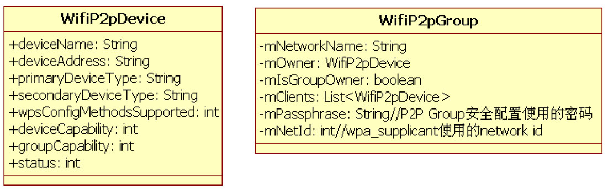

# 7.3.1 WifiP2pSettings工作流程


Android平台中，P2P操作特别简单，用户只需执行如下三个步骤。

1）进入WifiP2pSettings界面。

2）搜索周围的P2P设备。搜索到的设备将显示在WifiP2pSettings中。

3）用户选择其中的某个设备以发起连接。

下面将根据上面的使用步骤来分析WifiP2pSettings。首先来看WifiP2pSettings的onActivityCreate函数。

1.WifiP2pSettings创建WifiP2pSettings的onActivityCreated函数代码如下所示。

```java
public void onActivityCreated(Bundle savedInstanceState) {
     addPreferencesFromResource(R.xml.wifi_p2p_settings);// 加载界面元素
    /*
     和第5章介绍的WifiSettings类似，WifiP2pSettings也是通过监听广播的方式来了解系统中
     Wi-Fi P2P相关的信息及变化情况。下面这几个广播属于P2P特有的，其作用如下。
     WIFI_P2P_STATE_CHANGED_ACTION：用于通知系统中P2P功能的启用情况，如该功能是enable还是disable。
     WIFI_P2P_PEERS_CHANGED_ACTION：系统内部将保存搜索到的其他P2P设备信息，如果这些信息有变化，
     则系统将发送该广播。接收者需要通过WifiP2pManager的requestPeers函数重新获取这些P2P设备的信息。
     WIFI_P2P_CONNECTION_CHANGED_ACTION：用于通知P2P连接情况，该广播可携带WifiP2pInfo
     和NetworkInfo两个对象。相关信息可从这两个对象中获取。
     WIFI_P2P_THIS_DEVICE_CHANGED_ACTION：用于通知本机P2P设备信息发生了变化。
     WIFI_P2P_DISCOVERY_CHANGED_ACTION：用于通知P2P Device Discovery的工作状态，如启动或停止。
     WIFI_P2P_PERSISTENT_GROUPS_CHANGED_ACTION：用于通知之persistent group信息发生了变化。
    */
      mIntentFilter.addAction(WifiP2pManager.WIFI_P2P_STATE_CHANGED_ACTION);
      mIntentFilter.addAction(WifiP2pManager.WIFI_P2P_PEERS_CHANGED_ACTION);
      mIntentFilter.addAction(WifiP2pManager.WIFI_P2P_CONNECTION_CHANGED_ACTION);
      mIntentFilter.addAction(WifiP2pManager.WIFI_P2P_THIS_DEVICE_CHANGED_ACTION);
      mIntentFilter.addAction(WifiP2pManager.WIFI_P2P_DISCOVERY_CHANGED_ACTION);
      mIntentFilter.addAction(WifiP2pManager.WIFI_P2P_PERSISTENT_GROUPS_CHANGED_ACTION);
    final Activity activity = getActivity();
    // 创建WifiP2pManager对象，它将和WifiP2pService交互
    mWifiP2pManager = (WifiP2pManager) getSystemService(Context.WIFI_P2P_SERVICE);
    if (mWifiP2pManager != null) {
       // 初始化WifiManager并建立和WifiService的联系
        mChannel = mWifiP2pManager.initialize(activity, getActivity().getMainLooper(),null);
      }
      ......
      ......// 创建UI中按钮对应的onClickListener
     mRenameListener = new OnClickListener() {......};
     ......
     super.onActivityCreated(savedInstanceState);
}
```

[--＞WifiP2pSettings.java：​：

onActivityCreated]WifiP2pSettings将在onResume中注册一个广播接收对象以监听上面代码中介绍的广播事件。这部分代码很简单，请读者自行阅读。

```java
private final BroadcastReceiver mReceiver = new BroadcastReceiver() {
    public void onReceive(Context context, Intent intent) {
      String action = intent.getAction();
      if (WifiP2pManager.WIFI_P2P_STATE_CHANGED_ACTION.equals(action)) {
          // 从WIFI_P2P_STATE_CHANGED_ACTION广播中获取相关状态信息以判断P2P功能是否打开
          mWifiP2pEnabled = intent.getIntExtra(WifiP2pManager.EXTRA_WIFI_STATE,
              WifiP2pManager.WIFI_P2P_STATE_DISABLED) ==
              WifiP2pManager.WIFI_P2P_STATE_ENABLED;
          handleP2pStateChanged();
      }
    ......
}
```

```java
private void handleP2pStateChanged() {
    updateSearchMenu(false);// 该函数将触发WifiP2pSettings的onCreateOptionsMenu被调用
    if (mWifiP2pEnabled) {
        ......
        /*
        获取系统当前已经搜索到或者之前保存的P2P Device信息列表。Android为此定义了一个名为
        WifiP2pDeviceList的数据类型用来存储这些P2P Device信息。
        请读者注意requestPeers函数调用的第二个参数，该参数的类型为PeerListener，它是一个
        接口类，而WifiP2pSettings实现了它。WifiP2pDeviceList信息将通过这个接口类的
        onPeersAvailable函数返回给requestPeers的调用者。
        后文将分析onPeersAvailable函数，此处先略过。
        */
        mWifiP2pManager.requestPeers(mChannel, WifiP2pSettings.this);
    }
}
```

2.WifiP2pSettings工作流程（1）WIFI_P2P_STATE_CHANGED_ACTION处理流程打开WifiP2pSettings后，首先要等待WIFI_P2P_STATE_CHANGED_ACTION广播以判断P2P功能是否正常启动。相应的处理函数如下所示。

来看handleP2pStateChange函数，代码如[--＞WifiP2pSettings.java：​：onReceive]下所示。

[--＞WifiP2pSettings.java：​：

handleP2pStateChanged]根据上文的介绍，用户下一步要做的事情就是主动搜索周围的P2P设备。Android原生代码中的WifiP2pSettings界面下方有两个按钮，分别是"SEARCH"和"RENAME"。

❑"RENAME"用于更改本机的P2P设备名。

❑"SEARCH"用于搜索周围的P2PDevice。

当P2P功能正常启用后（即上述代码中的mWifiP2pEnabled为true时）​，这两个按钮将被使能。此后，用户就可单击"SEARCH"按钮以搜索周围的P2P设备。该按钮对应的函数是startSearch，马上来看它。

提示一些手机厂商对WifiP2pSettings界面有所更改，但大体流程没有变化。

（2）startSearch函数startSearch的代码如下所示。

[--＞WifiP2pSettings.java：​：startSearch]

```java
private void startSearch() {
        if (mWifiP2pManager != null && !mWifiP2pSearching) {
            // discoverPeers将搜索周围的P2P设备
            mWifiP2pManager.discoverPeers(mChannel, new WifiP2pManager.ActionListener() {
                                     ......});
        }
}
```

上述代码中，WifiP2pSettings通过调用WifiManager的discoverPeers来搜索周围的设备。

当WPAS完成搜索后，WIFI_P2P_PEERS_CHANGED_ACTION广播将被发送。来看WifiP2pSettings中对该广播的处理。

```java
private final BroadcastReceiver mReceiver = new BroadcastReceiver() {
    public void onReceive(Context context, Intent intent) {
       String action = intent.getAction();
       ......
       // 如果搜索到新的P2P Device，则WIFI_P2P_PEERS_CHANGED_ACTION将被发送
       } else if (WifiP2pManager.WIFI_P2P_PEERS_CHANGED_ACTION.equals(action)) {
                  mWifiP2pManager.requestPeers(mChannel, WifiP2pSettings.this);
       }......
       else if (WifiP2pManager.WIFI_P2P_DISCOVERY_CHANGED_ACTION.equals(action)) {
                  int discoveryState = intent.getIntExtra(WifiP2pManager.EXTRA_DISCOVERY_STATE,
                       WifiP2pManager.WIFI_P2P_DISCOVERY_STOPPED);
            if (discoveryState == WifiP2pManager.WIFI_P2P_DISCOVERY_STARTED)
                  updateSearchMenu(true);// 更新“SEARCH”按钮显示的名称
           else     updateSearchMenu(false);
       }......
    }
};
```

（3）

WIFI_P2P_PEERS_CHANGED_ACTION处理流程广播事件在onReceive函数中被处理，此函数的代码如下所示。

[--＞WifiP2pSettings.java：​：onReceive]注意，startSearch还将触发系统发送WIFI_P2P_DISCOVERY_CHANGED_ACTION广播，WifiP2pSettings将根据该广播携带的信息来更新"SEARCH"按钮的界面，其规则是：如果P2PDiscovery启动成功（即状态变为WIFI_P2P_DISCOVERY_STARTED）​，则"SEARCH"按钮名显示为"Searching..."，否则该按钮名显示为"SearchForDevices"。

当系统搜索到新的P2PDevice后，WIFI_P2P_PEERS_CHANGED_ACTION广播将被发送，而WifiP2pSettings对于该广播的处理就是调用WifiP2pManager的requestPeers来获取系统保存的P2PDevice信息列表。

前文代码中曾介绍过requestPeers，系统中所有的P2P设备信息将通过PeerListener接口类的onPeersAvailable函数返回给WifiP2pSettings。直接来看该函数，代码如下所示。

[--＞WifiP2pSettings.java：​：

onPeersAvailable]

```java
public void onPeersAvailable(WifiP2pDeviceList peers) {
  // 系统中所有的P2P设备信息都保存在这个类型为WifiP2pDeviceList的peers对象中
   mPeersGroup.removeAll();// mPeersGroup类型为PerferenceGroup，属于UI相关的类
   mPeers = peers;
   mConnectedDevices = 0;
   for (WifiP2pDevice peer: peers.getDeviceList()) {
      // WifiP2pPeer是Perference的子类，它和UI相关
      mPeersGroup.addPreference(new WifiP2pPeer(getActivity(), peer));
      if (peer.status == WifiP2pDevice.CONNECTED) mConnectedDevices++;
   }
}
```

在onPeersAvailable函数中，WifiP2pDeviceList中保存的每一个

```java
public boolean onPreferenceTreeClick(PreferenceScreen screen, Preference preference) {
    if (preference instanceof WifiP2pPeer) {
        mSelectedWifiPeer = (WifiP2pPeer) preference;// 获取用户指定的那一个WifiP2pPeer项
        if (mSelectedWifiPeer.device.status == WifiP2pDevice.CONNECTED)
            showDialog(DIALOG_DISCONNECT);// 如果已经和该Device连接，则判断是否需要与之断开连接
        else if (mSelectedWifiPeer.device.status == WifiP2pDevice.INVITED)
            showDialog(DIALOG_CANCEL_CONNECT);
        else {// 向对端P2P设备发起连接
                 WifiP2pConfig config = new WifiP2pConfig();
                 config.deviceAddress = mSelectedWifiPeer.device.deviceAddress;
                 // 判断系统是否强制使用了某种WSC配置方法
                 int forceWps = SystemProperties.getInt("wifidirect.wps", -1);
                 if (forceWps != -1) config.wps.setup = forceWps;
                 else {
                     // 获取对端P2P Device支持的WSC配置方法，优先考虑PBC
                     if (mSelectedWifiPeer.device.wpsPbcSupported())
                         config.wps.setup = WpsInfo.PBC;
                     else if (mSelectedWifiPeer.device.wpsKeypadSupported()) {
                         config.wps.setup = WpsInfo.KEYPAD;
                     else  config.wps.setup = WpsInfo.DISPLAY;
                 }
                 // 通过WifiP2pManager的connect函数向对端P2P Device发起连接。注意，目标设备
                 // 信息保存在config对象中
                 mWifiP2pManager.connect(mChannel, config,
                          new WifiP2pManager.ActionListener(){......});
        }
    }......
}
```

WifiP2pDevice信息将作为一个Preference项添加到mPeersGroup中并显示在UI界面上。

接下来，用户就可在界面中选择某个P2PDevice并与之连接。这个步骤由onPreferenceTreeClick函数来完成。

提示上述代码中提到的WifiP2pDevice等数据结构将放到下文再介绍。

（4）onPreferenceTreeClick函数onPreferenceTreeClick的代码如下所示。

[--＞WifiP2pSettings.java：​：

onPreferenceTreeClick]

```java
public void onReceive(Context context, Intent intent) {
    String action = intent.getAction();
    ......
    } else if (WifiP2pManager.WIFI_P2P_CONNECTION_CHANGED_ACTION.equals(action)) {
             NetworkInfo networkInfo = (NetworkInfo) intent.getParcelableExtra(
                                  WifiP2pManager.EXTRA_NETWORK_INFO);
            if (mWifiP2pManager != null){
              // requestGroupInfo第二个参数的类型是GroupInfoListener，用于返回Group信息
              mWifiP2pManager.requestGroupInfo(mChannel, WifiP2pSettings.this);
            }
            if (networkInfo.isConnected()){
                if (DBG) Log.d(TAG, "Connected");
            } else startSearch();      // 如果没有加入某个P2P Group，则重新发起设备扫描
    }......
}
```

（5）

WIFI_P2P_CONNECTION_CHANGED_ACTION处理流程当系统完成和指定P2PDevice的连接后，WifiP2pSettings将收到WIFI_P2P_CONNECTION_CHANGED_ACTION广播，其对应的代码逻辑如下所示。

[--＞WifiP2pSettings.java：​：onReceive]当设备加入一个Group后，requestGroupInfo将通过其第二个参数设置的回调函数以返回此Group的信息，这个回调函数由GroupInfoListener接口类定义，WifiP2pSettings只需实现该接口类的onGroupInfoAvailable，相关代码如下所示。

[--＞WifiP2pSettings.java：​：

onGroupInfoAvailable]

```java
public void onGroupInfoAvailable(WifiP2pGroup group) {
    mConnectedGroup = group;            // 保存当前所加入的Group的信息
    updateDevicePref();                 // 更新WifiP2pPeer的界面
}
```

以上是WifiP2pSettings的大体工作流程，读者只要把握几个重要广播的处理流程即可掌握Settings应用中和Wi-FiP2P相关的知识。

3.WifiP2pSettings总结上述代码中有两个比较重要的数据结构，WifiP2pDevice和WifiP2pGroup，成员比较简单，此处不赘述。它们的类图如图7-23所示。



图7-23WifiP2pDevice和WifiP2pGroup类图通过上面几节的代码可知，WifiP2pSettings将借助WifiP2pManager和系统中的WifiP2pService交互。WifiP2pSettings主要使用WifiP2pManager的几个重要函数。

❑initialize：初始化WifiP2pManager，其内部将和WifiP2pService通过AsyncChannel建立交互关系。

❑discoverPeers：触发WifiP2pService发起P2PDevice扫描工作。

❑requestPeers：获取系统中保存的P2PDevice信息。

❑connect：和指定P2PDevice发起连接，也就是相互协商以创建或加入一个P2P网络，即一个Group。

❑requestGroupInfo：获取当前连接上的Group信息。

下面来看WifiP2pService，它是Android系统中P2P功能的Java层核心模块。
