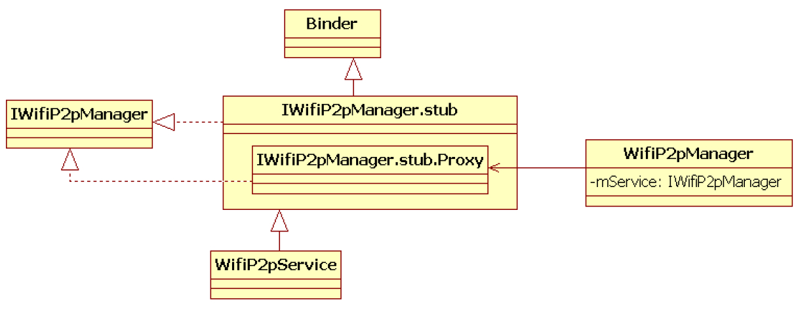
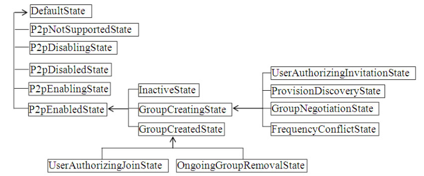

# 7.3.2 WifiP2pService工作流程


WifiP2pService和第5章介绍的WifiService一样，都属于Android系统中负责处理Wi-Fi相关工作的核心模块。其中，WifiService处理和WLAN网络连接相关的工作，而WifiP2pService则专门负责处理和Wi-FiP2P相关的工作。图7-24所示为WifiP2pService家族类图。



图7-24WifiP2pService类图图7-24所示的WifiP2pService家族类图和图5-1所示的WifiService家族类图类似，此处就不详细讨论了。直接来看WifiP2pService的

```java
public WifiP2pService(Context context) {
   mContext = context;
   mInterface = "p2p0";// P2P使用的虚拟网络接口设备名为“p2p0”
   mActivityMgr = (ActivityManager)context.getSystemService(Activity.ACTIVITY_SERVICE);
   mNetworkInfo = new NetworkInfo(ConnectivityManager.TYPE_WIFI_P2P, 0, NETWORKTYPE, "");
   // 判断系统是否支持WiFi-Direct功能
   mP2pSupported = mContext.getPackageManager().hasSystemFeature(
                                PackageManager.FEATURE_WIFI_DIRECT);
   // 获取PrimaryDeviceType，默认值是“10-0050F204-5”。结合图6-15可知
   // “10”是Category ID，代表Telephone
   // “0050F204”是WFA的OUI，最后一个“5”是Sub Category ID，在Telephone大类里边，它代表
   // 支持Dual Mode的Smartphone（规范中定义为Smart phone-Dual mode）
   mThisDevice.primaryDeviceType = mContext.getResources().getString(
                com.android.internal.R.string.config_wifi_p2p_device_type);
   // WifiP2pService主要工作也是由状态机来完成的，即下面的这个P2pStateMachine
   mP2pStateMachine = new P2pStateMachine(TAG, mP2pSupported);
   mP2pStateMachine.start();// 启动P2P状态机
}
```

代码，首先是它的构造函数，如下所示。

[--＞WifiP2pService.java：​：

WifiP2pService]P2pStateMachine是WifiP2pService定义的内部类，它比第5章介绍的WifiStateMachine简单，其构造函数如下所示。

[--＞WifiP2pService.java：​：

P2pStateMachine构造函数]

```java
P2pStateMachine(String name, boolean p2pSupported) {
    super(name);
    addState(mDefaultState);// 为状态机添加状态，一共15个状态
      addState(mP2pNotSupportedState, mDefaultState);
      ......
    if (p2pSupported) setInitialState(mP2pDisabledState);// 初始状态为P2pDisabledState
     else setInitialState(mP2pNotSupportedState);
}
```

图7-25描述了P2pStateMachine中定义的各个状态及层级关系。



图7-25P2pStateMachine状态机P2pStateMachine的初始状态是P2pDisabledState，它和父状态DefaultState的EntryAction都没有执行什么有意义的事情，故此处略去对二者EA的介绍。

P2pStateMachine是WifiP2pService的核心，我们马上来介绍它的工作流程。

1.CMD_ENABLE_P2P处理流程P2pStateMachine虽然属于WifiP2pService，但它也受WifiStateMachine的影响。通过5.2.3节“WifiStateMachine构造函数分析之二”中对WifiStateMachineInitialStateEA的介绍，会发现WifiStateMachine将创建一个名为mWifiP2pChannel的AsyncChannel对象用于向P2pStateMachine发送消息。

```java
class P2pDisabledState extends State {
    public boolean processMessage(Message message) {
      switch (message.what) {
        case WifiStateMachine.CMD_ENABLE_P2P:
              try {
                    mNwService.setInterfaceUp(mInterface);
              }......
              // 启动WifiMonitor，它将通过wpa_ctl连接上wpa_supplicant。关于wpa_supplicant的启动
              // 读者可参考5.2.3节“WifiNative介绍”
              mWifiMonitor.startMonitoring();
              // 转入P2pEnablingState，其EA未作有意义的事情，读者可自行阅读它
              transitionTo(mP2pEnablingState);
              break;
        default:
            return NOT_HANDLED;
    }
    return HANDLED;
    }
}
```

在Android平台中，如果用户打开Wi-Fi功能，P2pStateMachine就会收到第一个消息CMD_ENABLE_P2P。该消息是WifiStateMachine进入DriverStartedState后，在其EA中借助mWifiP2pChannel向P2pStateMachine发送的（可参考5.3.2节SUP_CONNECTION_EVENT处理流程分析）

。

P2pStateMachine此时处于P2pDisabledState，它对CMD_ENABLE_P2P消息的处理逻辑如下所示。

[--＞WifiP2pService.java：​：

P2pDisabledState：enter]

```java
class P2pEnablingState extends State {
       ......
    public boolean processMessage(Message message) {
    switch (message.what) {
        case WifiMonitor.SUP_CONNECTION_EVENT:
              transitionTo(mInactiveState);// 转入InactiveState
              break;
        ......
    }
      return NOT_HANDLED
    }
}
```

处理完CMD_ENABLE_P2P消息后，P2pStateMachine将创建一个WifiMonitor用于接收来自wpa_supplicant的消息，同时状态机将转入P2pEnablingState。

WifiMonitor连接wpa_supplicant之后，WifiMonitor会发送一个SUP_CONNECTION_EVENT给P2pStateMachine。该消息将由P2pEnablingState处理，马上来看相关的处理流程。

2.SUP_CONNECTION_EVENT处理流程根据5.2.1节HSM的知识，当状态机转入InactiveState后，首先执行的是其父状态代码如下。

P2pEnabledState的EA，然后才是[--＞WifiP2pService.java：​：

InactiveState自己的EA。由于InactiveStateP2pEnablingState：processMessage]的EA仅打印了一句日志输出，故此处仅介绍P2pEnabledState的EA，相关代码如下所

```java
class P2pEnabledState extends State {
    public void enter() {
    // 发送WIFI_P2P_STATE_CHANGED_ACTION广播，并设置EXTRA_WIFI_STATE状态为
    // WIFI_P2P_STATE_ENABLED
    sendP2pStateChangedBroadcast(true);
    mNetworkInfo.setIsAvailable(true);
    /*
    发送WIFI_P2P_CONNECTION_CHANGED_ACTION广播，它将携带WifiP2pInfo和NetworkInfo信息。
    注意，下面这个函数还会向WifiStateMachine发送P2P_CONNECTION_CHANGED消息。读者不妨
    自行研究WifiStateMachine对P2P_CONNECTION_CHANGED消息的处理流程。
    */
    sendP2pConnectionChangedBroadcast();
    initializeP2pSettings();// 初始化P2P的一些设置，详情见下文
}
```

```java
private void initializeP2pSettings() {
    /*
    发送“SET persistent_reconnect 1”给WPAS，该命令对应如下一种应用场景。
    当发现一个Persistent Group时，如果 persistent_reconnect为1，则可利用之前保存的配置信息自动重连，
    重新连接时无需用户参与。如果persistent_reconnect为0，则需要提醒用户，让用户来决定是否加入此
    persistent group。
    */
     mWifiNative.setPersistentReconnect(true);
     /*
     获取P2P Device Name，先从数据库中查询“wifi_p2p_device_name”字段的值，如果数据库中没有设置
     该字段，则取数据库中“android_id”字段值的前4个字符并在其前面加上“Android_”字符串以
     组成P2P Device Name。以Galaxy Note 2为例，数据库文件是/data/data/com.android.providers.
     settings/database/settings.db，所查询的表名为secure，wifi_p2p_device_name字段取值为
     “Android_4aa9”，android_id字段取值为“4aa9213016889423”。
     */
    mThisDevice.deviceName = getPersistedDeviceName();// mThisDevice指向一个WifiP2pDevice对象
    // 将P2P DeviceName保存到WPAS中
    mWifiNative.setDeviceName(mThisDevice.deviceName);
    // 设置P2P网络SSID的后缀。如果本设备能扮演GO，则它构建的Group对应的SSID后缀就是此处设置的后缀名
    mWifiNative.setP2pSsidPostfix("-" + mThisDevice.deviceName);
    // 设置Primary DeviceType
    mWifiNative.setDeviceType(mThisDevice.primaryDeviceType);
    // 设置支持的WSC配置方法
    mWifiNative.setConfigMethods("virtual_push_button physical_display keypad");
    // 设置STA连接的优先级高于P2P连接
    mWifiNative.setConcurrencyPriority("sta");
    // 从WPAS中获取P2P Device Address
    mThisDevice.deviceAddress = mWifiNative.p2pGetDeviceAddress();
    // 更新自己的状态，并发送WIFI_P2P_THIS_DEVICE_CHANGED_ACTION消息
    updateThisDevice(WifiP2pDevice.AVAILABLE);
    mClientInfoList.clear();
    // 清空WPAS中保存peer P2P Device和Service信息
    mWifiNative.p2pFlush(); mWifiNative.p2pServiceFlush();
     mServiceTransactionId = 0; mServiceDiscReqId = null;
     /*
     WPAS中会保存persistent Group信息，而P2pStateMachine也会保存一些信息，下面这个函数将根据
     WPAS中的信息来更新P2pStateMachine中保存的Group信息。P2pStateMachine通过一个名为mGroups
     的成员变量（类型为WifiP2pGroupList）来保存所有的Group信息。
     */
    updatePersistentNetworks(RELOAD);
}
```

示。

[--＞WifiP2pService.java：​：

P2pEnabledState：enter]我们重点关注上面代码中的initializeP2pSettings函数，其代码如下所示。

[--＞WifiP2pSettings.java：​：

initializeP2pSettings]至此，P2pStateMachine就算初始化完毕，接下来的工作就是处理用户发起的操作。

首先来看WifiP2pSettings中WifiP2pManager的discoverPeers函数，它将发送DISCOVER_PEERS消息给P2pStateMachine。

3.DISCOVER_PEERS处理流程P2pStateMachine当前处于InactiveState，

```java
class P2pEnabledState extends State{
    public boolean processMessage(Message message) {
      switch (message.what) {
        case WifiP2pManager.DISCOVER_PEERS:
            clearSupplicantServiceRequest();// 先取消Service Discovery请求
            // 发送“P2P_FIND 超时时间”给WPAS，DISCOVER_TIMEOUT_S值为120秒
            if (mWifiNative.p2pFind(DISCOVER_TIMEOUT_S)) {
                replyToMessage(message, WifiP2pManager.DISCOVER_PEERS_SUCCEEDED);
                // 发送WIFI_P2P_DISCOVERY_CHANGED_ACTION广播以通知P2P Device Discovery已启动
                sendP2pDiscoveryChangedBroadcast(true);
        }.......
        break;
      }
    }
}
```

不过DISCOVER_PEERS消息却是由其父状态P2pEnabledState来处理的，相关代码如下所示。

[--＞WifiP2pService.java：​：

P2pEnabledState：processMessage]当WPAS搜索到周围的P2PDevice后，将发送以下格式的消息给WifiMonitor。

```java
P2P-DEVICE-FOUND fa：7b：7a：42：02：13 p2p_dev_addr=fa：7b：7a：42：02：13 pri_dev_type=1-0050F204-1 name='p2p-TEST1'config_methods=0x188 dev_capab=0x27 group_capab=0x0
```

WifiMonitor将根据这些信息构建一个WifiP2pDevice对象，然后发送P2P_DEVICE_FOUND_EVENT给P2pStateMachine。

```java
class P2pEnabledState extends State{
    public boolean processMessage(Message message) {
      switch (message.what) {
        ......
        case WifiMonitor.P2P_DEVICE_FOUND_EVENT:
              // WifiMonitor根据WPAS反馈的信息构建一个WifiP2pDevice对象
              WifiP2pDevice device = (WifiP2pDevice) message.obj;
              // 如果搜索到的这个P2P Device是自己（根据Device Address来判断），则不处理它
              if (mThisDevice.deviceAddress.equals(device.deviceAddress)) break;
              /*
              mPeers指向一个WifiP2pDeviceList对象。如果之前已存储了此Device的信息，
              更新这些信息，否则将添加一个新的WifiP2pDevice对象。
              */
               mPeers.update(device);
               sendP2pPeersChangedBroadcast();// 发送WIFI_P2P_PEERS_CHANGED_ACTION广播
               break;
        }......
    }
}
```

4.P2P_DEVICE_FOUND_EVENT处理流程同样，P2P_DEVICE_FOUND_EVENT也由InactiveState的父状态P2pEnabledState来处理，相关代码如下所示。

[--＞WifiP2pService.java：​：

P2pEnabledState：processMessage]WifiP2pSettings收到WIFI_P2P_PEERS_CHANGED_ACTION广播后，将通过WifiP2pManager的requestPeers来获得当前搜索到的P2PDevice信息（即mPeers的内容）​。这部分处

```java
class InactiveState extends State {
     ......
    public boolean processMessage(Message message) {
        switch (message.what) {
          case WifiP2pManager.CONNECT:
                /*
                WifiP2pSettings将设置一个WifiP2pConfig对象以告诉P2pStateMachine该连接
                哪一个P2P Device（参考7.3.1节onPreferenceTreeClick介绍）
                */
                WifiP2pConfig config = (WifiP2pConfig) message.obj;
                mAutonomousGroup = false;
                // 获取该P2P Device的Group Capability信息
                int gc = mWifiNative.getGroupCapability(config.deviceAddress);
                mPeers.updateGroupCapability(config.deviceAddress, gc);
                // 关键函数connect，见下文介绍
                int connectRet = connect(config, TRY_REINVOCATION);
                // TRY_REINVOCATION值为true
                ......
              mPeers.updateStatus(mSavedPeerConfig.deviceAddress, WifiP2pDevice.INVITED);
              sendP2pPeersChangedBroadcast();
              replyToMessage(message, WifiP2pManager.CONNECT_SUCCEEDED);
              // 根据connectRet的值进行状态切换选择
              if (connectRet == NEEDS_PROVISION_REQ) {
                  transitionTo(mProvisionDiscoveryState);// 转入ProvisionDiscoveryState
                  break;
              }
              transitionTo(mGroupNegotiationState);// 或者转入GroupNegotiationState
              break;
       ......
      }
    return HANDLED
}
```

理逻辑非常简单，请读者自行阅读相关代码。

现在，用户将选择一个P2PDevice然后通过WifiP2pManager的connect函数向其发起连接。来看相关代码。

5.CONNECT处理流程WifiP2pManager的connect函数将发送CONNECT消息给P2pStateMachine，该消息由InactiveState状态自己来处理，代码如下所示。

[--＞WifiP2pSettings.java：​：

InactiveState：processMessage]上述代码中有一个关键函数，即connect，其代码如下所示。

```java
private int connect(WifiP2pConfig config, boolean tryInvocation) {
    ......
    // 当前还没有保存的对端P2P Device配置信息（对应的数据类型为WifiP2pConfig）
    // 所以isResp为false
    boolean isResp = (mSavedPeerConfig != null &&
              config.deviceAddress.equals(mSavedPeerConfig.deviceAddress));
    mSavedPeerConfig = config;// 保存传入的WifiP2pConfig信息
    WifiP2pDevice dev = mPeers.get(config.deviceAddress);
    ......
    // 判断对端设备是否为GO。由于还没有开展GON，所以join为false
    boolean join = dev.isGroupOwner();
    String ssid = mWifiNative.p2pGetSsid(dev.deviceAddress);
      // 如果join为true，但对端设备不能再添加新的P2P Device，则join被设置为false
      if (join && dev.isGroupLimit()) join = false;
      else if (join) {// mGroups保存搜索到的GO信息，当前还没有GO，所以netId为-1
            int netId = mGroups.getNetworkId(dev.deviceAddress, ssid);
            if (netId ＞= 0) {// 这种情况对应于加入一个当前已经存在的P2P Group
                if (!mWifiNative.p2pGroupAdd(netId)) return CONNECT_FAILURE;
                return CONNECT_SUCCESS;
            }
      }
    if (!join && dev.isDeviceLimit()) return CONNECT_FAILURE;
    // tryInvocation为true。P2P Device一般都支持Invitation
    // 下面这个if代码段处理Persistent Group的情况
    if (!join && tryInvocation && dev.isInvitationCapable()) {
        int netId = WifiP2pGroup.PERSISTENT_NET_ID;// PERSISTENT_NET_ID值为-2
        if (config.netId ＞= 0) {
             if (config.deviceAddress.equals(mGroups.getOwnerAddr(config.netId)))
                  netId = config.netId;
        } else netId = mGroups.getNetworkId(dev.deviceAddress);
        if (netId ＜ 0) netId = getNetworkIdFromClientList(dev.deviceAddress);
        if (netId ＞= 0) {// 通过Invitation Request重新启动一个Persistent Group
            if (mWifiNative.p2pReinvoke(netId, dev.deviceAddress)) {
                mSavedPeerConfig.netId = netId;
                return CONNECT_SUCCESS;
            } else updatePersistentNetworks(RELOAD);
        }
      }
      mWifiNative.p2pStopFind();
        if (!isResp) return NEEDS_PROVISION_REQ;// 就本例而言，connect返回NEEDS_PROVISION_REQ
        p2pConnectWithPinDisplay(config);// 发起P2P连接，即启动Group Formation流程
        return CONNECT_SUCCESS;
}
```

[--＞WifiP2pService.java：​：connect]就本例而言，connect将返回NEEDS_PROVISON_REQ，所以P2pStateMachine将转入ProvisionDiscoveryState，马上来看它的EA。

[--＞WifiP2pService.java：​：

ProvisionDiscoveryState：enter]

```java
class ProvisionDiscoveryState extends State {
    public void enter() {
      // 触发本机设备向对端设备发送Provision Discovery Request帧
      mWifiNative.p2pProvisionDiscovery(mSavedPeerConfig);
}
```

注意，由于WSC配置方法为PBC，所以对端

```java
public boolean processMessage(Message message) {
    WifiP2pProvDiscEvent provDisc;
    WifiP2pDevice device;
    switch (message.what) {
         case WifiMonitor.P2P_PROV_DISC_PBC_RSP_EVENT:
            provDisc = (WifiP2pProvDiscEvent) message.obj;
            device = provDisc.device;
            if (!device.deviceAddress.equals(mSavedPeerConfig.deviceAddress)) break;
            if (mSavedPeerConfig.wps.setup == WpsInfo.PBC) {
                  /*
                  下面这个函数将调用WifiNative的p2pConnect函数，此函数将触发WPAS发送
                  GON Request帧。接收端设备收到该帧后，将弹出图7-16所示的提示框以提醒用户。
                  */
                  p2pConnectWithPinDisplay(mSavedPeerConfig);
                  // 转入GroupNegotiationState，其EA比较简单，请读者自行阅读
                  transitionTo(mGroupNegotiationState);
             }
            break;
     ......
    }
}
```

设备的P2pStateMachine将收到一个P2P_PROV_DISC_PBC_REQ_EVENT消息。

当对端设备处理完毕后，将收到一个P2P_PROV_DISC_PBC_RSP_EVENT消息。马上来看P2P_PROV_DISC_PBC_RSP_EVENT消息的处理流程。

6.P2P_PROV_DISC_PBC_RSP_EVENT处理流程P2pStateMachine当前处于ProvisionDiscoveryState，相关处理逻辑如下所示。

[--＞WifiP2pService.java：​：

ProvisionDiscoveryState：

processMessage]上述代码中，P2pStateMachine通过p2pConnectWithPinDisplay向对端发起GroupNegotiationRequest请求。接下来的工作就由WPAS来处理。当GroupFormation结束后，P2pStateMachine将收到一个P2P_GROUP_STARTED_EVENT消息以通知Group建立完毕，该消息的处理流程如下节所述。

7.P2P_GROUP_STARTED_EVENT处理流程P2P_GROUP_STARTED_EVENT消息由GroupNegotiationState处理，相关代码如下所示。

```java
class GroupNegotiationState extends State {
     ......
    public boolean processMessage(Message message) {
        switch (message.what) {
          case WifiMonitor.P2P_GO_NEGOTIATION_SUCCESS_EVENT:
          case WifiMonitor.P2P_GROUP_FORMATION_SUCCESS_EVENT:
                break;// 不处理Group Negotiation成功的消息
          case WifiMonitor.P2P_GROUP_STARTED_EVENT:// 只处理Group Started消息
               mGroup = (WifiP2pGroup) message.obj;
              if (mGroup.getNetworkId() == WifiP2pGroup.PERSISTENT_NET_ID) {
                  updatePersistentNetworks(NO_RELOAD);
                  String devAddr = mGroup.getOwner().deviceAddress;
                  mGroup.setNetworkId(mGroups.getNetworkId(devAddr,
                              mGroup.getNetworkName()));
              }
            if (mGroup.isGroupOwner()) {// 如果本机P2P设备是GO，则启动DhcpServer
                // 假设本机P2P设备扮演GO，请读者自行阅读startDhcpServer函数
                startDhcpServer(mGroup.getInterface());
            } else {
                /*
                如果对端设备是GO，则启动DhcpStateMachine用于获取一个IP地址，这部分流程和
                5.3.2节NETWORK_CONNECTION_EVENT消息处理流程分析的
                ObtainingIpState工作流程类似。
                */
                mWifiNative.setP2pGroupIdle(mGroup.getInterface(), GROUP_IDLE_TIME_S);
                mDhcpStateMachine = DhcpStateMachine.makeDhcpStateMachine(mContext,
                             P2pStateMachine.this, mGroup.getInterface());
                mDhcpStateMachine.sendMessage(DhcpStateMachine.CMD_START_DHCP);
                WifiP2pDevice groupOwner = mGroup.getOwner();
                groupOwner.update(mPeers.get(groupOwner.deviceAddress));
                mPeers.updateStatus(groupOwner.deviceAddress,WifiP2pDevice.CONNECTED);
                sendP2pPeersChangedBroadcast();
            }
            mSavedPeerConfig = null;
            transitionTo(mGroupCreatedState);// 转入GroupCreatedState
            break;
      ......
    }
}
```

[--＞WifiP2pService.java：​：

GroupNegotiationState：

processMessage]P2pStateMachine将转入

```java
class GroupCreatedState extends State {
    public void enter() {
     mNetworkInfo.setDetailedState(NetworkInfo.DetailedState.CONNECTED, null, null);
     updateThisDevice(WifiP2pDevice.CONNECTED);// 连接成功
     if (mGroup.isGroupOwner()) {
         /*
         SERVER_ADDRESS为“192.168.49.1”，该地址也被设置到Dhcp Server中。
         另外，P2pStateMachine有一个名为mWifiP2pInfo的成员变量，其类型为WifiP2pInfo，
         下面这个函数也将GO的IP地址保存到mWifiP2pInfo中。
         */
         setWifiP2pInfoOnGroupFormation(SERVER_ADDRESS);
         sendP2pConnectionChangedBroadcast();// 发送WIFI_P2P_CONNECTION_CHANGED_ACTION广播
     }
  }
 ......
}
```

```java
public boolean processMessage(Message message) {
   switch (message.what) {
       case WifiMonitor.AP_STA_CONNECTED_EVENT:// 该消息表示一个P2P Client关联上本机GO
               WifiP2pDevice device = (WifiP2pDevice) message.obj;
               String deviceAddress = device.deviceAddress;
               if (deviceAddress != null) {
                   ......
                   mGroup.addClient(deviceAddress);// 添加一个P2P Client
                   mPeers.updateStatus(deviceAddress, WifiP2pDevice.CONNECTED);
                   sendP2pPeersChangedBroadcast();
               }
               ......
               break;
       ......
}
```

GroupCreatedState，其EA代码如下所示。

[--＞WifiP2pService.java：​：

GroupCreatedState：enter]8.AP_STA_CONNECTED_EVENT处理流程当对端P2P设备成功关联到本机后，WifiMonitor又将发送一个名为AP_STA_CONNECTED_EVENT的消息，该消息的处理逻辑如下所示。

[--＞WifiP2pService.java：​：

GroupCreatedState：enter]至此，一个P2PDevice（扮演Client）就成功关联上本机的P2PDevice（扮演GO）​。

9.WifiP2pService总结回顾上文介绍的WifiP2pService工作流程，可知P2pStateMachine初始状态为P2pDisabledState，然后：

1）P2pStateMachine将接收到的第一条消息，它是来自WifiStateMachine的CMD_ENABLE_P2P。在该消息的处理逻辑中，P2pStateMachine将创建一个WifiMonitor对象以和wpa_supplicant进程交互。最后，P2pStateMachine转入P2pEnablingState。

2）在P2pEnablingState中，P2pStateMachine将处理SUP_CONNECT_EVENT消息，它代表WifiMonitor成功连接上了wpa_supplicant。该消息处理完毕后，P2pStateMachine将转入InactiveState。

3）InactiveState的父状态是P2pEnabledState，P2pEnabledState的EA将初始化P2P设置，这部分代码逻辑在initializeP2pSettings函数中。另外，WifiP2pSettings将收到一些P2P广播，此时P2P功能正常启动。

4）用户在界面中进行操作以搜索周围的设备，这使得P2pStateMachine将收到DISCVOER_PEERS消息。它在P2pEnabledState中被处理，wpas_supplicant将发起P2PDeviceDiscovery流程以搜索周围的P2P设备。

5）一旦有P2P设备被搜索到，P2pStateMachine将接收到一条P2P_DEVICE_FOUND_EVENT消息。该消息依然由P2pEnabledState来处理。同时，WifiP2pSettings也会相应收到信息以更新UI。

6）当用户在WifiP2pSettings界面中选择连接某个P2PDevice后，WifiP2pSettings将发送CONNECT消息给P2pStateMachine。该消息由InactiveState来处理。大部分情况下（除了PersistentGroup或者对端设备是GO的情况下）​，P2pStateMachine将转入ProvisionDiscoveryState。

7）ProvisionDiscoveryState中，P2pStateMachine将通知WPAS以开展ProvisioningDiscovery流程。一切顺利的话，P2pStateMachine将接收到P2P_PROV_DISC_PBC_RSP_EVENT消息。在该消息的处理过程中，P2pStateMachine将通过p2pConnectWithPinDisplay函数通知WPAS和对端设备启动GroupFormation流程。此后，P2pStateMachine转入GroupNegotiationState。

8）GroupFormation完成，一个Group也就创建成功，P2pStateMachine将收到P2P_GROUP_STARTED_EVENT消息。该消息由GroupNegotiationState处理。如果本机扮演GO的话，它将启动一个Dhcp服务器，也就是第2章提到的dnsmasq（详情请参考2.3.8节“背景知识介绍”​）​。

9）当对端P2PClient（Group建立后，角色也就确定了）关联上本机的GO后，AP_STA_CONNECTED_EVENT消息将被发送给P2pStateMachine处理。

如果仔细阅读WifiP2pService代码，会发现本节介绍的工作流程是WifiP2pService中最简单的一条了。经过笔者实际测试，WifiP2pService有一个工作场景的处理流程比较复杂，即如果用户在对端设备发起connect操作，则本机的处理相对要复杂一些。这部分流程和wpa_suppliant的处理也有关系，所以请读者在学完本章的基础上再自行研究它。

现在，让我们抖擞精神来分析P2P真正的主角wpa_supplicant。
