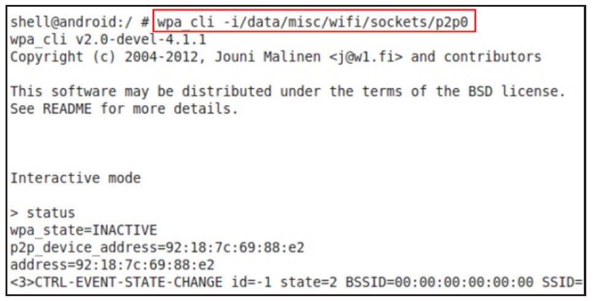
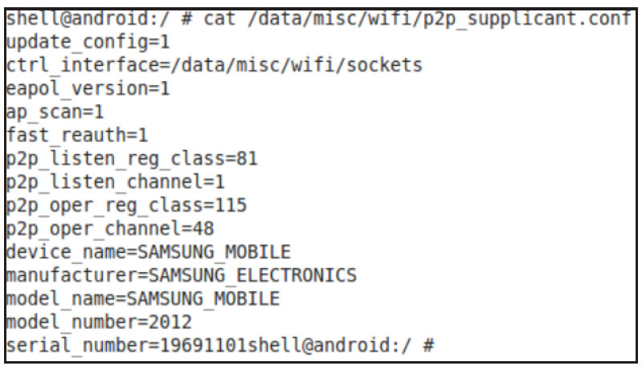

# 7.4 wpa_supplicant中的P2P

在5.2.3节曾介绍，wpa_supplicant进程由WifiStateMachine启动。在Android官方代码中，虽然Java层有WifiService和WifiP2pService两个几乎完全不同的Wi-Fi服务，但二者都只和Native层的唯一一个wpa_supplicant进程交互。简单点说，Android原生代码中，一个wpa_supplicant进程将同时支持WifiService和WifiP2pService。

上述这种设计方法使得wpa_supplicant负担较重，所以，一些手机厂商会为WifiService和WifiP2pService各创建一个wpa_supplicant进程，使得它们能各司其职而互不干扰。以笔者的GalaxyNote2为例，WifiService将和wpa_supplicant进程交互，而WifiP2pService将和一个名为p2p_supplicant（经过笔者测试，p2p_supplicant实际上就是wpa_supplicant，只不过名字不同而已）的进程交互。

图7-26所示为GalaxyNote2init配置文件中关于p2p_supplicant服务的示意图。

图7-26GalaxyNote2中p2p_supplicant服务配置项由图7-26可知，init配置文件定义了一个名为p2p_supplicant的服务，该服务启动的进程为p2p_supplicant。

p2p_supplicant使用的配置文件名为/data/misc/wifi/p2p_supplicant.conf，

其内容如图7-27所示。

提示关于init配置文件中wpa_supplicant服务的说明，请参考4.3节wpa_supplicant图7-28wpa_cli和p2p_supplicant交互初始化流程分析。

下面来分析wpa_supplicant中和P2P相关的图7-27中，p2p_supplicant对应的ctrl_iface代码。

路径为/data/misc/wifi/sockets。所以，如果要使用wpa_cli和p2p_supplicant交互，必注意以GalaxyNote2为例，须指定正确的ctrl_iface路径。图7-28所示为p2p_supplicant就是wpa_supplicant，只笔者用wpa_cli测试p2p_supplicant时的截是编译时打开了P2P相关的选项。下面的分图。

析将以wpa_supplicant中和P2P相关的代

码及工作流程为主。
