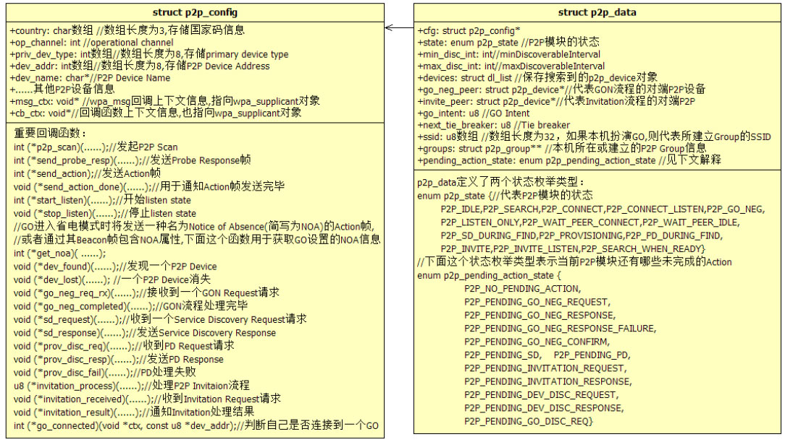
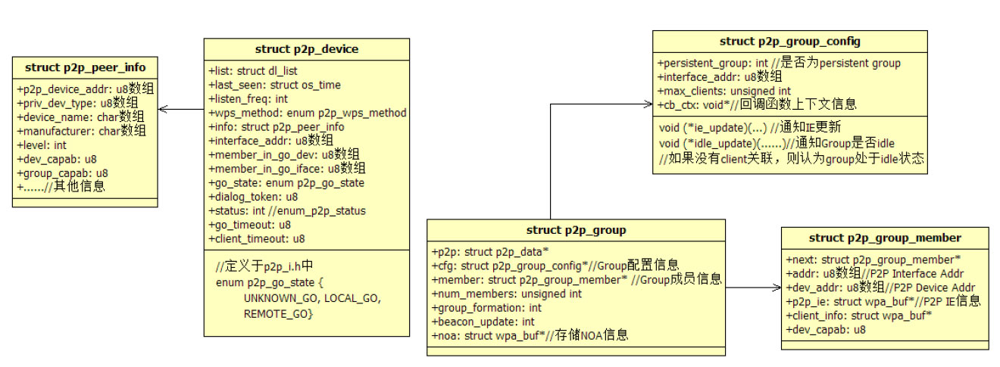
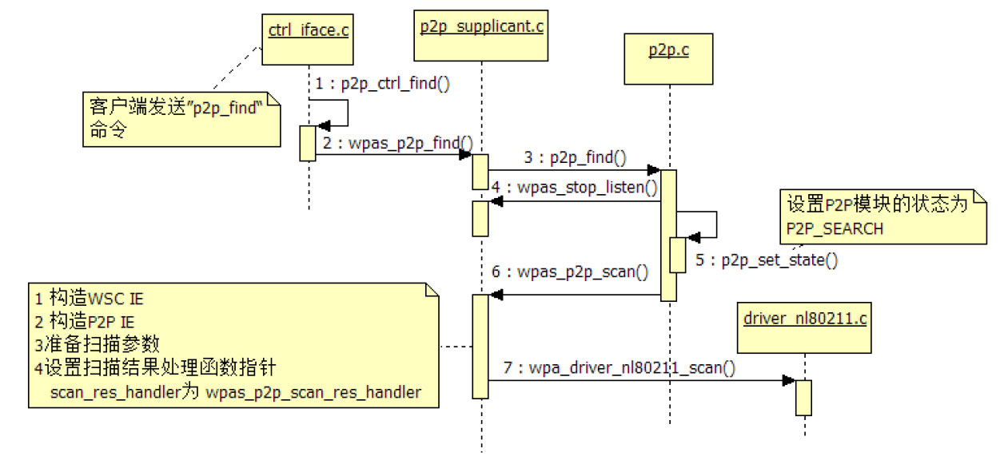
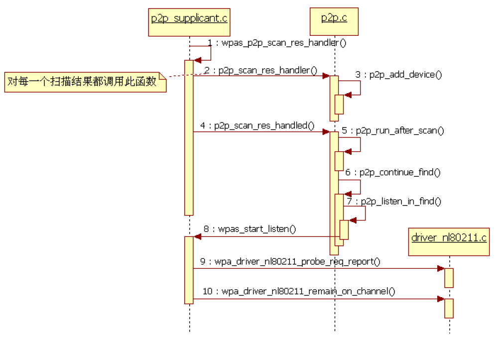

# 7.4.1 P2P模块初始化


首先来看WPAS中P2P相关模块的初始化。该图7-27p2p_supplicant.conf内容初始化工作在4.3.4节

```
int wpas_p2p_init(struct wpa_global *global, struct wpa_supplicant *wpa_s)
{
    struct p2p_config p2p; // p2p变量指向一个p2p_config对象，代表P2P模块的配置信息
    unsigned int r;  int i;
    // ①WPA_DRIVER_FLAGS_P2P_CAPABLE代表Wifi驱动对P2P支持的能力，详情见下文解释
    if (!(wpa_s-＞drv_flags & WPA_DRIVER_FLAGS_P2P_CAPABLE))  return 0;
    if (global-＞p2p)  return 0;
    // 如果wifi driver能完成P2P功能，就不用劳驾WPAS了
    if (wpa_s-＞drv_flags & WPA_DRIVER_FLAGS_P2P_MGMT) {......}
    // ②初始化并设置p2p_config对象
    os_memset(&p2p, 0, sizeof(p2p));
    p2p.msg_ctx = wpa_s;  p2p.cb_ctx = wpa_s;
    p2p.p2p_scan = wpas_p2p_scan; // P2P对应的扫描函数
    .......// 设置一些回调函数
    p2p.get_noa = wpas_get_noa; p2p.go_connected = wpas_go_connected;
    // 设置P2P Device address。
    os_memcpy(wpa_s-＞global-＞p2p_dev_addr, wpa_s-＞own_addr, ETH_ALEN);
    os_memcpy(p2p.dev_addr, wpa_s-＞global-＞p2p_dev_addr, ETH_ALEN);
    // 设置P2P模块配置信息，包括device name、model name、uuid等
    p2p.dev_name = wpa_s-＞conf-＞device_name;
    p2p.manufacturer = wpa_s-＞conf-＞manufacturer;
    p2p.model_name = wpa_s-＞conf-＞model_name;
    p2p.model_number = wpa_s-＞conf-＞model_number;
    p2p.serial_number = wpa_s-＞conf-＞serial_number;
    if (wpa_s-＞wps) {
        os_memcpy(p2p.uuid, wpa_s-＞wps-＞uuid, 16);
        p2p.config_methods = wpa_s-＞wps-＞config_methods;
    }
    // 设置Operation Channel信息和listen channel信息
    if (wpa_s-＞conf-＞p2p_listen_reg_class &&
        wpa_s-＞conf-＞p2p_listen_channel) {
        p2p.reg_class = wpa_s-＞conf-＞p2p_listen_reg_class;
        p2p.channel = wpa_s-＞conf-＞p2p_listen_channel;
    } else {......// 设置默认值}
    ......
    // 设置国家码
    if (wpa_s-＞conf-＞country[0] && wpa_s-＞conf-＞country[1]) {
        os_memcpy(p2p.country, wpa_s-＞conf-＞country, 2);
        p2p.country[2] = 0x04;
    } else// 配置文件中没有设置国家，所以取值为"XX\x04"
        os_memcpy(p2p.country, "XX\x04", 3);// 回顾图7-7
    // 判断wifi 驱动是否支持配置文件中设置的operationg channel和listen channel
    if (wpas_p2p_setup_channels(wpa_s, &p2p.channels)) {......}
    os_memcpy(p2p.pri_dev_type, wpa_s-＞conf-＞device_type,WPS_DEV_TYPE_LEN);
    p2p.num_sec_dev_types = wpa_s-＞conf-＞num_sec_device_types;
    os_memcpy(p2p.sec_dev_type, wpa_s-＞conf-＞sec_device_type,
             p2p.num_sec_dev_types * WPS_DEV_TYPE_LEN);
    // 是否支持concurrent operation
    p2p.concurrent_operations = !!(wpa_s-＞drv_flags&WPA_DRIVER_FLAGS_P2P_CONCURRENT);
    p2p.max_peers = 100;// 最多能保存100个对端P2P Device信息
    /*
    配置文件中没有设置p2p_ssid_postfix，但P2pStateMachine在initializeP2pSettings函数中
    将设置P2P SSID后缀。以笔者的Galaxy Note 2为例，其P2P SSID后缀为“Android_4aa9”。
    */
     if (wpa_s-＞conf-＞p2p_ssid_postfix) {......}
     p2p.p2p_intra_bss = wpa_s-＞conf-＞p2p_intra_bss;
     // ③global-＞p2p指向一个p2p_data结构体，它是WPAS中P2P模块的代表
     global-＞p2p = p2p_init(&p2p);
     ......
     for (i = 0; i ＜ MAX_WPS_VENDOR_EXT; i++) {// 拷贝vendor厂商特定的WSC属性信息
         if (wpa_s-＞conf-＞wps_vendor_ext[i] == NULL)  continue;
         p2p_add_wps_vendor_extension(global-＞p2p, wpa_s-＞conf-＞wps_vendor_ext[i]);
     }
     return 0;
}
```

“wpa_supplicant_init_iface分析之五”曾提到过，其对应的函数wpas_p2p_init如下。

[p2p_supplicant.c：​：wpas_p2p_init]由上述代码可知，wpas_p2p_init的工作非常简单，主要包括：

❑初始化一个p2p_config对象，然后根据p2p_supplicant.conf文件的信息来设置其中的内容，同时还需要为P2P模块设置一些回调函数。

❑调用p2p_init函数以初始化P2P模块。

下面来介绍上述代码中涉及的一些知识。

```c
#define WPA_DRIVER_FLAGS_AP        0x00000040  // wifi driver支持AP。它使得P2P设备能扮演GO
/*
  标志标明association成功后，Kernel driver需要设置WEP key。
  这个标志出现的原因是Kernel API发生了变动，使得只能在关联成功后才能设置key。
*/
#define WPA_DRIVER_FLAGS_SET_KEYS_AFTER_ASSOC_DONE    0x00000080
#define WPA_DRIVER_FLAGS_P2P_CONCURRENT    0x00000200// wifi driver支持STA和P2P的并发运行
#define WPA_DRIVER_FLAGS_P2P_CAPABLE    0x00000800   // wifi driver支持P2P
/*
  7.2.2节Probe Request帧设置曾提到，P2P包含Device Address和Interface Address
  两种类型的地址。在实际实现过程中，这两个地址分别代表两个Virtual Interface。显然，P2P中第一个
  和一直存在的是拥有Device Address的Vitural Interface。下面这个标志表示该Virtual Interface
  可以参与P2P管理（除P2P Group Operation之外的工作）工作以及非P2P相关的工作（例如利用这个
  Virtual Interface 加入到一个BSS）。
*/
#define WPA_DRIVER_FLAGS_P2P_MGMT_AND_NON_P2P  0x00002000
/*
  该标志主要针对associate操作。当关联操作失败后，如果driver支持该选项，则表明driver能处理失败
  之后的各种收尾工作（Key、timeout等工作）。否则，WPAS需要自己处理这些事情。
*/
#define WPA_DRIVER_FLAGS_SANE_ERROR_CODES         0x00004000
/*
下面这个标志和off channel机制有关，可参考4.3.4节关于capability的介绍。当802.11
MAC帧通过off channel发送，下面这个标志表示driver会反馈一个发送情况（TX Report）消息给WPAS。
*/
#define WPA_DRIVER_FLAGS_OFFCHANNEL_TX            0x00008000
/*
下面这两个标志表示Kernel中的driver是否能反馈Deauthentication/Disassociation帧
发送情况（TX Report）。
*/
#define WPA_DRIVER_FLAGS_DEAUTH_TX_STATUS         0x00020000
```

1.DriverFlags和重要数据结构先来看上述代码中提到的drv_flags变量。

WPAS中，Wi-Fi驱动对P2P功能的支持情况就是由它来表达的。GalaxyNote2中该变量取值为0x2EAC0，其表达的含义如下。

[--＞driver.h]下面来看wpas_p2p_init中出现的几个重要数据结构。首先是p2p_config和p2p_data，它们的成员如图7-29所示。



图7-29p2p_config和p2p_data结构图7-29展示了p2p_config和p2p_data两个数据结构中一些重要的成员。

❑p2p_config定义了20个回调函数。这些回调函数定义了P2P模块和外界交互的接口。在wpas_p2p_init中，这些回调函数均指向p2p_supplicant.c中对应的函数，例如p2p_scan指向wpas_p2p_scan，dev_lost指向wpas_dev_lost。另外，由于回调函数的参数比较复杂，所以图中均省略了参数信息。

❑p2p_data指向一个p2p_config对象。

下面来看另外几个重要数据结构的内容，图7-30展示了五种数据结构。

❑p2p_device代表一个P2P设备。其中设备名、DeviceCapabilityBitmap等信息保存在一个类型为p2p_peer_info的对象中。

❑p2p_group代表一个P2PGroup的信息，其内部包含一个p2p_group_config对象和一个p2p_group_member链表。

p2p_group_config表示该Group的配置信息，p2p_group_member代表GroupMember即P2PClient的信息。



图7-30p2p_device及其他数据结构

```
struct p2p_data * p2p_init(const struct p2p_config *cfg)
{
    struct p2p_data *p2p;
    ......
    /*
    从下面这行代码可看出，一个p2p_data对象的内存分布，该内存将包含一个p2p_data的所有信息以及一个
    p2p_config对象的所有信息。
    */
    p2p = os_zalloc(sizeof(*p2p) + sizeof(*cfg));
     // 将p2p_data的cfg成员变量指向保存p2p_config信息的那块内存地址
     p2p-＞cfg = (struct p2p_config *) (p2p + 1);
     os_memcpy(p2p-＞cfg, cfg, sizeof(*cfg));  // 拷贝传入的p2p_config信息
     if (cfg-＞dev_name)  p2p-＞cfg-＞dev_name = os_strdup(cfg-＞dev_name);
     ......// 其他信息拷贝
#ifdef ANDROID_P2P
    p2p-＞min_disc_int = 2;                   // listen state的最小时间为200毫秒
    p2p-＞sd_dev_list = NULL;
#else
    p2p-＞min_disc_int = 1;
#endif
    p2p-＞max_disc_int = 3;
    // 随机获取next_tie_breaker的初值
    // 第二个参数1表示next_tie_breaker的字节长度，其类型是u8
    os_get_random(&p2p-＞next_tie_breaker, 1);
    p2p-＞next_tie_breaker &= 0x01;
    // 设置本机P2P Device的device capability信息
    if (cfg-＞sd_request)  p2p-＞dev_capab |= P2P_DEV_CAPAB_SERVICE_DISCOVERY;
    p2p-＞dev_capab |= P2P_DEV_CAPAB_INVITATION_PROCEDURE;
    if (cfg-＞concurrent_operations)// 支持concurrent功能
              p2p-＞dev_capab |= P2P_DEV_CAPAB_CONCURRENT_OPER;
    p2p-＞dev_capab |= P2P_DEV_CAPAB_CLIENT_DISCOVERABILITY;
    dl_list_init(&p2p-＞devices);
    // 注册一个超时时间（如果定义了ANDROID_P2P宏，该时间为30ms）
    // 用来检测是否有不活跃的p2p_device
    eloop_register_timeout(P2P_PEER_EXPIRATION_INTERVAL, 0,
                           p2p_expiration_timeout, p2p, NULL);
    return p2p;
}
```

提示WPAS中定义了非常多的数据结构类型，这极大增加了初学者的学习难度。根据笔者的经验，建议在学习过程中先简单了解这些数据结构的名字及作用，然后在具体代码分析时再结合代码逻辑来了解这些数据结构及其内部各个成员变量的具体作用。

下面来看p2p_init函数。

2.p2p_init函数p2p_init函数将初始化WPAS中的P2P模块，其代码如下所示。

[--＞p2p.c：​：p2p_init]

```c
static int wpa_driver_nl80211_set_mode(struct i802_bss *bss, enum nl80211_iftype nlmode)
{// 注意，在wpa_driver_nl80211_finish_drv_init函数中，nlmode被设置为NL80211_IFTYPE_STATION
    struct wpa_driver_nl80211_data *drv = bss-＞drv;
    int ret = -1; int i;
    /*
    drv-＞nlmode的类型为enum nl80211_iftype，4.3.4节关于wpa_driver_nl80211_finish_drv_init
    的分析中有对该变量的解释。drv-＞nlmode只有为NL80211_IFTYPE_AP或NL80211_IFTYPE_P2P_GO时，
    is_ap_interface函数才返回非0值。很显然此时virtual interface的类型不可能是GO。
    */
    int was_ap = is_ap_interface(drv-＞nlmode);
    int res;
    // 设置虚拟interface的类型为NL80211_IFTYPE_STATION
    res = nl80211_set_mode(drv, drv-＞ifindex, nlmode);
    if (res == 0) {
        drv-＞nlmode = nlmode;
        ret = 0;
        goto done;// 设置成功，直接跳转到done处
    }
    ......
done:
    ......
    if (is_ap_interface(nlmode)) {
        nl80211_mgmt_unsubscribe(bss, "start AP");
       if (nl80211_setup_ap(bss))  return -1;
    } else if (was_ap) {
        /* Remove additional AP mode functionality */
        nl80211_teardown_ap(bss);
    } else {
        // 本例将执行下面这个函数以取消监听Action帧事件
        // 由于之前并未注册，所以此时执行这个函数将没有实际作用
        nl80211_mgmt_unsubscribe(bss, "mode change");
    }
    if (!is_ap_interface(nlmode) &&
        nl80211_mgmt_subscribe_non_ap(bss) ＜ 0)// 注册对Action帧的监听事件
        wpa_printf(MSG_DEBUG, "nl80211: Failed to register Action "\n"frame processing - ignore for now");
    return 0;
}
```

p2p模块初始化还算比较简单。

3.注册Action帧监听事件4.3.4节分析wpa_driver_nl80211_finish_drv_init时曾介绍过，wpa_driver_nl80211_set_mode函数和P2P关系较大。为什么这么说呢？相信代码能给出最直接的解释。

[--＞driver_nl80211.c：​：

wpa_driver_nl80211_set_mode]nl80211_mgmt_subscribte_non_ap将注册

```c
static int nl80211_mgmt_subscribe_non_ap(struct i802_bss *bss)
{
    struct wpa_driver_nl80211_data *drv = bss-＞drv;
    /*
    下面这个函数将注册libnl回调事件到event loop。在4.3.4节关于
    wpa_driver_nl80211_init_nl与nl80211_init_bss分析中曾详细介绍过该函数。
    总之，当WPAS收到对应的netlink消息后，process_bss_event函数将被调用。
    */
    if (nl80211_alloc_mgmt_handle(bss))  return -1;
#if defined(CONFIG_P2P) || defined(CONFIG_INTERWORKING)
    ......// 注册对GAS Public Action帧的监听，Service Discovery和它有关
#endif /* CONFIG_P2P || CONFIG_INTERWORKING */
#ifdef CONFIG_P2P
    /*
    注册对P2P Public Action帧的监听，第二个参数中的04-09-50-6F-9A-09指明了P2P Public Action
    帧Frame Body的Category、Action Field、OUI、OUI-Type（参考表7-3）的取值。即只有收到的
    Frame Body对应字段分别等于上述指定值的Action帧，Wi-Fi驱动才会发送netlink消息给WPAS。
    */
    if (nl80211_register_action_frame(bss, (u8 *) "\x04\x09\x50\x6f\x9a\x09",6) ＜ 0)
        return -1;
    /*
    注册对P2P Action帧的监听，第二个参数中7F-50-6F-9A-09指明了Action帧Frame Body的
    Category和OUI。根据802.11规范，7F代表Vendor Specific，50-6F-9A是WFA的OUI，最后一个
    09代表P2P。
    */
    if (nl80211_register_action_frame(bss,(u8 *)"\x7f\x50\x6f\x9a\x09",5) ＜ 0) return -1;
#endif /* CONFIG_P2P */
#ifdef CONFIG_IEEE80211W
    ......
#endif /* CONFIG_IEEE80211W */
#ifdef CONFIG_TDLS
    ......
#endif /* CONFIG_TDLS */
    ......// 其他感兴趣帧的注册
    return 0;
}
```

对Action帧的监听事件，其作用就是当设备收到Action帧后，Wi-Fi驱动将发送对应的netlink消息给WPAS。来看nl80211_mgmt_subscribte_non_ap函数，代码如下所示。

[--＞driver_nl80211.c：​：

nl80211_mgmt_subscribte_non_ap]由上述代码可知nl80211_mgmt_subscribe_non_ap在P2P方面注册了两种类型的帧监听事件。

❑P2PPublicAction帧监听事件：根据P2P规范，目前使用的均是802.11PublicAction帧，即Category的值为0x04。目前GON、P2PInvitation、ProvisionDiscovery以及DeviceDiscoverability使用P2PPublicAction帧。

❑P2PAction帧监听事件：这种类型的帧属于802.11Action帧的一种，其Category取值为0x7F，OUI指定为WFA的OUI（即50-6F-9A）​，而OUI-Type指定为P2P（取值为0x09）​。目前NoticeofAbsence、P2PPresence、GODiscoverability使用P2PAction帧。

注意上述注册的Action帧监听事件对应的处理函数是process_bss_event。

至此，P2P模块以及Action帧监听事件注册等工作都已完成，WPAS马上可为WifiP2pService提供P2P相关的服务了。下面将结合7.2节中介绍的如下几个重要的P2P工作流程来分析代码。

❑搜索周围的P2P设备。

❑向某个P2P设备发起ProvisionDiscovery流程。

❑对端设备开展GroupFormation流程，重点关注其中的GroupNegotiation。

提示GON结束后，如果本机设备扮演Client，则后续工作包括Provisioning（即WSC安全配置协商，本机充当Enroee，参考第6章）和加入Group（类似STA加入AP，参考第4章）​。如果本机扮演GO，则后续工作也分为Provisioning（充当Registrar）和处理Client加入Group（扮演

```c
char * wpa_supplicant_ctrl_iface_process(struct wpa_supplicant *wpa_s,
                      char *buf, size_t *resp_len)
{
    char *reply;  const int reply_size = 4096;
    int ctrl_rsp = 0;  int reply_len;
    ......
    #ifdef CONFIG_P2P
               // 处理带参数的P2P_FIND命令
    } else if (os_strncmp(buf, "P2P_FIND ", 9) == 0) {
        // 注意“P2P_FIND ”多了一个空格
        if (p2p_ctrl_find(wpa_s, buf + 9)) reply_len = -1;
    } else if (os_strcmp(buf, "P2P_FIND") == 0) {
        // 处理不带参数的P2P_FIND命令
        if (p2p_ctrl_find(wpa_s, ""))  reply_len = -1;
    }......// 其他P2P命令处理
    #endif
    ......
}
```

AP的角色）​。本书不讨论和GO相关的知识，请读者在阅读完相关章节基础上自行研究它们。

7.4.2P2PDeviceDiscovery流程分析根据7.3.2节中对DISCOVER_PEERS命令的代码分析可知，P2pStateMachine将发送"P2P_FIND120"命令给WPAS以触发P2PDeviceDiscovery流程。处理该命令的代码如下所示。

[--＞ctrl_iface.c：​：

wpa_supplicant_ctrl_iface_process]不论P2P_FIND命令是否携带参数，其最终的

```c
static int p2p_ctrl_find(struct wpa_supplicant *wpa_s, char *cmd)
{
    unsigned int timeout = atoi(cmd);
    enum p2p_discovery_type type = P2P_FIND_START_WITH_FULL;
    // 搜索方式，见下文解释
    u8 dev_id[ETH_ALEN], *_dev_id = NULL;
    char *pos;
    // 设置搜索方式，见下文解释
    if (os_strstr(cmd, "type=social"))  type = P2P_FIND_ONLY_SOCIAL;
    else if (os_strstr(cmd, "type=progressive"))  type = P2P_FIND_PROGRESSIVE;
    pos = os_strstr(cmd, "dev_id=");// dev_id代表peer端device的MAC地址
    if (pos) {......}
    // wpas_p2p_find内部将调用p2p_find，下文将直接分析p2p_find
    return wpas_p2p_find(wpa_s, timeout, type, 0, NULL, _dev_id);
}
```

处理函数都将对应为p2p_ctrl_find，如下所示。

[--＞ctrl_iface.c：​：p2p_ctrl_find]P2P_FIND支持三种不同的DiscoveryType，分别如下。

❑P2P_FIND_START_WITH_FULL：默认设置。表示先扫描所有频段，然后再扫描socialchannels。这种搜索方式如图7-3所示。

❑P2P_FIND_ONLY_SOCIAL：只扫描socialchannels。它将跳过“扫描所有频段”这一过程。这种搜索方式能加快搜索的速度。

❑P2P_FIND_PROGRESSIVE：它和P2P_FIND_START_WITH_FULL类似，只不过在SearchState阶段将逐个扫描所有频段。为什么在searchstate阶段会扫描所有频段呢？

```c
int wpas_p2p_find(struct wpa_supplicant *wpa_s, unsigned int timeout,
          enum p2p_discovery_type type,unsigned int num_req_dev_types,
          const u8 *req_dev_types, const u8 *dev_id)
{
  /*
  取消还未发送的Action帧数据。WPAS中，待发送的Action帧数据保存在wpa_supplicant对象的
  pending_action_tx变量中，它指向一块数据缓冲区。
  */
   wpas_p2p_clear_pending_action_tx(wpa_s);
   wpa_s-＞p2p_long_listen = 0;
  /*
  如果wifi driver能直接处理P2P管理，则主要工作将由wifi driver来完成。Galaxy Note 2
  不支持WPA_DRIVER_FLAGS_P2P_MGMT。
  */
   if (wpa_s-＞drv_flags & WPA_DRIVER_FLAGS_P2P_MGMT)
       return wpa_drv_p2p_find(wpa_s, timeout, type);
   ......
   // 取消计划扫描任务
   wpa_supplicant_cancel_sched_scan(wpa_s);
   // 调用p2p_find函数
   return p2p_find(wpa_s-＞global-＞p2p, timeout, type,
           num_req_dev_types, req_dev_types, dev_id);
}
```

请读者参考图7-22中的状态切换路线14。当周围已经存在Group的时候，如果在最初的“扫描所有频段”这一过程中没有发现Group，则在后续的searchstate逐个扫描频段过程中就有可能发现之前那些没有找到的Group。

注意GO将工作在OperationChannel，而ListenChannel只在最初的P2PDeviceDiscovery阶段使用。

1.P2P设备扫描流程P2P设备扫描流程从wpas_p2p_find开始，其代码如下所示。

[--＞p2p_supplicant.c：​：wpas_p2p_find]

```c
int p2p_find(struct p2p_data *p2p, unsigned int timeout,  enum p2p_discovery_type type,
         unsigned int num_req_dev_types, const u8 *req_dev_types, const u8 *dev_id)
{
    int res;
    p2p_free_req_dev_types(p2p);
    if (req_dev_types && num_req_dev_types) {......// 本例没有设置request dev type属性}
    if (dev_id) {
        os_memcpy(p2p-＞find_dev_id_buf, dev_id, ETH_ALEN);
        p2p-＞find_dev_id = p2p-＞find_dev_id_buf;
    } else  p2p-＞find_dev_id = NULL;
   // 注意下面这个P2P_AFTER_SCAN_NOTHING标志，它表示P2P设备完成scan动作后，无须做其他动作
    p2p-＞start_after_scan = P2P_AFTER_SCAN_NOTHING;
    p2p_clear_timeout(p2p);
    p2p-＞cfg-＞stop_listen(p2p-＞cfg-＞cb_ctx);// 停止监听
    p2p-＞find_type = type;
    p2p_device_clear_reported(p2p);
    p2p_set_state(p2p, P2P_SEARCH);     // 设置P2P模块的状态为P2P_SEARCH
    eloop_cancel_timeout(p2p_find_timeout, p2p, NULL);
    p2p-＞last_p2p_find_timeout = timeout;
    // 注册一个扫描超时处理任务
    if (timeout)  eloop_register_timeout(timeout, 0, p2p_find_timeout,p2p, NULL);
    switch (type) {
    case P2P_FIND_START_WITH_FULL:
    case P2P_FIND_PROGRESSIVE:          // p2p_scan函数指针指向wpas_p2p_scan
        res = p2p-＞cfg-＞p2p_scan(p2p-＞cfg-＞cb_ctx, P2P_SCAN_FULL, 0,
                      p2p-＞num_req_dev_types,p2p-＞req_dev_types, dev_id);
        break;
    case P2P_FIND_ONLY_SOCIAL:
        res = p2p-＞cfg-＞p2p_scan(p2p-＞cfg-＞cb_ctx, P2P_SCAN_SOCIAL, 0,
                      p2p-＞num_req_dev_types,p2p-＞req_dev_types, dev_id);
        break;
    default:
        return -1;
    }
    if (res == 0) {
        // 设置p2p_scan_running值为1，该变量后面用到的地方比较多，请读者注意
        p2p-＞p2p_scan_running = 1;
        eloop_cancel_timeout(p2p_scan_timeout, p2p, NULL);
        eloop_register_timeout(P2P_SCAN_TIMEOUT, 0, p2p_scan_timeout,p2p, NULL);
    }......                            // 略去res为其他值的处理情况
    return res;
}
```

来看p2p_find函数，其代码如下所示。

[--＞p2p.c：​：p2p_find]

```c
static int wpas_p2p_scan(void *ctx, enum p2p_scan_type type, int freq,
             unsigned int num_req_dev_types, const u8 *req_dev_types, const u8 *dev_id)
{
    struct wpa_supplicant *wpa_s = ctx;
    // 扫描参数
    struct wpa_driver_scan_params params;
    int ret; struct wpabuf *wps_ie, *ies;
    int social_channels[] = { 2412, 2437, 2462, 0, 0 };
    size_t ielen;  int was_in_p2p_scan;
    os_memset(&params, 0, sizeof(params));
    params.num_ssids = 1;               // 设置SSID参数，P2P_WILDCARD_SSID的值为“DIRECT-”
    params.ssids[0].ssid = (u8 *) P2P_WILDCARD_SSID;
    params.ssids[0].ssid_len = P2P_WILDCARD_SSID_LEN;
    wpa_s-＞wps-＞dev.p2p = 1;
    // 构造Probe Request帧中WSC IE信息
    wps_ie = wps_build_probe_req_ie(0, &wpa_s-＞wps-＞dev, wpa_s-＞wps-＞uuid,
                    WPS_REQ_ENROLLEE,num_req_dev_types, req_dev_types);
    ielen = p2p_scan_ie_buf_len(wpa_s-＞global-＞p2p);
    ies = wpabuf_alloc(wpabuf_len(wps_ie) + ielen);
    ......
    // 构造P2P IE信息，感兴趣的读者不妨自行阅读p2p_scan_ie函数
    p2p_scan_ie(wpa_s-＞global-＞p2p, ies, dev_id);
    params.p2p_probe = 1;
    params.extra_ies = wpabuf_head(ies); params.extra_ies_len = wpabuf_len(ies);
    switch (type) {
    case P2P_SCAN_SOCIAL: // 只扫描social channels的话，将设置params.freqs变量
        params.freqs = social_channels;
        break;
    case P2P_SCAN_FULL:
        break;
    ......// 其他扫描频段控制
    }
    was_in_p2p_scan = wpa_s-＞scan_res_handler == wpas_p2p_scan_res_handler;
    // 设置P2P扫描结果处理函数
    wpa_s-＞scan_res_handler = wpas_p2p_scan_res_handler;
    // 发起P2P设备扫描，该函数内部将调用driver_nl80211.c的wpa_driver_nl80211_scan函数
    ret = wpa_drv_scan(wpa_s, &params);
    wpabuf_free(ies);
    ......
    return ret;
}
```

上述代码中p2p_config对象的p2p_scan函数指针变量将指向p2p_supplicant.c中的wpas_p2p_scan，马上来看它，代码如下所示。

[--＞p2p_supplicant.c：​：wpas_p2p_scan]读者可比较本节和4.5.3节无线网络扫描流程分析的内容。总体而言，P2P设备扫描的代码逻辑比无线网络扫描的代码逻辑要简单得多。

图7-31为WPAS中P2P设备扫描所涉及的几个重要函数调用。



图7-31P2PDevice扫描流程下面来看P2P设备扫描结果的处理流程。

2.P2P设备扫描结果处理流程由4.5.3节“_wpa_supplicant_event_scan_results分析之二”中的代码可知，当scan_res_handler

```java
static void wpas_p2p_scan_res_handler(struct wpa_supplicant *wpa_s,
                      struct wpa_scan_results *scan_res)
{
    size_t i;
   ......
    for (i = 0; i ＜ scan_res-＞num; i++) {
        struct wpa_scan_res *bss = scan_res-＞res[i];
        // ①对每一个扫描结果调用p2p_scan_res_handler函数
        if (p2p_scan_res_handler(wpa_s-＞global-＞p2p, bss-＞bssid,// 处理扫描结果
                bss-＞freq, bss-＞level,(const u8 *) (bss + 1), bss-＞ie_len) ＞ 0)
            break;
    }
    p2p_scan_res_handled(wpa_s-＞global-＞p2p);//  ②处理完毕后调用p2p_scan_res_handled
}
```

```java
int p2p_scan_res_handler(struct p2p_data *p2p, const u8 *bssid, int freq,
             int level, const u8 *ies, size_t ies_len)
{
    // 添加一个P2P Device，详情见下文代码分析
     p2p_add_device(p2p, bssid, freq, level, ies, ies_len);
    /*
    go_neg_peer代表GON的对端设备，如果go_neg_peer不为空而且设备扫描时由发现了它，则直接通过
    p2p_connect_send向其发送GON Request帧以开展GON流程。
    */
    if (p2p-＞go_neg_peer && p2p-＞state == P2P_SEARCH &&
        os_memcmp(p2p-＞go_neg_peer-＞info.p2p_device_addr, bssid, ETH_ALEN) == 0) {
         p2p_connect_send(p2p, p2p-＞go_neg_peer);
        return 1;
    }
    return 0;
}
```

不为空的时候，扫描结果将交给scan_res_handler来处理。由图7-31可知，对P2P设备扫描时将设置scan_res_handler为wpas_p2p_scan_res_handler，其代码如下所示。

[--＞p2p_supplicant.c：​：

wpas_p2p_scan_res_handler]wpas_p2p_scan_res_handler中有两个关键函数，先来看第一个。

（1）p2p_scan_res_handler函数p2p_scan_res_handler的代码如下所示。

[--＞p2p.c：​：p2p_scan_res_handler]上述代码中最重要的是p2p_add_device函数，其代码如下所示。

```c
int p2p_add_device(struct p2p_data *p2p, const u8 *addr, int freq, int level,
           const u8 *ies, size_t ies_len)
{
    struct p2p_device *dev;  struct p2p_message msg;
    const u8 *p2p_dev_addr;  int i;
    os_memset(&msg, 0, sizeof(msg));
    // 解析扫描结果中的IE信息，解析完的结果保存在一个p2p_message对象中
    if (p2p_parse_ies(ies, ies_len, &msg)) {......// 解析扫描结果}
    // p2p device info中的属性
    if (msg.p2p_device_addr) p2p_dev_addr = msg.p2p_device_addr;
    else if (msg.device_id) p2p_dev_addr = msg.device_id;
    ......
    // 过滤那些被阻止的P2P Device
    if (!is_zero_ether_addr(p2p-＞peer_filter) &&
        os_memcmp(p2p_dev_addr, p2p-＞peer_filter, ETH_ALEN) != 0) {......}
    // 构造一个p2p_device对象，并将其加入p2p_data结构体的devices链表中
    dev = p2p_create_device(p2p, p2p_dev_addr);// 创建一个P2P Device对象
    ......
    os_get_time(&dev-＞last_seen);// 设置发现该P2P Device的时间
    // p2p_device的flags变量代表该p2p_device的一些信息
    dev-＞flags &= ~(P2P_DEV_PROBE_REQ_ONLY | P2P_DEV_GROUP_CLIENT_ONLY);
    if (os_memcmp(addr, p2p_dev_addr, ETH_ALEN) != 0)
                 os_memcpy(dev-＞interface_addr, addr, ETH_ALEN);
    ......// 处理ssid、listen channel等内容
    dev-＞listen_freq = freq;
    // 如果对端P2P Device是GO，它回复的Probe Response帧P2P IE信息中将包含Group Info属性
    if (msg.group_info) dev-＞oper_freq = freq;
    dev-＞info.level = level;
    p2p_copy_wps_info(dev, 0, &msg);// 复制WSC IE
    ......// 处理Vendor相关的IE信息
    // 根据Group Info信息添加Client。就本例而言，周围还不存在GO
    p2p_add_group_clients(p2p, p2p_dev_addr, addr, freq, msg.group_info,msg.group_info_len);
    p2p_parse_free(&msg);
    // 判断是否有Service Discovery Request，如果有，需要为flags设置P2P_DEV_SD_SCHEDULE标志位
    if (p2p_pending_sd_req(p2p, dev)) dev-＞flags |= P2P_DEV_SD_SCHEDULE;
    // P2P_DEV_REPORTED表示WPAS已经向客户端汇报过该P2P Device信息了
    if (dev-＞flags & P2P_DEV_REPORTED) return 0;
    // P2P_DEV_USER_REJECTED表示用户拒绝该P2P Device信息
    if (dev-＞flags & P2P_DEV_USER_REJECTED) {return 0;}
    /*
    dev_found函数指针指向wpas_dev_found，该函数将向WifiMonitor发送消息以告知我们找到了一个
    P2P Device，该消息也称为P2P Device Found消息。
    */
    p2p-＞cfg-＞dev_found(p2p-＞cfg-＞cb_ctx, addr, &dev-＞info,
                  !(dev-＞flags & P2P_DEV_REPORTED_ONCE));
    // 下面这两个标志表示该P2P Device已经向客户端汇报过并且汇报过一次了
    dev-＞flags |= P2P_DEV_REPORTED | P2P_DEV_REPORTED_ONCE;
    return 0;
}
```

[--＞p2p.c：​：p2p_add_device]

```c
void p2p_scan_res_handled(struct p2p_data *p2p)
{
    ......
    p2p-＞p2p_scan_running = 0;          // 设置p2p_scan_running值为0
    eloop_cancel_timeout(p2p_scan_timeout, p2p, NULL);// 取消扫描超时处理任务
    /*
     还记得p2p_find函数中介绍的P2P_AFTER_SCAN_NOTHING标志吗（参考7.4.2节）？它将用在
     下面这个p2p_run_after_scan函数中。由于指定了P2P_AFTER_SCAN_NOTHING标志，所以下面这个
     函数返回0。感兴趣的读者可自行研究p2p_run_after_scan函数。
    */
    if (p2p_run_after_scan(p2p)) return;
    if (p2p-＞state == P2P_SEARCH)       // 就本例而言，将满足此if条件
          p2p_continue_find(p2p);
}
```

图7-32为WPAS向其客户端汇报的P2PDeviceFound消息的格式示例。

图7-32P2PDeviceFound消息（2）p2p_scan_res_handled函数接着来看第二个关键函数p2p_scan_res_handled。

[--＞p2p.c：​：p2p_scan_res_handled]p2p_continue_find的代码如下所示。

```c
static void p2p_listen_in_find(struct p2p_data *p2p)
{
    unsigned int r, tu;
    int freq;
    struct wpabuf *ies;
    // 根据p2p_supplicant.conf中listen_channel等配置参数获取对应的频段
    freq = p2p_channel_to_freq(p2p-＞cfg-＞country,
        p2p-＞cfg-＞reg_class,p2p-＞cfg-＞channel);
    ......
    // 计算需要在listen state等待的时间
    os_get_random((u8 *) &r, sizeof(r));
    tu = (r % ((p2p-＞max_disc_int - p2p-＞min_disc_int) + 1) +
           p2p-＞min_disc_int) * 100;
    p2p-＞pending_listen_freq = freq;
    p2p-＞pending_listen_sec = 0;
    p2p-＞pending_listen_usec = 1024 * tu;
    /*
    构造P2P Probe Response帧，当我们在Listen state收到其他设备发来的Probe Request帧后，wifi
    驱动将直接回复此处设置的P2P Probe Response帧。
    */
     ies = p2p_build_probe_resp_ies(p2p);
     // start_listen指向wpas_start_listen函数
     if (p2p-＞cfg-＞start_listen(p2p-＞cfg-＞cb_ctx, freq, 1024 *tu/1000,ies)＜0){...... }
     wpabuf_free(ies);
}
```

[--＞p2p.c：​：p2p_continue_find]

```c
void p2p_continue_find(struct p2p_data *p2p)
{
    struct p2p_device *dev;
#ifdef ANDROID_P2P
    int skip=1;
#endif
    p2p_set_state(p2p, P2P_SEARCH);
    ......// Service Discovery和Provision Discovery处理。就本例而言，这部分代码逻辑意义不大
    p2p_listen_in_find(p2p);            // 进入listen state。来看此函数的代码
}
```

[--＞p2p.c：​：p2p_listen_in_find]

```c
static int wpas_start_listen(void *ctx, unsigned int freq,
                 unsigned int duration, const struct wpabuf *probe_resp_ie)
{
    struct wpa_supplicant *wpa_s = ctx;
    /*
    调用driver_nl80211.c的wpa_driver_set_ap_wps_p2p_ie函数，它用于将Probe Response帧信息和
    Association Response帧信息。此函数为Android新增的功能，由厂商实现。
    */
    wpa_drv_set_ap_wps_ie(wpa_s, NULL, probe_resp_ie, NULL);
    /*
    调用driver_nl80211.c的wpa_driver_nl80211_probe_req_report函数，其目的是让wifi driver
    收到Probe Request帧后，返回一个EVENT_RX_PROBE_REQ netlink消息给WPAS。
    */
    if (wpa_drv_probe_req_report(wpa_s, 1) ＜ 0) {......}
    wpa_s-＞pending_listen_freq = freq;
    wpa_s-＞pending_listen_duration = duration;
    /*
    调用driver_nl80211.c的wpa_driver_nl80211_remain_on_channel函数，其目的是让
    wlan设备在指定频段（第二个参数freq）上停留duration毫秒。注意，这个函数的返回值只是表示
    wifi driver是否成功处理了这个请求，它不能用于判断wifi driver是否已经切换到了指定频段。
    如果一切正常，当wifi driver切换到指定频段后，它将发送一个名为EVENT_REMAIN_ON_CHANNEL的
    netlink消息给WPAS。
    */
    if (wpa_drv_remain_on_channel(wpa_s, freq, duration) ＜ 0) {......}
    wpa_s-＞off_channel_freq = 0;
    wpa_s-＞roc_waiting_drv_freq = freq;
    return 0;
}
```

由上述代码可知，p2p_listen_in_find的内部实现完全遵循了7.2.2节介绍的和listenstate相关的理论知识。

下面来看wpas_start_listen函数。

[--＞p2p_supplicant.c：​：

wpas_start_listen]wpas_start_listen比较简单，不过有一些知识点请读者注意。

❑wpa_drv_set_ap_wps_ie为wifidriver设置了P2PIE信息。如果wifidriver自己处理ProbeResquest帧（即不发送EVENT_RX_PROBE_REQ消息给WPAS）​，则wifidriver将把此处设置的P2PIE信息填写到ProbeResponse帧中。

❑wpa_drv_probe_req_report要求wifidriver收到ProbeRequest帧后，发送EVENT_RX_PROBE_REQ消息给WPAS。

WPAS内部将处理此消息，最终会回复一个ProbeResponse帧。这部分代码请读者自行阅读。

❑wpa_drv_remain_on_channel要求wifidriver在指定频段工作一段时间。当wifidriver切换到指定频段后，会发送EVENT_REMAIN_ON_CHANNEL消息给WPAS，WPAS内部将处理一些事情。这部分代码也请读者自行阅读。

提醒笔者感觉wpa_drv_set_ap_wps_ie和wpa_drv_probe_req_report功能重复。不过由于driver.h对set_ap_wps_ie的功能描述不是特别清晰，请了解细节的读者和我们分享相关的知识。另外，请读者认真阅读EVENT_RX_PROBE_REQ和EVENT_REMAIN_ON_CHANNEL消息的处理代码。

（3）P2P设备扫描结果处理流程总结图7-33展示了P2P设备扫描结果处理的流程。



图7-33P2P设备扫描结果处理流程注意图7-33中，只有满足一定条件，第6个及以后的函数才能执行。请读者结合p2p_scan_res_handled的代码来加深对图7-32的体会。另外，由于Android平台中wpa_driver_set_ap_wps_p2p_ie由厂商实现，故图7-33没有列出该函数。

设备找到以后，下一步工作就是发起ProvisionDiscovery流程，马上来看它。
