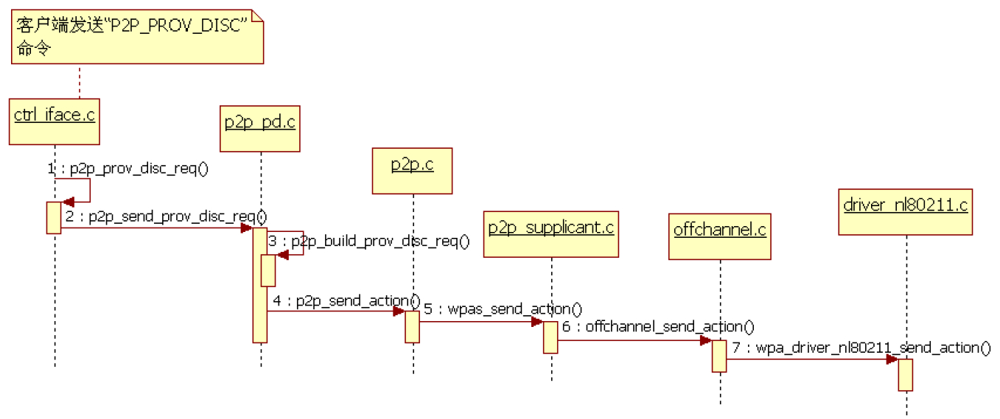
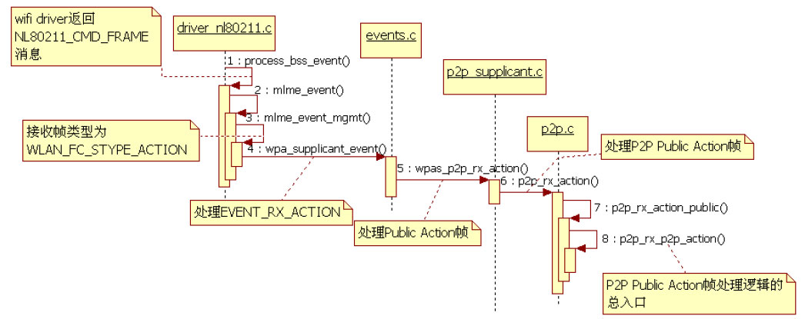

# 7.4.3 Provision Discovery流程分析


```java
static int p2p_ctrl_prov_disc(struct wpa_supplicant *wpa_s, char *cmd)
{
    u8 addr[ETH_ALEN];  char *pos;
    if (hwaddr_aton(cmd, addr)) return -1;
    .....// 参数处理。P2P_PROV_DISC命令的完整参数形式为“＜addr＞ ＜config method＞ [join]”
    // 其最后一个join参数为可选项。WifiP2pService没有使用它
    // 调用wpas_p2p_prov_disc，其内部将调用p2p_prov_disc_req，我们直接来看它
    return wpas_p2p_prov_disc(wpa_s, addr, pos, os_strstr(pos, "join") != NULL);
}
```

```java
int p2p_prov_disc_req(struct p2p_data *p2p, const u8 *peer_addr,
                      u16 config_methods, int join, int force_freq)
{
    struct p2p_device *dev;
    dev = p2p_get_device(p2p, peer_addr);// 根据目标设备地址找到对应的p2p_device对象
    if (dev == NULL)
        dev = p2p_get_device_interface(p2p, peer_addr);
     ......
    dev-＞wps_prov_info = 0;
    dev-＞req_config_methods = config_methods;
    // 就本例而言，join的值为0
    if (join) dev-＞flags |= P2P_DEV_PD_FOR_JOIN;
    else dev-＞flags &= ~P2P_DEV_PD_FOR_JOIN; // 取消dev-＞flags中的P2P_DEV_PD_FOR_JOIN标志
    ......
    p2p-＞user_initiated_pd = !join;
    if (p2p-＞user_initiated_pd && p2p-＞state == P2P_IDLE)
        p2p-＞pd_retries = MAX_PROV_DISC_REQ_RETRIES;
    // 最后调用p2p_send_prov_disc_req发送数据
    return p2p_send_prov_disc_req(p2p, dev, join, force_freq);
}
```

7.4.3ProvisionDiscovery流程分析P2pStateMachine的ProvisionDiscoveryState在其EA中将发送形如"P2P_PROV_DISC8a：32：9b：6c：

d1：80pbc"的命令给WPAS（请参考7.3.2节“CONNECT处理流程分析”​）去执行，其核1.PDRequest帧发送流程心处理函数是p2p_ctrl_prov_disc，代码如下所示。

p2p_prov_disc_req的代码如下所示。

[--＞ctrl_iface.c：​：p2p_ctrl_prov_disc][--＞p2p.c：​：p2p_prov_disc_req]

```c
int p2p_send_prov_disc_req(struct p2p_data *p2p, struct p2p_device *dev,
               int join, int force_freq)
{
    struct wpabuf *req;  int freq;
    // 确定对端设备所在的工作频段
    if (force_freq ＞ 0)   freq = force_freq;
    else  freq = dev-＞listen_freq ＞ 0 ? dev-＞listen_freq :dev-＞oper_freq;
    ......
    dev-＞dialog_token++;// 还记得表7-3关于Dialog Token的描述吗
    if (dev-＞dialog_token == 0) dev-＞dialog_token = 1;
    // 构造Provision Discovery Request帧内容
    req = p2p_build_prov_disc_req(p2p, dev-＞dialog_token,
                      dev-＞req_config_methods,join ? dev : NULL);
    ......
    p2p-＞pending_action_state = P2P_PENDING_PD;// 该标志表明当前pending的Action是PD
    // p2p_send_action内部将调用wpas_send_action。这部分内容比较简单，请读者自行研究
    // 另外，第7.4.2节也会提到wpas_send_action函数，读者也可学习完本章后再来研究它
    if (p2p_send_action(p2p, freq, dev-＞info.p2p_device_addr,
                p2p-＞cfg-＞dev_addr, dev-＞info.p2p_device_addr,
                wpabuf_head(req), wpabuf_len(req), 200) ＜ 0) {......}
    // 保存对端P2P设备地址
    os_memcpy(p2p-＞pending_pd_devaddr, dev-＞info.p2p_device_addr, ETH_ALEN);
    wpabuf_free(req);
    return 0;
}
```

p2p_send_prov_disc_req比较简单，代码如下。

[--＞p2p_pd.c：​：

p2p_send_prov_disc_req]上述代码中，PDRequest帧最终将通过p2p_send_action函数发送出去。不过，p2p_send_action并不简单，它将涉及OChannel发送以及处理对应netlink消息的过程。做为本书Wi-Fi部分的最后一章，请读者在学习完本章后，再自行研究这个函数。

图7-34展示了PDRequest帧发送流程中的重要函数调用序列。



图7-34PDRequest帧发送流程图7-34列出了wpas_send_action中的几个重要函数调用，请读者自行研究时候注意相关内容。

```java
static int process_bss_event(struct nl_msg *msg, void *arg)
{
    struct i802_bss *bss = arg; struct genlmsghdr *gnlh = nlmsg_data(nlmsg_hdr(msg));
    struct nlattr *tb[NL80211_ATTR_MAX + 1];
    nla_parse(tb, NL80211_ATTR_MAX, genlmsg_attrdata(gnlh, 0),
                     genlmsg_attrlen(gnlh, 0), NULL);
    switch (gnlh-＞cmd) {
    case NL80211_CMD_FRAME:             // 收到对端发送的帧
    case NL80211_CMD_FRAME_TX_STATUS:   // 对应本机所发送的管理帧的TX Report
        mlme_event(bss-＞drv, gnlh-＞cmd, tb[NL80211_ATTR_FRAME],
               tb[NL80211_ATTR_MAC], tb[NL80211_ATTR_TIMED_OUT],
               tb[NL80211_ATTR_WIPHY_FREQ], tb[NL80211_ATTR_ACK],
               tb[NL80211_ATTR_COOKIE]);
        break;
    ......
    }
    return NL_SKIP;
}
```

下面来看PDRespone帧的处理流程。由于PDResponse属于Action帧，所以我们将介绍WPAS中Action帧的接收流程，然后再分析PDResponse的处理流程。

2.Action帧接收流程PDResponse帧属于PublicAction帧的一种，而根据7.4.1节“注册Action帧监听事件”的分析可知，当收到对端设备发来的PDResponse帧后，process_bss_event函数将被调用。此函数的代码如下所示。

[--＞driver_nl80211.c：​：

process_bss_event]由上述代码可知，不论是代表由本机所发送的

```c
static void mlme_event(struct wpa_driver_nl80211_data *drv, enum nl80211_commands cmd,
                struct nlattr *frame, struct nlattr *addr, struct nlattr *timed_out,
                struct nlattr *freq, struct nlattr *ack,struct nlattr *cookie)
{
     ......
    switch (cmd) {
     case NL80211_CMD_AUTHENTICATE:
         mlme_event_auth(drv, nla_data(frame), nla_len(frame));
         break;
     case NL80211_CMD_ASSOCIATE:
         mlme_event_assoc(drv, nla_data(frame), nla_len(frame));
         break;
     ......
     case NL80211_CMD_FRAME:
         mlme_event_mgmt(drv, freq, nla_data(frame), nla_len(frame));
         break;
     case NL80211_CMD_FRAME_TX_STATUS:
         mlme_event_mgmt_tx_status(drv, cookie, nla_data(frame),
                       nla_len(frame), ack);
     ......
     }
}
```

管理帧TXReport的NL80211_CMD_FRAME_TX_STATUS消息，还是代表本机接收到对端发来的管理帧事件的NL80211_CMD_FRAME消息，最终都会调用mlme_event函数，其代码如下所示。

[--＞driver_nl80211.c：​：mlme_event]mlme_event将处理各种类型的帧事件。对于本例而言，此时将调用mlme_event_mgmt函数，其代码如下所示。

[--＞driver_nl80211.c：​：

mlme_event_mgmt]

```c
static void mlme_event_mgmt(struct wpa_driver_nl80211_data *drv,
                struct nlattr *freq, const u8 *frame, size_t len)
{
    const struct ieee80211_mgmt *mgmt;
    union wpa_event_data event;
    u16 fc, stype;
    mgmt = (const struct ieee80211_mgmt *) frame;
    ......
    fc = le_to_host16(mgmt-＞frame_control);
    stype = WLAN_FC_GET_STYPE(fc);
    os_memset(&event, 0, sizeof(event));
    if (freq) {
        event.rx_action.freq = nla_get_u32(freq);
        drv-＞last_mgmt_freq = event.rx_action.freq;
    }
    if (stype == WLAN_FC_STYPE_ACTION) {
        event.rx_action.da = mgmt-＞da;
        event.rx_action.sa = mgmt-＞sa;
        event.rx_action.bssid = mgmt-＞bssid;
        event.rx_action.category = mgmt-＞u.action.category;
        event.rx_action.data = &mgmt-＞u.action.category + 1;
        event.rx_action.len = frame + len - event.rx_action.data;
         // EVENT_RX_ACTION帧代表ACTION帧
        wpa_supplicant_event(drv-＞ctx, EVENT_RX_ACTION, &event);
    } else {
        event.rx_mgmt.frame = frame;
        event.rx_mgmt.frame_len = len;
        // EVENT_RX_MGMT代表其他类型的管理帧
        wpa_supplicant_event(drv-＞ctx, EVENT_RX_MGMT, &event);
    }
}
```

wpa_supplicant_event处理EVENT_RX_ACTION的内容比较丰富，不过

```java
void p2p_rx_action(struct p2p_data *p2p, const u8 *da, const u8 *sa,
           const u8 *bssid, u8 category, const u8 *data, size_t len, int freq)
{
    if (category == WLAN_ACTION_PUBLIC) {// 处理Public Action帧
        p2p_rx_action_public(p2p, da, sa, bssid, data, len, freq);
        return;
    }
   ......// 参数检查
    switch (data[0]) {// P2P规范使用的其他非Public类型的Action帧
    case P2P_NOA:
        break;
    case P2P_PRESENCE_REQ:
        p2p_process_presence_req(p2p, da, sa, data + 1, len - 1, freq);
        break;
    case P2P_PRESENCE_RESP:
        p2p_process_presence_resp(p2p, da, sa, data + 1, len - 1);
        break;
    case P2P_GO_DISC_REQ:
        p2p_process_go_disc_req(p2p, da, sa, data + 1, len - 1, freq);
        break;
    ......
    }
}
```

```java
static void p2p_rx_action_public(struct p2p_data *p2p, const u8 *da,
                 const u8 *sa, const u8 *bssid, const u8 *data,size_t len, int freq)
{
    ......
    switch (data[0]) {
    case WLAN_PA_VENDOR_SPECIFIC:// P2P Public Action满足此条件
      ......
        p2p_rx_p2p_action(p2p, sa, data + 1, len - 1, freq);
        break;
    case WLAN_PA_GAS_INITIAL_REQ:
        p2p_rx_gas_initial_req(p2p, sa, data + 1, len - 1, freq);
        break;
    ......// 其他类型的Public Action帧处理
    }
}
```

对于P2P来说，wpa_supplicant_event将调用wpas_p2p_rx_action，而wpas_p2p_rx_action又会调用p2p_rx_action，所以此处直接看p2p_rx_action函数即可，其代码如下所示。

[--＞p2p.c：​：p2p_rx_action]上述代码中专门处理PublicAction帧的p2p_rx_action_public函数代码如下所示。

[--＞p2p.c：​：p2p_rx_action_public]

```c
static void p2p_rx_p2p_action(struct p2p_data *p2p, const u8 *sa,
                  const u8 *data, size_t len, int rx_freq)
{
    switch (data[0]) {          // P2P支持的Public Action帧在此处得到分类和相应处理
    case P2P_GO_NEG_REQ:                // 处理GON Request帧
        p2p_process_go_neg_req(p2p, sa, data + 1, len - 1, rx_freq);
        break;
    case P2P_GO_NEG_RESP:               // 处理GON Response帧
        p2p_process_go_neg_resp(p2p, sa, data + 1, len - 1, rx_freq);
        break;
    case P2P_GO_NEG_CONF:               // 处理GON Confirmation帧
        p2p_process_go_neg_conf(p2p, sa, data + 1, len - 1);
        break;
    case P2P_INVITATION_REQ:    // 处理Invitation Request帧
        p2p_process_invitation_req(p2p, sa, data + 1, len - 1,rx_freq);
        break;
    case P2P_INVITATION_RESP:   // 处理Invitation Response帧
        p2p_process_invitation_resp(p2p, sa, data + 1, len - 1);
        break;
    case P2P_PROV_DISC_REQ:     // 处理PD Request帧
        p2p_process_prov_disc_req(p2p, sa, data + 1, len - 1, rx_freq);
        break;
    case P2P_PROV_DISC_RESP:    // 处理PD Response帧
        p2p_process_prov_disc_resp(p2p, sa, data + 1, len - 1);
        break;
    case P2P_DEV_DISC_REQ:      // 处理Device Discoverability Request帧
        p2p_process_dev_disc_req(p2p, sa, data + 1, len - 1, rx_freq);
        break;
    case P2P_DEV_DISC_RESP:     // 处理Device Discoverability Response帧
        p2p_process_dev_disc_resp(p2p, sa, data + 1, len - 1);
        break;
    ......// default语句
    }
}
```

p2p_rx_p2p_action函数是P2P模块中PublicAction帧得到分类处理的最后一关，其代码如下所示。

[--＞p2p.c：​：p2p_rx_p2p_action]至此，Action帧的接收流程就介绍完了。整体而言，这部分代码难度不大，但是调用函数却比较多。图7-35总结了这部分流程所涉及的一些重要函数。



图7-35Action帧接收流程由图7-35可知，p2p_rx_p2p_action为P2PPublicAction帧处理逻辑的总入口，如果后文分析时碰到其他类型的P2PPublicAction帧，我们将直接转入该函数来分析。

3.PDResponse帧处理流程

```java
void p2p_process_prov_disc_resp(struct p2p_data *p2p, const u8 *sa,
                const u8 *data, size_t len)
{
    struct p2p_message msg;  struct p2p_device *dev; u16 report_config_methods = 0;
    // 解析PD Response帧
    if (p2p_parse(data, len, &msg)) return;
    // 获取对应的P2P Device对象
    dev = p2p_get_device(p2p, sa);
    ......
    /*
    当前我们pending的action是PD，由于已经收到了PD Response，所以可以置pending_action_state
    变量为P2P_NO_PENDING_ACTION。
    */
    if (p2p-＞pending_action_state == P2P_PENDING_PD) {
        os_memset(p2p-＞pending_pd_devaddr, 0, ETH_ALEN);
        p2p-＞pending_action_state = P2P_NO_PENDING_ACTION;
    }
    if (dev-＞dialog_token != msg.dialog_token)return;
    if (p2p-＞user_initiated_pd &&
        os_memcmp(p2p-＞pending_pd_devaddr, sa, ETH_ALEN) == 0)
        p2p_reset_pending_pd(p2p);
    /*
    如果所要求的WSC方法和PD Response返回的WSC方法不一致，则表明对端P2P设备不支持所要求的WSC方法。
    */
    if (msg.wps_config_methods != dev-＞req_config_methods) {
        // 调用wpas_prov_disc_fail，以处理PD失败的情况
        // 不过WPAS中，该函数没有干什么有意义的事情
        if (p2p-＞cfg-＞prov_disc_fail)
            p2p-＞cfg-＞prov_disc_fail(p2p-＞cfg-＞cb_ctx, sa,P2P_PROV_DISC_REJECTED);
        p2p_parse_free(&msg);
        goto out;
    }
    report_config_methods = dev-＞req_config_methods;
    dev-＞flags &= ~(P2P_DEV_PD_PEER_DISPLAY | P2P_DEV_PD_PEER_KEYPAD);
    ......
    dev-＞wps_prov_info = msg.wps_config_methods;
    p2p_parse_free(&msg);
out:
    dev-＞req_config_methods = 0;
    p2p-＞cfg-＞send_action_done(p2p-＞cfg-＞cb_ctx);// 请读者自行研究send_action_done函数
    if (p2p-＞cfg-＞prov_disc_resp)// prov_disc_respz指向wpas_prov_disc_resp
        p2p-＞cfg-＞prov_disc_resp(p2p-＞cfg-＞cb_ctx, sa,report_config_methods);
}
```

由上述的p2p_rx_p2p_action可知，PDResponse帧对应的处理函数是p2p_process_prov_disc_resp，其代码如下所示。

[--＞p2p_pd.c：​：

p2p_process_prov_disc_resp]马上来看wpas_prov_disc_resp函数，其代码

```c
void wpas_prov_disc_resp(void *ctx, const u8 *peer, u16 config_methods)
{
    struct wpa_supplicant *wpa_s = ctx;
    unsigned int generated_pin = 0;
    /*
    pending_pd_before_join变量对应于这样一种场景：即GON已经完成，但WSC配置方法还没有确定。
    在后文分析GON时，我们将见到这种场景。
    */
    if (wpa_s-＞pending_pd_before_join &&
        (os_memcmp(peer, wpa_s-＞pending_join_dev_addr, ETH_ALEN) == 0 ||
        os_memcmp(peer, wpa_s-＞pending_join_iface_addr, ETH_ALEN) == 0)) {
        wpa_s-＞pending_pd_before_join = 0;
        wpas_p2p_join_start(wpa_s);
        return;
    }
    if (config_methods & WPS_CONFIG_DISPLAY)
        wpas_prov_disc_local_keypad(wpa_s, peer, "");
    else if (config_methods & WPS_CONFIG_KEYPAD) {
        generated_pin = wps_generate_pin();
        wpas_prov_disc_local_display(wpa_s, peer, "", generated_pin);
    } else if (config_methods & WPS_CONFIG_PUSHBUTTON)
        wpa_msg(wpa_s, MSG_INFO, P2P_EVENT_PROV_DISC_PBC_RESP MACSTR,MAC2STR(peer));
    ......
}
```

如下所示。

[--＞p2p_supplicant.c：​：

wpas_prov_disc_resp]对于WSCPBC方法而言，wpa_msg将发送P2P_EVENT_PROV_DISC_PBC_RESP（字符串，值为"P2P-PROV-DISC-PBC-RESP"）消息给客户端，这也触发了7.3.2节分析P2P_PROV_DISC_PBC_RSP_EVENT处理流程中所描述的工作流程。

现在来看本章关于P2P的最后一到工序。
