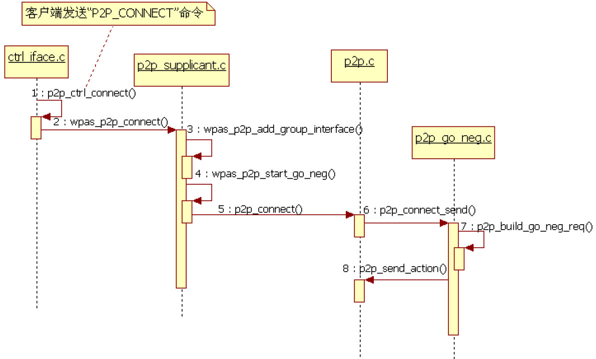
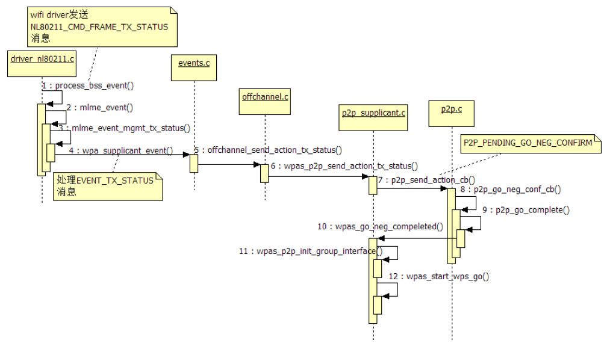

# 7.4.4 GO Negotiation流程分析


P2pStateMachine收到P2P_PROV_DISC_PBC_RSP_EVENT消息后，将在ProvisionDiscoveryState中调用p2pConnectWithPinDisplay，该函数内部将发送P2P_CONNECT命令给WPAS。马上来看该命令的处理流程。

1.P2P_CONNECT处理流程P2P_CONNECT命令的参数比较多，而本例中P2pStateMachine发送的命令格式如下。

```
P2P_CONNECT 8a：32：9b：6c：d1：80 pbc go_intent=7
//其中，"8a：32：9b：6c：d1：80"代表对端P2P设备地址
//"pbc"指定了WSC配置方法为PBC，"go_intent=7"设置GO Intent值为7
```

```java
static int p2p_ctrl_connect(struct wpa_supplicant*wpa_s,
                            char *cmd,char *buf, size_t buflen)
{
    u8 addr[ETH_ALEN]; char *pos, *pos2;
    char *pin = NULL;  enum p2p_wps_method wps_method;
    int new_pin; int ret;  int persistent_group;
    int join; int auth;
    int go_intent = -1; int freq = 0;
    if (hwaddr_aton(cmd, addr))  return -1;
    ......// 参数处理，最终调用的函数为wpas_p2p_connect
    new_pin = wpas_p2p_connect(wpa_s, addr, pin, wps_method,
              persistent_group, join, auth, go_intent,freq);
    ......
    os_memcpy(buf, "OK\n", 3);
    return 3;
}
```

P2P_CONNECT对应的处理函数为p2p_ctrl_connect，其代码如下所示。

[--＞ctrl_iface.c：​：p2p_ctrl_connect]

```c
int wpas_p2p_connect(struct wpa_supplicant *wpa_s, const u8 *peer_addr,
             const char *pin, enum p2p_wps_method wps_method,
             int persistent_group, int join, int auth, int go_intent,int freq)
{
    int force_freq = 0, oper_freq = 0;
    u8 bssid[ETH_ALEN];
    int ret = 0;
    enum wpa_driver_if_type iftype;
    const u8 *if_addr;
    ......
    if (go_intent ＜ 0)go_intent = wpa_s-＞conf-＞p2p_go_intent;
    wpa_s-＞p2p_wps_method = wps_method;
    wpa_s-＞p2p_pin[0] = '\0';
    // 本例中，由于GON还未完成，GO角色未能确定，所以join为0
    if (join) {......}
    ......// 频段设置
    /*
    注意下面这个wpas_p2p_create_iface函数，它将判断是否需要创建一个新的virtual interface，还记得
    7.4.1节介绍Driver Flags和重要数据结构时提到的WPA_DRIVER_FLAGS_P2P_MGMT_AND_NON_P2P
    标志吗？就本例而言，wifi driver flags中包含了该标志，所以下面这个函数的返回值为1，表示需要单独创建
    一个新的virtual interface供P2P使用。这个virtual interface的地址应该就是P2P Interface Address。
    */
    wpa_s-＞create_p2p_iface = wpas_p2p_create_iface(wpa_s);
    if (wpa_s-＞create_p2p_iface) {                   // 本例满足此if条件
        iftype = WPA_IF_P2P_GROUP;                      // 设置interface type
        if (go_intent == 15) iftype = WPA_IF_P2P_GO;    // 本例的go_intent为7
        /*
        下面这个函数将创建此virtual interface，并获取其interface address。以Galaxy Note 2
        为例。P2P Device Address是“92:18:7c:69:88:e2”，而P2P Interface Address是
        “92:18:7c:69:08:e2”。
        wpas_p2p_add_group_interface内部将调用driver_nl80211.c的wpa_driver_nl80211_if_add
        函数。感兴趣的读者不妨自行研究。
        */
        if (wpas_p2p_add_group_interface(wpa_s, iftype) ＜ 0) return -1;
        if_addr = wpa_s-＞pending_interface_addr;
    } else
        if_addr = wpa_s-＞own_addr;
    .......
    // 下面这个函数内部将调用p2p_connect，我们将直接分析
    if (wpas_p2p_start_go_neg(wpa_s, peer_addr, wps_method,
                go_intent, if_addr, force_freq,persistent_group) ＜ 0) {......}
    return ret;
}
```

wpas_p2p_connect的代码如下所示。

[--＞p2p_supplicant.c：​：

wpas_p2p_connect]

```c
int p2p_connect(struct p2p_data *p2p, const u8 *peer_addr,
                       enum p2p_wps_method wps_method,
                       int go_intent, const u8 *own_interface_addr,
                       unsigned int force_freq,
                       int persistent_group)
{
    struct p2p_device *dev;
    // 如果指定了工作频段，则需要判断是否支持该工作频段
    if (p2p_prepare_channel(p2p, force_freq) ＜ 0)  return -1;
    p2p-＞ssid_set = 0;
    dev = p2p_get_device(p2p, peer_addr);
    ......// 设置dev的一些信息
    p2p-＞go_intent = go_intent;
    os_memcpy(p2p-＞intended_addr, own_interface_addr, ETH_ALEN);
    // 如果P2P模块的状态不为P2P_IDLE，则先停止find工作
    if (p2p-＞state != P2P_IDLE) p2p_stop_find(p2p);
    ......
    dev-＞wps_method = wps_method;
    dev-＞status = P2P_SC_SUCCESS;
    ......
    if (p2p-＞p2p_scan_running) {
        /*
        如果当前P2P还在扫描过程中，则设置start_after_scan为P2P_AFTER_SCAN_CONNECT标志，
        当scan结束后，在扫描结果处理流程中，该标志将通知P2P进入connect处理流程。
        */
        p2p-＞start_after_scan = P2P_AFTER_SCAN_CONNECT;
        os_memcpy(p2p-＞after_scan_peer, peer_addr, ETH_ALEN);
        return 0;
    }
    p2p-＞start_after_scan = P2P_AFTER_SCAN_NOTHING;
    // 下面这个函数将发送GON Request帧，直接来看该函数
    return p2p_connect_send(p2p, dev);
}
```

2.GONRequest发送流程来看p2p_connect函数，其代码如下所示。

[--＞p2p.c：​：p2p_connect]

```c
int p2p_connect_send(struct p2p_data *p2p, struct p2p_device *dev)
{
    struct wpabuf *req;  int freq;
    ......
    req = p2p_build_go_neg_req(p2p, dev);
    p2p_set_state(p2p, P2P_CONNECT);    // 设置P2P模块的状态为P2P_CONNECT
    // 设置pending_action_state为P2P_PENDING_GO_NEG_REQUEST
    p2p-＞pending_action_state = P2P_PENDING_GO_NEG_REQUEST;
    p2p-＞go_neg_peer = dev;          // 设置GON对端设备
    dev-＞flags |= P2P_DEV_WAIT_GO_NEG_RESPONSE;
    dev-＞connect_reqs++;
#ifdef ANDROID_P2P
    dev-＞go_neg_req_sent++;
#endif
    // 发送GON Request帧
    if (p2p_send_action(p2p, freq, dev-＞info.p2p_device_addr,
                p2p-＞cfg-＞dev_addr, dev-＞info.p2p_device_addr,
                wpabuf_head(req), wpabuf_len(req), 200) ＜ 0) {......}
    ......
    return 0;
}
```

[--＞p2p_go_neg.c：​：p2p_connect_send]



```c
void p2p_process_go_neg_resp(struct p2p_data *p2p, const u8 *sa,
                 const u8 *data, size_t len, int rx_freq)
{
    struct p2p_device *dev;  struct wpabuf *conf; int go = -1;
    struct p2p_message msg;  u8 status = P2P_SC_SUCCESS;
    int freq;
    dev = p2p_get_device(p2p, sa);
    // 解析GON Response帧
    if (p2p_parse(data, len, &msg)) return;
    ......// 参数检查
    /*
    下面这个函数将利用图7-13计算谁来扮演GO。返回值大于0，表示本机扮演GO,
    返回-1表示双方都想成为GO，返回值为0，表示对端扮演GO。本例中，假设GO为本机设备。
    */
    go = p2p_go_det(p2p-＞go_intent, *msg.go_intent);
    ......// 参数检查，内容比较繁杂，感兴趣的读者请自行研究
    if (go) {......// 处理工作频段}
    p2p_set_state(p2p, P2P_GO_NEG);// 设置P2P模块的状态为P2P_GO_NEG
    p2p_clear_timeout(p2p);
    ......
fail:
    // 构造GON Confirmation帧
    conf = p2p_build_go_neg_conf(p2p, dev, msg.dialog_token, status,
                     msg.operating_channel, go);
    p2p_parse_free(&msg);
    .......
    if (status == P2P_SC_SUCCESS) {
        p2p-＞pending_action_state = P2P_PENDING_GO_NEG_CONFIRM;
        dev-＞go_state = go ? LOCAL_GO : REMOTE_GO;// 本机扮演GO
    } else
        p2p-＞pending_action_state = P2P_NO_PENDING_ACTION;
    ......
    // 发送GON Confirmation帧
    if (p2p_send_action(p2p, freq, sa, p2p-＞cfg-＞dev_addr, sa,
                wpabuf_head(conf), wpabuf_len(conf), 200) ＜ 0) {......}
    wpabuf_free(conf);
}
```

图7-36P2P_CONNECT命令处理流程3.GONResponse帧处理流程根据前面对Action帧接收流程的分析可知，收到的GONResponse帧将在p2p_process_go_neg_resp函数中被处理。

该函数的代码如下所示。

至此，GONRequest帧就将发送给对端P2P[--＞p2p_go_neg.c：​：

设备。图7-36描述了P2P_CONNECT命令的p2p_process_go_neg_resp]处理流程。

p2p_process_go_neg_resp实际的代码比较复杂，建议初学者先了解上面代码所涉及的大

```c
void offchannel_send_action_tx_status(struct wpa_supplicant *wpa_s, const u8 *dst,
             const u8 *data,size_t data_len, enum offchannel_send_action_result result)
{
    ......// 参数检查
    wpabuf_free(wpa_s-＞pending_action_tx);
    wpa_s-＞pending_action_tx = NULL;
    /*
    注意下面这个pending_action_tx_status_cb参数，它是一个函数指针，P2P每次发送Action的时候，
    都会设置该变量。其真实的函数为wpas_p2p_send_action_tx_status(在wpas_send_action
    函数中设置)
    */
    if (wpa_s-＞pending_action_tx_status_cb) {
        wpa_s-＞pending_action_tx_status_cb( wpa_s, wpa_s-＞pending_action_freq,
            wpa_s-＞pending_action_dst, wpa_s-＞pending_action_src,
            wpa_s-＞pending_action_bssid, data, data_len, result);
    }
}
```

体流程。

当GONConfirmation帧发送出去后，wifidriver将向WPAS发送一个NL80211_CMD_FRAME_TX_STATUS消息，而该消息将导致driverwrapper发送EVENT_TX_STATUS消息给WPAS。下面我们直接来看EVENT_TX_STATUS的处理流程。

4.EVENT_TX_STATUS处理流程在events.c中，和P2P以及EVENT_TX_STATUS相关的处理函数是ochannel_send_action_tx_status，该函数的代码如下所示。

[--＞ochannel.c：​：

ochannel_send_action_tx_status]

```c
static void wpas_p2p_send_action_tx_status(struct wpa_supplicant *wpa_s,
            unsigned int freq,const u8 *dst, const u8 *src, const u8 *bssid,
            const u8 *data, size_t data_len, enum offchannel_send_action_result  result)
{
    enum p2p_send_action_result res = P2P_SEND_ACTION_SUCCESS;
    ......
    // 重要函数：p2p_send_action_cb
    p2p_send_action_cb(wpa_s-＞global-＞p2p, freq, dst, src, bssid, res);
    ......
}
```

```java
void p2p_send_action_cb(struct p2p_data *p2p, unsigned int freq, const u8 *dst,
            const u8 *src, const u8 *bssid,enum p2p_send_action_result result)
{
    enum p2p_pending_action_state state;
    int success;
    success = result == P2P_SEND_ACTION_SUCCESS;
    // 读者还记得该变量的值吗？它应该是P2P_PENDING_GO_NEG_CONFIRM
    state = p2p-＞pending_action_state;
    p2p-＞pending_action_state = P2P_NO_PENDING_ACTION;
    switch (state) {
    case P2P_NO_PENDING_ACTION:
        break;
    case P2P_PENDING_GO_NEG_REQUEST:
        // 读者可自行研究此函数。当发送完GON Request帧后，此函数也会被触发
        p2p_go_neg_req_cb(p2p, success);
        break;
    ......
    case P2P_PENDING_GO_NEG_CONFIRM:
        p2p_go_neg_conf_cb(p2p, result);// 分析这个函数
        break;
    ......// 其他case处理
    }
}
```

来看wpas_p2p_send_action_tx_status，其p2p_send_action_cb的代码如下所示。

代码如下所示。

[--＞p2p.c：​：p2p_send_action_cb][--＞p2p_supplicant.c：​：

wpas_p2p_send_action_tx_status]

```c
static void p2p_go_neg_conf_cb(struct p2p_data *p2p,
                   enum p2p_send_action_result result)
{
    struct p2p_device *dev;
    /*
    每次收到TX Report后，都需要调用send_action_cb，其对应的真实函数是wpas_send_action_done。
    */
    p2p-＞cfg-＞send_action_done(p2p-＞cfg-＞cb_ctx);
    ......
    dev = p2p-＞go_neg_peer;
    if (dev == NULL)  return;
    p2p_go_complete(p2p, dev);
}
```

p2p_go_complete函数比较简单，其代码如下所示。

来看p2p_go_neg_conf_cb函数，代码如下所示。

[--＞p2p.c：​：p2p_go_complete][--＞p2p.c：​：p2p_go_neg_conf_cb]

```c
void wpas_go_neg_completed(void *ctx, struct p2p_go_neg_results *res)
{
    struct wpa_supplicant *wpa_s = ctx;
    ......
  // 下面这个函数将导致P2pStateMachine收到P2P_GO_NEGOTIATION_SUCCESS_EVENT消息
    wpa_msg(wpa_s, MSG_INFO, P2P_EVENT_GO_NEG_SUCCESS);
    wpas_notify_p2p_go_neg_completed(wpa_s, res);
    if (wpa_s-＞create_p2p_iface) {// 本例满足此if条件
        /*
        再创建一个wpa_supplicant对象。感兴趣的读者可自行研究下面这个函数。其内部将调用4.4.3节
        分析的wpa_supplicant_add_iface函数。
        */
        struct wpa_supplicant *group_wpa_s =
            wpas_p2p_init_group_interface(wpa_s, res-＞role_go);
        ......
          // 如果本机扮演GO，则启动WSC Registrar功能，否则启动Enrollee功能
          // 下面这两个函数留给读者自行分析
        if (res-＞role_go)  wpas_start_wps_go(group_wpa_s, res, 1);
        else  wpas_start_wps_enrollee(group_wpa_s, res);
    }......
    wpa_s-＞p2p_long_listen = 0;
    eloop_cancel_timeout(wpas_p2p_long_listen_timeout, wpa_s, NULL);
    eloop_cancel_timeout(wpas_p2p_group_formation_timeout, wpa_s, NULL);
    // Group Formation的超时时间为15秒左右
    eloop_register_timeout(15 + res-＞peer_config_timeout / 100,
                   (res-＞peer_config_timeout % 100) * 10000,
                   wpas_p2p_group_formation_timeout, wpa_s, NULL);
}
```

```c
void p2p_go_complete(struct p2p_data *p2p, struct p2p_device *peer)
{
    struct p2p_go_neg_results res; int go = peer-＞go_state == LOCAL_GO;
    struct p2p_channels intersection; int freqs;
    size_t i, j;
    ......// 设置频段等参数
    p2p_set_state(p2p, P2P_PROVISIONING);// 进入Group Formation的Provisioning阶段
    // go_neg_completed对应的函数是wpas_go_neg_completed
    p2p-＞cfg-＞go_neg_completed(p2p-＞cfg-＞cb_ctx, &res);
}
```

[--＞p2p_supplicant.c：​：

wpas_go_neg_compeleted]当GroupNegotiation完成后，WPAS将新创建一个wpa_supplicant对象，它将用于管理和操作专门用于P2PGroup的virtualinterface，此处有几点请读者注意。

❑4.3.1节中介绍过，一个interface对应一个wpa_supplicant对象。

❑此处新创建的wpa_supplicant对象用于GO，即扮演AP的角色，专门处理和P2PGroup相关的事情，其MAC地址为P2PInterfaceAddress。

❑之前使用的wpa_supplicant用于非P2PGroup操作，其MAC地址为P2PDeviceAddress。

至此，整个EVENT_TX_STATUS处理流程就分析完毕了，其内容比较复杂。图7-37整理了此过程中一些重要的函数调用。

注意，图7-37实际上描述的是GONConfirmation帧对应的EVENT_TX_STATUS处理流程，和其他EVENT_TX_STATUS处理流程相比，前面7个函数调用都是一样的。



图7-37EVENT_TX_STATUS处理流程
