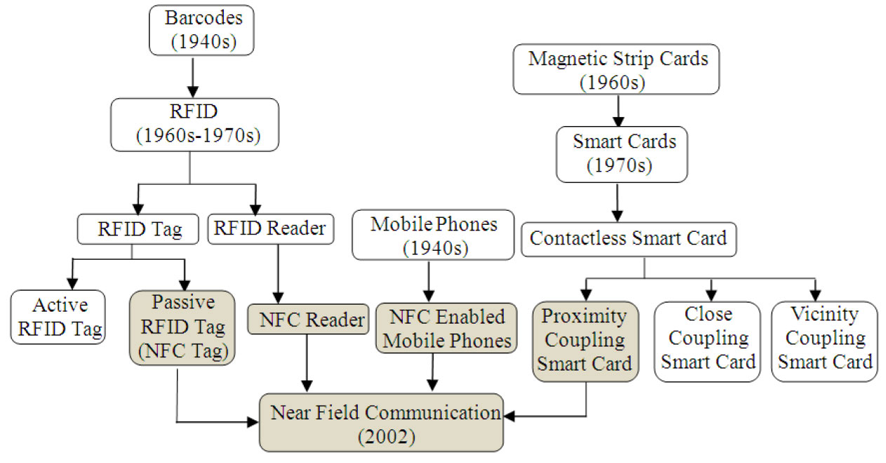

# 8.1 概述

NFC（NearFieldCommunication，近场通信）也叫做近距离无线通信技术。该技术最早由Philips和Sony两家公司于2002年年末联合推出。2004年，Nokia、Philips、Sony等公司还共同组建了一个名为NFCForum的非盈利性组织来推广和发展NFC技术。NFCForum的职责和Wi-FiAlliance类似，它不但负责制定NFC相关的技术标准，同时还通过NFC认证测试来保证各厂家的NFC产品符合NFC规范。

从原理上说，NFC和Wi-Fi类似，二者都利用无线射频技术来实现设备之间的通信。不过，和Wi-Fi相比，NFC的工作频率为13.56MHz，有效距离为4cm左右，目前所支持的数据传输速率有106kbps、212kbps和424kbps三种。

提示通过NFC无线射频参数的介绍可知，NFC所针对的应用场景和Wi-Fi明显不同。

以NFC有效距离为4cm为例，这么短的有效距离本身就要求交互双方必须有某种程度的相互信任。否则，一个用户不会随便让另外一个用户的设备这么靠近自己的设备。NFC还有其他非常多的广泛的应用场景，感兴趣的读者请阅读参考资料[1]​。

NFC技术从创建到现在已超过10年，在技术层面上已相当完善。但NFC至今未能像Wi-Fi一样被普及，其中一个重要原因就是大众消费者没有一个合适的载体来使用它。显然，随着越来越多携带NFC功能的Android智能终端的出现，NFC这种有价无市的状况有望很快得以改善。

提示很多专家预测2014年或2015年是NFC技术推广和普及的元年。但奇怪的是iPhone却迟迟没有支持NFC，这不免给它的前景蒙上了一层阴影。不过，最近有消息称苹果秘密申请了一项和NFC相关的专利。

本章将从以下几个方面来介绍NFC以及它在Android平台中的实现。

❑首先介绍NFC基础知识，这是本章的核心内容。相对Wi-Fi而言，本章介绍的NFC理论知识相对比较简单，相信读者能轻松掌握。

❑然后介绍Android平台中NFC实现，这部分内容包括NFC客户端示例以及NFC系统模块。

❑最后探讨目前一些开源NFC相关模块的实现情况。

先来看NFC基础知识。

