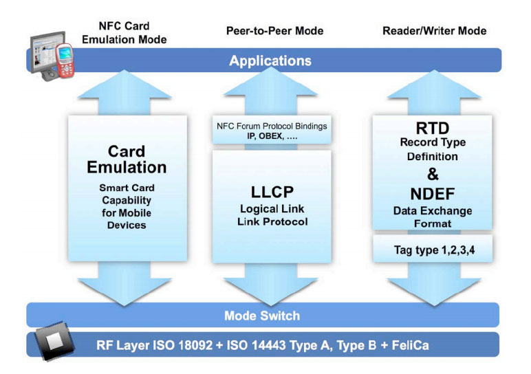
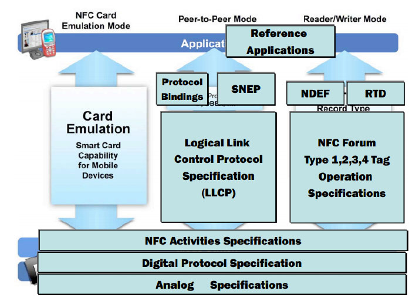

# 8.2.1 NFC概述

据，而且自身都没有电源组件，但SmartCard在安全性上的要求远比RFIDTag严格。

另外，SmartCard上还能运行一些小的嵌入式系统（如JavaCardOS）或者应用程序（Applets）以完成更为复杂的工作。

❑移动终端线路，演化了携带NFC功能的终端设备（图中间）​。随着移动终端越来越智能，NFC和这些设备也融合得更加紧密，使得NFC的应用场景得到了较大的拓展。本书第6章在介绍Wi-FiSimpleConfiguration时（6.1节）曾介绍过一个例子，即智能手机可通过NFC来和AP交换安全配置信息。一个与之类似的例子是NFCConnectionHandover技术，它描述了两台智能终端如何通过NFC相关协议来选择合适的数据传输方式（例如Bluetooth或Wi-Fi，受限于传输速率以及有效距离，NFC本身不适合大数据量传输）​。

了解NFC技术的演化历程之后，我们来看看NFC现在的样子。图8-2所示为NFC技术框架[3]。

图8-2NFC技术框架由图8-2可知，从用户角度（即图中的Applications层之上）来看，NFC有三种运行模式（operationmode）​。

❑Reader/Write模式：简称R/W，和NFCTag/NFCReader相关。

❑Peer-to-Peer模式：简称P2P，它支持两个NFC设备交互。

❑NFCCardEmulation模式：简称CE，它能把携带NFC功能的设备模拟成SmartCard，这样就能实现诸如手机支付、门禁卡之类的功能。

Application之下的三个箭头描述了三种运行模式所使用的协议栈。这部分内容将留待下文分析。

NFC使用的是无线射频技术。在RF层，与之相关的规范是ISO18092（NFCInterfaceandProtocolI，简称NFCIP-1，该规范定义了NFCRF层的工作流程）和ISO14443TypeA、TypeB，以及FeliCa。

ISO14443全称为非接触式IC卡标准，它从RF层面定义了如何与不同的非接触式IC卡（其实物可以是NFCTag、RFIDTag、SmartCards）交互。ISO14443定义了TypeA和TypeB两种非接触式IC卡。

❑TypeA最早由Philips公司制订（其生产的芯片商标名为MIFARE，现在由从Philips独立出来的NXP公司拥有，目前世界上70%左右的非接触式IC卡都使用了MIFARE芯片，例如北京市的公交卡）​。

❑TypeB（主要用在法国市场）由其他公司制订，二者最终都成为ISO标准。

❑FeliCa（也称为TypeF）由Sony开发，它最终没有成为ISO标准，而成为日本工业标准JISX6319-4，所以FeliCa主要用于日本市场。

TypeA、B和F主要区别在于RF层的信号调制解调方法、传输速率及数据编码方式上。关于ISO14443和FeliCa之间的区别，请读者阅读参考资料[4]​。

RF层之上是ModeSwitch，用于确定对端NFCDevice的类型并选择合适的RF层协议与之通信。

提示由于NFC是从多种技术综合发展而来，所以读者在学习NFC时将会碰到很多规范，如上文所提到的ISO18092以及ISO14443、FeliCa等。除了ISO等标准组织制定的规范外，NFCForum也制定了一系列的标准和规范。由于篇幅问题，本章仅介绍NFCForum定义的一些规范。对ISO相关规范感兴趣的读者可在本章基础之上自行阅读。

图8-3所示为与NFC技术框架相对应的NFC[3]Forum所定义的规范框架。

图8-3NFCForum规范框架由图8-3所示的NFCForum规范框架可知，NFCForum本身只定义了P2P模式和R/W模式相关的规范，规范的细节将留待下文详细介绍。CE模式比较复杂，下文也会讨论和它相关的一些知识。

在RF层，NFCForum定义了三个主要规范。

❑AnalogSpecifications：该规范描述了NFC设备RF层的电气特性。

❑DigitalProtocalSpecification：该规范在ISO18092、ISO14443及JISX6319-4之上定义了NFC设备之间的数字通信协议，它使得基于不同底层协议例如TypeA或TypeF的NFC设备之间或者NFC设备与其他使用ISO18092等规范的设备之间能够交互。

❑NFCActivitiesSpecification：该规范为各运行模式对应的协议栈提供支持，例如P2P模式下两个NFC设备如何建立链接，R/W模式下NFCDevice如何操作NFCTag。

图8-3最上层的ReferenceApplications表示NFCForum在应用层面所定义的一些规范。

目前有两个规范。

❑ConnectionHandover：两个NFC设备通过它来协商用蓝牙或Wi-Fi来开展后续的数据传输工作。

❑PersonalHealthDeviceCommunication：该规范定义了如何利用NFC技术在个人健康设备之间交换数据信息。

另外，除了图8-3所示的规范外，NFC还制定了一个NCI（NFCControerInterface）规范，该规范制定了一套交互接口，使得主机设备（DeviceHost，以手机为例，NFC芯片被集成到某个手机中，那么手机就是DeviceHost）能够使用这套接口来和NFC芯片交互。

下面，先讨论NFC三种运行模式，而NCI相关知识将留待本节最后介绍。

提示关于NFCForum制定的各种规范及简要说明见参考资料[5]​。
