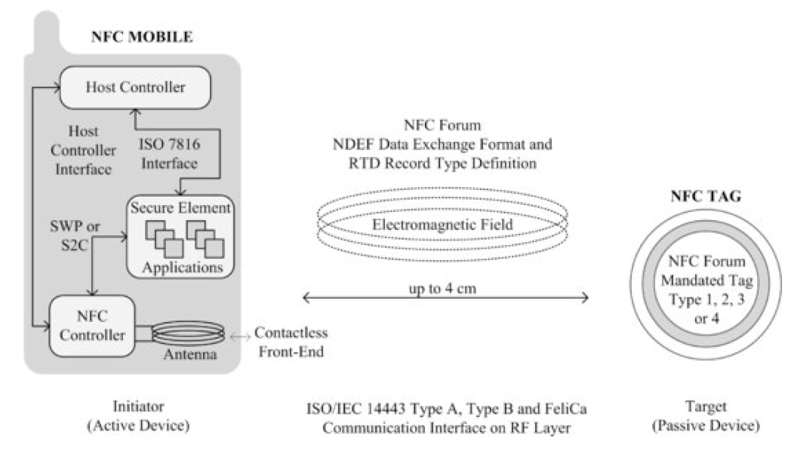
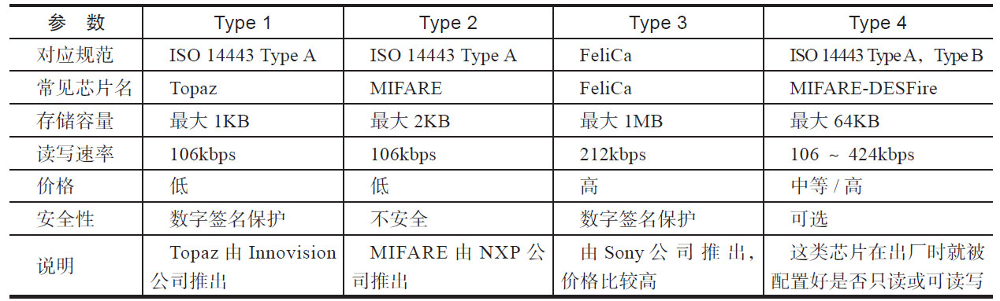
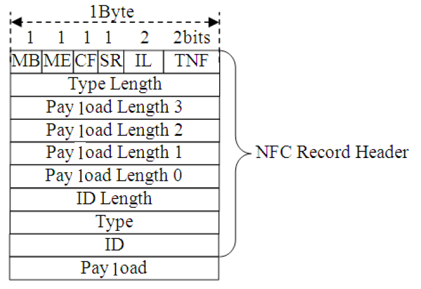
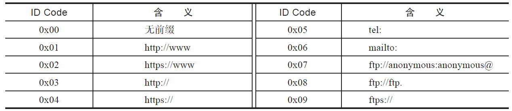
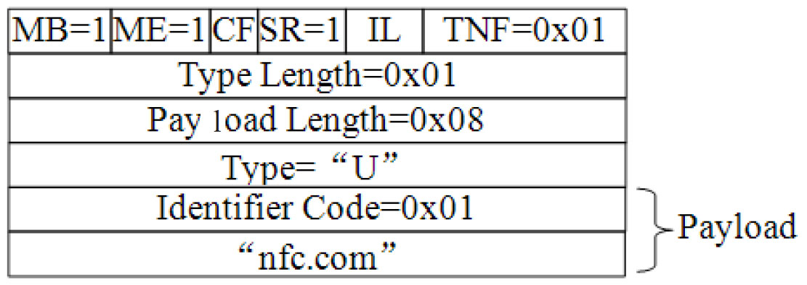
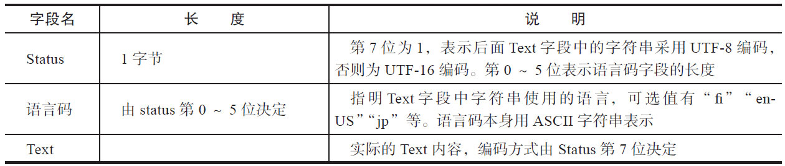
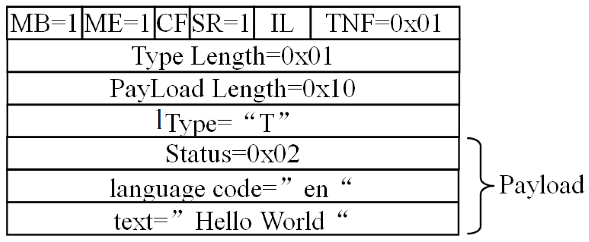

# 8.2.2 NFC R/W运行模式

以支持NFC功能的智能终端为例，NFCR/W[6]运行模式所包含的组件如图8-4所示。

图8-4R/W运行模式组件图8-4展示了一个包含NFC芯片的智能终端与NFCTag交互所涉及的组件。

❑左边的智能终端扮演NFCReader角色。位于其内部的NFC芯片包含NFCControer（NFC控制器，它可与DeviceHost或SecureElement安全单元交互）​、Antenna（天线）

和ContactlessFront-End（CLF，非接触式前端，负责射频信号的调制解调等工作）三个部分。注意，图中所示的SWP等内容将在8.2.4节介绍。

❑在R/W模式中，交互操作的发起方只能是NFCReader，因此它也称为Initiator或ActiveDevice。

❑右边的NFCTag，由于需要NFCReader通过电磁感应为其提供电能，所以在R/W模式中，NFCTag只能作为交互操作的Target（也称为PassiveDevice）​。

NFCForum定义了四种类型的Tag，分别为Type1、Type2、Type3和Type4。这四种类型NFCTag的区别在于存储空间大小、数据传输率以及底层使用的协议。表8-1列举了它们的不同点。

NFCForum定义了两个通用的数据结构用于NFCDevice之间（包括R/W模式中的NFCReader和NFCTag）传递数据。这两个通用数据结构分别是NFCDataExchangeFormat（NDEF）以及NFCRecord。

我们先来看NFC四种不同类型的Tag有何区[7]别，如表8-1所示。

表8-1NFCTagType说明

注意这里需要特别指出的是：虽然NFCFroum只有四种类型的Tag，但由于NFC本身源自RFID技术，二者在一些底层协议上也相互兼容，所以很多RFIDTag也能被NFCReader识别和操作。为了书写方便，除非特别说明，本章所指的NFCTag也包括那些和NFC相关规范兼容的RFIDTag。

虽然NFCTag有四种不同类型（由上文可知，实际上能被NFCReader读写的RFIDTag还远不止四种）​，但为了保证最大兼容性，NFCForum建议NFC设备之间尽量使用通用数据结构NDEF和NFCRecord来交换信息。

NFCR/W模式涉及的规范比较多，包括：

❑NFCReader如何与不同类型的Tag交互，这部分内容涉及非常底层的一些协议。

❑NDEF和一些常用数据类型定义。

出于篇幅和实用性考虑，本书仅介绍NDEF和相关的数据类型，感兴趣的读者可自行研究NFCReader和Tag之间的交互协议。

1.NDEF和NFCRecord[8]​[9]（1）NDEF和NFCRecord之间的关系根据NFCForum的定义，R/W模式下，NFC设备之间每一次交互的数据都会封装在一个NDEFMessage中，而一个NDEFMessage可以包含多个NFCRecord，真正的数据则封装在NFCRecord中。图8-5展示了NDEFMessage和NFCRecord之间的关系。

图8-5NDEFMessage和NFCRecord的关系由图8-5可知，一个NDEFMessage可包含一个或多个NFCRecord。在一个NDEFMessage中，第一个NFCRecord需设置其MB位（MessageBegin）为1，表示它是该消息中第一个NFCRecord，最后一个NFCRecord需设置ME位（MessageEnd）位为1，表示它是此消息中最后一个NFCRecord。

图8-6NFCRecord组织结构NFCRecord本身的组织结构如图8-6所示。

NFCRecord分为NFCRecordHeader（头部信息）和Payload（数据载荷）两大部分。

RecordHeader中最重要的是其第一字节。

该字节有6个标志信息，分别如下。

❑MB（MessageBegin标志）

❑ME（MessageEnd标志）

❑CF（ChunkFlag标志，表示该Record是否为分片Record）

❑SR（ShortRecord标志。如果该标志被设置，则图中的4个PayloadLength字段仅需一个，这表明Payload数据长度将限制在255字节以内）

❑IL（ID_LENGTH标志，它用于指明Header中是否包含IDLength和ID这两个字段）

❑TNF（TypeNameFormat标志，用于指明Payload的类型，NFCForum定义了一些常用的Payload类型，详情见下文分析）

其他字节如下。

❑TypeLength指明RecordHeader中Type字段的长度。

❑PayloadLength3～PayloadLength0这4个字段共同指明Payload字段的长度。如果SR标志被设置，则RecordHeader仅包含一个Payloadlength字段。

❑IDLength指明ID字段的长度。如图所示IL标志未设置，则IDLength和ID字段都不存在。

❑Type字段表明Payload的类型，NFCForum定义了诸如URI、MIME等类型的Type，其目的是方便不同的应用来处理不同Type的数据，例如URI类型的数据就交给浏览器来处理。

❑ID需要配合URI类型的Payload一起使用，它使得一个NFCRecord能通过ID来指向另外一个NFCRecord。

NFCRecord中，常令初学者感到困惑的是TNF字段，其作用是什么？来看下文。

（2）TNF和RTDTNF用于描述一个NFCRecord中数据（Payload）的类型，为了方便应用程序能正确解析NFCRecord中的数据，NFCForum规定了一些常用的数据类型，如表8-2所示。

表8-2TNF取值目前NFC支持七种数据类型。

❑Empty：表示该Record中没有数据，即相当于一个空的NFCRecord。

❑NFCForumWe-KnownType：由NFCForum定义的一些较为常用的数据类型，包括URI、TEXT等，其格式遵循NFCForumRTD（RecordTypeDefinition）规范。下文将详细介绍它。

❑MIME：它是MultipurposeInternetMailExtensions的缩写，遵循RFC2046规范。例如，当TNF取值为MIME时，其Type字段取值可为"text/plain"或"image/png"等。

❑AbsoluteURI：绝对URI，遵循RFC3986规范。例如某文件的绝对URI为"hp://android.com/robots.txt"，而其相对URI则为"robots.txt"。

❑NFCForumExternalType：也由NFCForum的RTD规范定义，下文将介绍它。

❑Unknown：代表Payload中的数据类型未知，它和MIME类型"application/octet-stream"有些类似，这种类型的数据由相应的应用程序来解析。

❑Unchanged：这种类型的数据用于NFCRecord分片。例如一个大的数据需要通过多个NFCRecord来承载，除第一个NFCRecord分片外，该数据对应的其他NFCRecord分片都必须设置TNF为Unchanged。

关于这部分内容，读者可参考NDEF规范的2.3.3节"RecordChunks"。

在TNF七大类型中，NFCForum通过RTD规范定义了其中的WKT（We-KnownType）

和ExternalType两种类型。虽然RTD规范全长只有20来页，但阅读起来比较枯燥，在此，笔者总结其核心内容。

简单点说，WKT就是NFCForum自己定义的一些常用数据类型，目前常用类型如下。

❑URIRecordType：用于存储URI数据，对应Type字段取值为"U"。

❑TextRecordType：用于存储文本数据，对应Type字段取值为"T"。

❑SignatureRecordType：用于存储数字签名数据，对应Type字段取值为"Sig"。

❑SmartPosterRecordType：智能海报，用于存储与该海报相关的一些资讯信息，如图片、相关介绍等，对应Type字段取值为"Sp"。

❑GenericControlRecordType：用于传递控制信息，对应Type字段取值为"Gc"。

❑ExternalType：为第三方组织定义的类型，目前NFCForum没有定义相关的数据类型。

提示NFCForum目前定义的所有WKT类型列表可参考hp://www.nfc-forum.org/specs/nfc_forum_assigned_numbers_register。

掌握了上述理论知识后，下面将通过两个实例来看看NFCRecord各个字段到底该如何设置。

[10]​[11]2.NFCRecord实例本节这两个实例分别来自URIRecordType规范和TEXTRecordType规范。先来看URIRecordType实例。

（1）URIRecordType实例URIRecordType属于NFCForumWe-knownType的一种，其对应的Type字段取值为"U"。对于这种类型的NFCRecord，其Payload组织结构如表8-3所示。

表8-3URIRecordPayload组织结构在URIRecordPayload中，第一个字节指明URI的ID码，表8-4为NFCForum定义的几种ID码。

表8-4IDCode示意

了解上述信息后，我们来看"hp://www.nfc.com"这样的信息该如何封装为一个NDEF消息，图8-7所示为NDEF消息各字段的取值情况。

图8-7URIRecord实例由于该NDEF消息只包含一个NFCRecord，所以这个唯一的NFCRecord将设置MB和ME标志位为1。另外，由于数据量小于255字节，所以SR标志位为1。最后，该Record携带的数据属于URI类型，它为We-KnownType的一种，所以TNF取值为0x01。

TypeLength字段取值为0x01，对应的Type字段取值为"U"，代表URIRecordType。

根据本节对URIRecord的介绍，这种类型Record的Payload包含IDCode和data两个部分。IDCode取值为0x01占据1字节（代表"hp://www"）​，而data为"nfc.com"占据7字节，所以整个Payload长度为8字节，故Payloadlength字段取值为0x08。

当应用程序获取Payload信息后，将根据IDCode和Data的取值最终计算出对应的URI为"hp://www.nfc.com"。

相信本节所述的URIRecord实例能帮助读者更加直观得了解NDEF和NRCRecord，下面再来看一个实例。

（2）TextRecordType实例TextRecordType和URIRecordType类似，其Payload组织结构如表8-5所示。

表8-5TextRecordPayload组织结构

图8-8TEXTRecord实例图8-8所示为携带"HeoWorld"字符串信息的NDEF消息各字段的取值情况。

实例比较简单，请读者根据本节对TEXTRecord知识的介绍来自行解释图8-8各个字段的取值。

至此，NFCR/W运行模式介绍完毕。在R/W模式下，对应用程序而言最重要的工作就是解析NDEF消息。NFCForum定义了七种数据类型，其中内容比较丰富的属于NFCForumWeKnownType。本节介绍了WKT中最简单的URIRecord和TEXTRecord。读者可在本节基础上自行研究其他几种数据类型。
