# 8.2.3 NFC P2P运行模式[12]

[12]8.2.3NFCP2P运行模式在前面介绍的R/W模式中，NFCDevice只能单向和NFCTag交互，即只能NFCDevice单方对NFCTag发起操作，而NFC所基于的无线射频技术实际上可以支持NFCDevice之间互相传递数据。为了满足NFCDevice之间双向交互的需求，NFCForum定义了P2P（Peer-to-Peer）运行模式。

图8-9展示了IEEE802参考模型、OSI参考模型及NFCP2P的协议栈参考模型。由此图可知，NFCP2P协议栈最高层为LLC（LogicalLinkControl，逻辑链路控制层）​。这一层使用的协议称为LLCP（LLCProtocol）​。

在OSI参考模型中，LLC比较偏底层，其更多考虑的是物理地址寻址、链路管理，以及数据传输方面的事情（参考3.3.1节关于OSI/RM的介绍）​。所以，NFC也在LLC层之上添加了一些对使用者更为方便和友好的协议。图8-10所示为NFCP2P协议栈的全貌。

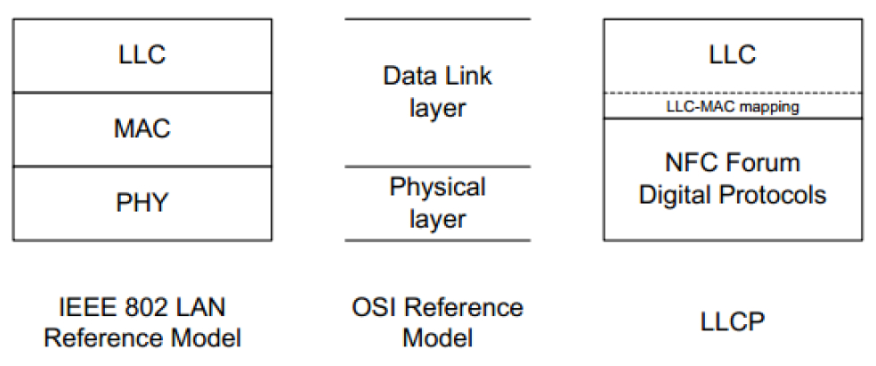

图8-9NFCP2P协议栈

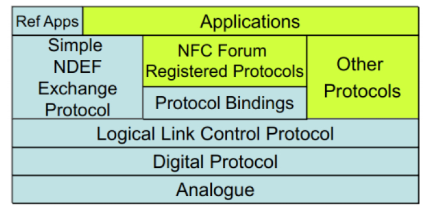

图8-10NFCP2P协议栈参考模型全貌❑SNEP（SimpleNDEFExchangeProtocol）紧接LLC层。该协议使得两个NFCDevice之间能直接交换NDEF消息。

❑通过ProtocolBindings，NFC可支持其他高层次并且用途更加广泛的协议。根据参考资料[3]所示的内容，NFC可支持IP和OBEX（ObjectExchange，对象交换）协议，但经过调查发现NFCForum官网目前只有LLCP-OBEX-Binding协议的草案，而LLCP和IP协议如何绑定还在研究当中。

❑OtherProtocols中目前比较常用的是CHP（ConnectionHandoverProtocol）​。

目前，Android4.2中的NFCP2P模块支持SNEP和CHP。本章将重点分析SNEP，而CHP则请读者学完本章后再自行研究。下面先介绍LLCP，然后再介绍SNEP。

1.LLCP介绍NFCLLCP比较简单，对应的规范全长也只有40来页。关于LLCP，从以下两个方面来介绍。

❑LLCP的数据封包格式。对学习通信协议来说，掌握数据包格式非常重要。

❑NFCLLCP对上层提供无链接（Connectionless）和面向链接（Connection-oriented）的两种数据传输服务。其中，无链接的数据传输服务和UDP类似，上层的收发双方无须事先建立逻辑链接关系即可收发数据。面向链接的数据传输服务和TCP类似，收发双方发送数据前，需要在LLC层先建立逻辑链接关系（即类似TCP协议中的connect和accept）​。同时，LLC层还会处理数据包丢失、重传以及接收确认等方面的事情。目前SNEP和CHP均使用了LLC提供的面向链接的数据传输服务，故我们将重点介绍它。

（1）LLCP数据包格式NFCLLC层数据封包格式如图8-11所示。

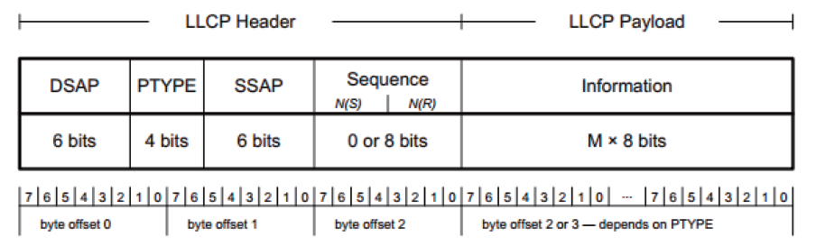

图8-11NFCLLCP数据包格式由图8-11可知，LLCP数据包前3字节为LLCPHeader。LLCPHeader之后就是Payload，其长度由PTYPE来决定。

❑DSAP和SSAP分别代表Destination和SourceServiceAccessPoint（目标和源服务接入点）​。DSAP和SSAP的作用类似于TCP/UDP中的端口号。注意，使用NFCLLCP时，DSAP和SSAP可唯一确定通信双方。读者可能有疑问，使用TCP/UDP时，除了指明端口号外，还需要指明对端设备的IP地址，但NFCLLCP数据包中却没有这样的信息。另外，和图3-24所示的LLC数据封装格式比起来，NFCLLCP数据包也没有MAC地址这样的字段。也就是说，LLCP只需要通信双方所使用的端口号即可，而无需MAC或IP地址这样的信息，这是因为NFC近距离作用的特点使得通信双方从进入有效距离内开始就已彼此确定，故无需再通过MAC地址指明谁是接收设备，谁是发送设备。而当上层通过LLC发送数据或者LLC向上层传递接收到的数据时则需要通过类似端口这样的SSAP和DSAP来进一步确定发送模块和接收模块到底是谁。

❑PTYPE字段指明LLCP包的类型。NFCLLCP定义了多种不同类型的包，下文将结合面向链接的数据传输服务来学习相关的LLCP包。

❑Sequence字段指明LLCP包的序号，它可分为Send端和Receiver端。由于有一些类型的LLCP包无需Sequence字段，所以Sequence字段长度有可能为0。例如，无链接的数据包就不需要Sequence字段，而面向链接的数据包需要该字段来处理数据接收确认或丢失重传等方面的事情。

由上述介绍可知，DSAP和SSAP类似TCP/UDP的端口号，决定了收发模块到底是谁。表8-6所示为NFC中SAP取值情况。

表8-6LLCPSAP取值说明

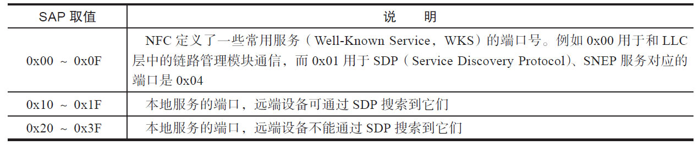

以SNEP的使用为例：

❑位于NFCDeviceA的服务端模块在SSAP为0x04的端口上进行监听。

❑位于NFCDeviceB的客户端模块选择一个合适的SSAP，设置DSAP为0x04。然后该客户端模块发送数据包，LLC负责将数据包打包传递给NFCDeviceB（假设这两个设备都在彼此的有效距离内）​。

❑NFCDeviceA的LLC层接收到数据包后发现DSAP为0x04，而其上刚好有一个服务模块工作在0x04端口，故LLC层将把数据包传递给这个在0x04端口上监听的服务模块。

下面将通过分析面向链接数据传输服务的工作流程来进一步研究LLCP。

（2）面向链接数据传输服务假设DeviceA和DeviceB打开了NFC功能。

当二者进入有效距离后，它们的LLC模块将进入LinkActivation（链路激活）阶段，在此阶段中，A和B的交互过程如图8-12所示。

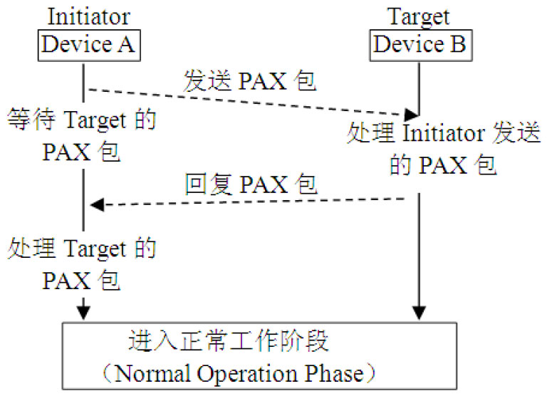

图8-12LinkActivation工作流程❑进入LinkActivation时，DeviceA和DeviceB将分别扮演Initiator和Target角色，参考资料[13]可用于确定谁来扮演Initiator或Target。

❑Initiator发送PAX数据包给Target。PAX全称为ParameterExchange，它用于在两个设备间交换彼此的LLC层配置信息（如协议版本等，详情见下文）​。

❑Target收到Initiator的PAX包后需要相应处理，例如判断协议版本是否匹配等。Target处理完后，它需要发送自己的LLC层配置信息给Initiator。

❑Initiator检查Target的LLC层配置参数，如果一切正常，双方LogicalLink成功建立，随后可进入正常工作阶段。

根据上述内容，双方需要通过PAX交换LLC层的配置信息。PAX属于LLCP数据包的一种，其格式如图8-13所示。

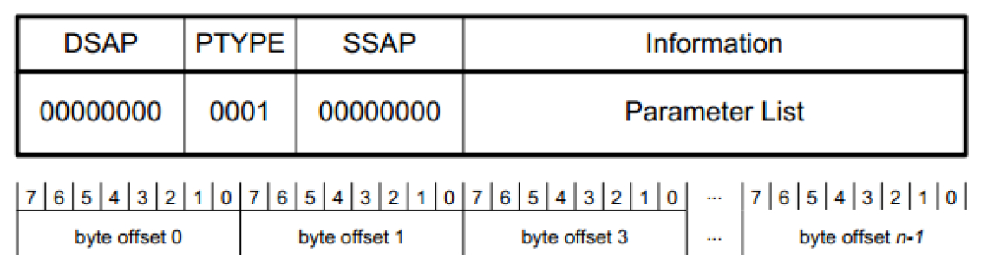

图8-13PAX数据包LLC层的配置信息保存在图8-13中的参数列表中，正常情况下PAX携带的参数信息及作用如表8-7所示。​（注意，并非所有参数都会包含在图8-13的参数列表中。​）

表8-7PAX参数说明

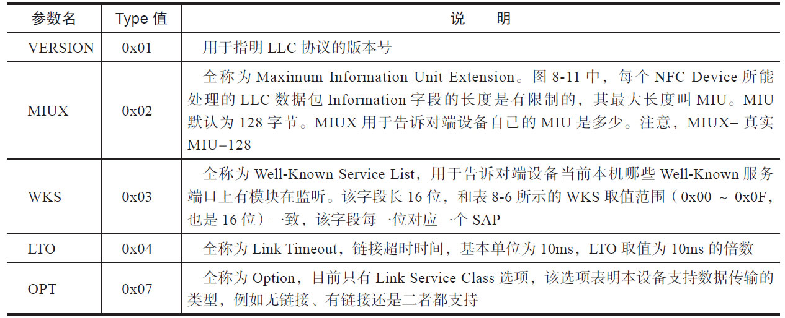

以上知识有一些细节需要读者注意。

❑当DeviceA和DeviceB进入有效距离后，LinkActivation将被触发，而DeviceA和B分开后，LinkDeactivation将被触发。从使用角度来看，LinkActivation/Deactivation可能会频繁被触发。

❑WKS用于告知本机设备哪些We-Known服务端口上有模块在监听。这表明在LinkActivation被触发前，使用者就必须在感兴趣的WKS端口上进行监听。这和笔者之前所认为的设备先进入LinkActivation，然后再监听WKS端口不同。以后分析Android平台中SNEP的代码时读者将看到相关的处理。

Link被激活后，DeviceA和DeviceB将先建立面向链接的关系，然后再开展数据交互，这一流程如图8-14所示。

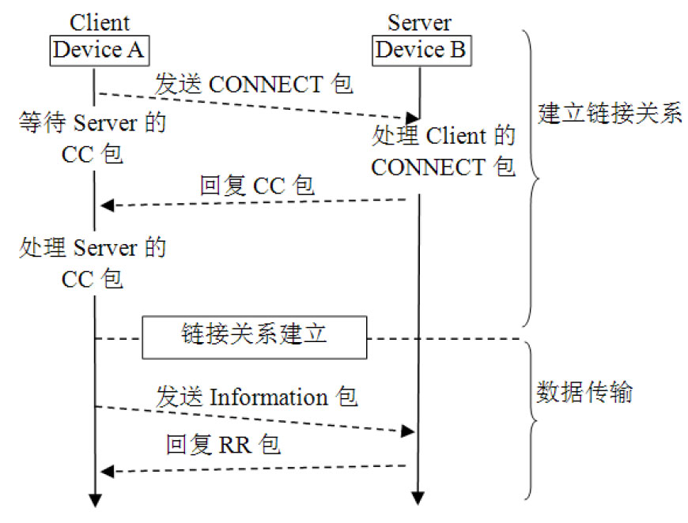

图8-14面向链接工作流程假设DeviceA扮演Client角色，DeviceB扮演Server角色。Client先通过CONNECT包向Server发起链接请求。CONNECT包对应的格式如图8-15所示。

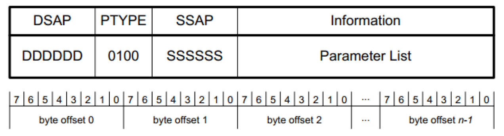

图8-15CONNECT包格式CONNECT包需要携带一些参数信息，常见的参数如表8-8所示。

表8-8CONNECT参数说明

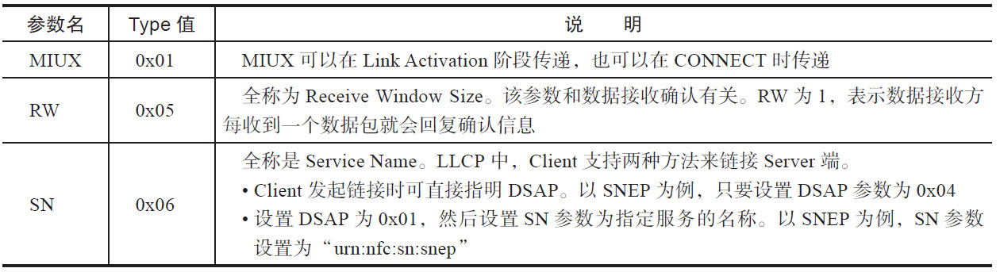

当服务器端成功处理CONNECT包后，它将回复CC（ConnectionComplete）包给客户端。如此，Client和Server就建立了链接关系。CC包内容非常简单，请读者自行研究参考资料[12]​。此后，Client和Server就可通过Information（规范中简称为I）包和RR（ReceiveReady）包来传输数据，其中：

❑I包用于承载具体的数据。

❑RR包用来确认接收方确实收到了数据。

I和RR包比较简单，这部分内容也请读者自行研究参考资料[12]​。

总体而言，LLCP比较简单，不过直接使用LLCP还是稍显复杂。所以，在LLCP基础上，NFCForum定义了SNEP协议用于在两个NFCDevice之间传输NDEF消息。下面来学习SNEP。

[14]2.SNEP介绍SNEP（SimpleNDEFExchangeProtocol）

支持在两个NFCDevice之间交换NDEF消息。SNEP是一种基于面向链接的数据传输协议，作为We-KnownService的一种，其服务端口号为0x04，服务名为"urn：nfc：sn：

snep"。

SNEP属于Request/Response方式，其工作过程如图8-16所示。

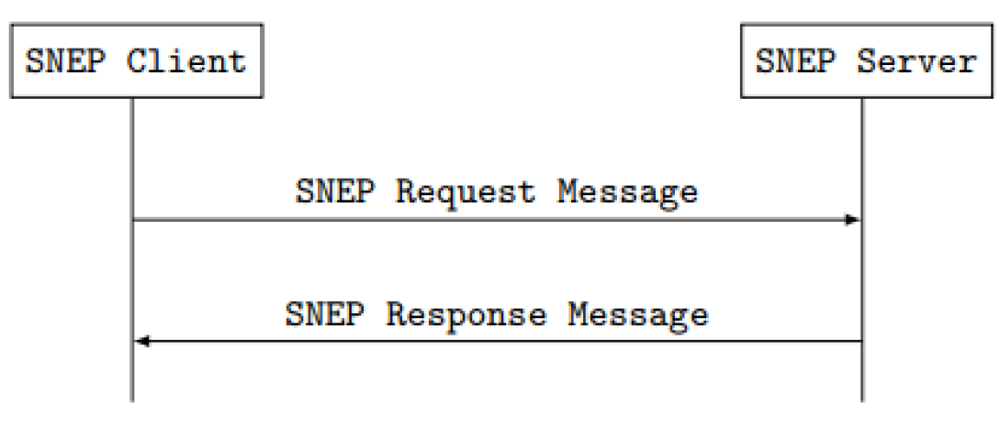

图8-16SNEP工作方式SNEP的工作流程非常简单，主要包括两个步骤。

1）SNEP客户端发送SENPRequest消息给服务端进行处理。

2）SNEP服务端回复SNEPResponse消息给客户端以告知处理结果。

SNEPRequest消息和Response消息的格式如图8-17所示。

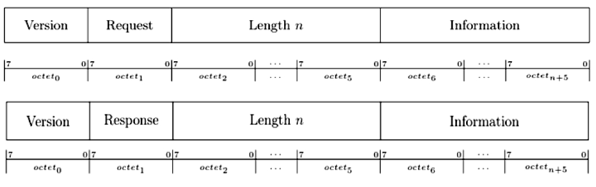

图8-17SNEPRequest/Response消息格式图8-17中，SNEPRequest/Response消息开头都是1字节的Version字段，Version字段之后分别是Request字段和Response字段。

Request字段表示请求类型，Response字段表示处理结果。

表8-9所示为SNEP当前支持的Request类型。

表8-9Request类型说明

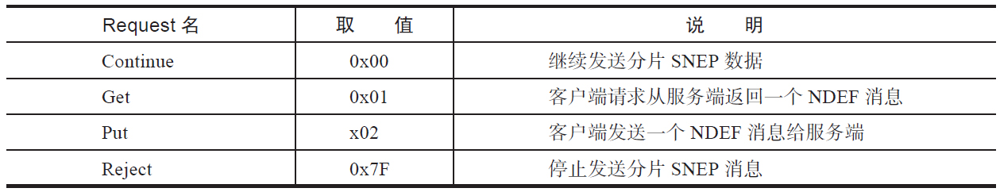

以SNEPPut请求消息为例，其对应的格式如图8-18所示。

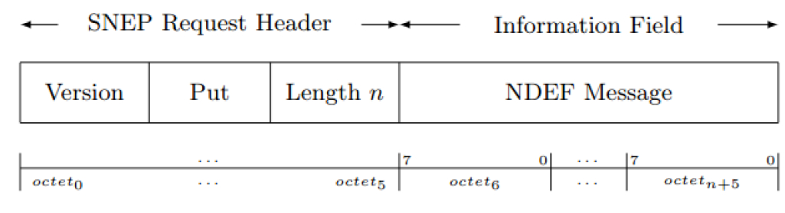

图8-18SNEPPut消息格式SNEP协议本身非常简单，此处不详细介绍，本章下文将结合代码来介绍Android中SNEP的实现。

至此，我们对NFCLLCP进行了相关介绍。这部分难度不大，读者需要重点掌握的部分包括LLCP协议本身，尤其是其数据封包格式、各种参数信息、常见SAP等。在LLCP基础上，读者可学习SNEP这种比较常用的协议。另外，读者还可在本节基础上自行学习ConnectionHandover，它是另外一种基于LLCP面向链接数据传输服务的协议。

提示以后在分析AndroidNFC模块代码时也会碰到ConnectionHandover，请读者自己来分析。

下面来看NFC运行模式中最后一种，即NFCCE（CardEmulation）模式。
