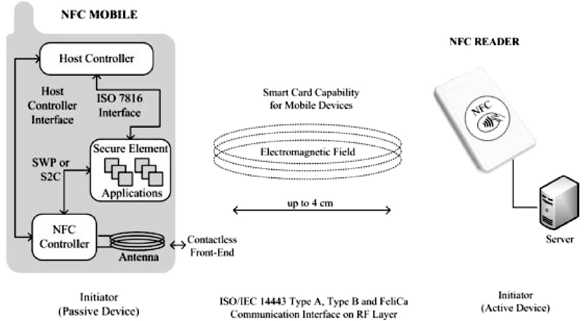
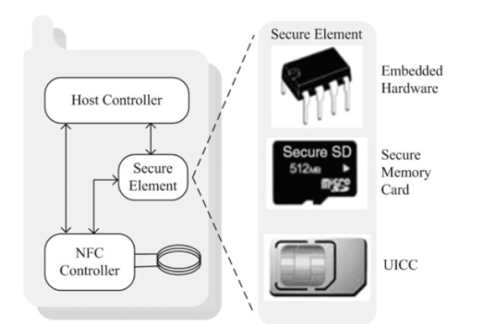
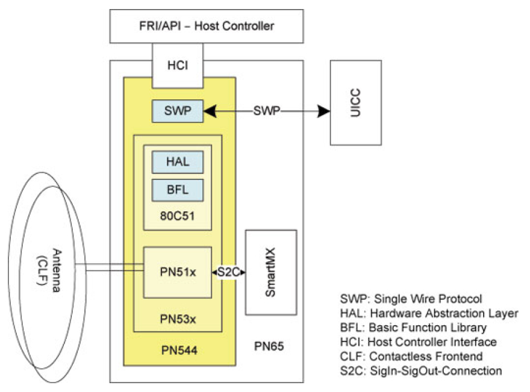
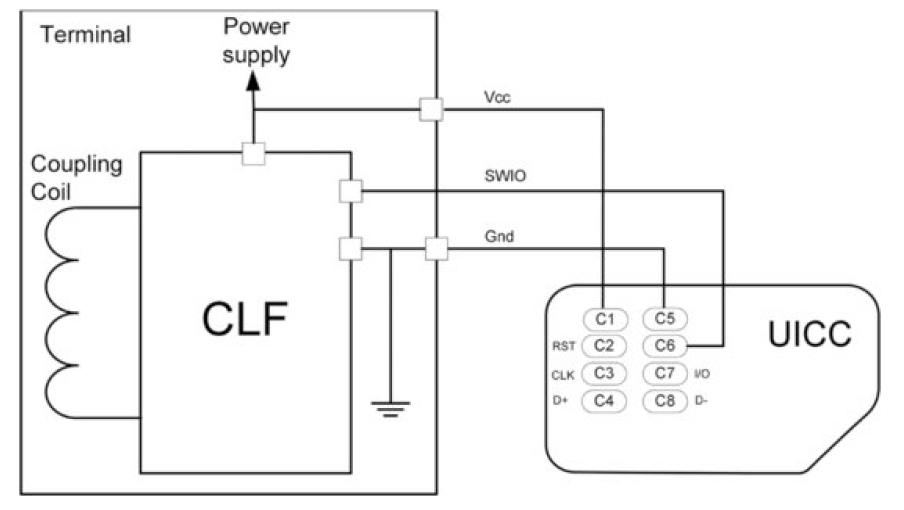

# 8.2.4 NFC CE运行模式[15][16]

[15]​[16]8.2.4NFCCE运行模式NFCCE运行模式使得携带NFC芯片的设备能充当智能卡（例如信用卡）使用。该运行模式所支持的应用场景极具吸引力，例如用支持该功能的Android智能手机来完成购票、支付，甚至充当门禁卡，汽车钥匙、公交卡等。

图8-19为CE运行模式示意图。

图8-19CE运行模式由图8-19可知，SE和NFC芯片（主要是指NFCControer，简称NFCC）通过SWP2（SingleWireProtocol）或者SC（SignalIn/SignalOutConnectionInterface，也叫NFCWiredInterface，简称NFC-WI）来交互。一般来说，SE上面运行了一些特殊的应用程序，NFC负责将数据通过2SWP或SC传递给SE中的应用来处理。

NFCC通过HCI协议和NFCMobile交互，而SE也可通过ISO7816协议和NFCMobile交互。

在CE模式中，NFCMobile被NFCReader识别成一个智能卡。NFCReader通过相关规范发送数据或控制命令给NFCMobile中的NFCC。

当NFCC收到数据或控制命令后，将交给相关的应用程序来处理。由于CE相关的应用场景

针对支付、门禁等这类对安全性要求非常高的情况，以Android手机NFC支付为例，一个完整的支付应用程序包括一个为用户提供操作界面的APK以及一些运行在安全性有绝对保障的SE中的应用程序。

图8-20SE和NFC的组合方式总之，SE在CE模式中扮演了非常重要的角❑SE为一个支付型SD卡，这种卡实际上是在色，目前SE和NFC的组合有三种方式，如图SD卡上嵌入了安全模块，相关应用可在这种8-20所示。这三种组合方式从上到下分别如卡上运行。该种组合方式所对应的方案也称为下。

NFC-SD方案，这方面的国际标准有ISO❑78S1E6为。一中个国嵌的入银式联安曾全经芯主片推，该过芯NF片C在-S手D卡机出支厂付前解就决已方经案安。装在其内部，而且无法被替换。

该芯片上运行着一个小系统能够处理支付或安❑SE为UICC，也就是常说的手机SIM卡，这全方面的工作。目前，这种形式的SE还没有种组合方式对应的方案也称为NFC-SIM方标准规范，可参考的模型有NXP公司的pn65案，目前由运营商主推。前面提到的北京市利[17]芯片模块示意（如图8-21所示）​。

用NFC手机充当一卡通所使用的方案就是NFC-SIM，它需要使用者先到移动运营商那换一个特殊的SIM卡。

图8-21中，NXP公司pn65NFC芯片自身就包含一个SecureElement，即图中的SmartMX模块，该模块中运行着一个名为JavaCardOS的操作系统。在JavaCardOS上，用户可以安装和运行一些应用程序（称为Applets）​。除了SmartMX内置的SE外，pn65也支持使用外部的SE，即图8-21中的UICC。

图8-21NXPpn65芯片模块提示从参考资料[18]和[19]来看，目前国际上大多使用NFC-SIM方案，而中国的运营商和银联也将联合推广它，其对应的商品名叫“闪付”​。

SE和NFC控制器连接所使用的S2C和SWP协议中，NFC-SIM方案将采用SWP，其对应的规范是ETSITS102613。NFC和UICC使用SWP的连接如图8-22所示。

图8-22CLF-UICC连线CLF（NFCContactlessFront-End缩写）和UICC通过三条线相连。Gnd接地，Vcc提供电源。SWIO为CLF和UICC的数据连接线，数据传输率在212kbps～1.6Mbps之间，每次传输的数据包小于30字节。

注意，图中UICC的电源由CLF来提供，而非直接由手机电源来提供。这种设计方案使得手机在电池耗尽的情况下，也可通过外部电磁感应（由NFCReader或其他NFC设备）来给CLF和UICC供电，从而确保支付请求不受手机本身的电源影响。

提示关于SWP的细节，读者可参考ETSITS102613。

NFCForum没有和CE相关的规范，所以读者先了解本节所述的知识，后文在NFCCE示例中将进一步介绍与之相关的内容。

至此，NFCDevice最后一种运行模式就介绍完毕，下面来介绍NFC理论知识的最后一部分，即NCI。
