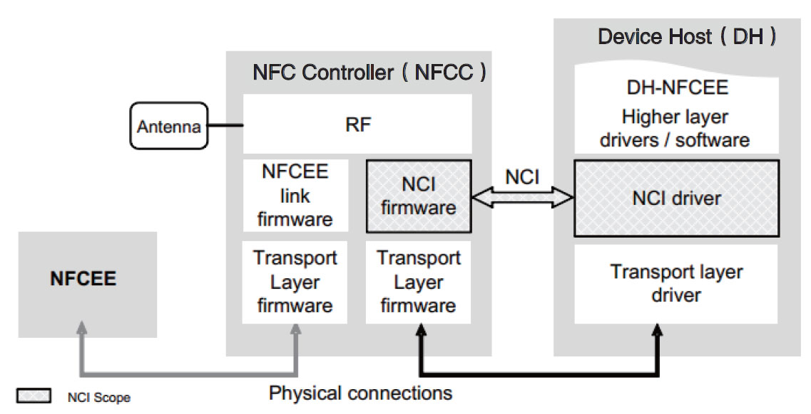
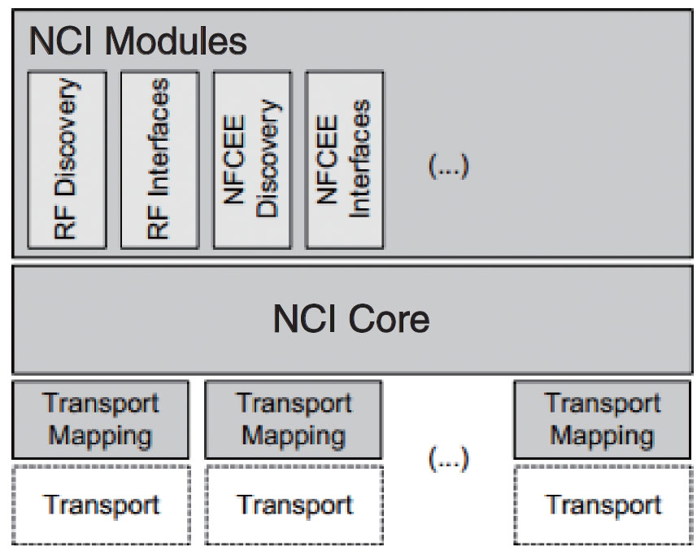
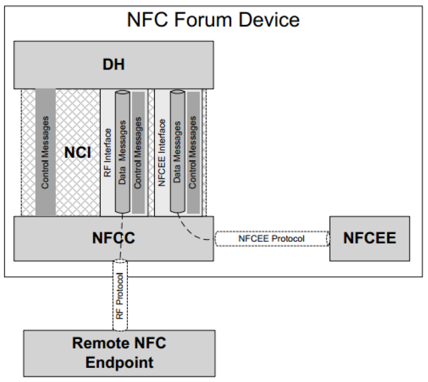
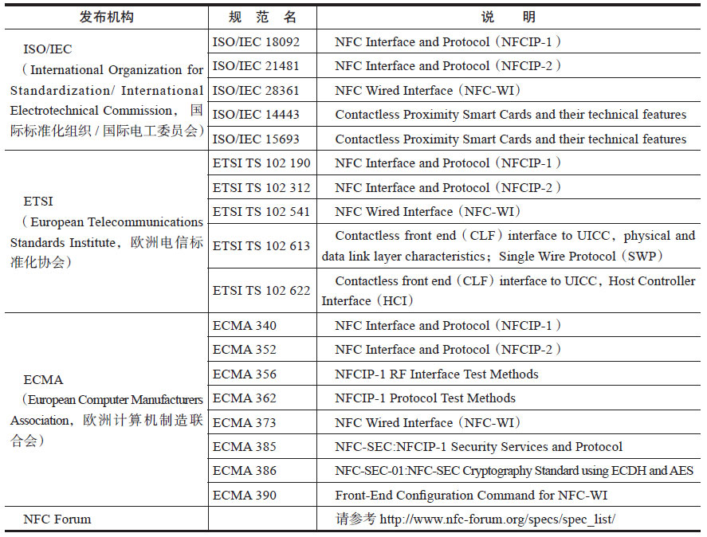

# 8.2.5 NCI原理[20]

[20]8.2.5NCI原理NCI（NFCControerInterface）是NFCForum于2012年制定的一个规范，其主要关注点为DH（DeviceHost，主机设备）如何控制并与NFCC（NFCControer）交互。图8-23所示为NFCC、NCI和DH三者之间的关系。

图8-23NFCC、NCI和DH三者之间的关系在图8-23中，NFCC和DH通过物理连线相连，物理连线对应为TransportLayer（传输层）​。目前，NFCC和DH在传输层这一块支2持SPI、IC、UART和USB等。

在图右边的DH中，所有和NFC相关的应用程序都可被视为DH-NFCEE（EE是ExecutionEnvironment的缩写）​。图左边有一个NFCEE模块，该模块也可运行着一些和NFC相关的程序或系统（以图8-21为例，它的SmartMXSecureElement就是此处所说的EE）​。NFCEE模块可直接集成在NFCC中，也可作为单独的芯片模块通过物理连线与NFCC相连。

NCI负责处理DH和NFCC之间的交互。NCI包含多个模块，详情见下文。图8-24所示为NCI的模块结构。

图8-24NCI模块结构❑NCICore模块负责DH和NFCC之间交互的基本功能，包括控制消息（ControlMessage）和数据消息（DataMessage）的传递、DH初始化、重置和配置NFCC等。

❑TransportMapping用于在NFCCore和传输层之间转换数据格式，例如将NCICore使用的控制消息和数据消息转换成对应传输层使用的数据格式。

❑NCIModule包含多个功能模块，例如RFDiscovery模块用于搜索周围的其他NFCDevice、RFInterface用于和对端的NFCDevice交互。

使用NCI的NFCDevice中，DH和NCI的工作原理如图8-25所示。

图8-25NCI工作原理图8-25中：

❑DH通过NCI规范定义的ControlMessage来控制NFCC。目前规范定义的ControlMessage包括Commands（请求命令，包括初始化NFCC、重置NFCC、设置NFCC配置参数等）​、Responses（回复）和Notifications（通知）​。这些Message都封装在NCIControlPackages中。其中，Commands只能由DH发送给NFCC。

❑DH通过RFInterface和对端NFC设备（图中的RemoteNFCEndpoint）交互，也可通过NFCEEInterface和本设备的NFCEE交互。

交互数据包括ControlMessage和DataMessage。

NCI规范一共有140多页，是NFCForum众多规范中比较复杂的一个。根据笔者的理解，NCI的一个很重要的作用就是统一Android中NFCHAL层的实现，即通过一套标准的方法来实现对NFCC的控制以及数据交互。不过，由于NCI规范推出的时间比较晚（该协议最终版的时间为2012年11月6日）​，所以占据最大市场份额的NXP公司在其Android平台的NFCHAL层中还没有使用NCI。

提示8.4节将专门讨论Android平台中NFCHAL层的实现状况。从Android4.2的代码来看，NXP公司使用了自己的一套NFCHAL层实现方式，而博通公司的NFCHAL层的实现参考了NCI规范。但实际上这两家公司NFCHAL层的代码处处透露着它们与特定芯片的紧密关系，这使不了解芯片细节的读者很难真正看懂NFCHAL层的代码。

随着NFC的重要性和普及程度日益加大，开[21]发者已经在LinuxKernel3.8中增加了一个名为NFC的子系统，它使得以后的NFCHAL层只需通过netlink消息就可和位于

Kernel空间的NFC驱动交互。因目前NFCHAL层这些被不同芯片所“绑架”的代码就可从用户空间移除，而那些和芯片相关的代码就可通过NFC驱动的形式运行在Kernel之内。
