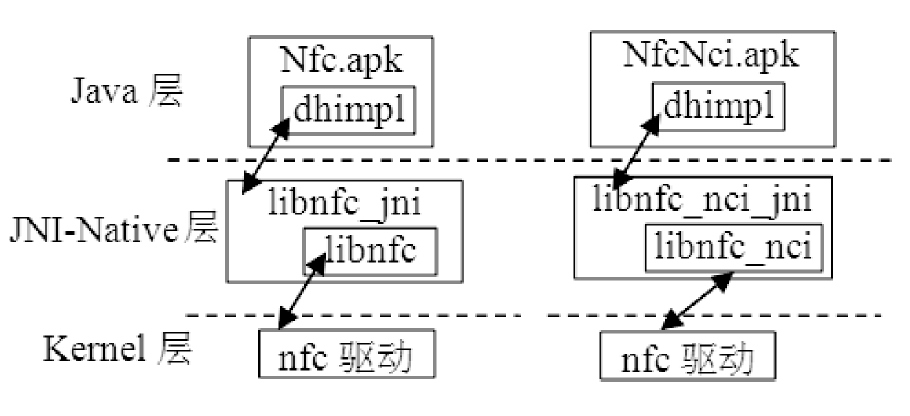

# 8.3 Android中的NFC

Android平台中，NFC系统模块运行在一个名为"com.android.nfc"的应用进程中，该应用程序的代码位于packages/apps/Nfc下。由于目前NFCHAL层的实现还没有统一接口，所以该应用程序对应的组织结构如图8-26所示。

图8-26Android平台中Nfc模块结构如果使用NXP公司pn系列的NFC芯片，则Nfc模块结构如左图所示，即最终的APK文件名为Nfc.apk，它通过packages/apps/Nfc/nxp目录下dhimpl模块与libnfc_jni以及libnfc这两个动态库交互。libnfc的代码位于external/libnfc-nxp目录下，由NXP公司提供以用于操作NXP公司的NFC芯片。

如果使用博通公司2079x系列的NFC芯片，则Nfc模块结构如右图所示，即最终的APK文件名为NfcNci.apk，它通过packages/apps/Nfc/nci目录下的dhimpl模块与libnfc_nci_jni以及libnfc_nci这两个动态库交互。libnfc_nci的代码位于external/libnfc-nci目录下，由博通公司提供以用于操作博通公司的NFC芯片。

提示图8-26所述的Nfc模块结构对应的Android系统版本为4.2，而Android4.1只支持NXP公司的芯片。

如果看过libnfc_jni或libnfc_nci_jni的代码，会发现它们分别使用了NXP和博通公司封装得用于和各自NFC芯片交互的API，代码可读性非常差。这种情况出现的原因正是前文所说当前LinuxKernel中还没有一种统一的方法让用户空间的进程和NFC驱动交互。当然，此问题有望通过完善NFCSubsystem和对应的netlink消息机制得以解决。

基于上述原因，本书不打算介绍任何与特定芯片平台结合过于紧密的模块。所以，本章分析重点将以图8-26中Nfc.apk为主，它包含了Android平台中NFC的一些核心知识。读者在掌握的基础上，可尝试结合pn544芯片的数据手册来自行分析dhimpl、libnfc-jni和libnfc。

下面将开始NFC代码分析之旅，包括两条分析路线。

❑先分析NFC相关的应用程序，从客户端角度介绍如何使用Android系统提供的NFC服务。

❑然后介绍Nfc.apk，展示NFC系统模块的核心内容。
