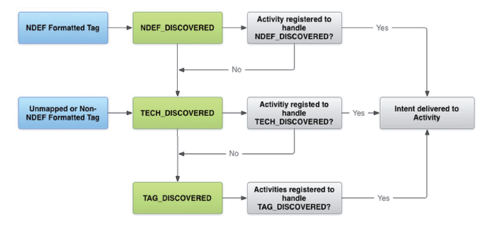
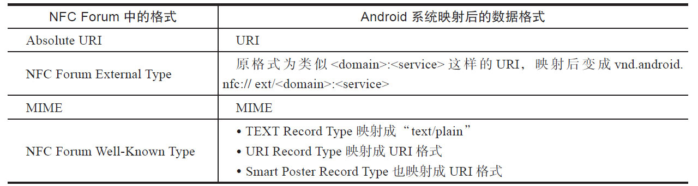
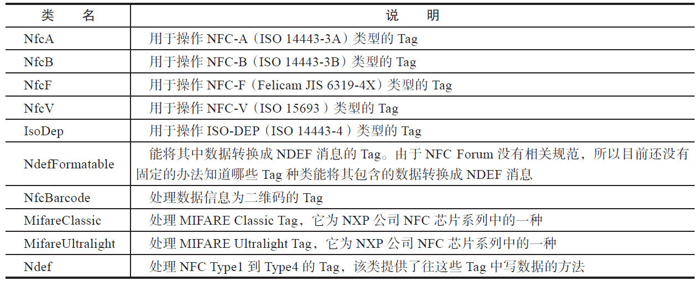
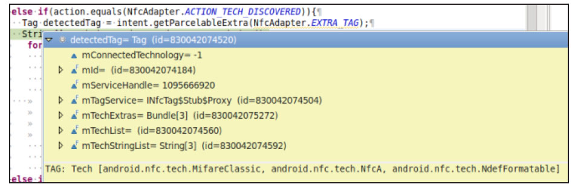
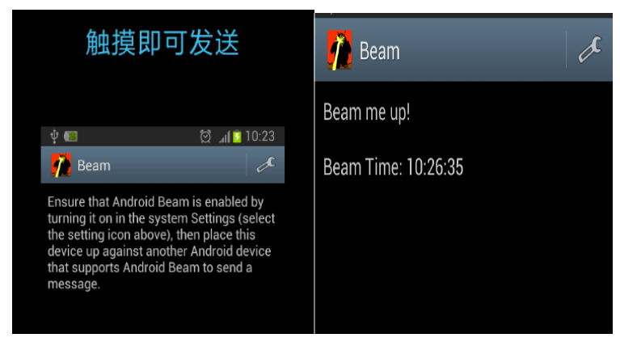
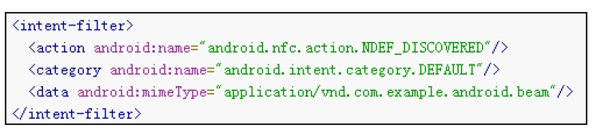
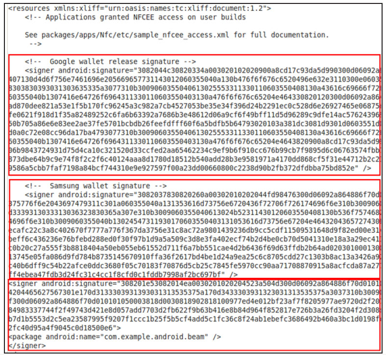

# 8.3.1 NFC应用示例


Android平台中，NFC应用的类型和NFC三种运行模式有关，我们先来看一个使用NFCR/W模式读取NFCTag的示例。

1.NFCR/W模式示例根据前文对NFC基础知识的介绍可知，和R/W模式相关的应用场景就是使用者利用NFC手机（充当NFCReader的角色）来读取目标NFCTag中的信息。Android平台为NFCR/W模式设计了“Tag分发系统”​（TagDispatchSystem）的机制，描述了NFC系统模块如何向应用进程分发与目标NFCTag相关的Intent（该Intent中包含了Tag中的数据或是一个代表目标NFCTag的Tag对象）​。

（1）NFCTag分发系统Tag分发系统的工作机制如图8-27所示。



图8-27Tag分发系统的工作机制Tag分发系统的工作机制如下。

1）当本机扫描到一个NFCTag后，NFC系统模块将首先尝试直接读取该Tag中的数据。

2）如果这些数据封装在NDEF消息中并且能映射成Android系统直接支持的数据类型（目前仅支持MIME和URI这两大类数据类型，详情见表8-11）​，则NFC系统模块将发送一个ACTION_NDEF_DISCOVERED的Intent给那些注册了对ACTION_NDEF_DISCOVERED通知感兴趣的Activity。如果找到目标Activity，则将此Intent（携带Tag中的NDEF消息和一个代表该NFCTag的Tag对象）派发给它。如果NFC系统模块没有找到目标Activity，则将尝试发送一个ACTION_TECH_DISCOVERED的Intent（包含一个代表目标NFCTag的Tag对象）​。

3）如果NFCTag中的数据不能转换成系统直接支持的类型，或者NFCTag中的数据没有使用NDEF消息格式或者没有目标Activity对ACTION_NDEF_DISCOVERED通知感兴趣，则NFC系统模块将发送一个ACTION_TECH_DISCOVERED的Intent（包含一个Tag对象）​。如果找到对该Intent感兴趣的Activity，则此Intent将派发给它。

4）如果没有Activity对ACTION_TECH_DISCOVERED感兴趣，则NFC系统模块将最后尝试发送一个ACTION_TAG_DICOVERED的Intent（包含一个Tag对象）​。如果有对ACTION_TAG_DISCOVERED感兴趣的Activity，则此Intent将派发给它。

上述的Tag分发系统看起来很复杂，实际上其核心内容可概况成三个步骤。

步骤1如果目标NFCTag包含了系统支持的NDEF消息，则NFC系统模块将直接把这个NDEF消息分发给感兴趣的Activity。如果有目标Activity，则直接分发给它，否则转步骤2。分支转换的判断标准是NFCTag是否包含了系统支持的NDEF消息以及同时是否有目标Activity注册了ACTION_NDEF_DISCOVERED通知。

步骤2如果目标NFCTag包含了系统不支持的NDEF消息或者步骤1中没有目标Activity，则NFC系统模块将尝试分发一个ACTION_TECH_DISCOVERED通知。NFC系统模块在分发此通知时，将首先分析目标NFCTag所支持的TagTechnology（它代表目标NFCTag所使用的技术，详情见下文分析）​，然后寻找注册了支持这些TagTechnology的目标Activity并将Intent分发给它。如果没有合适的目标Activity，则转入步骤3。

步骤3NFC系统模块将分发ACTION_TAG_DISCOVERED通知给注册了对该通知感兴趣的目标Activity。

除了Tag分发系统外，Android系统还有一个“前台分发系统”​（ForegroundDispatchSystem）​。其规则和Tag分发系统类似，二者区别主要集中在选择目标Activity上。

❑Tag分发系统中，Activity在其AndroidManifest.xml中设置Intent分发条件，即设置对应的IntentFilter。在这种分发系统中，不考虑目标Activity是否在前台还是后台。只要找到目标Activity，NFC系统就会启动它。

❑前台分发系统中，当前活跃（即所谓的前台）的Activity在其启动过程中设置Intent分发条件。如果NFCTag满足前台Activity设置的分发条件，NFC系统模块首先会把Intent分发给前台这个Activity。当该Activity退到后台时，它需要取消前台分发功能，即它不再是目标Activity。

简而言之，前台分发系统只检查当前显示的Activity是否满足分发条件，而Tag分发系统则会搜索系统内所有满足条件的Activity。

（2）Tag分发通知下面我们分别来看看这三个不同作用的Tag分发通知。

1）ACTION_NDEF_DISCOVERED：由上文可知，NFC系统模块首先尝试将NFCTag中的数据映射成系统直接支持的数据格式。表8-11列举了Android系统直接支持的NFCForum数据格式。

表8-11Android系统直接支持的NFCForum数据格式



由表8-11可知，如果NFCTag中数据格式能映射成功，则NFC系统模块将发送一个ACTION_NDEF_DISCOVEREDIntent给目前Activity，而该Intent将包含此NFCTag中的NDEF消息。

除了NFCForum定义的数据类型外，Android还新增了一个名为AAR（AndroidApplicationRecord）的数据类型，它其实是在一个NDEF的消息中封装了某个应用的package名。对AAR来说，分发系统的工作流程如下。

❑分发系统首先尝试使用IntentFilter来寻找目标Activity。如果和IntentFilter匹配的Activity同时和AAR匹配（即二者的package名一样）​，就启动该Activity。

❑如果Activity跟AAR不匹配，或者是有多个Activity能够处理该Intent，或者是没有能够处理该Intent的Activity，NFC系统模块将启动由AAR指定的应用程序。

❑如果系统中没有安装该AAR对应的应用程序，NFC系统模块将从GooglePlay下载该应用程序。

AAR的好处是能让某个公司部署的NFC标签只能由该公司开发的客户端（通过在NDEF中设置AAR）来处理。后文代码分析时候读者还将看到上述AAR的工作流程。

2）ACTION_TECH_DISCOVERED：如果系统不能映射NFCTag中的数据，我们该如何处理呢？

提示ACTION_TECH_DISCOVERED触发的另一个原因是没有Activity对ACTION_NDEF_DISCOVERED感兴趣。

该问题的直观答案就是应用程序自己去读取并解析Tag中的数据。不过，由于NFCTag的类型有四种之多，甚至同一个厂商还生产了基于不同底层协议的NFCTag，导致Android系统无法提供一种通用的接口来操作所有种类的NFCTag。为了解决此问题，Android提供了一个名为"android.nfc.tech"的Java包来帮助应用程序操作对应的NFCTag。表8-12为android.nfc.tech包中的几个重要成员类。

表8-12android.nfc.tech支持的Tag种类



NFC系统模块将在ACTION_TECH_DISCOVEREDIntent中携带一个Tag对象，应用程序可调用该Tag对象的getTechList来获取该Tag所使用的Technology。注意，一个Tag可能同时支持表8-12中多种Technology。例如图8-28所示为笔者测试北京市公交卡时所得到的TagTechnology信息。



图8-28北京市公交卡TagTechnology示例由图8-28可知，北京市公交卡同时支持MifareClassic、NfcA和NdefFormatable这三种类型的TagTechnology。应用程序接着可根据目标NFCTag所支持的TagTechnology来创建表8-12中的对象来和NFCTag交互。

特别注意严格来说，表8-12中所列的类不仅仅是用来读写对应类型的NFCTag，它还支持一些控制操作以至于能在NFCTag上实现一些特定的协议。以北京市公交卡为例，其内部肯定有一个相关的协议使得应用程序可通过这些协议来完成公交卡充值，付费等操作。​“小木公交”软件即可读取多个城市公交卡的信息，读者不妨下载试试。

3）ACTION_TAG_DISCOVERED：如果目标NFCTag不属于表8-12中的一种，则NFC系统模块将发送ACTION_TAG_DISCOVEREDIntent并携带一个Tag对象传递给感兴趣的Activity。Activity将根据Tag的ID（调用Tag的getId函数）或该Tag使用的技术（调用Tag的getTechList）来创建合适的处理对象。

下面通过一个示例来了解上述三种通知的用

```java
public class ForegroundDispatch extends Activity {// ForegroundDispatch是一个Activity
    ......// 定义一些成员变量
public void onCreate(Bundle savedState) {
    super.onCreate(savedState);
    // NFC客户端必须调用下面这个函数以获得一个NfcAdapter对象，该对象用于和NFC系统模块交互
    mAdapter = NfcAdapter.getDefaultAdapter(this);
    // 构造一个PendingIntent供NFC系统模块派发
    mPendingIntent = PendingIntent.getActivity(this, 0,
                  new Intent(this, getClass()).addFlags(Intent.FLAG_ACTIVITY_SINGLE_TOP), 0);
    // 监听ACTION_NDEF_DISOVERED通知，并且设置MIME类型为“*/*”
    // 对任何MIME类型的NDEF消息都感兴趣
    IntentFilter ndef = new IntentFilter(NfcAdapter.ACTION_NDEF_DISCOVERED);
    ndef.addDataType("*/*");
    // 我们同时还监听ACTION_TECH_DISSCOVERED和ACTION_TAG_DISCOVERED通知
    mFilters = new IntentFilter[] {
                  ndef,
                  new IntentFilter(NfcAdapter.ACTION_TECH_DISCOVERED),
                  new IntentFilter(NfcAdapter.ACTION_TAG_DISCOVERED),
        };
    // 对ACTION_TECH_DISCOVERED通知来说，还需要注册对哪些Tag Technology感兴趣
    mTechLists = new String[][] {
                new String[] { NfcF.class.getName() },// 假设本例支持NfcF
                new String[]{MifareClassic.class.getName()}};// 假设本例支持MifareClassic
    }
}
```

法。

（3）示例分析本节将通过一个前台分发示例来看看应用程序如何处理上述三种Intent。

[--＞ForegroundDispatch.java：​：

onCreate]在上述onCreate函数中，同时监听了三种TagIntent通知，最终效果如下。

❑如果目标Tag中包含MIME类型的NDEF消息，则Tag分发系统将给我们传递一个ACTION_NDEF_DISCOVEREDIntent。

❑如果目标Tag使用的TagTechnolog为NfcF或MifareClass，则Tag分发系统将给我们传递一个ACTION_TECH_DISCOVEREDIntent。

❑最后，Tag分发系统将不满足上述条件的其他所有Tag通过ACTION_TAG_DISCOVEREDIntent传递给我们。

接下来，由于本例使用了NFC的前台分发系统，故需要将onCreate中设置的配置信息传递给NFC系统模块，相关代码如下所示。

[--＞ForegroundDispatch.java：​：

onResume]

```java
public void onResume() {
   super.onResume();
   // 调用NfcAdapter的enableForegroundDispatch函数启动前台分发系统
   // 同时需要将分发条件传递给NFC系统模块
  mAdapter.enableForegroundDispatch(this, mPendingIntent,  mFilters,mTechLists);
}
```

当NFC系统模块扫描到一个NFCTag时，前台分发系统通过将触发ForegroundDispatch这

```java
public void onNewIntent(Intent intent) {
  String action = intent.getAction();
  // 处理ACTION_NDEF_DISCOVERED消息
  if(action.equals(NfcAdapter.ACTION_NDEF_DISCOVERED)){
    NdefMessage[] ndefMsgs = null;
    // 获取该Intent中的NdefMessage数组。绝大部分情况下该数组的长度为1
    NdefMessage[]  ndefMsgs = (NdefMessage[])intent.
                   getParcelableArrayExtra(NfcAdapter.EXTRA_NDEF_MESSAGES);
  }// 处理ACTION_TECH_DISCOVERED通知
  else if (action.equals(NfcAdapter.ACTION_TECH_DISCOVERED)){
    // 获取该Intent中的Tag对象
      Tag detectedTag = intent.getParcelableExtra(NfcAdapter.EXTRA_TAG);
      String[] techList = detectedTag. getTechList();// 获取该Tag使用的Technology
      for(String tech: techList){
           if(tech.equals(NfcF.class.getName())){// 假设该Tag支持NfcF
               // 创建NfcF对象和该Tag交互
               NfcF nfcF = NfcF.get(detectedTag);
               nfcF.connect();// 向目标Tag发起I/O操作前需要先连接上它
               ......// 调用NfcF类的其他函数，例如transceive向NFC Tag发送命令
               nfcF.close();// 关闭连接
        }......
      }
  }// 处理ACTION_TAG_DISCOVERED通知
  else if(action.equals(NfcAdapter.ACTION_TAG_DISCOVERED)){
      Tag tag = (Tag)intent.getParcelableExtra(NfcAdapter.EXTRA_TAG);
      String[] arry = tag.getTechList();
      ......// 根据Tag使用的Technology来构造相应的处理对象
  }
}
```

个Activity的onNewIntent函数，该函数的代码如下所示。

[--＞ForegroundDispatch.java：​：

onNewIntent]当ForegroundActivity退出时，需要在onPause函数中停止使用前台分发系统，相关代码如下所示。

```java
public void onPause() {
  super.onPause();
   mAdapter.disableForegroundDispatch(this);// 停止前台分发系统
}
```

通过上述介绍可知，在R/W模式中：

❑如果应用程序仅用于读取NFCTag中所包含的数据，则应尽量通过注册ACTION_NDEF_DISCOVERED通知来获取自己感兴趣的数据。

❑如果应用程序希望能和NFCTag交互以实现自己的一套协议或者希望能直接读写NFCTag，则可通过注册ACTION_TECH_DISCOVERED通知来获得代表NFCTag的Tag对象。应用程序接着要根据该Tag使用的Technology来构造对应的TagTechnology对象来操作此NFCTag。

❑如果应用程序处理的NFCTag不满足表8-12中的一种，则需要监听ACTION_TAG_DISCOVERED通知，然后再构造自己的TagTechnology对象来操作此NFCTag。

提示关于Android中NFC的分发系统，请读者阅读AndroidSDK关于NFC的介绍，相关资料位于hp://developer.android.com/guide/topics/connectivity/nfc/nfc.html。

2.NFCP2P模式示例Android平台中的NFCP2P模式使用了前文介绍的SNEP协议。在SNEP协议基础上，Android设计了"AndroidBeam"技术架构，该架构使得NFC客户端程序能非常容易得在两个NFC设备间传递NDEF消息。

提示除了SNEP外，Android还定义了一个与之类似的NPP（NdefPushProtocol）​，该协议对应的服务端SAP为0x10，服务名为"com.android.npp"。

AndroidBeam中，系统首先使用SNEP进行传输。如果一些老旧的设备不支持SNEP，则系统将使用NPP。

```html
public class Beam extends Activity implements // Beam是一个Activity
         CreateNdefMessageCallback,// 用于从源Activity中得到需要传递的NDEF消息
        OnNdefPushCompleteCallback // 用于通知NDEF消息传送完毕
{
    NfcAdapter mNfcAdapter;
    TextView mInfoText;
    private static final int MESSAGE_SENT = 1;
    public void onCreate(Bundle savedInstanceState) {
        super.onCreate(savedInstanceState);
        setContentView(R.layout.main);
        mInfoText = (TextView) findViewById(R.id.textView);
        // 得到一个NfcAdapter对象，用于和NFC系统模块交互
        mNfcAdapter = NfcAdapter.getDefaultAdapter(this);
        /*
        下面这两个函数调用非常重要。
        setNdefPushMessageCallback：设置一个回调对象。如果该回调对象不为空，则NFC系统模块将
        为Beam这个Activity启用Android Beam。该回调对象的作用是：当NFC系统模块通过SNEP协议
        发现另外一个NFC设备时，系统会弹出如图8-29所示的“数据发送通知框”。如果用户选择本机发送数据，
        则NFC系统模块将通过这个回调对象获取需要发送的数据。
        setOnNdefPushCompleteCallback：设置一个数据发送完毕通知回调对象，当NFC系统模块发送完
        本Activity所设置的NDEF消息时，该回调对象对应的函数将被调用。
        */
        mNfcAdapter.setNdefPushMessageCallback(this, this);
        mNfcAdapter.setOnNdefPushCompleteCallback(this, this);
}
```

和R/W模式一样，AndroidBeam的使用也需要绑定到一个Activity中，下面我们直接通过一个例子来看看如何使用AndroidBeam。

（1）发送端处理[--＞Beam.java：​：onCreate]如图8-29所示，左图为数据发送通知框。在Android平台中，两个互相靠近的NFC设备都会弹出类似左图这样的数据发送通知框。至于最终是谁来发送数据则需要用户点击触摸屏来决定。当对端设备收到示例Beam所发送的NDEF消息后，对端设备的NFC系统模块将解析该NDEF消息然后通过Tag分发系统或前台分发系统找到目标Activity。图8-29右图即为对端设备收到本例中Beam发送的数据后的处理结果。



图8-29Beam示例截图下面来看createNdefMessage函数，它实现了CreateNdefMessageCaback接口类。当用户在图8-29左图中点击触摸屏后，NFC系当本机NFC系统模块成功发送了NDEF消息统模块将通过该函数获取应用程序需要发送的后，onNdefPushComplete将被调用以通知NDEF消息，其代码如下所示。

数据发送的情况。在Beam示例中，该函数的代码如下所示。

[--＞Beam.java：​：createNdefMessage][--＞Beam.java：​：onNdefPushComplete]

```java
public NdefMessage createNdefMessage(NfcEvent event) {
  Time time = new Time();
  time.setToNow();
  // 设置一些信息
  String text = ("Beam me up!\n" +"Beam Time: " + time.format("%H:%M:%S"));
  // 构造一个MIME Type的NDEF消息
  NdefMessage msg = new NdefMessage(NdefRecord.createMime(
              "application/com.example.android.beam", text.getBytes()));
   return msg;
}
```

```java
public void onNdefPushComplete(NfcEvent arg0) {
    // 发送一个MESSAGE_SENT消息。注意，onNdefPushComplete运行在Binder线程
    mHandler.obtainMessage(MESSAGE_SENT).sendToTarget();
}
```

（2）接收端处理

```java
public void onNewIntent(Intent intent) {
    setIntent(intent);// Beam使用了SINGLE_TOP启动模式。setIntent用于保存Intent
}
// Beam启动时,onResume将被调用
 public void onResume() {
    super.onResume();
     if (NfcAdapter.ACTION_NDEF_DISCOVERED.equals(getIntent().getAction())) {
            processIntent(getIntent());// getIntent获取setIntent设置的那个Intent对象
     }
}
// 处理ACTION_NDEF_DISCOVERED通知
void processIntent(Intent intent) {
  // 取出对端Beam发送的NDEF消息
  Parcelable[] rawMsgs =
        intent.getParcelableArrayExtra(NfcAdapter.EXTRA_NDEF_MESSAGES);
   NdefMessage msg = (NdefMessage) rawMsgs[0];
  // 设置Text控件，最终结果如图8-29右图所示
   mInfoText.setText(new String(msg.getRecords()[0].getPayload()));
  }
```

当对端NFC设备接收到此NDEF消息时，将通过Tag分发系统来处理它。Beam示例在其AndroidManifest.xml设置了如图8-30所示的IntentFilter。



图8-30Beam设置的IntentFilter根据前文对Tag分发系统的介绍，对端设备的Beam将被启动。启动过程中几个重要函数的代码如下所示。

[--＞Beam.java：​：

onNewIntent/onResume/processIntent]至此，通过一个示例展示了NFC客户端程序如何使用AndroidBeam技术。AndroidBeam的本质是利用NFCP2P模式的SNEP协议在两个NFC设备间传递NDEF消息。除了NfcAdapter的setOnNdefPushCompleteCaback函数外，NfcAdapter还有其他方式能发送NDEF消息。关于这部分内容，请读者务必阅读SDK中的介绍（hp://developer.android.com/guide/topics/connectivity/nfc/nfc.html#p2p）​。

另外，AndroidBeam除了能发送NDEF消息外，它还支持发送URIScheme为"file"或"content"类型的数据，也就是文件或数据库中的内容。这些数据的量可能比较大，所以AndroidBeam将使用Handover并选择蓝牙来传输它们。

3.NFCCE模式示例在Android平台中，NFCCE的使用比较特殊，主要体现在两点。

❑AndroidSDK没有直接提供CardEmulation相关的API，但Android系统内部提供了一个名为"com.android.nfc_extras.jar"的Java动态库。在这个动态库中，Android封装了和CE相关的API。应用程序需要主动加载这个nfc_extras库才能使用CE模式。

❑由于CE通常用于支付等方面的工作，所以Android系统在nfc_extras动态库的使用上有着非常严格的权限管理。

下面介绍相关知识。

（1）nfc_extras和nfcee_access.xml根据上文所述，应用程序如何才能使用CE模式呢？我们先来看看如何在应用程序中使用nfc_extras动态库。图8-31所示的AndroidManifest.xml指明了必要的做法。

图8-31AndroidManifest.xml设置使用NFCCE的应用必须通过＜uses-permission＞标签申明"android.permission.NFC"权限。同时还需通过＜uses-library＞申明使用动态库"com.android.nfc_extras"。这样，当应用程序运行时，系统会为它加载com.android.nfc_extras.jar包。该包对应的文件位于/system/framework目录下。

接着，客户端在需要使用nfc_extrasAPI的Java类文件中通过import语句导入相关的类，如图8-32所示。

图8-32nfc_extras动态库相关类nfc_extras主要包含三个类，其用法将留待下节的示例代码中再来介绍。

客户端导入相关类后，下一步要解决的问题就是编译。由于AndroidSDK没有提供这些类，故需要手动解决编译问题。目前有两种方法解决。

一种方法是为应用程序编写Android.mk，然后添加以下内容。

```java
LOCAL_JAVA_LIBRARIES：=com.android.nfc_extras
```

该方法要求在Android源码下编译此应用程序。

另外一种方式是在Eclipse中为应用程序手动添加一个编译路径，如图8-33所示。

图8-33Eclipse设置编译路径图8-33中，笔者在测试示例中添加了nfc_extras动态库（即classes-fu-debug.jar，它是Android系统编译nfc_extras时生成的中间JAR文件包）​。

注意无论哪种方法，都需要有Android系统的源码。

通过上述步骤，应用程序可编译成功，但它此时依然没有权限操作NFCCE。这是因为在Android系统中，除了"android.permission.NFC"权限外，NFC系统模块针对NFCCE这种重要运行模式还需要检查另外一个权限，即客户端程序的签名信息。只有拥有系统指定签名的应用程序才能使用NFCCE模式。

Android系统所指定的签名信息都保存在/etc/nfcee_access.xml文件中，图8-34所示为GalaxyNote2中该文件的内容。



图8-34nfcee_access.xml示例图8-34中所示nfcee_access.xml包含三个签名（由signer标签指定，图中由黑框标示）​。

❑第一个签名为GoogleWaet相关应用拥有。

❑第二个签名为SamsungWaet相关应用拥有。

❑第三个签名为笔者测试时用的签名信息。

签名信息检查的工作流程如下。

1）客户端程序开展CE相关操作前，必须先获得一个NfcAdapterExtras对象。

2）在获取该对象时，NFC系统模块先检查应用程序是否拥有"android.permission.NFC"权限，接着检查该应用程序的签名信息。只有调用程序的签

```java
class NfcEEActivity extends Activity{
protected void onCreate(Bundle savedInstanceState) {
    super.onCreate(savedInstanceState);
    try {// 先从PackageManager那获取自己的签名信息
              PackageManager pm = getPackageManager();
              PackageInfo info = pm.getPackageInfo("com.example.android.beam",
                               PackageManager.GET_SIGNATURES);
              // 将签名信息打印出来，开发者需要将此签名信息保存到/etc/nfcee_access.xml中
              Log.e("NfcEE", "signature = " + info.signatures[0].toCharsString());
              mContext = this;
              // 调用NfcAdatperExtras.get函数获取一个NfcAdapterExtras对象
              mAdapterExtras = NfcAdapterExtras.get(NfcAdapter.getDefaultAdapter(
                                mContext));
              /*
              获取与NFC芯片中Execution Environment模块交互的对象。注意：此处的EE一般情况下就是指
              Secure Element。以图8-21 NXP pn65芯片模块图为例，SE可以是其内部的SmartMX模块，
              也可以是外部的UICC。对UICC来说，不是所有手机都支持将UICC连接到NFC芯片。除此之外，
              通过NFC操作UICC还需要相关驱动的支持。
              mEe的类型为NfcExecutionEnvironment，通过它可以和SE交互。
              */
              mEe = mAdapterExtras.getEmbeddedExecutionEnvironment();
    }......
     // 创建一个新的线程，相关测试工作放在此线程中进行
     Thread testThread = new Thread(){
        public void run() {
        /*
        使用CE模式前需要先设置Route，系统目前有ROUTE_ON_WHEN_SCREEN_ON（屏幕打开
        时启用CE）和ROUTE_OFF（关闭CE）这两种选项。
        */
        mAdapterExtras.setCardEmulationRoute(
               new CardEmulationRoute(CardEmulationRoute.ROUTE_ON_WHEN_SCREEN_ON, mEe));
        // 创建和SE交互的通道。该通道创建后，NFC其他功能将被禁止（如R/W或P2P）
        mEe.open();
        /*
        发送命令给EE去执行。SELECT_CARD_MANAGER_COMMAND存储了相关的命令信息。
        注意：EE命令的格式遵循ISO 7816-4规范。不同应用需要具体芯片的情况使用对应的命令，这部分是
        CE模式的难点。
        */
        byte[] out = mEe.transceive(SELECT_CARD_MANAGER_COMMAND);
        ......
         mEe.close();// 关闭与SE交互的通道
        // 关闭Card Emulation功能
        mAdapterExtras.setCardEmulationRoute(
                  new CardEmulationRoute(CardEmulationRoute.ROUTE_OFF, null));
        }
    };
    testThread.start(); // 启动工作线程
   }
  ......// 其他代码
}
```

名信息在nfcee_access.xml有记录，该应用才能得到一个NfcAdapterExtras对象。

提示显然，nfcee_access.xml要么由手机厂商在出厂前设置，要么在root的手机上修改。

了解上述知识后，通过一个示例来介绍nfc_extras相关的API及使用方法。

（2）示例分析本节使用的示例通过修改AndroidBeamDemo而来。

[--＞示例]从上述示例代码来看，nfc_extras的API似乎比较简单。但对一个实际应用程序而言，其最大难度却在于处理相关命令上。由于不同NFC芯片以及所使用的SE不同，其定义的命令也不尽相同。关于SE命令的格式，读者可参考ISO7816-4规范。

至此，我们对NFCCE进行了一些简单介绍，并围绕nfc_extras动态库的使用进行了相关讨论。根据笔者的研究，CE模式的内容远比R/W及P2P模式复杂。为此，强烈建议读者继续阅读参考资料[23]​、​[24]和[25]​。
