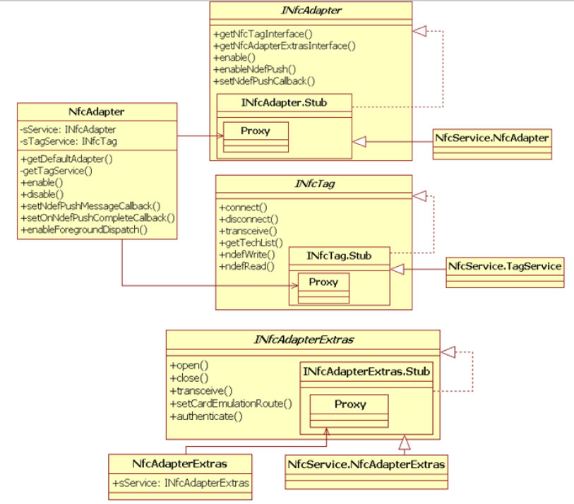
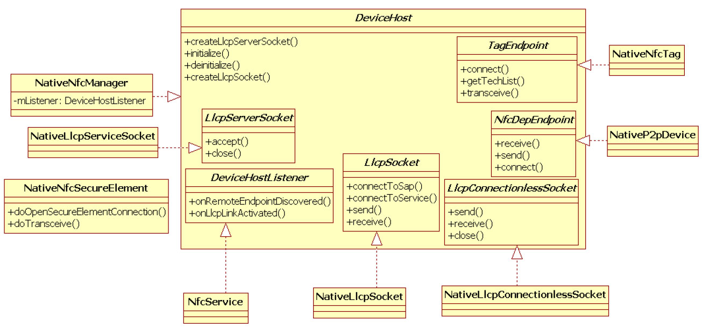
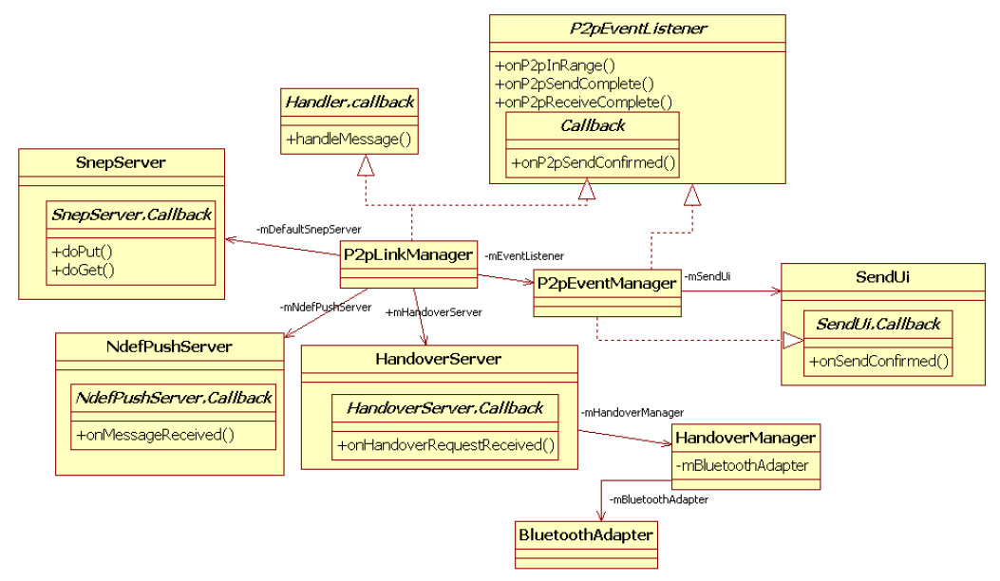
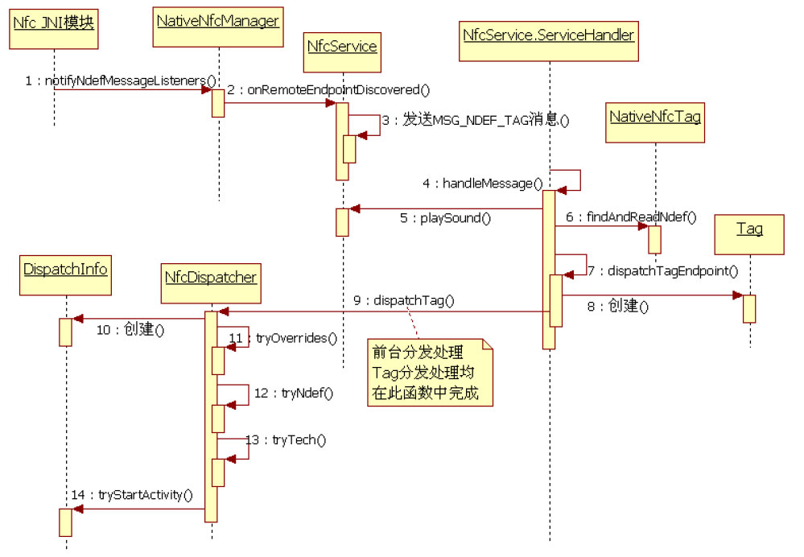
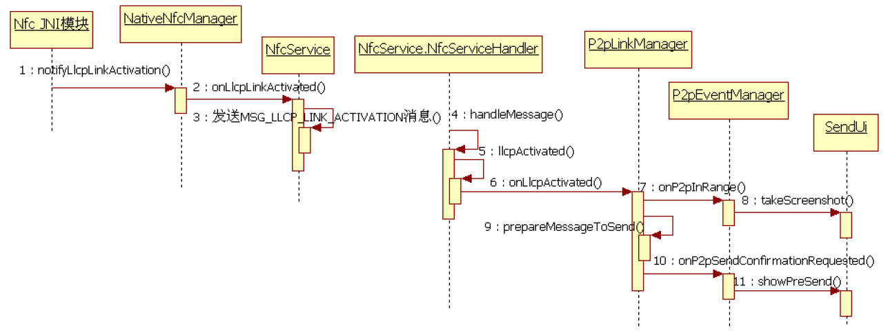
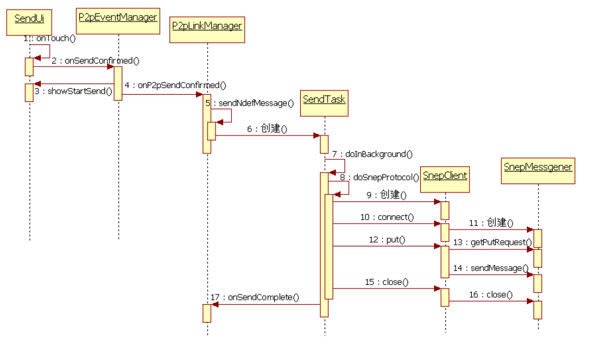
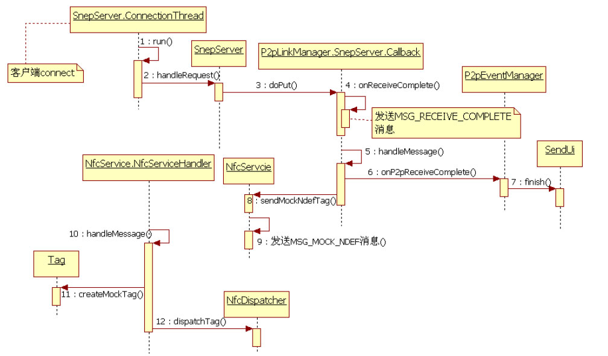

# 8.3.2 NFC系统模块


本节开始时介绍，Android平台中，NFC系统模块运行在com.android.nfc进程中，该进程对应的应用程序文件名为Nfc.apk。NFC系统模块包含的组件非常多，所以通过以下几条分析路线来介绍。

❑NFC系统模块的核心NfcService和一些重要成员的作用及之间的关系。

❑R/W模式下NFCTag的处理。

❑AndroidBeam的实现。

❑CE模式相关的处理。

1.NfcService介绍Nfc.apk源码中包含一个NfcApplication类。

```java
public NfcService(Application nfcApplication) {
  // NFC系统模块重要成员
  mNfcTagService = new TagService();// TagService用于和NFC Tag交互
  // NfcAdapterService用于和Android系统中其他使用NfcService的客户端交互
  mNfcAdapter = new NfcAdapterService();
  // NfcAdapterExtrasService用于和Android系统中使用Card Emulation模式的客户端交互
  mExtrasService = new NfcAdapterExtrasService();
  sService = this;  mContext = nfcApplication;
  // NativeNfcManager由dhimpl模块实现，用于和具体芯片厂商提供的NFC模块交互
  mDeviceHost = new NativeNfcManager(mContext, this);
  // HandoverManager处理Connection Handover工作
  HandoverManager handoverManager = new HandoverManager(mContext);
  // NfcDispatcher用于向客户端派发NFC Tag相关的通知
  mNfcDispatcher = new NfcDispatcher(mContext, handoverManager);
  // P2pLinkManager用于处理LLCP相关的工作
  mP2pLinkManager = new P2pLinkManager(mContext, handoverManager,
                    mDeviceHost.getDefaultLlcpMiu(),
                    mDeviceHost.getDefaultLlcpRwSize());
  // NativeNfcSecureElement用于和SE交互，它也由dhimpl模块实现
  mSecureElement = new NativeNfcSecureElement(mContext);
  mEeRoutingState = ROUTE_OFF;
  /*
  NfceeAccessControl用于判断哪些应用程序有权限操作NFCEE。它将读取/etc/nfcee_access.xml文件的
  内容。nfcee_access.xml内容比较简单，请参考Nfc目录下的etc/sample_nfcee_access.xml来学习。
  */
  mNfceeAccessControl = new NfceeAccessControl(mContext);
  ......
  // 向系统注册一个“nfc”服务。注意，SERVICE_NAME的值为“nfc”。该服务对应的对象为mNfcAdapter
  ServiceManager.addService(SERVICE_NAME, mNfcAdapter);
    /*
    注册广播事件监听对象。NfcService对屏幕状态、应用程序安装和卸载等广播事件感兴趣。这部分内容请读者
    自行研究。
    */
    ......
  // EnableDisableTask为一个AsyncTask，TASK_BOOT用于NfcService其他初始化工作
  new EnableDisableTask().execute(TASK_BOOT);
}
```

当该应用启动时，NfcApplication的onCreate函数将被调用。正是在这个onCreate函数中，NFC系统模块的核心成员NfcService得以创建。我们直接来看NfcService的构造函数。

[--＞NfcService.java：​：NfcService]由上述代码可知，NfcService在其构造函数



中，首先创建了NFC系统模块的几个核心成员。下文将详细介绍它们的作用及之间的关系。NfcService向Binder系统添加了一个名为"nfc"的服务，该服务对应的Binder对象为mNfcAdapter，类型为NfcAdapter。通过一个AysncTask（代码中的图8-35NfcAdapter、TagService及相关类EnableDisableTask）完成NfcService其他初成员结构图始化工作。

图8-35中，NfcAdapter包含一个类型为下面马上来看NFC系统模块核心成员。

INfcAdapter的sService成员变量，该变量通（1）NfcService核心成员过AndroidBinder机制来和NfcService内部类NfcAdapter的实例（即上述代码中的图8-35所示为NfcAdapter、TagService等相mAdapter）交互。NfcService内部的关成员的类信息。

NfcAdapter对象即是注册到Android系统服务中的那个名为"nfc"的Binder服务端对象。

NfcAdapter还包含一个类型为INfcTag的



sTagService成员变量，该变量通过AndroidBinder机制来和NfcService内部类TagService的实例（即上述代码中的mNfcTagService）交互。INfcTag接口封装图8-36NativeNfcManager和NfcService类了对Tag操作相关的函数。注意，前面所示的家族Nfc客户端示例中并没有直接使用INfcTag接AndroidNFC系统模块通过接口类口的地方，但表8-12所列的各种Tech类内部DeviceHost和其内部的接口类需要通过ITag接口来操作NFCTag。

LlcpServerSocket、DeviceHostListener、NfcAdapterExtras包含一个类型为LlcpSocket、LlcpConnectionlessSocket、INfcAdapterExtras的sService成员变量，也NfcDepEndpoint、TagEndpoint将NFC系统通过AndroidBinder机制来和NfcService内模块中和NFC芯片无关的处理逻辑，以及和芯部类NfcAdapterService的实例（即上述代码片相关的处理逻辑进行了有效解耦。图8-36中的mExtrasService）交互。

中以"Native"开头的类均定义在packages/app/Nfc/nxp目录下，所以它们和接着来看NfcService和NXP公司的NFC芯片相关。

NativeNfcManager，它们的类家族如图8-36所示。

DeviceHost接口中，DeviceHost类用于和底层NFC芯片交互，TagEndpoint用于和NFCTag交互，NfcDepEndpoint用于和P2P对端设备交互，LlcpSocket和LlcpServerSocket分别用于LLCP中有链接数据传输服务的客户端和服务器端，LlcpConnectionlessSocket用于LLCP中无连接数据传输服务。另外，DeviceHostListener也非常重要，它用于NativeNfcManager往NfcService传递NFC相关的通知事件。例如其中的onRemoteEndpointDiscovered代表搜索到一个NFCTag、onLlcpActivited代表本机和对端NFC设备进入LinkActivation（链路激活）阶段。

NativeNfcManager实现了DeviceHost接口，以NXP公司的NativeNfcManager为例，它将通过libnfc_jni及libnfc和NXP公司的NFC芯片交互。

NativeNfcSecureElement用来和SecureElement交互。

接下来要出场的是HandoverManager以及P2pLinkManager，它们的家族关系如图8-37所示。



图8-37P2pLinkManager家族关系图8-37所示的P2pLinkManager家族关系非常复杂，图中的各成员说明如下。

❑P2pLinkManager包含三个和传输相关的Server，分别是SnepServer、NdefPushServer以及HandoverServer。每一个Server都定义了相关的回调接口类（如SnepServer.caback）​，这些回调接口类的实现均由P2pLinkManager的内部类来实现。

❑HandoverServer负责处理NFCConnectionHandover协议，而具体的数据传输则由HandoverManager来实现。由图中HandoverMangar的mBluetoothAdapter可知，Android默认使用蓝牙来传输数据（提示：这部分内容请读者学完本章后自行研究）​。

❑P2pEventManager用于处理NFCP2P中和用户交互相关的逻辑。例如当搜索到一个P2P设备时，手机将会震动并发出提示音。

SendUi实现了类似图8-29左图的界面及用户触摸事件处理。在Android平台中，当两个设

```
boolean enableInternal() {
    ......
    // 启动一个WatchDog线程用来监视NFC底层操作是否超时
    WatchDogThread watchDog = new WatchDogThread("enableInternal",
                              INIT_WATCHDOG_MS);
    watchDog.start();
    try {
              mRoutingWakeLock.acquire();
              try {
                      // 初始化NFC底层模块，这部分内容请读者自行阅读
                      if (!mDeviceHost.initialize()) {......}
                  } finally {
                  mRoutingWakeLock.release();
                  }
              } finally {
                  watchDog.cancel();
              }
              synchronized(NfcService.this) {
                  mObjectMap.clear();
                  //  mIsNdefPushEnabled判断是否启用NPP协议，可在Settings中设置
                  mP2pLinkManager.enableDisable(mIsNdefPushEnabled, true);
                  updateState(NfcAdapter.STATE_ON);
              }
              initSoundPool();// 创建SoundPool，用于播放NFC相关事件的通知音
              applyRouting(true);// 启动NFC Polling流程，一旦搜索到周围的NFC设备，相关回调将被调用
              return true;
}
```

备LLCP链路被激活时，SendUi将显示出来。

其界面组成部分包括两个部分，一个是SendUi界面显示之前手机的截屏图像，另外一个是“触摸即可发送”的文本提示信息。当用户触摸SendUi界面时，数据将被发送出去。

（2）enableInternal函数介绍完NfcService的几个核心成员后，马上来看NfcService构造函数中最后创建的EnableDisableTask，由于设置了参数为TASK_BOOT，故最终被执行的函数为enableInternal。

[--＞NfcService.java：​：

EnableDisableTask：enableInternal]

```java
public void enableDisable(boolean sendEnable, boolean receiveEnable) {
        synchronized (this) {// 假设参数sendEnable和receiveEnable为true
        if (!mIsReceiveEnabled && receiveEnable) {
             /*
             启动SnepServer、NdefPushServer和HandoverServer。
             下面这三个成员变量均在P2pLinkManager的构造函数中被创建，这部分内容请读者自行阅读
             本章将只分析SnepServer。
             */
             mDefaultSnepServer.start();
             mNdefPushServer.start();
             mHandoverServer.start();
             if (mEchoServer != null) // EchoServer用于测试，以后代码分析将忽略它
                    mHandler.sendEmptyMessage(MSG_START_ECHOSERVER);
        }......
        mIsSendEnabled = sendEnable;
        mIsReceiveEnabled = receiveEnable;
    }
}
```

我们重点关注上面代码中和P2pLinkManager相关的enableDisable函数，其代码如下所示。

[--＞P2pLinkManager.java：​：

enableDisable]

```java
public void run() {// 注意：为了方便阅读，此处代码省略了synchronized和try/catch等一些代码逻辑
      boolean threadRunning;
      threadRunning = mThreadRunning;
      while (threadRunning) {
          // 创建一个LlcpServerSocket，其中mServiceSap值为0x04，mServiceName为“urn:nfc:sn:sne”
          // mMiu和mRwSize为本机NFC LLCP层的MIU和RW大小。1024为内部缓冲区大小，单位为字节
           mServerSocket = NfcService.getInstance().createLlcpServerSocket(mServiceSap,
                                   mServiceName, mMiu, mRwSize, 1024);
           LlcpServerSocket serverSocket;
          serverSocket = mServerSocket;
          // 等待客户端的链接
          LlcpSocket communicationSocket = serverSocket.accept();
          if (communicationSocket != null) {
               // 获取客户端设备的MIU
               int miu = communicationSocket.getRemoteMiu();
               /*
               判断分片大小。mFragmentLength默认为-1。MIU非常重要。例如本机的MIU为1024，而
               对端设备的MIU为512，那么本机在向对端发送数据时，每次发送的数据不能超过对端
               MIU即512字节。
               */
               int fragmentLength = (mFragmentLength == -1) ?
                                    miu : Math.min(miu, mFragmentLength);
               // 每一个连接成功的客户端对应一个ConnectionThread，其内容留待下文详细分析
               new ConnectionThread(communicationSocket, fragmentLength).start();
          }
      }
    mServerSocket.close();
  }
}
```

（3）SnepServer的start函数SnepServer的start函数将创建一个ServerThread线程对象，其run函数代码如下所示。

[--＞SnepServer.java：​：ServerThread：

run]NfcService初始化完毕后，手机中的NFC模块就进入工作状态，一旦有Tag或其他设备进入其有效距离，NFC模块即可开展相关工作。

下面先来分析NFCTag的处理流程。

2.NFCTag处理流程分析

```java
private void notifyNdefMessageListeners(NativeNfcTag tag) {
  /*
  mListener指向NfcService，它实现了DeviceHostListener接口。
  注意，notifyNdefMessageListeners的参数类型为NativeNfcTag，tag对象由jni层直接创建
  并返回给Java层。
  */
  mListener.onRemoteEndpointDiscovered(tag);
}
```

（1）notifyNdefMessageListeners流程当NFC设备检测到一个NFCTag时，上述代码中，mListener指向NfcService，它NativeNfcManager的的onRemoteEndPointDiscovered函数代码notifyNdefMessageListeners函数将被调用如下所示。

（由libnfc_jni在JNI层调用）​，其代码如下所示。

[--＞NfcService.java：​：

onRemoteEndpointDiscovered][--＞NativeNfcManager.java：​：

notifyNdefMessageListeners]

```java
public void onRemoteEndpointDiscovered(TagEndpoint tag) {
    // 注意，onRemoteEndpointDiscovered的参数类型是TagEndpoint
    // 由图8-36可知，NativeNfcTag实现了该接口
    sendMessage(NfcService.MSG_NDEF_TAG, tag);// 发送一个MSG_NDEF_TAG消息
}
```

NfcService的

```java
final class NfcServiceHandler extends Handler {
    public void handleMessage(Message msg) {
        switch (msg.what) {
          ......// 其他消息处理
            case MSG_NDEF_TAG:
              TagEndpoint tag = (TagEndpoint) msg.obj;
              playSound(SOUND_START);// 播放一个通知音
              /*
              从该NFC Tag中读取NDEF消息，NativeNfcTag的findAndReadNdef比较复杂，
              其大体工作流程是尝试用该Tag支持的Technology来读取其中的内容。
              */
              NdefMessage ndefMsg = tag.findAndReadNdef();
            // 注意下面这段代码，无论ndefMsg是否为空，dispatchTagEndpoint都会被调用
            if (ndefMsg != null) {
                  tag.startPresenceChecking();// 检测目标Tag是否还在有效距离内
                  dispatchTagEndpoint(tag);// 重要函数，详情见下节
            } else {
                if (tag.reconnect()) {// 重新链接到此NFC Tag
                     tag.startPresenceChecking();
                      dispatchTagEndpoint(tag);
                }......
            }
          break;
          ......
    }
}
```

onRemoteEndpointDiscovered将给自己发送一个MSG_NDEF_TAG消息。NfcService内部有一个NfcServiceHandler专门用来处理这些消息。其处理函数如下所示。

[--＞NfcService.java：​：

NfcServiceHandler：handleMessage]由上述代码可知，NfcService先调用

```java
private void dispatchTagEndpoint(TagEndpoint tagEndpoint) {
    // 构造一个Tag对象。前面的示例中已经见过Tag。对客户端来说，它代表目标NFC Tag
    Tag tag = new Tag(tagEndpoint.getUid(), tagEndpoint.getTechList(),
           tagEndpoint.getTechExtras(), tagEndpoint.getHandle(), mNfcTagService);
    registerTagObject(tagEndpoint);// 保存此tagEndpoint对象
    // mNfcDispatcher的类型是NfcDispather，调用它的dispatchTag函数来分发Tag
    if (!mNfcDispatcher.dispatchTag(tag)) {......}
```

```java
public boolean dispatchTag(Tag tag) {
  NdefMessage message = null;
  Ndef ndef = Ndef.get(tag);// 构造一个Ndef对象，Ndef属于Tag Technology的一种
   /*
   从Ndef获取目标Tag中的NDEF消息。如果目标Tag中保存的是系统支持的NDEF消息，则message不为空。
   特别注意：在前面代码中见到的findAndReadNdef函数内部已经根据表8-11进行了相关处理。
   */
  if (ndef != null) message = ndef.getCachedNdefMessage();
  PendingIntent overrideIntent;
  IntentFilter[] overrideFilters;
  String[][] overrideTechLists;
  // ①构造一个DispatchInfo对象，该对象内部有一个用来触发Activity的Intent
  DispatchInfo dispatch = new DispatchInfo(mContext, tag, message);
  synchronized (this) {
       // 下面三个变量由前台分发系统相关的NfcAdapter enableForegroundDispatch函数设置
       overrideFilters = mOverrideFilters;
       overrideIntent = mOverrideIntent;
       overrideTechLists = mOverrideTechLists;
  }
  // 恢复App Switch，详情可参考《深入理解Android：卷Ⅱ》6.3.3节关于resume/stopAppSwitches的介绍
  resumeAppSwitches();
  // 如果前台Activity启用了前台分发功能，则只需要处理前台分发相关工作即可
  if (tryOverrides(dispatch, tag, message, overrideIntent,
           overrideFilters, overrideTechLists)) return true;
  // 处理Handover事件
  if (mHandoverManager.tryHandover(message))  return true;
  // ②下面是Tag分发系统的处理，首先处理ACTION_NDEF_DISCOVERED
  if (tryNdef(dispatch, message)) return true;
  // 如果tryNdef处理失败，则接着处理ACTION_TECH_DISCOVERED
  if (tryTech(dispatch, tag)) return true;
  // 如图tryTech处理失败，则处理ACTION_TAG_DISCOVERED
  // 设置DispatchInfo对象的内部Intent对应的ACTION为ACTION_TAG_DISCOVERED
    dispatch.setTagIntent();
  // 首先从PackageManagerService查询对ACTION_TAG_DICOVERED感兴趣的Activity，如果有则启动它
  if (dispatch.tryStartActivity())  return true;
  return false;
}
```

TagEndpoint的findAndReadNdef函数来读取Tag中的数据，然后NfcService将调用dispatchTagEndpoint做进一步处理。

提示findAndReadNdef的实现和具体的NFC芯片有关，而NXP公司的实现函数在NativeNfcTag类中，内容比较复杂，感兴趣的读者可以阅读。

（2）dispatchTagEndpoint流程[--＞NfcDispatcher.java：​：dispatchTag]代码如下。

[--＞NfcService.java：​：

NfcServiceHandler.dispatchTagEndpoint]

```java
public DispatchInfo(Context context, Tag tag, NdefMessage message) {
    // 这个Intent的内容将派发给NFC的客户端
    intent = new Intent();
    /*
    不论最终Intent的Action是什么，NFC系统模块都会将tag对象和tag的ID包含在Intent中传递
    给客户端。
    */
    intent.putExtra(NfcAdapter.EXTRA_TAG, tag);
    intent.putExtra(NfcAdapter.EXTRA_ID, tag.getId());
    // 如果NDEF消息不为空，则把它也保存在Intent中
    if (message != null) {
        intent.putExtra(NfcAdapter.EXTRA_NDEF_MESSAGES, new NdefMessage[] {message});
        ndefUri = message.getRecords()[0].toUri();
        ndefMimeType = message.getRecords()[0].toMimeType();
    } else {
        ndefUri = null;
        ndefMimeType = null;
    }
    /*
    rootIntent用来启动目标Activity。NfcRootActivity是Nfc.apk中定义的一个Activity。
    目标Activity启动的过程如下。NFC系统模块先启动NfcRootActivity，然后再由NfcRootActivity
    启动目标Activity。由于NfcRootActivity设置了启动标志（FLAG_ACTIVITY_NEW_TASK和
    FLAG_ACTIVITY_CLEAR_TASK）,所以目标Activity将单独运行在一个Task中。关于ActivityManager
    这部内容，感兴趣的读者可阅读《深入理解Android：卷Ⅱ》第6章。
    */
    rootIntent = new Intent(context, NfcRootActivity.class);
    // 将Intent信息保存到rootIntent中。
    rootIntent.putExtra(NfcRootActivity.EXTRA_LAUNCH_INTENT, intent);
    rootIntent.setFlags(Intent.FLAG_ACTIVITY_NEW_TASK |
                                         Intent.FLAG_ACTIVITY_CLEAR_TASK);
    this.context = context;
    packageManager = context.getPackageManager();
}
```

上述代码中有①②两个重要函数，我们先来看第一个。

[--＞NfcDispatcher.java：​：DispatchInfo构造函数]

```java
boolean tryNdef(DispatchInfo dispatch, NdefMessage message) {
    if (message == null) return false;
    /* setNdefIntent:
     设置Dispatcher内部intent对象的Action为ACTION_NDEF_DISCOVERED。
     如果Dispatch对象的ndefUri和ndefMimeType都为null，则函数返回null。
    */
     Intent intent = dispatch.setNdefIntent();
     if (intent == null) return false;
     // 如果message中包含了AAR信息，则取出它们。AAR信息就是应用程序的包名
     List＜String＞ aarPackages = extractAarPackages(message);
     for (String pkg : aarPackages) {
          dispatch.intent.setPackage(pkg);
          /*
          tryStartActivity先检查目标Activity是否存在以及目标Activity的IntenFiltert
          是否匹配intent。注意，下面这个tryStartActivity没有参数。
          */
          if (dispatch.tryStartActivity()) return true;
     }
     // 上面代码对目标Activity进行了精确匹配，如果没有找到，则尝试启动AAR指定的应用程序
     if (aarPackages.size() ＞ 0) {
         String firstPackage = aarPackages.get(0);
         PackageManager pm;
         /*
         下面这段代码用于启动目标应用程序的某个Activity，由于AAR只是指定了应用程序的包名而没有指定
         Activity，所以getLaunchIntentForPackage将先检查目标应用程序中是否有Activity的Category
         为CATEGORY_INFO或CATEGORY_LAUNCHER，如果有则启动它。
         */
         UserHandle currentUser = new UserHandle(ActivityManager.getCurrentUser());
         pm = mContext.createPackageContextAsUser("android", 0,
                         currentUser).getPackageManager();
         Intent appLaunchIntent = pm.getLaunchIntentForPackage(firstPackage);
         if (appLaunchIntent != null && dispatch.tryStartActivity(appLaunchIntent))
               return true;
         /*
         如果上述处理失败，则获得能启动应用市场去下载某个应用程序的的Intent，该Intent的
         Data字段取值为“market:// details?id=应用程序包名”。
         */
         Intent marketIntent = getAppSearchIntent(firstPackage);
         if (marketIntent != null && dispatch.tryStartActivity(marketIntent))
            return true;
         }
    // 处理没有AAR的NDEF消息
    dispatch.intent.setPackage(null);
    if (dispatch.tryStartActivity()) return true;
        return false;
}
```

接着来看第二个关键函数tryNdef，代码如下所示。

[--＞NfcDispatcher.java：​：tryNdef]（3）NFCTag处理流程总结NFCTag的处理流程还算简单，下面总结其中涉及的重要函数调用，如图8-38所示。



图8-38NFCTag处理流程NFCTag的处理流程比较简单，其中有的代码逻辑比较复杂，这部分内容主要集中在NativeNfcTag的findAndReadNdef函数中。

它和具体NFC芯片厂商的实现有关，故把它留给感兴趣的读者自己来研究。

下面我们将研究AndroidBeam的工作流程。

3.AndroidBeam工作流程分析当本机检测到某个NFC设备进入有效距离并且能处理LLCP协议后，将通过notifyLlcpLinkActivation通知我们。本节就从这个函数开始分析。

（1）notifyLlcpLinkActivation流程notifyLlcpLinkActivation代码如下所示。

[--＞NativeNfcManager.java：​：

notifyLlcpLinkActivation]

```java
private void notifyLlcpLinkActivation(NativeP2pDevice device) {
    // mListener指向NfcService
    // 它的onLlcpLinkActivated函数将发送一个MSG_LLCP_LINK_ACTIVATION消息
    mListener.onLlcpLinkActivated(device);
}
```

MSG_LLCP_LINK_ACTIVATION消息由NfcService的内部类NfcServiceHandler处

```java
private boolean llcpActivated(NfcDepEndpoint device) {
  /*
  NfcDepEndpoint代表对端设备，其真实类型是NativeP2pDevice。不论对端设备是Target还是
  Initiator，P2pLinkManager的onLlcpActivated函数都将被调用。
  */
  if (device.getMode() == NfcDepEndpoint.MODE_P2P_TARGET) {
         if (device.connect()) {// 如果对端是Target，则需要连接上它
           if (mDeviceHost.doCheckLlcp()) {
                 if (mDeviceHost.doActivateLlcp()) {
                     synchronized (NfcService.this) {
                         mObjectMap.put(device.getHandle(), device);
                     }
                 mP2pLinkManager.onLlcpActivated();
           return true;
         }......
  } else if (device.getMode() == NfcDepEndpoint.MODE_P2P_INITIATOR) {
         if (mDeviceHost.doCheckLlcp()) {
             if (mDeviceHost.doActivateLlcp()) {
                  synchronized (NfcService.this) {
                     mObjectMap.put(device.getHandle(), device);
                 }
               mP2pLinkManager.onLlcpActivated();
             return true;
         }......
  }
  return false;
}
```

理，它将调用cpActivated函数，代码如下所示。

[--＞NfcService.java：​：

NfcServiceHandler：cpActivated]P2pLinkManager的onLlcpActivated函数代码如下所示。

```java
public void onLlcpActivated() {
    synchronized (P2pLinkManager.this) {
           .....
         switch (mLinkState) {
           case LINK_STATE_DOWN:// 如果之前没有LLCP相关的活动，则mLinkState为LINK_STATE_DOWN
                 mLinkState = LINK_STATE_UP;
                 mSendState = SEND_STATE_NOTHING_TO_SEND;
                 /*
                 mEventListener指向P2pEventManager，它的onP2pInRange函数中将播放
                 通知音以提醒用户，同时它还会通过SendUi截屏。请读者自行阅读该函数。
                 */
                 mEventListener.onP2pInRange();
                 prepareMessageToSend();// ①准备发送数据
                 if (mMessageToSend != null ||
                     (mUrisToSend != null && mHandoverManager.isHandoverSupported())) {
                     mSendState = SEND_STATE_NEED_CONFIRMATION;
                       // ②显示提示界面，读者可参考图8-29的左图
                       mEventListener.onP2pSendConfirmationRequested();
                 }
           break;
           ......
         }
    }
}
```

[--＞P2pLinkManager.java：​：

onLlcpActivated]onLlcpActivated有两个关键函数，我们先来看第一个函数prepareMessageToSend，其代码如下所示。

[--＞P2pLinkManager.java：​：

prepareMessageToSend]

```java
void prepareMessageToSend() {
    synchronized (P2pLinkManager.this) {
      ......
      // 还记得NFC P2P模式示例程序吗？可通过setNdefPushMessageCallback设置回调函数
      if (mCallbackNdef != null) {
          try {
              mMessageToSend = mCallbackNdef.createMessage();// 从回调函数那获取要发送的数据
              /*
              getUris和NfcAdapter的setBeamPushUrisCallback函数有关，它用于发送file或
              content类型的数据。由于这些数据需要借助Handover技术，请读者自己来分析。
              */
              mUrisToSend = mCallbackNdef.getUris();
              return;
          }......
      }
      // 如果没有设置回调函数，则系统会尝试获取前台应用进程的信息
      List＜RunningTaskInfo＞ tasks = mActivityManager.getRunningTasks(1);
      if (tasks.size() ＞ 0) {
          // 获取前台应用进程的包名
          String pkg = tasks.get(0).baseActivity.getPackageName();
          /*
          应用程序可以在其AndroidManifest中设置“android.nfc.disable_beam_default”
          标签为false，以阻止系统通过Android Beam来传递与该应用相关的信息。
          */
          if (beamDefaultDisabled(pkg)) mMessageToSend = null;
          else {
          /*
          createDefaultNdef将创建一个NDEF消息，该消息包含两个NFC Record。
          第一个NFC Record包含URI类型的数据，其内容为“http://play.google.com/store/apps
          /details?id=应用程序包名&feature=beam”。
          第二个NFC Record为AAR类型，其内容为应用程序的包名。
          */
          mMessageToSend = createDefaultNdef(pkg);// 包名为pkg的应用程序
          }
      } else
          mMessageToSend = null;
    }
}
```

prepareMessageToSend很有意思，其主要工作如下。

❑如果设置回调对象，系统将从回调对象中获取要发送的数据。

❑如果没有回调对象，系统会获取前台应用程序的包名。如果前台应用程序禁止通过AndroidBeam分享信息，则prepareMessageToSend直接返回，否则它将创建一个包含了两个NFCRecord的NDEF消息。

接下来看第二个关键函数onP2pSendConfirmationRequested，其代码如下所示。

[--＞P2pEventManager.java：​：

onP2pSendConfirmationRequested]

```java
public void onP2pSendConfirmationRequested() {
  // 对于拥有显示屏幕的Android设备来说，mSendUi不为空
  if (mSendUi != null) mSendUi.showPreSend();// 显示类似图8-29左图所示的界面以提醒用户
   else mCallback.onP2pSendConfirmed();
   /*
   对于那些没有显示屏幕的Android设备来说，直接调用onP2pSendConfirmed。mCallback指向
   P2pLinkManager。待会将分析这个函数。
   */
}
```

在onP2pSendConfirmationRequested函数中，SendUi的showPreSend函数将绘制一个通知界面，如图8-29所示。至此，notifyLlcpLinkActivation的工作完毕。在继续分析AndroidBeam之前，先来总结notifyLlcpLinkActivation的工作流程，如图8-39所示。



图8-39notifyLlcpLinkActivation流程（2）Beam数据发送流程SendUi界面将提醒用户触摸屏幕以发送数据，触摸屏幕这一动作将导致SendUi的onTouch函数被调用，其代码如下所示。

[--＞SendUi.java：​：onTouch]

```java
public boolean onTouch(View v, MotionEvent event) {
   ......
   mCallback.onSendConfirmed();// mCallback指向P2pEventManager
   return true;
}
```

[--＞P2pEventManager.java：​：

onSendConfirmed]

```java
public void onSendConfirmed() {
   if (!mSending) {
       if (mSendUi != null) mSendUi.showStartSend();// 显示数据发送动画
        mCallback.onP2pSendConfirmed();// mCallback指向P2pLinkManager
    }
         mSending = true;
}
```

[--＞P2pLinkManager.java：​：

onP2pSendConfirmed]

```java
public void onP2pSendConfirmed() {
  synchronized (this) {
      ......
      mSendState = SEND_STATE_SENDING;
      if (mLinkState == LINK_STATE_UP)   sendNdefMessage();// 关键函数
  }
}
```

sendNefMessage将创建一个类型为SendTask的AsyncTask实例以处理数据发送相关的工作，我们来看这个SendTask，相关代码如下所示。

```java
final class SendTask extends AsyncTask＜Void, Void, Void＞ {
      public Void doInBackground(Void... args) {
      NdefMessage m; Uri[] uris; boolean result;
      m = mMessageToSend; uris = mUrisToSend; // 设置要发送的数据
      long time = SystemClock.elapsedRealtime();
      try {
        int snepResult = doSnepProtocol(mHandoverManager, m, uris,
                         mDefaultMiu, mDefaultRwSize);
      ......
      } catch (IOException e) {
          // 如果使用SNEP发送失败，则将利用NPP协议再次尝试发送
          if (m != null) // 请读者自行研究和NPP相关的代码
              result = new NdefPushClient().push(m);
                ......
      }
      time = SystemClock.elapsedRealtime() - time;
      if (result) onSendComplete(m, time);// 发送完毕。请读者自行阅读该函数
      return null;
    }
}
```

[--＞P2pLinkManager.java：​：SendTask：

doInBackground]

```java
static int doSnepProtocol(HandoverManager handoverManager,
            NdefMessage msg, Uri[] uris, int miu, int rwSize) throws IOException {
    // 创建一个SnepClient客户端
    SnepClient snepClient = new SnepClient(miu, rwSize);
    try {
            snepClient.connect(); // ①连接远端设备的SnepServer
    }......
    try {
        if (uris != null) {// 如果uris不为空，需要使用HandoverManager，这部分内容请读者自行阅读
            ......
        } else if (msg != null) {
            snepClient.put(msg);//  ②利用SNEP的PUT命令发送数据
        }
        return SNEP_SUCCESS;
    } catch ......
    finally {
        snepClient.close();
    }
    return SNEP_FAILURE;
}
```

```java
public void connect() throws IOException {
     ......
     LlcpSocket socket = null;
     SnepMessenger messenger; // SnepMessenger用于处理数据发送和接收
     try {
         socket = NfcService.getInstance().createLlcpSocket(0, mMiu, mRwSize, 1024);
         if (mPort == -1) socket.connectToService(mServiceName);// 通过服务名来连接服务端
          else socket.connectToSap(mPort); // 通过SAP连接服务端
         // 获取远端设备的MIU
         int miu = socket.getRemoteMiu();
         int fragmentLength = (mFragmentLength == -1) ?  miu : Math.min(miu, mFragmentLength);
         messenger = new SnepMessenger(true, socket, fragmentLength);
      }......
      ......
}
```

上述代码中的doSnepProtocol函数内容如下。

[--＞P2pLinkManager.java：​：SendTask：

doSnepProtocol]重点介绍SnepClient的connect函数以及put函数。connect函数的代码如下所示。

[--＞SnepClient.java：​：connect]put函数代码如下所示。

[--＞SnepClient.java：​：put]

```java
public void put(NdefMessage msg) throws IOException {
    SnepMessenger messenger;
     messenger = mMessenger;
     synchronized (mTransmissionLock) {
      try {
              /*
              获取SNEP PUT命令对应的数据包，然后发送出去。SnepMessenger的sendMessage
              函数将完成具体的发送工作。
              */
              messenger.sendMessage(SnepMessage.getPutRequest(msg));
              messenger.getMessage();
          }.....
}
```

图8-40总结了本节所述的Beam数据发送流程。



```java
private class ConnectionThread extends Thread {
  private final LlcpSocket mSock;
  private final SnepMessenger mMessager;
  ConnectionThread(LlcpSocket socket, int fragmentLength) {
        super(TAG);
        mSock = socket;
      // 也创建一个SnepMessenger用来处理具体的数据接收
        mMessager = new SnepMessenger(false, socket, fragmentLength);
  }
    public void run() {
        ......// 省略一些try/catch逻辑
          while (running) {
             if (!handleRequest(mMessager, mCallback)) break;
             ......
        }
        mSock.close();
  }
}
```

```java
static boolean handleRequest(SnepMessenger messenger,
               Callback callback) throws IOException {
    SnepMessage request;
    request = messenger.getMessage();
    ......
    if (((request.getVersion() & 0xF0) ＞＞ 4) != SnepMessage.VERSION_MAJOR) {
           messenger.sendMessage(SnepMessage.getMessage(
                  SnepMessage.RESPONSE_UNSUPPORTED_VERSION));
    } else if (request.getField() == SnepMessage.REQUEST_GET) {
       // 处理GET命令，callback类型为SnepServer的内部类Callback
        messenger.sendMessage(callback.doGet(request.getAcceptableLength(),
                  request.getNdefMessage()));
    } else if (request.getField() == SnepMessage.REQUEST_PUT) {
      // 处理PUT命令
        messenger.sendMessage(callback.doPut(request.getNdefMessage()));
    } .....
    return true;
}
```

图8-40Beam数据发送流程接着来看Beam数据接收流程。

（3）Beam数据接收流程8.3.2节中曾介绍，SnepServer每接收一个客户端的连接后均会创建一个ConnectionThread，它的代码如下所示。

[--＞SnepServer.java：​：

ConnectionThread][--＞SnepServer.java：​：handleRequest]来看SnepServer.caback的doPut函数，它由P2pLinkManager的内部类实现，代码如下所示。

[--＞P2pLinkManager.java：​：

SnepServer.Caback]

```java
final SnepServer.Callback mDefaultSnepCallback = new SnepServer.Callback() {
       public SnepMessage doPut(NdefMessage msg) {
           onReceiveComplete(msg);
          return SnepMessage.getMessage(SnepMessage.RESPONSE_SUCCESS);
  }
}
```

onReceiveComplete的代码如下所示。

[--＞P2pLinkManager.java：​：

```java
public boolean handleMessage(Message msg) {
        switch (msg.what) {
        ......
        case MSG_RECEIVE_COMPLETE:
                NdefMessage m = (NdefMessage) msg.obj;
                synchronized (this) {
                    ......
                    mSendState = SEND_STATE_NOTHING_TO_SEND;
                    mEventListener.onP2pReceiveComplete(true);// 取消本机显示的SendUi界面
                    // sendMockNdefTag将发送一个MSG_MOCK_NDEF消息给NfcService的NfcServiceHandler
                    NfcService.getInstance().sendMockNdefTag(m);
                }
        break;
      .....
    }
}
```

```java
final class NfcServiceHandler extends Handler {
    public void handleMessage(Message msg) {
        switch (msg.what) {
            case MSG_MOCK_NDEF: {
                NdefMessage ndefMsg = (NdefMessage) msg.obj;
                Bundle extras = new Bundle();
                extras.putParcelable(Ndef.EXTRA_NDEF_MSG, ndefMsg);
                extras.putInt(Ndef.EXTRA_NDEF_MAXLENGTH, 0);
                extras.putInt(Ndef.EXTRA_NDEF_CARDSTATE, Ndef.NDEF_MODE_READ_ONLY);
                extras.putInt(Ndef.EXTRA_NDEF_TYPE, Ndef.TYPE_OTHER);
                // 创建一个模拟Tag对象
                Tag tag = Tag.createMockTag(new byte[] { 0x00 },
                        new int[] { TagTechnology.NDEF },new Bundle[] { extras });
                // 直接通过分发系统分发这个Tag
                boolean delivered = mNfcDispatcher.dispatchTag(tag);
                ......
                break;
        }
        ......
}
```

onReceiveComplete]

```java
void onReceiveComplete(NdefMessage msg) {
     // 发送一个MSG_RECEIVE_COMPLETE消息
     mHandler.obtainMessage(MSG_RECEIVE_COMPLETE, msg).sendToTarget();
}
```

MSG_RECEIVE_COMPLETE消息由P2pLinkManager的handleMessge处理，相关代码逻辑如下所示。

[--＞P2pLinkManager.java：​：​][--＞NfcService.java：​：

NfcServiceHandler：handleMessage]Beam接收端的处理流程比较巧妙，系统将创建一个模拟的Tag对象，然后利用分发系统来处理它。图8-41总结了Beam接收端的处理流程。



图8-41Beam数据接收流程4.CE模式NFC系统模块对CE模式的支持集中在以下两点。

❑通过NfcAdapterExtras为CE模式的客户端

```java
// 根据NFCIP-1协议，该函数表示对端设备发送了DESELECT命令给我们。它属于deactivation阶段的命令
 private void notifyTargetDeselected() {// mListern指向NfcService
       mListener.onCardEmulationDeselected();
    }
/*
用于通知SE上某个应用程序开始和对端设备进行交互。AID为Application ID的缩写，它代表SE上
的某个应用程序（称为Applet）。
*/
 private void notifyTransactionListeners(byte[] aid) {
        mListener.onCardEmulationAidSelected(aid);
    }
// 用于通知SE模块被激活
 private void notifySeFieldActivated() {
        mListener.onRemoteFieldActivated();
    }
// 用于通知SE模块被禁止
 private void notifySeFieldDeactivated() {
        mListener.onRemoteFieldDeactivated();
    }
// 收到对端设备的APDU命令
 private void notifySeApduReceived(byte[] apdu) {
        mListener.onSeApduReceived(apdu);
    }
/*
EMV是EMV标准是由国际三大银行卡组织Europay(欧陆卡,已被万事达收购）、MasterCard(万事达卡)和
Visa(维萨)共同发起制定的银行卡从磁条卡向智能IC卡转移的技术标准，是基于IC卡的金融支付标准，
目前已成为公认的全球统一标准。下面这个函数用于通知EMV Card进入Removal阶段。
该函数只适用于NXP公司的相关芯片。
*/
 private void notifySeEmvCardRemoval() {
        mListener.onSeEmvCardRemoval();// NfcService如何处理它呢
    }
// 用于通知MIFARE SMX Emulation被外部设备访问。该函数只适用于NXP公司的相关芯片
private void notifySeMifareAccess(byte[] block) {
        mListener.onSeMifareAccess(block);
    }
```

提供INfcAdapterExtras功能实现。这部分内容所涉及的调用流程比较简单，请读者自行研读。当然，我们略过了和芯片相关的部分。

❑当NFC设备进入CE模式后，和它交互的另一端是诸如NFCReader这样的设备。此时对端发起一些操作，而NativeNfcManagement的一些回调函数将被触发。下面代码展示了和CE相关的这些回调函数。

[--＞NativeNfcManager.java：​：CE相关回调函数]NfcService是如何处理这些回调通知的呢？

以notifySeEmvCardRemoval中的onSeEmvCardRemoval为例，NfcService将发送一个MSG_SE_EMV_CARD_REMOVAL消息，而这个消息的处理函数代码如下所示。

[--＞NfcService.java：​：

NfcServiceHandler：handleMessage]

```java
......
  case MSG_SE_EMV_CARD_REMOVAL:         // CE相关的消息全是类型的处理方式
      Intent cardRemovalIntent = new Intent();
      cardRemovalIntent.setAction(ACTION_EMV_CARD_REMOVAL);
      sendSeBroadcast(cardRemovalIntent); // 发送广播
......
```

由上述代码的注释可知，NfcService对CE相关的处理非常简单，就是接收来自底层的通知事件，然后将其转化为广播事件发送给系统中感兴趣的应用程序。

5.Android中的NFC总结本节介绍了Android平台中NFC系统模块NfcService及其他重要组件。从整体上来说，NfcService以及与底层芯片无关的模块难度不大，而与底层芯片相关的模块则难度较大（位于com.android.nfc.dhimpl包中）​。

本章没有讨论dhimpl包的具体代码，希望感兴趣的读者能结合芯片手册自行研究它们。

另外，本节还对NFCR/W模式及P2P模块的工作流程进行了相关介绍，这部分难度不大，相信读者能轻松掌握。同时，作为课后作业，请读者在本节基础上自行学习Handover相关的处理流程。

最后，本节简单介绍了NFCCE模式的处理流程，NfcService本身对CE相关的处理比较简单，它仅根据CE相关的操作向系统发送不同的广播，而这些广播则会由感兴趣的应用程序来处理，例如GoogleWaet。

提示NFCCE模式其实内容相当复杂，涉及很多规范。笔者会在博客上继续介绍NFCCE相关的知识，敬请读者关注。
