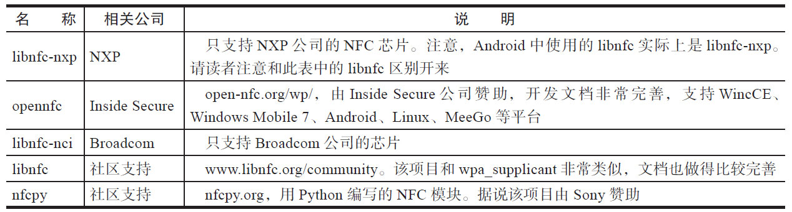
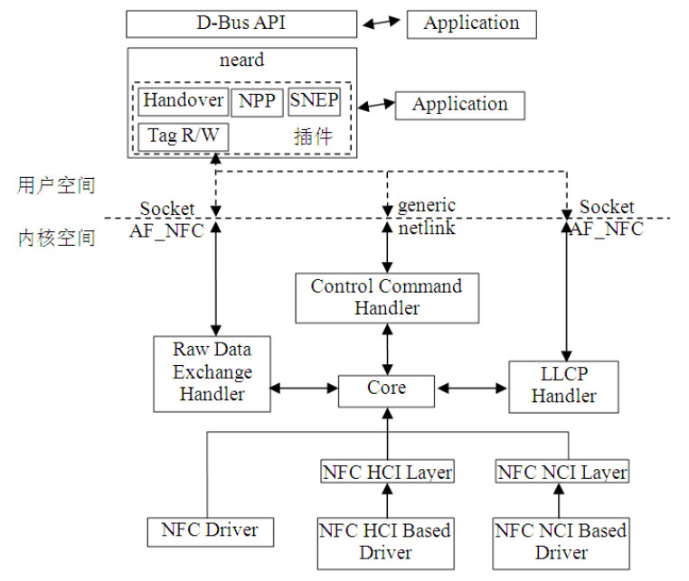

# 8.4 NFC HAL层讨论

Android在Hardward目录下为NFC定义了一个nfc.h头文件用于支持NFCHAL操作，但读者如果看过libnfc或libnfc-nci代码会发现，libnfc和libnfc-nci没有太多使用nfc.h定义的接口，而是大量引用各自公司定义的一套API。这种做法无可厚非，但它使得其他更上层的模块很难做到与底层平台或硬件解耦合。

相信图8-26已经让读者直观感受到到这种做法恶果了。

注意与NFC这种状况形成鲜明对比，本书前面浓墨重彩介绍的Wi-Fi模块，借助nl80211机制或历史更悠久的wirelessextensionAPI解决了上层模块与底层平台或硬件的解耦合问题。

表8-13列举了当前知名的几个NFCHAL层实现。

表8-13NFCHAL实现情况

笔者研究了表8-13中的除nfcpy之外的几个NFCHAL层模块代码，感觉和wpa_supplicant比起来还是有一定差距。不过，根据参考资料[21]和[26]的介绍，未来Linux系统中，NFC整个软件架构将变成如图8-42所示。

图8-42NFC软件架构展望图8-42中，用户空间运行一个名为neard的NFCDaemon进程，它通过AF_NFCsocket以及GenericNetlink机制和内核空间的NFC子系统通信。neard通过不同的插件来支持NFC的协议，例如Handover、NPP、SNEP等。

内核空间中，NFC子系统包括ControlCommandHandler、LLCPHandler、RawDataHandler以及Core等核心模块。

不同NFC芯片厂商只要实现相关的NFC驱动即可。至于Core模块如何与NFC驱动交互，则可使用基于NFCForum定义的NCI规范（抽象为NFCNCILayer）​、HCI规范（抽象为NFCHCILayer）​，或者直接操作NFCDriver。

提示在此，笔者希望NFC软件架构尽快完善，同时也希望国内的公司能积极参与到这一过程中来以提高我们的话语权。
