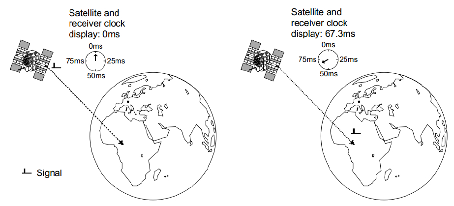
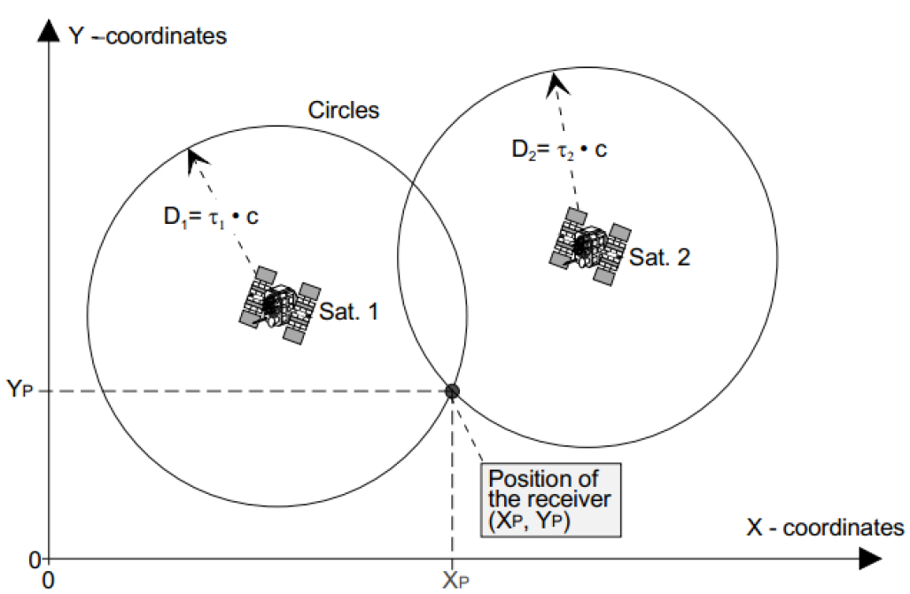
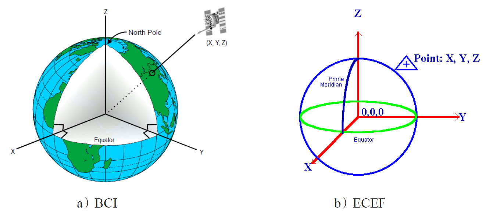
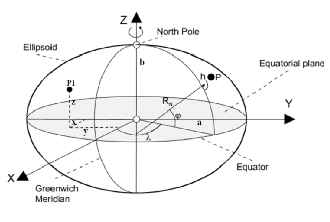
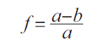
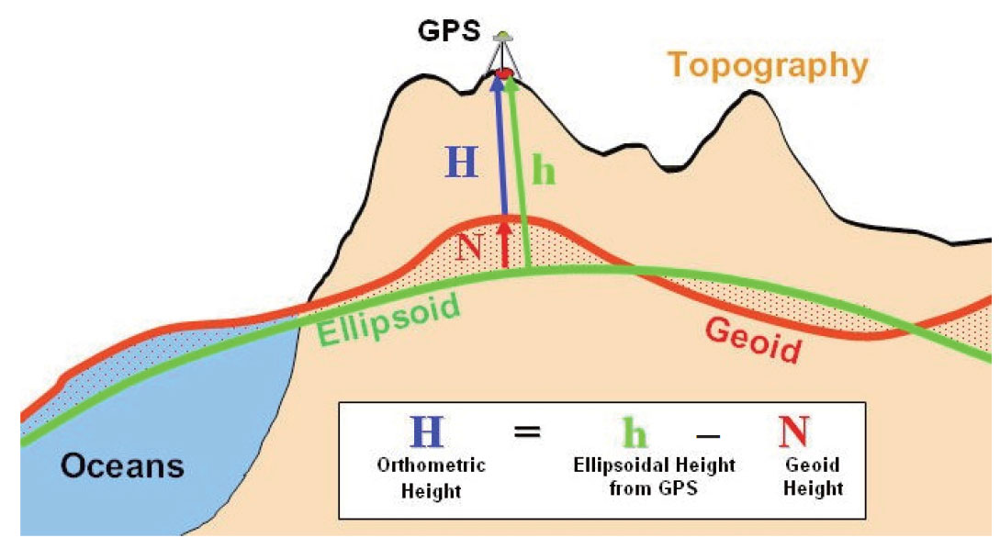
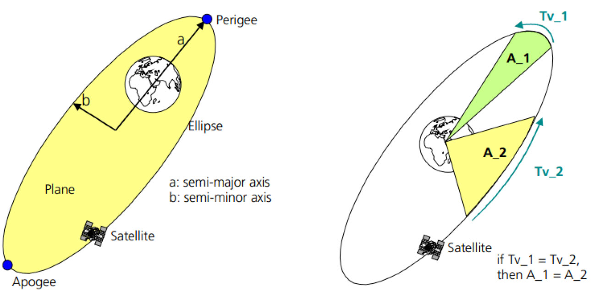
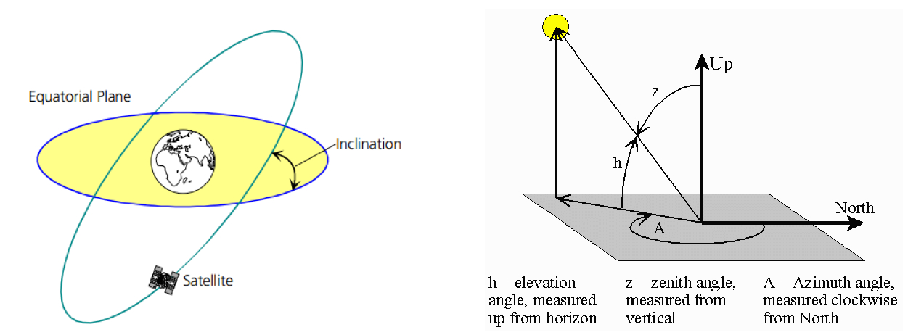
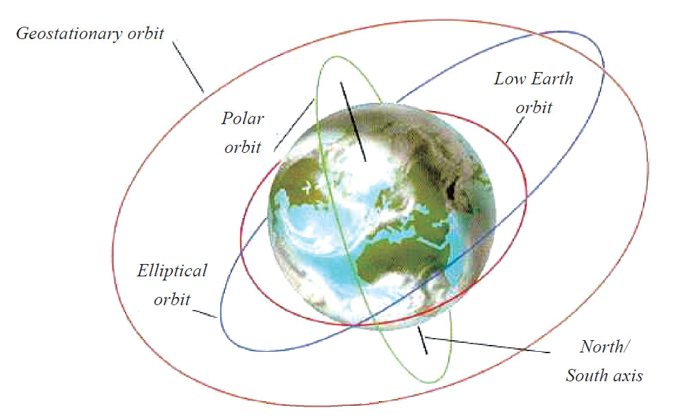

# 9.2.1 卫星导航基本原理

本节介绍测距、参考坐标系、时间系统、卫星轨道四个方面的基础知识。

[2]1.测距原理GPS（包括其他的GNSS系统）使用的测距原理非常简单，它的工作过程如图9-1所示。

图9-1卫星测距原理如图9-1所示，卫星和地面接收器各自有一个时钟。假设卫星和接收器的时钟能完美同步（注意这个假设，以后我们还会讲到它）​。在0ms时刻，卫星向接收器发送了一串信号。在67.3ms时，接收器收到了该信号。卫星离接收器的距离就是信号传播速度乘以传播时间。

用公式一来表示图9-1的卫星测距原理。

[公式一]D=Δτ*c该公式中，c为光速，Δt为信号传输时间，D为距离。

有了公式一，我们可以计算接收器到任意卫星的距离。不过，距离（Range）和位置（Location）显然是两个不同的概念。如何根据距离得到位置信息呢？

原来，位置需要放在某个坐标系中来考察，下一节将专门讨论坐标系。假设现在已经有一个坐标系，图9-2就能回答刚才提出的问题。

和图9-1比起来，图9-2有如下特点。

❑卫星和接收器的位置都置于一个统一的二维坐标系中来考察。

❑接收器离两个卫星的距离都由公式一计算得到，分别是D和D。

12❑如果以卫星为圆心，以接收器到卫星的距离为半径，可以得到图9-2中的两个圆。这两个圆的相交点到卫星1的距离为D，到卫星2的1距离为D。也就是说，这两个点就是接收器2的可能位置。

❑如果接收器的Y坐标值不能高于卫星的Y坐标值，接收器的实际位置只能是图9-2中的（X，Y）​。

pp

图9-2二维坐标系中接收器位置计算示意图掌握了二维坐标系中接收器的位置计算方法，只要再增加一颗卫星，就很容易推导出接收器在三维坐标系中的位置了。

从理想情况来说，定位（Positioning）计算就这么简单，但现实情况却相当复杂。例如，在上述的讨论中还有两个重要的潜在问题没有解决。

❑如何选择坐标系？

❑出于成本、便携性等各方面的考虑，接收器的时钟精度远不如卫星的时钟精度，所以在计算信号传输时间时会造成较大的偏差。由于信号传播速度是光速，所以哪怕这个时间偏差为0.1ms，距离偏差都会达到30km。

这两个问题如何解决的呢？下两节将分别介绍坐标系和时间系统。时间偏差的问题则通过引入第四颗GPS卫星参与定位计算来解决（详情见9.2.2节）​。

2.坐标系[2]（1）ECI/ECEF/WGS-84根据上一节的内容可知，坐标系对于位置计算非常重要。坐标系有很多个，甚至不同的国家都可能建立更加符合本国实际情况的坐标系。

但在GPS中，相关的坐标系主要有两个。

❑地心惯性坐标系（EarthCenteredInertial，ECI）：用于描述GPS卫星的位置信息。在这种坐标系中，原点为地球的质心，卫星围绕质心运动，并遵守牛顿运动定律。

❑地心地球固连坐标系（EarthCentered，EarthFixed，ECEF）：用于描述地面接收器的位置信息。ECEF最大的特点是它会随着地球而旋转。

提示在GPS的定位计算过程中，需要先把卫星在ECI坐标系的位置转换成它在ECEF坐标系的位置。

图9-3展示了ECI和ECEF坐标系。

图9-3ECI和ECEF坐标系ECI坐标系中，XY平面与地球赤道面重合。X轴指向天球（CelestialSphere，一种假想的无限大的球，它和地球同心。所以ECI坐标系不受地球旋转的影响）的某个位置。Z轴与XY平面垂直并指向北极。ECI坐标系属于笛卡尔坐标系，故卫星的位置由（X，Y，Z）表示。

ECEF坐标系的原点为地球中心（这就是EarthCentered一词的缘由）​。XY平面也与地球赤道面重合。不过其X轴指向0经度方向，Y轴指向东经90度的方向。所以ECEF坐标系实际上是随着地球一起旋转的。ECEF坐标系也属于笛卡尔坐标系，故接收器的位置也由（X，Y，Z）表示。

ECEF是一个笛卡尔坐标系，而我们实际使用的位置信息却是由经纬度来表示的，如何将笛卡尔坐标系中的X，Y，Z值转换成经纬度呢？

该转换工作涉及另外一个重要的概念，即标准地球模型。GPS参考的地球模型为WGS-84（WorldGeodeticSystem1984，由美国国防部建立）​。WGS-84模型如图9-4所示。

图9-4WGS-84模型图9-4所示的标准大地模型中，地球被看做一个椭球体。该椭球体的半长轴（SemiMajorAxis，实际长度为6378137.00m）为a，半短轴（SemiMinorAxis，实际长度为6356752.31m）为b。根据a和b的值，该椭球体的偏心率（Eccentricity）可由以下公式计算得到。

图中的EquatorialPlane为赤道面。赤道面和椭球体相交得到的椭圆为赤道（Equator）​，它就是纬度为0的地方。图中的GreenwhichMeridian为格林尼治子午线，即经度为0的地方。椭球体的表面叫椭球面，即图中的Ellipsoid。

图中的P1点的位置采用了笛卡尔坐标系，其值为（x，y，z）​，而P点的位置则由椭球坐标系确定，其值为（φ，λ，h）​。注意，此处的h是P点与椭球面的高度，即GPS概念中的高度。

[2]根据相关的公式，椭球坐标系和笛卡尔坐标系能相互转化。

（2）高度计算根据上节关于椭球坐标系中h坐标值的解释，GPS中的高度是指它和椭球面（Ellipsoid）的距离。但值得特别注意的是，这个高度和日常生活中所说的海拔高度不是同一个概念。日常生活中所说的海拔高度不是基于Ellipsoid，而是基于大地水准面（Geoid）的。

大地水准面是一个重力等位面。简单点说，静止海水在大地水准面上不会因为重力原因而流动。大地水准面和地球的质量分布等有重要关系。相比椭球面而言，大地水准面的数学模型非常复杂，很难用数学公式来描述。

大地水准面和椭球面之间的区别影响了我们对高度的计算。图9-5所示为GPS高度与海拔高[3]度的区别。

图9-5高度计算的区别图9-5中，地球真实的表面由大海和高山组成，这个表面叫地形（Topography）​。

GPS测量的高度（也叫大地高，EllipsoidalHeight）为h，而日常所说的海拔高度（也叫正高，OrthometricHeight）为H。h和H之间的差（也叫大地水准面高，GeoidHeight）为N。

注意对于高精度的测绘需求，往往需要把h值转换成H，不过一般情况下二者的差别不大。

了解了GPS的坐标系统，马上来看与GPS相关的另外一个非常重要的系统。

3.时间系统和GPS相关的时间系统有四种，分别是国际原子时（InternationalAtomicTime，IAT，注意，其对应的法语名为TempsAtomiqueInternational，所以其常用缩写也为TAI。笔者此处采用英文缩写IAT）​、协调世界时间（CoordinatedUniversalTime，UTC）​、GPS时间（GPSTime，GPST）和本地时间（LocalTime）​。四种时间系统的特点如下。

（1）IAT1967年，人们利用铯原子振荡周期极为规律的特性研制出了高精度的原子钟，并将铯原子能级跃迁辐射9192631770周所经历的时间定为1s。IAT起始时间从1958年1月1日0时0分0秒开始，其精度能达到每日数纳秒。细心的读者可能会问到，在原子钟出现之前，人们如何定义秒呢？原来，在原子钟出现之前，人们使用基于地球自转的天文测量得到的世界时（UniversalTime，UT）作为时间计量单位。和原子时比起来，UT会由于地球自转的不稳定（由地球物质分布不均匀和其他星球的摄动力等引起的）而带来时间上的差异，该差异大概在三年内会增加到1s左右。

（2）UTC也叫世界统一时间、世界标准时间。TAI的精度为每日数纳秒，而UT的精度为每日数毫秒。对于这种情况，​“协调世界时”于1972年面世。UTC以原子秒长为基础，在时刻上尽量接近UT。UT和UTC之间的间隔不能超过0.9s，所以在有需要的情况下会在UTC内加上正或负闰秒（Leapsecond）​。因此，协调世界时与国际原子时之间会出现若干整数秒的差别，而位于巴黎的国际地球自转事务中央局将决定何时加入闰秒以减少UTC和IAT之间的差别。UTC时间系统用途很广。目前几乎所有国家发播的时号都以UTC为基准。另外，互联网使用的网络时间协议（NetworkTimeProtocol，NTP）获取的时间就是UTC。UTC的时间格式为：年（y）月（m）日（d）时（h）分（min）秒（s）​。

（3）GPSTGPST也使用IAT中的原子秒为单位，其时间原点定于1980年1月6日UTC0时。GPST比IAT慢19s，而它和UTC时间的差异为整数秒，并且这个差值会随着时间的增加而积累（2009年，GPST和UTC相差15s）​。GPST时间格式由从GPST原点开始的周数和周内秒数组成。

例如2009年7月9日13点08分36秒（转成时分秒格式的GPST）用GPST表示就是第1539周392916秒。参考资料[5]介绍了GPST和UTC的转换方法。

[6]（4）本地时间本地时间基于UTC。它将全球分为24个时区，每一时区之中心为相隔15度经线，每一国家都处于一个或以上的时区内。第一时区的中心位于格林尼治子午线（简称子午线）​。该时区以西的地方慢一小时或以上，而东面则较其快。本地时间表达方法遵循ISO8601，其格式为“年月日T时分秒Z（或者时区标识）​”​。例如，20131030T093000Z，表示2013年10月30日09点30分0秒，Z表示标准时间。北京时间，就是20131030T093000+08，其中“+08”表示东八区。

提示以上是本书和时间系统相关的知识。

这部分内容原本非常复杂，还涉及较多天文方面的概念。在此，建议读者先掌握本节所述内容。

4.卫星轨道相关知识本节将介绍卫星轨道等方面的知识。首先是卫星运行所遵循的开普勒三定律。

（1）开普勒三定律卫星围绕地球运行时将遵循开普勒三定律。图9-6所示为开普勒第一和第二定律的示意图。

图9-6开普勒第一和第二定律左图所示为开普勒第一定律。图中的Perigee为近地点，Apogee为远地点。根据开普勒第一定律，卫星将围绕地球做椭圆运动，地球为该椭圆两个焦点中的一个。

右图所示为开普勒第二定律。根据开普勒第二定律，在相同的时间内，卫星运行时所扫过的区域的面积相同。即如果图中的时间段Tv_1等于时间段Tv_2，面积A_1等于面积A_2。

根据开普勒第三定律可知，围绕地球椭圆轨道运行的卫星，其椭圆轨道半长轴的立方与运行周期的平方之比为常量。第三定律可用公式二表达。

[公式二]开普勒第三定律中，a为半长轴，T为卫星运行周期，k为常量，取值为。其中，M为地球的质量，G为万有引力常数。

开普勒三定律主要用来计算卫星运行位置等相关参数，例如第三定律常用来计算卫星的轨道高度。这部分内容见参考资料[7]​。

（2）卫星轨道及星历卫星轨道虽然涉及很多空间科学方面的知识，但对于本书来说，我们只需掌握卫星运行轨道的几个重要参数和概念即可。图9-7展示了卫星运行轨道及相关参数。

图9-7卫星运行轨道左图中，EquatorialPlane为赤道平面，卫星轨道本身是一个椭圆轨道，它和赤道平面有一个夹角。这个夹角叫轨道倾角（图中的Inclination）​。右图中，假设观察者站在坐标原点观察左上角的卫星，则h代表仰角（Elevationangle）​，z代表天顶角（Zenithangle）​，而正北方向离卫星投影点的顺时针角度A为方位角（Azimuthangle）​。

提示上述参数是卫星运行轨道中几个非常重要的参数，不过，读者现在只需要记住它们的定义即可。

根据轨道倾角、运行周期等参数，人们将卫星轨道分为如图9-8所示的几大类。

图9-8卫星轨道分类1）地球同步轨道（GeosynchronousEarthOrbit，GEO）：特点是其轨道高度距离地面大约35786km，卫星运行周期等于地球自转周期（23小时56分4秒）​，卫星运行方向和地球自转方向一致。最后，轨道是圆形（即偏心率为0）​。根据轨道倾角的不同，地球同步轨道还可细分为静止同步轨道、倾斜同步轨道和极地同步轨道。这三者的特点如下文所述。

❑静止同步轨道（GeostationarySatelliteOrbit，GSO）​：如果轨道面与地球赤道面重合（即轨道倾角为0）​，则这种轨道叫静止同步轨道。该轨道的特点是：从地面观察者看到该轨道上的卫星始终位于某一位置，似乎保持静止不动。利用该轨道上的3颗卫星就可以实现除南北极很小一部分地区外的全球通信。

❑倾斜同步轨道（InclinedGeostationaryOrbit，IGSO）​：如果轨道倾角大于0并小于90度，这种轨道叫倾斜同步轨道。

❑极地同步轨道（PolarEarthOrbit，PEO）​：如果轨道倾角等于90度，称为极地同步轨道。运行在这种轨道上的卫星能到达南北极区上空，所以那些需要在全球范围内进行观测和应用的气象卫星等多采用这种轨道。

2）中地球轨道（MediumEarthOrbit，MEO）：也叫中圆轨道，距离地面10000km，卫星运转周期在2至12小时之间。运行在该轨道上的卫星大部分是导航卫星，例如GPS导航卫星有一部分运行在该轨道上。

3）低地球轨道（LowEarthOrbit，LEO）：也叫近地轨道或低地轨道，距离地面大约1000km。由于近地轨道离地面较近，绝大多数对地观测卫星、测地卫星、空间站都采用近地轨道。

4）高椭圆轨道：是一种具有较低近地点和极高远地点的椭圆轨道，其远地点高度大于静止卫星的高度（36000km）​。根据开普勒定律，卫星在远地点附近区域的运行速度较慢，因此这种极度拉长的轨道的特点是卫星到达和离开远地点的过程很长，而经过近地点的过程极短。这使得卫星对远地点下方的地面区域的覆盖时间可以超过12小时。具有大倾斜角度的高椭圆轨道卫星可以覆盖地球的极地地区，所以对于像俄罗斯这样的高纬度国家而言，高椭圆轨道比同步轨道更有实际作用。

以上是卫星运行轨道的几个重要参数，除此之外，还有两个重要概念需要读者了解。

❑星历表（Ephemeris）​：本来用来记录天体特定时刻的位置的。而在GNSS中，星历表则记录了卫星的一些运行参数，它使得我们通过星历表就可以计算出任意时刻的导航卫星的位置和速度。下文我们将见到在GPS中，星历表包含了非常详细的卫星轨道和位置信息，所以其数据量较大，传输时间较长。为了克服这个问题，人们设计了星历表的简化集，即历书。

❑历书（Almanac）​：包含卫星的位置等相关信息，不过它是星历数据的简化集，其精度较低。所以，历书数据量较小，传输时间较短。

提示星历和历书对于GPS定位计算来说至关重要。本章后文将介绍二者所包含的参数信息。

至此，本书所涉及的与卫星导航原理相关的知识介绍就告一段落，这些内容对于讲解本章知识点来说已经足够。但本节所述内容仅仅是卫星导航全部知识的一小部分，有志从事卫星导航工作的读者还需要进一步花费时间来学习相关的专业知识。
